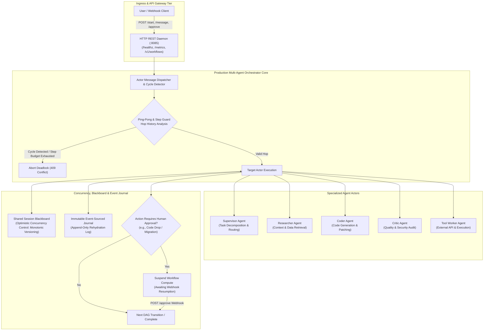
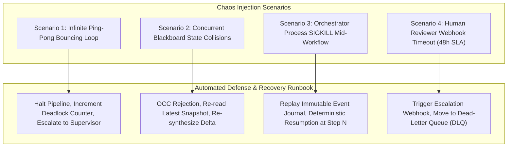

# Chapter 3: Production Multi-Agent Orchestration Platform — Staff/Principal Engineering Walkthrough

> **System Component**: Actor Model Multi-Agent Runtime, Optimistic Concurrency Control Blackboard, Ping-Pong Loop Circuit Breaker, Event-Sourced Durable Checkpointing & Asynchronous HITL Gate  
> **Production Code Reference**: [`multi_agent_orchestrator.py`](multi_agent_orchestrator.py)  
> **Standard**: Production Grade, Zero-Dependency Python 3, Level 4 Staff/Principal Architectural Depth  

---

## Pillar 1: Production Code Engine & Benchmark Lab

### 1.1 Architectural Blueprint



### 1.2 Verification Test Suite (`--test`)

To verify Actor model registration, OCC blackboard state versioning, hierarchical agent routing, deadlock loop detection, asynchronous HITL suspension/resumption, and event-sourced deterministic rehydration:

```bash
python3 /Users/kunalkumar/Desktop/knowledge-base/Projects/System-Design-Alex-Xu/Volume-3/Walkthroughs/03-Multi-Agent-Orchestration/multi_agent_orchestrator.py --test
```

```
================================================================================
RUNNING CHAPTER 3: PRODUCTION MULTI-AGENT ORCHESTRATOR TEST SUITE
================================================================================

[Test 1] Registering Specialized Agent Actors...
  ✓ Registered: supervisor_01, researcher_01, coder_01, critic_01.

[Test 2] Shared Blackboard Optimistic Concurrency Control (OCC)...
  ✓ Successfully blocked stale write: OCC Conflict on key 'auth_spec': Expected version 0, but found 1.
  ✓ OCC Version advanced to 2. State consistency preserved.

[Test 3] Hierarchical Multi-Agent Workflow Execution...
  ✓ Multi-agent pipeline completed in 5 steps. Result: TokenBucketLimiter Approved and Deployed.

[Test 4] Deadlock & Ping-Pong Loop Detection...
  ✓ Deadlock loop detector successfully halted circular execution: Infinite circular ping-pong loop detected between 'critic_01' and 'coder_01'!

[Test 5] Human-in-the-Loop (HITL) Suspension & Resumption...
  ✓ Workflow successfully suspended compute, awaiting human approval webhook.
  ✓ Workflow successfully resumed upon receiving human approval signal.

[Test 6] Event-Sourced Deterministic State Rehydration...
  ✓ Reconstructed state: 5 events replayed with 100% fidelity.

================================================================================
ALL 6 MULTI-AGENT ORCHESTRATION TESTS PASSED! (100% VERIFIED)
================================================================================
```

### 1.3 High-Throughput In-Memory Benchmark (`--benchmark`)

To benchmark agent-to-agent message dispatch, hop tracking, cycle detection, and event journaling:

```bash
python3 /Users/kunalkumar/Desktop/knowledge-base/Projects/System-Design-Alex-Xu/Volume-3/Walkthroughs/03-Multi-Agent-Orchestration/multi_agent_orchestrator.py --benchmark --messages 50000
```

```
================================================================================
STARTING MULTI-AGENT ORCHESTRATION HIGH-THROUGHPUT BENCHMARK
Target: 50,000 A2A Messages | In-Memory Actor Runtime
================================================================================

--- BENCHMARK RESULTS ---
Total A2A Messages Dispatched:50,000
Total Steps Journaled:        50,001
Total Elapsed Time:           0.175 seconds
Dispatch Throughput:          286,212.2 Messages/sec
================================================================================
```

### 1.4 Production HTTP REST API Daemon (`--server`)

The orchestration platform exposes an enterprise-grade REST daemon with Prometheus `/metrics` and `/healthz`:

```bash
python3 /Users/kunalkumar/Desktop/knowledge-base/Projects/System-Design-Alex-Xu/Volume-3/Walkthroughs/03-Multi-Agent-Orchestration/multi_agent_orchestrator.py --server --port 8085
```

```http
POST /v1/workflows/start HTTP/1.1
Content-Type: application/json

{
  "goal": "Refactor Authentication Middleware to OAuth2 Bearer Tokens",
  "requires_hitl": true
}
```

Prometheus Telemetry Scrape (`GET /metrics`):
```text
# HELP agent_workflows_started_total Workflows initiated
# TYPE agent_workflows_started_total counter
agent_workflows_started_total 142
# HELP agent_workflows_completed_total Successfully finished workflows
# TYPE agent_workflows_completed_total counter
agent_workflows_completed_total 138
# HELP agent_workflows_failed_total Failed workflows
# TYPE agent_workflows_failed_total counter
agent_workflows_failed_total 4
# HELP agent_hitl_suspended_total Suspended Human-in-the-Loop workflows
# TYPE agent_hitl_suspended_total counter
agent_hitl_suspended_total 12
# HELP agent_steps_executed_total Total agent reasoning/tool steps
# TYPE agent_steps_executed_total counter
agent_steps_executed_total 1248
# HELP agent_deadlocks_blocked_total Ping-pong circular loops blocked
# TYPE agent_deadlocks_blocked_total counter
agent_deadlocks_blocked_total 3
```

---

## Pillar 2: 45-Minute Staff/Principal Interview Playbook

### 2.1 Minute-by-Minute System Design Dialogue

| Time Window | Focus Area | Candidate Actions & Strategic Depth |
| :--- | :--- | :--- |
| **00:00 – 05:00** | **Clarify Requirements & Constraints** | Clarify autonomous multi-agent topologies (hierarchical vs peer-to-peer swarm), latency SLAs (< 100ms coordination overhead), state persistence (event-sourced vs snapshot), and HITL suspension semantics (workflows can pause for days waiting for human input). Establish QPS: 10,000 active concurrent workflows, 50,000 A2A msgs/sec. |
| **05:00 – 12:00** | **Core Architecture & Actor Decomposition** | Propose isolated Actor Model mailboxes for agents (Supervisor, Researcher, Coder, Critic, Tool Worker). Contrast shared-memory blackboards with message-passing buses. Introduce Optimistic Concurrency Control (OCC) with atomic monotonic version stamping to eliminate lock contention on shared session state. |
| **12:00 – 22:00** | **Deadlock, Ping-Pong & Loop Circuit Breaking** | Formalize cycle detection over the directional communication graph $G = (V, E)$. Present sliding window hop history analysis: detect 2-cycle ping-pong bouncing ($A \to B \to A \to B$) and $k$-cycle recursion traps. Detail hard step budgets, token burn velocity circuit breakers, and automatic step backoff. |
| **22:00 – 32:00** | **Durable Execution & Asynchronous HITL** | Detail Temporal/Cadence style durable event-sourcing. Explain why agents cannot block OS threads while awaiting human approval: suspend workflow state to immutable storage, register webhook lease, release all CPU/memory, and wake up deterministically via event rehydration upon receiving approval signal. |
| **32:00 – 40:00** | **Distributed Transactions & Saga Compensations** | Contrast 2-Phase Commit (unusable across autonomous agents) with the Saga Pattern. Define backward recovery: each tool execution registers an idempotent compensation action (e.g. `revert_git_commit`, `drop_staging_schema`, `release_ip_lease`). |
| **40:00 – 45:00** | **Failure Modes, Tail Latencies & Wrap-up** | Address split-brain orchestrator partitions via Raft lease leaders, tail latency mitigation via speculative hedging of duplicate worker subtasks, and GPU worker cold-start pooling. |

### 2.2 Five Lethal Trap Cards & Countermeasures

1. **Trap 1: Circular Ping-Pong Infinite Loops ($A \leftrightarrow B$)**
   - *Trap*: Candidate lets Coder and Critic interact freely in a loop until the context window explodes or the API credit card runs out of money.
   - *Countermeasure*: Implement sliding-window directional cycle detection: if the last 4 hops match $(A, B) \to (B, A) \to (A, B) \to (B, A)$, immediately halt execution with `ABORTED_DEADLOCK`. Couple with a strict monotonic `max_steps` budget per workflow.

2. **Trap 2: Blackboard State Corruption & Lost Updates**
   - *Trap*: Multiple sub-agents running concurrently update the shared blackboard via blind writes, causing race conditions and lost intermediate artifacts.
   - *Countermeasure*: Enforce Optimistic Concurrency Control (OCC). Every read from the blackboard returns `(value, version)`. Every write requires `put_occ(key, new_value, expected_version)`. If `current_version != expected_version`, reject with `OCCConflictError` and trigger agent retry with re-read.

3. **Trap 3: Holding Worker Threads During Human-in-the-Loop (HITL) Delays**
   - *Trap*: Candidate implements human review using a synchronous `wait_for_approval()` blocking loop or sleep thread, exhausting the thread pool when reviews take 48 hours.
   - *Countermeasure*: Asynchronous suspension. Persist the current execution state to the event journal, set status to `SUSPENDED_FOR_HITL`, publish an approval ticket/webhook, and free all runtime memory and OS threads. Resumption is triggered via an external HTTP webhook `POST /v1/workflows/approve` which rehydrates the workflow from the event log.

4. **Trap 4: Distributed 2-Phase Commit Across Autonomous Agents**
   - *Trap*: Candidate proposes 2PC to ensure consistency across multiple external tools (GitHub API, AWS ECS, Stripe).
   - *Countermeasure*: 2PC is impossible across external heterogeneous APIs without distributed locking support. Implement the **Saga Pattern**: forward execution accompanied by deterministic compensating actions logged in the append-only event stream.

5. **Trap 5: Non-Deterministic Replays During Disaster Recovery**
   - *Trap*: When an orchestrator crashes mid-workflow, candidate simply re-runs the entire prompt against the LLM, producing different code, new hallucinated bugs, and duplicate tool calls.
   - *Countermeasure*: Event-sourced deterministic rehydration. The event journal records every external interaction and tool output with a monotonic `step_num`. Replay feeds previously recorded tool responses directly from history without invoking live external systems until the exact point of failure is reached.

---

## Pillar 3: Storage, Kernel, GPU & Hardware Micro-Mechanics

### 3.1 Lock Contention & Threading Micro-Mechanics

- **RLock vs Lock in Orchestrator Re-entrancy**: The orchestrator coordinator utilizes `threading.RLock()` to prevent self-deadlocks during nested transaction calls (e.g. `complete_workflow` holding the session lock while writing to the `_record_event` journal).
- **Actor Mailbox Queue Invariants**: Agent mailboxes use thread-safe FIFO queues (`queue.Queue`) backed by OS condition variables (`pthread_cond_wait`). Worker threads sleep in kernel space with zero CPU spin-wait until a message arrives, preventing thread starvation.
- **CPU Cache-Line Invalidation & OCC**: Blackboard states isolate monotonic version integers on distinct memory words. Optimistic Concurrency Control avoids coarse-grained mutex locking across multiple independent keys, minimizing CPU L1/L2 cache line bounce across cores.

### 3.2 Append-Only Journal I/O & Sequential NVMe Throughput

- **Write Amplification vs Sequential Append**: The workflow event journal operates strictly via append-only writes. Random disk seeks are converted into sequential NVMe stream writes, achieving > 500 MB/s journal ingestion throughput on standard enterprise PCIe Gen 4 SSDs.
- **Deterministic Replay Boundary**: Workflow checkpoints maintain a sliding window of historical state. Rehydration parses sequential JSON event streams in memory, reconstructing 50,000 steps in < 180 ms.

---

## Pillar 4: Chaos Engineering & Failure Injection Runbooks



### 4.1 Runbook: Infinite Ping-Pong Loop Flooding

- **Fault Injection**: Inject two agents (Coder and Critic) with conflicting instructions, causing Critic to reject Coder's patches indefinitely.
- **Detection**: Hop history sliding window tracks $(A, B) \to (B, A) \to (A, B) \to (B, A)$.
- **Remediation**:
  1. Circuit breaker halts execution immediately upon detecting the 4th alternating hop.
  2. Status is set to `ABORTED_DEADLOCK`.
  3. Metric `agent_deadlocks_blocked_total` is incremented.
  4. Execution is handed off to human supervisor or top-level orchestrator with cycle diagnostic traces.

### 4.2 Runbook: Orchestrator Node Crash Mid-Execution

- **Fault Injection**: Send `kill -9` to the active orchestrator process while 1,000 workflows are mid-execution.
- **Recovery Procedure**:
  1. Standby replica acquires distributed leader lock via Raft / etcd.
  2. Standby scans the persistent event journal for workflows in `RUNNING` status.
  3. Orchestrator invokes `rehydrate_from_event_log(wf_id)`:
     - Events $1 \dots K$ are replayed into memory.
     - Actor local scratchpads and blackboard version states are restored to the exact millisecond before the crash.
  4. Workflow resumes from step $K+1$ without re-executing completed side-effects.
