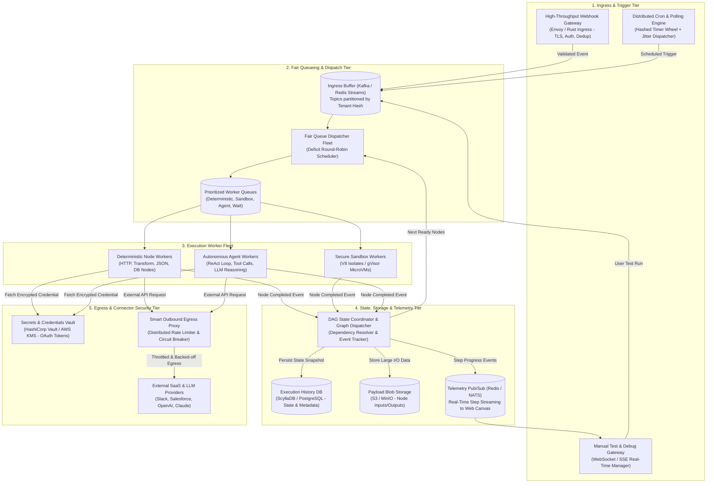
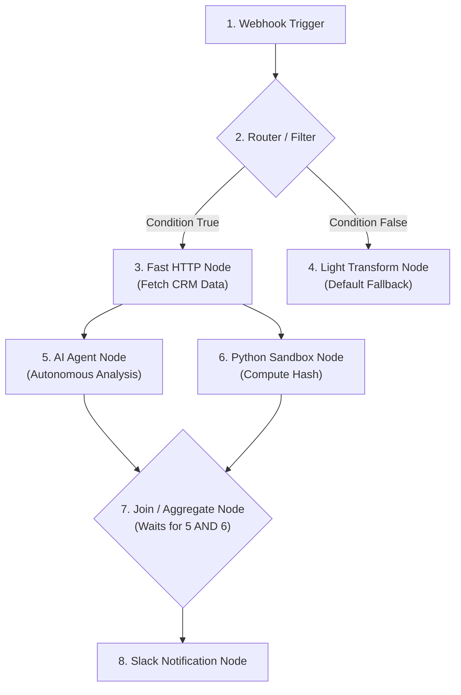
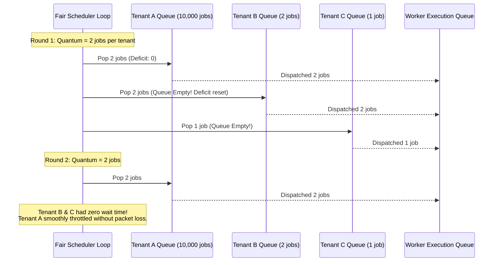
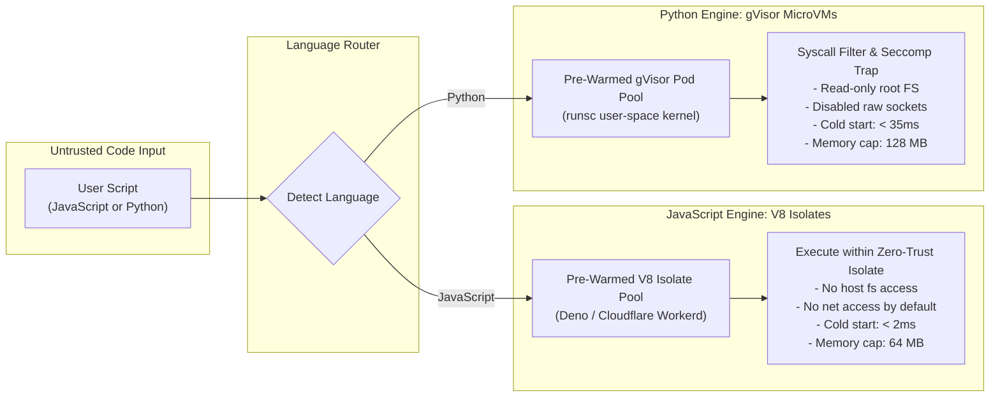
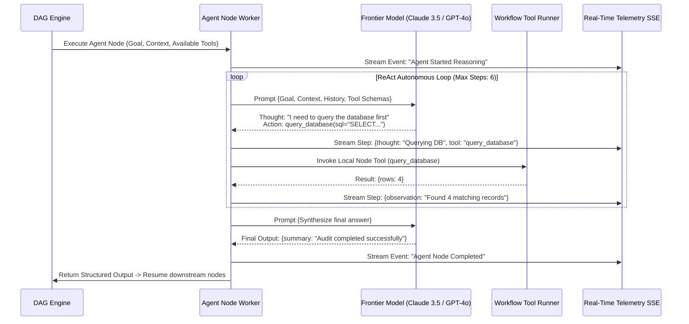
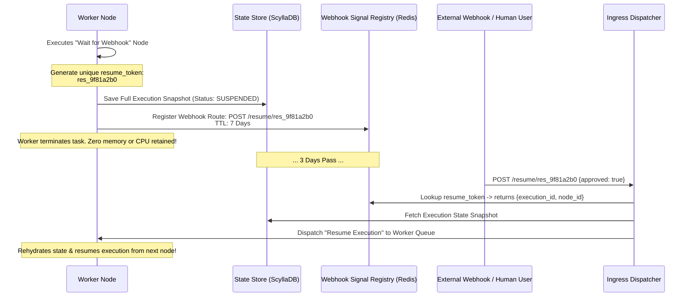
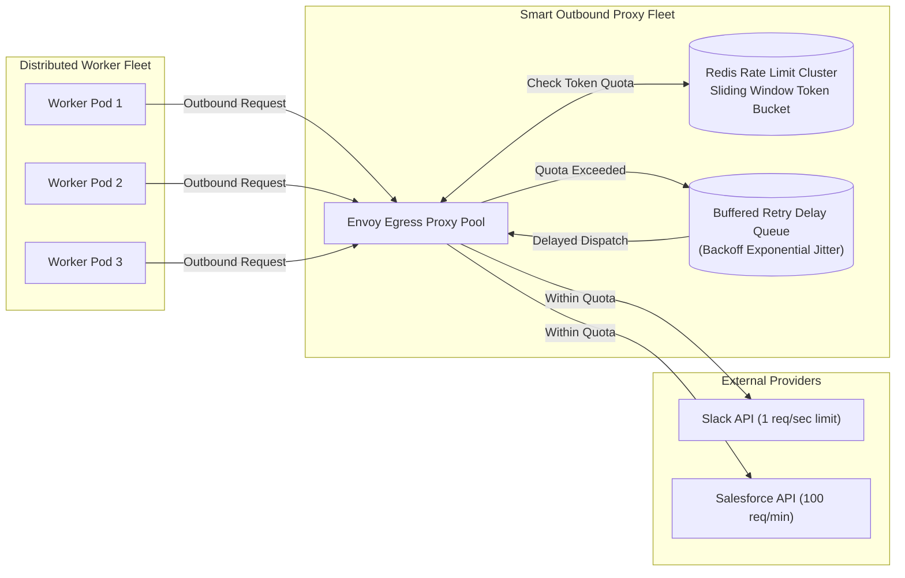

# Design a Scalable Agentic Workflow Runner (n8n / Zapier Architecture)

> [!IMPORTANT]
> **Production Code Engine & Verification Lab**:
> Fully implemented zero-dependency topological DAG compiler, multi-tenant Deficit Round Robin (DRR) fair scheduler, AST secure Python sandbox, autonomous agentic ReAct loop runner, durable pause/resume webhook suspension, and reverse Saga compensation rollback coordinator.
> - **Walkthrough & Staff Playbook**: [`Volume-3/Walkthroughs/04-Agentic-Workflow-Runner/walkthrough.md`](02-Interactive-Interview-Playbook.md)
> - **Production Python Engine**: [`Volume-3/Walkthroughs/04-Agentic-Workflow-Runner/workflow_runner_engine.py`](workflow_runner_engine.py)
> - **Verification Suite**: `python3 workflow_runner_engine.py --test` (100% Passing)
> - **DAG Execution Benchmark**: `python3 workflow_runner_engine.py --benchmark` (130,517.0 Node Steps/sec)

## Problem Statement

Design a production-grade, planet-scale **Workflow Execution Engine and Automation Platform** (analogous to enterprise n8n, Zapier, Make.com, or Temporal-powered low-code automation) where users can construct arbitrary Directed Acyclic Graph (DAG) workflows containing triggers, deterministic API integrations, user-written code sandboxes, and **autonomous AI agent nodes**. 

In modern enterprise architectures, automation has evolved from simple linear triggers (`Webhook -> Filter -> Google Sheets`) into complex **agentic automation graphs** where deterministic business logic seamlessly interweaves with nondeterministic AI reasoning, autonomous multi-step tool loops, dynamic branch evaluation, and long-running human approvals.

A production-grade platform must solve:
1. **High-Throughput Heterogeneous Execution**: Process tens of millions of workflow executions daily, ranging from millisecond webhook filters to multi-hour autonomous agent workflows.
2. **Strict Multi-Tenant Fair Scheduling**: Prevent high-volume tenants (e.g., millions of IoT pings or webhook floods) from starving latency-sensitive mission-critical workflows of other tenants.
3. **Ultra-Fast, Secure User Code Sandboxing**: Execute untrusted user-submitted JavaScript/Python code safely with sub-millisecond cold starts, strict memory/CPU quotas, and air-gapped network policies.
4. **Agentic Node Integration**: Enable workflow nodes to behave as autonomous agents (ReAct loops, dynamic planning, tool selection across other nodes, and memory retrieval) with step-level telemetry streaming.
5. **Durable Pause/Resume & Webhook Resumption**: Suspend workflows waiting for external signals (Slack approvals, 3-day webhook timeouts) with zero idle compute resources.
6. **Distributed Connector Rate Limiting & Secret Governance**: Coordinate API rate limits across thousands of distributed workers accessing shared third-party credentials (e.g., Salesforce, GitHub, Slack) while protecting secrets in hardware-encrypted vaults.

---

## Requirements Clarification

Here is an architectural interview dialogue establishing the system boundaries:

| # | Candidate Clarification Question | Interviewer Answer |
|---|---|---|
| 1 | What is the expected scale of workflow executions? | **50 Million workflow executions/day** (~600 executions/sec avg, peak **3,000 executions/sec**). Average workflow has 8 nodes, meaning **~24,000 node steps/sec at peak**. |
| 2 | What trigger types must be supported? | **Webhooks** (HTTP POST with instant trigger), **Scheduled Crons** (from 1-minute to monthly schedules), **Polling Triggers** (checking external APIs for changes), and **Manual/Test Invocations** from the UI. |
| 3 | What are the execution latency targets? | Webhook ingestion to worker dispatch: **< 150ms (p99)**. Simple deterministic node latency overhead: **< 15ms**. |
| 4 | How do "AI Agent Nodes" differ from regular nodes? | A regular node executes a single atomic operation (HTTP call, JSON transform). An **Agent Node** runs an iterative ReAct reasoning loop with access to tools (API connectors, custom code, sub-workflows), emitting intermediate step events until reaching a final structured output. |
| 5 | How is user-written code handled? | Users can embed custom JavaScript (TypeScript) or Python nodes. Execution must be strictly isolated to prevent host escape, network snooping, or denial of service. |
| 6 | How are long waits (Human-in-the-loop / Delay nodes) handled? | Workflows can sleep for up to **30 days** awaiting a webhook callback or approval. Workers must not block threads or hold connections. |
| 7 | How is tenant fairness guaranteed? | High-throughput tenants must be rate-limited and throttled via **Weighted Fair Queueing (WFQ)** so free/bursting tenants never starve premium paying customers. |

### Functional Requirements

1. **Visual DAG Compiler & Validator**: Compile user-defined visual canvas workflows (JSON DAG of nodes, edges, conditional branches, parallel splits, loops) into an executable dependency graph with cycle detection.
2. **Event-Driven & Scheduled Triggers**:
   - High-performance webhook gateway capable of absorbing burst traffic.
   - Distributed cron and polling engine with jitter and failure backoff.
3. **Hybrid Execution Engine**:
   - *Deterministic Node Runner*: High-speed execution of HTTP requests, data transformations, database queries, and integrations.
   - *Secure Code Sandbox*: Isolated sandbox for untrusted JavaScript/Python code.
   - *Autonomous Agent Node Runner*: Execution of multi-step reasoning agents equipped with tool calling and memory.
4. **Durable State & Long-Running Resumption**:
   - Checkpoint state after every node execution.
   - Asynchronously pause on "Wait for Webhook", "Approval Gate", or "Delay" nodes, releasing all compute resources.
5. **Real-Time Execution Telemetry**: Stream step-by-step node execution status, input/output data diffs, and agent reasoning traces back to the web canvas via Server-Sent Events (SSE) or WebSockets.
6. **Connector Credential Vault & Rate Limiter**: Secure credential management with automatic OAuth2 token refresh and distributed outbound rate limiting per connector domain.

### Non-Functional Requirements

- **Reliability & Idempotency**: At-least-once execution guarantee with node-level idempotency keys to prevent duplicate side effects (e.g., charging a card twice on retry).
- **Tenant Isolation & Security**: Multi-tenant data segregation, zero-trust secrets injection, and sandboxed code execution isolated from the host OS and metadata services.
- **Elastic Scalability**: Independent auto-scaling for Webhook Ingress, Scheduling, Deterministic Workers, Sandbox Workers, and Agent Workers.
- **High Observability**: Distributed tracing (OpenTelemetry) spanning trigger ingestion, queue transitions, node executions, and outbound external API calls.

---

## Back-of-the-Envelope Estimation

```
1. Execution Throughput:
   - Daily workflow executions: 50 Million runs/day
   - Average execution rate: 50,000,000 / 86,400 = ~580 executions/sec
   - Peak execution multiplier: 5x
   - Peak workflow executions: ~3,000 executions/sec
   - Average nodes per workflow: 8 nodes
   - Peak node steps throughput: 3,000 * 8 = 24,000 node steps/sec

2. Data Payload & Storage Sizing:
   - Average trigger payload (webhook JSON): ~5 KB
   - Average intermediate node data (inputs + outputs + context): ~10 KB per node
   - Total execution log per run: 5 KB + (8 nodes * 10 KB) = ~85 KB
   - Daily raw execution data: 50M runs * 85 KB = 4.25 TB/day
   - 30-Day execution history retention: 4.25 TB * 30 = ~127.5 TB
   - Storage Strategy: Hot state & metadata in ScyllaDB/PostgreSQL (~15 TB); 
     Cold node payload blobs (inputs/outputs) offloaded to S3/Cloud Storage (~112 TB).

3. Sandboxed Code Execution Capacity:
   - Estimated 20% of workflows contain a custom Code Node (JS/Python):
     50M * 0.20 = 10 Million code executions/day (~116 executions/sec avg, 600 exec/sec peak).
   - Using lightweight V8 Isolates (Deno/Workerd) with ~5ms execution overhead:
     A 16-core worker node can handle 2,000 isolate runs/sec.
     Total sandbox worker nodes required: ~5-10 nodes (with N+2 redundancy).

4. Autonomous Agent Node Capacity:
   - Estimated 5% of workflows contain an AI Agent Node:
     50M * 0.05 = 2.5 Million agent node runs/day (~30 runs/sec avg, 150 runs/sec peak).
   - Average steps per agent node: 4 reasoning/tool steps.
   - Peak LLM queries from agents: 150 * 4 = 600 LLM calls/sec.
   - Model Gateway must handle connection pooling, token budgeting, and fallback routing for 600 req/sec.
```

---

## Key Architectural Decisions: Evolutionary Trade-Offs

```mermaid
graph TD
    classDef naive fill:#ffebee,stroke:#c62828,stroke-width:1px;
    classDef intermediate fill:#fff8e1,stroke:#f57f17,stroke-width:1px;
    classDef battleTested fill:#e8f5e9,stroke:#2e7d32,stroke-width:2px;

    subgraph "1. Graph Execution Engine"
        E1["Monolithic In-Memory Node.js Runner<br/>(Process crash kills all executions)"]:::naive --> E2["Database Polling State Machine<br/>(Heavy DB lock contention, 5s delay)"]:::intermediate
        E2 --> E3["Distributed Event-Driven DAG Dispatcher<br/>(Durable checkpoints + Actor message bus)"]:::battleTested
    end

    subgraph "2. Multi-Tenant Queueing & Fairness"
        Q1["Single Global FIFO Queue (RabbitMQ)<br/>(Noisy neighbor starves other tenants)"]:::naive --> Q2["Static Tiered Queues (High/Med/Low)<br/>(Tenant can still hoard high-priority pool)"]:::intermediate
        Q2 --> Q3["Weighted Fair Queueing (WFQ) + Virtual Tenant Queues<br/>(Deficit Round-Robin, strict SLA isolation)"]:::battleTested
    end

    subgraph "3. User Code Sandbox Architecture"
        S1["In-Process Node.js vm/eval<br/>(Remote code execution, host compromise)"]:::naive --> S2["Ephemeral Docker Containers per Step<br/>(1-2s cold start, massive memory waste)"]:::intermediate
        S2 --> S3["Dual Sandbox: V8 Isolates + gVisor MicroVMs<br/>(Sub-5ms cold start, secure syscall traps)"]:::battleTested
    end

    subgraph "4. Connector Rate Limiting & Secrets"
        C1["Local Worker In-Memory Token Bucket<br/>(Workers stomp external API limits)"]:::naive --> C2["Central DB Rate Limit Counter Table<br/>(Massive write lock contention at 24k QPS)"]:::intermediate
        C2 --> C3["Distributed Redis Cluster + Outbound Proxy Pool<br/>(Global token bucket, transparent backpressure)"]:::battleTested
    end

    subgraph "5. Long-Running Wait & Resumption"
        W1["Thread Sleep / Blocking Connection<br/>(Exhausts worker memory and TCP sockets)"]:::naive --> W2["Cron DB Sweep ('WHERE resume_at <= NOW')<br/>(High query load, 30s resume lag)"]:::intermediate
        W2 --> W3["Distributed Timer Wheel + Webhook Signal Registry<br/>(Zero idle compute, sub-100ms resume wake)"]:::battleTested
    end
```



---

### Decision 1: Graph Execution Architecture

* **Core Goal**: Execute complex DAGs with conditional branching, parallel fan-out, loops, and error handlers without losing state or blocking workers.

| Stage | Strategy | Why It Fails / Bottlenecks at Scale | How Next Scenario Improves It |
|---|---|---|---|
| **Scenario 1 (Naive)** | **In-Memory Monolithic Runner (Early n8n default mode)**<br/>The entire workflow DAG is loaded into a single Node.js process and executed via recursive promise chains. | **Process Crash Catastrophe & Zero Scalability**: If a single node OOMs or the server restarts during a deployment, **all thousands of active executions in memory instantly vanish**. Parallel branches cannot be distributed across different server instances. | Decouples execution steps by persisting state transitions into a database. |
| **Scenario 2 (Intermediate)** | **Database Polling State Machine**<br/>Each node status is saved to a relational database; background workers poll `SELECT * FROM tasks WHERE status = 'READY' FOR UPDATE SKIP LOCKED`. | **Severe Database Bottleneck**: At 24,000 node steps/sec, database row locks and index write churn degrade DB performance to near-zero. Database CPU spikes to 100%, and step transition latency jumps from 10ms to 2–5 seconds. | Employs an event-driven distributed dispatcher with streaming event queues. |
| **Scenario 3 (Production Choice)** | **Distributed Event-Driven DAG Dispatcher (Actor Model / Orchestration Queues)** | **The Winning Architecture**: Workflows are compiled into static topological dependency metadata. When a node completes, an immutable `NodeCompletedEvent` is published to a high-throughput event log (Kafka / Redis Streams). The **DAG Dispatcher** receives the event, evaluates downstream node dependencies, and dispatches newly unlocked nodes as discrete tasks into worker queues. Workers are stateless and horizontally scalable. State snapshots are saved asynchronously to a distributed document store. | **Staff Trade-Off**: Requires distributed state coordination and handling out-of-order execution completions during parallel branches. |

---

### Decision 2: Multi-Tenant Queueing & Fairness

* **Core Goal**: Guarantee that a tenant dumping 500,000 webhooks in 2 minutes does not block other tenants whose critical workflows need immediate sub-second execution.

| Stage | Strategy | Why It Fails / Bottlenecks at Scale | How Next Scenario Improves It |
|---|---|---|---|
| **Scenario 1 (Naive)** | **Single Global FIFO Queue (Simple RabbitMQ / Redis List)**<br/>All incoming execution requests are pushed onto one shared queue; workers pop jobs FIFO. | **The "Noisy Neighbor" Disaster**: If Tenant A triggers 100,000 bulk marketing webhooks, Tenant B’s single password-reset email workflow is queued behind all 100,000 jobs, experiencing a **45-minute delay**. Total SLA failure for 99% of users. | Separates tenants into priority tiers. |
| **Scenario 2 (Intermediate)** | **Static Priority Queues (High / Normal / Low)**<br/>Enterprise tenants get mapped to High, Free tenants to Low. | **Intra-Tier Starvation**: Within the High priority queue, a single enterprise customer running an unexpected data sync will still starve all other enterprise customers in that same queue. | Implements per-tenant fair scheduling algorithms. |
| **Scenario 3 (Production Choice)** | **Weighted Fair Queueing (WFQ) via Deficit Round-Robin (DRR) over Virtual Tenant Queues** | **The Winning Architecture**: Every tenant is allocated a virtual mailbox queue in a partitioned Redis/Kafka cluster. A pool of **Fair Dispatchers** scans virtual queues using Deficit Round-Robin. Each tenant receives a quantum of execution tokens per round based on their subscription tier. If Tenant A floods the queue, its queue buffers safely while the dispatcher alternates service across Tenant B, C, and D. Guarantees bounded latency ($< 200\text{ ms}$) for all tenants regardless of background traffic. | **Staff Trade-Off**: Slightly higher dispatch coordination overhead than raw FIFO queue popping. |

---

### Decision 3: User Code Sandbox Architecture

* **Core Goal**: Run arbitrary JavaScript (TypeScript) and Python code authored by users securely, with millisecond-level execution latency and absolute isolation from host systems.

| Stage | Strategy | Why It Fails / Bottlenecks at Scale | How Next Scenario Improves It |
|---|---|---|---|
| **Scenario 1 (Naive)** | **In-Process Node.js `vm` or `vm2` / Python `exec()`**<br/>Code runs inside the main worker process using language-level sandboxing modules. | **Critical Security Vulnerabilities & RCE**: Node’s built-in `vm` module is explicitly documented as non-secure. Attackers can escape prototype chains (`constructor.constructor('return process')().mainModule.require('child_process').execSync(...)`), access environment variables containing DB passwords, and compromise the host node. | Uses containerization for isolation. |
| **Scenario 2 (Intermediate)** | **Ephemeral Docker Containers per Execution**<br/>Spawn a dedicated Docker container (`docker run --rm ...`) for each code step. | **Prohibitive Latency & Memory Bloat**: Spawning a container takes **800ms to 2.5 seconds** of cold-start latency and consumes 100MB+ RAM per invocation. At 600 code steps/sec peak, the host OS suffers container daemon exhaustion and latency becomes unacceptable for real-time webhooks. | Leverages lightweight V8 Isolates and microVMs. |
| **Scenario 3 (Production Choice)** | **Tiered Sandbox: V8 Isolates (Deno/Workerd) for JS + gVisor/Firecracker MicroVMs for Python** | **The Winning Architecture**:<br/>1. **JavaScript Nodes**: Executed inside **V8 Isolates** (via embedded Deno / Cloudflare Workerd engine). Cold starts are **< 2ms**, memory overhead is ~3 MB per isolate, with zero host filesystem or network access by default.<br/>2. **Python / Heavy Nodes**: Dispatched to pre-warmed **gVisor (`runsc`) user-space kernel containers** or **Firecracker microVMs** with strict seccomp filters, read-only root filesystems, and strict CPU/memory cgroups limits. | **Staff Trade-Off**: Python execution still carries a minor (~50ms) pre-warmed sandbox handover overhead compared to V8 isolates. |

---

### Decision 4: Distributed Connector Rate Limiting & Outbound API Egress

* **Core Goal**: Manage thousands of worker nodes calling external SaaS APIs (e.g., Salesforce, Slack, Google) without breaching per-app or per-tenant rate limits.

| Stage | Strategy | Why It Fails / Bottlenecks at Scale | How Next Scenario Improves It |
|---|---|---|---|
| **Scenario 1 (Naive)** | **Independent In-Worker Rate Limiting**<br/>Each worker node tracks its own local rate limit counter using an in-memory leaky bucket. | **Global Limit Explosion**: If 100 distributed workers each allow 10 req/sec to the Salesforce API, the external API receives **1,000 req/sec**, instantly triggering HTTP 429 errors and temporary account suspensions for the customer. | Centralizes rate limiting in a database. |
| **Scenario 2 (Intermediate)** | **Central Database Rate Limit Counters**<br/>Workers perform atomic updates on a `connector_rate_limits` table in PostgreSQL before making calls. | **Database Hot-Spotting**: High-throughput external API calls create millions of row-level lock updates per minute on popular connector records, bottlenecking the primary database. | Implements a distributed Redis token bucket with an Outbound Egress Proxy. |
| **Scenario 3 (Production Choice)** | **Distributed Redis Sliding Window Token Bucket + Outbound Smart Egress Proxy** | **The Winning Architecture**: All outbound third-party API requests route through an **Outbound Egress Proxy Fleet**. The proxy coordinates rate limits using Redis Cluster Lua scripts implementing a sliding-window token bucket keyed by `(tenant_id, connector_domain)`. When an API quota is reached, the proxy does not fail; it transparently enqueues the request in an internal delay queue or responds with a retry-after signal, handling 429 backoff gracefully without worker intervention. | **Staff Trade-Off**: Adds an extra network hop (~1-2ms) for external requests, easily offset by reliability gains. |

---

## High-Level System Architecture



---

## Low-Level Design & Deep Dives

### Deep Dive 1: The DAG Execution Algorithm & Parallel Fan-Out/Fan-In

A user workflow in the platform is represented as a Directed Acyclic Graph:
$$G = (V, E)$$
where $V$ represents workflow nodes (Triggers, Actions, Code, Agents, Routers) and $E$ represents directed data edges carrying JSON payloads.



#### Topological Node State Machine

Each node $v \in V$ in an active workflow execution transitions through five states:
$$\text{PENDING} \longrightarrow \text{READY} \longrightarrow \text{RUNNING} \longrightarrow (\text{COMPLETED} \mid \text{FAILED} \mid \text{SKIPPED})$$

1. **Dependency Counting on DAG Compilation**:
   During workflow activation, the compiler assigns each node an `in_degree` count:
   $$\text{in\_degree}(v) = |\{u \in V \mid (u, v) \in E\}|$$
2. **Dynamic In-Degree Tracking (Redis Hash)**:
   When an execution starts, a Redis key `exec_deps:{execution_id}` tracks the remaining unfulfilled dependencies:
   ```lua
   -- Decrement dependency counter when upstream node finishes
   local remaining = redis.call('HINCRBY', KEYS[1], ARGV[1], -1)
   if remaining == 0 then
       -- All parents completed! Node is ready to be dispatched
       redis.call('RPUSH', KEYS[2], ARGV[1])
       return 1
   end
   return 0
   ```
3. **Data Passing & Scope Isolation**:
   - Upstream outputs are stored in object storage referenced by `execution_id/node_id.json`.
   - The downstream node receives a combined immutable JSON context:
     ```json
     {
       "$trigger": { "body": { "user_id": 1042 } },
       "$node": {
         "Fetch_CRM_Data": { "status": "active", "tier": "enterprise" },
         "Python_Sandbox": { "calculated_score": 94.2 }
       }
     }
     ```

---

### Deep Dive 2: Multi-Tenant Fair Scheduling Engine (Deficit Round-Robin)

In a multi-tenant cloud environment, free-tier users and enterprise users share worker infrastructure. To prevent queue hogging, the **Fair Queue Dispatcher** uses **Deficit Round-Robin (DRR)**:



#### Deficit Round-Robin Algorithm Specification

```python
class TenantQueue:
    def __init__(self, tenant_id: str, tier_weight: int):
        self.tenant_id = tenant_id
        self.quantum = tier_weight * BASE_QUANTUM  # e.g., Free=2, Pro=10, Enterprise=50
        self.deficit_counter = 0
        self.queue = RedisVirtualList(f"tenant_q:{tenant_id}")

class FairDispatcher:
    def dispatch_cycle(self, active_tenants: list[TenantQueue]):
        for t in active_tenants:
            if t.queue.is_empty():
                t.deficit_counter = 0
                continue
                
            t.deficit_counter += t.quantum
            
            while not t.queue.is_empty():
                job = t.queue.peek()
                cost = job.cost_weight  # Deterministic node = 1, Agent node = 5
                
                if t.deficit_counter >= cost:
                    t.deficit_counter -= cost
                    t.queue.pop()
                    worker_queue.push(job)
                else:
                    # Tenant has exhausted its budget for this round; wait for next round
                    break
```

---

### Deep Dive 3: Ultra-Fast Secure Code Sandboxing

When a user writes a custom Python or JavaScript step, the code must execute with microsecond latency without compromising the host:



#### Isolation Guarantees:
1. **No Raw Socket Creation**: Sandboxes cannot establish outbound network connections unless explicitly permitted via platform environment bindings.
2. **Deterministic CPU Timeouts**: Monitored via Linux `cgroups v2` and `setitimer`. If user code enters an infinite loop (`while(true){}`), the isolate is terminated within **500 milliseconds** with an explicit `ExecutionTimeoutException`.
3. **Zero Host Credential Leakage**: No environment variables from the host worker are injected into the sandbox. Inputs are passed via serialized memory buffers.

---

### Deep Dive 4: Autonomous Agent Nodes Inside Deterministic Graphs

A key differentiator of modern workflow engines is the **AI Agent Node**. Unlike static nodes that execute once, an Agent Node runs an iterative loop:



#### Agent Execution Safeguards
- **Tool Sandbox Boundary**: When the agent calls a tool (e.g., another workflow node or an external API), it does not have raw network access. Calls are proxied through the workflow's internal permission broker.
- **Strict Step Budgeting**: Agent nodes have a hard ceiling on reasoning iterations (default: 5 iterations) and maximum token burn (e.g., 20,000 tokens) to guarantee completion.
- **Streaming Telemetry**: Every intermediate thought and tool observation is streamed over Redis Pub/Sub directly to the user's open browser session.

---

### Deep Dive 5: Durable "Wait for Webhook", Delays & Human Approvals

Workflows frequently encounter nodes that require external time or human triggers:
- *Delay Node*: "Wait 48 hours before sending follow-up email."
- *Approval Node*: "Wait for Manager to click Approve in Slack."
- *Wait for Webhook Node*: "Wait for Stripe `invoice.paid` event for this `customer_id`."



---

### Deep Dive 6: Distributed Connector Rate Limiter & Outbound Proxy

When hundreds of workflows execute concurrently and call APIs like Slack or Salesforce, uncoordinated workers will trigger rate-limit bans (HTTP 429). The **Smart Outbound Proxy** coordinates egress:



#### Sliding-Window Rate Limiting Lua Script
```lua
-- KEYS[1]: rate_limit:tenant_id:domain (e.g. rate_limit:t102:api.slack.com)
-- ARGV[1]: current_timestamp_ms
-- ARGV[2]: window_size_ms (e.g. 1000 for 1 sec)
-- ARGV[3]: max_requests_in_window (e.g. 5)

local current_time = tonumber(ARGV[1])
local window = tonumber(ARGV[2])
local limit = tonumber(ARGV[3])
local clear_before = current_time - window

-- Remove timestamps outside the sliding window
redis.call('ZREMRANGEBYSCORE', KEYS[1], '-inf', clear_before)

-- Count current requests in window
local current_count = redis.call('ZCARD', KEYS[1])

if current_count < limit then
    -- Allow request: add current timestamp
    redis.call('ZADD', KEYS[1], current_time, current_time)
    redis.call('PEXPIRE', KEYS[1], window)
    return {1, 0} -- Allowed, wait 0ms
else
    -- Quota exceeded: calculate time until earliest element expires
    local oldest = redis.call('ZRANGE', KEYS[1], 0, 0, 'WITHSCORES')
    local wait_ms = (oldest[2] + window) - current_time
    return {0, wait_ms} -- Blocked, wait_ms to retry
end
```

---

## Database Schemas & Storage Layout

### 1. Workflows & Versions Table (PostgreSQL)

```sql
CREATE TABLE workflows (
    workflow_id         UUID PRIMARY KEY DEFAULT gen_random_uuid(),
    tenant_id           VARCHAR(64) NOT NULL,
    name                VARCHAR(128) NOT NULL,
    is_active           BOOLEAN DEFAULT FALSE,
    active_version_id   UUID,
    created_at          TIMESTAMP WITH TIME ZONE DEFAULT NOW(),
    updated_at          TIMESTAMP WITH TIME ZONE DEFAULT NOW()
);

CREATE TABLE workflow_versions (
    version_id          UUID PRIMARY KEY DEFAULT gen_random_uuid(),
    workflow_id         UUID NOT NULL REFERENCES workflows(workflow_id) ON DELETE CASCADE,
    version_number      INT NOT NULL,
    dag_definition      JSONB NOT NULL, -- Nodes, edges, configurations, credentials
    compiled_topo_sort  JSONB NOT NULL, -- Pre-compiled dependency matrix
    created_at          TIMESTAMP WITH TIME ZONE DEFAULT NOW(),
    CONSTRAINT uk_wf_version UNIQUE (workflow_id, version_number)
);

CREATE INDEX idx_workflows_tenant ON workflows(tenant_id, is_active);
```

### 2. Execution Run Ledger (ScyllaDB / Cassandra - High Write Throughput)

```sql
-- Partitioned by tenant and month to allow fast writes and predictable data deletion
CREATE TABLE workflow_executions (
    tenant_id           text,
    year_month          text,          -- Format: '2026-09'
    execution_id        uuid,
    workflow_id         uuid,
    version_id          uuid,
    trigger_type        text,          -- 'WEBHOOK', 'CRON', 'MANUAL'
    status              text,          -- 'RUNNING', 'COMPLETED', 'FAILED', 'SUSPENDED'
    started_at          timestamp,
    completed_at        timestamp,
    total_steps         int,
    error_message       text,
    PRIMARY KEY ((tenant_id, year_month), execution_id)
) WITH CLUSTERING ORDER BY (execution_id DESC);

-- Node-level Execution Details
CREATE TABLE execution_steps (
    execution_id        uuid,
    node_id             text,
    step_number         int,
    node_type           text,          -- 'HTTP', 'CODE_V8', 'AI_AGENT', 'ROUTER'
    status              text,          -- 'SUCCESS', 'FAILED', 'SKIPPED'
    duration_ms         int,
    input_payload_url   text,          -- Pointer to S3 blob
    output_payload_url  text,          -- Pointer to S3 blob
    agent_trace_url     text,          -- Pointer to S3 reasoning log if AI Agent
    executed_at         timestamp,
    PRIMARY KEY (execution_id, node_id)
);
```

### 3. Webhook Resume Registry (Redis Cluster)

```
Key: webhook_signal:{resume_token}
Type: Hash
Fields:
  - tenant_id: "t_4091"
  - execution_id: "e_99182a3"
  - node_id: "wait_node_4"
  - expires_at: 1789218200
```

---

## Operational Excellence & Failure Modes

### 1. Webhook Stampede / Thundering Herd
* **Failure Mode**: An external service (e.g., GitHub or Shopify during Black Friday) fires 100,000 webhooks in 3 seconds to a single customer endpoint.
* **Mitigation**:
  - Webhook Gateway does **not** invoke the execution engine synchronously. It validates the signature, writes the raw event directly to a partitioned **Kafka Ingress Buffer**, and returns `HTTP 202 Accepted` in **< 10ms**.
  - The Fair Dispatcher drains the buffer at a rate controlled by tenant quotas, protecting worker pools from collapse.

### 2. The Zombie Execution (Worker Crashes Mid-Step)
* **Failure Mode**: A worker running a heavy Python node crashes due to an out-of-memory error while holding an active execution lock.
* **Mitigation**:
  - **Distributed Heartbeat Leases**: When a worker claims a step, it acquires a 30-second lease in Redis (`SET lock:step_id worker_id PX 30000 NX`).
  - The worker heartbeats every 10 seconds. If the worker dies, the lease expires. A background **Watchdog Sweeper** reclaims the task, marks the retry attempt (`attempt = attempt + 1`), and assigns it to an alternate worker node.

### 3. Infinite Workflow Loops
* **Failure Mode**: A user creates a cyclic loop or an agent node repeatedly triggers another workflow, creating an exponential execution bomb.
* **Mitigation**:
  - **Compile-Time Cycle Detection**: Tarjan's strongly connected components algorithm blocks loops unless explicitly tagged as a controlled iterate loop.
  - **Runtime Execution Depth Ceiling**: Every execution carries a hop counter (`trace_hops`). If `trace_hops > 50`, the execution halts with `MaxExecutionDepthExceeded`.

---

## Key Takeaways Checklist

> [!summary] Staff-Level Workflow Runner System Design Checklist
> 1. **Decouple Ingress from Execution**: Never execute DAG nodes synchronously within the webhook HTTP handler. Ingest into a distributed event buffer (Kafka/Redis Streams) and acknowledge immediately with `HTTP 202 Accepted`.
> 2. **Enforce Tenant Fairness**: Prevent noisy-neighbor starvation using **Deficit Round-Robin (DRR)** or **Weighted Fair Queueing** over virtual tenant mailboxes.
> 3. **Sandboxing Must Be Tiered**: Use **V8 Isolates** for microsecond JavaScript execution (< 2ms cold start) and **gVisor / Firecracker microVMs** for untrusted Python scripts. Never use in-process `eval()` or `vm2`.
> 4. **Isolate Agent Nodes as Sub-Loops**: Treat Autonomous Agent nodes as controlled ReAct mini-engines with hard step limits (e.g., 5 steps), token budget caps, and real-time SSE telemetry streaming.
> 5. **Zero-Compute Long Waits**: Suspend waiting workflows to a database with unique cryptographic resume tokens; free worker memory instantly and resume deterministically on incoming webhook signals.
> 6. **Centralize Outbound Rate Limits**: Route external API traffic through an Outbound Egress Proxy with a distributed Redis sliding-window token bucket to prevent 429 bans from third-party APIs.
