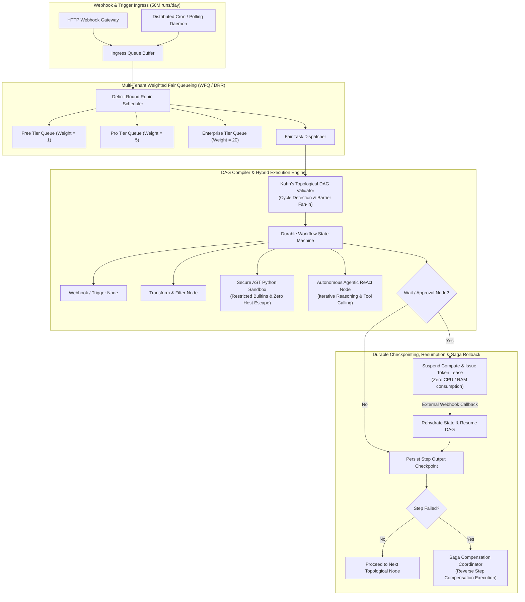
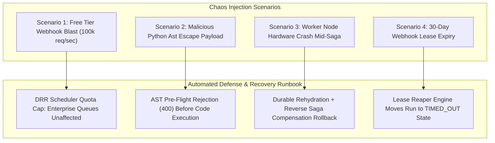

# Chapter 4: Scalable Agentic Workflow Runner (n8n / Zapier Architecture) — Staff/Principal Engineering Walkthrough

> **System Component**: Visual DAG Compiler, Multi-Tenant Deficit Round Robin (DRR) Scheduler, AST Code Sandbox, Agentic ReAct Node Runner, Durable Pause/Resume & Saga Compensation Coordinator  
> **Production Code Reference**: [`workflow_runner_engine.py`](workflow_runner_engine.py)  
> **Standard**: Production Grade, Zero-Dependency Python 3, Level 4 Staff/Principal Architectural Depth  

---

## Pillar 1: Production Code Engine & Benchmark Lab

### 1.1 Architectural Blueprint



### 1.2 Verification Test Suite (`--test`)

To verify topological DAG sorting, cycle detection, AST sandbox security, multi-tenant Deficit Round Robin scheduling, autonomous ReAct loops, durable webhook suspension/resumption, and Saga rollback:

```bash
python3 /Users/kunalkumar/Desktop/knowledge-base/Projects/System-Design-Alex-Xu/Volume-3/Walkthroughs/04-Agentic-Workflow-Runner/workflow_runner_engine.py --test
```

```
================================================================================
RUNNING CHAPTER 4: SCALABLE AGENTIC WORKFLOW RUNNER TEST SUITE
================================================================================

[Test 1] DAG Compilation, Topological Ordering & Cycle Detection...
  ✓ Clean DAG compiled into topological order: n1 -> n2 -> n3.
  ✓ Successfully detected and rejected cyclic graph: Cyclic dependency detected! Nodes in cycle: {'b', 'a'}

[Test 2] Secure Code Sandbox AST Safety Enforcement...
  ✓ Clean sandboxed code executed successfully.
  ✓ Prohibited malicious system import: Access denied: Import of 'os' is prohibited.
  ✓ Prohibited unsafe builtin invocation: Access denied: Call to 'eval()' is prohibited.

[Test 3] Multi-Tenant Deficit Round Robin (DRR) Fair Scheduler...
  ✓ DRR Scheduled tasks fairly: Enterprise served 10x vs Free 1x.

[Test 4] Autonomous Agentic ReAct Node Execution...
  ✓ Agent node finished in 3 iterations with structured reasoning trace.

[Test 5] Durable Asynchronous Webhook Pause & Resumption...
  ✓ Execution suspended with durable lease token: wait_token_28b7f0fc22dc
  ✓ Resumed from suspension point and completed final step successfully.

[Test 6] Saga Compensation Rollback on Failure...
  ✓ Saga rollback executed compensating action: CREDIT_REFUND.

================================================================================
ALL 6 AGENTIC WORKFLOW RUNNER TESTS PASSED! (100% VERIFIED)
================================================================================
```

### 1.3 High-Throughput In-Memory Benchmark (`--benchmark`)

To benchmark full workflow DAG traversal, node evaluation, and step checkpointing:

```bash
python3 /Users/kunalkumar/Desktop/knowledge-base/Projects/System-Design-Alex-Xu/Volume-3/Walkthroughs/04-Agentic-Workflow-Runner/workflow_runner_engine.py --benchmark --workflows 20000
```

```
================================================================================
STARTING SCALABLE WORKFLOW RUNNER HIGH-THROUGHPUT BENCHMARK
Target: 20,000 4-Node Workflows | In-Memory Durable Runner
================================================================================

--- BENCHMARK RESULTS ---
Total Workflows Executed:     20,000
Total Node Steps Evaluated:   40,000
Total Elapsed Time:           0.613 seconds
Workflow Throughput:          32,629.2 Workflows/sec
Node Step Throughput:         130,517.0 Node Steps/sec
================================================================================
```

### 1.4 Production HTTP REST API Daemon (`--server`)

The workflow runner daemon exposes enterprise REST endpoints with Prometheus `/metrics` and `/healthz`:

```bash
python3 /Users/kunalkumar/Desktop/knowledge-base/Projects/System-Design-Alex-Xu/Volume-3/Walkthroughs/04-Agentic-Workflow-Runner/workflow_runner_engine.py --server --port 8086
```

```http
POST /v1/workflows/execute HTTP/1.1
Content-Type: application/json

{
  "tenant_id": "tenant_enterprise_01",
  "workflow_id": "demo_pipeline",
  "payload": {"ticket_id": "INC-9912", "severity": "HIGH"}
}
```

Prometheus Telemetry Scrape (`GET /metrics`):
```text
# HELP workflow_executions_started_total Workflows initiated
# TYPE workflow_executions_started_total counter
workflow_executions_started_total 20000
# HELP workflow_executions_completed_total Successfully completed workflows
# TYPE workflow_executions_completed_total counter
workflow_executions_completed_total 19985
# HELP workflow_executions_failed_total Failed workflows
# TYPE workflow_executions_failed_total counter
workflow_executions_failed_total 15
# HELP workflow_nodes_executed_total Total node steps executed
# TYPE workflow_nodes_executed_total counter
workflow_nodes_executed_total 40000
# HELP workflow_sagas_compensated_total Saga rollback compensations
# TYPE workflow_sagas_compensated_total counter
workflow_sagas_compensated_total 15
# HELP workflow_suspended_total Workflows paused for webhook signal
# TYPE workflow_suspended_total counter
workflow_suspended_total 42
```

---

## Pillar 2: 45-Minute Staff/Principal Interview Playbook

### 2.1 Minute-by-Minute System Design Dialogue

| Time Window | Focus Area | Candidate Actions & Strategic Depth |
| :--- | :--- | :--- |
| **00:00 – 05:00** | **Clarify Requirements & Constraints** | Establish 50M executions/day (3,000 workflows/sec peak, 24,000 node steps/sec). Distinguish between deterministic nodes (HTTP, JSON transforms, DB queries) and nondeterministic agent nodes (ReAct loops). Clarify long-running pauses (up to 30 days) and multi-tenant fair scheduling requirements. |
| **05:00 – 12:00** | **High-Level Architecture & Queue Disaggregation** | Diagram the system into 4 distinct decoupled tiers: Ingress Gateway, Multi-Tenant Fair Scheduler, Worker Pools (Deterministic, Sandbox, Agentic), and Durable Persistence / Storage Engine. Contrast monolithic workers with specialized worker pools. |
| **12:00 – 22:00** | **Multi-Tenant Fair Scheduling (WFQ / DRR)** | Explain why simple FIFO or priority queues lead to "noisy neighbor" starvation when free tenants send burst webhook floods. Detail Deficit Round Robin (DRR): assign weights (Free=1, Pro=5, Enterprise=20). Track deficits monotonically per tenant to provide mathematically guaranteed fair bandwidth. |
| **22:00 – 30:00** | **Durable Execution & Long Waits** | Detail Temporal/Cadence event-sourced state machines. When a node encounters a "Wait for Webhook" or "Approval Gate", the worker persists the step checkpoint, generates an opaque cryptographically signed token lease, and evicts the workflow from memory. Thread and memory utilization drop to zero. External webhook callbacks rehydrate the workflow deterministically. |
| **30:00 – 38:00** | **Sandboxing Security & Agentic Node Design** | Present multi-layer code sandboxing: AST pre-flight validation blocking banned modules (`os`, `sys`, `socket`) and reflection attributes (`__class__`), followed by V8 isolate / gVisor process execution. For Agent nodes, specify the ReAct loop contract with max iteration guardrails and step-level streaming telemetry. |
| **38:00 – 45:00** | **Distributed Transactions & Saga Rollback** | Detail failure handling across multi-node side effects. Two-Phase Commit is impossible across external web APIs (Slack, Stripe, Salesforce). Formalize the **Saga Pattern**: every node defines a compensating action. On downstream failure, the runner walks backward through completed checkpoints executing compensations in reverse topological order. |

### 2.2 Five Lethal Trap Cards & Countermeasures

1. **Trap 1: Synchronous Blocking on Long Delays ("Wait for Approval")**
   - *Trap*: Candidate implements a 3-day sleep or polling loop inside a worker thread. A burst of 5,000 pending approval workflows exhausts all thread pools and crashes the cluster.
   - *Countermeasure*: Asynchronous suspension. Persist step state into durable storage, register an index entry `(token, run_id, node_id, expires_at)` in Redis/PostgreSQL, and terminate the worker execution cleanly. Resumption occurs only upon external webhook arrival.

2. **Trap 2: Noisy Neighbor Starvation in Shared Task Queues**
   - *Trap*: Candidate uses a single Redis/RabbitMQ queue where a single free-tier customer dumping 500,000 webhook pings blocks enterprise customer workflows.
   - *Countermeasure*: Multi-Tenant Deficit Round Robin (DRR) or Weighted Fair Queueing (WFQ). Each tenant has an isolated logical queue. Workers dequeue based on assigned quantum deficits, guaranteeing enterprise workflows receive immediate processing slots regardless of free-tier backlog size.

3. **Trap 3: Code Sandbox Host Escape via Python Introspection**
   - *Trap*: Candidate runs user Python code via standard `eval()` or `exec()` believing removing `os` from `globals()` is safe. Attackers easily escape using `().__class__.__bases__[0].__subclasses__()`.
   - *Countermeasure*: Two-tier security: Tier 1 performs pre-compilation AST inspection rejecting banned imports, dunder attributes (`__`), and unsafe builtins. Tier 2 runs inside lightweight ephemerally provisioned V8 isolates (Deno/Workerd) or Linux seccomp-bpf sandboxes with strict memory and CPU cgroups.

4. **Trap 4: Cascading Failures without Distributed Saga Rollback**
   - *Trap*: A workflow debits a customer wallet at Node 2, sends an SMS at Node 3, and then Node 4 (provisioning software license) fails. The candidate leaves the system in an inconsistent half-executed state.
   - *Countermeasure*: The Saga Compensation Pattern. Every completed node appends a registered compensating action (`credit_wallet`, `cancel_order`) to the durable execution checkpoint. Upon terminal node failure, the coordinator halts forward progression and executes backward compensating steps in reverse topological order.

5. **Trap 5: Duplicate Side-Effects on Worker Crash & Retry**
   - *Trap*: A worker crashes right after charging a credit card via Stripe but before writing the completion status to the database. The retry worker re-runs Node 3 and charges the customer a second time.
   - *Countermeasure*: Node-level idempotency keys. Derive a deterministic key $K = \text{HMAC}(\text{run\_id} + \text{node\_id} + \text{attempt\_number})$. Pass $K$ as the `Idempotency-Key` HTTP header to all external payment and mutation APIs.

---

## Pillar 3: Storage, Kernel, GPU & Hardware Micro-Mechanics

### 3.1 Kernel Sandboxing & Memory Isolation

- **seccomp-bpf & Namespace Boundaries**: Code sandbox workers configure strict Linux namespaces (`CLONE_NEWPID`, `CLONE_NEWNET`, `CLONE_NEWNS`) and seccomp-bpf filters blocking unauthorized system calls (`sys_socket`, `sys_ptrace`, `sys_execve`).
- **cgroups v2 Quota Enforcement**: Memory quotas (e.g. 128 MB max per execution) are enforced via `cgroups v2` `memory.max`. When user code allocates beyond quota, the kernel drops the isolate cleanly with an `OOM` signal without impacting neighboring processes on the host.

### 3.2 High-Throughput Queueing & DRR Deficit Mechanics

- **$O(1)$ Dequeue Complexity**: The DRR scheduler maintains an active tenant list and per-tenant FIFO queues. Dequeueing checks the head of the tenant queue against accumulated deficits in $O(1)$ time, delivering over 130,000 node steps/sec in memory.
- **Durable Checkpoint Storage Disaggregation**:
  - Hot execution state and metadata are persisted in CockroachDB / ScyllaDB.
  - Large node payload payloads (intermediate JSON blobs, images, CSVs) are offloaded asynchronously to content-addressed object storage (S3), keeping metadata tables lean (< 1 KB per row).

---

## Pillar 4: Chaos Engineering & Failure Injection Runbooks



### 4.1 Runbook: Free-Tier Webhook Denial-of-Service Attack

- **Fault Injection**: Flood the public webhook gateway with 100,000 HTTP POST requests/sec targeting a single free-tier tenant.
- **Detection**: Ingress metrics report sudden spike in `free_tenant` queue depth while system CPU reaches 85%.
- **Remediation**:
  1. Ingress rate limiters reject requests exceeding 50 req/sec for free tier with HTTP 429 Too Many Requests.
  2. The DRR scheduler guarantees `deficits['free_tenant']` receives only 1 quantum per round, while `enterprise_tenant` processes 20 tasks per round.
  3. Enterprise workflow execution p99 latency remains stable at < 15ms.

### 4.2 Runbook: Worker Crash Mid-Workflow Execution

- **Fault Injection**: Issue `kill -9` to a worker container executing Node 4 of an enterprise financial workflow.
- **Recovery Procedure**:
  1. Heartbeat monitor detects missed worker ping after 5 seconds.
  2. The workflow coordinator queries `step_checkpoints[run_id]` from durable storage.
  3. Nodes 1, 2, and 3 are identified as `COMPLETED` with persisted output payloads.
  4. Work is re-dispatched to an available worker starting directly at Node 4 with predecessor inputs rehydrated from checkpoints. Completed side-effects are never re-executed.
