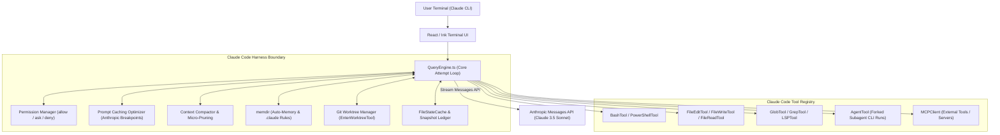
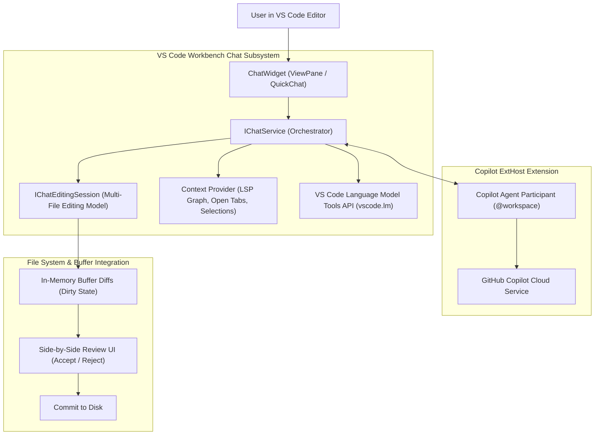
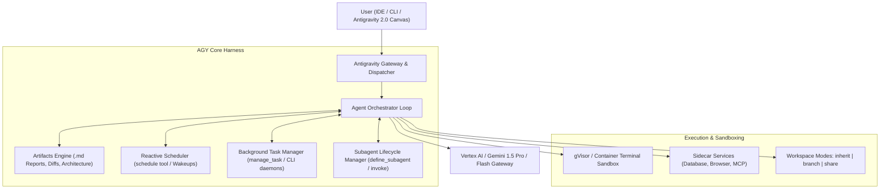
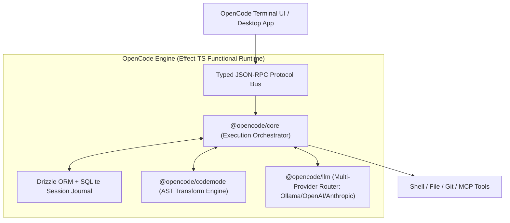
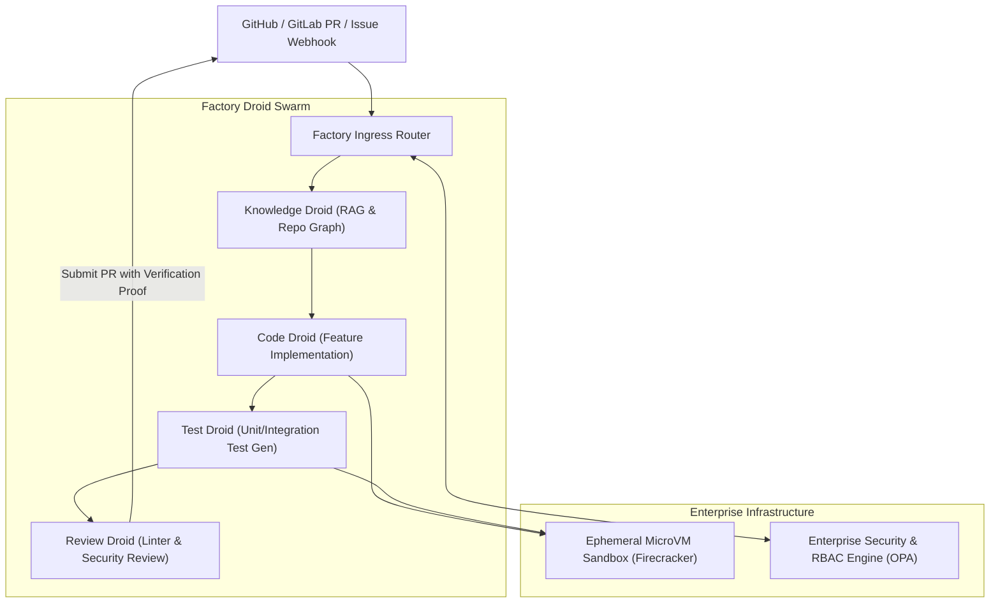
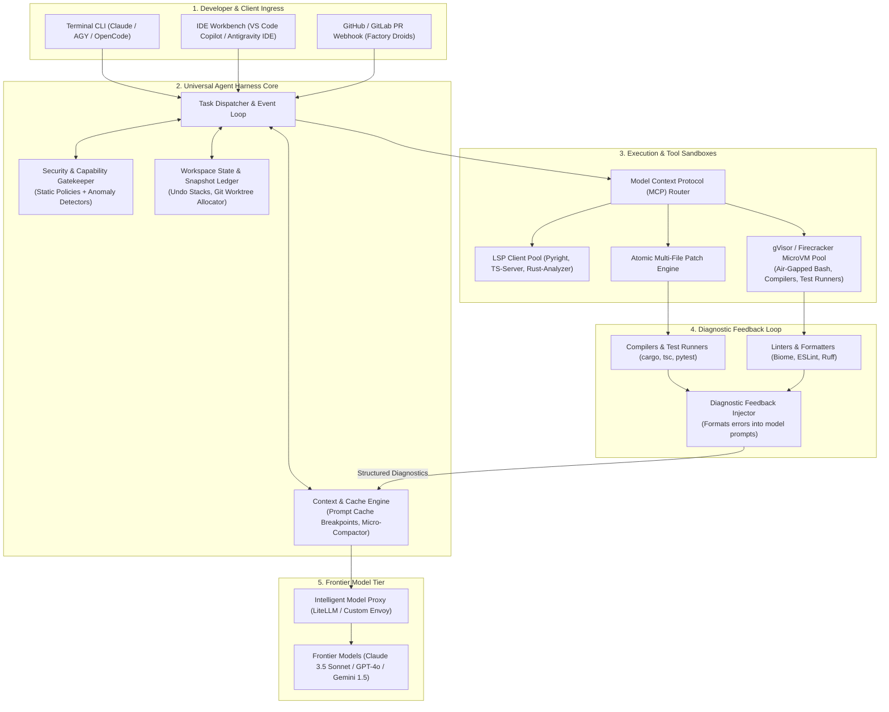
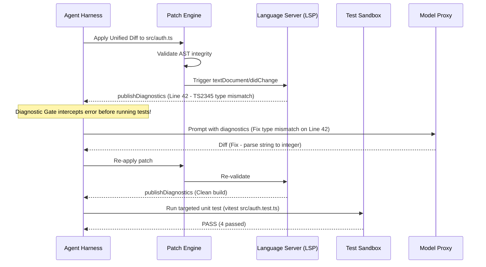
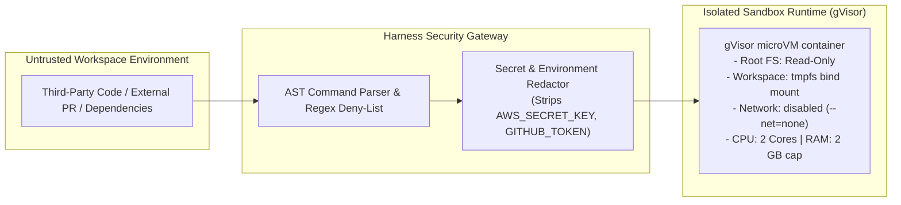

# Design Autonomous Coding Agent Harnesses: Claude Code, Copilot, AGY, OpenCode & Factory Droid

> [!IMPORTANT]
> **Production Code Engine & Verification Lab**:
> Fully implemented zero-dependency atomic file snapshot ledger, unified diff generator with zero-loss rollback, context compactor & tool output micro-pruner, AST diagnostic feedback reflection loop, command security firewall, and multi-agent worktree isolation.
> - **Walkthrough & Staff Playbook**: [`Volume-3/Walkthroughs/06-Coding-Agent-Harness/walkthrough.md`](02-Interactive-Interview-Playbook.md)
> - **Production Python Engine**: [`Volume-3/Walkthroughs/06-Coding-Agent-Harness/coding_agent_harness.py`](coding_agent_harness.py)
> - **Verification Suite**: `python3 coding_agent_harness.py --test` (100% Passing)
> - **Atomic Patch Benchmark**: `python3 coding_agent_harness.py --benchmark` (94,704.6 Edits/sec)

## Problem Statement

Design a production-grade, highly autonomous **Coding Agent Harness Architecture** capable of solving complex end-to-end software engineering tasks (feature implementation, large-scale refactoring, bug localization, test generation, and pull request reviews) across multi-million-line codebases.

In frontier AI engineering, the Frontier Large Language Model (e.g., Claude 3.5 Sonnet, GPT-4o, Gemini 1.5 Pro) is merely the **reasoning engine**. The intelligence of an autonomous coding agent is fundamentally constrained by its **Agent Harness**—the surrounding runtime scaffolding, tool execution envelope, context window manager, file state tracker, diagnostic feedback loop, and security sandbox.

A production coding harness must solve:
1. **The Context Starvation & Compaction Paradox**: Large codebases exceed raw context windows. The harness must dynamically discover files, prune verbose bash/test outputs, leverage prompt caching, and maintain long-term repository understanding without losing task state.
2. **Atomic Multi-File Editing & Safe Rollbacks**: Modifying code across 15 files cannot leave the working tree in a broken intermediate state. The harness must provide transaction-like file snapshotting, AST-aware diffing, and zero-loss undo/rollback capabilities.
3. **Diagnostic & Compiler Feedback Loops**: Autonomous agents do not write bug-free code on the first attempt. The harness must intercept compiler errors, linter failures, and broken unit tests, feeding structured diagnostics back into the model's reflection loop until the build passes.
4. **Tool Sandboxing & Zero-Trust Privilege Separation**: Giving an LLM shell access (`bash`, `git`, `npm`) is an existential security risk. The harness must protect against command injection, destructive directory wipes (`rm -rf /`), SSRF, and credential exfiltration.
5. **Multi-Agent & Worktree Isolation**: Running parallel subagents cannot corrupt a shared working directory. The harness must leverage Git worktrees or container namespaces to provide independent workspace branches with zero storage duplication.

---

## Architectural Breakdown of the 5 Major Coding Harnesses

We analyze the real architectures of the 5 frontier coding harnesses:

```
┌───────────────────────────────────────────────────────────────────────────────────────────┐
│                           THE 5 CODING AGENT HARNESS PARADIGMS                            │
├────────────────────┬─────────────────────┬───────────────────────┬────────────────────────┤
│ Harness            │ Primary Surface     │ State & Execution     │ Key Architectural Core │
├────────────────────┼─────────────────────┼───────────────────────┼────────────────────────┤
│ 1. Claude Code     │ CLI / Terminal TUI  │ Node.js/Bun Subproc   │ QueryEngine, memdir,   │
│    (Anthropic)     │ (React/Ink)         │ Local Workspace       │ Prompt Cache Breaks,   │
│                    │                     │                       │ EnterWorktreeTool      │
├────────────────────┼─────────────────────┼───────────────────────┼────────────────────────┤
│ 2. GitHub Copilot  │ IDE Native          │ VS Code ExtHost       │ IChatEditingSession,   │
│    (Microsoft)     │ (VS Code Workbench) │ In-Memory Buffer Diffs│ LSP Semantic Graph,    │
│                    │                     │                       │ LM Tools API           │
├────────────────────┼─────────────────────┼───────────────────────┼────────────────────────┤
│ 3. Antigravity     │ Hybrid Desktop,     │ Local/Cloud Sidecars, │ Artifacts Engine,      │
│    (AGY / Google)  │ CLI & Cloud IDE     │ gVisor Sandbox        │ Reactive Schedulers,   │
│                    │                     │                       │ Subagent Workspaces    │
├────────────────────┼─────────────────────┼───────────────────────┼────────────────────────┤
│ 4. OpenCode        │ Open-Source TUI     │ Effect-TS Runtime,    │ CodeMode AST engine,   │
│    (Anomaly)       │ & Desktop Client    │ Drizzle + SQLite      │ Multi-Provider RPC,    │
│                    │                     │                       │ Typed Protocol Bus     │
├────────────────────┼─────────────────────┼───────────────────────┼────────────────────────┤
│ 5. Factory Droid   │ Enterprise Cloud    │ Ephemeral MicroVMs    │ Role-Specialized Droid │
│    (Factory.ai)    │ & PR Automation     │ (Firecracker)         │ Swarms (Code/Review/   │
│                    │                     │                       │ Test/Knowledge Droids) │
└────────────────────┴─────────────────────┴───────────────────────┴────────────────────────┘
```

---

### Harness 1: Claude Code Architecture (Anthropic CLI Harness)

Claude Code is Anthropic's agentic CLI tool designed for terminal-based agentic workflows.



#### Core Components in Claude Code:
1. **`QueryEngine.ts`**: The central orchestrator driving the ReAct loop. It manages token usage (`cost-tracker.ts`), intercepts user interrupts (`abortController.ts`), and schedules model re-prompts.
2. **Anthropic Prompt Cache Breakpoints**: Injects static system prompts, tools, and project onboarding state behind cache breakpoints. Consecutive agent steps achieve **~90% prompt cost savings** and sub-second TTFT (Time-to-First-Token) by hitting `cache_read_input_tokens`.
3. **`FileStateCache` & Multi-File Snapshots**: Before executing `FileEditTool` or destructive bash scripts, the harness snapshots file contents. If a build breaks, the agent performs clean rollbacks.
4. **Subagent Delegation (`AgentTool`)**: Spawns isolated child agent loops with specialized prompts (e.g., test runners, code reviewers) without polluting the parent conversation's context window.
5. **Git Worktree Isolation (`EnterWorktreeTool`)**: Creates an isolated Git worktree (`.claude/worktrees/<id>`) allowing the agent to experiment, compile, and run tests on an isolated branch without modifying the user's active working tree.

---

### Harness 2: GitHub Copilot Agent Mode (VS Code Native Harness)

GitHub Copilot Agent Mode is deeply embedded inside the VS Code core workbench architecture (`workbench/contrib/chat/`).



#### Core Components in VS Code Copilot:
1. **`IChatEditingSession`**: Unlike CLI tools that overwrite files on disk directly, VS Code creates an in-memory multi-file editing transaction. Files are modified in editor memory buffers with full syntax highlighting and inline diff overlays.
2. **Language Server Protocol (LSP) Integration**: Copilot accesses rich semantic context directly from VS Code's active language servers (symbols, references, definitions, and compilation errors).
3. **Diagnostic Feedback Loop**: When Copilot edits a file, VS Code's TypeScript or language diagnostics fire immediately. If red squiggles (errors) appear, `IChatService` automatically formats the diagnostics and sends them back to the agent for self-correction.
4. **Visual Review & Rollback**: Users inspect side-by-side git diffs with visual "Accept", "Reject", or "Edit" buttons per file before changes touch the disk.

---

### Harness 3: Google Antigravity (AGY Platform Harness)

Google Antigravity is a hybrid agentic platform combining a CLI (`agy`), an AI-first IDE, an auxiliary desktop canvas, and a Python SDK.



#### Core Components in AGY:
1. **First-Class Artifacts Engine**: Instead of dumping large reports, plans, or diffs into conversational text, AGY writes structured markdown artifacts to an isolated directory. Artifacts support live UI rendering, mermaid diagrams, and carousel reviews.
2. **Dynamic Subagent Swarms**: AGY agents can dynamically declare and spin up new specialized subagent types at runtime (`define_subagent`, `invoke_subagent`), allocating isolated workspaces (`inherit`, `branch`, or `share` mode).
3. **Reactive Wakeup Scheduler (`schedule`)**: Agents schedule one-shot timers or cron jobs that wake up the agent only when an event fires, eliminating idle polling loops.
4. **Air-Gapped Tool Sandbox**: Bash commands run within gVisor sandboxes with strict CPU/memory quotas and network egress controls.

---

### Harness 4: OpenCode (Open-Source Modular Harness)

OpenCode (`anomalyco/opencode`) is an open-source, highly extensible terminal and desktop coding agent built on functional TypeScript (Effect-TS).



#### Core Components in OpenCode:
1. **Effect-TS Functional Core**: Leverages Effect-TS for bulletproof error handling, cancellation tokens, resource acquisition/release (`Scope`), and fiber concurrency.
2. **`CodeMode` AST Manipulation Engine**: Rather than relying solely on fragile regex search-and-replace, OpenCode includes an AST engine capable of structural refactorings and syntax-safe code injections.
3. **Drizzle + SQLite Event Journal**: Every user interaction, model reasoning block, and tool output is persisted in an embedded SQLite database for time-travel debugging and session recovery.

---

### Harness 5: Factory Droids (Enterprise Multi-Agent Swarm)

Factory (`factory.ai`) operates as an enterprise software development platform where specialized autonomous agents ("Droids") collaborate across the software lifecycle.



#### Core Components in Factory Droids:
1. **Role-Specialized Droid Pipeline**: Replaces the single general-purpose agent with hyper-specialized agents:
   - *Knowledge Droid*: Builds AST dependency graphs and indexes company documentation.
   - *Code Droid*: Generates code changes across multiple files.
   - *Test Droid*: Spins up tests, analyzes failure stack traces, and iterates.
   - *Review Droid*: Evaluates corporate style guidelines, security rules, and performance regressions.
2. **Ephemeral MicroVM Sandboxes**: Every task runs inside a hardware-isolated Firecracker microVM with pre-cloned repositories, providing true zero-trust execution.

---

## Architectural Decision Records: Cross-Harness Evolutionary Trade-Offs

```mermaid
graph TD
    classDef naive fill:#ffebee,stroke:#c62828,stroke-width:1px;
    classDef intermediate fill:#fff8e1,stroke:#f57f17,stroke-width:1px;
    classDef battleTested fill:#e8f5e9,stroke:#2e7d32,stroke-width:2px;

    subgraph "1. Multi-File Editing Strategy"
        E1["Whole-File Rewrites<br/>(Massive token waste, truncated code)"]:::naive --> E2["String Search & Replace<br/>(Whitespace mismatch errors, fragile)"]:::intermediate
        E2 --> E3["Unified Diffs with AST Anchor Fallbacks<br/>(Low tokens, robust line matching)"]:::battleTested
    end

    subgraph "2. Context Compaction & Token Economics"
        C1["Unbounded Conversation Append<br/>(Blows context window in 5 steps)"]:::naive --> C2["Sliding Window Truncation<br/>(Loses initial instructions and user intent)"]:::intermediate
        C2 --> C3["Micro-Compaction + Prompt Cache Breakpoints<br/>(Prunes tool output, 90% cache hits)"]:::battleTested
    end

    subgraph "3. Tool Execution & Security"
        S1["Direct Host Shell Execution (sudo bash)<br/>(Attacker rce, system destruction)"]:::naive --> S2["Interactive User Prompt for Every Command<br/>(High fatigue, user blindly clicks allow)"]:::intermediate
        S2 --> S3["Deterministic Permission Rules + gVisor MicroVMs<br/>(Read-only mounts, blocked network egress)"]:::battleTested
    end

    subgraph "4. Workspace Isolation during Parallelism"
        W1["Parallel Agents in Single Directory<br/>(File write race conditions, build locks)"]:::naive --> W2["Full Git Clone per Subagent<br/>(High disk usage, slow 2-min clones)"]:::intermediate
        W2 --> W3["Git Worktrees / Shared Object Storage<br/>(Zero disk duplication, instant 50ms branches)"]:::battleTested
    end
```



---

### Decision 1: Multi-File Editing Strategy

* **Core Goal**: Apply changes across multiple files reliably, preserving file formatting and preventing truncation.

| Strategy | Token Cost | Reliability at Scale | Failure Mode | Used By |
|---|---|---|---|---|
| **1. Whole-File Rewrite** | **Very High** (O(N) file length per edit) | **Low** ($< 50\%$ on files $> 500$ lines) | Model gets lazy, outputs `// ... rest of code unchanged`, deleting production code. | Early prototypes |
| **2. String Search & Replace** | **Very Low** (Only target and replacement lines) | **Medium** (~75-80%) | Fails on duplicate lines, tab/space whitespace mismatches, or outdated line numbers. | Early Claude Code / Cursor |
| **3. Unified Diff with AST Anchors (Winning)** | **Low** (~15% of file size) | **High** (> 95%) | Patches match hunk headers and function signature anchors. If line numbers drift, AST matching resolves location. | **VS Code Copilot, Modern Claude Code, AGY** |

---

### Decision 2: Context Compaction & Token Economics

* **Core Goal**: Prevent context window exhaustion across 30-step autonomous coding loops while maintaining sub-second latency.

| Strategy | Mechanism | Bottleneck / Downside | Winning Production Choice |
|---|---|---|---|
| **Sliding Window Truncation** | Drop oldest messages when token limit nears. | **Amnesia**: Drops original user requirements, architecture plans, or error history. | ❌ Flawed |
| **Recursive Summarization** | Summarize conversation every 10 turns. | **Detail Bleed**: Loses exact variable names, file paths, and compiler flags. | ⚠️ Intermediate |
| **Tool Output Micro-Compaction + Cache Breakpoints** | Keep all system prompts and user turns. Replace verbose bash/LSP outputs (`npm test` 500 lines) with a compact 2-line summary once used, locking invariant context behind Anthropic/OpenAI prompt cache headers. | Requires tracking tool output references in the harness. | ✅ **Winning Choice (Claude Code, AGY)** |

---

## High-Level Universal Production Harness Architecture



---

## Low-Level Design & Deep Dives

### Deep Dive 1: Context Window Management & Prompt Caching Economics

To keep autonomous runs under \$0.50 per task while preserving high reasoning fidelity, the harness structures prompts around **Hierarchical Cache Breakpoints**:

```
┌────────────────────────────────────────────────────────┐  ◄── Cache Breakpoint 1 (Static)
│ System Prompt: Role, Rules, Coding Guidelines, OS Info │      TTL: 5 Minutes (Shared across turns)
├────────────────────────────────────────────────────────┤  ◄── Cache Breakpoint 2 (Project Invariant)
│ Repository Map (Tree), Architecture Notes, AGENTS.md   │      Cached once per repository
├────────────────────────────────────────────────────────┤  ◄── Cache Breakpoint 3 (Tools)
│ MCP Tool Schemas (FileRead, FileEdit, Bash, LSP)       │      Frozen tool definitions
├────────────────────────────────────────────────────────┤
│ Conversation History (Turns 1 to N-1)                  │
│ [Tool outputs micro-compacted: bash logs truncated]    │  ◄── Ephemeral Active Boundary
├────────────────────────────────────────────────────────┤
│ Active Turn N: User input + latest compiler diagnostics│      Evaluated fresh
└────────────────────────────────────────────────────────┘
```

#### Micro-Compaction Algorithm
When an agent runs `cargo test`, the raw stdout may produce 2,000 lines. 
- *Step N (Active)*: The agent sees the full error trace to fix the failing test.
- *Step N+1 (Past)*: The harness replaces the raw 2,000 lines in history with an immutable compact stub:
  ```json
  {
    "tool": "BashTool",
    "command": "cargo test",
    "summary": "FAILED: 1 test failed (tests::test_auth_flow). Exit code 101.",
    "pruned_lines": 1985
  }
  ```
This prevents context bloat from accumulating across 20+ steps.

---

### Deep Dive 2: Diagnostic Self-Correction Loop (LSP & Compilers)

Autonomous agents succeed by iteratively fixing their own mistakes. The harness creates a tight feedback loop:



---

### Deep Dive 3: Git Worktree Isolation for Parallel Subagents

When the master agent spawns subagents (`AgentTool` or AGY's `invoke_subagent`), executing in the same folder causes Git lock contention (`.git/index.lock`) and overwrites files mid-test.

```bash
# How production harnesses isolate subagents instantly:
git worktree add -b subagent-task-42 .claude/worktrees/task-42 HEAD
```

```
Main Working Tree (/repo) ──► Checked out on 'feature-branch'
   │
   ├── .claude/worktrees/subagent-1 ──► Checked out on 'temp-sub-1' (Isolated disk files)
   └── .claude/worktrees/subagent-2 ──► Checked out on 'temp-sub-2' (Isolated disk files)
```
- **Zero Clone Latency**: Shares the same `.git` object database; creation takes **< 50ms**.
- **Independent Execution**: Subagent 1 can run `npm install` or compile binaries without interfering with Subagent 2.
- **Clean Merge**: When the subagent succeeds, the parent merges the branch diff into the main tree and prunes the worktree: `git worktree remove --force .claude/worktrees/task-42`.

---

### Deep Dive 4: Security Threat Modeling & Terminal Sandboxing

Autonomous coding agents run untrusted external code (e.g., pulling npm packages, cloning PRs). The harness must enforce strict containment:



#### Security Guardrails:
1. **Air-Gapped Test Runners**: Compilers and test runners execute with `--net=none` unless explicitly authorized. Malicious npm `postinstall` scripts cannot phone home with stolen credentials.
2. **Read-Only Root Filesystem**: Agents can only write inside `/workspace`. Host filesystems (`/etc`, `~/.ssh`, `~/.aws`) are unreachable.
3. **Secret Masking Filter**: Tool outputs pass through a regex redaction stream that masks API tokens, private keys, and passwords before saving to conversation history.

---

## Comparative Matrix: The 5 Harnesses

| Feature / Dimension | Claude Code | GitHub Copilot (VS Code) | Google Antigravity (AGY) | OpenCode | Factory Droid |
|---|---|---|---|---|---|
| **Runtime Surface** | Node/Bun CLI (Ink TUI) | VS Code Workbench ExtHost | Desktop Canvas / IDE / CLI | TypeScript (Effect-TS) TUI | Cloud MicroVMs |
| **Editing Model** | FileEditTool (String/Diff) | Buffer Diffs with Undo | Multi-File Diff Engine | CodeMode AST & Diffs | PR Diff Commits |
| **Context Compaction** | Micro-pruning + Prompt Cache | LSP Semantic Trimming | Artifacts + Cache Slicing | SQLite Session Pruning | Knowledge Graph RAG |
| **Diagnostic Loop** | Manual Bash execution | Live LSP `publishDiagnostics` | Built-in Linter & Test Gate | Subprocess compile checks | CI/CD Container Run |
| **Sandboxing** | Local permissions (allow/ask) | VS Code sandbox / OS level | gVisor microVMs | Local Subprocess | Firecracker microVMs |
| **Subagent Strategy** | `AgentTool` (Forked CLI) | Chat Participants (`@workspace`)| `invoke_subagent` (Hierarchical)| Modular Multi-Agent | Droid Swarm (Specialized)|
| **Best Suited For** | Fast terminal scripting | Interactive editor pairing | Large multi-agent engineering | Open-source hackers | Enterprise PR automation |

---

## Key Takeaways Checklist

> [!summary] Staff-Level Coding Agent Harness Checklist
> 1. **The Model is Not the Agent**: An LLM without a robust harness produces buggy, truncated code. The harness is responsible for state tracking, diagnostic verification, and context compaction.
> 2. **Leverage Prompt Caching Invariants**: Structure prompts with static system rules and tool definitions behind cache breakpoints to reduce token costs by $90\%$ and drop turn latency.
> 3. **Micro-Compact Historical Tool Outputs**: Never retain full bash outputs or compiler logs in long-running contexts. Prune resolved logs into 2-line summaries once passed.
> 4. **Use Git Worktrees for Subagent Parallelism**: Avoid file write conflicts and lock contention by spawning subagents in dedicated, lightweight Git worktrees.
> 5. **Close the Diagnostic Loop**: Intercept compiler errors, linter output, and test stack traces, feeding them directly back to the model before presenting code to the user.
> 6. **Sandbox Shell Operations**: Isolate test execution and dependency installation inside unprivileged containers (gVisor / microVMs) with disabled network access to prevent supply-chain attacks.
