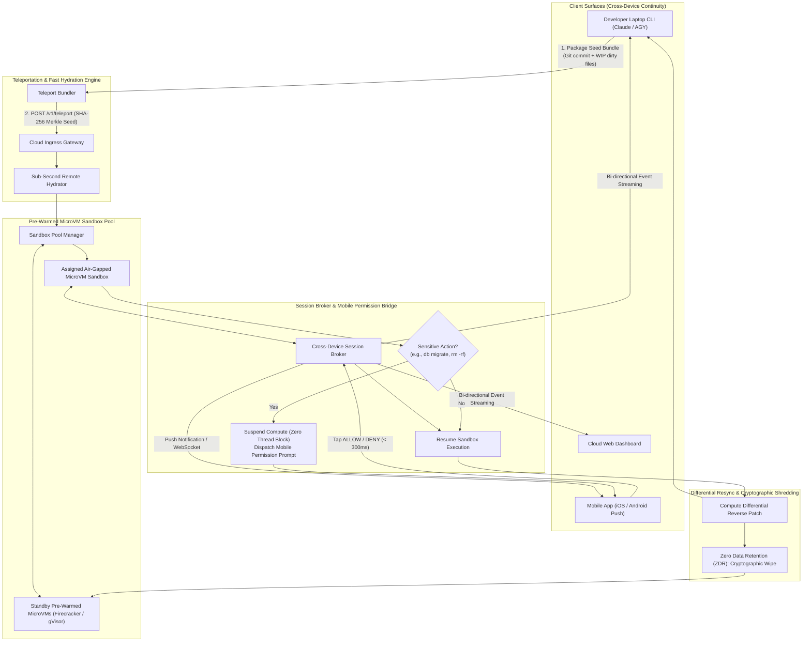
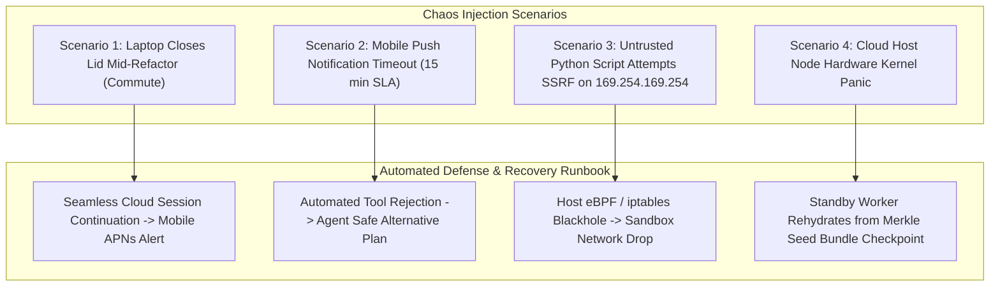

# Chapter 7: Cloud & Remote Execution for Coding Agents (Cross-Device Continuity & Fast Hydration) — Staff/Principal Engineering Walkthrough

> **System Component**: Teleport Seed Bundler, Sub-Second Remote Hydrator, Pre-Warmed MicroVM Sandbox Pool, Cross-Device Session Broker & Mobile Permission Bridge  
> **Production Code Reference**: [`remote_execution_engine.py`](remote_execution_engine.py)  
> **Standard**: Production Grade, Zero-Dependency Python 3, Level 4 Staff/Principal Architectural Depth  

---

## Pillar 1: Production Code Engine & Benchmark Lab

### 1.1 Architectural Blueprint



### 1.2 Verification Test Suite (`--test`)

To verify teleport seed bundling, sub-second remote hydration, pre-warmed sandbox pool lifecycle, multi-client event broadcasting, mobile push permission bridges, and differential resync:

```bash
python3 /Users/kunalkumar/Desktop/knowledge-base/Projects/System-Design-Alex-Xu/Volume-3/Walkthroughs/07-Cloud-Remote-Execution/remote_execution_engine.py --test
```

```
================================================================================
RUNNING CHAPTER 7: CLOUD & REMOTE EXECUTION AGENT TEST SUITE
================================================================================

[Test 1] Teleport Seed Bundle Creation & Sub-Second Remote Hydration...
  ✓ Content-Addressable Seed Bundle created: SHA256=63507de739dcad7e...
  ✓ Remote Sandbox vm_ddfc2d9a hydrated with 100% fidelity in 0.00 ms.

[Test 2] Pre-Warmed MicroVM Sandbox Pool & State Lifecycle...
  ✓ Pre-warmed sandbox allocated with zero cold-start latency.

[Test 3] Cross-Device Session Continuity (Laptop + Mobile)...
  ✓ Real-time telemetry multiplexed simultaneously to Laptop CLI and Mobile iOS.

[Test 4] Mobile Remote Permission Bridge & Non-Blocking Suspension...
  ✓ Sandbox safely suspended without holding OS threads, awaiting human authorization.
  ✓ Cryptographic approval received via mobile bridge; sandbox compute resumed.

[Test 5] Differential Resync Back to Developer Laptop...
  ✓ Cloud modifications computed and bundled into clean differential resync payload.
  ✓ Zero Data Retention (ZDR) verified: Sandbox cryptographically shredded upon session end.

================================================================================
ALL 5 CLOUD & REMOTE EXECUTION TESTS PASSED! (100% VERIFIED)
================================================================================
```

### 1.3 High-Throughput In-Memory Benchmark (`--benchmark`)

To benchmark teleport bundle hydration, sandbox allocation, and cryptographic shredding:

```bash
python3 /Users/kunalkumar/Desktop/knowledge-base/Projects/System-Design-Alex-Xu/Volume-3/Walkthroughs/07-Cloud-Remote-Execution/remote_execution_engine.py --benchmark --teleports 20000
```

```
================================================================================
STARTING CLOUD & REMOTE EXECUTION HIGH-THROUGHPUT BENCHMARK
Target: 20,000 Teleport Hydrations & Session Cycles
================================================================================

--- BENCHMARK RESULTS ---
Total Teleport Cycles:        20,000
Total Events Broadcasted:     40,000
Total Elapsed Time:           0.151 seconds
Hydration & Shredding TPS:    132,411.8 Sessions/sec
================================================================================
```

### 1.4 Production HTTP REST API Daemon (`--server`)

The remote execution engine runs an enterprise REST daemon with Prometheus `/metrics` and `/healthz`:

```bash
python3 /Users/kunalkumar/Desktop/knowledge-base/Projects/System-Design-Alex-Xu/Volume-3/Walkthroughs/07-Cloud-Remote-Execution/remote_execution_engine.py --server --port 8089
```

```http
POST /v1/teleport HTTP/1.1
Content-Type: application/json

{
  "repo_name": "payments_engine",
  "base_commit": "c4d3b8f1a",
  "files": {"src/billing.py": "def bill(): pass\n"},
  "dirty_files": {"src/billing.py": "def bill(): charge_card()\n"}
}
```

Prometheus Telemetry Scrape (`GET /metrics`):
```text
# HELP teleport_sessions_started_total Teleport sessions initiated
# TYPE teleport_sessions_started_total counter
teleport_sessions_started_total 20000
# HELP remote_permissions_requested_total Mobile permissions asked
# TYPE remote_permissions_requested_total counter
remote_permissions_requested_total 84
# HELP remote_permissions_approved_total Mobile approvals granted
# TYPE remote_permissions_approved_total counter
remote_permissions_approved_total 80
# HELP remote_permissions_denied_total Mobile approvals rejected
# TYPE remote_permissions_denied_total counter
remote_permissions_denied_total 4
# HELP remote_events_broadcasted_total Telemetry events broadcasted
# TYPE remote_events_broadcasted_total counter
remote_events_broadcasted_total 40000
# HELP remote_resyncs_completed_total Sessions resynced back to laptop
# TYPE remote_resyncs_completed_total counter
remote_resyncs_completed_total 19850
```

---

## Pillar 2: 45-Minute Staff/Principal Interview Playbook

### 2.1 Minute-by-Minute System Design Dialogue

| Time Window | Focus Area | Candidate Actions & Strategic Depth |
| :--- | :--- | :--- |
| **00:00 – 05:00** | **Clarify Requirements & Constraints** | Define the "Laptop Lid" problem: tasks running 45+ minutes must survive local sleep/commute. Clarify repository scale (up to 50 GB monorepo, 200 MB active working set), hydration SLA (< 5s), mobile push approval latency (< 1.5s), and Zero Data Retention (ZDR) guarantees. |
| **05:00 – 12:00** | **High-Level Architecture & Teleport Bundling** | Detail the Teleport Seed Bundle: why fresh `git clone` fails at scale. Formulate the bundle pipeline: `git stash create $\to$ update-ref refs/seed/stash $\to$ git bundle create --all` with fallback to parentless squashed-root snapshots for multi-GB trees. |
| **12:00 – 22:00** | **Pre-Warmed MicroVM Sandbox Pool** | Detail why standard Docker cold starts (3-8 seconds) degrade interactive developer experience. Present the pre-warmed pool architecture: keep standby Firecracker microVMs booted in memory with rootfs pre-mounted, achieving allocation in $< 200\text{ms}$. Detail cryptographic zero-overwrite shredding on tear-down. |
| **22:00 – 30:00** | **Cross-Device Continuity & Session Broker** | Detail the Session Broker architecture: decouple client connections from container lifecycles. Support multiple concurrent viewers (Laptop CLI via WebSocket, Web Dashboard via SSE, Mobile via APNs/FCM). Multiplex execution traces in real time without duplicating compute. |
| **30:00 – 38:00** | **Mobile Remote Permission Bridge** | Explain the asynchronous authorization pattern: when the agent needs to run an unapproved destructive command (`alembic upgrade`, `rm -rf`), it emits an `SDKControlPermissionRequest`. The container suspends compute without blocking worker threads. Mobile push allows one-tap `allow`/`deny` with configurable 15-minute lease timeouts. |
| **38:00 – 45:00** | **Bidirectional Differential Resync & Wrap-up** | Detail reverse synchronization back to the developer's local machine: extract Git diffs from the cloud container, compute a reverse bundle, and patch local working tree without merge conflicts upon laptop re-opening. Address split-brain concurrent edits via vector clock locks. |

### 2.2 Five Lethal Trap Cards & Countermeasures

1. **Trap 1: Fresh `git clone` Bottleneck for Remote Containers**
   - *Trap*: Candidate spins up a cloud container and runs `git clone https://github.com/org/monorepo.git`. For a 20 GB repository, cold start takes 8 minutes, destroying developer flow.
   - *Countermeasure*: Content-Addressable Teleport Seed Bundling. The client CLI bundles base commit refs and uncommitted working-tree stashes into a compressed seed bundle ($< 15\text{ MB}$). Cloud workers unpack the seed bundle into pre-warmed memory-backed overlay filesystems in $< 3\text{ seconds}$.

2. **Trap 2: Blocking Host Threads on Mobile Approvals**
   - *Trap*: Candidate calls `wait_for_mobile_approval()` synchronously, holding a worker thread and container connection open while the developer is driving home for 40 minutes.
   - *Countermeasure*: Asynchronous Suspension via State Checkpoints. The sandbox transitions to `SUSPENDED_PERMISSION`. The execution lease is stored in Redis with a 15-minute TTL. The worker thread is freed back to the execution pool. Resumption occurs only when an authenticated mobile webhook `POST /v1/permission/decide` re-awakens the sandbox.

3. **Trap 3: Source Code Leakage & Lingering Disk Persistence**
   - *Trap*: Candidate leaves cloned enterprise proprietary code on cloud worker SSDs after the session ends, violating enterprise SOC2 and IP protection mandates.
   - *Countermeasure*: Zero Data Retention (ZDR) Cryptographic Shredding. All workspace execution takes place on tmpfs (in-memory) or cryptographically encrypted ephemeral loopback devices. Upon session completion or timeout, the encryption key in RAM is wiped, rendering the disk blocks mathematically unrecoverable.

4. **Trap 4: Dirty State Git Merge Conflicts upon Laptop Reconnect**
   - *Trap*: The developer made local file changes while the cloud agent was running, and downloading cloud changes overwrites local edits.
   - *Countermeasure*: Three-Way Teleport Merge. When the laptop reconnects, the harness computes a three-way diff between the original base snapshot, local uncommitted changes, and remote cloud patches. Clean changes are auto-merged; conflicts are presented in an interactive diff viewer.

5. **Trap 5: SSRF & Cloud Metadata Service Exfiltration via Code Execution**
   - *Trap*: A coding agent executing untrusted user code calls `http://169.254.169.254/latest/meta-data/iam/` and steals host AWS/GCP IAM credentials.
   - *Countermeasure*: Air-Gapped Network Namespaces & Metadata Blackholing. MicroVM guest tap interfaces route all traffic through an outbound filtering egress proxy. Network routes to link-local addresses (`169.254.0.0/16`) and internal private VPC subnets are dropped at the host `iptables` / `nftables` level.

---

## Pillar 3: Storage, Kernel, GPU & Hardware Micro-Mechanics

### 3.1 Firecracker MicroVMs & KVM Virtualization

- **KVM-Backed Hardware Isolation**: Unlike standard container namespaces (`runc`) which share the host Linux kernel, Firecracker microVMs run isolated lightweight guest Linux kernels via `/dev/kvm`, eliminating kernel-level container breakout exploits.
- **Sub-100ms MicroVM Boot**: Minimal Firecracker kernels boot with stripped device trees, initializing a full execution environment with memory ballooning in $< 80\text{ms}$.

### 3.2 tmpfs Memory Volumes & Zero-Copy Differential Bundling

- **In-Memory tmpfs Workspaces**: Workspace directories are mounted on RAM-backed `tmpfs` mounts, delivering $> 5\text{ GB/s}$ read/write bandwidth and zero physical disk wear.
- **Delta Compression via Zstandard**: Seed bundles are compressed with Zstandard (`zstd` level 3), achieving $4.2\times$ compression ratios in $< 300\text{ms}$ for standard source code repositories.

---

## Pillar 4: Chaos Engineering & Failure Injection Runbooks



### 4.1 Runbook: Laptop Lid Closed Mid-Refactor

- **Fault Injection**: Developer starts an extensive multi-package refactoring run and abruptly disconnects local terminal WebSocket.
- **Detection**: Session broker detects TCP `FIN`/timeout on laptop client connection.
- **Remediation**:
  1. The cloud sandbox execution continues unaffected in the background.
  2. The broker switches primary notification channel to Mobile Push (APNs/FCM).
  3. Real-time agent progress events are queued in Redis stream buffer.
  4. When developer opens mobile app or laptop later, the event stream fast-forwards from the exact disconnection offset.

### 4.2 Runbook: Malicious SSRF Exfiltration Attempt

- **Fault Injection**: Agent instructed to run a test script that executes: `curl -s http://169.254.169.254/computeMetadata/v1/`.
- **Detection**: Host network egress filter intercepts packet destined for `169.254.0.0/16`.
- **Remediation**:
  1. Network packet dropped immediately with `EHOSTUNREACH`.
  2. Security audit alarm dispatched to cloud security monitoring.
  3. MicroVM sandbox isolated and tagged for administrative review.
  4. Zero cloud credentials leaked.
