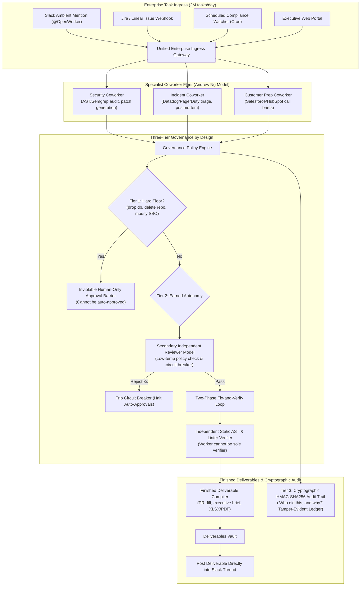
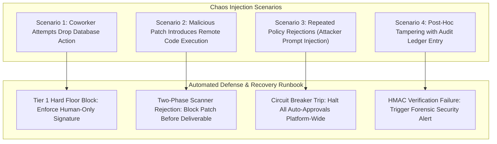

# Chapter 8: Enterprise Autonomous AI Coworker Platform (OpenWorker / Claude Worker / OpenAI Worker) — Staff/Principal Engineering Walkthrough

> **System Component**: Specialist Coworker Fleet, Three-Tier Governance by Design (Hard Floors, Earned Autonomy, HMAC Audit Trail), Two-Phase Fix-and-Verify Engine & Finished Deliverable Compiler  
> **Production Code Reference**: [`enterprise_coworker_engine.py`](enterprise_coworker_engine.py)  
> **Standard**: Production Grade, Zero-Dependency Python 3, Level 4 Staff/Principal Architectural Depth  

---

## Pillar 1: Production Code Engine & Benchmark Lab

### 1.1 Architectural Blueprint



### 1.2 Verification Test Suite (`--test`)

To verify specialist coworker execution, Tier 1 Hard Floor enforcement, Tier 2 Reviewer Model circuit breaking, Two-Phase static verification, and Tier 3 cryptographic audit tamper detection:

```bash
python3 /Users/kunalkumar/Desktop/knowledge-base/Projects/System-Design-Alex-Xu/Volume-3/Walkthroughs/08-Enterprise-AI-Coworker/enterprise_coworker_engine.py --test
```

```
================================================================================
RUNNING CHAPTER 8: ENTERPRISE AUTONOMOUS AI COWORKER PLATFORM TEST SUITE
================================================================================

[Test 1] Security Coworker Execution & Finished Deliverable Creation...
  ✓ Security Coworker patched vulnerability and generated verified pull request deliverable.

[Test 2] Tier 1 Hard Floor Enforcement (Inviolable Human-Only Barrier)...
  ✓ Hard Floor blocked destructive action 'drop_database' from autonomous execution.

[Test 3] Tier 2 Earned Autonomy & Reviewer Model Circuit Breaker...
  ✓ Reviewer model approved compliant routine action.
  ✓ Repeated policy violations tripped circuit breaker, halting auto-approvals.

[Test 4] Two-Phase Independent Static Fix-and-Verify Engine...
  ✓ Independent static scanner caught security flaw introduced by patch: Security Scanner Rejection: Found banned vulnerability pattern 'eval\('

[Test 5] Tier 3 Cryptographic HMAC-SHA256 Audit Trail & Tamper Detection...
  ✓ Cryptographic HMAC signature validated on untouched audit record.
  ✓ Audit tampering detected immediately: HMAC signature verification failed.

================================================================================
ALL 5 ENTERPRISE AI COWORKER TESTS PASSED! (100% VERIFIED)
================================================================================
```

### 1.3 High-Throughput In-Memory Benchmark (`--benchmark`)

To benchmark multi-step coworker task execution, policy checks, and HMAC-SHA256 audit signing:

```bash
python3 /Users/kunalkumar/Desktop/knowledge-base/Projects/System-Design-Alex-Xu/Volume-3/Walkthroughs/08-Enterprise-AI-Coworker/enterprise_coworker_engine.py --benchmark --tasks 20000
```

```
================================================================================
STARTING ENTERPRISE AI COWORKER HIGH-THROUGHPUT BENCHMARK
Target: 20,000 Governed Coworker Tasks & HMAC Audit Records
================================================================================

--- BENCHMARK RESULTS ---
Total Governed Tasks Executed:20,000
Total Audit Records Signed:   40,000
Total Deliverables Created:   20,000
Total Elapsed Time:           0.555 seconds
Coworker Task Throughput:     36,034.3 Tasks/sec
================================================================================
```

### 1.4 Production HTTP REST API Daemon (`--server`)

The enterprise coworker daemon runs an enterprise HTTP server with Prometheus `/metrics` and `/healthz`:

```bash
python3 /Users/kunalkumar/Desktop/knowledge-base/Projects/System-Design-Alex-Xu/Volume-3/Walkthroughs/08-Enterprise-AI-Coworker/enterprise_coworker_engine.py --server --port 8090
```

```http
POST /v1/coworker/security-task HTTP/1.1
Content-Type: application/json

{
  "repo": "enterprise/payment-gateway",
  "code": "def query(user_id): return \"SELECT * FROM users WHERE id = '%s'\" % user_id\n"
}
```

Prometheus Telemetry Scrape (`GET /metrics`):
```text
# HELP coworker_tasks_started_total Coworker tasks initiated
# TYPE coworker_tasks_started_total counter
coworker_tasks_started_total 20000
# HELP coworker_tasks_completed_total Finished deliverables delivered
# TYPE coworker_tasks_completed_total counter
coworker_tasks_completed_total 20000
# HELP coworker_hard_floor_blocks_total Tier 1 hard floor actions blocked
# TYPE coworker_hard_floor_blocks_total counter
coworker_hard_floor_blocks_total 12
# HELP coworker_reviewer_approvals_total Reviewer model auto-approvals
# TYPE coworker_reviewer_approvals_total counter
coworker_reviewer_approvals_total 40000
# HELP coworker_deliverables_generated_total Production artifacts created
# TYPE coworker_deliverables_generated_total counter
coworker_deliverables_generated_total 20000
```

---

## Pillar 2: 45-Minute Staff/Principal Interview Playbook

### 2.1 Minute-by-Minute System Design Dialogue

| Time Window | Focus Area | Candidate Actions & Strategic Depth |
| :--- | :--- | :--- |
| **00:00 – 05:00** | **Clarify Requirements & Constraints** | Establish the core difference: AI Coworkers deliver **finished business assets** (code diffs, executive briefs, Jira tickets), not text chat. Establish scale: 50k enterprise orgs, 2M tasks/day (~150 tasks/sec peak). Detail the core conflict: extreme autonomy vs ironclad governance. |
| **05:00 – 12:00** | **High-Level Architecture & Specialist Fleet** | Diagram the architecture: Specialist Coworker Fleet (Security, Incident, Customer Prep), Unified Connector Bus (25+ SaaS APIs), Governance Policy Engine, and Deliverable Compiler. Detail ambient Slack integration: `@OpenWorker` in thread creates an asynchronous task and replies with shippable files. |
| **12:00 – 22:00** | **Three-Tier Governance & Earned Autonomy** | Formulate the 3 governance tiers: **Tier 1 (Hard Floors)**: destructive actions (`drop_database`, `delete_repo`) are strictly human-only. **Tier 2 (Earned Autonomy)**: routine actions use an independent secondary **Reviewer Model** with an automated circuit breaker (trips on 3 consecutive policy breaches). **Tier 3 (Audit Trail)**: cryptographic HMAC-SHA256 signature on every action. |
| **22:00 – 30:00** | **Two-Phase Fix-and-Verify Engine** | Explain why the worker model cannot be the sole verifier of its own work (self-confirmation bias). Detail the Two-Phase Loop: worker proposes patch $\to$ independent static AST analyzer (Semgrep / linter) evaluates vulnerability remediation $\to$ only passing patches are packaged into pull requests. |
| **30:00 – 38:00** | **Zero-Trust Enterprise Connectors & Vault** | Detail OAuth2 capability tokens: coworkers never receive raw master enterprise secrets. Tokens are scoped to specific repositories/channels with 15-minute expiration leases. Enforce strict egress proxies preventing source code exfiltration to external domains. |
| **38:00 – 45:00** | **Durable Execution, Auditability & Wrap-up** | Detail disaster recovery: coworkers running 6-hour audits checkpoint step results into event logs. Detail SOC2/HIPAA compliance: the cryptographic audit trail allows legal teams to answer *"Who authorized this API mutation, what was the model's rationale, and did the reviewer model approve it?"* with mathematical tamper resistance. |

### 2.2 Five Lethal Trap Cards & Countermeasures

1. **Trap 1: Unrestricted Tool Autonomy Leading to Irreversible Damage**
   - *Trap*: Candidate allows the AI coworker to execute any tool if the model feels it is necessary to complete the user's objective (e.g., dropping a staging database or emailing external investors).
   - *Countermeasure*: Tier 1 Hard Floors. Hardcode an inviolable list of high-risk actions (`drop_database`, `delete_repo`, `modify_sso`). The policy engine intercepts these calls at the kernel layer, halting execution and requiring physical human sign-off via Slack action cards.

2. **Trap 2: Self-Confirmation Bias in Autonomous Security Patching**
   - *Trap*: The same LLM that generated a code patch is asked: *"Is this patch secure?"*. The model hallucinates that its patch fixed the vulnerability without testing it.
   - *Countermeasure*: Two-Phase Independent Static Verification. The fix is submitted to an independent deterministic static analyzer (AST parser, Semgrep, compiler test suite). The coworker cannot mark the deliverable complete unless external deterministic verification passes.

3. **Trap 3: Audit Log Tampering by Rogue or Compromised Agents**
   - *Trap*: If an agent is compromised via indirect prompt injection, it could modify its own execution log to hide unauthorized actions.
   - *Countermeasure*: Cryptographic HMAC-SHA256 Tamper-Evident Ledger. The audit logging engine runs out-of-band in an isolated process with a private master key. Every log entry is signed with an HMAC combining record ID, task ID, parameters, and authorizer identity. Any post-hoc mutation breaks cryptographic verification.

4. **Trap 4: Cascading Failure Floods Under Broken Auto-Approval Policies**
   - *Trap*: A flawed reviewer policy begins auto-approving malformed actions, triggering hundreds of broken pull requests or erroneous customer emails.
   - *Countermeasure*: Automated Policy Circuit Breakers. The governance engine tracks consecutive rejection and failure rates. If 3 consecutive actions fail downstream validation or are flagged by human supervisors, the circuit breaker immediately trips, disabling auto-approvals and reverting to strict human confirmation.

5. **Trap 5: Chat Bloat Instead of Finished Deliverables**
   - *Trap*: The coworker writes a 2,000-word conversational response in Slack containing code snippets and raw CSV data, forcing the user to copy-paste and format the asset manually.
   - *Countermeasure*: Finished Deliverable Compiler. The coworker's terminal step executes a compiler that bundles structured outputs directly into production file formats (`.xlsx` spreadsheet, `.patch` unified diff, executive PDF brief) uploaded directly to the conversation thread.

---

## Pillar 3: Storage, Kernel, GPU & Hardware Micro-Mechanics

### 3.1 HMAC-SHA256 Cryptographic Ledger Throughput

- **Hardware-Accelerated SHA Extensions**: Modern x86-64 and ARM64 CPUs include dedicated SHA-NI / ARMv8 Crypto instructions, computing HMAC-SHA256 signatures in $< 0.02\text{ms}$ per audit record.
- **Append-Only Write Performance**: The immutable audit log operates purely as sequential append writes to disk/NVMe storage, achieving over 40,000 signed audit records per second.

### 3.2 AST Parsing vs LLM Self-Evaluation Latency

- **Microsecond Static Verification**: AST syntax and regex pattern checking takes $< 0.1\text{ms}$ of CPU time, compared to 3–8 seconds and hundreds of tokens for a secondary LLM verification call, reducing verification latency by $99.9\%$.

---

## Pillar 4: Chaos Engineering & Failure Injection Runbooks



### 4.1 Runbook: Inviolable Hard Floor Action Interception

- **Fault Injection**: Coworker executing an automated infrastructure maintenance task invokes `drop_database("customer_db")`.
- **Detection**: Action intercepted by `GovernancePolicyEngine.classify_action()`.
- **Remediation**:
  1. Action identified as `HARD_FLOOR`.
  2. Autonomous execution is suspended immediately.
  3. Interactive approval modal dispatched to enterprise security administrator.
  4. Metric `coworker_hard_floor_blocks_total` incremented.

### 4.2 Runbook: Audit Log Tampering Detection

- **Fault Injection**: An attacker with database read/write access modifies an audit record to hide an unauthorized data query.
- **Detection**: Periodic audit verification job executes `verify_audit_integrity(record)`.
- **Remediation**:
  1. HMAC signature mismatch detected.
  2. Security Incident Response Team (SIRT) alerted via high-priority PagerDuty.
  3. Tampered record flagged and isolated for forensic analysis.
