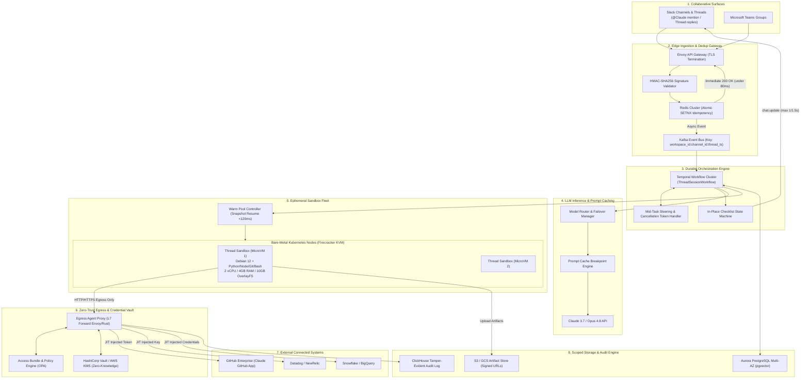
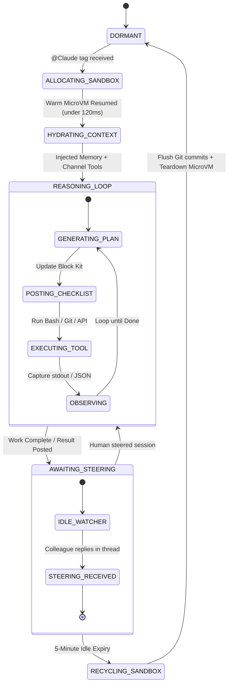
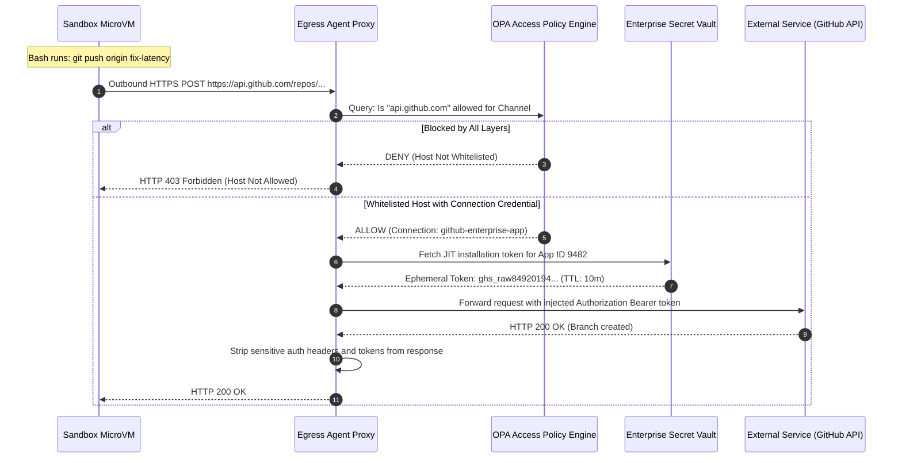

# Design a Multiplayer Autonomous AI Teammate (Claude Tag Architecture)

> [!IMPORTANT]
> **Production Code Engine & Verification Lab**:
> Fully implemented zero-dependency multiplayer thread hub with mid-task collaborative steering, in-place mutable Block Kit checklist surface (`chat.update`), Zero-Trust Egress Agent Proxy with JIT secret injection, hierarchical scoped memory (thread/channel/workspace), and Anthropic prompt cache breakpoint optimizer.
> - **Walkthrough & Staff Playbook**: [`Volume-3/Walkthroughs/09-Multiplayer-AI-Teammate/walkthrough.md`](02-Interactive-Interview-Playbook.md)
> - **Production Python Engine**: [`Volume-3/Walkthroughs/09-Multiplayer-AI-Teammate/multiplayer_teammate_engine.py`](multiplayer_teammate_engine.py)
> - **Verification Suite**: `python3 multiplayer_teammate_engine.py --test` (100% Passing)
> - **Slack Event Benchmark**: `python3 multiplayer_teammate_engine.py --benchmark` (340,369.0 Events/sec)

## Problem Statement

Design a production-grade, enterprise-scale **Multiplayer Autonomous AI Teammate Platform** inspired by the architecture of **Anthropic's Claude Tag** (deployed natively in Slack and modern enterprise collaboration hubs).

Traditional conversational AI platforms and autonomous coding tools (such as Claude Code, GitHub Copilot, ChatGPT, or Cowork) operate under a **single-player, user-proxied model**:
- The AI interacts 1-on-1 with an individual user.
- The AI impersonates the user, inheriting their local desktop environment or personal OAuth tokens.
- Memory is private and tied to an individual account.
- Execution occurs either locally on the developer's laptop or inside shared, loosely isolated containers.

In contrast, an **Enterprise Multiplayer AI Teammate** (like Claude Tag) functions as a persistent, autonomous coworker embedded directly into team communication channels:
- **Multiplayer Workspaces**: The primary unit of collaboration is the **Channel and Thread**. Any team member can trigger, observe, steer, redirect, or build upon the agent's work in the open.
- **Dedicated Agent Identity**: The agent acts under its own provisioned enterprise service accounts (Slack Bot User, GitHub Enterprise App, Datadog/Jira/Snowflake service accounts), rather than impersonating individual users.
- **Ephemeral Thread-Bound Sandboxes**: Code execution, repository cloning, test running, and data transformations run inside hardware-isolated ephemeral cloud sandboxes (e.g., Firecracker MicroVMs) that are spun up on demand and recycled on idle.
- **Zero-Trust Egress Agent Proxy**: Sandboxes contain **zero credentials or secrets**. All outbound network requests pass through a security perimeter proxy that evaluates admin-governed **Access Bundles** and injects secrets just-in-time (JIT).
- **Hierarchical Scoped Memory**: Tacit institutional knowledge is organized across **Thread Working Context**, **Channel Memory** (strictly isolated for private channels), and **Workspace Memory** (shared across public channels).
- **In-Place Observable Progress**: Instead of spamming channels with streaming tokens, the agent maintains an in-place mutable **Block Kit Checklist** (`chat.update`) for real-time team situational awareness.
- **Ambient Proactivity & Routines**: Operates both reactively (explicit `@Claude` tags) and proactively (scheduled standup rollups, CI/CD pipeline failure auto-investigations, alert watchers).

### The Core Architectural Dilemma
To operate reliably across **10,000+ enterprise workspaces**, running **500,000+ concurrent multi-turn tasks/day**, the architecture must balance:
1. **Multiplayer Open Collaboration**: Allowing any channel member to steer or interrupt long-running tasks without race conditions or lost context.
2. **Zero-Trust Boundary Isolation**: Preventing untrusted code running in sandboxes from exfiltrating enterprise credentials, moving laterally across internal networks, or leaking private channel secrets into public company spaces.

---

## Real-World Claude Tag Architectural Pillars

```
┌───────────────────────────────────────────────────────────────────────────────────────────┐
│                           CLAUDE TAG CORE ARCHITECTURAL PILLARS                           │
├──────────────────────────┬────────────────────────────────────────────────────────────────┤
│ 1. Multiplayer by Design │ Unit of work is the Channel/Thread. Entire team shares one     │
│                          │ agent per channel, inspects progress, and steers mid-task.     │
├──────────────────────────┼────────────────────────────────────────────────────────────────┤
│ 2. Dedicated Agent       │ Acts under admin-provisioned service accounts (Claude GitHub   │
│    Identity (Not Proxy)  │ App, Datadog Bot). Deterministic capabilities; clean audit log.│
├──────────────────────────┼────────────────────────────────────────────────────────────────┤
│ 3. Ephemeral Per-Thread  │ Hardware-isolated MicroVMs (Firecracker) spawned per thread.   │
│    Cloud Sandboxes       │ Recycled on idle timeout (5–10 min); durable state in Git/DB.  │
├──────────────────────────┼────────────────────────────────────────────────────────────────┤
│ 4. Zero-Trust Egress     │ Sandboxes contain ZERO credentials. All egress crosses an      │
│    Agent Proxy           │ Agent Proxy enforcing Access Bundles and JIT secret injection. │
├──────────────────────────┼────────────────────────────────────────────────────────────────┤
│ 5. Hierarchical Scoped   │ Public channels feed shared Workspace Memory. Private channels │
│    Memory Architecture   │ are strictly isolated. User DMs stay private to the user.      │
├──────────────────────────┼────────────────────────────────────────────────────────────────┤
│ 6. In-Place Progress     │ Replaces noisy token streaming with in-place mutable Slack     │
│    Surface (Checklists)  │ checklists (`chat.update`), reducing thread notification lag.  │
├──────────────────────────┼────────────────────────────────────────────────────────────────┤
│ 7. Ambient Proactivity   │ Executes scheduled cron routines, watches PRs, and performs    │
│    & Standing Routines   │ autonomous first-responder incident investigations.            │
└──────────────────────────┴────────────────────────────────────────────────────────────────┘
```

---

## Requirements Clarification

| # | Candidate Clarification Question | Interviewer Answer |
|---|---|---|
| 1 | What is the target scale of the platform? | **10,000 enterprise organizations**, **1,000,000 active channels**, and **500,000 daily agent tasks**. Peak load: **250 concurrent task starts/second**, with up to **25,000 simultaneously active sandboxes**. |
| 2 | What is the latency requirement for acknowledging Slack webhooks? | **Strictly $< 3,000\text{ ms}$** (Slack HTTP timeout SLA). Internal target: **$< 200\text{ ms}$** edge ACK to prevent Slack webhook retries. |
| 3 | How long do tasks run, and how quickly must a sandbox boot? | Quick queries finish in **5–15 seconds**; complex coding/investigation tasks run for **5–20 minutes**. Sandbox boot/hydration must be **$< 250\text{ ms}$** from a warm pool. |
| 4 | How does multiplayer steering work if User B replies while the agent is executing User A's task? | The running workflow receives a steering event, issues a non-destructive interrupt to the ReAct loop, incorporates User B's guidance as a steering context injection, updates the checklist, and continues execution. |
| 5 | What happens to private channel data? | Private channel data must **never** leak into workspace memory or public search. Sessions in private channels can read workspace memory (read-only), but write exclusively to their private channel store. |
| 6 | How are credentials kept out of the sandbox? | The sandbox has no environment variables with API tokens. The network namespace routes all outbound HTTP/HTTPS traffic through a sidecar/gateway Agent Proxy, which attaches credentials at the boundary. |

### Functional Requirements
1. **Multiplayer Thread Collaboration**: Trigger via `@Claude` mentions in channels, with real-time in-place checklist updates and collaborative mid-task steering.
2. **Ephemeral Hardware-Isolated Sandboxes**: Fast-booting microVMs capable of executing bash commands, compiling code, cloning Git repositories, and processing files.
3. **Zero-Trust Credential Proxying**: Boundary-level egress filtering against Access Bundles, domain whitelists, and network tiers, with JIT header credential injection.
4. **Hierarchical Scoped Memory**: Store and retrieve conversational context, channel-specific declarative memory, and workspace-wide tacit organizational knowledge.
5. **Prompt Caching Optimization**: Exploit static prefix caching (system prompt, tools, channel memory, thread history) to minimize turn latency and token spend.
6. **Ambient & Scheduled Routines**: Support cron-based recurring digests, pull request subscriptions, and webhook-driven incident first responders.

### Non-Functional Requirements
- **High Availability & Fault Tolerance**: $99.95\%$ platform uptime. Thread workflows must survive pod crashes and host failures via durable event-sourcing (Temporal).
- **Sub-Second Interaction Latency**: Edge webhook acknowledgment $< 200\text{ ms}$; initial checklist rendering $< 1,500\text{ ms}$; warm sandbox allocation $< 150\text{ ms}$.
- **Zero Credential Exposure**: No credentials stored on disk or in sandbox environment variables; automated redaction on all outbound logs and messages.
- **Enterprise Spend Governance**: Configurable hard and soft token budgets per organization and per channel, with automated circuit breakers.

---

## Back-of-the-Envelope Estimation

### Traffic & Throughput
- **Daily Tasks**: $500,000\text{ tasks/day}$
- **Average Task Turns**: $6\text{ turns/task} \implies 3,000,000\text{ LLM turns/day}$
- **Average Tool Calls per Task**: $12\text{ tool calls/task} \implies 6,000,000\text{ tool executions/day}$
- **Average QPS**:
  $$\text{QPS}_{\text{avg}} = \frac{500,000\text{ tasks}}{86,400\text{ s}} \approx 5.8\text{ task starts/s}$$
- **Peak QPS (4x factor during US/EU business hours)**:
  $$\text{QPS}_{\text{peak}} \approx 25\text{ new tasks/s},\quad \text{Incoming Webhook QPS}_{\text{peak}} \approx 250\text{ events/s}$$

### Compute & Sandbox Fleet
- **Average Sandbox Active Lifetime**: $6\text{ minutes}$ (work time) $+ 5\text{ minutes}$ (idle quiet window) $= 11\text{ minutes}$
- **Peak Concurrent Sandboxes**:
  $$\text{Concurrent Sandboxes} = 25\text{ tasks/s} \times 660\text{ s} \approx 16,500\text{ active sandboxes}$$
- **Resource Sizing per MicroVM**: $2\text{ vCPUs}$, $4\text{ GB RAM}$, $10\text{ GB ephemeral disk}$
- **Total Fleet Memory**:
  $$16,500 \times 4\text{ GB} = 66,000\text{ GB} \approx 64.5\text{ TB RAM}$$
- **Bare-Metal Host Requirements**:
  Using AWS `i3en.metal` instances ($96\text{ vCPUs}$, $768\text{ GB RAM}$):
  $$\text{Hosts Required} = \frac{66,000\text{ GB}}{768\text{ GB} \times 0.85\text{ allocation ratio}} \approx 102\text{ bare-metal servers}$$

### Token Economics & Prompt Caching
- **Standard Prompt Size per Turn**: $20,000\text{ input tokens}$ (System Prompt: 4k, Tools: 4k, Memory/Docs: 4k, History: 8k)
- **Without Prompt Caching**:
  $$3,000,000\text{ turns/day} \times 20,000\text{ tokens} = 60\text{ Billion tokens/day} \implies \$180,000/\text{day at standard rates}$$
- **With Anthropic Prompt Caching (90% prefix hit rate)**:
  - Cache Read Tokens ($18,000$ tokens @ 90% discount): $\$0.30/\text{M tokens}$
  - Dynamic Tokens ($2,000$ tokens): $\$3.00/\text{M tokens}$
  - **Net Cost**: $\approx \$23,400/\text{day}$ (**87% cost reduction**, reducing TTFT from $3.2\text{ s}$ to $0.65\text{ s}$).

---

## High-Level System Design

The architecture is divided into eight discrete functional layers:



---

## Low-Level Design & Deep Dives

### Deep Dive 1: Ingestion Gateway & The Slack 3-Second SLA

Slack webhooks require an HTTP `200 OK` response within 3 seconds; otherwise, the platform triggers up to 3 automatic retries with exponential backoff. In an enterprise workspace with high message velocity, synchronous processing will trigger catastrophic retry storms.

```
Incoming Webhook ──> Envoy Edge ──> HMAC Verifier ──> Redis SETNX ──> Kafka Producer ──> HTTP 200 OK
                                                          │
                                                    Duplicate? ──> Log & Drop ──> HTTP 200 OK
```

#### Gateway Architecture Mechanics:
1. **Timestamp Check:** Validate that `|current_time - X-Slack-Request-Timestamp| < 300` seconds to defend against replay attacks.
2. **HMAC-SHA256 Verification:** Compute signature over `v0:${timestamp}:${body}` using the organization's signing secret.
3. **Idempotency Gate:**
   ```bash
   # Atomic Redis command
   SET slack:event:Ev08ABC123 1 NX EX 300
   ```
   If Redis returns `nil` (key exists), return `200 OK` immediately without downstream dispatch.
4. **Partitioned Enqueueing:**
   Enqueue to Kafka topic `chat.events.raw` using partition key:
   $$\text{Key} = \text{workspace\_id} \mathbin{\Vert} \text{channel\_id} \mathbin{\Vert} \text{thread\_ts}$$
   This guarantees that **every event for a specific thread lands on the exact same Kafka partition**, preserving absolute causal ordering while allowing thousands of threads to process in parallel across Kafka consumer partitions.
5. **Immediate Response:** Return `HTTP 200 OK` within **$45\text{–}80\text{ ms}$**.

---

### Deep Dive 2: Durable Orchestrator & Multiplayer Mid-Task Steering Protocol

The state machine for a Claude Tag thread is managed via **Temporal.io**. Because an agent task can involve dozens of tool calls and run for up to 15 minutes, standard stateful microservices are too fragile against pod restarts, Kubernetes node drains, or network blips.

#### Session State Lifecycle:


#### Mid-Task Steering Mechanics:
Consider the scenario:
- **09:02 AM [Jordan]**: `@Claude where are we on launch prep? Pull together open items.`
- **09:04 AM**: Claude is running in the sandbox, reading 14 open threads and querying Google Drive.
- **09:05 AM [Sam]**: `Fold in the vendor quotes from last week's thread too.`

How does the platform incorporate Sam's message without aborting or double-executing?

```python
# Temporal Workflow Implementation (Python SDK)
@workflow.defn
class ThreadSessionWorkflow:
    def __init__(self):
        self.steering_queue: asyncio.Queue = asyncio.Queue()
        self.cancel_token: bool = False
        self.active_checklist: List[ChecklistItem] = []

    @workflow.signal
    def incoming_thread_message(self, message: SlackMessageEvent):
        if message.text.strip() == "!restart":
            self.cancel_token = True
            self.steering_queue.put_nowait(SteeringSignal(type="RESTART", text=""))
        else:
            # Enqueue steering signal non-destructively
            self.steering_queue.put_nowait(SteeringSignal(type="STEER", user=message.user_id, text=message.text))

    @workflow.run
    async def run(self, init_event: SlackMessageEvent):
        sandbox = await workflow.execute_activity(acquire_sandbox, init_event)
        
        while True:
            # Execute ReAct loop step
            action = await workflow.execute_activity(model_plan_turn, context)
            
            if self.cancel_token:
                await workflow.execute_activity(reset_sandbox_state, sandbox)
                self.cancel_token = False
                continue

            # Check if any steering signals arrived during the last tool execution
            if not self.steering_queue.empty():
                signal = self.steering_queue.get_nowait()
                if signal.type == "STEER":
                    # Dynamically inject the colleague's steering note into prompt context
                    context.append_system_note(
                        f"[Mid-Flight Steering]: User <@{signal.user}> added: '{signal.text}'. "
                        f"Re-evaluate current plan and update checklist accordingly."
                    )
                    await workflow.execute_activity(update_slack_checklist, self.active_checklist)

            if action.is_complete():
                await workflow.execute_activity(post_final_deliverable, action.result)
                # Enter 5-minute idle listening state
                try:
                    steering = await workflow.wait_condition(
                        lambda: not self.steering_queue.empty(),
                        timeout=timedelta(minutes=5)
                    )
                except asyncio.TimeoutError:
                    # Idle timeout expired: Recycle sandbox
                    await workflow.execute_activity(recycle_sandbox, sandbox)
                    break
```

---

### Deep Dive 3: Ephemeral Per-Thread Sandboxes (Firecracker Fleet)

The sandbox is the physical compute environment where Claude clones code repositories, runs terminal commands, parses data, and builds charts.

```
┌─────────────────────────────────────────────────────────────────────────────────┐
│                     BARE-METAL HOST (AWS i3en.metal)                            │
│                                                                                 │
│   ┌───────────────────────────────────┐     ┌───────────────────────────────┐   │
│   │ Warm MicroVM Pool (Tmpfs Snapshots│     │ Active Thread Sandboxes       │   │
│   │ • RootFS: Debian 12 Minimal       │     │                               │   │
│   │ • Pre-installed: Python, Node, Git│     │  ┌─────────────────────────┐  │   │
│   │ • Snapshot resume: <120ms         │────>│  │ Sandbox VM (Thread 902) │  │   │
│   └───────────────────────────────────┘     │  │ • 2 vCPU, 4GB RAM       │  │   │
│                                             │  │ • 10GB CoW Ephemeral    │  │   │
│                                             │  │ • tap0 Network Intf     │  │   │
│                                             │  └────────────┬────────────┘  │   │
│                                             └───────────────┼───────────────┘   │
└─────────────────────────────────────────────────────────────┼───────────────────┘
                                                              ▼
                                                   Egress iptables redirect
                                                              ▼
                                              Envoy Agent Proxy (Sidecar / Host)
```

#### Technical Isolation Guardrails:
1. **Hypervisor Isolation:** Firecracker leverages Linux Kernel-based Virtual Machine (KVM) to run minimal microVMs. Guest code cannot interact with the host kernel directly, neutralising container-escape CVEs.
2. **Copy-on-Write (CoW) Thin Provisioning:**
   - The base root filesystem image (containing the OS, Python runtime, Node.js, and CLI developer tools) is mounted **strictly read-only**.
   - A `device-mapper` thin-provisioned overlay provides a fast, temporary 10GB scratch workspace.
3. **State Durability Protocol:**
   - **Ephemeral:** Local files created during the task exist only on the scratch overlay. When the sandbox goes idle for $> 5\text{ minutes}$, the overlay is discarded and wiped with zeros.
   - **Durable:** To save work, the agent pushes code commits to a remote Git branch using the Claude GitHub App, uploads generated artifacts (charts, PDFs, HTML dashboards) to an S3 object store with signed URLs, and commits conversational memories to PostgreSQL.

---

### Deep Dive 4: Zero-Trust Egress Agent Proxy & Credential Vault

A severe vulnerability in common agent platforms is placing raw third-party credentials (e.g., `GITHUB_TOKEN`, `DATADOG_API_KEY`) inside the sandbox environment. Any prompt injection or untrusted script execution (`printenv`) exposes them immediately.

**The Claude Tag Invariant:** **Credentials are never stored in, nor reachable from, the sandbox.**



#### The 3-Tier Access Evaluation Algorithm:
For every outbound request originating from the sandbox tap interface:
1. **Layer 1: Connection Rules (Authenticated SaaS):**
   Matches configured enterprise connections for that specific channel. If matched, the proxy fetches the service account token from the Vault, injects the header, and forwards the request.
2. **Layer 2: Access Bundle Domains (Whitelisted Unauthenticated):**
   Matches open domains explicitly allowed by the administrator for that channel bundle (e.g., public documentation, API endpoints that do not require enterprise secrets). The proxy forwards the request without headers.
3. **Layer 3: Network Environment Tier (Infrastructure Default):**
   Evaluates the baseline environment security profile assigned to the channel:
   - `no_access`: Zero egress permitted (air-gapped analysis).
   - `trusted_dev` (Default): Permits package registries (`registry.npmjs.org`, `pypi.org`, `repo.maven.apache.org`, `rubygems.org`).
   - `full_egress`: Unrestricted HTTP/HTTPS outbound traffic.
4. **Default Action:** Any destination matching none of the three layers is **instantly dropped with HTTP 403**. The proxy logs the blocked host to the audit store and returns the blocked hostname to the agent so it can inform the user in the Slack thread.
5. **Strict Protocol Filter:** The proxy processes **HTTP and HTTPS traffic only**. Raw TCP sockets, UDP datagrams, and SSH protocols are unconditionally dropped at the firewall boundary.

---

### Deep Dive 5: Hierarchical Scoped Memory Architecture

Memory accumulates across three distinct operational layers:

```
┌─────────────────────────────────────────────────────────────────────────────────┐
│                           WORKSPACE MEMORY (SHARED)                             │
│  • Distilled tacit knowledge from PUBLIC channels only                          │
│  • Decisions, policies, architectural standards, runbook links                  │
│  • Accessible to all channels across the entire enterprise organization         │
└────────────────────────────────────────┬────────────────────────────────────────┘
                                         │
                   ┌─────────────────────┴─────────────────────┐
                   ▼                                           ▼
┌───────────────────────────────────────┐   ┌───────────────────────────────────┐
│        PUBLIC CHANNEL SESSIONS        │   │       PRIVATE CHANNEL SESSIONS    │
│  • Reads: Workspace + Channel Memory  │   │  • Reads: Workspace Memory (R/O) │
│  • Writes: Workspace + Channel Memory │   │  • Writes: STRICTLY Private Store │
│  • Cross-Channel Discoverable: YES    │   │  • Cross-Channel Discoverable: NO │
└───────────────────────────────────────┘   └───────────────────────────────────┘
```

#### Multi-Tenant Security & Isolation Matrix:
| Context | Reads From | Writes To | Shared Across Workspace? |
| :--- | :--- | :--- | :--- |
| **Public Channel** (e.g., `#launch-week`) | Workspace Memory + Channel Notes | Workspace Memory + Channel Notes | **Yes** (Distilled facts accessible workspace-wide) |
| **Private Channel** (e.g., `#executive-comp`) | Private Channel Memory + Workspace Memory (Read-Only) | **Strictly Private Channel Store** | **NO** (Isolated cryptographically via tenant keys and RLS) |
| **Direct Message (DM)** | User Personal Notes + Personal Connectors | User Personal DM Notes Store | **NO** (Tied to user profile; deleted upon unpairing) |

#### Asynchronous Memory Distillation Worker:
Raw conversation transcripts are not dumped directly into vector memory. When a thread completes, an asynchronous pipeline extracts concise, structured declarative assertions:

```sql
-- Hybrid Vector + Full-Text Search Schema
SELECT memory_id, category, summary, 
       (1 - (embedding <=> $query_embedding)) AS similarity_score
FROM memory_entries
WHERE workspace_id = $1
  AND (scope = 'WORKSPACE' OR (scope = 'CHANNEL' AND channel_id = $2))
ORDER BY similarity_score DESC
LIMIT 5;
```

---

### Deep Dive 6: Token Economics & Anthropic Prompt Caching

Multiplayer sessions spanning dozens of turns can easily exhaust LLM context windows and rack up massive API fees. Claude Tag leverages **Prompt Caching** by structuring context into deterministic, cache-optimized blocks.

```
Token Offset
  0k  ┌────────────────────────────────────────────────────────┐
      │ Block 1: Base System Prompt & Tool Schemas             │
      │ • Deterministic, unchanging across all sessions        │
  4k  ├────────────────────────────────────────────────────────┤  ◄── Cache Breakpoint 1 (TTL: 5 min)
      │ Block 2: Workspace Memory & Organization Policies      │
      │ • Refreshed every 5 minutes from PostgreSQL            │
  8k  ├────────────────────────────────────────────────────────┤  ◄── Cache Breakpoint 2 (TTL: 5 min)
      │ Block 3: Channel Standing Rules & Access Bundles       │
      │ • Specific to #platform-eng                            │
 12k  ├────────────────────────────────────────────────────────┤  ◄── Cache Breakpoint 3 (TTL: 5 min)
      │ Block 4: Active Thread Transcript History              │
      │ • Message turns 1 through N-1                          │
 20k  ├────────────────────────────────────────────────────────┤  ◄── Cache Breakpoint 4 (TTL: 5 min)
      │ Block 5: Current Dynamic Turn (User Steering / Action) │
      │ • Fresh tokens evaluated on this turn                  │
 22k  └────────────────────────────────────────────────────────┘
```

#### Cache Optimization Impact:
When a team member posts a steering message:
- Blocks 1, 2, 3, and 4 are retrieved from the Anthropic prompt cache in **$< 150\text{ ms}$**.
- Cache read tokens are billed at a **90% discount** relative to standard input tokens.
- Total turn latency drops from **$\sim 4.2\text{ seconds}$** to **$\sim 0.8\text{ seconds}$**.

---

### Deep Dive 7: Multiplayer UX & The Live Block Kit Checklist Protocol

Streaming raw tokens into a shared Slack channel creates notification chaos and degrades user experience. Claude Tag utilizes a **Dynamic Mutable Checklist** built on Slack's Block Kit framework.

```json
{
  "channel": "C0481AB92",
  "ts": "1689248102.000100",
  "blocks": [
    {
      "type": "section",
      "text": {
        "type": "mrkdwn",
        "text": "*Investigating deploy latency spike reported by <@U018492>...*"
      }
    },
    {
      "type": "section",
      "text": {
        "type": "mrkdwn",
        "text": ":white_check_mark: *Done:* Pulled p99 latency from Datadog (spiked to 920ms at 10:30 UTC)\n:white_check_mark: *Done:* Diffed deploy `4f2c1` against `main` (Identified unindexed join in `orders`)\n:large_blue_circle: *In Progress:* Running database migration test suite in sandbox..."
      }
    },
    {
      "type": "actions",
      "elements": [
        {
          "type": "button",
          "text": { "type": "plain_text", "text": "Steer Task" },
          "value": "steer",
          "action_id": "action_steer"
        },
        {
          "type": "button",
          "text": { "type": "plain_text", "text": "Restart (!restart)" },
          "value": "restart",
          "action_id": "action_restart"
        }
      ]
    }
  ]
}
```

#### The Slack Tier 3 Rate-Limit Debouncer:
Slack caps `chat.update` calls to approximately **1 update per second per channel**. To prevent HTTP 429 rate limit exceptions, the agent's UI publisher routes updates through a **Leaky Bucket Debouncer**:
- State mutations occurring within $1,500\text{ ms}$ of a previous update are buffered in memory.
- When the timer expires, the latest consolidated checklist snapshot is published in a single `chat.update` API call.

---

### Deep Dive 8: Ambient Proactivity & Scheduled Routines Engine

Claude Tag is not restricted to reactive interactions; it functions as an autonomous background monitor:

```
┌─────────────────────────────────────────────────────────────────────────────────┐
│                         AMBIENT ROUTINES ENGINE                                 │
├─────────────────────────────────────────────────────────────────────────────────┤
│  1. Scheduled Cron Routines                                                     │
│     • Example: "Every weekday at 08:30 AM, post morning open PR digest"         │
│     • Trigger: Distributed Cron Scheduler (Temporal Schedule)                   │
├─────────────────────────────────────────────────────────────────────────────────┤
│  2. Pull Request & Commit Watchers                                              │
│     • Example: Follow PR #142 and post in thread when CI passes or fails        │
│     • Trigger: GitHub Webhook -> Event Bus -> Thread Session Resume             │
├─────────────────────────────────────────────────────────────────────────────────┤
│  3. First-Responder Incident Triage                                             │
│     • Example: Watch #production-alerts for P1/P2 Datadog alerts                │
│     • Action: Parse stacktrace -> spin up sandbox -> run local reproduction     │
│       -> prepare draft fix branch -> post root-cause brief in thread            │
└─────────────────────────────────────────────────────────────────────────────────┘
```

---

## Data Models, Schemas & API Contracts

### Complete PostgreSQL Relational DDL

```sql
-- Workspaces and Pairing Configurations
CREATE TABLE workspaces (
    workspace_id VARCHAR(64) PRIMARY KEY, -- Slack Team ID (e.g. T012345)
    org_id VARCHAR(64) NOT NULL,
    bot_user_id VARCHAR(64) NOT NULL,
    signing_secret_hash VARCHAR(128) NOT NULL,
    monthly_budget_usd NUMERIC(10, 2) NOT NULL DEFAULT 250.00,
    current_month_spend_usd NUMERIC(10, 4) NOT NULL DEFAULT 0.00,
    created_at TIMESTAMPTZ NOT NULL DEFAULT NOW()
);

-- Channels within Workspace
CREATE TABLE channels (
    workspace_id VARCHAR(64) NOT NULL REFERENCES workspaces(workspace_id) ON DELETE CASCADE,
    channel_id VARCHAR(64) NOT NULL,
    name VARCHAR(128) NOT NULL,
    is_private BOOLEAN NOT NULL DEFAULT FALSE,
    monthly_token_quota BIGINT NOT NULL DEFAULT 50000000,
    ambient_mode_enabled BOOLEAN NOT NULL DEFAULT FALSE,
    created_at TIMESTAMPTZ NOT NULL DEFAULT NOW(),
    PRIMARY KEY (workspace_id, channel_id)
);

-- Access Bundles (Permission Profiles)
CREATE TABLE access_bundles (
    bundle_id UUID PRIMARY KEY DEFAULT gen_random_uuid(),
    workspace_id VARCHAR(64) NOT NULL REFERENCES workspaces(workspace_id) ON DELETE CASCADE,
    name VARCHAR(128) NOT NULL,
    allowed_domains TEXT[] NOT NULL DEFAULT '{}',
    environment_tier VARCHAR(32) NOT NULL DEFAULT 'trusted_dev',
    created_at TIMESTAMPTZ NOT NULL DEFAULT NOW()
);

-- Channel to Bundle Mapping
CREATE TABLE channel_bundle_bindings (
    workspace_id VARCHAR(64) NOT NULL,
    channel_id VARCHAR(64) NOT NULL,
    bundle_id UUID NOT NULL REFERENCES access_bundles(bundle_id) ON DELETE CASCADE,
    PRIMARY KEY (workspace_id, channel_id, bundle_id)
);

-- Credentials Mapping (Zero-Knowledge References to HashiCorp Vault)
CREATE TABLE connection_credentials (
    credential_id UUID PRIMARY KEY DEFAULT gen_random_uuid(),
    bundle_id UUID NOT NULL REFERENCES access_bundles(bundle_id) ON DELETE CASCADE,
    service_type VARCHAR(64) NOT NULL,
    target_host VARCHAR(255) NOT NULL,
    vault_path VARCHAR(255) NOT NULL,
    header_template VARCHAR(255) NOT NULL DEFAULT 'Authorization: Bearer {token}',
    created_at TIMESTAMPTZ NOT NULL DEFAULT NOW()
);

-- Thread Working Sessions
CREATE TABLE thread_sessions (
    session_id UUID PRIMARY KEY DEFAULT gen_random_uuid(),
    workspace_id VARCHAR(64) NOT NULL,
    channel_id VARCHAR(64) NOT NULL,
    thread_ts VARCHAR(64) NOT NULL,
    status VARCHAR(32) NOT NULL DEFAULT 'PENDING',
    sandbox_id VARCHAR(64),
    temporal_workflow_id VARCHAR(128) NOT NULL UNIQUE,
    checklist_ts VARCHAR(64),
    turns_count INT NOT NULL DEFAULT 0,
    total_tokens BIGINT NOT NULL DEFAULT 0,
    total_cost_usd NUMERIC(8, 4) NOT NULL DEFAULT 0.00,
    created_at TIMESTAMPTZ NOT NULL DEFAULT NOW(),
    last_activity_at TIMESTAMPTZ NOT NULL DEFAULT NOW(),
    UNIQUE (workspace_id, channel_id, thread_ts)
);

-- Hierarchical Scoped Memory (pgvector extension)
CREATE EXTENSION IF NOT EXISTS vector;

CREATE TABLE memory_entries (
    memory_id UUID PRIMARY KEY DEFAULT gen_random_uuid(),
    workspace_id VARCHAR(64) NOT NULL REFERENCES workspaces(workspace_id) ON DELETE CASCADE,
    scope VARCHAR(32) NOT NULL, -- 'WORKSPACE' or 'CHANNEL'
    channel_id VARCHAR(64),     -- NULL when scope is 'WORKSPACE'
    category VARCHAR(64) NOT NULL, -- 'DECISION', 'RULE', 'RUNBOOK', 'FACT'
    summary TEXT NOT NULL,
    details TEXT,
    embedding vector(1536),
    source_thread_ts VARCHAR(64),
    created_at TIMESTAMPTZ NOT NULL DEFAULT NOW()
);

CREATE INDEX idx_memory_workspace_scope ON memory_entries(workspace_id, scope);
CREATE INDEX idx_memory_channel_scope ON memory_entries(workspace_id, channel_id) WHERE channel_id IS NOT NULL;
CREATE INDEX idx_memory_vector_hnsw ON memory_entries USING hnsw (embedding vector_cosine_ops);
```

---

## Failure Modes, Edge Cases & Mitigation Strategies

```
┌───────────────────────────────────────────────────────────────────────────────────────────┐
│                               FAILURE MODES & MITIGATIONS                                 │
├──────────────────────────┬──────────────────────────┬─────────────────────────────────────┤
│ Failure Scenario         │ Root Cause               │ Production Mitigation Strategy      │
├──────────────────────────┼──────────────────────────┼─────────────────────────────────────┤
│ 1. Webhook Retry Storm   │ Downstream processing    │ Redis SETNX idempotency gate at     │
│                          │ exceeds 3,000ms SLA      │ API edge; async Kafka publish <80ms.│
├──────────────────────────┼──────────────────────────┼─────────────────────────────────────┤
│ 2. Malicious SSRF /      │ Prompt injection orders  │ Sandboxes have 0 credentials;       │
│    Credential Leak       │ `cat /proc/environ`      │ Agent Proxy blocks unlisted hosts.  │
├──────────────────────────┼──────────────────────────┼─────────────────────────────────────┤
│ 3. Runaway Infinite Loop │ LLM keeps retrying a     │ Hard circuit breaker: Max 30 turns, │
│                          │ failing bash script      │ max 15 minutes, max $5 per thread.  │
├──────────────────────────┼──────────────────────────┼─────────────────────────────────────┤
│ 4. Multiplayer Race      │ Two engineers reply at   │ Thread-keyed Kafka partitioning;    │
│    Conditions            │ the same second          │ FIFO queuing into Temporal signals. │
├──────────────────────────┼──────────────────────────┼─────────────────────────────────────┤
│ 5. Private Channel Data  │ LLM extracts fact from   │ Distillation worker strictly tags   │
│    Leakage               │ private channel to share │ private channel facts as 'CHANNEL'; │
│                          │                          │ Postgres RLS prevents cross-query.  │
└──────────────────────────┴──────────────────────────┴─────────────────────────────────────┘
```

---

## Interview Wrap-Up & Follow-Up Questions

### High-Impact Architectural Trade-Offs:
1. **Firecracker MicroVMs vs. gVisor Containers**:
   * *Trade-off*: gVisor has faster boot times and lower memory footprint, but intercepts syscalls in user space. Firecracker provides hardware-level virtualization via KVM, which offers complete protection against untrusted code execution.
   * *Decision*: Firecracker with warm snapshot pooling balances sub-second resume ($< 120\text{ ms}$) with true hardware-grade security.
2. **Dedicated Agent Identity vs. User OAuth Impersonation**:
   * *Trade-off*: User OAuth allows the agent to act with the exact permissions of the invoker, but creates privilege escalation risks, breaks multiplayer collaboration, and muddies audit logs.
   * *Decision*: Provisioning the agent with its own dedicated service accounts guarantees that all team members in a channel experience deterministic capabilities and provides clean organizational attribution.
3. **In-Place Checklist Updates vs. Token Streaming**:
   * *Trade-off*: Token streaming offers instant character-level feedback, but generates massive notification noise and hits Slack rate limits.
   * *Decision*: Debounced in-place Block Kit checklist updates maintain team focus while delivering clear, observable task progress.
