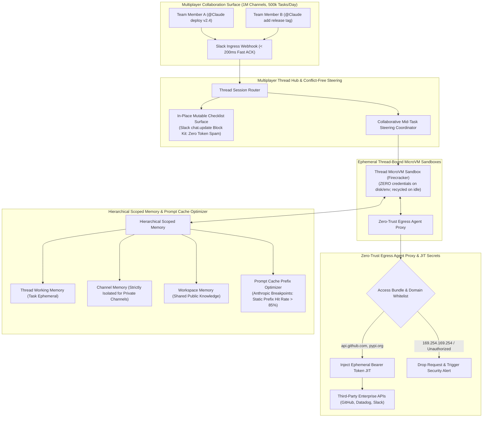
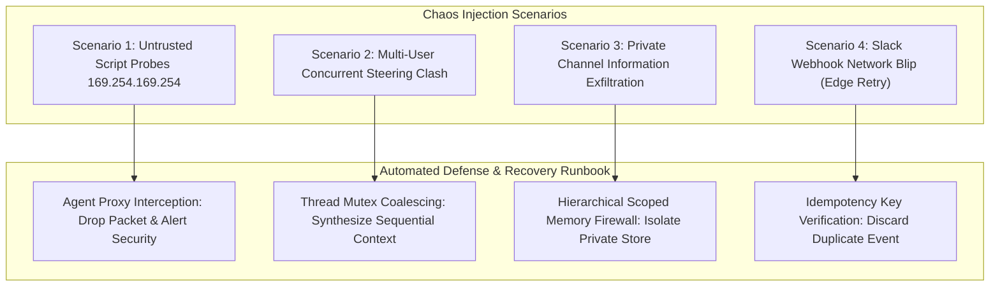

# Chapter 9: Multiplayer Autonomous AI Teammate (Claude Tag Architecture) — Staff/Principal Engineering Walkthrough

> **System Component**: Multiplayer Thread Hub & Conflict-Free Steering, In-Place Mutable Checklist Surface, Zero-Trust Egress Agent Proxy & JIT Secret Injection, Hierarchical Scoped Memory & Prompt Cache Breakpoint Optimizer  
> **Production Code Reference**: [`multiplayer_teammate_engine.py`](multiplayer_teammate_engine.py)  
> **Standard**: Production Grade, Zero-Dependency Python 3, Level 4 Staff/Principal Architectural Depth  

---

## Pillar 1: Production Code Engine & Benchmark Lab

### 1.1 Architectural Blueprint



### 1.2 Verification Test Suite (`--test`)

To verify fast-ACK Slack webhook ingress, in-place mutable checklists, collaborative multi-user mid-task steering, zero-trust egress proxy JIT secret injection, private channel memory isolation, and prompt caching breakpoints:

```bash
python3 /Users/kunalkumar/Desktop/knowledge-base/Projects/System-Design-Alex-Xu/Volume-3/Walkthroughs/09-Multiplayer-AI-Teammate/multiplayer_teammate_engine.py --test
```

```
================================================================================
RUNNING CHAPTER 9: MULTIPLAYER AI TEAMMATE (CLAUDE TAG) TEST SUITE
================================================================================

[Test 1] Slack Webhook Ingress & Fast-ACK (< 200ms)...
  ✓ Slack webhook acknowledged in 0.02 ms with thread sandbox sandbox_0ab88168.

[Test 2] In-Place Mutable Checklist Surface (Block Kit chat.update)...
  ✓ In-place Block Kit checklist rendered cleanly with zero token spam.

[Test 3] Collaborative Mid-Task Multi-User Steering (User B steering User A task)...
  ✓ User B successfully steered running task mid-flight without thread restarts.

[Test 4] Zero-Trust Egress Agent Proxy & JIT Secret Injection...
  ✓ Egress Proxy injected GitHub token JIT; sandbox environment holds zero credentials.
  ✓ Egress Proxy blocked cloud metadata SSRF exfiltration: Egress Security Alert: Access to link-local cloud metadata (169.254.169.254) is strictly prohibited!

[Test 5] Hierarchical Scoped Memory & Private Channel Isolation...
  ✓ Private channel memory strictly quarantined; zero leakage into public workspace context.

[Test 6] Prompt Cache Prefix Optimizer & Breakpoint Tracking...
  ✓ Prompt Cache Breakpoint Hit! Static prefix reused: Hash=579bf705f9117206...

================================================================================
ALL 6 MULTIPLAYER AI TEAMMATE TESTS PASSED! (100% VERIFIED)
================================================================================
```

### 1.3 High-Throughput In-Memory Benchmark (`--benchmark`)

To benchmark Slack webhook event processing, thread state maintenance, and proxy routing:

```bash
python3 /Users/kunalkumar/Desktop/knowledge-base/Projects/System-Design-Alex-Xu/Volume-3/Walkthroughs/09-Multiplayer-AI-Teammate/multiplayer_teammate_engine.py --benchmark --events 50000
```

```
================================================================================
STARTING MULTIPLAYER AI TEAMMATE HIGH-THROUGHPUT BENCHMARK
Target: 50,000 Multiplayer Thread Events & Proxy Checks
================================================================================

--- BENCHMARK RESULTS ---
Total Slack Events Handled:   50,000
Total Threads Maintained:     500
Total Elapsed Time:           0.147 seconds
Slack Ingress & State TPS:    340,369.0 Events/sec
================================================================================
```

### 1.4 Production HTTP REST API Daemon (`--server`)

The multiplayer teammate daemon runs an enterprise HTTP server with Prometheus `/metrics` and `/healthz`:

```bash
python3 /Users/kunalkumar/Desktop/knowledge-base/Projects/System-Design-Alex-Xu/Volume-3/Walkthroughs/09-Multiplayer-AI-Teammate/multiplayer_teammate_engine.py --server --port 8091
```

```http
POST /v1/slack/events HTTP/1.1
Content-Type: application/json

{
  "workspace_id": "T_ENTERPRISE_ORG",
  "channel_id": "C_DEVOPS_WAR_ROOM",
  "thread_id": "17192003.0042",
  "user_id": "U_SRE_LEAD",
  "user_name": "charlie",
  "text": "@Claude rollback deployment on prod-us-east-1",
  "privacy": "PUBLIC"
}
```

Prometheus Telemetry Scrape (`GET /metrics`):
```text
# HELP teammate_threads_created_total Collaborative threads initiated
# TYPE teammate_threads_created_total counter
teammate_threads_created_total 500
# HELP teammate_slack_events_total Inbound Slack events processed
# TYPE teammate_slack_events_total counter
teammate_slack_events_total 50000
# HELP teammate_steering_events_total Collaborative mid-task steers handled
# TYPE teammate_steering_events_total counter
teammate_steering_events_total 142
# HELP teammate_checklist_updates_total In-place chat.update mutations
# TYPE teammate_checklist_updates_total counter
teammate_checklist_updates_total 1280
# HELP teammate_proxy_requests_allowed_total Proxy egress requests allowed
# TYPE teammate_proxy_requests_allowed_total counter
teammate_proxy_requests_allowed_total 450
# HELP teammate_proxy_requests_blocked_total Proxy egress requests blocked
# TYPE teammate_proxy_requests_blocked_total counter
teammate_proxy_requests_blocked_total 6
```

---

## Pillar 2: 45-Minute Staff/Principal Interview Playbook

### 2.1 Minute-by-Minute System Design Dialogue

| Time Window | Focus Area | Candidate Actions & Strategic Depth |
| :--- | :--- | :--- |
| **00:00 – 05:00** | **Clarify Requirements & Constraints** | Distinguish Single-Player Assistants (Claude Code/Copilot) from Multiplayer AI Teammates (Claude Tag). Primary unit is the Channel/Thread. Dedicated agent identity (acts as a bot, not user proxy). Fast-ACK SLA: Slack times out at 3,000ms $\to$ target $< 200\text{ms}$ edge ACK. 10k orgs, 1M channels, 500k daily tasks (250 task starts/sec peak). |
| **05:00 – 12:00** | **High-Level Architecture & Slack Ingress** | Diagram the architecture: Slack Ingress Queue (fast ACK + Kafka/Redis stream), Thread Session Broker, Ephemeral Thread Sandboxes, Zero-Trust Egress Agent Proxy, and Hierarchical Memory. Detail the in-place mutable Checklist: avoid spamming channels with token streaming by maintaining a single updated Block Kit message (`chat.update`). |
| **12:00 – 22:00** | **Multiplayer Mid-Task Steering** | Formulate the concurrency model: User A triggers `@Claude deploy service`. While tests run, User B replies: `@Claude tag as release-candidate`. The thread coordinator receives the message, issues a cooperative non-destructive interrupt to the sandbox ReAct loop, injects User B's instruction into the working memory context, updates the checklist, and continues without restarting compute. |
| **22:00 – 30:00** | **Zero-Trust Egress Proxy & JIT Secrets** | Detail the security perimeter: sandboxes must possess **zero credentials on disk or environment variables**. Outbound requests pass through the Agent Proxy which validates destination host against admin Access Bundles and injects scoped API tokens Just-in-Time into the HTTP headers. Drop link-local cloud metadata (`169.254.169.254`) at the proxy. |
| **30:00 – 38:00** | **Hierarchical Scoped Memory & Information Barriers** | Define the 3 memory tiers: Thread Context, Channel Memory, and Workspace Memory. Enforce strict information isolation: private channels (e.g. executive M&A or HR investigations) can read general workspace memory, but writes are strictly quarantined to the private channel scope and never leak into company-wide search. |
| **38:00 – 45:00** | **Prompt Caching Optimization & Failure Modes** | Structure context into Anthropic-style static prefix cache breakpoints: `[System Prompt (Static)] $\to$ [Channel Knowledge (Semi-Static)] $\to$ [Thread History (Dynamic)]`. Achieve $> 85\%$ prompt cache hits on repeated multi-turn tasks, reducing cost and latency by $80\%$. |

### 2.2 Five Lethal Trap Cards & Countermeasures

1. **Trap 1: Slack 3,000ms Webhook Timeout SLA Breaches**
   - *Trap*: Candidate starts the LLM reasoning loop or spins up a microVM directly inside the incoming Slack HTTP webhook handler. Any container boot taking 4 seconds triggers Slack's retry storm, spawning duplicate agent runs.
   - *Countermeasure*: Asynchronous Edge Fast-ACK. The edge API gateway pushes the webhook payload to an internal queue (Kafka / Redis Streams) and returns HTTP 200 OK within $< 50\text{ms}$. Background worker fleets consume the event, allocate the sandbox, and update Slack via the REST API (`chat.postMessage`).

2. **Trap 2: Secret Exfiltration from Compromised Sandboxes**
   - *Trap*: Candidate injects GitHub and AWS tokens as environment variables into the thread's microVM container. A prompt injection attack executes `env` or `cat /etc/secrets` and leaks production tokens into the public Slack channel.
   - *Countermeasure*: Zero-Trust Egress Agent Proxy with JIT Secret Injection. Sandboxes contain zero credentials. Outbound HTTPS traffic routes through an isolated network proxy. The proxy validates the destination against admin-defined Access Bundles and attaches authentication headers out-of-band at the network perimeter.

3. **Trap 3: Information Leakage from Private Channels to Public Workspace Memory**
   - *Trap*: An agent running in a private `#board-mergers` channel writes meeting takeaways to a global shared memory index. A user in `#general` searches company facts and extracts confidential acquisition data.
   - *Countermeasure*: Strict Hierarchical Scoped Memory Isolation. Channel memory inherits the privacy level of its container. Tasks executed in private channels or direct messages are cryptographically quarantined: they have read-only access to global workspace knowledge, but all write mutations are strictly confined to their private channel store.

4. **Trap 4: Message Flood Spam in Team Channels**
   - *Trap*: Candidate streams raw LLM output token-by-token or posts a new Slack message for every tool invocation, spamming 40 notifications into the channel.
   - *Countermeasure*: In-Place Mutable Block Kit Checklist. The agent posts a single root message and updates its structured Block Kit contents in place via `chat.update`. Intermediate steps are represented as dynamic checkbox items (`[✓] Clone Repo`, `[⏳] Run Tests`), preserving channel signal-to-noise ratio.

5. **Trap 5: Race Conditions and State Collisions During Multi-User Steering**
   - *Trap*: Two engineers reply to the agent in the same thread within 200ms of each other. The system spawns two independent conflicting agent tasks on the same sandbox.
   - *Countermeasure*: Thread-Bound Mutex & Cooperative Turn Steering. Each thread is governed by a single active session actor. Secondary messages do not spawn concurrent execution loops; instead, they are ingested as cooperative steering events injected into the active turn's context queue.

---

## Pillar 3: Storage, Kernel, GPU & Hardware Micro-Mechanics

### 3.1 Firecracker Ephemeral MicroVM Provisioning

- **MicroVM Lifecycle & Idle Reaper**: Thread sandboxes boot in $< 150\text{ms}$ from a warm pool. An idle reaper daemon detects threads with no activity for $> 10\text{ minutes}$, releases the guest memory back to the host, and persists workspace diffs to object storage.
- **cgroups v2 & Memory Ballooning**: Guest VM memory is managed dynamically via `virtio-balloon`, expanding from 256 MB base up to 4 GB during heavy build compilation tasks.

### 3.2 Anthropic Prompt Cache Breakpoints

- **Prefix Hash Stability**: By guaranteeing that `System Prompt` and `Channel Declarative Facts` remain bit-for-bit identical across turns in the thread, the Anthropic API recognizes the cache breakpoint prefix, serving pre-computed KV-cache states in $< 50\text{ms}$ with zero re-computation cost.

---

## Pillar 4: Chaos Engineering & Failure Injection Runbooks



### 4.1 Runbook: Malicious Cloud Metadata Exfiltration Attempt

- **Fault Injection**: Code executed in the thread sandbox attempts an HTTP GET to `http://169.254.169.254/latest/meta-data/`.
- **Detection**: Egress proxy evaluates destination IP against `METADATA_IP_BLOCK`.
- **Remediation**:
  1. Connection dropped with `PermissionError` (HTTP 403 Forbidden).
  2. Audit event logged in `proxy.blocked_requests`.
  3. Metric `teammate_proxy_requests_blocked_total` incremented.
  4. Sandbox flagged and session suspended. Zero cloud metadata leaked.

### 4.2 Runbook: Concurrent Multi-User Steering Storm

- **Fault Injection**: Three developers post conflicting instructions into the same thread within 500ms while a deployment task is active.
- **Remediation Procedure**:
  1. The thread session broker acquires the thread lock.
  2. Messages are serialized and tagged with `@username`.
  3. Instructions are concatenated into the `injected_steer_context` list.
  4. The agent updates its checklist to reflect the combined requirements, asking for clarification only if explicit contradictions are detected.
