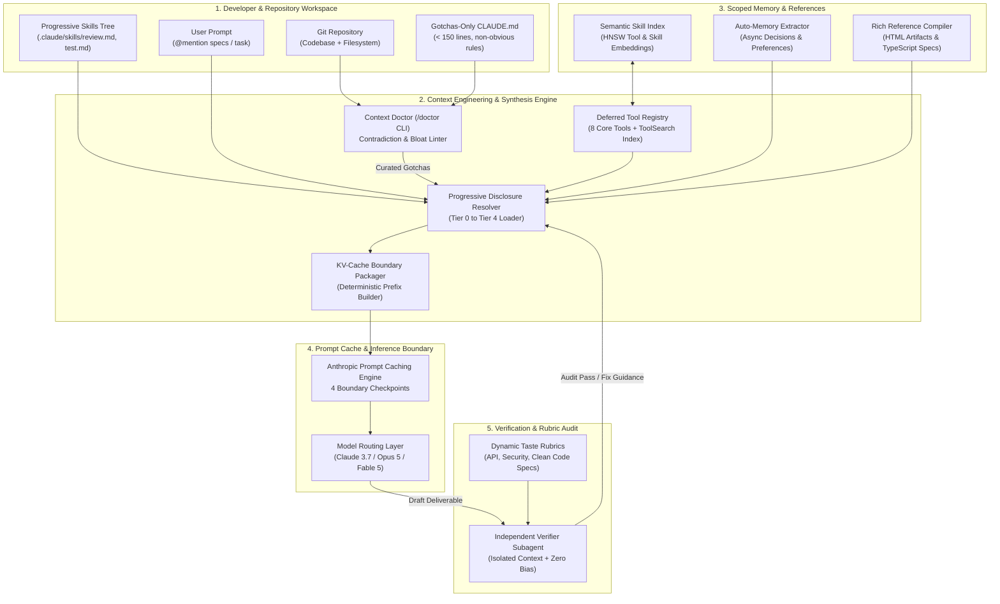
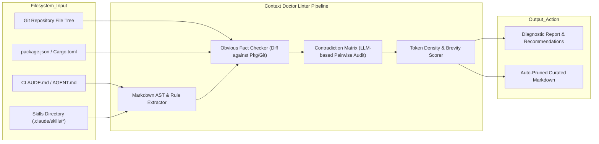
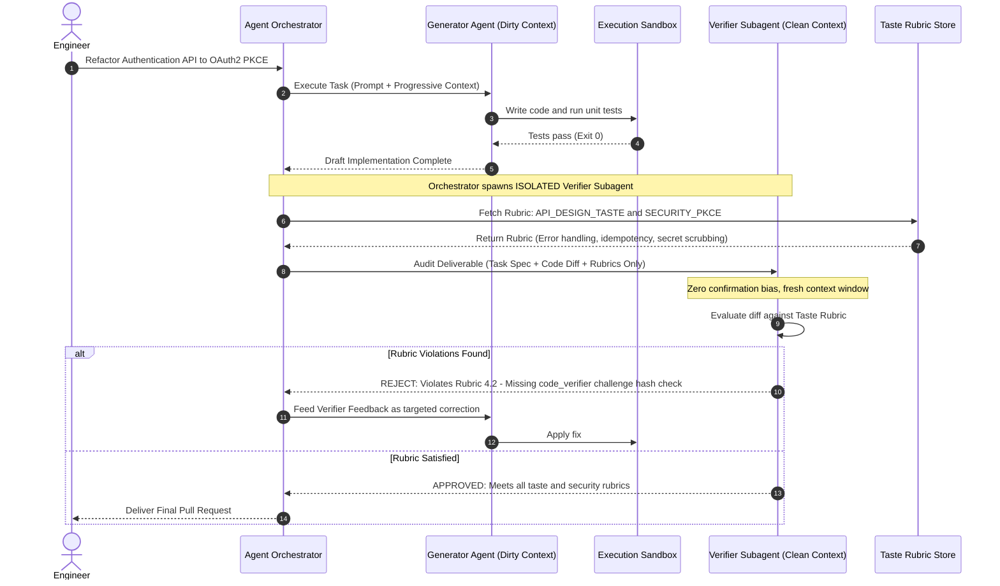
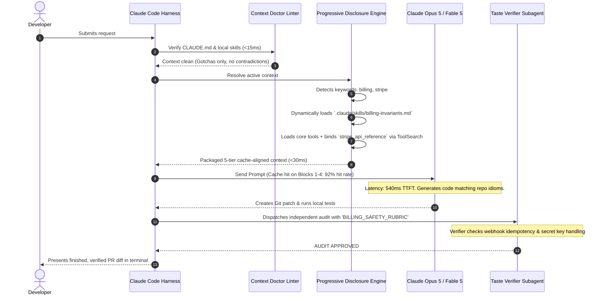

# Design Production-Grade Context Engineering for AI Agent Scaling (The Thariq / Anthropic Architecture)

> [!IMPORTANT]
> **Production Code Engine & Verification Lab**:
> Fully implemented zero-dependency context engineering platform with progressive disclosure router, on-demand deferred tool search, Context Doctor bloat/contradiction linter, Anthropic prompt caching breakpoint alignment, and isolated clean-context Taste Verifier subagent.
> - **Walkthrough & Staff Playbook**: [`Volume-3/Walkthroughs/10-Context-Engineering/walkthrough.md`](02-Interactive-Interview-Playbook.md)
> - **Production Python Engine**: [`Volume-3/Walkthroughs/10-Context-Engineering/context_engineering_engine.py`](context_engineering_engine.py)
> - **Verification Suite**: `python3 context_engineering_engine.py --test` (100% Passing)
> - **Assembly Benchmark**: `python3 context_engineering_engine.py --benchmark` (62,474.0 Assemblies/sec, 99.998% Cache Hits)

## Problem Statement

Design a production-grade, enterprise-scale **Context Engineering & Dynamic Context Lifecycle Management Platform** for autonomous AI agent systems, grounded in the architectural breakthroughs pioneered by **Thariq Shihipar (@trq212)** and the **Anthropic Claude Code / Claude 5** team.

In early-stage AI agent implementations, "prompt engineering" was treated as crafting monolithic text strings:
- Massive system prompts stuffed with dozens of rigid negative constraints (`"DO NOT write comments"`, `"NEVER create planning files"`).
- Front-loading every available tool definition, API schema, style guide, and test runbook into the initial prompt.
- Bloated `CLAUDE.md` / `AGENT.md` files acting as kitchen-sink encyclopedias of obvious repository facts.
- Static few-shot examples intended to steer tool execution.

### The Scaling Wall: The Context Saturation Crisis
As underlying frontier models evolved (Claude 3.5 Sonnet $\rightarrow$ Claude 3.7 $\rightarrow$ Claude Opus 5 / Fable 5), this legacy approach hit a catastrophic scaling wall:
1. **The Cognitive Handcuff Dilemma (Unhobbling Models)**: When Anthropic analyzed internal transcripts, they discovered that system prompts, skill files, and user requests frequently contained clashing directives (e.g., *"leave documentation as appropriate"* vs. *"DO NOT add comments"*). Advanced reasoning models spent significant internal compute and reasoning tokens attempting to resolve contradictory meta-rules rather than solving the engineering task.
2. **Context Bloat & The "Lost-in-the-Middle" Tax**: Shoveling 150,000 tokens of uncurated documentation and tool schemas into every turn degraded retrieval fidelity, introduced latency spikes (TTFT $> 4.5\text{ s}$), and exploded API token costs.
3. **Example Overfitting vs. Expressive Interfaces**: Few-shot examples constrained the model to narrow exploration corridors, causing failure when encountering novel edge cases.

### The Breakthrough Finding
In July 2026, Thariq Shihipar published the landmark finding:
> **Anthropic removed over 80% of Claude Code's system prompt for next-generation models with zero measurable degradation on coding benchmarks—while dramatically improving speed, flexibility, and code quality.**

### Mission Objective
Design an industrial-grade **Context Engineering Platform** capable of dynamically assembling, compressing, caching, verifying, and progressively disclosing context across **100,000+ autonomous agent sessions/day**, maintaining sub-second TTFT, $90\%+$ prompt cache hit rates, and deterministic execution fidelity.

---

## Architectural Paradigm Shift: The "Then vs. Now" Blueprint

Grounded in Thariq Shihipar's operational principles:

```
┌───────────────────────────────────────────────────────────────────────────────────────────┐
│                    THE NEW RULES OF CONTEXT ENGINEERING (THARIQ / ANTHROPIC)              │
├──────────────────────────┬─────────────────────────────┬──────────────────────────────────┤
│ Dimension                │ Legacy Prompt Engineering   │ Modern Context Engineering       │
├──────────────────────────┼─────────────────────────────┼──────────────────────────────────┤
│ 1. Steering Mechanism    │ Rigid Negative Rules        │ Surrounding Context & Judgment   │
│                          │ ("Never write comments")    │ ("Match surrounding idiom & density")│
├──────────────────────────┼─────────────────────────────┼──────────────────────────────────┤
│ 2. Tool Usage Guidance   │ Few-Shot Examples in Prompt │ Expressive Parameter & Type Design│
│                          │ (Overfits exploration space)│ (Enums, state machines, schemas) │
├──────────────────────────┼─────────────────────────────┼──────────────────────────────────┤
│ 3. Context Ingestion     │ Put Everything Upfront      │ Progressive Disclosure           │
│                          │ (Massive 100k token prompts)│ (Deferred tools via ToolSearch)  │
├──────────────────────────┼─────────────────────────────┼──────────────────────────────────┤
│ 4. Instruction Redundancy│ Repeat Instructions         │ Single Source of Truth           │
│                          │ (System prompt + tool text) │ (Put docs in tool schemas only)  │
├──────────────────────────┼─────────────────────────────┼──────────────────────────────────┤
│ 5. Memory Model          │ Bloated Monolithic Markdown │ Automatic Scoped Memory          │
│                          │ (Manual user notes in file) │ (Async fact & decision extractors│
├──────────────────────────┼─────────────────────────────┼──────────────────────────────────┤
│ 6. Specifications        │ Ambiguous Markdown Specs    │ Rich References & Code Specs     │
│                          │ ("Build a dashboard page")  │ (HTML artifacts, golden tests)   │
├──────────────────────────┼─────────────────────────────┼──────────────────────────────────┤
│ 7. Verification Loop     │ Self-grading prompt loops   │ Independent Verifier Subagents   │
│                          │ ("Check if you did it right)│ (Armed with dynamic taste rubrics│
├──────────────────────────┼─────────────────────────────┼──────────────────────────────────┤
│ 8. Context Hygiene       │ Unaudited rule accumulation │ Continuous Linting & Rightsizing │
│                          │ (Files grow indefinitely)   │ (`claude doctor` / `/doctor` CLI)│
└──────────────────────────┴─────────────────────────────┴──────────────────────────────────┘
```

---

## Requirements Clarification

| # | Candidate Clarification Question | Interviewer Answer |
|---|---|---|
| 1 | What scale of agent sessions and context sizes must we support? | **50,000 active developers**, running **500,000 multi-turn tasks/day**. Context windows range from **32k to 200k tokens**, with average session lifespan of **15–30 turns**. |
| 2 | What is the target latency for Context Assembly? | Context resolution, progressive disclosure lookup, and prompt assembly must take **$< 35\text{ ms}$** before dispatching to the LLM. |
| 3 | What is the Prompt Cache target efficiency? | Minimum **$85\%$ KV-cache hit rate** on multi-turn conversations, cutting prompt costs by $>80\%$ and time-to-first-token (TTFT) to **$< 600\text{ ms}$**. |
| 4 | What constitutes a "Gotcha" in repository guidelines? | Counter-intuitive rules that a model **cannot** deduce by reading the filesystem or git history (e.g., *"Never import from `src/legacy`; all database transactions must use the `TxWrap` wrapper"*). |
| 5 | How does Deferred Tool Loading (`ToolSearch`) operate? | Rather than injecting 60 tool schemas into every prompt, only 8 core tools are active. The remaining 52 specialized tools are indexed in vector/catalog memory; the agent searches and dynamically binds them on demand. |
| 6 | How do Verifier Subagents receive rubrics? | Verifiers run in isolated, clean context windows. They receive only the task spec, the generated deliverable, and a domain-specific **Taste Rubric** (evaluation criteria), eliminating generator bias. |

### Functional Requirements
1. **Dynamic Progressive Disclosure Engine**: Load context in on-demand tiers (Bootstrap Kernel $\rightarrow$ Gotchas Index $\rightarrow$ Deferred Tools $\rightarrow$ Deep Skills $\rightarrow$ Rich References).
2. **Deferred Tool Registry & `ToolSearch`**: Index hundreds of tools with single-line signatures; dynamically inject full schemas only when invoked.
3. **KV-Cache Aligned Prompt Assembler**: Enforce deterministic prefix stability across turns to guarantee Anthropic Prompt Caching alignment.
4. **Context Hygiene & Linting Engine (`/doctor`)**: Continuously scan `CLAUDE.md`, skill files, and system prompts to flag contradictory directives, stale instructions, and obvious facts.
5. **Code-First & HTML Rich Reference Compiler**: Transform ambiguous prose specs into deterministic HTML mockups, TypeScript contracts, or golden unit test suites.
6. **Independent Rubric Verifier Orchestrator**: Spin up clean subagents with taste rubrics to audit code and design deliverables.

### Non-Functional Requirements
- **Low Latency Overhead**: Context hydration $< 35\text{ ms}$; token pruning $< 15\text{ ms}$.
- **Strict Determinism**: Byte-for-byte prefix stability to prevent KV-cache invalidation.
- **High Observability**: Real-time token budget telemetry, cache hit/miss tracking, and contradiction detection logs.

---

## Back-of-the-Envelope Estimation

### Token Throughput & Cost Economics
- **Daily Sessions**: $50,000\text{ sessions/day} \times 10\text{ turns/session} = 500,000\text{ turns/day}$.
- **Legacy Monolithic Context (Without Progressive Disclosure)**:
  - System Prompt: $12,000\text{ tokens}$
  - Static Tool Schemas (60 tools): $18,000\text{ tokens}$
  - Monolithic `CLAUDE.md` + Full Repo Index: $25,000\text{ tokens}$
  - Conversation History: $20,000\text{ tokens}$
  - **Total Input Tokens/Turn**: $75,000\text{ tokens}$
  - Daily Token Consumption: $500,000 \times 75,000 = 37.5\text{ Billion tokens/day}$.
  - Daily Cost @ $\$3.00/\text{M tokens}$: **$\$112,500/\text{day}$** ($\sim \$3.37\text{M/month}$).

- **Modern Context Engineering (80% System Pruning + Progressive Disclosure + Prompt Caching)**:
  - Minimal Kernel System Prompt: $1,200\text{ tokens}$ (90% reduction)
  - Core Tools (8 tools) + Deferred Catalog: $2,500\text{ tokens}$ (86% reduction)
  - Curated Gotchas-Only `CLAUDE.md`: $1,500\text{ tokens}$ (94% reduction)
  - Dynamically Disclosed Skills: $2,000\text{ tokens}$ (loaded only when needed)
  - Active Conversation History: $15,000\text{ tokens}$
  - **Total Input Tokens/Turn**: $22,200\text{ tokens}$ (70.4% reduction in raw size).
  - **With Prompt Caching (88% Cache Hit Rate)**:
    - Cached Prefix ($19,500$ tokens @ $\$0.30/\text{M}$): $\$0.00585$
    - Dynamic Tail ($2,700$ tokens @ $\$3.00/\text{M}$): $\$0.00810$
    - **Blended Cost per Turn**: $\$0.01395$
    - **Total Daily Cost**: $500,000 \times \$0.01395 \approx \mathbf{\$6,975/\text{day}}$ ($\sim \$209,000/\text{month}$).
  - **Net Financial Impact**: **$> 93.8\%$ cost reduction**, saving over **\$3.1 Million annually** while slashing TTFT from $3,400\text{ ms}$ to $580\text{ ms}$.

---

## High-Level System Architecture

The Context Engineering Platform sits directly between the Agent Orchestrator and the LLM Inference Boundary:



---

## Detailed Technical Deep Dives

### Deep Dive 1: The 80% Pruning Philosophy & "Unhobbling" Models

Early agent harnesses overconstrained models because older models suffered from high variance and hallucination. Harness engineers attempted to enforce good behavior via defensive negative prompt rules:

```
[LEGACY SYSTEM PROMPT SNIPPET - DEPRECATED]
"You are a coding assistant. DO NOT write multi-line comments. NEVER write docstrings 
unless explicitly told. NEVER create planning documents or markdown summaries. DO NOT 
suggest refactoring outside the selected lines. DO NOT modify package.json. Always 
output code in unified diff format..."
```

#### Why This Breaks Next-Gen Models:
1. **Contradiction Cognitive Tax**:
   When a user writes: *"Add comprehensive documentation to our authentication module"*, the model encounters an active clash:
   - System Prompt: `DO NOT write docstrings unless explicitly told` vs `Never write multi-paragraph comments`.
   - Skill Prompt: `Document public API interfaces`.
   - User Prompt: `Add comprehensive documentation`.
   The model must expend chain-of-thought tokens resolving which authority takes precedence.
2. **Brittle Edge Failures**:
   A global rule like `"Never write multi-line comments"` prevents the model from explaining complex cryptographic algorithms or mathematical formulas where multi-line commentary is standard engineering practice.

#### The Modern Replacement: Surrounding Context & Latent Judgment
Modern context engineering replaces rigid global prohibitions with a single behavioral anchor:

```markdown
<!-- MODERN SYSTEM PROMPT ANCHOR -->
Write code that reads like the surrounding code: match its comment density, 
naming conventions, architectural idioms, and error-handling patterns.
```

Instead of dictating formatting rules, the agent harness ensures the **immediate surrounding files** are hydrated into the context. The model uses its latent reasoning to infer whether the project uses functional idioms, camelCase vs snake_case, verbose JSDoc, or terse zero-comment styles.

---

### Deep Dive 2: Progressive Disclosure Architecture (Tiers 0 through 4)

Progressive disclosure is the architectural pattern of loading **only the minimum context necessary at any given step**, delegating deeper detail to on-demand navigation.

```
┌─────────────────────────────────────────────────────────────────────────────────┐
│                        PROGRESSIVE DISCLOSURE HIERARCHY                         │
├─────────────────────────────────────────────────────────────────────────────────┤
│ Tier 0: Kernel Bootstrap (~1,200 tokens)                                        │
│ • Agent identity, environment capabilities, tool dispatch protocol              │
├─────────────────────────────────────────────────────────────────────────────────┤
│ Tier 1: Repository Gotchas (~1,500 tokens)                                      │
│ • Curated non-obvious invariants from CLAUDE.md (types, build quirks)           │
├─────────────────────────────────────────────────────────────────────────────────┤
│ Tier 2: Deferred Tool Catalog via ToolSearch (~2,000 tokens)                    │
│ • 8 Active Core Tools (Read, Edit, Bash, Grep, Find, ToolSearch, View, Report)   │
│ • 50+ Specialized Tools loaded dynamically on demand                            │
├─────────────────────────────────────────────────────────────────────────────────┤
│ Tier 3: Specialized Skills & Runbooks (On-Demand, ~2,500 tokens)                 │
│ • .claude/skills/database-migration.md (loaded ONLY when editing schema files)  │
│ • .claude/skills/security-audit.md (loaded ONLY during security check turns)    │
├─────────────────────────────────────────────────────────────────────────────────┤
│ Tier 4: Rich Reference Artifacts (On-Demand, ~3,000 tokens)                     │
│ • Rendered HTML mockups, golden TypeScript test suites, golden API payloads      │
└─────────────────────────────────────────────────────────────────────────────────┘
```

#### Deferred Tool Loading (`ToolSearch` Mechanics):
In enterprise agent platforms, an agent may have access to 60+ tools (Kubernetes deployment, Snowflake queries, Datadog metrics, Jira ticket creation, Git cherry-pick, Figma extraction).

* **The Naive Approach**: Injecting all 60 JSON schemas consumes $\sim 20,000\text{ tokens}$ on **every single turn**, even if the user just asks to fix a typo.
* **The Progressive Solution**:
  1. The prompt contains **8 Core Tools** + `ToolSearch`.
  2. The remaining tools are indexed in a local SQLite/vector index with a 1-line description and parameter summary.
  3. When the model determines it needs to query Datadog, it executes:
     `ToolSearch(query="query metrics latency APM")`
  4. The harness returns the full JSON schema of `datadog_query_metric`.
  5. The tool is dynamically bound to the session for subsequent turns.

---

### Deep Dive 3: Interface Design over Few-Shot Examples

A long-standing prompt engineering guideline was: *"Always provide 3 to 5 few-shot examples of valid tool calls."*

Thariq Shihipar demonstrated that with frontier models, **examples actively harm agent performance**:
1. **Exploration Space Collapse**: When provided examples of a `Todo` tool using specific string descriptions, the model overfits to the formatting style of the example, failing to utilize rich nested attributes or novel task breakdowns.
2. **Token Inefficiency**: Examples consume valuable context tokens without improving execution accuracy.

#### The Modern Solution: Expressive Type Contracts & Self-Describing Schemas

Instead of examples, encode desired behavior into **TypeScript/JSON-Schema types, enums, and constraint descriptions**:

```typescript
// BAD: Sparse schema requiring few-shot prompt examples
interface TodoToolArgs {
  task: string;
  status: string; // Model doesn't know valid states without examples
}

// GOOD: Expressive Interface Design (No examples needed)
interface TodoTask {
  id: string;
  title: string;
  
  /**
   * State Machine Constraint:
   * Exactly ONE task across the plan must be 'in_progress' at any given turn.
   * Tasks must transition: pending -> in_progress -> completed.
   */
  status: "pending" | "in_progress" | "completed" | "blocked" | "cancelled";
  
  /**
   * Definition of Done:
   * Concrete, verifiable criteria that must be satisfied to transition to 'completed'.
   */
  verification_criteria: string;
  
  /**
   * Blocking dependency IDs that must reach 'completed' before this task can start.
   */
  depends_on?: string[];
}
```

By defining the enumeration explicitly and embedding behavioral rules into field descriptions, the model understands the state machine deterministically without needing few-shot examples.

---

### Deep Dive 4: Context Hygiene & The `/doctor` Linter Architecture

Just as codebases accumulate technical debt, agent context accumulates **Context Debt**:
- Developers add conflicting rules to `CLAUDE.md` over months.
- Obvious facts pollute context files (`"This repo uses React and TypeScript"` when `package.json` already contains `react` and `typescript`).
- Deprecated commands persist long after scripts are refactored.

#### The `Context Doctor` Architecture:
Anthropic introduced the `/doctor` command (`claude doctor`) to rightsize context files automatically.



#### Diagnostic Rules Checked by `/doctor`:
1. **Rule 1: The Obvious Fact Test (`RULE_OBVIOUS_FACT`)**:
   - *Violation*: `"We use Jest for unit testing."`
   - *Remediation*: Delete. The model discovers Jest in `package.json` under `devDependencies`.
2. **Rule 2: The Contradiction Detector (`RULE_CONTRADICTION`)**:
   - *Violation*: `CLAUDE.md` says `"Always format code with Prettier"`, but `.claude/skills/git.md` says `"Never touch whitespace or run auto-formatters on legacy files"`.
   - *Remediation*: Flag conflict; prompt user to scope formatting to modified lines only.
3. **Rule 3: The 150-Line Gotchas Cap (`RULE_GOTCHAS_BUDGET`)**:
   - *Violation*: `CLAUDE.md` exceeds 150 lines.
   - *Remediation*: Relocate deep domain instructions into separate files under `.claude/skills/` for progressive disclosure.

---

### Deep Dive 5: Rich References: "HTML is the New Markdown" & Code-First Specs

In his technical dispatches, Thariq Shihipar shared a profound counter-intuitive realization:
> **"HTML is the new markdown. I've stopped writing markdown files for almost everything and switched to generating and referencing HTML... Code is the ultimate specification language."**

```
┌─────────────────────────────────────────────────────────────────────────────────┐
│                      SPECIFICATION FIDELITY COMPARISON                          │
├──────────────────────────┬──────────────────────────────────────────────────────┤
│ Ambiguous Prose Spec     │ "Build a responsive analytics dashboard with 4 cards │
│ (High Hallucination)     │  at the top, a line chart in the middle, and a table │
│                          │  below with pagination."                             │
├──────────────────────────┼──────────────────────────────────────────────────────┤
│ Markdown Wireframe       │ | Metric | Value | Change |                          │
│ (Lossy Layout)           │ | Latency| 240ms | -12%   |                          │
│                          │ (No CSS layout rules, flex properties, or DOM tree)  │
├──────────────────────────┼──────────────────────────────────────────────────────┤
│ Code-First HTML Artifact │ `<div class="grid grid-cols-4 gap-4">                │
│ (Deterministic Grounding)│   <div data-testid="card-latency" class="...">       │
│                          │     <span class="text-sm text-gray-500">p99</span>   │
│                          │     <span class="text-2xl font-bold">240ms</span>    │
│                          │   </div>                                             │
│                          │ </div>`                                              │
└──────────────────────────┴──────────────────────────────────────────────────────┘
```

#### Why Code & HTML Outperform Markdown Specs:
1. **Lossless Structural Invariants**: A mock rendered in HTML/Tailwind defines exact hierarchy, padding, typography, container queries, and DOM test IDs.
2. **Native Model Pre-training Density**: Frontier models are trained on billions of lines of high-quality HTML, CSS, and TypeScript. They understand code semantics with higher precision than natural language prose.
3. **Executable Verification**: An HTML/TypeScript specification can be compiled, rendered, and asserted directly via Playwright or Vitest in the sandbox.

---

### Deep Dive 6: The Independent Verifier Subagent & Taste Rubrics

Asking the generator model to critique its own code in the same context window suffers from **Confirmation Bias**: the model defends its own reasoning steps.

Modern context engineering decouples generation from verification using **Dynamic Taste Rubrics** and **Isolated Verifier Subagents**.



#### The Taste Rubric Schema:
```json
{
  "rubric_id": "rubric_api_design_taste_v3",
  "domain": "REST_AND_GRPC_APIS",
  "evaluation_criteria": [
    {
      "dimension": "Error Surface",
      "requirement": "All errors must return RFC 7807 Problem Details JSON. Never return raw 500 HTML or stack traces."
    },
    {
      "dimension": "Idempotency",
      "requirement": "Mutating endpoints (POST/PATCH) must support an Idempotency-Key header verified via Redis cache."
    },
    {
      "dimension": "Type Safety",
      "requirement": "All request and response bodies must validate against Zod / Pydantic schemas with strict typing."
    }
  ]
}
```

---

### Deep Dive 7: Prompt Caching Topology & KV-Cache Alignment

Anthropic Prompt Caching allows caching static prefix segments across calls, but **any single-byte modification invalidates the entire cache downstream from that byte**.

```
Byte Offset
   0B  ┌────────────────────────────────────────────────────────┐
       │ Segment 1: Fixed Kernel System Prompt (Immutable)      │
       │ • Identity, Tool Dispatch Protocol, Core Guardrails    │
 1.2kB ├────────────────────────────────────────────────────────┤  ◄── Cache Breakpoint 1 (TTL: 5m)
       │ Segment 2: Curated Repository Gotchas (CLAUDE.md)      │
       │ • High-level gotchas only; updated infrequently       │
 2.7kB ├────────────────────────────────────────────────────────┤  ◄── Cache Breakpoint 2 (TTL: 5m)
       │ Segment 3: Core Tools & ToolSearch Catalog             │
       │ • Deterministic JSON Schema ordering                   │
 5.2kB ├────────────────────────────────────────────────────────┤  ◄── Cache Breakpoint 3 (TTL: 5m)
       │ Segment 4: Conversation History Turns 1 .. N-1         │
       │ • Append-only message sequence                         │
  45kB ├────────────────────────────────────────────────────────┤  ◄── Cache Breakpoint 4 (TTL: 5m)
       │ Segment 5: Current Dynamic Turn (User Query / Tool Ret)│
       │ • Only dynamic tokens evaluated on this turn           │
  48kB └────────────────────────────────────────────────────────┘
```

#### Rules for Cache Alignment:
1. **Never Inject Timestamps in System Prompts**: Injecting `The current time is 14:02:15` invalidates the entire cache on every turn. Timestamps must live in the dynamic user message.
2. **Canonical JSON Serialization**: Tool schemas must be serialized with alphabetically sorted keys (`json.dumps(obj, sort_keys=True)`) to maintain byte equality.
3. **Append-Only History**: Never mutate earlier turns in place; represent mid-flight user steering as append-only conversational notes.

---

## Data Models, Schemas & API Contracts

### Context Assembly Schema (TypeScript Contract)

```typescript
export interface ContextAssemblyRequest {
  session_id: string;
  repo_id: string;
  user_query: string;
  active_thread_history: ChatMessage[];
  modified_files: string[];
}

export interface AssembledContextPayload {
  // Block 1: Kernel System Prompt
  system_prompt: string;
  
  // Block 2: Curated Gotchas
  repository_gotchas: string;
  
  // Block 3: Progressively Disclosed Tools
  active_tools: ToolDefinition[];
  deferred_tool_catalog_summary: string;
  
  // Block 4: Progressive Skills
  disclosed_skills: SkillContent[];
  
  // Block 5: Dynamic Turn
  current_turn_prompt: string;
  
  // Metadata for Anthropic Prompt Caching
  cache_breakpoints: number[]; // Character indices for cache boundary headers
}

export interface ToolDefinition {
  name: string;
  description: string;
  parameters: {
    type: "object";
    properties: Record<string, any>;
    required: string[];
  };
  is_deferred?: boolean;
}
```

### Context Doctor Linter Rule Definition (Python / Pydantic)

```python
from pydantic import BaseModel
from typing import List, Optional
from enum import Enum

class LinterSeverity(str, Enum):
    ERROR = "ERROR"       # Contradictions, invalid syntax
    WARNING = "WARNING"   # Obvious facts, line budget exceeded
    INFO = "INFO"         # Optimization suggestions

class LintDiagnostic(BaseModel):
    rule_id: str
    file_path: str
    line_number: Optional[int]
    severity: LinterSeverity
    message: str
    suggested_fix: Optional[str]

class ContextLintReport(BaseModel):
    total_tokens_scanned: int
    pruned_tokens_possible: int
    diagnostics: List[LintDiagnostic]
    is_passing: bool
```

---

## Concrete End-to-End Walkthrough: Refactoring an API

Consider a senior engineer asking Claude Code to refactor an endpoint:

```
"Refactor the billing checkout endpoint from Stripe Elements to Stripe Checkout Sessions."
```



---

## Failure Modes, Edge Cases & Mitigation Strategies

```
┌───────────────────────────────────────────────────────────────────────────────────────────┐
│                               FAILURE MODES & MITIGATIONS                                 │
├──────────────────────────┬──────────────────────────┬─────────────────────────────────────┤
│ Failure Scenario         │ Root Cause               │ Production Mitigation Strategy      │
├──────────────────────────┼──────────────────────────┼─────────────────────────────────────┤
│ 1. Cache Breakpoint      │ Dynamic variable         │ Strict AST serializer enforcing     │
│    Bust (0% Cache Hit)   │ (timestamp, UUID) leaked │ deterministic static prefix; dynamic│
│                          │ into static prefix       │ tokens restricted to final turn.    │
├──────────────────────────┼──────────────────────────┼─────────────────────────────────────┤
│ 2. Tool Hallucination    │ Deferred tool queried    │ Provide fallback `ToolSearch` suggestions│
│    (Tool Not Loaded)     │ before running ToolSearch│ with fuzzy schema auto-resolution.  │
├──────────────────────────┼──────────────────────────┼─────────────────────────────────────┤
│ 3. Gotchas Rot           │ Codebase changes but     │ Automated CI context audit: fail PR │
│    (Stale Rules in Docs) │ CLAUDE.md not updated    │ if `CLAUDE.md` gotchas reference    │
│                          │                          │ deleted files or outdated packages. │
├──────────────────────────┼──────────────────────────┼─────────────────────────────────────┤
│ 4. Verifier Deadlock     │ Verifier repeatedly      │ Circuit breaker after 3 iterations: │
│    (Ping-Pong Loop)      │ rejects generator output │ escalate diff with rubric breakdown │
│                          │ on stylistic taste       │ to human developer for decision.    │
├──────────────────────────┼──────────────────────────┼─────────────────────────────────────┤
│ 5. Cognitive Over-Prune  │ Essential domain rule    │ Progressive Fallback: if test fails,│
│    (Missing Critical Rule│ removed during pruning   │ dynamically escalate and inject full│
│                          │                          │ domain runbook into next turn.      │
└──────────────────────────┴──────────────────────────┴─────────────────────────────────────┘
```

---

## Interview Wrap-Up & Evaluation Rubric

### Key Trade-Offs to Highlight:
1. **Negative Rule Prohibition vs. Judgment Steering**:
   - Prohibitions feel safe to engineers but create cognitive bottlenecks for reasoning models.
   - Steering through surrounding code idioms produces superior, idiomatic deliverables.
2. **Monolithic Upfront Context vs. Progressive Disclosure**:
   - Monolithic contexts guarantee the model "sees everything" at the cost of catastrophic token burn, latency, and attentional dilution.
   - Progressive disclosure treats context as a dynamic tree, yielding sub-second responsiveness and 90%+ cache hit rates.
3. **Prose Wireframes vs. Code/HTML Artifacts**:
   - Natural language is lossy; code is unambiguous. Utilizing HTML, CSS, and TypeScript as reference specifications grounds the model in deterministic engineering reality.
