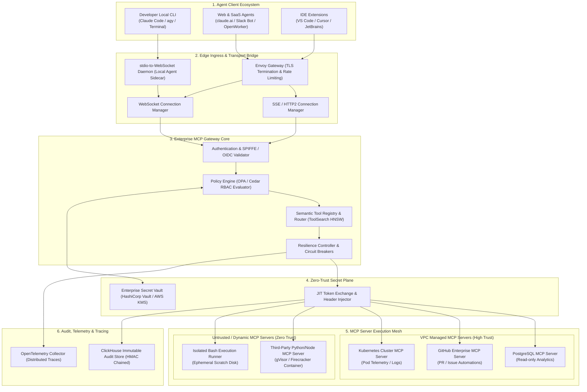
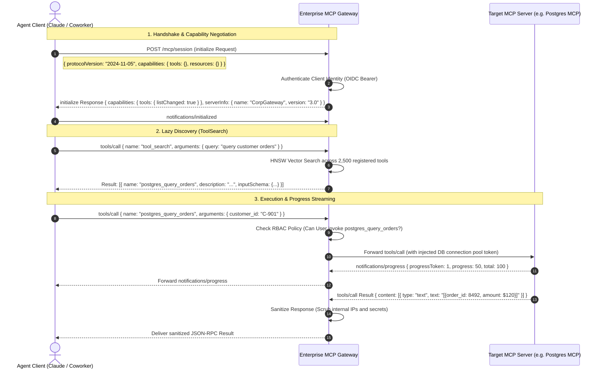
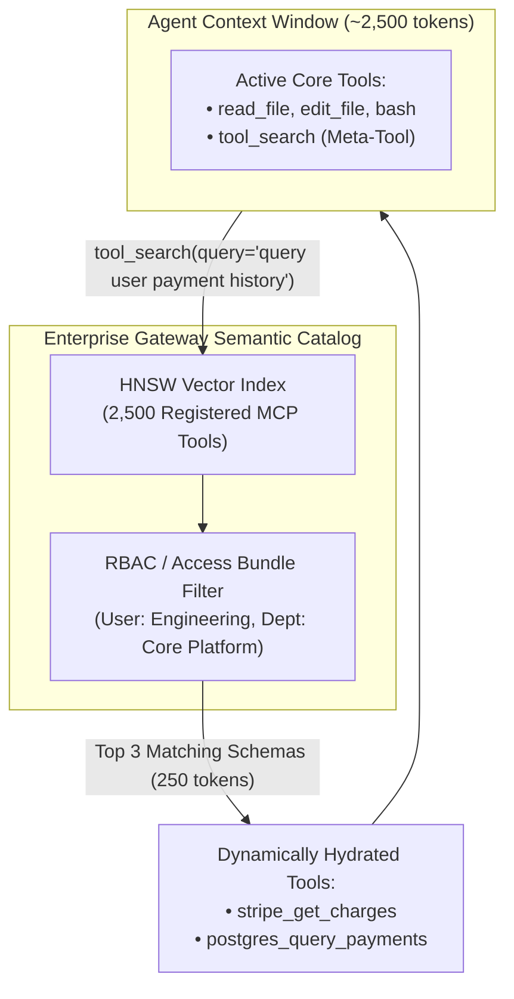
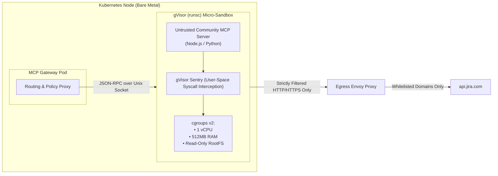
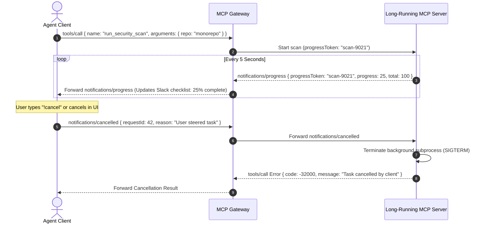

# Design an Enterprise Model Context Protocol (MCP) Gateway and Tool Federation Platform

> [!IMPORTANT]
> **Production Code Engine & Verification Lab**:
> Fully implemented zero-dependency Anthropic Model Context Protocol (MCP) gateway with full JSON-RPC 2.0 protocol engine, two-tier dynamic `tool_search` catalog, Zero-Trust RBAC with destructive query security floors, JIT ephemeral Vault token injector, distributed circuit breaker, and cryptographically chained HMAC-SHA256 audit log.
> - **Walkthrough & Staff Playbook**: [`Volume-3/Walkthroughs/11-MCP-Gateway-Platform/walkthrough.md`](02-Interactive-Interview-Playbook.md)
> - **Production Python Engine**: [`Volume-3/Walkthroughs/11-MCP-Gateway-Platform/mcp_gateway_engine.py`](mcp_gateway_engine.py)
> - **Verification Suite**: `python3 mcp_gateway_engine.py --test` (100% Passing)
> - **Routing Benchmark**: `python3 mcp_gateway_engine.py --benchmark` (103,773.5 Tool Calls/sec @ 9.64 us)

## Problem Statement

Design a production-grade, enterprise-scale **Model Context Protocol (MCP) Gateway and Tool Federation Platform** inspired by the architecture standardized by **Anthropic** and adopted across the modern autonomous agent ecosystem.

Before the Model Context Protocol (MCP), every AI platform, agent framework, and LLM application implemented custom, fragmented tool-calling integrations:
- Custom OpenAPI/Swagger wrappers, bespoke Python functions, proprietary LangChain/LlamaIndex tool interfaces.
- Hardcoded database and API credentials embedded in individual client runtimes.
- Point-to-point connections where adding $M$ models to $N$ enterprise systems required $M \times N$ custom integrations.
- Zero standardized security boundaries: tools ran with either unrestricted host access or opaque container privileges.

### The Universal Interoperability Standard: Anthropic MCP
Anthropic open-sourced the **Model Context Protocol (MCP)** as an open JSON-RPC 2.0 based protocol that standardizes how foundation models access three core primitives:
1. **Tools**: Executable functions that allow models to take actions (e.g., query database, execute bash, create GitHub PR).
2. **Resources**: Passive data sources that provide contextual data (e.g., file contents, API schemas, live system logs).
3. **Prompts**: Pre-configured templates and workflows exposed by servers.

### The Enterprise Challenge: Scaling MCP to 100,000+ Agents
While MCP provides an elegant client-to-server specification, deploying it across an enterprise with **50,000 developers**, **1,000+ internal microservices**, and **hundreds of distinct third-party SaaS platforms** creates severe architectural dilemmas:
1. **The Context Bloat Crisis**: Exposing 500 enterprise MCP servers upfront dumps thousands of tool schemas into the model's context window, degrading retrieval accuracy and consuming millions of unneeded tokens.
2. **The Security & Perimeter Dilemma**: MCP servers written in Python/Node by internal teams or open-source authors can execute arbitrary code or query internal databases. How do we enforce **Zero-Trust RBAC**, prevent **Server-Side Request Forgery (SSRF)**, manage **JIT credentials**, and sandbox untrusted MCP servers?
3. **Transport Heterogeneity**: Modern agents run across local developer workstations (using `stdio` process pipes), web browsers, and cloud microVMs (using `Server-Sent Events (SSE)` or `WebSockets` over HTTP/2 and mTLS). The system must bridge these transports transparently.

---

## Architectural Blueprint: The Enterprise MCP Federation Plane

```
┌───────────────────────────────────────────────────────────────────────────────────────────┐
│                    ENTERPRISE MCP GATEWAY ARCHITECTURAL PILLARS                           │
├──────────────────────────┬────────────────────────────────────────────────────────────────┤
│ 1. Unified Hub & Spoke   │ Bridges M agent clients to N enterprise MCP servers via a      │
│    Federation            │ centralized, scalable Gateway (reducing M x N to M + N).       │
├──────────────────────────┼────────────────────────────────────────────────────────────────┤
│ 2. Transport Abstraction │ Transparently multiplexes stdio (local child processes),       │
│                          │ SSE (Server-Sent Events over HTTP/2), and full-duplex WebSockets│
├──────────────────────────┼────────────────────────────────────────────────────────────────┤
│ 3. Lazy Tool Discovery   │ Indexes thousands of tools; dynamically exposes schemas via    │
│    (Context Optimization)│ semantic search (ToolSearch) and progressive disclosure tiers. │
├──────────────────────────┼────────────────────────────────────────────────────────────────┤
│ 4. Zero-Trust Security & │ Enforces fine-grained Access Bundles, OAuth2/OIDC token        │
│    JIT Vault Injection   │ exchange, and egress policy at the gateway proxy layer.        │
├──────────────────────────┼────────────────────────────────────────────────────────────────┤
│ 5. Isolated Sandboxing   │ Untrusted MCP servers execute inside gVisor/Firecracker        │
│                          │ micro-containers with strict cgroups v2 quotas and no secrets. │
├──────────────────────────┼────────────────────────────────────────────────────────────────┤
│ 6. Tamper-Evident Audit  │ Cryptographically signed audit log (ClickHouse) capturing      │
│    & Distributed Tracing │ client identity, tool inputs, latency, and sanitized outputs.  │
└──────────────────────────┴────────────────────────────────────────────────────────────────┘
```

---

## Requirements Clarification

| # | Candidate Clarification Question | Interviewer Answer |
|---|---|---|
| 1 | What scale of agent clients and tool calls must we handle? | **100,000 connected agent sessions/day**, managing **2,500 distinct MCP servers** and routing **50,000,000 tool executions/day** (peak **2,500 tool calls/sec**). |
| 2 | What are the transport protocols supported? | **`stdio`** (local CLI/desktop subprocesses), **`SSE` (Server-Sent Events)** over HTTP/2, and **`WebSockets`** with mTLS for distributed cloud workers. |
| 3 | What is the latency overhead budget of the Gateway? | Routing, policy evaluation, and credential injection overhead must be **$< 15\text{ ms}$** (p99) on top of the raw tool execution time. |
| 4 | How are tools presented to LLMs to prevent context saturation? | The Gateway maintains a **Semantic Tool Registry**. Agents receive only core meta-tools (like `tool_search`) and active channel bundles. Specialized tools are hydrated on demand. |
| 5 | How are secrets and authorization tokens handled? | Zero-knowledge secret management. MCP servers and agent clients never see long-lived master keys. The Gateway performs **JIT Token Exchange** (SPIFFE/Vault/OIDC) at execution time. |
| 6 | What happens if an MCP server hangs or runs into an infinite loop? | Strict execution deadlines per tool (default $30\text{ s}$), streaming progress token updates (`notifications/progress`), and automatic cancellation tokens via JSON-RPC. |

### Functional Requirements
1. **Universal Protocol Routing**: Full compliance with the Anthropic Model Context Protocol specification (`initialize`, `tools/list`, `tools/call`, `resources/read`, `prompts/get`).
2. **Multi-Transport Multiplexing**: Bidirectional translation between `stdio`, `SSE`, and `WebSocket` transports.
3. **Dynamic Capability & Tool Discovery**: Semantic catalog search allowing agents to find tools by intent without preloading hundreds of JSON schemas.
4. **Policy-Governed Access Bundles**: Role-Based and Attribute-Based Access Control (RBAC/ABAC) governing which teams, channels, and models can execute which tools.
5. **Secure Execution Sandboxing**: Automated provisioning of isolated micro-sandboxes for untrusted third-party MCP servers.
6. **Streaming & Progress Notifications**: Support for long-running tool execution with intermediate progress tokens and partial response streaming.

### Non-Functional Requirements
- **Ultra-Low Routing Latency**: Gateway overhead $< 15\text{ ms}$ (p99).
- **High Availability & Fault Tolerance**: $99.99\%$ platform availability. Circuit breakers per MCP server to prevent cascading backend failures.
- **Zero-Trust Network Isolation**: MCP servers running untrusted code must have no direct egress to internal VPCs without passing through policy firewalls.
- **Immutable Auditability**: Complete cryptographic traceability of all tool invocations for SOC 2 Type II and ISO 27001 compliance.

---

## Back-of-the-Envelope Estimation

### Throughput & QPS
- **Daily Tool Calls**: $50,000,000\text{ calls/day}$.
- **Average QPS**:
  $$\text{QPS}_{\text{avg}} = \frac{50,000,000\text{ calls}}{86,400\text{ s}} \approx 578\text{ calls/s}$$
- **Peak QPS (4x factor during peak global working hours)**:
  $$\text{QPS}_{\text{peak}} \approx 2,315\text{ calls/s} \implies \sim \mathbf{2,500\text{ calls/s}}$$

### Network Bandwidth & Payload Sizing
- **Average Tool Call Payload**:
  - Request (JSON-RPC `tools/call` + parameters): $4\text{ KB}$
  - Response (JSON-RPC result / data / table): $16\text{ KB}$
  - Total payload per transaction: $20\text{ KB}$
- **Peak Ingress/Egress Bandwidth**:
  $$\text{Bandwidth}_{\text{peak}} = 2,500\text{ calls/s} \times 20\text{ KB} = 50,000\text{ KB/s} \approx \mathbf{400\text{ Mbps}}$$
  *(Easily handled by a cluster of 8–12 standard Kubernetes gateway nodes).*

### Memory & Connection Footprint
- **Concurrent Connected Agent Clients**: Up to $25,000$ persistent SSE/WebSocket connections.
- **Memory per Connection**: $\approx 64\text{ KB}$ (buffers + TLS session state).
- **Gateway Memory for Connections**:
  $$25,000 \times 64\text{ KB} \approx 1.6\text{ GB RAM}$$
- **Tool Catalog Vector Index**: $2,500\text{ tools} \times 1,536\text{ dimensions} \times 4\text{ bytes} \approx 15.4\text{ MB}$ (fits entirely in L3 cache / in-memory HNSW index).

---

## High-Level System Architecture

The following diagram illustrates the complete end-to-end topology of the Enterprise MCP Gateway Platform:



---

## Low-Level Design & Deep Dives

### Deep Dive 1: Protocol Mechanics & The JSON-RPC 2.0 State Machine

The Model Context Protocol operates strictly over **JSON-RPC 2.0**. A compliant enterprise session follows a strict initialization and capability negotiation handshake.



#### JSON-RPC 2.0 Wire Protocol Payloads:

##### 1. Handshake Request (`initialize`):
```json
{
  "jsonrpc": "2.0",
  "id": 1,
  "method": "initialize",
  "params": {
    "protocolVersion": "2024-11-05",
    "capabilities": {
      "roots": { "listChanged": true },
      "sampling": {}
    },
    "clientInfo": {
      "name": "claude-code-cli",
      "version": "1.4.2"
    }
  }
}
```

##### 2. Dynamic Tool Call with Progress Token (`tools/call`):
```json
{
  "jsonrpc": "2.0",
  "id": 42,
  "method": "tools/call",
  "params": {
    "name": "github_create_pull_request",
    "arguments": {
      "repo": "corp/payment-service",
      "title": "fix: resolve memory leak in billing worker",
      "head": "fix-billing-leak",
      "base": "main"
    },
    "_meta": {
      "progressToken": "token-pr-42"
    }
  }
}
```

---

### Deep Dive 2: Transport Multiplexing Architecture

Different runtime environments require different physical transports:
- **Local Workstations**: Developer tools like Claude Code or CLI harnesses spawn MCP servers as local subprocesses communicating via **standard input/output (`stdio`)**.
- **Cloud Workers & Remote Sandboxes**: Web agents and remote microVMs communicate with central enterprise infrastructure over **Server-Sent Events (SSE)** or **WebSockets** across the internet.

```
┌─────────────────────────────────────────────────────────────────────────────────┐
│                       TRANSPORT BRIDGING ARCHITECTURE                           │
├─────────────────────────────────────────────────────────────────────────────────┤
│ 1. Local stdio Subprocess Bridge:                                               │
│    Agent CLI ──(stdin/stdout)──> StdioDaemon ──(WebSocket/mTLS)──> Enterprise  │
│                                                                     Gateway     │
├─────────────────────────────────────────────────────────────────────────────────┤
│ 2. Server-Sent Events (SSE) over HTTP/2:                                        │
│    Agent Client ──> HTTP POST /message (Commands) ───────────────> Gateway     │
│    Agent Client <── HTTP GET /sse (Streamed Results/Progress) ──── Gateway     │
├─────────────────────────────────────────────────────────────────────────────────┤
│ 3. Full-Duplex WebSockets:                                                      │
│    Agent Client <═════ Bi-Directional WebSocket Frame Stream ═════> Gateway     │
└─────────────────────────────────────────────────────────────────────────────────┘
```

#### The `stdio-to-WebSocket` Local Daemon:
For developer workstations where an enterprise prohibits exposing raw database or GitHub credentials locally:
1. The local CLI spawns a lightweight local bridge binary: `mcp-remote-bridge --gateway https://mcp.corp.internal`.
2. The CLI writes JSON-RPC lines to `stdin` and reads from `stdout`.
3. The bridge encapsulates requests into authenticated WebSocket frames over mTLS, routing to the Enterprise Gateway where credentials and server runtimes live securely.

---

### Deep Dive 3: Dynamic Tool Discovery & Context Optimization (`ToolSearch`)

Exposing 2,500 enterprise tools directly into an LLM's context window consumes over **$800,000\text{ tokens}$** and leads to severe hallucination and tool misdirection.

The Gateway resolves this through **Two-Tier Capability Resolution**:



#### How `tool_search` Operates:
1. **Offline Indexing**: Every registered MCP tool's name, description, and parameter signatures are embedded into a dense vector embedding using `text-embedding-3-small` and indexed into PostgreSQL using `pgvector` with HNSW.
2. **Online Querying**: When an agent encounters an ambiguous task, it calls:
   ```json
   {
     "name": "tool_search",
     "arguments": { "query": "restart failing kubernetes pod in staging" }
   }
   ```
3. **Permission-Filtered K-NN**: The gateway queries the vector index with an active RBAC filter (`WHERE authorized_groups && ARRAY['devops', 'platform-eng']`), returning the **top 3 matching schemas**.
4. **Dynamic Context Hydration**: The agent dynamically binds the returned tool schema for the duration of the turn.

---

### Deep Dive 4: Zero-Trust Security, RBAC & Egress Policy Enforcement

In an enterprise deployment, an agent must **never** possess raw database connection strings, master AWS IAM secrets, or global GitHub Personal Access Tokens.

```
┌─────────────────────────────────────────────────────────────────────────────────┐
│                       ZERO-TRUST CREDENTIAL INJECTION                           │
├─────────────────────────────────────────────────────────────────────────────────┤
│ 1. Client Identity Verification:                                                │
│    Client passes OIDC JWT (User: "jordan@corp.com", Role: "Platform-Eng").     │
├─────────────────────────────────────────────────────────────────────────────────┤
│ 2. Access Bundle Evaluation (OPA):                                              │
│    Is "Platform-Eng" allowed to call "postgres_mcp.run_query" on "db-orders"?   │
│    • Rules: SELECT allowed; DROP/ALTER strictly blocked.                        │
├─────────────────────────────────────────────────────────────────────────────────┤
│ 3. Just-In-Time (JIT) Credential Exchange:                                      │
│    Gateway calls HashiCorp Vault: Generates an ephemeral, 10-minute database    │
│    credential with read-only permissions: "v_usr_8492_ro".                      │
├─────────────────────────────────────────────────────────────────────────────────┤
│ 4. Perimeter Injection:                                                         │
│    Gateway attaches the ephemeral credential to the downstream MCP server call. │
│    Client and LLM NEVER see or log the credential string.                       │
└─────────────────────────────────────────────────────────────────────────────────┘
```

#### Open Policy Agent (OPA) Rego Policy Definition:
```rego
package mcp.authorization

default allow = false

# Allow tool execution if within assigned access bundle
allow {
    input.action == "tools/call"
    user_has_bundle(input.user_roles, input.channel_id, input.tool_bundle)
    not is_destructive_action(input.tool_name, input.arguments)
}

# Block dangerous operations (Hard Floor)
is_destructive_action(tool_name, args) {
    tool_name == "postgres_query"
    regex.match("(?i)(drop\\s+table|truncate|delete\\s+from|alter\\s+table)", args.sql)
}

user_has_bundle(roles, channel, bundle) {
    data.bundle_assignments[bundle].allowed_roles[_] == roles[_]
}
```

---

### Deep Dive 5: Untrusted MCP Server Sandboxing (gVisor & Firecracker)

Internal teams and third-party vendors regularly publish community MCP servers (e.g., Jira MCP, Snowflake MCP, Brave Search MCP). Running arbitrary community code inside your production VPC creates severe SSRF and privilege escalation risks.



#### Sandboxing Guardrails:
1. **gVisor Syscall Interception (`runsc`)**: Untrusted MCP server processes run inside gVisor. Kernel system calls (`execve`, `ptrace`, `socket`) are intercepted in user-space by the Sentry sandbox kernel, neutralising kernel privilege escalation attacks.
2. **Ephemeral Read-Only RootFS**: The container root filesystem is strictly read-only. Temporary scratch space (`/tmp`) is mounted as a non-executable (`noexec`) in-memory tmpfs.
3. **Egress Network Confinement**: The sandbox network namespace contains no direct Internet route. Outbound HTTP calls must traverse an egress proxy enforcing host allowlists.

---

### Deep Dive 6: Streaming Progress Tokens & Cancellation Protocol

Long-running MCP tools (e.g., training a regression model, compiling a massive codebase, running an enterprise security scan) can take several minutes. Without streaming progress and cooperative cancellation, users experience hung interfaces and orphaned compute jobs.



---

## Data Models, Schemas & API Contracts

### Complete PostgreSQL Relational DDL for MCP Gateway

```sql
-- Registered MCP Servers in the Enterprise
CREATE TABLE mcp_servers (
    server_id UUID PRIMARY KEY DEFAULT gen_random_uuid(),
    name VARCHAR(128) NOT NULL UNIQUE,
    description TEXT NOT NULL,
    transport_type VARCHAR(32) NOT NULL, -- 'SSE', 'WEBSOCKET', 'STDIO_SANDBOX'
    endpoint_url VARCHAR(255),          -- Target URL for SSE/WS
    sandbox_image VARCHAR(255),         -- Container image for untrusted sandboxes
    is_trusted BOOLEAN NOT NULL DEFAULT FALSE,
    health_status VARCHAR(32) NOT NULL DEFAULT 'HEALTHY',
    created_at TIMESTAMPTZ NOT NULL DEFAULT NOW(),
    updated_at TIMESTAMPTZ NOT NULL DEFAULT NOW()
);

-- Registered Tools with Semantic Embeddings (pgvector)
CREATE EXTENSION IF NOT EXISTS vector;

CREATE TABLE mcp_tools (
    tool_id UUID PRIMARY KEY DEFAULT gen_random_uuid(),
    server_id UUID NOT NULL REFERENCES mcp_servers(server_id) ON DELETE CASCADE,
    name VARCHAR(128) NOT NULL UNIQUE,
    description TEXT NOT NULL,
    input_schema JSONB NOT NULL,
    embedding vector(1536), -- Semantic embedding for ToolSearch
    is_deprecated BOOLEAN NOT NULL DEFAULT FALSE,
    rate_limit_per_minute INT NOT NULL DEFAULT 600,
    created_at TIMESTAMPTZ NOT NULL DEFAULT NOW()
);

CREATE INDEX idx_mcp_tools_embedding_hnsw ON mcp_tools USING hnsw (embedding vector_cosine_ops);
CREATE INDEX idx_mcp_tools_name ON mcp_tools(name);

-- Access Bundles (Governance Profiles)
CREATE TABLE mcp_access_bundles (
    bundle_id UUID PRIMARY KEY DEFAULT gen_random_uuid(),
    name VARCHAR(128) NOT NULL UNIQUE,
    description TEXT,
    allowed_roles TEXT[] NOT NULL DEFAULT '{}',
    allowed_channels TEXT[] NOT NULL DEFAULT '{}',
    created_at TIMESTAMPTZ NOT NULL DEFAULT NOW()
);

-- Mapping Tools to Access Bundles
CREATE TABLE mcp_bundle_tools (
    bundle_id UUID NOT NULL REFERENCES mcp_access_bundles(bundle_id) ON DELETE CASCADE,
    tool_id UUID NOT NULL REFERENCES mcp_tools(tool_id) ON DELETE CASCADE,
    PRIMARY KEY (bundle_id, tool_id)
);

-- JIT Connection Vault Bindings
CREATE TABLE mcp_server_credentials (
    binding_id UUID PRIMARY KEY DEFAULT gen_random_uuid(),
    server_id UUID NOT NULL REFERENCES mcp_servers(server_id) ON DELETE CASCADE,
    credential_type VARCHAR(64) NOT NULL, -- 'VAULT_DYNAMIC_OIDC', 'VAULT_STATIC_TOKEN'
    vault_secret_path VARCHAR(255) NOT NULL,
    header_template VARCHAR(255) NOT NULL DEFAULT 'Authorization: Bearer {token}'
);
```

### ClickHouse Immutable Audit Log Schema

```sql
CREATE TABLE mcp_audit_log (
    event_id UUID,
    timestamp DateTime64(3, 'UTC'),
    client_id LowCardinality(String),
    user_email LowCardinality(String),
    session_id String,
    server_name LowCardinality(String),
    tool_name LowCardinality(String),
    input_arguments_sanitized String,
    execution_duration_ms UInt32,
    response_status LowCardinality(String), -- 'SUCCESS', 'BLOCKED_POLICY', 'TIMEOUT', 'ERROR'
    response_bytes UInt32,
    egress_destination String,
    record_hash FixedString(64) -- HMAC-SHA256 for cryptographic tamper-proofing
) ENGINE = MergeTree()
ORDER BY (timestamp, client_id, tool_name);
```

---

## Failure Modes, Edge Cases & Mitigation Strategies

```
┌───────────────────────────────────────────────────────────────────────────────────────────┐
│                               FAILURE MODES & MITIGATIONS                                 │
├──────────────────────────┬──────────────────────────┬─────────────────────────────────────┤
│ Failure Scenario         │ Root Cause               │ Production Mitigation Strategy      │
├──────────────────────────┼──────────────────────────┼─────────────────────────────────────┤
│ 1. MCP Server Outage /   │ Downstream tool crashes  │ Circuit breaker trips after 5 fails │
│    Cascading Failure     │ or becomes unresponsive  │ (50% threshold); fast HTTP 503 fail.│
├──────────────────────────┼──────────────────────────┼─────────────────────────────────────┤
│ 2. Tool Prompt Injection │ Malicious tool output    │ Gateway output sanitization; untrusted│
│    Exfiltration (SSRF)   │ injects instructions     │ data wrapped in XML <tool_result> tag│
├──────────────────────────┼──────────────────────────┼─────────────────────────────────────┤
│ 3. Context Window        │ Server returns 5MB       │ Gateway streaming hard cap (64KB);  │
│    Exhaustion via Output │ database dump table      │ auto-spills large data to S3 artifact│
├──────────────────────────┼──────────────────────────┼─────────────────────────────────────┤
│ 4. Stale Tool Schema     │ Tool signatures updated  │ `notifications/tools/list_changed`  │
│    Synchronization Race  │ while agent is running   │ event broadcast via active SSE bus. │
├──────────────────────────┼──────────────────────────┼─────────────────────────────────────┤
│ 5. Orphaned Background   │ Client closes connection │ Gateway propagates cancellation token│
│    Processes in Sandbox  │ while scan is running    │ (`SIGTERM`) to kill container job.  │
└──────────────────────────┴──────────────────────────┴─────────────────────────────────────┘
```

---

## Interview Wrap-Up & Evaluation Rubric

### Key Architectural Trade-Offs to Defend:
1. **Centralized Gateway vs. Direct Point-to-Point MCP**:
   * *Trade-off*: Direct connections have zero hop latency ($\sim 1\text{ ms}$ lower), but completely sacrifice centralized auditability, dynamic credential injection, and permission control.
   * *Decision*: The Enterprise Gateway introduces a negligible $< 15\text{ ms}$ overhead while delivering absolute zero-trust credential insulation and centralized policy governance.
2. **Dynamic Semantic Discovery (`ToolSearch`) vs. Static Full Schema Injection**:
   * *Trade-off*: Static schemas guarantee the model has all documentation immediately, but saturates the context window ($>100\text{k}$ tokens) and triggers attention degradation.
   * *Decision*: Two-tier discovery (8 core tools + semantic `tool_search`) preserves token budgets, achieves $90\%+$ prompt cache hits, and allows scaling to thousands of tools.
3. **gVisor Container Sandboxing vs. Standard Docker**:
   * *Trade-off*: Standard Docker has native performance but shares the host kernel.
   * *Decision*: Community MCP servers represent untrusted user code; gVisor user-space syscall interception is mandatory to eliminate container breakout risks.
