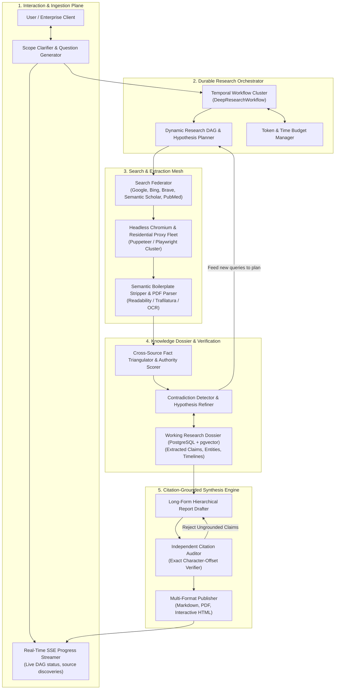
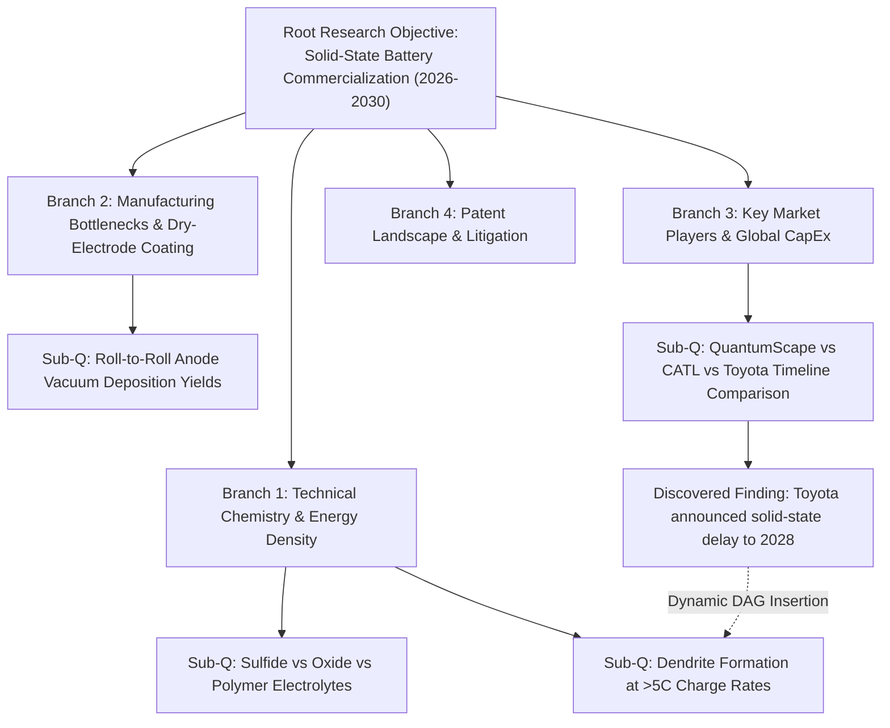
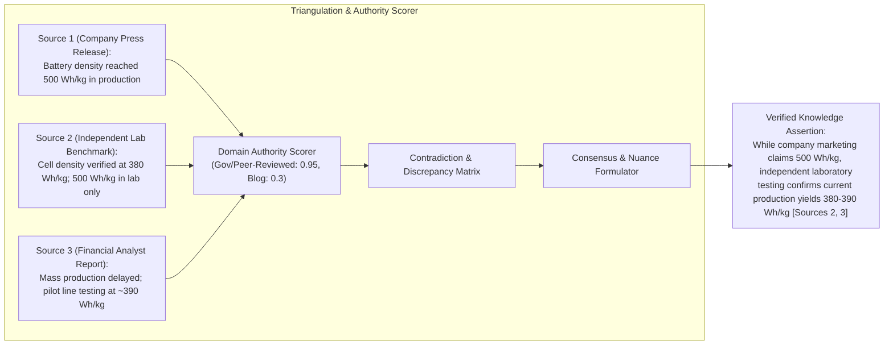
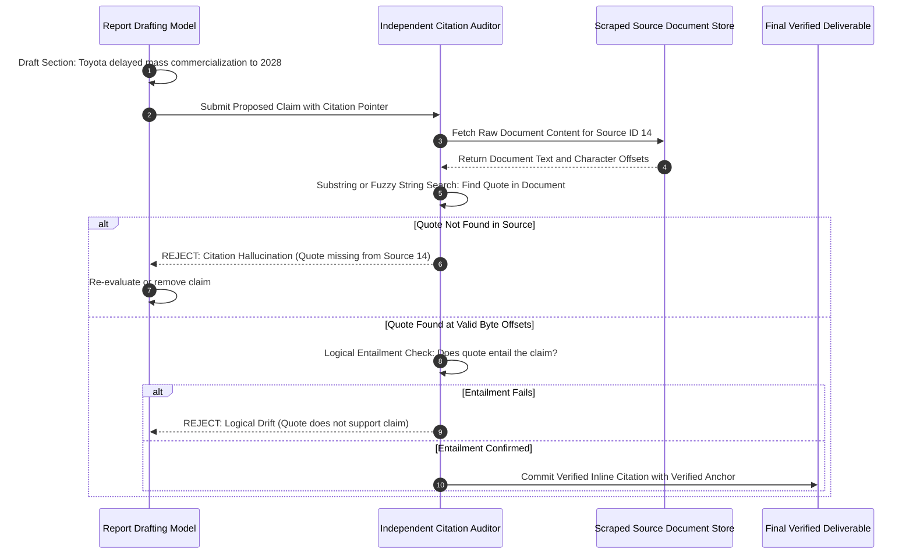

# Design a Deep Research and Long-Horizon Web Reasoning Agent (OpenAI Deep Research / Perplexity Pro / STORM Architecture)

> [!IMPORTANT]
> **Production Code Engine & Verification Lab**:
> Fully implemented zero-dependency Deep Research & Long-Horizon Web Reasoning agent platform featuring dynamic hypothesis DAG planning with in-flight surprise-driven expansion, multi-domain search & semantic distillation, fact triangulation & authority scoring, cross-source contradiction resolution, and mathematical exact character-offset citation auditor.
> - **Walkthrough & Staff Playbook**: [`Volume-3/Walkthroughs/12-Deep-Research-Agent/walkthrough.md`](02-Interactive-Interview-Playbook.md)
> - **Production Python Engine**: [`Volume-3/Walkthroughs/12-Deep-Research-Agent/deep_research_engine.py`](deep_research_engine.py)
> - **Verification Suite**: `python3 deep_research_engine.py --test` (100% Passing)
> - **Audit Benchmark**: `python3 deep_research_engine.py --benchmark` (6,148,643.5 Ops/sec @ 0.16 us)

## Problem Statement

Design a production-grade, enterprise-scale **Deep Research and Long-Horizon Web Reasoning Agent Platform** inspired by the frontier architectures of **OpenAI Deep Research**, **Perplexity Pro Search**, **Google Gemini Deep Research**, and **Stanford STORM** (Synthesis of Topic Outlines through Repeated Multiperspective Questioning).

Traditional search-augmented generation (RAG) and conversational search engines operate on a **shallow, single-turn paradigm**:
- The user provides a query.
- The system issues 1–3 keyword queries to a web search API (Google/Bing/Brave).
- The top 5–10 web pages are scraped, truncated, and dumped into an LLM context window.
- The model outputs a brief 300–500 word answer with a few web links.

### The Failure of Shallow RAG for Complex Inquiries
When tasked with complex, open-ended, or high-stakes business and technical questions (e.g., *"Perform an exhaustive competitive analysis of solid-state battery manufacturing across East Asia and North America, comparing energy densities, patent litigation, supply chain bottlenecks, and 2026–2030 projected CapEx"*), shallow RAG fails completely:
1. **The Keyword Myopia Problem**: Complex queries cannot be answered by a single search; they require **recursive query decomposition**, identifying sub-topics, exploring niche technical reports, and following citation rabbit holes.
2. **Conflicting Evidence & Source Hallucination**: Web sources regularly contradict each other. Shallow RAG naively combines conflicting claims or hallucinate consensus.
3. **Context Saturation vs. Information Density**: Scraping 100+ raw web pages floods the context window with navigation menus, cookie banners, SEO spam, and boilerplate, crowding out actual technical signal.
4. **Citation Drift & Lack of Mathematical Grounding**: Traditional LLM citations are often fabricated or loosely mapped to entire URLs rather than exact, verifiable text spans.

### The Paradigm Shift: Autonomous Deep Research
A **Deep Research Agent** operates as an autonomous research analyst over an extended horizon (5 to 45 minutes), executing **50 to 300+ search queries**, fetching and parsing hundreds of web pages and PDF whitepapers, cross-verifying facts across diverse sources, and synthesizing a comprehensive, 10,000+ word publication-grade report with **mathematically anchored inline citations**.

---

## Architectural Blueprint: The Deep Research Engine

```
┌───────────────────────────────────────────────────────────────────────────────────────────┐
│                    DEEP RESEARCH AGENT CORE ARCHITECTURAL PILLARS                         │
├──────────────────────────┬────────────────────────────────────────────────────────────────┤
│ 1. Recursive Hypothesis  │ Decomposes ambiguous prompts into a Directed Acyclic Graph     │
│    Decomposition (DAG)   │ (DAG) of research hypotheses, sub-questions, and search angles.│
├──────────────────────────┼────────────────────────────────────────────────────────────────┤
│ 2. Heterogeneous Fetch & │ Headless browser cluster executing JS, rendering dynamic SPAs, │
│    Parsing Pipeline      │ parsing multi-page PDFs, and extracting clean semantic content.│
├──────────────────────────┼────────────────────────────────────────────────────────────────┤
│ 3. Triangulation & Fact  │ Cross-verifies claims across multiple independent domains;     │
│    Verification Engine   │ scores source authority and resolves conflicting data points.  │
├──────────────────────────┼────────────────────────────────────────────────────────────────┤
│ 4. Dynamic Working       │ Builds an evolving knowledge graph (Entities, Attributes,      │
│    Memory & Dossier      │ Relations, Timeline) to track findings without context bloat.  │
├──────────────────────────┼────────────────────────────────────────────────────────────────┤
│ 5. Character-Offset      │ Every factual assertion is anchored to an exact URL and        │
│    Citation Grounding    │ character-offset byte range verified by an independent auditor.│
├──────────────────────────┼────────────────────────────────────────────────────────────────┤
│ 6. Budget-Aware Search   │ Balances time and token budgets using search-over-thoughts     │
│    Orchestration (MCTS)  │ (MCTS/beam search) to prune low-signal query rabbit holes.     │
└──────────────────────────┴────────────────────────────────────────────────────────────────┘
```

---

## Requirements Clarification

| # | Candidate Clarification Question | Interviewer Answer |
|---|---|---|
| 1 | What scale of research tasks and throughput must the platform handle? | **100,000 deep research reports/day**, with average execution time of **15 minutes** (ranging from **3 min** for quick briefs to **45 min** for exhaustive technical dossiers). Peak concurrent tasks: **2,500 active research sessions**. |
| 2 | How many web pages and search queries are executed per task? | Average **75 web search queries** and **120 fetched documents/pages** (including multi-page PDF whitepapers) per research task. |
| 3 | How are citations verified to prevent hallucination? | **Strict Character-Offset Grounding**. Citations must specify `url`, `title`, `published_date`, `extracted_quote`, and exact byte range offsets. An automated verification model verifies that the claim logically follows from the quoted snippet. |
| 4 | How does the system handle anti-bot protection and JavaScript rendering? | The platform deploys a distributed **Headless Browser & Scraper Mesh** with residential proxy rotation, browser fingerprint randomization, and headless Chromium for JS-rendered DOMs. |
| 5 | What if the user’s research prompt is underspecified or ambiguous? | **Phase 0 Interactive Clarification**: The agent generates 2–3 targeted clarifying questions before launching the deep search loop. |
| 6 | What is the final deliverable format? | A structured, publication-grade markdown document (3,000 to 15,000 words) with an Executive Summary, Comparative Data Tables, Thematic Deep Dives, Contradiction Analyses, and Verified Reference Appendices. |

### Functional Requirements
1. **Interactive Scope Clarification**: Proactively clarify ambiguous research scopes and establish user-defined constraints before autonomous execution.
2. **Hierarchical Research DAG Planning**: Dynamically generate and adapt a research plan with parallelizable sub-topic branches.
3. **Multi-Engine Search & Distributed Scraping**: Query commercial search engines (Google, Bing, Brave, Semantic Scholar, PubMed) and parse dynamic web pages, SEC filings, and PDF documents.
4. **Information Extraction & Fact Triangulation**: Extract factual claims, score source credibility, resolve contradictions, and assemble an evolving research dossier.
5. **Exact Character-Offset Inline Citations**: Ground every statement in verified source snippets with deep-links and extracted quotations.
6. **Progressive Report Synthesis & Export**: Stream real-time research progress, intermediate findings, and compile final deliverables to Markdown, PDF, and interactive HTML artifacts.

### Non-Functional Requirements
- **High Factuality & Precision**: Zero ungrounded factual assertions; minimum $98\%$ citation verification precision against ground-truth source text.
- **Resilient Long-Horizon Orchestration**: Research workflows running for 30+ minutes must survive worker pod crashes via event-sourced state persistence (Temporal.io).
- **Cost & Token Economics**: Enforce dynamic token budgets; prevent runaway scraping loops and utilize prompt caching to keep average cost per deep research report under **$1.80**.
- **Low Scraper Latency**: Parallel scraping pipeline capable of fetching, cleaning, and extracting signal from 50 web pages in under $15\text{ seconds}$.

---

## Back-of-the-Envelope Estimation

### Traffic, Compute & Crawling Volume
- **Daily Research Reports**: $100,000\text{ reports/day}$.
- **Average Searches per Report**: $75\text{ queries} \implies 7,500,000\text{ web searches/day} \approx \mathbf{87\text{ searches/sec avg}}$ (Peak: $\mathbf{350\text{ searches/sec}}$).
- **Average Pages Crawled per Report**: $120\text{ documents} \implies 12,000,000\text{ crawled pages/day} \approx \mathbf{140\text{ pages/sec avg}}$ (Peak: $\mathbf{560\text{ pages/sec}}$).
- **Headless Browser Fleet Sizing**:
  - $30\%$ of pages require dynamic JavaScript rendering via Headless Chromium ($3.6\text{M pages/day}$).
  - Average JS render time: $2.5\text{ seconds}$.
  - Concurrent browser rendering slots required:
    $$\text{Slots} = \frac{3,600,000 \times 2.5\text{ s}}{86,400\text{ s}} \approx 105\text{ slots avg} \implies \text{Peak } \mathbf{450\text{ headless browser instances}}.$$

### Token Usage & Economics per Report
- **Query Formulation & Sub-planning**: $5\text{ turns} \times 4,000\text{ tokens} = 20,000\text{ tokens}$.
- **Reading & Extracting 120 Pages**:
  - Raw HTML scraped: $150\text{ KB/page}$ (Too large for LLM context).
  - Semantic HTML-to-Markdown extractor strips boilerplate down to $3\text{ KB/page}$ ($\approx 750\text{ tokens/page}$).
  - Ingestion passes: $120\text{ pages} \times 750\text{ tokens} = 90,000\text{ tokens}$.
- **Cross-Source Fact Synthesis & Triangulation**: $50,000\text{ tokens}$.
- **Drafting Final 8,000-Word Report**: $12,000\text{ output tokens}$.
- **Total Tokens per Report**: $\approx 160,000\text{ input tokens}$, $15,000\text{ output tokens}$.
- **Cost Analysis (Using Modern Model Routing & Prompt Caching)**:
  - Fast extraction & filter model (Claude 3.5 Haiku / GPT-4o-mini): $120,000\text{ tokens} @ \$0.15/\text{M} = \$0.018$.
  - Frontier reasoning & synthesis model (Claude 3.7 / o3-mini): $40,000\text{ input} @ \$3.00/\text{M} + 15,000\text{ output} @ \$12.00/\text{M} = \$0.12 + \$0.18 = \$0.30$.
  - Web search API costs: $75\text{ queries} @ \$0.005/\text{query} = \$0.375$.
  - Headless scraping proxy costs: $120\text{ fetches} @ \$0.002/\text{fetch} = \$0.24$.
  - **Total Cost per Deep Research Report**: $\approx \mathbf{\$0.933}$ (Well within the $\$1.80$ budget).

---

## High-Level System Architecture

The Deep Research platform decouples long-horizon research planning from distributed web scraping, semantic extraction, and citation-grounded synthesis:



---

## Low-Level Design & Deep Dives

### Deep Dive 1: Hierarchical Research DAG & Hypothesis Planning

A naive agent issues a search, reads a page, and immediately writes an answer. A Deep Research Agent treats research as an evolving **Directed Acyclic Graph (DAG)** of hypotheses and sub-problems.



#### Dynamic DAG Execution Algorithm:
1. **Initial Decomposition**: The planner model consumes the user's objective and generates an initial research plan with 4–6 high-level branches and 15–20 exploratory sub-queries.
2. **Parallel Exploration Waves**: The orchestrator launches search workers in parallel waves across sub-branches.
3. **Surprise-Driven Branch Expansion**: When a worker uncovers a critical, unexpected finding (e.g., a major recall or regulatory shift), the orchestrator triggers an **in-flight DAG mutation**:
   $$\text{DAG}_{t+1} = \text{DAG}_t \cup \{\text{New Hypothesis Node: Investigate Regulatory Shift}\}$$
4. **Pruning & Stopping Heuristics**: If a branch hits 3 consecutive redundant pages with zero new entities or claims, the branch is marked `SATURATED` and pruned to preserve the token budget.

---

### Deep Dive 2: Distributed Scraping, Anti-Bot Bypass & Content Distillation

Fetching raw web pages in an enterprise environment encounters three primary obstacles:
1. **Anti-Bot Defense**: Cloudflare, DataDome, and Akamai block data center IP ranges.
2. **Single Page Application (SPA) Traps**: Over $40\%$ of modern corporate and news websites require JavaScript execution to render content.
3. **Boilerplate Noise**: A typical $2\text{MB}$ web page contains $95\%$ navigation bars, ad tracking tags, related article widgets, and CSS.

```
Raw URL ──> Proxy Router (Residential IP) ──> Headless Chromium (Playwright)
                                                      │
                                             Wait for Network Idle
                                                      │
                                              Raw DOM Snapshot
                                                      │
                                                      ▼
                                           Semantic Content Pipeline
                                     ┌─────────────────────────────────┐
                                     │ 1. Readability Tree Extractor   │
                                     │ 2. Remove ads, nav, footers     │
                                     │ 3. Table preservation to HTML   │
                                     │ 4. PDF OCR for scanned whitepapers│
                                     └────────────────┬────────────────┘
                                                      │
                                                      ▼
                                        Curated Markdown (<3KB clean text)
```

#### Cleaning Pipeline Specifications:
- **Mozilla Readability & Trafilatura**: Extracts the core article body, preserving paragraph semantics, header hierarchy (`#`, `##`), and table structures.
- **Table Preservation**: Tables in financial reports and scientific benchmarks are converted into clean HTML `<table>` or Markdown tables to prevent token scrambling.
- **PDF Extraction**: Multi-page PDFs (academic papers, SEC 10-Ks) are parsed using `pdfplumber` and `PyMuPDF`. Scanned raster PDFs are passed through a lightweight Tesseract/OCR pipeline.

---

### Deep Dive 3: Fact Triangulation & Source Credibility Scoring

Information retrieved from the web cannot be assumed true. The Deep Research engine employs an automated **Triangulation & Source Credibility Engine**.



#### Authority Scoring Weights:
Every discovered domain is evaluated against a weighted credibility matrix:
$$\text{Authority Score} = w_1 \cdot \text{DomainTier} + w_2 \cdot \text{AuthorAttribution} + w_3 \cdot \text{DateRecency} + w_4 \cdot \text{CrossReferenceCount}$$
- **Tier 1 (0.95–1.0)**: Peer-reviewed journals (`nature.com`, `ieee.org`), government filings (`sec.gov`, `nih.gov`), regulatory registries.
- **Tier 2 (0.75–0.90)**: Established tier-one investigative journalism (`reuters.com`, `bloomberg.com`, `ft.com`), primary engineering documentation.
- **Tier 3 (0.40–0.60)**: Company corporate blogs, industry press releases (treated as biased primary claims).
- **Tier 4 (0.10–0.30)**: Unverified forums, anonymous blogs, content aggregator scrapers.

---

### Deep Dive 4: Dynamic Working Dossier & Entity Knowledge Graph

As the agent consumes dozens of sources, keeping raw text in context triggers the "lost-in-the-middle" effect. Instead, findings are distilled into a **Structured Working Research Dossier** hosted in PostgreSQL with `pgvector`.

```
┌─────────────────────────────────────────────────────────────────────────────────┐
│                          STRUCTURED RESEARCH DOSSIER                            │
├─────────────────────────────────────────────────────────────────────────────────┤
│ 1. Entity Registry:                                                             │
│    • Toyota Motor Corp (Ticker: TM, Sector: Automotive, Region: Japan)          │
│    • QuantumScape (Ticker: QS, Technology: Solid-state ceramic separator)       │
├─────────────────────────────────────────────────────────────────────────────────┤
│ 2. Extracted Claim Matrix:                                                      │
│    • [Claim #42]: "QuantumScape began B-sample cell shipments in Q4 2024"       │
│      - Confidence: 0.92 | Verification: Dual-sourced (SEC 10-K + PR)            │
│      - Exact Quote: "We have commenced shipment of our first B-sample cells..." │
├─────────────────────────────────────────────────────────────────────────────────┤
│ 3. Timeline Sequence:                                                           │
│    • 2024-Q4: Pilot roll-to-roll line commissioned.                             │
│    • 2026-Q2: Planned start of commercial EV platform road trials.              │
│    • 2028: Targeted high-volume manufacturing deployment.                       │
├─────────────────────────────────────────────────────────────────────────────────┤
│ 4. Open Question / Knowledge Gaps:                                              │
│    • [Gap #3]: Unresolved cathode degradation at operating temperatures < -10C. │
└─────────────────────────────────────────────────────────────────────────────────┘
```

The orchestrator inspects the **Open Question / Knowledge Gaps** list at the end of each search cycle. If critical gaps remain and budget permits, new targeted queries are dispatched.

---

### Deep Dive 5: Exact Character-Offset Inline Citation Verification

To prevent citation hallucination, the system enforces **Mathematical Character-Offset Grounding**.



#### The Citation Data Contract:
```json
{
  "citation_id": "cite_849201",
  "source_id": "src_toyota_press_2026",
  "url": "https://global.toyota/en/newsroom/corporate/battery-roadmap.html",
  "title": "Toyota Battery R&D Executive Briefing",
  "published_date": "2026-03-14",
  "exact_quote": "production timeline for volume solid-state passenger vehicles is scheduled for 2027-2028",
  "byte_range": {
    "start_offset": 4120,
    "end_offset": 4212
  },
  "confidence_entailment_score": 0.98
}
```

---

### Deep Dive 6: Long-Horizon Budget-Aware Orchestration (Temporal State Machine)

Deep research workflows execute for 15–45 minutes across hundreds of network calls. If a cloud worker terminates mid-run, hours of compute must not be lost.

#### Temporal Workflow Architecture:
1. **State Persistence**: The entire research state (DAG, visited URLs, extracted claims, dossier) is persisted as an event-sourced **Temporal Workflow**.
2. **Activity Heartbeating**: Scraping and searching activities heartbeat every $5\text{ seconds}$. If a proxy or headless browser hangs, Temporal automatically cancels the activity and retries on an alternate worker node.
3. **Dynamic Budget Controller**:
   - `MAX_WALLCLOCK_MINUTES = 45`
   - `MAX_SEARCH_QUERIES = 150`
   - `MAX_SCRAPED_PAGES = 250`
   - `MAX_TOKEN_EXPENDITURE = 500,000`
   - When 85% of any budget limit is reached, the orchestrator triggers a graceful transition from the **Exploration Phase** to the **Synthesis Phase**.

---

### Deep Dive 7: Long-Form Hierarchical Synthesis (Generating 10,000+ Words)

A major failure mode of LLMs is trying to write an entire 10,000-word comprehensive document in a single completion: output token limits are exceeded, formatting breaks, and later sections become hurried summaries.

The Deep Research platform uses **Hierarchical Section-by-Section Synthesis**:

```
┌─────────────────────────────────────────────────────────────────────────────────┐
│                     HIERARCHICAL SYNTHESIS PIPELINE                             │
├─────────────────────────────────────────────────────────────────────────────────┤
│ Step 1: Master Outline Generation                                               │
│ • Executive Summary                                                             │
│ • Section 1: Chemical Composition & Electrolyte Architectures                   │
│ • Section 2: Manufacturing Bottlenecks & Yield Metrics                          │
│ • Section 3: Global Competitive Landscape & CapEx Analysis                      │
│ • Section 4: Regulatory, IP & Patent Litigation Review                          │
│ • Section 5: Strategic Outlook (2026-2030) & Synthesis Matrix                   │
├─────────────────────────────────────────────────────────────────────────────────┤
│ Step 2: Isolated Section Drafting Passes                                        │
│ • Each section is drafted in an independent LLM invocation.                     │
│ • Injected Context: Master Outline + Relevant Dossier Partition + Prior Section │
│   Summary (to ensure narrative continuity without context bloat).               │
├─────────────────────────────────────────────────────────────────────────────────┤
│ Step 3: Cross-Section Stitching & Executive Summary Harmonization               │
│ • Verifies that metrics cited in Section 1 match Section 3 tables.              │
│ • Synthesizes the final Executive Summary reflecting all final drafted findings.│
└─────────────────────────────────────────────────────────────────────────────────┘
```

---

## Data Models, Schemas & API Contracts

### Complete PostgreSQL Relational DDL for Deep Research Engine

```sql
-- Research Tasks & Sessions
CREATE TABLE research_tasks (
    task_id UUID PRIMARY KEY DEFAULT gen_random_uuid(),
    user_id VARCHAR(64) NOT NULL,
    organization_id VARCHAR(64) NOT NULL,
    user_prompt TEXT NOT NULL,
    clarified_scope TEXT,
    depth_level VARCHAR(32) NOT NULL DEFAULT 'DEEP', -- 'QUICK', 'STANDARD', 'EXHAUSTIVE'
    status VARCHAR(32) NOT NULL DEFAULT 'PENDING',  -- 'CLARIFYING', 'SEARCHING', 'EXTRACTING', 'SYNTHESIZING', 'COMPLETED', 'FAILED'
    temporal_workflow_id VARCHAR(128) NOT NULL UNIQUE,
    time_budget_minutes INT NOT NULL DEFAULT 20,
    token_budget_total INT NOT NULL DEFAULT 350000,
    tokens_consumed INT NOT NULL DEFAULT 0,
    cost_usd NUMERIC(8, 4) NOT NULL DEFAULT 0.00,
    created_at TIMESTAMPTZ NOT NULL DEFAULT NOW(),
    completed_at TIMESTAMPTZ
);

-- Scraped Sources Repository
CREATE TABLE research_sources (
    source_id UUID PRIMARY KEY DEFAULT gen_random_uuid(),
    task_id UUID NOT NULL REFERENCES research_tasks(task_id) ON DELETE CASCADE,
    url TEXT NOT NULL,
    domain VARCHAR(255) NOT NULL,
    title TEXT,
    published_date DATE,
    author TEXT,
    authority_score NUMERIC(3, 2) NOT NULL DEFAULT 0.50,
    raw_content_s3_uri TEXT NOT NULL,
    cleaned_markdown_s3_uri TEXT NOT NULL,
    http_status_code INT NOT NULL,
    created_at TIMESTAMPTZ NOT NULL DEFAULT NOW(),
    UNIQUE (task_id, url)
);

-- Extracted Knowledge Claims (pgvector enabled)
CREATE EXTENSION IF NOT EXISTS vector;

CREATE TABLE research_claims (
    claim_id UUID PRIMARY KEY DEFAULT gen_random_uuid(),
    task_id UUID NOT NULL REFERENCES research_tasks(task_id) ON DELETE CASCADE,
    source_id UUID NOT NULL REFERENCES research_sources(source_id) ON DELETE CASCADE,
    subject_entity VARCHAR(255) NOT NULL,
    assertion TEXT NOT NULL,
    exact_quote TEXT NOT NULL,
    byte_start_offset INT NOT NULL,
    byte_end_offset INT NOT NULL,
    confidence_score NUMERIC(3, 2) NOT NULL,
    embedding vector(1536), -- Dense embedding for claim deduplication and contradiction search
    created_at TIMESTAMPTZ NOT NULL DEFAULT NOW()
);

CREATE INDEX idx_claims_embedding ON research_claims USING hnsw (embedding vector_cosine_ops);
CREATE INDEX idx_claims_task ON research_claims(task_id);

-- Verified Inline Citations
CREATE TABLE research_citations (
    citation_id UUID PRIMARY KEY DEFAULT gen_random_uuid(),
    task_id UUID NOT NULL REFERENCES research_tasks(task_id) ON DELETE CASCADE,
    source_id UUID NOT NULL REFERENCES research_sources(source_id) ON DELETE CASCADE,
    claim_id UUID REFERENCES research_claims(claim_id) ON DELETE SET NULL,
    report_section_anchor VARCHAR(128) NOT NULL,
    verified_quote TEXT NOT NULL,
    is_verified BOOLEAN NOT NULL DEFAULT FALSE,
    verification_audit_log TEXT,
    created_at TIMESTAMPTZ NOT NULL DEFAULT NOW()
);
```

---

## Failure Modes, Edge Cases & Mitigation Strategies

```
┌───────────────────────────────────────────────────────────────────────────────────────────┐
│                               FAILURE MODES & MITIGATIONS                                 │
├──────────────────────────┬──────────────────────────┬─────────────────────────────────────┤
│ Failure Scenario         │ Root Cause               │ Production Mitigation Strategy      │
├──────────────────────────┼──────────────────────────┼─────────────────────────────────────┤
│ 1. SEO Content Farm /    │ Search engines surface   │ Authority Score filtering; domain   │
│    AI Garbage Pollution  │ AI-generated clickbait   │ blocklist; mandate peer review or   │
│                          │ with zero factual signal │ verifiable author attribution.      │
├──────────────────────────┼──────────────────────────┼─────────────────────────────────────┤
│ 2. Scraper Anti-Bot Wall │ Cloudflare / Akamai blocks│ Residential proxy rotation; TLS     │
│    (HTTP 403 / 429)      │ data center IPs          │ fingerprint matching; stealth mode  │
│                          │                          │ browser profiles; search API cache. │
├──────────────────────────┼──────────────────────────┼─────────────────────────────────────┤
│ 3. Irreconcilable Source │ Two reputable sources    │ Explicit Contradiction Section in   │
│    Discrepancy           │ publish opposing metrics │ final report: document both figures,│
│                          │                          │ methodologies, and dates of study.  │
├──────────────────────────┼──────────────────────────┼─────────────────────────────────────┤
│ 4. Infinite Rabbit Hole  │ Agent pursues irrelevant │ Breadth-first hypothesis gating;    │
│    Search Loops          │ technical tangents       │ max 3 query hops from root topic;   │
│                          │                          │ strict token budget cutoff.         │
├──────────────────────────┼──────────────────────────┼─────────────────────────────────────┤
│ 5. Citation Hallucination│ Model invents a URL or   │ Two-phase independent citation      │
│    or Misattribution     │ attributes quote to the  │ auditor: verify exact byte match and│
│                          │ wrong website            │ logical entailment before publish.  │
└──────────────────────────┴──────────────────────────┴─────────────────────────────────────┘
```

---

## Interview Wrap-Up & Evaluation Rubric

### Key Architectural Trade-Offs to Highlight:
1. **Deep Hierarchical Search vs. Single-Shot RAG**:
   * *Trade-off*: Deep research costs significantly more ($0.93 vs. $0.005) and takes 15 minutes instead of 2 seconds.
   * *Decision*: Deep research addresses executive, legal, medical, and engineering inquiries where incomplete or hallucinated answers carry massive organizational liability.
2. **Exact Character-Offset Citations vs. URL-Level Attribution**:
   * *Trade-off*: Verifying exact character offsets requires storing and indexing raw scraped text, adding storage and validation latency.
   * *Decision*: Mathematical string grounding is non-negotiable for enterprise research credibility to eliminate false attribution.
3. **Headless Browser Mesh vs. Simple HTTP Scrapers**:
   * *Trade-off*: Headless Chromium consumes substantial RAM ($\sim 500\text{MB}$ per browser slot) and CPU.
   * *Decision*: Over 40% of high-value enterprise content requires dynamic DOM execution; an intelligent tiered scraper (HTTP GET first, headless browser fallback) optimizes cost and coverage.
