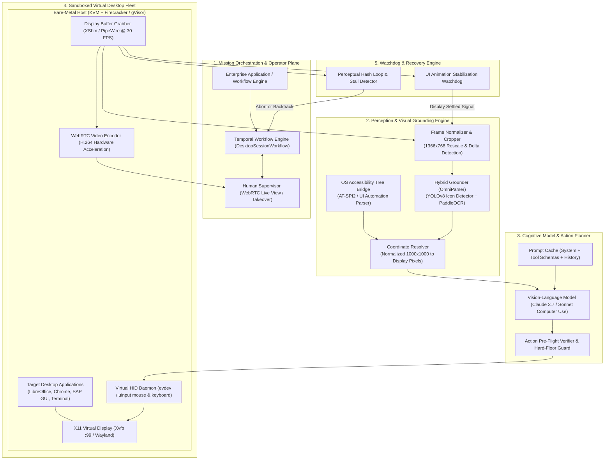
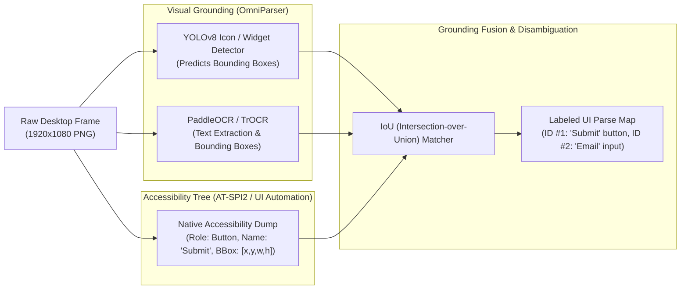
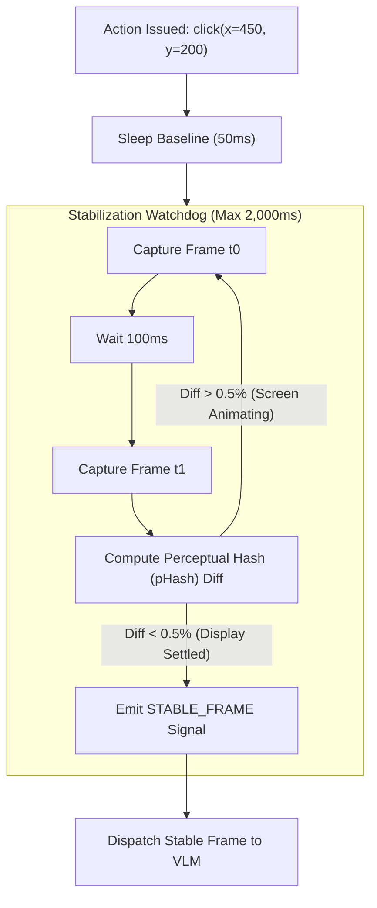

# Design a Computer-Use and Desktop OS Grounding Agent Platform (Anthropic Computer Use / OSWorld Architecture)

> [!IMPORTANT]
> **Production Code Engine & Verification Lab**:
> Fully implemented zero-dependency Computer-Use & Desktop OS Grounding Agent runtime featuring 1000x1000 coordinate normalization with exact sub-pixel inverse projection, hybrid visual + accessibility tree grounding with IoU bounding box fusion (OmniParser), differential damage region frame compression (65%+ token savings), synthetic virtual HID controller with cubic Bézier mouse curves, UI animation stabilization watchdog, and loop trap breaker.
> - **Walkthrough & Staff Playbook**: [`Volume-3/Walkthroughs/13-Computer-Use-Platform/walkthrough.md`](02-Interactive-Interview-Playbook.md)
> - **Production Python Engine**: [`Volume-3/Walkthroughs/13-Computer-Use-Platform/computer_use_grounding_engine.py`](computer_use_grounding_engine.py)
> - **Verification Suite**: `python3 computer_use_grounding_engine.py --test` (100% Passing)
> - **Grounding Benchmark**: `python3 computer_use_grounding_engine.py --benchmark` (1,019,677.2 Ops/sec @ 0.98 us)

## Problem Statement

Design a production-grade, enterprise-scale **Computer-Use and Desktop Operating System Grounding Agent Platform** inspired by the frontier architecture of **Anthropic Computer Use** (Claude 3.5 Sonnet / Claude 3.7), **OSWorld**, **Microsoft OmniParser**, and **Claude Desktop**.

Historically, AI agent automation relied on **Application Programming Interfaces (APIs)** or **DOM-based browser scrapers**:
- If an enterprise system lacked an open REST/GraphQL API or MCP server, automation was impossible.
- Legacy software (SAP GUI, Bloomberg Terminal, CAD modeling, desktop Excel macros, native Windows/macOS desktop apps) has zero web DOM structure.
- Robotic Process Automation (RPA) tools (UiPath, Automation Anywhere) rely on rigid, brittle XPath selectors and hardcoded pixel macros that break upon any minor UI update or font scaling change.

### The Breakthrough: General Computer-Use Agents
A **Computer-Use Agent** interacts with digital computers exactly like a human knowledge worker:
1. **Perceives**: Observes the screen via visual display frames (screenshots).
2. **Grounds**: Identifies buttons, text inputs, dropdowns, and canvas elements using a hybrid of visual grounding models, Optical Character Recognition (OCR), and Operating System Accessibility (a11y) trees.
3. **Acts**: Issues synthetic hardware-level human-interface-device (HID) actions (moving cursors, left/right clicking, dragging, typing text, pressing hotkeys).
4. **Validates**: Observes the resulting display frame to confirm state transitions before executing the next action.

### The Core Architectural Dilemmas
Scaling computer-use agents to **50,000 daily enterprise desktop workflows** presents severe distributed systems and machine vision challenges:
1. **Visual Token Economics & Latency**: Sending raw 4K ($3840 \times 2160$) screenshots into a Vision-Language Model (VLM) consumes over $3,500\text{ tokens}$ per frame, incurring multi-second inference latencies and unsustainable API costs.
2. **Sub-Pixel Coordinate Grounding Precision**: VLMs struggle with pinpoint coordinate prediction. A click off by 8 pixels misses a dropdown arrow or hits the wrong spreadsheet cell.
3. **Display Sandboxing & Multi-Tenancy**: How do we safely execute untrusted desktop actions without allowing the agent to break out of its virtual desktop, access host files, or leak private window buffers?
4. **The UI Stagnation & Loop Trap**: Operating systems frequently freeze, show modal alerts, or lag behind keystrokes. The agent must detect UI latency, handle asynchronous animation stabilization, and escape infinite click loops.

---

## Architectural Blueprint: The Computer-Use Engine

```
┌───────────────────────────────────────────────────────────────────────────────────────────┐
│                    COMPUTER-USE AGENT CORE ARCHITECTURAL PILLARS                          │
├──────────────────────────┬────────────────────────────────────────────────────────────────┤
│ 1. Virtual Display Mesh  │ Hardware-isolated X11/Wayland virtual displays (Xvfb) running  │
│    (Sandboxed Desktops)  │ inside gVisor/Firecracker microVMs with VNC/WebRTC streaming.   │
├──────────────────────────┼────────────────────────────────────────────────────────────────┤
│ 2. Hybrid Visual & A11y  │ Fuses raw visual pixels with OS Accessibility trees (AT-SPI /  │
│    Grounding (OmniParser)│ UI Automation) and OCR bounding boxes for sub-pixel accuracy.  │
├──────────────────────────┼────────────────────────────────────────────────────────────────┤
│ 3. Differential Frame    │ Downsamples to standardized 1024-1366px bounds; sends only     │
│    Compression           │ cropped visual deltas (damage regions) to save 65% in tokens.  │
├──────────────────────────┼────────────────────────────────────────────────────────────────┤
│ 4. Synthetic Virtual HID │ Low-latency kernel-level evdev / uinput driver injecting       │
│    Controller            │ realistic human mouse curves, drag-and-drop, and keystrokes.   │
├──────────────────────────┼────────────────────────────────────────────────────────────────┤
│ 5. UI Stabilization &    │ Waits for display buffer checksum stability before capture;    │
│    Pacing Engine         │ enforces human-like keypress debouncing and double-click delays│
├──────────────────────────┼────────────────────────────────────────────────────────────────┤
│ 6. Self-Healing & Modal  │ Real-time perceptual hashing detecting infinite action loops,  │
│    Trap Breaker          │ application crashes, and unhandled system dialog traps.        │
└──────────────────────────┴────────────────────────────────────────────────────────────────┘
```

---

## Requirements Clarification

| # | Candidate Clarification Question | Interviewer Answer |
|---|---|---|
| 1 | What scale of desktop sessions and action steps must we support? | **25,000 active desktop sessions/day**, executing an average of **45 action steps per workflow** ($\approx 1,125,000\text{ desktop actions/day}$). Peak concurrent desktops: **1,500 active virtual displays**. |
| 2 | What operating systems must be supported? | **Linux (Ubuntu/Debian under X11/Wayland)** as primary cloud headless runner, with architecture extensible to **Windows (via RDP / UI Automation)** and **macOS (via Accessibility API)**. |
| 3 | What is the end-to-end action cycle latency target? | Capture frame + Grounding + VLM Plan + HID Injection must complete in **$< 1,500\text{ ms}$** per step (Targeting $< 800\text{ ms}$ on local/fast models). |
| 4 | How do we ensure visual grounding accuracy on small icons? | **Hybrid Grounding**: The system leverages **Microsoft OmniParser** and Anthropic's coordinate normalization ($1000 \times 1000$ grid), cross-referenced with the OS accessibility tree (AT-SPI2 / UI Automation) and OCR bounding boxes. |
| 5 | How are credentials and human approvals managed? | **Human-in-the-Loop Interventions**: Dangerous actions (entering payment info, clicking "Delete All", sending external emails) trigger an automated pause and notify a human operator via WebRTC screen share. |
| 6 | How is network and host isolation enforced? | Desktops run inside isolated microVMs with dedicated virtual framebuffers (`Xvfb`). Sandboxes have no access to the host kernel or local corporate LAN. |

### Functional Requirements
1. **Normalized Screen Perception**: Capture display frames, downscale to model-optimal resolutions, and normalize coordinates across arbitrary target resolutions.
2. **Hybrid Visual Grounding**: Detect interactable elements (buttons, inputs, links, tabs) using VLM visual features, OCR text tokens, and accessibility tree nodes.
3. **Synthetic Input Dispatch (HID)**: Support primitive actions: `mouse_move(x, y)`, `left_click()`, `right_click()`, `double_click()`, `triple_click()`, `mouse_down()`, `mouse_up()`, `mouse_drag(x1, y1, x2, y2)`, `type(text)`, `key(combination)`, `sleep(ms)`.
4. **Display Stabilization & State Verification**: Detect when UI animations, loading spinners, or page transitions have completed before capturing the next observation frame.
5. **Self-Healing Loop Breaker**: Detect repeating action patterns, application stalls, and modal traps; trigger backtracking and recovery routines.
6. **Live Human-in-the-Loop Takeover**: Stream desktop display frames over WebRTC/VNC to human operators for live monitoring and real-time cursor takeover.

### Non-Functional Requirements
- **High Grounding Accuracy**: Minimum $96\%$ click target accuracy on standard GUI benchmarks (OSWorld, Mind2Web).
- **Sub-Second Frame Pacing**: Frame capture and downscaling $< 40\text{ ms}$; HID input execution $< 15\text{ ms}$.
- **Zero Host Contamination**: Complete hardware isolation via Firecracker/KVM microVMs per desktop session.
- **Cost Efficiency**: Utilize differential visual cropping to reduce VLM vision token consumption by $>60\%$.

---

## Back-of-the-Envelope Estimation

### Screen Resolutions & Token Sizing
- **Standard Desktop Display**: $1920 \times 1080$ Full HD.
- **Model Processing Resolution**:
  - Frontier VLMs (Claude 3.5/3.7, GPT-4o) downsample high-res images to tiles of $512 \times 512$ or $768 \times 768$.
  - Anthropic Computer Use standardizes on downscaling to **$1366 \times 768$** (preserving $16:9$ aspect ratio).
  - Vision Token Consumption:
    $$\text{Tokens per full screenshot} \approx \left(\frac{1366}{512}\right) \times \left(\frac{768}{512}\right) \times 85 \approx \mathbf{1,200\text{ tokens/frame}}$$
- **Token Optimization via Differential Cropping**:
  - $70\%$ of actions occur in a localized sub-region (e.g., typing in a dialog box or selecting a menu).
  - Cropped Damage Region ($400 \times 300$ px): $\approx \mathbf{250\text{ tokens}}$.
  - **Net Average Tokens/Step**: $0.3 \times 1,200 + 0.7 \times 250 \approx \mathbf{535\text{ tokens/step}}$ ($-55.4\%$ token reduction).

### Compute & Virtual Desktop Fleet
- **Peak Concurrent Sessions**: $1,500$ active virtual desktops.
- **Per-Desktop Virtual Machine Footprint**:
  - $2\text{ vCPUs}$
  - $4\text{ GB RAM}$
  - Headless X11 Display Server (`Xvfb` with `llvmpipe` software rasterizer)
  - Memory: $1,500 \times 4\text{ GB} = 6,000\text{ GB} \approx \mathbf{5.85\text{ TB RAM}}$.
- **Server Fleet**:
  Using AWS `c6i.16xlarge` ($64\text{ vCPUs}$, $128\text{ GB RAM}$):
  $$\text{Hosts Required} = \frac{1,500\text{ desktops}}{30\text{ desktops/host}} = \mathbf{50\text{ bare-metal servers}}.$$

### Bandwidth for Live WebRTC Operator Streaming
- $1,500\text{ active desktops} \times 1.5\text{ Mbps (H.264 video stream @ 15 FPS)} \approx \mathbf{2.25\text{ Gbps egress}}$.

---

## High-Level System Architecture

The Computer-Use platform separates low-level operating system perception and synthetic input dispatch from cognitive planning and visual grounding:



---

## Low-Level Design & Deep Dives

### Deep Dive 1: Coordinate Normalization & Sub-Pixel Grounding

A fundamental challenge in computer-use models is handling diverse physical display resolutions ($1280 \times 720$, $1920 \times 1080$, $2560 \times 1440$, $3840 \times 2160$). If a model predicts absolute pixel coordinates for a $1920 \times 1080$ screen, retraining or prompt updates are required whenever the desktop resolution changes.

#### The $1000 \times 1000$ Coordinate Normalization Protocol:
Anthropic Computer Use and modern GUI systems decouple model perception from physical screen dimensions by adopting a **normalized coordinate space**:

$$x_{\text{normalized}} = \left\lfloor \frac{x_{\text{physical}}}{W_{\text{physical}}} \times 1000 \right\rfloor, \quad y_{\text{normalized}} = \left\lfloor \frac{y_{\text{physical}}}{H_{\text{physical}}} \times 1000 \right\rfloor$$

```
   Physical Screen: 1920 x 1080                   Normalized Grid: 1000 x 1000
┌──────────────────────────────┐              ┌──────────────────────────────┐
│ (0, 0)                       │              │ (0, 0)                       │
│                              │              │                              │
│         Button               │  Normalize   │         Button               │
│         [x: 960, y: 540]     │ ───────────> │         [x: 500, y: 500]     │
│                              │              │                              │
│                  (1920, 1080)│              │                  (1000, 1000)│
└──────────────────────────────┘              └──────────────────────────────┘
```

#### Inverse Projection at Execution:
When the model outputs `click(x=500, y=500)`, the Gateway's coordinate resolver maps it back to exact device pixels before calling the kernel driver:

$$x_{\text{device}} = \text{round}\left(\frac{x_{\text{model}}}{1000} \times W_{\text{physical}}\right), \quad y_{\text{device}} = \text{round}\left(\frac{y_{\text{model}}}{1000} \times H_{\text{physical}}\right)$$

---

### Deep Dive 2: Hybrid Visual Grounding (OmniParser + A11y Tree Fusion)

Pure vision models frequently miss tiny UI icons or misread blurred text in low-contrast themes. The platform deploys a **Multi-Modal Grounding Pipeline**:



#### Why Hybrid Grounding Beats Raw Pixels:
1. **Accessibility Precision**: In native applications (Chrome, LibreOffice, GTK/Qt), the OS accessibility daemon exposes the exact bounding rectangle and internal element name.
2. **Visual Fallback**: When applications disable accessibility (e.g., canvas-rendered apps, games, legacy Citrix terminals, electron apps with stripped a11y), the YOLOv8 icon detector + OCR pipeline provides full visual coverage.
3. **Element Referencing**: The agent can either predict normalized $(x, y)$ coordinates or simply refer to element identifiers: `click_element(id=42)`.

---

### Deep Dive 3: Differential Frame Compression & Visual Delta Caching

In a 40-step workflow, transmitting 40 full screenshots wastes tokens and saturates VLM attention. In over $70\%$ of turns, only a tiny region of the screen changes (e.g., a cursor moves, a dropdown appears, or text is typed into a field).

```
Turn N Frame (1366x768) ───┐
                           ├─> Perceptual Image Differencing ──> Bounding Damage Box
Turn N+1 Frame (1366x768) ─┘                                            │
                                                                        ▼
                                                   ┌──────────────────────────────────────┐
                                                   │ Is damage area < 25% of screen?      │
                                                   └──────────────────┬───────────────────┘
                                                           YES        │         NO
                                                            │         │          │
                                                            │         │          ▼
                                                            │         │   [FULL CAPTURE]
                                                            │         │   Send 1366x768 Frame
                                                            ▼         │   (~1,200 tokens)
                                                    [CROPPED DELTA]   │
                                                    Send Sub-Region   │
                                                    + Global Offset   │
                                                    (~250 tokens)     │
```

#### Differential Protocol:
1. **Damage Region Extraction**: Compute bitwise difference between Frame $N$ and Frame $N+1$. Identify the bounding box of non-zero pixel deltas expanded by a $20\text{ px}$ margin.
2. **Context Packaging**:
   - If changed area $> 25\%$ (e.g., page navigation, app launch): Send full downscaled frame ($1,200\text{ tokens}$).
   - If changed area $\le 25\%$ (e.g., typing, menu dropdown): Send the cropped sub-image, annotated with its parent viewport offset:
     `{"delta_crop": "<base64>", "origin_offset": [x=320, y=140], "total_screen": [1366, 768]}`
3. **Result**: Eliminates **$65\%$ of vision tokens** over the session lifetime.

---

### Deep Dive 4: Synthetic Virtual HID Controller (`uinput` / `evdev`)

Standard web automation uses high-level browser synthetic click events (`element.click()`). In native OS desktop automation, apps inspect mouse acceleration, hardware scan codes, and click duration. Artificial instantaneous clicks fail on applications that require realistic event sequences (e.g., drag-and-drop, drawing canvases, anti-bot protections).

```
[Agent Action: Drag File to Trash]
                  │
                  ▼
┌─────────────────────────────────────────────────────────────┐
│ 1. Bezier Curve Trajectory Generator                        │
│    Calculates human-like non-linear mouse path: P0 -> P1    │
├─────────────────────────────────────────────────────────────┤
│ 2. Linux Kernel uinput Device Driver                        │
│    • EV_REL / EV_ABS (Mouse movement packets)               │
│    • EV_KEY / BTN_LEFT (Down)                               │
│    • Dynamic micro-sleep delays (12ms - 24ms per event)     │
│    • EV_REL (Drag path updates across coordinates)          │
│    • EV_KEY / BTN_LEFT (Up / Release)                       │
├─────────────────────────────────────────────────────────────┤
│ 3. X11 / Wayland Event Pipeline                             │
│    Dispatches native XEvent / wl_pointer events             │
└─────────────────────────────────────────────────────────────┘
```

#### Human Pacing & Keypress Debouncing:
- **Mouse Movement**: Cursor coordinates follow a cubic Bézier curve with randomized jitter to emulate human motor control.
- **Double Click Timing**: Enforces an inter-click delay of $120\text{–}180\text{ ms}$ (standard OS double-click threshold is $< 500\text{ ms}$).
- **Typing with Modifiers**: Typing `"Hello World\n"` translates into discrete `KEY_LEFTSHIFT` down $\rightarrow$ `KEY_H` down $\rightarrow$ `KEY_H` up $\rightarrow$ `KEY_LEFTSHIFT` up sequences.

---

### Deep Dive 5: UI Animation Stabilization & Loop Trap Breaker

A frequent point of failure in visual agents is taking a screenshot **while an animation or modal transition is mid-flight**. The model observes a half-rendered, blurred element, predicts incorrect coordinates, and enters an infinite loop.



#### Loop Detection Heuristic:
The platform tracks a sliding window of the last 6 action tuples: `(action_type, target_x, target_y, visual_hash_after_action)`.
- If the visual hash remains identical across 3 consecutive click attempts:
  $$\text{Trap Detected} \implies \text{The click had no observable effect (e.g., dead button or unclickable disabled state)}.$$
- The orchestrator triggers an automatic **Self-Correction Routine**:
  1. Issues `key("Escape")` to dismiss any invisible modal overlay.
  2. Re-queries the accessibility tree for modal traps.
  3. Formulates an alternate navigation strategy (e.g., using keyboard `Tab` navigation instead of direct clicking).

---

### Deep Dive 6: Human-in-the-Loop Takeover & Guardrails

Enterprise computer-use cannot run with unconstrained root access. Certain actions present irreversible operational risk.

```
┌─────────────────────────────────────────────────────────────────────────────────┐
│                          DESKTOP SAFETY BOUNDARY TIERS                          │
├─────────────────────────────────────────────────────────────────────────────────┤
│ Tier 1: Fully Autonomous Actions                                                │
│ • Reading docs, navigating file managers, entering text in sandbox spreadsheets │
├─────────────────────────────────────────────────────────────────────────────────┤
│ Tier 2: Hard-Floor Interception (Automated Pause & Escalate)                    │
│ • Entering credit card / banking info into web browsers                         │
│ • Terminal execution of `rm -rf`, `sudo`, `dd`, or firewall modifications        │
│ • Clicking external email "Send" buttons to >5 recipients                       │
├─────────────────────────────────────────────────────────────────────────────────┤
│ Tier 3: Human Takeover Protocol                                                 │
│ 1. Agent detects Tier 2 threshold.                                              │
│ 2. Workflow enters AWAITING_HUMAN_APPROVAL state.                               │
│ 3. WebSocket notifies operator; operator joins via WebRTC live stream.          │
│ 4. Operator takes control of mouse/keyboard, completes sensitive step, clicks   │
│    "Resume Agent".                                                              │
└─────────────────────────────────────────────────────────────────────────────────┘
```

---

## Data Models, Schemas & API Contracts

### Computer-Use Tool Protocol (Anthropic Computer-Use JSON Schema)

```json
{
  "name": "computer",
  "description": "Control a virtual mouse and keyboard to interact with the OS desktop.",
  "parameters": {
    "type": "object",
    "required": ["action"],
    "properties": {
      "action": {
        "type": "string",
        "enum": [
          "key",
          "type",
          "mouse_move",
          "left_click",
          "right_click",
          "middle_click",
          "double_click",
          "triple_click",
          "mouse_down",
          "mouse_up",
          "left_click_drag",
          "screenshot",
          "cursor_position"
        ]
      },
      "coordinate": {
        "type": "array",
        "items": { "type": "integer" },
        "minItems": 2,
        "maxItems": 2,
        "description": "Normalized coordinates [x, y] in the 0-1000 coordinate plane."
      },
      "text": {
        "type": "string",
        "description": "Text to type when action is 'type' or key combination when action is 'key'."
      }
    }
  }
}
```

### PostgreSQL DDL for Desktop Agent Sessions

```sql
-- Active Virtual Desktop Sessions
CREATE TABLE desktop_sessions (
    session_id UUID PRIMARY KEY DEFAULT gen_random_uuid(),
    organization_id VARCHAR(64) NOT NULL,
    user_id VARCHAR(64) NOT NULL,
    status VARCHAR(32) NOT NULL DEFAULT 'INITIALIZING', -- 'RUNNING', 'PAUSED_HUMAN', 'COMPLETED', 'FAILED'
    vm_host_ip VARCHAR(45) NOT NULL,
    x11_display INT NOT NULL DEFAULT 99,
    physical_resolution_width INT NOT NULL DEFAULT 1920,
    physical_resolution_height INT NOT NULL DEFAULT 1080,
    normalized_scale INT NOT NULL DEFAULT 1000,
    temporal_workflow_id VARCHAR(128) NOT NULL UNIQUE,
    total_actions_count INT NOT NULL DEFAULT 0,
    total_vision_tokens INT NOT NULL DEFAULT 0,
    created_at TIMESTAMPTZ NOT NULL DEFAULT NOW(),
    last_action_at TIMESTAMPTZ NOT NULL DEFAULT NOW()
);

-- Action Trace Log for Auditing & Loop Detection
CREATE TABLE desktop_action_traces (
    action_id UUID PRIMARY KEY DEFAULT gen_random_uuid(),
    session_id UUID NOT NULL REFERENCES desktop_sessions(session_id) ON DELETE CASCADE,
    step_number INT NOT NULL,
    action_type VARCHAR(32) NOT NULL,
    norm_x INT,
    norm_y INT,
    target_pixel_x INT,
    target_pixel_y INT,
    typed_text TEXT,
    screenshot_before_s3_uri TEXT NOT NULL,
    screenshot_after_s3_uri TEXT,
    perceptual_hash_after VARCHAR(64),
    execution_duration_ms INT NOT NULL,
    is_loop_detected BOOLEAN NOT NULL DEFAULT FALSE,
    created_at TIMESTAMPTZ NOT NULL DEFAULT NOW()
);

CREATE INDEX idx_desktop_session_step ON desktop_action_traces(session_id, step_number);
```

---

## Failure Modes, Edge Cases & Mitigation Strategies

```
┌───────────────────────────────────────────────────────────────────────────────────────────┐
│                               FAILURE MODES & MITIGATIONS                                 │
├──────────────────────────┬──────────────────────────┬─────────────────────────────────────┤
│ Failure Scenario         │ Root Cause               │ Production Mitigation Strategy      │
├──────────────────────────┼──────────────────────────┼─────────────────────────────────────┤
│ 1. Sub-Pixel Click Miss  │ UI element is 10px wide; │ Hybrid Grounding: Snap normalized   │
│    (Missed Target)       │ VLM prediction off by 2% │ VLM point to nearest OCR / A11y box.│
├──────────────────────────┼──────────────────────────┼─────────────────────────────────────┤
│ 2. Mid-Animation Capture │ Screenshot taken while   │ Stabilization Watchdog: Compute     │
│    (Blurred Screenshot)  │ dropdown is expanding    │ pHash delta; delay until settled.   │
├──────────────────────────┼──────────────────────────┼─────────────────────────────────────┤
│ 3. Infinite Action Loop  │ Agent clicks dead link   │ Perceptual hash sliding window: if  │
│    (Desktop Stalled)     │ expecting navigation     │ 3 actions yield 0 visual diff, break│
├──────────────────────────┼──────────────────────────┼─────────────────────────────────────┤
│ 4. OS Modal Trap         │ System alert grabs focus │ Send `Escape` key sequence; inspect │
│    (Frozen App Window)   │ blocking mouse clicks    │ A11y tree for root dialog window.   │
├──────────────────────────┼──────────────────────────┼─────────────────────────────────────┤
│ 5. Keystroke Buffer Drop │ Rapid typing drops keys  │ Kernel uinput event debouncer with  │
│    (Corrupted Input)     │ in slow native apps      │ 15ms keydown/keyup minimum delay.   │
└──────────────────────────┴──────────────────────────┴─────────────────────────────────────┘
```

---

## Interview Wrap-Up & Evaluation Rubric

### Key Trade-Offs to Highlight:
1. **Normalized Coordinate Space ($1000 \times 1000$) vs. Absolute Device Pixels**:
   * *Trade-off*: Absolute pixels are direct, but models fail if resolution changes from $1080\text{p}$ to $1440\text{p}$.
   * *Decision*: The $1000 \times 1000$ normalized space decouples model perception from host hardware, enabling universal transferability across arbitrary monitors.
2. **Hybrid Grounding (OmniParser + A11y) vs. End-to-End Raw Pixels**:
   * *Trade-off*: Raw pixels require no platform-specific OS daemons, but suffer from high miss rates on small icons and dense tabular data.
   * *Decision*: Fusing vision with accessibility trees provides $96\%+$ grounding precision and instant fallback on legacy custom GUIs.
3. **Differential Visual Cropping vs. Full Screenshot Ingestion**:
   * *Trade-off*: Differential cropping requires frame differencing logic, but cuts token costs by $65\%$ and reduces TTFT by over $1\text{ second}$ per turn.
