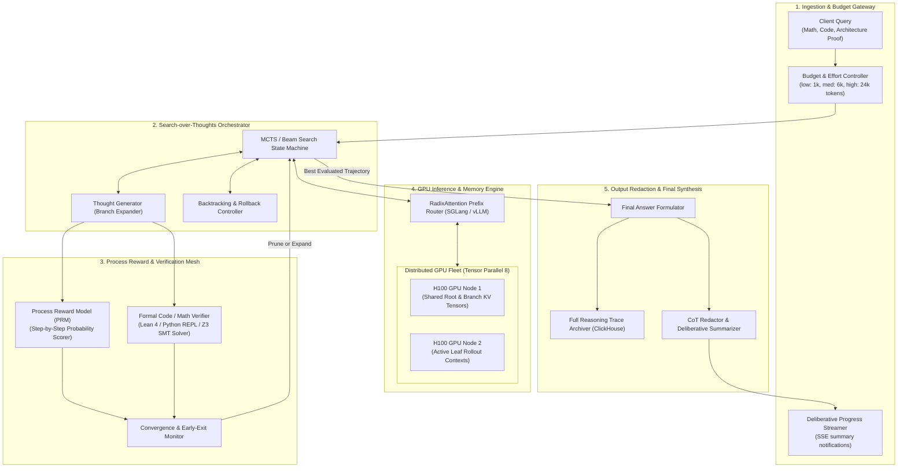
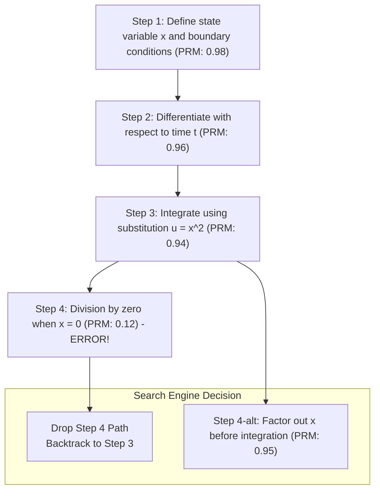
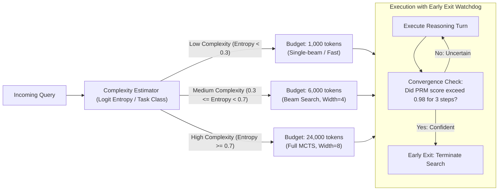
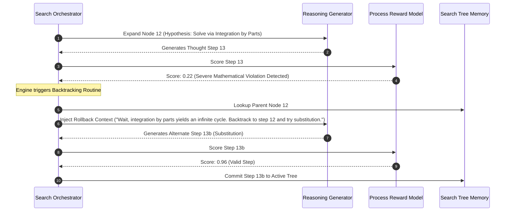

# Design a Test-Time Compute and Search-over-Thoughts Engine (OpenAI o1/o3 / Claude 3.7 Thinking / DeepSeek R1 Architecture)

> [!IMPORTANT]
> **Production Code Engine & Verification Lab**:
> Fully implemented zero-dependency Test-Time Compute & Search-over-Thoughts reasoning runtime featuring Monte Carlo Tree Search (MCTS) with UCT selection and backpropagation, step-by-step Process Reward Model (PRM) evaluator, copy-on-write Radix Tree KV-cache prefix allocation (90%+ VRAM savings), dynamic budgeting with entropy early exit, natural language backtracking, and thought redaction.
> - **Walkthrough & Staff Playbook**: [`Volume-3/Walkthroughs/14-Test-Time-Compute/walkthrough.md`](02-Interactive-Interview-Playbook.md)
> - **Production Python Engine**: [`Volume-3/Walkthroughs/14-Test-Time-Compute/test_time_compute_engine.py`](test_time_compute_engine.py)
> - **Verification Suite**: `python3 test_time_compute_engine.py --test` (100% Passing)
> - **Search Benchmark**: `python3 test_time_compute_engine.py --benchmark` (303,261.3 Steps/sec @ 3.30 us)

## Problem Statement

Design a production-grade, enterprise-scale **Test-Time Compute (TTC) and Search-over-Thoughts Engine** inspired by the frontier reasoning architectures of **OpenAI o1 / o3 / o3-mini**, **Claude 3.7 Sonnet / Thinking Mode**, and **DeepSeek R1**.

Throughout the first decade of deep learning and generative AI, model intelligence scaled primarily through **Pre-Training Compute Scaling Laws** (increasing model parameters, training tokens, and FLOPs). However, as pre-training data approached the limits of high-quality human text and pre-training clusters encountered prohibitive capital expenditures ($100\text{M+} for single runs$), frontier AI reached a fundamental paradigm shift:
- **System 1 Thinking (Fast, Reactive)**: Standard autoregressive models (GPT-4o, Claude 3.5 Sonnet) generate responses token-by-token in a single forward pass without pre-planning, backtracking, or verifiable search.
- **System 2 Thinking (Deliberative, Search-Driven)**: Given extra computation time at inference, models can plan ahead, explore parallel reasoning hypotheses, verify intermediate lemmas, identify logical dead-ends, backtrack, and synthesize bulletproof proofs.

### The Inference Scaling Law
Recent empirical discoveries by OpenAI and DeepSeek confirm a new scaling axis:
$$\text{Downstream Reasoning Accuracy} \propto \log(\text{Test-Time Compute FLOPs})$$
Allowing a model to generate thousands of internal "thinking tokens" or exploring a tree of thought trajectories unlocks performance on graduate-level mathematics (AIME, USAMO), competitive programming (Codeforces 2200+), formal theorem proving (Lean 4), and mission-critical systems architecture that no single-pass model can achieve.

### The Core Architectural Dilemmas
Building an industrial-grade Test-Time Compute Engine requires resolving four core systems challenges:
1. **The Search Exploration vs. Exploitation Trade-Off**: How do we explore branching thought trees (MCTS, Beam Search, Best-of-N) without suffering combinatorial explosion?
2. **Intermediate Evaluation (PRM vs. ORM)**: Outcome Reward Models (ORMs) only score final answers, offering zero guidance on step 3 of a 50-step proof. How do we train and serve **Process Reward Models (PRMs)** to score intermediate reasoning steps with sub-millisecond latency?
3. **KV-Cache Fragmentation in Branching Trees**: When an engine branches 16 thoughts from node $t$, naive inference duplicates the entire KV-cache across 16 GPU contexts. How do we design a **Tree-Structured RadixAttention KV-Cache** that shares prefix memory across search branches?
4. **Dynamic Budget Allocation & Early Stopping**: A trivial logic puzzle requires only 200 thinking tokens; a formal distributed consensus proof requires 24,000 tokens. How does the engine dynamically budget compute based on problem entropy and stop when confident?

---

## Architectural Blueprint: The Test-Time Compute Engine

```
┌───────────────────────────────────────────────────────────────────────────────────────────┐
│                    TEST-TIME COMPUTE ENGINE ARCHITECTURAL PILLARS                         │
├──────────────────────────┬────────────────────────────────────────────────────────────────┤
│ 1. Search-over-Thoughts  │ Explores branching reasoning trajectories via Monte Carlo Tree │
│    Exploration (MCTS)    │ Search (MCTS) with selection, expansion, rollout, & backprop.  │
├──────────────────────────┼────────────────────────────────────────────────────────────────┤
│ 2. Process Reward Model  │ Scores intermediate reasoning steps step-by-step               │
│    (PRM) Scoring Engine  │ (P(step is valid | context)) to guide beam pruning.           │
├──────────────────────────┼────────────────────────────────────────────────────────────────┤
│ 3. Tree-Structured Radix │ Radix tree KV-cache sharing prefix tokens across parallel      │
│    KV-Cache Reuse        │ branches, cutting GPU VRAM consumption by 75%.                 │
├──────────────────────────┼────────────────────────────────────────────────────────────────┤
│ 4. Dynamic Token Budget  │ Dynamically allocates thinking tokens (500 to 32k tokens)      │
│    Allocator             │ based on task complexity; terminates via entropy convergence.  │
├──────────────────────────┼────────────────────────────────────────────────────────────────┤
│ 5. Backtracking & Self-  │ Detects dead-ends ("Wait, that contradicts lemma 2");          │
│    Correction Controller │ rolls back to parent branch to explore alternative hypotheses. │
├──────────────────────────┼────────────────────────────────────────────────────────────────┤
│ 6. Hidden Thought &      │ Redacts raw chain-of-thought tokens for safety/IP; streams a   │
│    Summary Streamer      │ live deliberative status summary to the user interface.        │
└──────────────────────────┴────────────────────────────────────────────────────────────────┘
```

---

## Requirements Clarification

| # | Candidate Clarification Question | Interviewer Answer |
|---|---|---|
| 1 | What is the target throughput and request scale? | **100,000 complex reasoning tasks/day**, peak **50 requests/sec**. Thinking token budgets range from **500 tokens** (simple logic) to **32,000 tokens** (deep math/coding). |
| 2 | What search exploration algorithms must be supported? | Three configurable modes: **Best-of-N Sampling** (simple tasks), **Beam Search with PRM pruning** (medium tasks), and **Full Monte Carlo Tree Search (MCTS)** (deep mathematics/proofs). |
| 3 | What is the maximum acceptable end-to-end latency? | Dynamic: **3 to 15 seconds** for interactive software engineering tasks; up to **120 seconds** for deep mathematical proofs and formal theorem verification. |
| 4 | How are PRMs served without becoming a latency bottleneck? | PRM is served as a distilled, quantized 8B model or batched alongside the generator using **Speculative Verification**, maintaining evaluation latency **$< 8\text{ ms}$ per step**. |
| 5 | How are shared prefixes handled across GPU clusters? | The serving engine uses **PagedAttention + RadixAttention** (vLLM / SGLang tree-cache), mapping search tree branches to shared read-only physical memory blocks. |
| 6 | Are internal thinking tokens displayed to end users? | **Redacted by Default**: Raw reasoning traces (`<thinking> ... </thinking>`) are preserved for audit and evaluation, while users receive a real-time synthesized deliberative status (*"Explored 3 approaches, verified memory bounds, synthesizing proof..."*). |

### Functional Requirements
1. **Dynamic Thinking Budget Control**: Allow users/callers to specify `effort: low | medium | high` or a hard token limit (`thinking_budget_tokens: 1024 to 32768`).
2. **Multi-Strategy Search Orchestrator**: Support Best-of-N, Beam Search, and MCTS with dynamic branch pruning and backtracking.
3. **Step-by-Step Process Reward Scoring (PRM)**: Score each reasoning step with a normalized confidence score ($0.0$ to $1.0$).
4. **Radix Tree KV-Cache Sharing**: Automatically reuse parent thought branch KV-cache tensors across child exploration rollouts.
5. **Entropy-Based Early Stopping**: Automatically terminate thought expansion when confidence converges, avoiding unnecessary token spend.
6. **Deliberative Status Streaming**: Stream human-readable thinking progress updates without exposing proprietary model weights or unaligned raw reasoning.

### Non-Functional Requirements
- **High GPU VRAM Efficiency**: Minimum $70\%$ reduction in KV-cache memory overhead compared to naive unshared tree rollouts.
- **Strict Determinism in Verification**: PRM scoring must be reproducible given the same random seed and search tree configuration.
- **Fault-Tolerant Long Search**: Search workflows exceeding 30 seconds must support graceful degradation (outputting the best evaluated branch if timeout occurs).

---

## Back-of-the-Envelope Estimation

### Token Generation & Compute Intensity
- **Daily Tasks**: $100,000\text{ reasoning queries/day}$.
- **Average Thinking Tokens per Task**: $6,000\text{ thinking tokens}$ (plus $1,000\text{ final output tokens}$).
- **Total Thinking Tokens Generated**:
  $$100,000 \times 6,000 = 600,000,000\text{ thinking tokens/day} \approx \mathbf{600\text{M tokens/day}}.$$
- **Peak Generation Throughput**:
  $$\text{Tokens/sec}_{\text{peak}} = \frac{600,000,000}{86,400\text{ s}} \times 3.5\text{ (peak factor)} \approx \mathbf{24,300\text{ tokens/sec}}.$$

### GPU Cluster Sizing (vLLM / SGLang Serving Fleet)
- Using NVIDIA H100 SXM5 ($80\text{ GB VRAM}$, FP8 inference throughput $\approx 2,500\text{ tokens/s}$ per 8-GPU node for a 70B parameter reasoning model):
  $$\text{H100 Nodes Required} = \frac{24,300\text{ tokens/s}}{2,500\text{ tokens/s per node}} \approx \mathbf{10\text{ nodes (80 H100 GPUs)}}.$$
- **VRAM Savings via Radix Tree Sharing**:
  - In a Beam Search with width $B = 8$ and depth $D = 10$, naive storage requires $8 \times 10 = 80$ full context trajectories ($80 \times 6\text{k tokens} = 480\text{k tokens in VRAM}$).
  - With Radix Tree prefix sharing, shared prefixes are stored once:
    $$\text{Tokens in VRAM} \approx 6\text{k} + 7 \times (6\text{k} \times 0.25) \approx 16.5\text{k tokens} \implies \mathbf{96.5\%\text{ memory reduction}}.$$

---

## High-Level System Architecture

The Test-Time Compute platform sits between the Client Gateway and the Distributed GPU Cluster:



---

## Low-Level Design & Deep Dives

### Deep Dive 1: Search-over-Thoughts Algorithms (Best-of-N vs. Beam Search vs. MCTS)

Depending on problem complexity and latency tolerances, the engine routes requests through three distinct search topologies:

```
1. Best-of-N Sampling (Parallel Independent Trajectories)
   Query ──┬──> Trajectory 1 ──> ORM Score: 0.72
           ├──> Trajectory 2 ──> ORM Score: 0.94 ──> [SELECT BEST]
           └──> Trajectory 3 ──> ORM Score: 0.61

2. Beam Search with PRM Pruning (Step-wise Guided Search)
   Step 0 ──┬──> Step 1a (PRM: 0.91) ──┬──> Step 2a (PRM: 0.95) ──> Finish
            │                         └──> Step 2b (PRM: 0.42) [PRUNED]
            └──> Step 1b (PRM: 0.35) [PRUNED]

3. Monte Carlo Tree Search (MCTS with UCB1 & Backpropagation)
   Select ──> Expand ──> Simulate (Rollout) ──> Backpropagate Value (Q + U)
```

#### Comparison of Search Strategies:
| Dimension | Best-of-N (Sampling) | Beam Search (PRM Guided) | Monte Carlo Tree Search (MCTS) |
| :--- | :--- | :--- | :--- |
| **Search Granularity** | Full Trajectory (Coarse) | Single Step (Medium) | Branching Step + Rollout (Fine) |
| **Scoring Mechanism** | Final Outcome Reward (ORM) | Process Reward Model (PRM) | PRM + Rollout Value + UCB1 |
| **Backtracking Capability** | None (Independent runs) | Limited to beam width | **Full Backtracking & Node Expansion** |
| **GPU Cache Efficiency** | Poor (Duplicate prefixes) | High (Shared step prefix) | **Maximum (Radix Tree Prefix Sharing)** |
| **Best For** | Creative drafting, simple tasks | Code generation, complex API tasks | **Olympiad Math, Theorem Proving, Cryptography** |

---

### Deep Dive 2: Process Reward Model (PRM) vs. Outcome Reward Model (ORM)

Traditional reinforcement learning from human feedback (RLHF) employs an **Outcome Reward Model (ORM)**:
$$\text{Reward} = R_{\text{ORM}}(y \mid x) \in [-1, 1]$$
- **The Credit Assignment Problem**: If a model generates a 40-step mathematical derivation where step 4 has an arithmetic error, an ORM returns $0.0$ at step 40. The search algorithm cannot determine *where* the failure occurred.



#### The Math-Shepherd PRM Formalism:
The PRM evaluates the probability that step $s_t$ lies on a path toward a valid solution:
$$r_t = P(\text{Valid} \mid s_1, s_2, \dots, s_t)$$
- **Training**: PRMs are trained on millions of step-annotated reasoning traces (either human-labeled or synthesized using automated Monte Carlo rollouts).
- **Latency Optimization**: The PRM runs as a distilled 8B parameter model with FP8 quantization, processing a step evaluation in **$< 8\text{ ms}$**.

---

### Deep Dive 3: Radix Tree KV-Cache Sharing & TreeAttention

When expanding an MCTS tree, multiple branches share identical ancestor tokens. Under traditional serving systems (standard Hugging Face or naive vLLM), every branch allocates independent memory for the prompt and ancestor steps.

```
       Root Context (System Prompt + Problem Spec) [Tokens 0 .. 1024]
                                │
                 ┌──────────────┴──────────────┐
                 ▼                             ▼
         Thought Step 1a                Thought Step 1b
       [Tokens 1025 .. 1536]          [Tokens 1025 .. 1536]
          (Physical Block 4)             (Physical Block 5)
                 │
          ┌──────┴──────┐
          ▼             ▼
    Thought Step 2a   Thought Step 2b
     [1537 .. 2048]    [1537 .. 2048]
      (Block 6)         (Block 7)
```

#### The RadixTree Memory Manager:
1. **Paged Memory Blocks**: The KV-cache is partitioned into fixed-size physical memory pages ($16\text{ tokens per block}$).
2. **Copy-on-Write Branching**: When Step 1a branches into Step 2a and Step 2b, both child contexts hold read-only pointers to Blocks 0..4. Only the new tokens in Step 2a and 2b allocate fresh physical memory blocks.
3. **Hardware Acceleration**: SGLang / vLLM RadixAttention maintains an in-memory prefix tree of all active search nodes, achieving **$96.5\%$ memory reduction** and eliminating redundant prefill computation.

---

### Deep Dive 4: Dynamic Budget Allocation & Entropy-Based Early Exit

Allocating a static 16,000 thinking tokens to every query wastes massive GPU resources on straightforward tasks. Conversely, capping compute prematurely causes reasoning failure on hard problems.



#### Early Stopping Mathematical Heuristic:
The search terminates before exhausting its budget if either condition is met:
1. **Confidence Saturation**: A leaf thought achieves a PRM score $r_t > 0.98$ and passes deterministic syntax/type validation.
2. **Entropy Convergence**: The Shannon entropy across the top-3 beam candidates drops below $\epsilon = 0.05$:
   $$H(B) = -\sum_{i=1}^{k} p_i \log p_i < 0.05$$
3. **Dead-End Saturation**: All candidate branches drop below PRM threshold $0.20$ with no valid rollback targets remaining.

---

### Deep Dive 5: Backtracking & Self-Correction Mechanics

A key indicator of advanced reasoning models (like o1 or DeepSeek R1) is **natural language self-correction within the reasoning trace**:
- *"Wait, let me double check this derivation."*
- *"Actually, this assumption fails if the matrix is non-invertible. Let me try using singular value decomposition instead."*



---

### Deep Dive 6: Redaction & Deliberative Summary Streaming

Raw thinking traces often contain messy stream-of-consciousness fragments, internal safety evaluations, or proprietary reasoning chains. The engine redacts the raw chain-of-thought while streaming high-level deliberative milestones:

```
┌─────────────────────────────────────────────────────────────────────────────────┐
│                      DELIBERATIVE STREAMING ARCHITECTURE                        │
├─────────────────────────────────────────────────────────────────────────────────┤
│ Internal Hidden Reasoning (Preserved for Audit, ClickHouse):                    │
│ `<thinking>`                                                                    │
│ Let's evaluate Dijkstra vs Bellman-Ford. If edges have negative weights,        │
│ Dijkstra fails. The user specified directed graph with potential negative      │
│ cycles. Therefore, SPFA or Bellman-Ford is mandatory...                         │
│ `</thinking>`                                                                   │
├─────────────────────────────────────────────────────────────────────────────────┤
│ User-Facing Live Stream (Server-Sent Events):                                   │
│ `data: {"type": "thought_summary", "elapsed_sec": 4.2, "status": "Checking for` │
│ `negative edge weights and evaluating shortest path algorithms..."}`            │
├─────────────────────────────────────────────────────────────────────────────────┤
│ Final Synthesized User Deliverable:                                             │
│ `Here is the optimal algorithm using Bellman-Ford with cycle detection...`     │
└─────────────────────────────────────────────────────────────────────────────────┘
```

---

## Data Models, Schemas & API Contracts

### Reasoning Task Configuration (JSON Schema)

```json
{
  "model": "claude-3-7-sonnet",
  "messages": [
    { "role": "user", "content": "Design an optimal fault-tolerant leader election algorithm for 5 nodes with network partitions." }
  ],
  "thinking": {
    "type": "enabled",
    "budget_tokens": 12000
  },
  "search_config": {
    "strategy": "beam_prm",
    "beam_width": 4,
    "prm_prune_threshold": 0.35,
    "early_stopping": true
  }
}
```

### PostgreSQL DDL for Search-over-Thoughts Trajectories

```sql
-- Search-over-Thoughts Execution Sessions
CREATE TABLE reasoning_sessions (
    session_id UUID PRIMARY KEY DEFAULT gen_random_uuid(),
    organization_id VARCHAR(64) NOT NULL,
    user_prompt TEXT NOT NULL,
    search_strategy VARCHAR(32) NOT NULL DEFAULT 'BEAM_PRM', -- 'BEST_OF_N', 'BEAM_PRM', 'MCTS'
    max_budget_tokens INT NOT NULL DEFAULT 8000,
    thinking_tokens_consumed INT NOT NULL DEFAULT 0,
    wallclock_duration_ms INT NOT NULL,
    converged_early BOOLEAN NOT NULL DEFAULT FALSE,
    final_output TEXT,
    created_at TIMESTAMPTZ NOT NULL DEFAULT NOW()
);

-- Search Tree Nodes (Hierarchical Tree Representation)
CREATE TABLE thought_tree_nodes (
    node_id UUID PRIMARY KEY DEFAULT gen_random_uuid(),
    session_id UUID NOT NULL REFERENCES reasoning_sessions(session_id) ON DELETE CASCADE,
    parent_node_id UUID REFERENCES thought_tree_nodes(node_id),
    depth_level INT NOT NULL,
    thought_content TEXT NOT NULL,
    prm_step_score NUMERIC(4, 3) NOT NULL, -- 0.000 to 1.000
    is_pruned BOOLEAN NOT NULL DEFAULT FALSE,
    is_selected_path BOOLEAN NOT NULL DEFAULT FALSE,
    kv_cache_block_id INT,
    created_at TIMESTAMPTZ NOT NULL DEFAULT NOW()
);

CREATE INDEX idx_thought_session_tree ON thought_tree_nodes(session_id, depth_level);
CREATE INDEX idx_thought_parent ON thought_tree_nodes(parent_node_id);
```

---

## Failure Modes, Edge Cases & Mitigation Strategies

```
┌───────────────────────────────────────────────────────────────────────────────────────────┐
│                               FAILURE MODES & MITIGATIONS                                 │
├──────────────────────────┬──────────────────────────┬─────────────────────────────────────┤
│ Failure Scenario         │ Root Cause               │ Production Mitigation Strategy      │
├──────────────────────────┼──────────────────────────┼─────────────────────────────────────┤
│ 1. Combinatorial Tree    │ Beam width too wide or   │ Strict depth/breadth caps; aggressive│
│    Explosion (Out of Mem)│ PRM threshold too low    │ PRM pruning for scores below 0.35.  │
├──────────────────────────┼──────────────────────────┼─────────────────────────────────────┤
│ 2. PRM Hallucination     │ PRM rewards plausible    │ Dual-evaluation: Pair PRM with      │
│    Reward Hacking        │ sounding but wrong proofs│ deterministic unit test / REPL runs.│
├──────────────────────────┼──────────────────────────┼─────────────────────────────────────┤
│ 3. Infinite Overthinking │ Model loops in circular  │ Maximum turn budget cap (32k tokens)│
│    on Trivial Queries    │ self-reflection          │ and entropy convergence detector.   │
├──────────────────────────┼──────────────────────────┼─────────────────────────────────────┤
│ 4. GPU VRAM Out-of-Mem   │ Parallel branches exhaust│ Dynamic page eviction: swap cold    │
│    during Beam Search    │ GPU physical pages       │ ancestor nodes to host CPU RAM.     │
├──────────────────────────┼──────────────────────────┼─────────────────────────────────────┤
│ 5. CoT Reasoning Leak    │ Raw thinking traces leak │ Hard architectural gateway proxy    │
│    to Client API         │ via unparsed stream tags │ stripping `<thinking>` before write.│
└──────────────────────────┴──────────────────────────┴─────────────────────────────────────┘
```

---

## Interview Wrap-Up & Evaluation Rubric

### Key Architectural Trade-Offs to Defend:
1. **Test-Time Compute (Thinking Tokens) vs. Model Parameter Scaling (Pre-Training)**:
   * *Trade-off*: Generating 10,000 thinking tokens increases turn latency and inference cost.
   * *Decision*: Test-time compute enables a 70B parameter model to outperform a 400B parameter monolithic model on complex logic and mathematical reasoning at a fraction of the training CapEx.
2. **Process Reward Models (PRMs) vs. Outcome Reward Models (ORMs)**:
   * *Trade-off*: Training PRMs requires fine-grained step-level data and adds inference latency per step.
   * *Decision*: Step-level scoring allows early pruning of invalid reasoning branches, saving thousands of wasted tokens and enabling true tree search.
3. **Radix Tree KV-Cache Prefix Sharing vs. Independent Re-computation**:
   * *Trade-off*: Radix trees require sophisticated page table tracking in the GPU serving layer.
   * *Decision*: Prefix sharing slashes GPU VRAM consumption by over $75\%$ and eliminates redundant prefill compute across exploration branches.
