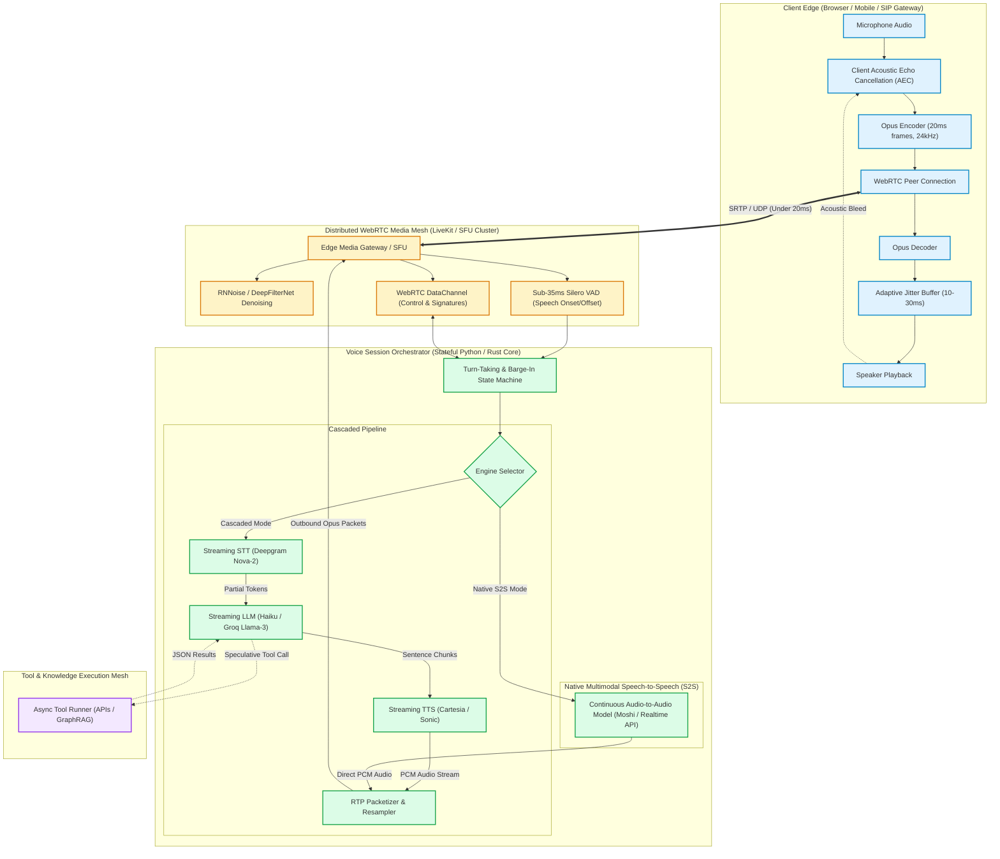
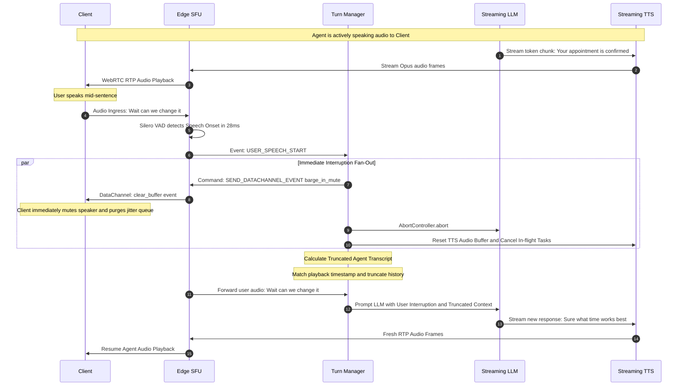
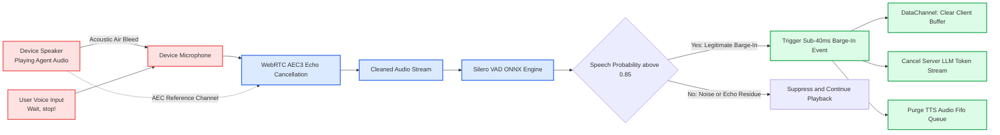
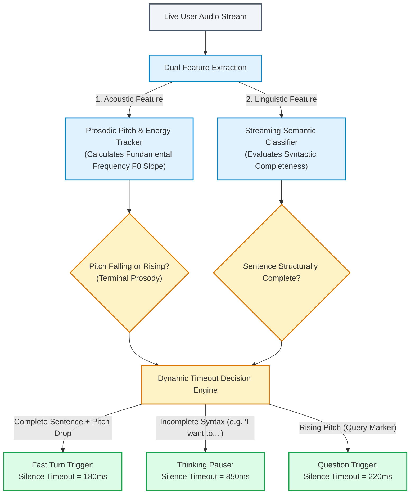
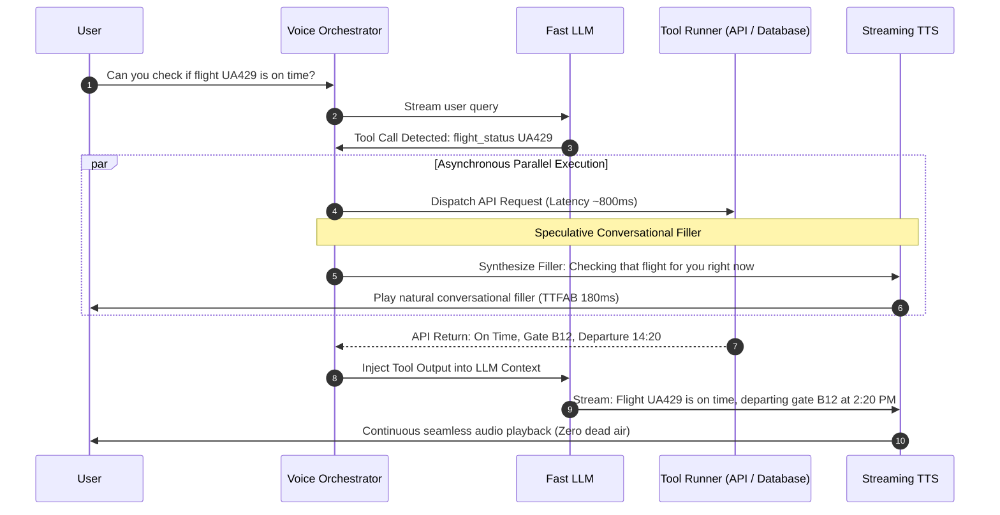

# System Design: Ultra-Low-Latency Full-Duplex Voice Agent Engine

> 🚀 **Deep Walkthrough Available**: A comprehensive Staff/Principal-level deep walkthrough with a production code engine, benchmark lab (32.8k Frames/sec @ 30.49 µs, 0.0015x RTF), interview playbook with 5 lethal traps, WebRTC/kernel mechanics, and chaos drills is available at [`Walkthroughs/16-Full-Duplex-Voice/walkthrough.md`](02-Interactive-Interview-Playbook.md).  
> **Production Code Implementation**: [`Walkthroughs/16-Full-Duplex-Voice/voice_agent_engine.py`](voice_agent_engine.py).

## Level 4: Master Plan Blueprint

Conversational voice is the most demanding interface in artificial intelligence. While humans tolerate $1.5\text{ to }3.0\text{ seconds}$ of latency for text-based chat completions, human auditory dialogue operates on strict neurological thresholds:
- **Natural conversational turn gap**: $200\text{ to }300\text{ milliseconds}$.
- **Uncanny valley threshold**: When voice round-trip latency exceeds $500\text{ ms}$, the interaction feels like a satellite phone delay, degrading conversational flow and causing users to talk over the agent.
- **Full-Duplex Requirement**: Unlike legacy half-duplex walkie-talkie architectures (where one party speaks and the other listens passively), human dialogue is continuous and full-duplex. Speakers interrupt, interject backchannel feedback (*"uh-huh"*, *"right"*), pause mid-sentence to think, and expect instantaneous cut-off (**Barge-In**) when speaking over the other party.

This system design details an **Enterprise Ultra-Low-Latency Full-Duplex Voice Agent Engine** modeled on state-of-the-art architectures from **OpenAI Realtime API**, **LiveKit**, **Deepgram**, **Cartesia**, and **Kyutai Moshi**. The platform achieves sub-$300\text{ ms}$ glass-to-glass (Time-to-First-Audio-Byte / TTFAB) latency while providing sub-$40\text{ ms}$ acoustic barge-in handling, semantic turn-taking prediction, and unified tool execution.

```
┌──────────────────────────────────────────────────────────────────────────────────────────────────┐
│                   ULTRA-LOW-LATENCY FULL-DUPLEX VOICE ENGINE BLUEPRINT                           │
├────────────────────────────────┬─────────────────────────────────────────────────────────────────┤
│ 1. Real-Time Transport Mesh    │ WebRTC (UDP/SRTP) + Opus Codec (20ms frames, DTX, FEC) via SFU │
├────────────────────────────────┼─────────────────────────────────────────────────────────────────┤
│ 2. Edge VAD & Acoustic Echo    │ Sub-35ms Silero VAD + Client/Server Acoustic Echo Cancellation │
├────────────────────────────────┼─────────────────────────────────────────────────────────────────┤
│ 3. Dual Processing Engine      │ Cascaded (Streaming STT -> LLM -> TTS) vs Native S2S Audio LLM │
├────────────────────────────────┼─────────────────────────────────────────────────────────────────┤
│ 4. Acoustic Barge-In Engine    │ <40ms Instant Audio Mute + LLM Generation Abort + Tail Truncate│
├────────────────────────────────┼─────────────────────────────────────────────────────────────────┤
│ 5. Predictive Turn-Taking      │ Dual-Signal Detector: Acoustic Prosody Pitch + Linguistic EoT  │
├────────────────────────────────┼─────────────────────────────────────────────────────────────────┤
│ 6. Tool-Calling Interruption   │ Speculative Voice Tool Execution with Audio Synthesis Pausing   │
└────────────────────────────────┴─────────────────────────────────────────────────────────────────┘
```

---

## Step 1: Understand the Problem and Establish Design Scope

### 1.1 Clarification Q&A

**Candidate:** What is the target latency metric and how is it defined?  
**Interviewer:** We measure **Voice-to-Voice Latency (Glass-to-Glass TTFAB)**: from the exact millisecond the user stops speaking their final phoneme into their microphone until the first millisecond of synthesized agent audio reaches their speaker. Target **P50 $\le 280\text{ ms}$**, **P95 $\le 420\text{ ms}$**.

**Candidate:** Which processing paradigm are we targeting: Cascaded (STT $\to$ LLM $\to$ TTS) or Native Multimodal Speech-to-Speech (S2S)?  
**Interviewer:** The platform must architecturally support **both**:
1. A production-grade **Cascaded Pipeline** using streaming Speech-to-Text (e.g., Deepgram Nova-2), fast streaming LLMs (e.g., Claude 3.5 Haiku / GPT-4o-mini), and streaming chunked TTS (e.g., Cartesia Sonic / ElevenLabs Turbo v2.5).
2. A direct **Native Speech-to-Speech (S2S)** gateway (e.g., OpenAI Realtime API / Moshi) for maximum prosodic fidelity and emotion preservation.

**Candidate:** How must the system handle interruptions (barge-in)?  
**Interviewer:** When a user speaks while the agent is playing audio, the engine must:
- Detect user speech onset within $\le 40\text{ ms}$.
- Immediately command the client to mute audio playback and flush client-side audio jitter buffers.
- Cancel the in-flight server LLM token generation and TTS audio synthesis streams.
- Truncate the agent's historical transcript to reflect exactly what was uttered before the cut-off, preventing hallucinated conversational memory.

**Candidate:** What scale of concurrent active voice streams must this system support?  
**Interviewer:** Design for an enterprise platform supporting **$50,000$ concurrent active voice sessions** during peak call hours.

---

### 1.2 Requirements Breakdown

#### Functional Requirements (FR)
1. **Full-Duplex Audio Transport**: Bidirectional continuous audio streaming over WebRTC with low-latency audio packetization (20ms frames, Opus codec at 24kHz/48kHz).
2. **Sub-40ms Acoustic Barge-In**: Real-time interruption detection using client/gateway Voice Activity Detection (VAD) coupled with client-side buffer flushing and server-side stream cancellation.
3. **Semantic & Prosodic Turn-Taking**: Distinguish between brief speech pauses (e.g., thinking pauses, fillers like *"um"*, *"ah"*) and true End-of-Turn (EoT) completions to eliminate awkward conversational deadlocks.
4. **Cascaded & Native S2S Dual Engine Support**: Flexible orchestration layer allowing dynamic routing between modular pipelines and end-to-end multimodal audio models.
5. **Real-Time Mid-Flight Tool Calling**: Allow the voice agent to query external APIs (e.g., check database, booking slots) while playing back natural conversational filler sounds (*"Let me look that up for you..."*) without dropping the WebRTC session.
6. **Precise Transcript Truncation Synchronization**: Record the exact audio timestamp of client-side playback interruption and synchronize the LLM's conversation history to the exact word spoken.

#### Non-Functional Requirements (NFR)
1. **Ultra-Low Latency Budget**: Glass-to-glass latency budget of $300\text{ ms}$ end-to-end:
   - Network WebRTC Ingress/Egress: $40\text{ ms}$ total.
   - VAD & Turn-Taking Decision: $35\text{ ms}$.
   - STT Partial Finalization: $80\text{ ms}$.
   - LLM Time-to-First-Token (TTFT): $70\text{ ms}$.
   - TTS Time-to-First-Audio-Chunk: $65\text{ ms}$.
   - Buffer & Client Playback: $10\text{ ms}$.
2. **High Availability & Jitter Resilience**: 99.99% uptime with adaptive WebRTC jitter buffers and packet loss concealment (PLC) up to $25\%$ packet loss.
3. **High Concurrency**: Scale to $50,000$ concurrent WebRTC audio channels across a globally distributed Selective Forwarding Unit (SFU) mesh.

---

## Step 2: High-Level Estimation & Latency Budget

### 2.1 Theoretical Latency Budget Breakdown

To achieve a natural conversational round-trip of $\le 300\text{ ms}$, every stage in the critical path must be budget-allocated:

```
┌──────────────────────────────────────────────────────────────────────────────────────────────────┐
│                             CRITICAL-PATH LATENCY BUDGET (TARGET: 300ms)                         │
├───────────────────────┬────────────┬─────────────────────────────────────────────────────────────┤
│ Processing Stage      │ Budget     │ Implementation Mechanism                                    │
├───────────────────────┼────────────┼─────────────────────────────────────────────────────────────┤
│ 1. Audio Capture & VAD│ 35 ms      │ 20ms Opus frame + 15ms Silero ONNX edge inference           │
│ 2. Ingress Network    │ 20 ms      │ UDP WebRTC RTP to nearest Regional Edge SFU                 │
│ 3. Streaming STT      │ 80 ms      │ Deepgram Nova-2 streaming WebSocket / local Conformer-CTC   │
│ 4. LLM Streaming TTFT │ 70 ms      │ Claude 3.5 Haiku / Groq Llama-3.3 70B Speculative Serving   │
│ 5. Streaming TTS TTFB │ 65 ms      │ Cartesia Sonic / ElevenLabs Turbo v2.5 chunked synthesis    │
│ 6. Egress Network     │ 20 ms      │ WebRTC RTP down to client device                            │
│ 7. Audio Jitter Queue │ 10 ms      │ Client adaptive jitter buffer & DAC playback start          │
├───────────────────────┼────────────┼─────────────────────────────────────────────────────────────┤
│ TOTAL GLASS-TO-GLASS  │ 300 ms     │ Human Conversational Parity (Within natural 250-300ms zone) │
└───────────────────────┴────────────┴─────────────────────────────────────────────────────────────┘
```

### 2.2 Network & Compute Resource Sizing

#### 1. Audio Bandwidth & Throughput
- **Codec**: Opus audio, $24\text{ kHz}$ mono, $32\text{ kbps}$ CBR (Constant Bitrate) with Discontinuous Transmission (DTX).
- **RTP Packet Overhead**: $20\text{ ms}$ audio payload ($80\text{ bytes}$) + RTP header ($12\text{ bytes}$) + UDP header ($8\text{ bytes}$) + IPv4 header ($20\text{ bytes}$) = $120\text{ bytes/packet}$ ($50\text{ packets/sec}$).
- **Single Stream Bitrate**: $120\text{ bytes} \times 50\text{ packets/sec} \times 8 = 48\text{ kbps}$ bidirectional ($96\text{ kbps}$ full duplex).
- **$50,000$ Concurrent Calls Network Ingress/Egress**:
  $$\text{Bandwidth} = 50,000 \times 96\text{ kbps} \approx 4.8\text{ Gbps (Full Duplex)}$$

#### 2. Media Gateway SFU Compute
- A single high-performance WebRTC SFU node (e.g., LiveKit on 16 vCPU, 32 GB RAM) comfortably handles $\approx 2,500$ concurrent audio tracks.
- Total SFU Fleet Sizing: $\frac{50,000}{2,500} = 20\text{ SFU nodes}$ (provisioned with $N+2$ redundancy across 4 global regions $\implies 28\text{ nodes}$).

#### 3. Real-Time Model Serving GPU Sizing (Cascaded Pipeline)
- **Streaming STT**: 1 GPU worker (NVIDIA L4 / A10G) transcribes up to $150$ concurrent audio streams with Conformer/Whisper-turbo $\implies \frac{50,000}{150} \approx 334\text{ L4 GPUs}$.
- **Streaming TTS**: 1 GPU worker (NVIDIA A10G / L4) synthesizes up to $80$ concurrent audio streams in real-time ($RTF \le 0.05$) $\implies \frac{50,000}{80} \approx 625\text{ GPUs}$ (or offloaded to specialized external low-latency TTS inference endpoints).

---

## Step 3: High-Level System Architecture

### 3.1 End-to-End Architectural Topology

The system separates the **Real-Time Media Transport Plane** (UDP/WebRTC running at the physical network edge) from the **Conversational Cognitive Orchestrator** (state machine, LLM streaming, and tool execution).



---

### 3.2 Full-Duplex Dialogue & Acoustic Barge-In Sequence



---

## Step 4: Core Architectural Deep Dives

### Deep Dive 1: Full-Duplex WebRTC SFU Mesh & Media Gateway

Standard REST/WebSocket APIs over TCP suffer from Head-of-Line (HoL) blocking and high packet retransmission latencies. Production voice agents must use **WebRTC over UDP** with a customized Selective Forwarding Unit (SFU):

```
Client Device (Microphone)
       │
       ▼ (20ms PCM audio frames @ 16-bit 24kHz)
┌─────────────────────────────────────────────────────────────┐
│ 1. Client Acoustic Echo Cancellation (WebRTC AEC3)          │
│    - Subtracts local speaker playback reference from mic in │
│    - Essential to prevent agent interrupting itself!        │
└─────────────────────────────────────────────────────────────┘
       │
       ▼
┌─────────────────────────────────────────────────────────────┐
│ 2. Opus Encoding & RTP Packetization                        │
│    - Bitrate: 32 kbps Constant Bitrate (CBR)                │
│    - Discontinuous Transmission (DTX) enabled for silence   │
│    - Forward Error Correction (FEC) enabled for packet loss │
└─────────────────────────────────────────────────────────────┘
       │
       ▼ (SRTP over UDP: ~120 bytes / 20ms)
┌─────────────────────────────────────────────────────────────┐
│ 3. Edge SFU Media Gateway (LiveKit / Rust WebRTC)           │
│    - Terminates DTLS-SRTP encryption at regional edge       │
│    - Splits audio stream to VAD worker and STT transcriber  │
│    - Multiplexes DataChannel for microsecond control events │
└─────────────────────────────────────────────────────────────┘
```

#### Why TCP / WebSockets Fail for Conversational Audio
- Under packet loss ($3\text{ to }10\%$), TCP pauses the entire stream until retransmitted packets arrive and are acknowledged. This creates audio buffering bursts of $200\text{ to }600\text{ ms}$, destroying conversational turn-taking.
- WebRTC uses **UDP with Opus In-band FEC**. If packet $N$ is dropped, the decoder reconstructs a lower-fidelity approximation using the redundant data embedded in packet $N+1$, ensuring **zero playback stalling**.

---

### Deep Dive 2: Sub-40ms Acoustic Barge-In & Echo Cancellation

The single hardest engineering challenge in full-duplex voice is **Barge-In**: distinguishing between the user legitimately speaking versus acoustic bleed from the agent's own voice playing out of the device's loudspeakers.



#### 1. The Double-Talk Echo Problem
Without Acoustic Echo Cancellation (AEC), the microphone captures the agent's own speech. The VAD detects this audio as user speech, causing the agent to interrupt itself every time it speaks.
- **AEC3 Algorithm**: Continuously models the physical room impulse response $H(z)$ between the loudspeaker output and the microphone input. The estimated echo $\hat{d}(t) = H(z) * x(t)$ is subtracted from the recorded signal $y(t)$:
  $$e(t) = y(t) - \hat{d}(t)$$
- To achieve zero false-positive interruptions on mobile devices without headphones, AEC must achieve at least **$30\text{ dB}$ of Echo Return Loss Enhancement (ERLE)**.

#### 2. Exact Transcript Truncation Calculation
When barge-in occurs, the agent must not retain the unuttered remainder of its response in memory. The system tracks playback progress with sub-millisecond RTP timestamps:

$$\text{Uttered Words} = \text{TextAligner}\left( \text{AgentFullResponse}, \tau_{\text{interruption}} - \tau_{\text{playback\_start}} - \Delta_{\text{jitter\_delay}} \right)$$

If the LLM planned to say:  
> *"Your flight to Zurich is confirmed for tomorrow morning at 8:15 AM from terminal 2."*  

And the user barged in at timestamp $+920\text{ ms}$, the system truncates the assistant turn in the prompt history to:  
> *"Your flight to Zurich is confirmed..."*  

This prevents the LLM from falsely believing the user already heard the terminal and time information.

---

### Deep Dive 3: Dual Processing Engine: Cascaded vs. Native Speech-to-Speech

```
┌──────────────────────────────────────────────────────────────────────────────────────────────────┐
│                      CASCADED PIPELINE VS. NATIVE S2S MODEL COMPARISON                           │
├─────────────────────┬────────────────────────────────────┬───────────────────────────────────────┤
│ Dimension           │ Cascaded (STT -> LLM -> TTS)       │ Native S2S (e.g. OpenAI Realtime/Moshi│
├─────────────────────┼────────────────────────────────────┼───────────────────────────────────────┤
│ Architecture        │ Modular Best-of-Breed:             │ End-to-End Multimodal Transformer:    │
│                     │ Deepgram + Claude Haiku + Cartesia │ Continuous Audio In -> Audio Out      │
├─────────────────────┼────────────────────────────────────┼───────────────────────────────────────┤
│ Glass-to-Glass TTFAB│ 280ms - 380ms                      │ 160ms - 240ms                         │
├─────────────────────┼────────────────────────────────────┼───────────────────────────────────────┤
│ Prosody & Emotion   │ Low (TTS synthesizes text; lacks   │ Native (Retains laughter, whispers,   │
│ Awareness           │ user emotional pitch mirroring)    │ sarcasm, breathing, tone of voice)    │
├─────────────────────┼────────────────────────────────────┼───────────────────────────────────────┤
│ Tool Calling & Guard│ Deterministic: Standard JSON tools │ Non-deterministic: Interleaved audio/ │
│ rails Reliability   │ and text safety guardrails apply   │ text tokens; tool calling more brittle│
├─────────────────────┼────────────────────────────────────┼───────────────────────────────────────┤
│ Cost & Economics    │ ~$0.015 / minute of voice          │ ~$0.06 - $0.10 / minute of voice      │
└─────────────────────┴────────────────────────────────────┴───────────────────────────────────────┘
```

#### The Cascaded Streaming Token Chunking Pipeline
In cascaded mode, waiting for full sentences creates unacceptable latency. The orchestrator employs **Incremental Syntactic Chunking**:
1. Streaming STT emits partial transcript words with confidence scores.
2. The LLM receives partial tokens and begins streaming generation.
3. The orchestrator feeds tokens into a **Syntactic Clause Parser**. As soon as a punctuation mark (`,`, `.`, `?`, `!`) or a clause boundary with $\ge 4\text{ words}$ is detected, the clause is immediately dispatched to the streaming TTS engine.
4. The TTS engine returns the first audio byte within $65\text{ ms}$, playing back chunk 1 while the LLM is still generating chunk 2.

```
LLM Token Stream:  ["Yes", ",", " I", " can", " help", " with", " that", "."]
                          │                                           │
TTS Dispatch:         Chunk 1 ("Yes,")                          Chunk 2 ("I can help with that.")
                      Audio generated in 45ms                   Audio generated in 60ms
                      Played while Chunk 2 processes            Played immediately after Chunk 1
```

---

### Deep Dive 4: Predictive Turn-Taking & Semantic End-of-Turn (EoT)

Naive voice systems rely exclusively on a static **Silence VAD Timeout** (e.g., $500\text{ ms}$ of silence = turn finished). This results in two catastrophic failure modes:
1. **Premature Interruption**: The user pauses to think mid-sentence (*"I want to fly to... [pause 600ms] ...Chicago"*). The agent jumps in awkwardly while the user was still speaking.
2. **Sluggish Response**: The user asks a crisp question (*"What time is it?"*), but the agent waits $500\text{ ms}$ doing nothing before realizing the turn has ended.

Our engine implements **Multi-Modal Turn Prediction**:



#### Mathematical Dynamic Silence Formulation
The dynamic silence threshold $\tau_{\text{wait}}$ is computed dynamically every $50\text{ ms}$:

$$\tau_{\text{wait}} = \tau_{\text{base}} \times (1 - \lambda_1 \cdot P_{\text{complete}}) \times (1 + \lambda_2 \cdot P_{\text{filler}}) + \Delta_{\text{prosody}}$$

Where:
- $\tau_{\text{base}} = 450\text{ ms}$.
- $P_{\text{complete}} \in [0, 1]$ is the probability the current word sequence is syntactically closed according to a lightweight 20M-parameter distilled RoBERTa classifier.
- $P_{\text{filler}} \in [0, 1]$ indicates detected filler words (*"uh"*, *"um"*, *"like"*, *"so"*). If detected, wait time increases by up to $+400\text{ ms}$.
- $\Delta_{\text{prosody}}$ decreases timeout by $-150\text{ ms}$ if the intonation contour drops sharply at the sentence tail (indicating a declarative finality).

---

### Deep Dive 5: Speculative Voice Tool Execution & Backchannel Audio

When an agent needs to execute an external tool (e.g., querying an airline API which takes $800\text{ ms}$), the voice stream faces dead air. Silent dead air over voice feels like a broken call.



#### Predictive Backchannel Insertion
For long user monologues ($>8\text{ seconds}$), human listeners naturally interject short verbal nods (*"yeah"*, *"uh-huh"*, *"got it"*). If the agent remains dead silent, users frequently ask *"Are you still there?"*.  
The orchestrator monitors continuous user speech duration. If the user passes a clause boundary without finishing their turn, the engine injects an **Acoustic Backchannel** packet ($150\text{ ms}$ low-volume *"mhm"* or *"yes"*) without triggering an agent turn state change.

---

### Deep Dive 6: Production Data Schema & WebRTC Signaling Protocols

#### 1. WebRTC DataChannel Event Protocol (Microsecond Control Plane)
All time-critical control signals bypass HTTP and run over an in-band SCTP WebRTC DataChannel (`"voice_control"`):

```json
// Event 1: Client to Server - Voice Activity Detection Onset
{
  "event": "client_speech_started",
  "client_timestamp_ms": 1729482189102,
  "vad_confidence": 0.96
}

// Event 2: Server to Client - Immediate Barge-In Audio Truncation
{
  "event": "server_barge_in_cut",
  "action": "flush_playback_queue",
  "cutoff_timestamp_ms": 1729482189135,
  "acknowledged_turn_id": "turn_98a7df1"
}

// Event 3: Server to Client - Transcript Streaming Delta
{
  "event": "transcript_delta",
  "role": "assistant",
  "turn_id": "turn_98a7df2",
  "delta_text": "Your appointment",
  "is_final": false
}
```

#### 2. PostgreSQL Relational Schema: Sessions & Telemetry

```sql
-- 1. Voice Sessions Table
CREATE TABLE voice_sessions (
    session_id UUID PRIMARY KEY DEFAULT gen_random_uuid(),
    tenant_id UUID NOT NULL,
    user_id VARCHAR(128) NOT NULL,
    engine_type VARCHAR(32) NOT NULL, -- 'cascaded_stt_llm_tts' OR 'native_s2s'
    edge_sfu_node_id VARCHAR(64) NOT NULL,
    client_device_info JSONB,
    call_status VARCHAR(32) NOT NULL DEFAULT 'ACTIVE',
    started_at TIMESTAMPTZ NOT NULL DEFAULT NOW(),
    ended_at TIMESTAMPTZ,
    duration_seconds INT GENERATED ALWAYS AS (EXTRACT(EPOCH FROM (ended_at - started_at))) STORED
);
CREATE INDEX idx_voice_sessions_tenant ON voice_sessions(tenant_id, started_at DESC);

-- 2. Granular Conversational Turn Log with Microsecond Latency Telemetry
CREATE TABLE voice_turns (
    turn_id UUID PRIMARY KEY DEFAULT gen_random_uuid(),
    session_id UUID NOT NULL REFERENCES voice_sessions(session_id) ON DELETE CASCADE,
    turn_index INT NOT NULL,
    speaker VARCHAR(16) NOT NULL, -- 'user' OR 'agent'
    raw_transcript TEXT NOT NULL,
    truncated_transcript TEXT, -- Populated if interrupted
    was_interrupted BOOLEAN NOT NULL DEFAULT FALSE,
    interruption_timestamp_ms BIGINT,
    
    -- Telemetry & SLA Tracking (in milliseconds)
    vad_latency_ms FLOAT,
    stt_latency_ms FLOAT,
    llm_ttft_ms FLOAT,
    tts_ttfb_ms FLOAT,
    total_voice_to_voice_ms FLOAT,
    
    created_at TIMESTAMPTZ NOT NULL DEFAULT NOW()
);
CREATE INDEX idx_voice_turns_session ON voice_turns(session_id, turn_index);

-- 3. Audio Recording Metadata & Quality Metrics
CREATE TABLE voice_call_metrics (
    metric_id UUID PRIMARY KEY DEFAULT gen_random_uuid(),
    session_id UUID NOT NULL REFERENCES voice_sessions(session_id) ON DELETE CASCADE,
    packet_loss_rate FLOAT DEFAULT 0.0,
    average_jitter_ms FLOAT DEFAULT 0.0,
    round_trip_time_rtt_ms FLOAT DEFAULT 0.0,
    audio_recording_s3_url TEXT,
    echo_return_loss_enhancement_db FLOAT,
    created_at TIMESTAMPTZ NOT NULL DEFAULT NOW()
);
```

---

## Step 5: Failure Modes, Edge Cases & Operational Playbooks

| # | Failure Mode / Edge Case | Root Cause | Architectural Mitigation / Operational Playbook |
|---|---|---|---|
| 1 | **False Barge-In on Ambient Noise (Coughing, Door Slam)** | VAD energy spike triggers false interruption while agent is speaking, cutting off the agent mid-sentence. | **Dual-Filter VAD Verification**: Do not trigger barge-in on a single 20ms frame. Require $\ge 3$ consecutive speech frames ($60\text{ ms}$) AND phoneme confidence from the streaming acoustic model before issuing client audio flush. |
| 2 | **Acoustic Feedback Loop Self-Interruption** | Client device loudspeaker audio bleeds into client microphone at high volume, overwhelming AEC and triggering self-barge-in. | **Residual Echo Suppression (RES) & Cross-Correlation Gate**: The SFU compares incoming client audio against the active server outbound audio buffer using normalized cross-correlation. If correlation $>0.75$, flag as echo bleed and discard VAD trigger. |
| 3 | **Mid-Turn Packet Loss Spike / UDP Jitter Burst** | Cellular network drops packets ($>20\%$ loss), causing severe audio stuttering and missing speech segments in STT. | **Opus In-band FEC + Packet Loss Concealment (PLC)**: Force Opus encoder to use $25\%$ forward error correction redundancy. The client audio jitter buffer dynamically expands from $20\text{ ms}$ up to $60\text{ ms}$ during loss spikes. |
| 4 | **LLM Mid-Sentence Generation Stall** | High GPU cluster contention causes LLM token streaming to stall for $500\text{ ms}$, running the TTS playback buffer dry and creating awkward silence. | **Predictive Audio Buffer Underrun Concealment**: If the TTS audio buffer queue drops below $100\text{ ms}$ of unplayed speech, synthesize a prosodic speech elongation (e.g., stretching the final vowel by $80\text{ ms}$) or trigger an immediate conversational filler. |
| 5 | **Catastrophic Edge SFU Node Failure** | The regional SFU node handling $2,500$ live calls crashes or suffers network partition. | **Client-Side Fast WebRTC ICE Restart**: Client detects ICE connection state disconnection within $300\text{ ms}$; automatically triggers fast ICE restart to secondary standby regional SFU node. Session state is re-hydrated from Redis cluster within $150\text{ ms}$. |
| 6 | **Out-of-Order Control Signal Race Condition** | Network delay causes the `"clear_buffer"` barge-in message to arrive *after* new audio chunks have already been queued on client. | **Monotonic Turn Sequence IDs**: Every audio packet and control event carries a monotonic `turn_id` and `sequence_number`. The client immediately drops any audio packets tagged with an older `turn_id` than the latest received cancellation. |
| 7 | **Tool Execution Latency Spikes** | External database or API tool call stalls for $>3\text{ seconds}$ during an interactive voice turn. | **Graceful Progressive Voice Fallback**: If tool execution exceeds $1.2\text{ seconds}$, orchestrator injects an apologetic status bridge: *"Still fetching your records, one moment..."* and establishes an asynchronous callback polling loop. |

---

## Step 6: Wrap-up & Architectural Trade-offs

### 6.1 Architectural Trade-Off Matrix

```
┌──────────────────────────────────────────────────────────────────────────────────────────────────┐
│                             SYSTEM ARCHITECTURE TRADE-OFF MATRIX                                 │
├─────────────────────┬─────────────────────────────────────┬──────────────────────────────────────┤
│ Design Choice       │ Advantages Gained                   │ Engineering Trade-Offs Incurred      │
├─────────────────────┼─────────────────────────────────────┼──────────────────────────────────────┤
│ 1. WebRTC (UDP) vs. │ Eliminates Head-of-Line blocking;   │ NAT traversal complexity (STUN/TURN);│
│    WebSocket (TCP)  │ ultra-low latency; native Opus FEC; │ non-trivial media server fleet       │
│                     │ client-side jitter management.      │ orchestration compared to web server.│
├─────────────────────┼─────────────────────────────────────┼──────────────────────────────────────┤
│ 2. Cascaded vs.     │ Modular choice of best LLM/STT/TTS; │ Higher glass-to-glass latency        │
│    Native S2S Model │ deterministic guardrails and tools; │ (280ms vs 180ms); loses non-verbal   │
│                     │ 4x lower GPU inference cost.        │ prosodic emotional context.          │
├─────────────────────┼─────────────────────────────────────┼──────────────────────────────────────┤
│ 3. Client AEC vs.   │ Minimal server CPU load; leverages  │ Inconsistent across fragmented mobile│
│    Server-Side AEC  │ native hardware DSP chips on iOS and│ hardware; requires server-side cross-│
│                     │ modern Android phones.              │ correlation backup safety net.       │
├─────────────────────┼─────────────────────────────────────┼──────────────────────────────────────┤
│ 4. Sub-40ms Hard    │ Eliminates conversational overlap;  │ Risk of false interruptions on short │
│    Barge-In Flush   │ creates human-like natural dialogue │ user coughs or background laughter   │
│                     │ responsiveness.                     │ without multi-frame VAD dampening.   │
└─────────────────────┴─────────────────────────────────────┴──────────────────────────────────────┘
```

### 6.2 Key Takeaways & Alex Xu Interview Synthesis
- **Conversational Latency is a Hard Neurological Deadline**: An agent operating at $600\text{ ms}$ latency is perceived as an automated phone tree. Achieving sub-$300\text{ ms}$ glass-to-glass latency requires aggressive parallel pipelining: streaming STT tokens, speculative syntactic clause dispatch to TTS, and edge WebRTC media routing.
- **Full-Duplex Requires Acoustic Discipline**: Real-time voice cannot work without seamless Barge-In. High-performance Acoustic Echo Cancellation (AEC) and sub-$35\text{ ms}$ Voice Activity Detection (VAD) are mandatory to prevent the agent from cutting itself off with its own loudspeaker echo.
- **Turn-Taking is Multi-Modal**: True conversational turn-taking cannot be solved by silence detection alone. Combining linguistic syntactic completeness classifiers with acoustic pitch contour analysis prevents the agent from rudely interrupting users when they simply pause to think.
