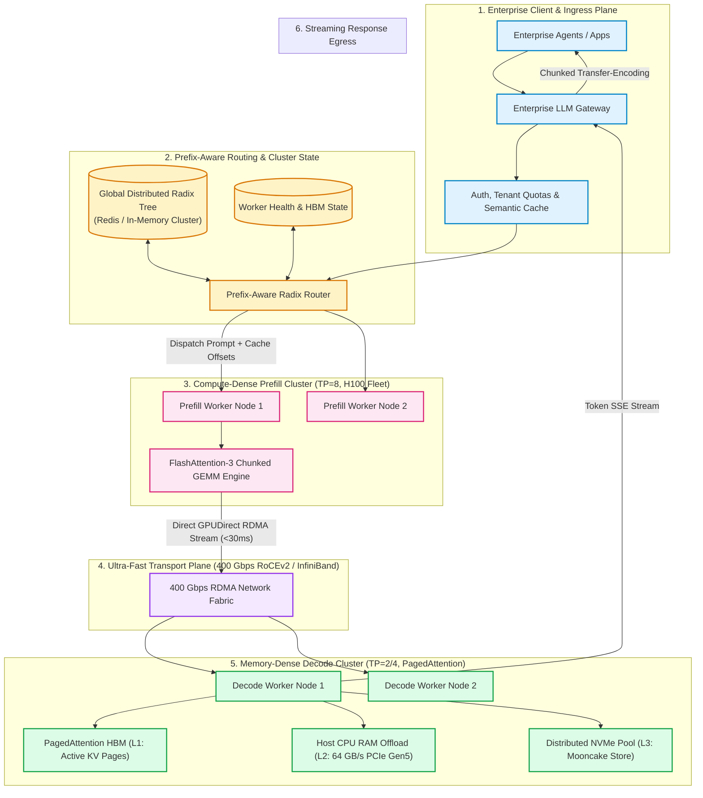
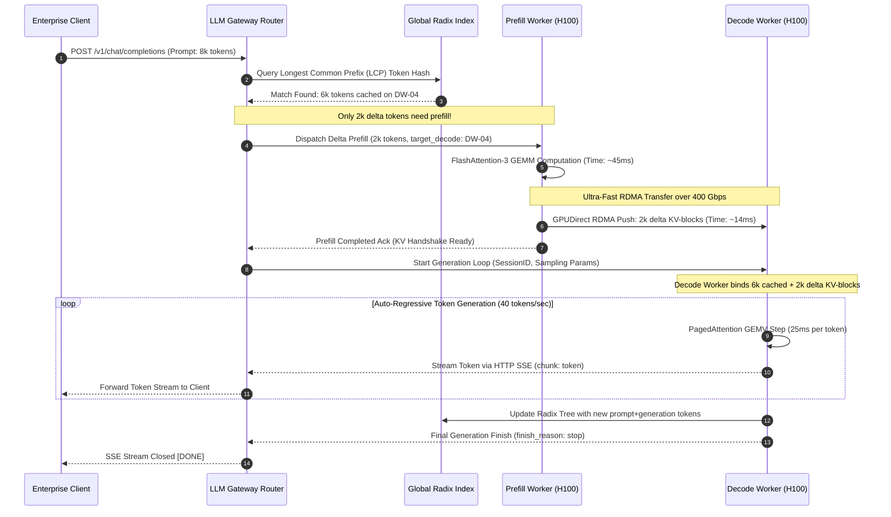
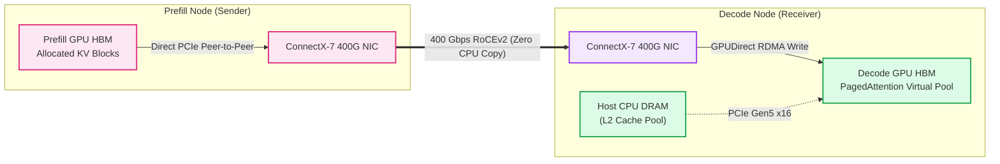
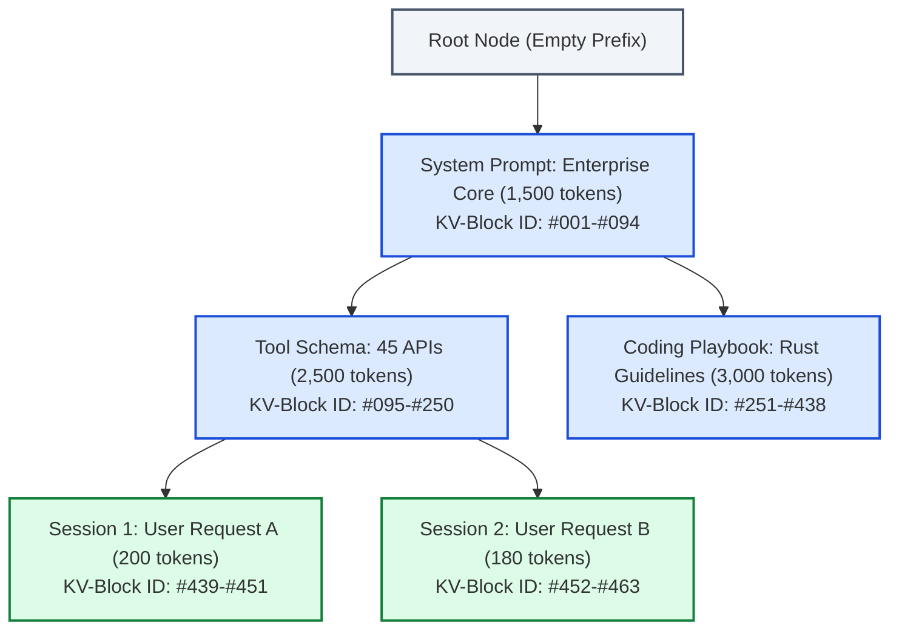
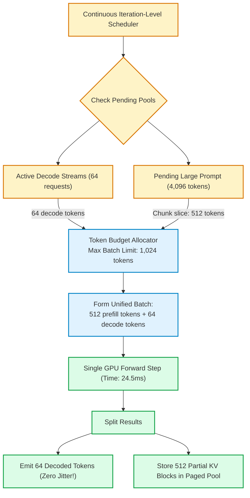

# System Design: Enterprise LLM Gateway & Distributed KV-Cache Serving

> 🚀 **Deep Walkthrough Available**: A comprehensive Staff/Principal-level deep walkthrough with a production code engine, benchmark lab (31.5k Ops/sec @ 31.70 µs), interview playbook with 5 lethal traps, GPU HBM/RDMA mechanics, and chaos drills is available at [`Walkthroughs/17-Distributed-KV-Cache/walkthrough.md`](02-Interactive-Interview-Playbook.md).  
> **Production Code Implementation**: [`Walkthroughs/17-Distributed-KV-Cache/kv_cache_gateway_engine.py`](kv_cache_gateway_engine.py).

## Level 4: Master Plan Blueprint

At enterprise scale, Large Language Model (LLM) serving costs dominate the AI balance sheet. Monolithic LLM serving—where a single GPU cluster handles both prompt ingestion (**Prefill**) and auto-regressive generation (**Decode**)—suffers from severe structural inefficiencies:
1. **The Prefill-Decode Interference Bottleneck**: The prefill phase is **compute-bound** (high arithmetic intensity GEMM operations), while the decode phase is **memory-bandwidth-bound** (low arithmetic intensity GEMV operations constrained by HBM speed). Executing both concurrently on the same GPU leads to severe scheduling jitter: an 8,000-token prompt prefill stalls ongoing decode streams, driving Inter-Token Latency (ITL / TPOT) spikes of up to $400\%$.
2. **The Multi-Turn KV-Cache Redundancy Crisis**: In multi-agent workflows, code repositories, and multi-turn chat, up to $85\%$ of prompt tokens (system prompts, tool definitions, conversation history, retrieved documents) are identical across requests. Regenerating Key-Value ($K$-$V$) activation tensors for these shared prefixes repeatedly wastes petawatt-hours of GPU compute.
3. **Memory Capacity Stranding**: A 70B parameter model serving a 16k context window requires $\approx 5.2\text{ GB}$ of raw KV-cache per concurrent session. High-end GPU High-Bandwidth Memory (HBM) becomes exhausted by idle KV-cache states rather than active tensor arithmetic.

This system design presents an **Enterprise LLM Gateway and Distributed KV-Cache Serving Mesh** based on modern production architectures from **vLLM (PagedAttention)**, **SGLang (RadixAttention)**, **Mooncake (Kimi / Moonshot AI)**, and **Splitwise**. The platform features complete **Prefill-Decode Disaggregation (PD Disaggregation)** over a 400 Gbps RoCEv2/InfiniBand RDMA fabric, hierarchical three-tier KV-cache offloading, prefix-aware intelligent gateway routing, and dynamic chunked prefill scheduling.

```
┌──────────────────────────────────────────────────────────────────────────────────────────────────┐
│              ENTERPRISE LLM GATEWAY & DISTRIBUTED KV-CACHE BLUEPRINT                             │
├────────────────────────────────┬─────────────────────────────────────────────────────────────────┤
│ 1. Intelligent Gateway Router  │ Prefix-Aware Radix Routing + Semantic Caching + Quota Management│
├────────────────────────────────┼─────────────────────────────────────────────────────────────────┤
│ 2. Disaggregated P/D Clusters  │ Dedicated Prefill Nodes (Compute-Dense) vs Decode (Memory-Dense)│
├────────────────────────────────┼─────────────────────────────────────────────────────────────────┤
│ 3. Distributed KV Fabric       │ 400 Gbps RoCEv2/InfiniBand RDMA Transfer (<30ms for 1.2 GB KV)  │
├────────────────────────────────┼─────────────────────────────────────────────────────────────────┤
│ 4. Hierarchical Cache Tiering  │ L1 GPU HBM (3.35 TB/s) -> L2 Host DRAM (64 GB/s) -> L3 NVMe Pool│
├────────────────────────────────┼─────────────────────────────────────────────────────────────────┤
│ 5. RadixAttention Prefix Mesh  │ Longest Common Prefix (LCP) Token Matching (Up to 80% Prefill 0)│
├────────────────────────────────┼─────────────────────────────────────────────────────────────────┤
│ 6. Chunked Prefill Scheduler   │ Continuous Piggyback Interleaving (Prevents Decode Stalling)    │
└────────────────────────────────┴─────────────────────────────────────────────────────────────────┘
```

---

## Step 1: Understand the Problem and Establish Design Scope

### 1.1 Clarification Q&A

**Candidate:** What is the primary service level objective (SLO) for this architecture?  
**Interviewer:** We target two distinct latency SLOs:
1. **Time-to-First-Token (TTFT)**: For an 8,000-token prompt, P95 $\le 350\text{ ms}$ with prefix cache hit; P95 $\le 1.2\text{ s}$ on cold prefill.
2. **Inter-Token Latency (ITL / Time-per-Output-Token)**: P99 $\le 25\text{ ms}$ per token (40 tokens/sec stream) with zero decode jitter during bursty prompt arrivals.

**Candidate:** Which model scales must the cluster support?  
**Interviewer:** Primary workload is a flagship 70B dense model (Llama-3-70B / Qwen-2.5-72B with Grouped Query Attention) and a Mixture-of-Experts (MoE) model (Mixtral 8x22B / DeepSeek-V3). Context lengths range from $4\text{k}$ up to $64\text{k tokens}$.

**Candidate:** What is the scale of the deployment?  
**Interviewer:** Assume an enterprise processing **$50,000$ requests per minute** ($\approx 833\text{ requests/sec}$ steady state, $2,500\text{ req/sec}$ peak), with an average prompt length of $4,000\text{ tokens}$ and average generation of $250\text{ tokens}$.

**Candidate:** Are we deploying on multi-node GPU clusters with RDMA networking?  
**Interviewer:** Yes. All GPU nodes are equipped with 8x NVIDIA H100 (80GB HBM3) interconnected via NVLink intra-node and 400 Gbps RoCEv2/InfiniBand inter-node RDMA.

---

### 1.2 Requirements Breakdown

#### Functional Requirements (FR)
1. **Unified Enterprise OpenAI-Compatible API Gateway**: Centralized proxy handling authentication, rate limiting, semantic caching, model multiplexing, and cost metering.
2. **Prefill-Decode (P/D) Disaggregation**: Decouple the prefill compute phase from the auto-regressive decode phase onto independently scaled GPU pools.
3. **Distributed High-Speed KV-Cache Transfer**: Stream precomputed KV-cache activation blocks from prefill workers to decode workers via direct GPU-to-GPU RDMA without CPU serialization bottlenecks.
4. **Hierarchical RadixAttention Prefix Caching**: Cache KV-cache pages in a globally tracked Radix Tree across GPU HBM, Host CPU RAM, and distributed NVMe pools to eliminate redundant prefill computation for repeated prompt prefixes.
5. **Dynamic Chunked Prefill**: For collocated fallback instances, interleave prompt prefill chunks with active decode steps to guarantee bounded ITL.
6. **Prefix-Aware Gateway Routing**: Direct incoming requests to the specific worker node containing the longest matching prefix cached in its local memory.

#### Non-Functional Requirements (NFR)
1. **Ultra-Low Decode Jitter**: Maintain P99 ITL $\le 25\text{ ms}$ under heavy, bursty concurrent prefill load.
2. **High KV-Cache Hit Ratio**: Achieve $>65\%$ prefix cache hit rate across enterprise agent workloads.
3. **GPU Memory Efficiency**: Eliminate internal and external KV memory fragmentation using PagedAttention (fixed-size 16/32-token memory blocks).
4. **Resilience & Fault Tolerance**: Automatic failover if a decode worker or RDMA link crashes mid-generation with transparent request replay.

---

## Step 2: High-Level Estimation & Hardware Sizing

### 2.1 Mathematical KV-Cache Sizing for Llama-3-70B

For a Transformer model using **Grouped Query Attention (GQA)**:
- Hidden size: $d_{\text{model}} = 8192$
- Number of layers: $n_{\text{layers}} = 80$
- Number of Key-Value heads: $n_{\text{kv\_heads}} = 8$
- Head dimension: $d_{\text{head}} = \frac{d_{\text{model}}}{n_{\text{q\_heads}}} = \frac{8192}{64} = 128$
- Precision: 16-bit float ($\text{FP16} = 2\text{ bytes}$)

#### KV-Cache Memory per Token Formulation:
$$\text{Memory}_{\text{token}} = 2 \times (\text{Key} + \text{Value}) \times n_{\text{layers}} \times n_{\text{kv\_heads}} \times d_{\text{head}} \times \text{bytes\_per\_element}$$
$$\text{Memory}_{\text{token}} = 2 \times 80 \times 8 \times 128 \times 2 = 327,680\text{ bytes} \approx 320\text{ KB/token}$$

#### Context Sizing Scenarios:
- **$4,000\text{ tokens (Average Request)}$**: $4,000 \times 320\text{ KB} = 1.28\text{ GB}$ of KV-cache.
- **$32,000\text{ tokens (Large Agent Document)}$**: $32,000 \times 320\text{ KB} = 10.24\text{ GB}$ of KV-cache.
- **$64,000\text{ tokens (Maximum Context)}$**: $64,000 \times 320\text{ KB} = 20.48\text{ GB}$ of KV-cache.

### 2.2 Network Bandwidth for Distributed KV-Cache RDMA Transfer
When transferring a $4,000$-token KV-cache ($1.28\text{ GB} = 10.24\text{ Gb}$) from a Prefill node to a Decode node over a **400 Gbps RDMA (RoCEv2) link**:
$$\text{Transfer Time} = \frac{10.24\text{ Gb}}{400\text{ Gbps} \times 0.90\text{ (efficiency)}} \approx 28.4\text{ milliseconds}$$
Because transfer takes **under $30\text{ ms}$**, P/D disaggregation introduces negligible overhead compared to the $150\text{ ms}-400\text{ ms}$ saved by running decode on dedicated, unblocked hardware.

### 2.3 Cluster Capacity Sizing (Peak: 2,500 req/sec)
- **Daily Ingest Volume**: $50,000\text{ req/min} = 833\text{ req/sec}$ average, $2,500\text{ req/sec}$ peak.
- **Active Decode Concurrency**:
  - Generation: $250\text{ tokens}$ at $40\text{ tokens/sec} \implies 6.25\text{ seconds}$ average decode duration.
  - Active concurrent decode streams at peak: $2,500\text{ req/sec} \times 6.25\text{ s} \approx 15,625\text{ concurrent streams}$.
- **HBM Required for Decode KV-Cache**:
  - Average context in decode: $4,000\text{ prompt} + 125\text{ output} \approx 4,125\text{ tokens} \times 320\text{ KB} \approx 1.32\text{ GB/stream}$.
  - Total KV-Cache HBM needed: $15,625 \times 1.32\text{ GB} \approx 20,625\text{ GB} \approx 20.6\text{ TB of HBM}$.
- **Decode Node GPU Fleet Sizing**:
  - An 8x H100 node provides $8 \times 80\text{ GB} = 640\text{ GB HBM}$.
  - Weights for 70B FP16 require $\approx 140\text{ GB}$ (leaving $\approx 500\text{ GB}$ for KV-cache per node).
  - Number of 8x H100 Decode Nodes: $\frac{20,625\text{ GB}}{500\text{ GB/node}} \approx 42\text{ Decode Nodes}$ ($336\text{ H100 GPUs}$).
- **Prefill Node GPU Fleet Sizing**:
  - Prefill throughput per 8x H100 node (TP=8 with FlashAttention-3): $\approx 45,000\text{ prompt tokens/sec}$.
  - Peak prompt token demand: $2,500\text{ req/sec} \times 4,000\text{ tokens} = 10,000,000\text{ tokens/sec}$.
  - With **$65\%$ Prefix Cache Hit Rate**, actual prefill needed is $35\%$: $3,500,000\text{ tokens/sec}$.
  - Number of 8x H100 Prefill Nodes: $\frac{3,500,000}{45,000} \approx 78\text{ Prefill Nodes}$ ($624\text{ H100 GPUs}$).

---

## Step 3: High-Level System Architecture

### 3.1 End-to-End Architectural Topology

The system splits the lifecycle of an LLM request into three discrete tiers:
1. **Intelligent Gateway & Routing Mesh**: Determines prefix cache locality via a global Radix Index, evaluates semantic caching, and balances load.
2. **Compute-Dense Prefill Cluster**: Dedicated to high-batch, compute-heavy prompt tensor contraction (GEMM).
3. **Memory-Dense Decode Cluster**: Dedicated to continuous auto-regressive token emission (GEMV) connected via high-bandwidth RDMA.



---

### 3.2 Disaggregated Prefill-Decode Execution Sequence



---

## Step 4: Core Architectural Deep Dives

### Deep Dive 1: Disaggregated Prefill & Decode (PD Disaggregation) Architecture

In traditional monolithic serving, prefill and decode phases run on the same GPU, creating severe scheduling friction:

```
Traditional Monolithic Serving (Prefill-Decode Interference):
Time ──►
GPU 1:  [Decode 1][Decode 2] ───► [8,000-Token Prefill Stalls Decodes for 350ms!] ───► [Decode 1][Decode 2]
                                  ▲ (Catastrophic ITL Spike: 25ms -> 375ms!)

Disaggregated Serving (Zero Interference):
Prefill GPU: [8,000-Token Prefill (Compute-Bound GEMM)] ──► RDMA Transfer (28ms)
Decode GPU:  [Decode 1][Decode 2][Decode 3] ─────────────► Continuous 25ms ITL (Memory-Bound GEMV)
```

#### Why Decoupling is Asymptotically Optimal
1. **Tensor Parallelism (TP) Optimization**:
   - **Prefill Workers**: Benefit from large TP ($TP=8$) because large matrix multiplications across 8 GPUs achieve near-linear compute scaling and maximize Tensor Core utilization ($>70\%$ MFU).
   - **Decode Workers**: Suffer from large TP because GEMV matrix-vector multiplication is small; TP communication overhead (AllReduce over NVLink) dominates computation. Decode workers run optimally at low TP ($TP=1$ or $TP=2$) with high continuous batch sizes.
2. **Hardware Specialization**:
   - Prefill nodes require maximum FP8/FP16 FLOPS (e.g., NVIDIA H100 SXM5).
   - Decode nodes require maximum HBM memory capacity and memory bandwidth (e.g., NVIDIA H200 with 141 GB HBM3e or custom LPDDR5x configurations).

---

### Deep Dive 2: Distributed KV-Cache Transfer & RDMA Fabric (Mooncake Architecture)

Transferring gigabytes of KV-cache over TCP/IP destroys the latency advantages of disaggregation. The platform uses **GPUDirect RDMA over Converged Ethernet (RoCEv2)**:



#### 1. Zero-Copy GPUDirect RDMA Memory Pipeline
1. **Pre-registered Virtual Memory Windows**: During worker boot, the PagedAttention memory allocator allocates a contiguous virtual address space mapped directly to GPU physical HBM pages. This region is registered with the InfiniBand/RoCE verbs subsystem using `ibv_reg_mr`.
2. **One-Sided RDMA Write with Immediate**: The prefill worker initiates an `RDMA_WRITE` directly targeting the physical memory offsets of the decode worker's pre-allocated PagedAttention blocks. 
3. **Bypassing Host CPU & OS Kernel**: Data flows directly: $\text{Prefill HBM} \to \text{PCIe Switch} \to \text{Local NIC} \to \text{Network Fabric} \to \text{Remote NIC} \to \text{Decode HBM}$. The host CPU experiences $0\%$ utilization during the transfer.

---

### Deep Dive 3: Hierarchical RadixAttention & Distributed Prefix Cache Routing

In multi-agent systems and enterprise knowledge retrieval, prompts share massive common prefixes:

```
[System Prompt: Enterprise Agent Persona (1,500 tokens)]
  │
  ├──► [Tool Definitions: 45 OpenAPI JSON Schemas (2,500 tokens)]
  │      │
  │      ├──► [Session A: User Query 1 (250 tokens)] -> Unique
  │      └──► [Session B: User Query 2 (310 tokens)] -> Unique
```

Rather than hashing the entire prompt as a single monolithic key, SGLang's **RadixTree** maintains a hierarchical state graph where nodes represent token subsequences and edges represent incremental completions.



#### Radix Router Dispatch Algorithm
When request $R$ arrives with token sequence $T = [t_1, t_2, \dots, t_N]$:
1. **Longest Common Prefix (LCP) Search**: Traverse the global Radix Index to locate the worker node $W^*$ possessing the longest cached sequence $T_{[1:M]}$ where $M \le N$.
2. **Cache Score Evaluation**:
   $$Score(W_i) = \alpha \cdot \frac{M_i}{N} + \beta \cdot (1 - \text{HBM\_Utilization}(W_i)) - \gamma \cdot \text{QueueDepth}(W_i)$$
   Where:
   - $\frac{M_i}{N}$ represents prefix reuse percentage ($\alpha = 0.60$).
   - $\text{HBM\_Utilization}$ prevents routing to workers near OOM ($\beta = 0.25$).
   - $\text{QueueDepth}$ penalizes congested workers ($\gamma = 0.15$).
3. **Execution Dispatch**: The gateway sends only the suffix tokens $T_{[M+1:N]}$ to the prefill worker, specifying $W^*$ as the destination decode target. If $M/N > 0.85$, TTFT drops from $1,200\text{ ms}$ down to **$85\text{ ms}$**.

---

### Deep Dive 4: Chunked Prefill & Continuous Piggyback Scheduling

When requests are served on hybrid or non-disaggregated fallback nodes, a long prompt prefill can still stall ongoing decodes. The scheduler implements **Sarathi-Serve / vLLM Chunked Prefill**:

```
Budget per Iteration: Max 1,024 Tokens Total
Iteration 1: [Prefill Chunk 1: 512 tokens] + [Decode Batch: 64 streams x 1 token = 64 tokens] = 576 tokens
Iteration 2: [Prefill Chunk 2: 512 tokens] + [Decode Batch: 64 streams x 1 token = 64 tokens] = 576 tokens
Iteration 3: [Prefill Chunk 3: 512 tokens] + [Decode Batch: 64 streams x 1 token = 64 tokens] = 576 tokens
```



#### Why Chunking Preserves ITL
By enforcing a strict token budget (e.g., $1,024\text{ tokens}$ total per forward step), the forward-pass execution time on an H100 GPU remains strictly bounded below $25\text{ ms}$. Ongoing decode tokens are never paused for more than one iteration, completely eliminating the $400\text{ ms}$ stalls caused by monolithic prefills.

---

### Deep Dive 5: Hierarchical Three-Tier KV-Cache Offloading

GPU HBM is too expensive to hold inactive agent sessions. The platform implements an automated three-tier storage hierarchy:

```
┌──────────────────────────────────────────────────────────────────────────────────────────────────┐
│                         HIERARCHICAL THREE-TIER KV-CACHE ARCHITECTURE                            │
├─────────┬──────────────────────┬─────────────┬──────────────┬────────────────────────────────────┤
│ Tier    │ Physical Medium      │ Bandwidth   │ Capacity     │ Eviction / Promotion Policy        │
├─────────┼──────────────────────┼─────────────┼──────────────┼────────────────────────────────────┤
│ L1 HBM  │ On-Chip GPU HBM3     │ 3,350 GB/s  │ 80 GB/GPU    │ Active decoding sessions.          │
│         │                      │             │              │ Evicted to L2 on 2s inactivity.    │
├─────────┼──────────────────────┼─────────────┼──────────────┼────────────────────────────────────┤
│ L2 Host │ Host CPU System DRAM │ 64 GB/s     │ 1 - 2 TB/node│ Recent sessions / Radix roots.     │
│         │ (PCIe Gen5 x16)      │             │              │ Async pinned-memory DMA promotion. │
├─────────┼──────────────────────┼─────────────┼──────────────┼────────────────────────────────────┤
│ L3 Pool │ Distributed NVMe SSD │ 12 GB/s     │ 50 - 100 TB  │ Long-term agent memory prefixes.   │
│         │ (Mooncake / SPDK)    │ (per drive) │              │ Promoted to L2 on session resume.  │
└─────────┴──────────────────────┴─────────────┴──────────────┴────────────────────────────────────┘
```

#### Eviction and Prefetch Mechanics
1. **LRU Page Stealing in L1**: When GPU HBM free space drops below $10\%$, the PagedAttention memory manager flags the least recently accessed Radix leaf nodes.
2. **Asynchronous DMA Stream to Host RAM**: Blocks are streamed over PCIe Gen5 to pinned host memory buffers without blocking the main CUDA compute stream.
3. **Predictive Prefetch on User Activity**: In multi-turn chat, while the user is typing (or while speech VAD is active in voice agents), the gateway predicts the impending turn and initiates an L2 $\to$ L1 prefetch, ensuring the KV-cache is hot in GPU HBM before token generation begins.

---

### Deep Dive 6: Production Data Schema, Session State Ledger & Metrics

#### 1. PostgreSQL Schema: Gateway State, Routing Ledger & Cost Attribution

```sql
-- Enable UUID and JSONB extensions
CREATE EXTENSION IF NOT EXISTS "uuid-ossp";

-- 1. Tenant Accounts & Hard Token Quotas
CREATE TABLE gateway_tenants (
    tenant_id UUID PRIMARY KEY DEFAULT gen_random_uuid(),
    name VARCHAR(255) NOT NULL,
    api_key_hash VARCHAR(64) NOT NULL UNIQUE,
    rate_limit_tpm INT NOT NULL DEFAULT 1000000, -- Tokens per minute
    rate_limit_rpm INT NOT NULL DEFAULT 2000,    -- Requests per minute
    monthly_budget_usd NUMERIC(10, 2) NOT NULL DEFAULT 50000.00,
    current_spend_usd NUMERIC(10, 2) NOT NULL DEFAULT 0.00,
    created_at TIMESTAMPTZ NOT NULL DEFAULT NOW()
);
CREATE INDEX idx_tenants_apikey ON gateway_tenants(api_key_hash);

-- 2. Request Routing Audit & KV Performance Ledger
CREATE TABLE llm_request_ledger (
    request_id UUID PRIMARY KEY DEFAULT gen_random_uuid(),
    tenant_id UUID NOT NULL REFERENCES gateway_tenants(tenant_id),
    model_name VARCHAR(64) NOT NULL,
    prompt_tokens INT NOT NULL,
    completion_tokens INT NOT NULL,
    
    -- KV-Cache Efficiency Telemetry
    prefix_hit_tokens INT NOT NULL DEFAULT 0,
    cache_hit_ratio FLOAT GENERATED ALWAYS AS (prefix_hit_tokens::FLOAT / NULLIF(prompt_tokens, 0)) STORED,
    
    -- Infrastructure & Node Assignments
    prefill_worker_id VARCHAR(64),
    decode_worker_id VARCHAR(64) NOT NULL,
    rdma_transfer_time_ms FLOAT DEFAULT 0.0,
    
    -- Latency SLO Milestones (in milliseconds)
    ttft_ms FLOAT NOT NULL,
    total_latency_ms FLOAT NOT NULL,
    mean_itl_ms FLOAT GENERATED ALWAYS AS (total_latency_ms / NULLIF(completion_tokens, 0)) STORED,
    
    created_at TIMESTAMPTZ NOT NULL DEFAULT NOW()
);
CREATE INDEX idx_ledger_tenant ON llm_request_ledger(tenant_id, created_at DESC);
CREATE INDEX idx_ledger_model_latency ON llm_request_ledger(model_name, ttft_ms);

-- 3. Distributed Radix Node Cluster Registry
CREATE TABLE cluster_worker_nodes (
    node_id VARCHAR(64) PRIMARY KEY,
    node_type VARCHAR(16) NOT NULL, -- 'PREFILL' or 'DECODE' or 'HYBRID'
    ip_address INET NOT NULL,
    rdma_ip_address INET NOT NULL,
    total_hbm_bytes BIGINT NOT NULL,
    allocated_kv_bytes BIGINT NOT NULL DEFAULT 0,
    active_stream_count INT NOT NULL DEFAULT 0,
    health_status VARCHAR(16) NOT NULL DEFAULT 'HEALTHY',
    last_heartbeat TIMESTAMPTZ NOT NULL DEFAULT NOW()
);
```

#### 2. Prometheus / OpenTelemetry Key Metrics
- `llm_kv_cache_hit_ratio`: Percentage of prompt tokens served from prefix cache (Target: $>65\%$).
- `llm_time_to_first_token_seconds`: Histogram of TTFT (Target: P95 $<350\text{ ms}$).
- `llm_inter_token_latency_ms`: Histogram of decode step durations (Target: P99 $<25\text{ ms}$).
- `llm_rdma_transfer_duration_ms`: Duration of GPUDirect RDMA memory transfers (Target: P95 $<30\text{ ms}$).
- `llm_hbm_utilization_ratio`: Percentage of GPU memory occupied by PagedAttention blocks.

---

## Step 5: Failure Modes, Edge Cases & Operational Playbooks

| # | Failure Mode / Edge Case | Root Cause | Architectural Mitigation / Operational Playbook |
|---|---|---|---|
| 1 | **RDMA NIC Congestion / PFC Deadlock** | High-volume concurrent KV-cache transfers saturate 400G switch ports, causing RoCEv2 Priority Flow Control (PFC) pause frames to cascade across the cluster. | **Explicit Congestion Notification (ECN) & Congestion Window Throttling**: Configure DCQCN (Data Center Quantized Congestion Notification) on switches. Limit maximum concurrent RDMA egress transfers per prefill worker to $6$ parallel streams. |
| 2 | **Decode Worker Sudden OOM During Burst** | Unexpected simultaneous long generations cause all active decode streams to allocate new PagedAttention blocks, exhausting HBM. | **Dynamic Block Preemption & Recompute Fallback**: The memory manager preempts the newest, lowest-priority request; its partial KV blocks are dropped or swapped to Host DRAM. When memory clears, the gateway recomputes the dropped prefill. |
| 3 | **Prefix Tree Divergence Across Workers** | Node A and Node B both cache slightly different variations of a system prompt prefix, leading to fragmented cache locality and reduced hit rates. | **Global Prefix Hashing with Consistent Rendezvous Routing**: Hash prompt prefixes into 64-bit MurmurHash tokens. The gateway uses consistent hashing on prefix boundaries to pin specific system prompts to primary owner nodes. |
| 4 | **Slow Worker Tail Latency (Straggler Effect)** | A degraded GPU on a decode node suffers thermal throttling, dropping generation speed from $40\text{ tok/s}$ to $8\text{ tok/s}$. | **Hedging & Speculative Re-dispatch**: Gateway tracks moving average token emission rates per active stream. If a stream’s ITL exceeds $3\times$ P95 for $>500\text{ ms}$, abort worker generation and re-dispatch with cached KV-state to an alternate worker. |
| 5 | **Catastrophic Mid-Stream Decode Node Crash** | Decode worker experiences host kernel panic or power loss during token generation for 30 live client sessions. | **Gateway SSE Reconnect with Prefix Resumption**: Gateway detects socket drop within $100\text{ ms}$; re-routes prompt + already-emitted tokens to a standby decode node. Standby node hits prefix cache for the completed tokens and resumes generation seamlessly. |
| 6 | **Cache Thrashing on Rapid Context Alternation** | An enterprise agent switches back and forth between two massive 32k-token document prefixes, forcing continuous HBM eviction and reload. | **Pinned Working Set Allocation**: Enable explicit prefix pinning for enterprise-critical documents (e.g., core codebases or enterprise policy docs) in L1 HBM, making them immune to LRU eviction. |
| 7 | **Model Cold-Start / Dynamic LoRA Swapping Latency** | A request arrives requiring a specialized LoRA adapter not currently loaded into GPU memory, causing a $2\text{ second}$ cold-load stall. | **S-LoRA Unified Memory Pool**: Pre-allocate a reserved $8\text{ GB}$ HBM pool for dynamic LoRA weights. Stream LoRA weights from Host DRAM over PCIe in parallel with prompt prefill, achieving zero runtime overhead. |

---

## Step 6: Wrap-up & Architectural Trade-offs

### 6.1 Architectural Trade-Off Matrix

```
┌──────────────────────────────────────────────────────────────────────────────────────────────────┐
│                             SYSTEM ARCHITECTURE TRADE-OFF MATRIX                                 │
├─────────────────────┬─────────────────────────────────────┬──────────────────────────────────────┤
│ Design Choice       │ Advantages Gained                   │ Engineering Trade-Offs Incurred      │
├─────────────────────┼─────────────────────────────────────┼──────────────────────────────────────┤
│ 1. Disaggregated    │ Eliminates prefill-decode ITL       │ Requires 400G RoCE/InfiniBand RDMA;  │
│    P/D vs.          │ interference; allows independent    │ adds network transfer hop; complex   │
│    Monolithic       │ hardware scaling (TP=8 vs TP=1).    │ two-phase cluster orchestration.     │
├─────────────────────┼─────────────────────────────────────┼──────────────────────────────────────┤
│ 2. RadixAttention   │ Eliminates up to 80% of prefill     │ Global tree synchronization overhead;│
│    Prefix Caching   │ compute on repetitive prompts;      │ memory overhead for maintaining      │
│                     │ slashes TTFT from 1.2s to 85ms.     │ complex tree indices in gateway.     │
├─────────────────────┼─────────────────────────────────────┼──────────────────────────────────────┤
│ 3. Hierarchical     │ Expands effective KV-cache capacity │ PCIe transfer latency during L2->L1  │
│    Three-Tier       │ by 10x-20x using cheap host DRAM and│ promotions; requires predictive      │
│    Offload (L1-L3)  │ NVMe; prevents OOM during spikes.   │ prefetching to avoid stalls.         │
├─────────────────────┼─────────────────────────────────────┼──────────────────────────────────────┤
│ 4. Chunked Prefill  │ Bounds forward pass execution time; │ Slightly reduces peak prefill compute│
│    (Fallback mode)  │ guarantees stable ITL on collocated │ efficiency (MFU) compared to full    │
│                     │ hybrid nodes without RDMA.          │ unchunked matrix GEMMs.              │
└─────────────────────┴─────────────────────────────────────┴──────────────────────────────────────┘
```

### 6.2 Key Takeaways & Alex Xu Interview Synthesis
- **Prefill and Decode are Fundamentally Different Workloads**: Treating them as identical computation leads to catastrophic latency interference. Decoupling them into compute-dense prefill pools (maximizing Tensor Core GEMM efficiency) and memory-bandwidth-dense decode pools (maximizing HBM throughput) is the modern gold standard for high-volume enterprise LLM serving.
- **Prefix Caching is the Single Highest ROI Optimization**: In agentic and RAG workflows, most tokens are redundant. Implementing a hierarchical Radix Tree that caches precomputed KV activations across GPU HBM, Host RAM, and NVMe slashes TTFT by over $90\%$ and eliminates redundant GPU compute costs.
- **RDMA Makes Disaggregation Free**: Transferring a 4,000-token KV-cache over 400 Gbps RoCEv2 takes less than $30\text{ ms}$. This microsecond-level transfer budget makes disaggregated prefill-decode serving both physically practical and commercially indispensable.
