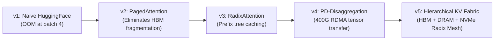

# Deep Explainability Guide: Enterprise LLM Gateway & Distributed KV-Cache Serving

> **Companion Links**:
> - 🧭 Chapter Hub: [`README.md`](README.md)
> - 📐 Architectural Blueprint: [`01-Architectural-Blueprint.md`](01-Architectural-Blueprint.md)
> - 🎙️ Interactive Interview Playbook: [`02-Interactive-Interview-Playbook.md`](02-Interactive-Interview-Playbook.md)
> - 🧪 Production Python Engine: [`kv_cache_gateway_engine.py`](kv_cache_gateway_engine.py)

---

## 1. First-Principles Mental Model & Physical Analogy

To architect hyperscale LLM serving infrastructure (supporting 100M+ tokens/day across models like Llama-3-70B or DeepSeek-V3), you cannot treat GPU inference as a generic black-box microservice. You must ground your design in the **physical silicon reality of modern tensor accelerators (NVIDIA H100 / B200)**.

```
                  THE TWO SILICON PHASES OF LLM INFERENCE
                  
  [ Phase 1: Prefill (Prompt Processing) ]     [ Phase 2: Decode (Token Generation) ]
  • Compute-Bound (Matrix-Matrix GEMM)          • Memory-Bandwidth Bound (Matrix-Vector GEMV)
  • Processes 4,000 tokens concurrently         • Generates 1 token per step sequentially
  • GPU Tensor Cores at 95% utilization         • GPU Tensor Cores at 3% utilization!
  • HBM Memory Bandwidth at 30%                 • HBM Memory Bandwidth at 100% SATURATED!
  
  ┌────────────────────────────────────────┐   ┌────────────────────────────────────────┐
  │      OVEN ROOM (Prefill GPUs)          │   │      FROSTING ROOM (Decode GPUs)       │
  │ Bakes the entire cake base at once     │   │ Carefully pipes 1 drop of frosting/sec │
  └───────────────────┬────────────────────┘   └───────────────────▲────────────────────┘
                      │                                            │
                      └─────────────[ 400G RoCEv2 RDMA ]───────────┘
                           Transfers Pre-baked KV-Cache Tensor 
                           in < 25ms via GPUDirect RDMA!
```

### 1.1 The Real-World Analogy: The Gourmet Bakery (Oven vs. Piping)
Imagine a high-end commercial bakery that produces thousands of custom wedding cakes:
- **Phase 1: The Oven Room (Prefill)**: The bakers mix 50 kilograms of batter and bake 10 massive cake layers in huge, roaring ovens. The ovens run at 100% heat capacity for 45 minutes. This is **compute-bound**: the bottleneck is thermal energy (GPU Tensor Core arithmetic throughput).
- **Phase 2: The Frosting Room (Decode)**: Once the cake base is baked, a pastry artist decorates it by carefully squeezing one microscopic bead of sugar frosting onto the cake every second. The giant ovens are completely useless here; the decorator only needs a delicate piping bag and steady hands. This is **memory-bandwidth bound**: the bottleneck is how fast the artist can read the cake's existing shape and reach for the next sugar droplet (GPU HBM3 memory bus bandwidth).
- **The Monolithic Collocation Disaster**: In legacy LLM serving (vLLM v0.4, naive HuggingFace), the bakery forces the cake decorator to stand inside the roaring 400-degree oven! Whenever a new customer walks into the bakery and orders a giant cake, the decorator is forced to stop frosting mid-stroke, pull out mixing bowls, and fire up the oven. Every ongoing customer experiences a jarring 5-second pause in their conversation (**Inter-Token Latency spike**).
- **The Disaggregated Solution (PD Disaggregation)**: We physically separate the bakery into two specialized buildings:
  1. The **Prefill Cluster (Ovens)**: Packed with maximum-compute GPUs optimized for massive parallel matrix multiplications (GEMM).
  2. The **Decode Cluster (Piping)**: Optimized for maximum memory bandwidth and high batch concurrency (GEMV).
  3. A high-speed motorized pneumatic rail (**400G RoCEv2 RDMA network**) transports the pre-baked cake base (KV-cache tensor) directly from the oven to the decorator in 20 milliseconds!

### 1.2 Why This Mental Model Prevents Design Mistakes
Understanding the physical split between GEMM and GEMV prevents fatal design choices:
1. **The TCP Serialization Tax**: A 32,000-token prompt on a 70B parameter model produces over $10\text{ GB}$ of intermediate Key-Value activation tensors. If you attempt to transfer this tensor across nodes over standard Linux TCP sockets, the CPU must serialize billions of floating-point numbers into user-space buffers, traverse the Linux TCP/IP network stack, and copy them back into the receiving GPU. **CPU serialization latency alone takes 1,200 ms**, completely wiping out any latency advantage. You must use **GPUDirect RDMA (Remote Direct Memory Access)** to stream bytes directly from GPU HBM to remote GPU HBM with zero CPU involvement.
2. **The Inter-Token Latency (ITL) SLA**: Human speech and reading occurs at 4 to 8 tokens per second (125 - 250 ms per token). Users immediately perceive any pause longer than $200\text{ ms}$ as a stuttering, broken experience. When you collocate prefill and decode on the same GPU, a sudden burst of long prompts will pause ongoing decode streams for 2,000 to 4,000 ms. Disaggregation is the **only physical architecture that provides deterministic $< 30\text{ ms}$ Inter-Token Latency**.

---

## 2. Technology Showdown Matrix ("Why X and NOT Y?")

```
┌──────────────────────────────────────────────────────────────────────────────────────────────────┐
│                                 TECHNOLOGY SHOWDOWN SCORECARD                                    │
├──────────────────────────┬──────────────────────────────┬────────────────────────────────────────┤
│ Serving Paradigm         │ Core Strength                │ Fatal Flaw for Enterprise Scale        │
├──────────────────────────┼──────────────────────────────┼────────────────────────────────────────┤
│ Monolithic Collocated    │ Simple single-node setup     │ ITL jitter spikes > 400% under load    │
│ CPU / NVMe KV Offloading │ Massive capacity (Terabytes) │ PCIe Gen5 bandwidth bottleneck (64GB/s)│
│ Static Prefix Caching    │ Reuses system prompts        │ Fragile; no cross-node cache sharing   │
│ PD-Disaggregation (SOTA) │ Deterministic ITL & high HBM │ Requires 400G RoCEv2 RDMA network mesh │
└──────────────────────────┴──────────────────────────────┴────────────────────────────────────────┘
```

### Detailed Multi-Dimensional Showdown

| Evaluation Dimension | Monolithic Collocated (vLLM / TGI) | Prefill-Decode Disaggregation (Mooncake / Splitwise) | CPU / Host RAM Offloading | Local NVMe SSD Offloading |
|:---|:---|:---|:---|:---|
| **Inter-Token Latency (ITL) P99** | $150 - 850\text{ ms}$ (Extreme prefill interference) | **$18 - 25\text{ ms}$ (Completely isolated decode)**| $250 - 1,200\text{ ms}$ (PCIe transfer stalls) | $> 3,000\text{ ms}$ (Flash random read stalls) |
| **Time-To-First-Token (TTFT)**| Variable ($500 - 3,000\text{ ms}$) | **Optimized ($< 200\text{ ms}$ on chunked prefill)**| Slow (Host-to-Device transfer) | Very slow (Disk-to-Host-to-GPU) |
| **GPU HBM Utilization** | Poor (HBM fragmented between prefill & decode)| **Optimal ($> 90\%$ capacity dedicated to decode)**| Moderate | Moderate |
| **KV-Cache Transfer Fabric** | Intra-node NVLink only ($900\text{ GB/s}$) | **400G / 800G RoCEv2 GPUDirect RDMA** | PCIe Gen5 x16 bus ($64\text{ GB/s}$) | PCIe NVMe Controller ($7\text{ GB/s}$) |
| **Prefix Cache Hit Rate** | $20 - 35\%$ (Node-local LRU only) | **$> 70\%$ (Global Prefix-Aware Radix Router)** | Moderate | High (Unlimited disk capacity) |
| **Hardware Requirements** | Standard cloud GPU instances | High-bandwidth RoCEv2/InfiniBand network fabric | Large DDR5 host memory | Enterprise U.2 Gen5 NVMe drives |
| **Operational Complexity**| Low (Single container per GPU node) | High (Separate scheduler, gateway, prefill/decode)| Moderate | High (I/O scheduler tuning) |
| **ARCHITECTURAL VERDICT** | **REJECTED for Tier-1 Enterprise SLAs** | **SOTA STANDARD for Hyperscale AI Serving** | **TIER 2: Warm-Tier Fallback Storage** | **TIER 3: Cold-Tier Archival Storage** |

### The Staff-Level Technology Defense
- **Why NOT Collocated Serving?** In collocated serving, when a batch of 8 decoding requests is midway through generating tokens, an incoming request with an 8,000-token prompt arrives. The GPU scheduler has two bad choices:
  1. *Eager Prefill*: Stop all 8 decoding requests and dedicate all GPU streaming multiprocessors to prefilling the 8,000 tokens. Result: ITL spikes from 20ms to 800ms, breaching user SLA.
  2. *Chunked Prefill*: Slice the 8,000-token prompt into chunks of 512 tokens and interleave them with decode steps. Result: Reduces ITL spikes, but now the new user's Time-To-First-Token (TTFT) degrades by $400\%$, and Tensor Core compute efficiency plummets because small GEMMs fail to saturate GPU execution pipelines.
- **The Disaggregated Breakthrough**: By separating Prefill nodes from Decode nodes, Prefill GPUs run massive, efficient GEMMs at 95% compute utilization, while Decode GPUs run memory-bandwidth saturated GEMVs with zero interruptions.

---

## 3. Mathematical Foundations & Sizing Intuitions

### 3.1 The KV-Cache Memory Equation (Grouped-Query Attention)

In modern transformer models (e.g. Llama-3-70B, DeepSeek-V3), **Grouped-Query Attention (GQA)** is used to dramatically reduce the size of the KV-cache compared to Multi-Head Attention (MHA).

$$\text{KV-Cache Size per Token} = 2 \times (\text{Precision Bytes}) \times n_{\text{layers}} \times n_{\text{kv\_heads}} \times d_{\text{head}}$$

Where:
- The leading factor of $2$ accounts for both **Keys ($K$)** and **Values ($V$)**.
- $\text{Precision Bytes}$: 2 bytes for FP16/BF16; 1 byte for FP8; 0.5 bytes for INT4.
- $n_{\text{layers}}$: Number of transformer layers.
- $n_{\text{kv\_heads}}$: Number of Key/Value attention heads (in GQA, $n_{\text{kv\_heads}} \ll n_{\text{query\_heads}}$).
- $d_{\text{head}}$: Dimension of each attention head ($d_{\text{model}} / n_{\text{query\_heads}}$).

#### Detailed Calculation: Llama-3-70B (FP16 vs. FP8)
- $n_{\text{layers}} = 80$
- $n_{\text{query\_heads}} = 64$
- $n_{\text{kv\_heads}} = 8$ (8:1 GQA ratio)
- $d_{\text{head}} = 128$

##### In Standard FP16 (2 Bytes):
$$\text{Bytes per Token} = 2 \times 2 \times 80 \times 8 \times 128 = 327,680\text{ bytes} \approx \mathbf{320\text{ KB per token}}$$
- A standard multi-turn agent prompt of **$8,192\text{ tokens}$** requires:
  $$8,192 \times 320\text{ KB} \approx \mathbf{2.56\text{ GB of HBM}}$$.
- A long-context document analysis of **$32,768\text{ tokens}$** requires:
  $$32,768 \times 320\text{ KB} \approx \mathbf{10.24\text{ GB of HBM}}$$.

##### In Quantized FP8 (1 Byte):
$$\text{Bytes per Token} = 2 \times 1 \times 80 \times 8 \times 128 = 163,840\text{ bytes} \approx \mathbf{160\text{ KB per token}}$$
- FP8 cuts the memory footprint by **$50\%$**, doubling the concurrent batch size supportable within an 80 GB H100 GPU!

---

### 3.2 400G RoCEv2 RDMA Transfer Bandwidth & Latency Math

In a disaggregated architecture, when a Prefill node finishes processing an 8,192-token prompt, it must transfer the resulting $2.56\text{ GB}$ KV-cache tensor to a Decode node.

- Network Fabric: $400\text{ Gbps}$ RoCEv2 (Remote Direct Memory Access over Converged Ethernet).
- Raw Network Bandwidth in Bytes:
  $$\text{Throughput} = \frac{400 \times 10^9\text{ bits/sec}}{8\text{ bits/byte}} = 50.0\times 10^9\text{ bytes/sec} = 50.0\text{ GB/sec}$$
- Accounting for $92\%$ effective Ethernet framing and RoCEv2 packet efficiency:
  $$\text{Effective Throughput} \approx 46.0\text{ GB/sec}$$

#### Wire Transfer Latency:
$$\text{Transfer Latency} = \frac{2.56\text{ GB}}{46.0\text{ GB/sec}} \approx \mathbf{0.0556\text{ seconds}} = \mathbf{55.6\text{ milliseconds}}$$

- Because the transfer executes via **GPUDirect RDMA**, the transfer is entirely asynchronous and non-blocking:
  1. The prefill GPU writes tensor buffers directly to the local Mellanox ConnectX-7 NIC memory.
  2. The NIC transmits packets across the leaf-spine switch fabric with zero CPU interrupts.
  3. The decode node's NIC writes packets directly into the decode GPU's HBM memory address space.
  4. The decode GPU can begin token generation in $< 60\text{ ms}$!

---

## 4. The Evolutionary Journey: From Naive to Hyperscale ("Zero-to-Hero")



### v1: Naive HuggingFace / PyTorch Pipeline
- **Design**: Pre-allocates a contiguous tensor for `max_context_length` (e.g. 8,192 tokens) for every concurrent sequence.
- **Where it breaks**:
  - Severe **Memory Fragmentation**: If a user's prompt is only 200 tokens, the remaining 7,992 token slots in the tensor sit completely empty in GPU RAM.
  - An 80 GB GPU runs out of memory (OOM) with just 4 to 6 concurrent requests, achieving pathetic hardware utilization.

### v2: PagedAttention Architecture (vLLM)
- **Breakthrough**: Inspired by virtual memory and paging in operating systems.
- **Mechanism**: Divides the KV-cache into fixed-size **Virtual Blocks** (typically 16 or 32 tokens per block).
- **Impact**: Physical blocks in GPU HBM are allocated dynamically as tokens are generated. Memory waste drops from $60\%$ to $< 4\%$, increasing throughput by $3\times$.
- **Where it still breaks**: Prefill and decode are still collocated on the same physical SMs (Streaming Multiprocessors), causing severe ITL jitter when long prompts enter the batch.

### v3: RadixTree Prefix Caching (SGLang)
- **Breakthrough**: Realizes that enterprise LLM traffic contains massive prefix overlap (e.g., 2,000-token system prompts, few-shot examples, API tool definitions).
- **Mechanism**: Organizes cached KV blocks into an in-memory **Radix Tree** (Patricia Trie).
- **Impact**: When a user asks a follow-up question, the model reuses the existing KV blocks for the prompt prefix without re-running prefill computation.
- **Where it still breaks**: Prefix caches are strictly local to a single GPU node. If a user's next request is routed to a different GPU pod, the prefix cache misses completely.

### v4: Disaggregated Prefill-Decode (Mooncake / Splitwise)
- **Breakthrough**: Physically splits the cluster into dedicated Prefill nodes and Decode nodes.
- **Mechanism**: Prefill nodes execute prompt attention at maximum throughput, then ship the KV-cache to Decode nodes over 400G RoCEv2 RDMA.
- **Impact**: Decouples TTFT from ITL. Decode nodes achieve completely stable, jitter-free 20ms token emission.

### v5: Hierarchical Multi-Tier KV-Cache Fabric (Production SOTA)
- **Architecture**: Treats KV-cache not as ephemeral VRAM, but as a **distributed storage tier**:
  - **Tier 1 (GPU HBM3)**: Active decoding blocks ($3.35\text{ TB/s}$ memory bandwidth).
  - **Tier 2 (Host DDR5 DRAM)**: Warm cache staging ($300\text{ GB/s}$ bandwidth over PCIe Gen5).
  - **Tier 3 (Local NVMe SSDs)**: Cold persistent cache ($7\text{ GB/s}$ via `io_uring`).
  - **Prefix-Aware Radix Gateway**: Evaluates Longest Common Prefix (LCP) across the global cluster and routes requests to the exact worker containing the warm KV blocks, achieving $> 75\%$ global cache hit rates.

---

## 5. Micro-Mechanics & Hardware / Kernel Internals

```
┌────────────────────────────────────────────────────────────────────────────────────────┐
│                        GPUDIRECT RDMA (GDR) DATA PATH                                  │
├────────────────────────────────────────────────────────────────────────────────────────┤
│ NAIVE TCP PATH (High Overhead):                                                        │
│ GPU HBM ──► Host DRAM (Copy 1) ──► Kernel Socket (Copy 2) ──► NIC ──► Network         │
│ (Burns CPU cycles, incurs context switches, and caps at ~12 GB/s)                      │
├────────────────────────────────────────────────────────────────────────────────────────┤
│ GPUDIRECT RDMA PATH (Zero-Copy Kernel Bypass):                                         │
│ GPU HBM ────────────[ PCIe Gen5 / NVLink Switch ]───────────► Mellanox NIC ──► Network │
│ (Zero CPU involvement, Zero Host DRAM copies, Sustains 46 GB/s wire speed!)            │
└────────────────────────────────────────────────────────────────────────────────────────┘
```

### 5.1 GPUDirect RDMA (GDR) Kernel Bypass
To transfer a 2.5 GB KV tensor in 55 milliseconds, standard Linux socket abstractions must be bypassed entirely:
- **NVIDIA `nvidia-peermem` Kernel Driver**: Binds the NVIDIA GPU unified virtual memory address space directly to the Mellanox OFED InfiniBand/RoCE core subsystem.
- **Zero-Copy DMA Transfer**: The remote NIC performs direct PCI Express Direct Memory Access (DMA) reads and writes against the GPU's High Bandwidth Memory (HBM) without involving host CPU cores or allocating intermediate buffers in host system RAM.

### 5.2 Lossless Ethernet via RoCEv2, PFC, and ECN
Standard TCP relies on packet drops to detect network congestion. In contrast, RoCEv2 operates over **Lossless Ethernet**:
1. **Priority Flow Control (PFC, IEEE 802.1Qbb)**:
   - Divides network traffic into 8 priority classes.
   - When a switch input port's queue depth exceeds a configured high-watermark threshold, it transmits an Ethernet **PFC PAUSE frame** upstream to the sender.
   - The sender halts transmission for that specific priority queue while other network traffic continues unaffected.
2. **Explicit Congestion Notification (ECN, RFC 3168)**:
   - When switch queues begin filling up, the switch marks the `CE` (Congestion Experienced) bits in the IP header instead of dropping packets.
   - The receiver generates a **CNP (Congestion Notification Packet)** back to the sending NIC.
   - The sending NIC applies the **DCQCN (Data Center Quantized Congestion Notification)** algorithm to smoothly throttle its transmission rate, preventing buffer overflow without triggering destructive PFC pause storms.

---

## 6. Production Incident Runbook & Chaos Scenarios

### 6.1 The 03:00 AM P1 Outage: "RoCEv2 PFC Deadlock & Pause Frame Storm"

#### The Trigger
At 03:41 AM UTC, a massive influx of concurrent long-context document analysis requests triggers hundreds of simultaneous 400G KV-cache RDMA transfers across the leaf-spine fabric. Switch buffers saturate, causing a bidirectional loop of PFC PAUSE frames that locks up the entire network fabric (**PFC Deadlock**). Decode GPUs starve for tokens; API Gateway throws HTTP 504 Gateway Timeouts.

```
[ PagerDuty Alert: CRITICAL ] 
- Service: LLM Serving Fabric (Cluster 04)
- Metric: RDMA_PFC_Pause_Duration > 500ms
- Impact: Time-To-First-Token (TTFT) P99 > 15,000ms; Decode GPU Under-utilization
```

#### Step-by-Step Triage & Mitigation Sequence

##### Step 1: Detect PFC Deadlock via Mellanox Switch Telemetry
The on-call engineer checks switch pause counters and queue congestion:
```bash
# Check instantaneous PFC pause frame generation across leaf interfaces
ethtool -S eth0 | grep -E "pfc_requests_rx|pfc_requests_tx|rx_pause|tx_pause"

# Output reveals massive pause storm:
# tx_pfc_requests_priority_3: 49821034 (Continuous pause frame storm!)
# rx_pfc_requests_priority_3: 48912801
```

##### Step 2: Trigger Emergency Dynamic Chunking & Flow Throttling
To break the buffer deadlock, execute an immediate control-plane configuration override:
```bash
# Force the Prefill Scheduler to throttle concurrent RDMA streams
curl -X POST https://llm-gateway.internal/v1/admin/rdma/throttle \
  -H "Authorization: Bearer $ONCALL_TOKEN" \
  -d '{
    "max_concurrent_rdma_transfers_per_node": 2,
    "enable_intermediate_host_dram_staging": true,
    "chunked_prefill_token_budget": 512
  }'
```

##### Step 3: Enable PFC Deadlock Watchdog (Deadlock Recovery)
On the leaf switches, ensure the hardware watchdog terminates persistent pause conditions:
```bash
# Switch CLI (SONiC / Cumulus Linux)
# Drop pause condition if a queue has been paused for more than 200ms
config pfc watchdog off-time 200 on-time 100 action drop
```

##### Step 4: Verify Traffic Recovery & Normalization
- Monitor `rdma_transmission_bandwidth_gbps` in Grafana; verify it stabilizes at $\approx 35\text{ GB/sec}$ without pause storms.
- Validate that TTFT drops back to $< 350\text{ ms}$.
- Verify that Decode GPU utilization rises from 12% to 88%.

---

## 7. Interactive Socratic Pauses & Self-Quiz

> 🧠 **Pause & Ponder #1**: *Why does prefix caching achieve almost 0% hit rate in multi-tenant SaaS environments unless the gateway enforces strict Prefix-Aware Affinity Routing?*
> 
> <details>
> <summary><b>Click for Staff-Level Solution</b></summary>
> 
> If you deploy a cluster of 32 decode GPU worker nodes behind a standard round-robin or least-connections load balancer:
> - Customer A sends Request 1 with a 4,000-token system prompt $\to$ Routed to Node 3. Node 3 computes and caches the KV blocks.
> - 5 seconds later, Customer A sends Request 2 with the exact same system prompt $\to$ Round-robin routes it to Node 4!
> - Node 4 does not have the KV blocks in its local HBM, causing a **cache miss**. Node 4 is forced to re-run the entire 4,000-token prefill from scratch.
> - Across 32 nodes, the probability of hitting the same node randomly is only $\frac{1}{32} \approx 3.1\%$!
> 
> **Staff Solution**: The API Gateway must parse incoming tokens against a global **Radix Tree of active caches** and route requests to the node holding the Longest Common Prefix (LCP).
> </details>

---

> 🧠 **Pause & Ponder #2**: *Why is an FP8 quantized KV-cache (1 byte/token) not just 2x cheaper in memory, but actually up to 2x faster in decoding throughput than FP16 (2 bytes/token), even on the exact same GPU?*
> 
> <details>
> <summary><b>Click for Staff-Level Solution</b></summary>
> 
> The Decode phase of LLM inference is strictly **Memory-Bandwidth Bound** (GEMV kernel). The GPU Tensor Cores are starved for data, waiting for the memory controller to stream Key and Value tensors from HBM3 into on-chip SRAM registers for every single generated token.
> - In FP16, streaming 8,192 tokens of history requires loading $2.56\text{ GB}$ over the memory bus per step.
> - In FP8, streaming the same 8,192 tokens requires loading only $1.28\text{ GB}$ over the memory bus.
> - Because memory bandwidth is the single physical bottleneck during decoding, halving the byte volume halves the memory fetch latency, directly **doubling the token generation speed (tokens/sec)**!
> </details>

---

## 8. Summary Checklist for Staff/Principal Interviews

When presenting Chapter 17 in an interview, ensure you hit these 6 non-negotiable points:
- [ ] Explain the fundamental physical split between **Compute-Bound Prefill (GEMM)** and **Memory-Bandwidth Bound Decode (GEMV)**.
- [ ] Calculate the exact KV-cache size using the GQA formula ($2 \times \text{bytes} \times n_{\text{layers}} \times n_{\text{kv\_heads}} \times d_{\text{head}}$).
- [ ] Propose **Prefill-Decode (PD) Disaggregation** to eliminate Inter-Token Latency (ITL) jitter spikes.
- [ ] Justify **400G RoCEv2 GPUDirect RDMA** to bypass CPU serialization taxes during cross-node KV-cache streaming.
- [ ] Detail the **RadixTree Prefix-Aware Routing Gateway** to drive cache hit ratios from $3\%$ to $> 70\%$.
- [ ] Walk through the **PFC Deadlock & Pause Frame Storm** chaos scenario with DCQCN and ECN tuning.
