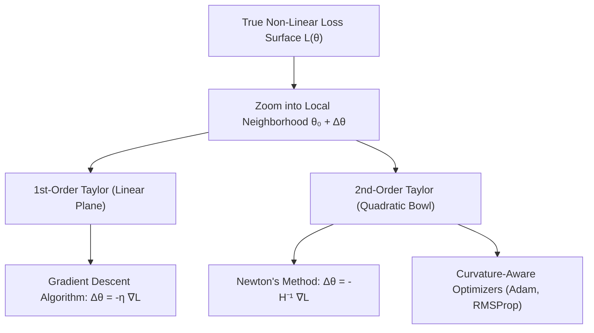
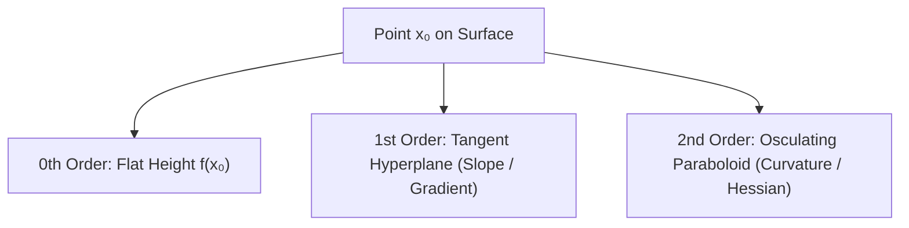

# Chapter 2.1: Differential Calculus Foundations & Taylor Expansions

---

## Pedagogical Navigation
- **Module 02:** Multivariable Calculus & Automatic Differentiation
- **Topic:** Differential Calculus Foundations & Taylor Expansions
- **Next Chapter:** [Chapter 2.2: Directional Derivatives & Gradients](./02_directional_derivatives_and_gradients.md)
- **Companion Code:** [01_differential_calculus_and_taylor.py](./code/01_differential_calculus_and_taylor.py)
- **Tracker & Index:** [Course Index & Progress Tracker](../00_index_and_tracker.md)

---

## Part 1: Intuition & 101 Motivation

### Why Do We Need Multivariable Calculus in Deep Learning?
In single-variable calculus, you studied functions $f: \mathbb{R} \to \mathbb{R}$ that take one number in and output one number out (e.g., $f(x) = x^2$).
In deep learning, a modern neural network (like a Transformer with 70 billion parameters) is fundamentally a single mathematical function:
$$\mathcal{L}: \mathbb{R}^P \to \mathbb{R}$$
where:
- $P$ is the total count of tunable parameters (weights and biases), often $P \in [10^6, 10^{11}]$.
- The output $\mathcal{L}(\theta)$ is a single scalar: the **loss** (the error between model predictions and ground-truth reality).

Training a neural network means exploring an unimaginably vast $P$-dimensional landscape to find a parameter configuration $\theta^*$ that makes $\mathcal{L}(\theta^*)$ as small as possible.
Because we cannot visualize an $10^{11}$-dimensional surface, nor can we solve $\nabla \mathcal{L}(\theta) = 0$ in closed form, we must rely on **local approximations**:
> *"If I am standing at my current parameter vector $\theta_0$, what does the landscape look like in an infinitesimally small neighborhood around me?"*

### The Role of Taylor Expansions
Nonlinear loss surfaces are fiercely complex. They feature cliffs, ravines, saddle points, and plateaus.
However, if you zoom in close enough to any smooth point on the surface:
1. **At order zero ($0^{\text{th}}$ order):** The surface is locally a **flat constant** $f(\theta) \approx f(\theta_0)$.
2. **At order one ($1^{\text{st}}$ order):** The surface is locally a **flat tilted hyperplane** (the tangent plane). This gives us **Gradient Descent**: step downhill along the slope of the hyperplane.
3. **At order two ($2^{\text{nd}}$ order):** The surface is locally a **multidimensional parabolic bowl** (a quadratic form). This gives us **Newton-Raphson Optimization**, curvature estimation, adaptive learning rates (like Adam and AdaGrad), and second-order pruning techniques (like Optimal Brain Surgeon).

Differential calculus is the rigorous mathematical machinery that turns non-linear neural networks into locally linear and locally quadratic systems that we know how to optimize efficiently.



---

## Part 2: Rigorous Mathematical Formulation

### 1. Metric Topology of $\mathbb{R}^n$: Open Balls and Limits
Let $x = [x_1, x_2, \dots, x_n]^T \in \mathbb{R}^n$. The standard Euclidean distance between $x$ and $y$ is induced by the $L_2$ norm:
$$\|x - y\|_2 = \sqrt{\sum_{i=1}^n (x_i - y_i)^2}$$

#### Definition 2.1.1: Open Ball
The open ball $B_\epsilon(x_0)$ of radius $\epsilon > 0$ centered at $x_0 \in \mathbb{R}^n$ is defined as:
$$B_\epsilon(x_0) = \left\{ x \in \mathbb{R}^n \;\middle|\; \|x - x_0\|_2 < \epsilon \right\}$$

#### Definition 2.1.2: Limit in $\mathbb{R}^n$
Let $f: D \to \mathbb{R}^m$ be defined on an open set $D \subseteq \mathbb{R}^n$. We say that $\lim_{x \to x_0} f(x) = L$ if and only if:
$$\forall \epsilon > 0, \; \exists \delta > 0 \quad \text{such that} \quad 0 < \|x - x_0\|_2 < \delta \implies \|f(x) - L\|_2 < \epsilon$$

> [!WARNING]
> In $\mathbb{R}^1$, $x$ can approach $x_0$ from only two directions (left and right). In $\mathbb{R}^n$ with $n \ge 2$, $x$ can approach $x_0$ along **uncountably infinitely many paths** (straight lines, parabolas, spirals, polynomials). For the limit to exist, the function must approach the identical value $L$ along **every single possible trajectory**.

#### Definition 2.1.3: Continuity in $\mathbb{R}^n$
A function $f: D \subseteq \mathbb{R}^n \to \mathbb{R}^m$ is **continuous at $x_0 \in D$** if:
$$\lim_{x \to x_0} f(x) = f(x_0)$$

---

### 2. Partial Derivatives vs. The Total Derivative (Differentiability)

#### Definition 2.1.4: Partial Derivative
The partial derivative of a scalar field $f: \mathbb{R}^n \to \mathbb{R}$ with respect to the coordinate $x_i$ at $x_0$ is the 1D rate of change when all other coordinates $x_j$ ($j \neq i$) are held frozen:
$$\frac{\partial f}{\partial x_i}(x_0) = \lim_{h \to 0} \frac{f(x_0 + h e_i) - f(x_0)}{h}$$
where $e_i = [0, \dots, 1, \dots, 0]^T$ is the $i^{\text{th}}$ standard basis vector.

The collection of all $n$ partial derivatives forms the **gradient vector**:
$$\nabla f(x_0) = \begin{bmatrix} \frac{\partial f}{\partial x_1}(x_0) \\ \frac{\partial f}{\partial x_2}(x_0) \\ \vdots \\ \frac{\partial f}{\partial x_n}(x_0) \end{bmatrix} \in \mathbb{R}^{n \times 1}$$

#### The Fundamental Flaw of Partial Derivatives Alone
Does the existence of all partial derivatives $\frac{\partial f}{\partial x_1}, \dots, \frac{\partial f}{\partial x_n}$ guarantee that $f$ is smooth, or even continuous?
**No!** A function can have well-defined partial derivatives in every coordinate direction and yet be wildly discontinuous at that very point (see Part 6, Case C for a proof).

To capture true multidimensional smoothness, we require the **Total Derivative**.

#### Definition 2.1.5: Multivariable Differentiability (Fréchet Differentiability)
A function $f: D \subseteq \mathbb{R}^n \to \mathbb{R}$ is said to be **differentiable at $x_0 \in D$** if there exists a linear transformation (represented by a row vector $L \in \mathbb{R}^{1 \times n}$) such that:
$$\lim_{h \to 0} \frac{|f(x_0 + h) - f(x_0) - L h|}{\|h\|_2} = 0$$
where $h \in \mathbb{R}^n$.

Equivalently, using Little-o notation:
$$f(x_0 + h) = f(x_0) + L h + o(\|h\|_2) \quad \text{as } \|h\| \to 0$$
When this linear map exists, it is unique, and its matrix representation is the transpose of the gradient:
$$L = \nabla f(x_0)^T = \begin{bmatrix} \frac{\partial f}{\partial x_1}(x_0) & \frac{\partial f}{\partial x_2}(x_0) & \dots & \frac{\partial f}{\partial x_n}(x_0) \end{bmatrix}$$
Thus, for a differentiable scalar function:
$$f(x_0 + h) = f(x_0) + \nabla f(x_0)^T h + o(\|h\|_2)$$

#### Theorem 2.1.1: Differentiability Implies Continuity
If $f: \mathbb{R}^n \to \mathbb{R}$ is differentiable at $x_0$, then $f$ is continuous at $x_0$.

##### Formal Proof:
1. By definition of differentiability, for any perturbation vector $h \in \mathbb{R}^n$:
   $$f(x_0 + h) - f(x_0) = \nabla f(x_0)^T h + R(h)$$
   where $\lim_{h \to 0} \frac{|R(h)|}{\|h\|_2} = 0$.
2. Take the absolute value and apply the triangle inequality:
   $$|f(x_0 + h) - f(x_0)| \le |\nabla f(x_0)^T h| + |R(h)|$$
3. By the Cauchy-Schwarz Inequality (from Chapter 1.2):
   $$|\nabla f(x_0)^T h| \le \|\nabla f(x_0)\|_2 \|h\|_2$$
4. Therefore:
   $$|f(x_0 + h) - f(x_0)| \le \|\nabla f(x_0)\|_2 \|h\|_2 + \frac{|R(h)|}{\|h\|_2} \|h\|_2$$
5. Now take the limit as $h \to 0$ (which implies $\|h\|_2 \to 0$):
   $$\lim_{h \to 0} |f(x_0 + h) - f(x_0)| \le \|\nabla f(x_0)\|_2 \cdot 0 + 0 \cdot 0 = 0$$
6. Hence:
   $$\lim_{h \to 0} f(x_0 + h) = f(x_0)$$
   which satisfies Definition 2.1.3. The function is continuous at $x_0$. $\blacksquare$

---

### 3. Taylor's Theorem in 1D ($f: \mathbb{R} \to \mathbb{R}$)

#### Theorem 2.1.2: 1D Taylor's Theorem with Remainder
Let $f: (a, b) \to \mathbb{R}$ be $k+1$ times continuously differentiable on an open interval containing $x_0$ and $x_0 + h$. Then:
$$f(x_0 + h) = f(x_0) + f'(x_0) h + \frac{f''(x_0)}{2!} h^2 + \dots + \frac{f^{(k)}(x_0)}{k!} h^k + R_k(h)$$
where the remainder $R_k(h)$ can be expressed in:
- **Peano form (Asymptotic):** $R_k(h) = o(h^k)$ as $h \to 0$.
- **Lagrange form (Mean-Value form):** $R_k(h) = \frac{f^{(k+1)}(\xi)}{(k+1)!} h^{k+1}$ for some real number $\xi$ strictly between $x_0$ and $x_0 + h$.

---

### 4. Multivariate Taylor's Theorem ($f: \mathbb{R}^n \to \mathbb{R}$)

How do we extend Taylor expansions to functions of $n$ variables?
The profound insight of multivariable calculus is to **reduce the multivariate problem to a single-variable problem** along a straight line connecting $x_0$ and $x_0 + h$.

#### Theorem 2.1.3: Multivariate Taylor's Theorem
Let $f: D \subseteq \mathbb{R}^n \to \mathbb{R}$ be twice continuously differentiable ($C^2$) on an open convex set containing $x_0$ and $x_0 + h$. Then:
$$f(x_0 + h) = f(x_0) + \nabla f(x_0)^T h + \frac{1}{2} h^T H(x_0) h + R_2(h)$$
where:
- $\nabla f(x_0) \in \mathbb{R}^n$ is the **gradient vector** evaluated at $x_0$.
- $H(x_0) \in \mathbb{R}^{n \times n}$ is the **Hessian matrix** of second-order partial derivatives:
  $$H_{ij}(x_0) = \frac{\partial^2 f}{\partial x_i \partial x_j}(x_0)$$
- $R_2(h)$ is the remainder satisfying $\lim_{h \to 0} \frac{R_2(h)}{\|h\|_2^2} = 0$, meaning $R_2(h) \in \mathcal{O}(\|h\|_2^3)$.

##### Step-by-Step Rigorous Derivation:
1. Define an auxiliary single-variable function $g: [0, 1] \to \mathbb{R}$ parameterizing the line segment from $x_0$ to $x_0 + h$:
   $$g(t) = f(x_0 + t h), \quad t \in [0, 1]$$
   Notice that $g(0) = f(x_0)$ and $g(1) = f(x_0 + h)$.
2. By the 1D Taylor expansion of $g(t)$ around $t = 0$ evaluated at $t = 1$:
   $$g(1) = g(0) + g'(0) \cdot (1 - 0) + \frac{1}{2} g''(0) \cdot (1 - 0)^2 + \mathcal{O}(1^3)$$
3. Compute $g'(t)$ using the multivariable chain rule:
   Let $u(t) = x_0 + t h = [x_{0,1} + t h_1, \dots, x_{0,n} + t h_n]^T$.
   $$g'(t) = \frac{d}{dt} f(u(t)) = \sum_{i=1}^n \frac{\partial f}{\partial u_i}(u(t)) \frac{du_i}{dt} = \sum_{i=1}^n \frac{\partial f}{\partial u_i}(u(t)) h_i = \nabla f(u(t))^T h$$
   Setting $t = 0$:
   $$g'(0) = \nabla f(x_0)^T h$$
4. Compute $g''(t)$ by differentiating $g'(t)$ with respect to $t$:
   $$g''(t) = \frac{d}{dt} \left[ \sum_{i=1}^n \frac{\partial f}{\partial u_i}(u(t)) h_i \right] = \sum_{i=1}^n \left( \frac{d}{dt} \frac{\partial f}{\partial u_i}(u(t)) \right) h_i$$
   Applying the chain rule to each partial derivative:
   $$\frac{d}{dt} \frac{\partial f}{\partial u_i}(u(t)) = \sum_{j=1}^n \frac{\partial^2 f}{\partial u_j \partial u_i}(u(t)) \frac{du_j}{dt} = \sum_{j=1}^n \frac{\partial^2 f}{\partial u_j \partial u_i}(u(t)) h_j$$
   Substitute this back into $g''(t)$:
   $$g''(t) = \sum_{i=1}^n \sum_{j=1}^n h_i \frac{\partial^2 f}{\partial u_i \partial u_j}(u(t)) h_j = h^T H(u(t)) h$$
   Setting $t = 0$:
   $$g''(0) = h^T H(x_0) h$$
5. Substitute $g(0)$, $g'(0)$, and $g''(0)$ back into the 1D expansion:
   $$f(x_0 + h) = f(x_0) + \nabla f(x_0)^T h + \frac{1}{2} h^T H(x_0) h + R_2(h)$$
   This proves the multivariate second-order Taylor expansion formula. $\blacksquare$

---

#### Theorem 2.1.4: Multivariable Mean Value Theorem (MVT in $\mathbb{R}^n$)
Let $f: D \subseteq \mathbb{R}^n \to \mathbb{R}$ be continuously differentiable on an open convex set $D$.
For any two points $x, y \in D$, there exists a point $c$ on the line segment connecting $x$ and $y$ (i.e., $c = x + t^*(y - x)$ for some $t^* \in (0, 1)$) such that:
$$f(y) - f(x) = \nabla f(c)^T (y - x)$$

##### Rigorous First-Principles Derivation:
1. Define the parameterized scalar function $g: [0, 1] \to \mathbb{R}$ by:
   $$g(t) = f(x + t(y - x))$$
   Note that $g(0) = f(x)$ and $g(1) = f(y)$.
2. Since $f$ is continuously differentiable on $D$ and $D$ is convex, $g(t)$ is continuous on $[0, 1]$ and differentiable on $(0, 1)$.
3. By the single-variable Mean Value Theorem, there exists $t^* \in (0, 1)$ such that:
   $$g(1) - g(0) = g'(t^*) \cdot (1 - 0) = g'(t^*)$$
4. By the multivariable chain rule:
   $$g'(t) = \nabla f(x + t(y - x))^T (y - x)$$
5. Evaluating at $t = t^*$ and defining $c \triangleq x + t^*(y - x)$:
   $$f(y) - f(x) = \nabla f(c)^T (y - x) \quad \blacksquare$$

---

#### Theorem 2.1.5: Multivariate Taylor Lagrange Remainder & Curvature Bound
For a $C^2$ function $f: D \to \mathbb{R}$, the first-order Taylor expansion with exact Lagrange remainder is:
$$f(x_0 + h) = f(x_0) + \nabla f(x_0)^T h + R_1(h), \quad \text{where } R_1(h) = \frac{1}{2} h^T H(x_0 + \xi h) h$$
for some $\xi \in (0, 1)$.

##### Curvature Bound Corollary:
If the Hessian is bounded on the segment $\|H(z)\|_2 \le M$ for all $z \in [x_0, x_0 + h]$:
$$|R_1(h)| = \frac{1}{2} |h^T H(x_0 + \xi h) h| \le \frac{1}{2} \|H(x_0 + \xi h)\|_2 \|h\|_2^2 \le \frac{M}{2} \|h\|_2^2$$
*Deep Learning Implication:* If the loss surface is $M$-Lipschitz smooth (i.e. $\|H\|_2 \le M$), then the Descent Lemma guarantees:
$$\mathcal{L}(\theta - \eta \nabla \mathcal{L}) \le \mathcal{L}(\theta) - \eta \left(1 - \frac{\eta M}{2}\right) \|\nabla \mathcal{L}\|_2^2$$
Choosing $\eta = \frac{1}{M}$ guarantees maximal guaranteed loss decrease of $\frac{1}{2M} \|\nabla \mathcal{L}\|_2^2$ per step!

---

## Part 3: Geometric, Algebraic & Physical Interpretation

### 1. Geometric View: Tangent Hyperplane & Osculating Paraboloid
Consider the graph of $z = f(x_1, x_2)$ in $\mathbb{R}^3$:
- **$0^{\text{th}}$-Order Approximation:** A horizontal flat plane passing through $(x_0, y_0, f(x_0, y_0))$. It ignores all slope.
- **$1^{\text{st}}$-Order Approximation (Tangent Plane):**
  $$z = f(x_0) + \frac{\partial f}{\partial x_1}(x_0)(x_1 - x_{0,1}) + \frac{\partial f}{\partial x_2}(x_0)(x_2 - x_{0,2})$$
  This plane shares the exact same height and same tilt as the true surface at $x_0$. Any deviation in $x$ causes a purely linear change in $z$.
- **$2^{\text{nd}}$-Order Approximation (Osculating Paraboloid):**
  $$z = f(x_0) + \nabla f(x_0)^T h + \frac{1}{2} h^T H(x_0) h$$
  This quadric surface shares the height, tilt, AND local curvature (bending) of the surface. If $H(x_0) \succ 0$ (positive definite), it forms a local bowl (elliptic paraboloid). If $H(x_0)$ has mixed signs, it forms a saddle (hyperbolic paraboloid).



### 2. Algebraic View: Inner Products and Quadratic Forms
Notice how the Taylor series builds up using the fundamental linear algebraic structures we mastered in Module 1:
- **Order 0:** Scalar $f(x_0) \in \mathbb{R}$.
- **Order 1:** Euclidean inner product $\langle \nabla f(x_0), h \rangle = \nabla f(x_0)^T h$ (Chapter 1.2).
- **Order 2:** Symmetric quadratic form $h^T H(x_0) h = \sum_{i,j} H_{ij} h_i h_j$ (Chapter 1.8).

By Schwarz's Theorem (Clairaut's Theorem), if the second partial derivatives are continuous, the Hessian is always symmetric:
$$\frac{\partial^2 f}{\partial x_i \partial x_j} = \frac{\partial^2 f}{\partial x_j \partial x_i} \implies H(x_0) = H(x_0)^T$$
Because $H(x_0)$ is symmetric, by the Spectral Theorem (Chapter 1.6), it possesses an orthonormal basis of eigenvectors:
$$H(x_0) = Q \Lambda Q^T = \sum_{i=1}^n \lambda_i q_i q_i^T$$
This reveals that along each principal curvature axis $q_i$, the second-order Taylor expansion bends like a 1D parabola with steepness $\lambda_i$!

---

## Part 4: Real-World Analogy

### The Alpine Hiker and the Dense Fog
Imagine you are hiking on an unfamiliar, rugged mountain range at twilight. Suddenly, an impenetrable fog rolls in, reducing your visibility to barely the reach of your arm. Your goal is to reach the lowest valley floor (the minimum loss).

1. **$0^{\text{th}}$-Order Information (Altimeter only):**
   You check your smartwatch altimeter. It reads $2{,}500\text{ meters}$. This is $f(x_0)$. Knowing your current elevation tells you where you are, but gives you **zero information** about which way to take your next step.
2. **$1^{\text{st}}$-Order Information (The Incline under your boots):**
   With your boots firmly on the ground, you feel the slope of the rock beneath your feet. You feel that the ground slopes down sharply toward the south-west. This slope vector is the negative gradient $-\nabla f(x_0)$.
   If you take small steps in this direction, you are guaranteed to descend. This is **Gradient Descent**.
3. **$2^{\text{nd}}$-Order Information (The Curvature of the ravine):**
   Suppose you tap the ground with two trekking poles to feel how the slope is changing around you. You discover you are inside a narrow canyon: the walls to your left and right curve steeply upwards (large positive eigenvalue $\lambda_1$), while the floor ahead slopes gently downwards (small positive eigenvalue $\lambda_2$).
   - If you only use 1st-order gradient descent, you will bounce violently between the steep canyon walls!
   - If you use 2nd-order Taylor information, you fit a quadratic model of the canyon, immediately recognize the direction of the ravine floor, and stride smoothly along the valley axis. This is **Newton's Method**.

---

## Part 5: "AI by Hand" (Prof. Tom Yeh Style Visual Grids)

Let us calculate the full 1st-order and 2nd-order Taylor expansions step-by-step using concrete numbers. No steps skipped.

### 1. Problem Setup & Toy Function
Consider the non-linear objective function $f: \mathbb{R}^2 \to \mathbb{R}$:
$$f(x_1, x_2) = 2 x_1^2 + x_1 x_2 + 3 x_2^2 - 4 x_1 - 2 x_2 + 5$$
We choose our operating expansion point:
$$x_0 = \begin{bmatrix} 1 \\ 2 \end{bmatrix}$$
And we apply a finite displacement vector:
$$h = \Delta x = \begin{bmatrix} 0.1 \\ -0.2 \end{bmatrix}$$
Target evaluation point:
$$x_{\text{target}} = x_0 + h = \begin{bmatrix} 1 + 0.1 \\ 2 - 0.2 \end{bmatrix} = \begin{bmatrix} 1.1 \\ 1.8 \end{bmatrix}$$

---

### 2. "What Refers to What" Legend Protocol

| Symbol | Ambient Dimension | Pure Math Role | Deep Learning Meaning | Toy Value in Walkthrough |
| :--- | :--- | :--- | :--- | :--- |
| $x_0$ | $\mathbb{R}^{2 \times 1}$ | Expansion center point | Current weight vector $\theta_t$ before update | $[1, 2]^T$ |
| $h = \Delta x$ | $\mathbb{R}^{2 \times 1}$ | Displacement / perturbation | Weight update step $\Delta \theta = -\eta g_t$ | $[0.1, -0.2]^T$ |
| $x_{\text{target}}$ | $\mathbb{R}^{2 \times 1}$ | Displaced point | Updated weight vector $\theta_{t+1}$ | $[1.1, 1.8]^T$ |
| $f(x)$ | $\mathbb{R}$ | Scalar objective function | Training loss $\mathcal{L}(\theta)$ | Polynomial surface |
| $f(x_0)$ | $\mathbb{R}$ | $0^{\text{th}}$-order Taylor constant | Current loss value $\mathcal{L}(\theta_t)$ | $13.0$ |
| $\nabla f(x_0)$ | $\mathbb{R}^{2 \times 1}$ | Gradient vector at $x_0$ | Steepest ascent vector $\mathbf{g}_t$ | $[2.0, 11.0]^T$ |
| $T_1(h)$ | $\mathbb{R}$ | 1st-order linear Taylor estimate | Linear loss surrogate after update | $11.0$ |
| $H(x_0)$ | $\mathbb{R}^{2 \times 2}$ | Hessian matrix of curvatures | Local curvature matrix | $\begin{bmatrix} 4 & 1 \\ 1 & 6 \end{bmatrix}$ |
| $T_2(h)$ | $\mathbb{R}$ | 2nd-order quadratic Taylor estimate | Quadric loss surrogate | $11.12$ |
| $f(x_0 + h)$ | $\mathbb{R}$ | True analytical function value | True post-update loss $\mathcal{L}(\theta_{t+1})$ | $11.12$ |

---

### 3. Step-by-Step Manual Arithmetic

#### Step 1: Compute 0th-Order Term $f(x_0)$
Substitute $x_1 = 1, x_2 = 2$:
$$f(1, 2) = 2(1)^2 + (1)(2) + 3(2)^2 - 4(1) - 2(2) + 5$$
$$f(1, 2) = 2(1) + 2 + 3(4) - 4 - 4 + 5 = 2 + 2 + 12 - 4 - 4 + 5 = 13.0$$
$$\mathbf{f(x_0) = 13.0}$$

#### Step 2: Compute Analytical Gradient $\nabla f(x)$
Compute the partial derivatives:
$$\frac{\partial f}{\partial x_1} = \frac{\partial}{\partial x_1}\left(2 x_1^2 + x_1 x_2 + 3 x_2^2 - 4 x_1 - 2 x_2 + 5\right) = 4 x_1 + x_2 - 4$$
$$\frac{\partial f}{\partial x_2} = \frac{\partial}{\partial x_2}\left(2 x_1^2 + x_1 x_2 + 3 x_2^2 - 4 x_1 - 2 x_2 + 5\right) = x_1 + 6 x_2 - 2$$
Evaluate at $x_0 = [1, 2]^T$:
$$\frac{\partial f}{\partial x_1}(1, 2) = 4(1) + (2) - 4 = 4 + 2 - 4 = 2.0$$
$$\frac{\partial f}{\partial x_2}(1, 2) = (1) + 6(2) - 2 = 1 + 12 - 2 = 11.0$$
$$\nabla f(x_0) = \begin{bmatrix} 2.0 \\ 11.0 \end{bmatrix}$$

#### Step 3: Compute 1st-Order Taylor Term $\nabla f(x_0)^T h$
$$\nabla f(x_0)^T h = \begin{bmatrix} 2.0 & 11.0 \end{bmatrix} \begin{bmatrix} 0.1 \\ -0.2 \end{bmatrix} = (2.0)(0.1) + (11.0)(-0.2) = 0.2 - 2.2 = -2.0$$
Now compute the 1st-order Taylor prediction $T_1$:
$$T_1(x_0 + h) = f(x_0) + \nabla f(x_0)^T h = 13.0 + (-2.0) = \mathbf{11.0}$$

#### Step 4: Compute Analytical Hessian Matrix $H(x_0)$
Compute all second-order partial derivatives:
$$H_{11} = \frac{\partial^2 f}{\partial x_1^2} = \frac{\partial}{\partial x_1}(4 x_1 + x_2 - 4) = 4$$
$$H_{12} = \frac{\partial^2 f}{\partial x_1 \partial x_2} = \frac{\partial}{\partial x_2}(4 x_1 + x_2 - 4) = 1$$
$$H_{21} = \frac{\partial^2 f}{\partial x_2 \partial x_1} = \frac{\partial}{\partial x_1}(x_1 + 6 x_2 - 2) = 1$$
$$H_{22} = \frac{\partial^2 f}{\partial x_2^2} = \frac{\partial}{\partial x_2}(x_1 + 6 x_2 - 2) = 6$$
The Hessian matrix is:
$$H(x_0) = \begin{bmatrix} 4 & 1 \\ 1 & 6 \end{bmatrix}$$

#### Step 5: Compute 2nd-Order Quadratic Term $\frac{1}{2} h^T H(x_0) h$
First, perform matrix-vector multiplication $H(x_0) h$:
$$H(x_0) h = \begin{bmatrix} 4 & 1 \\ 1 & 6 \end{bmatrix} \begin{bmatrix} 0.1 \\ -0.2 \end{bmatrix} = \begin{bmatrix} 4(0.1) + 1(-0.2) \\ 1(0.1) + 6(-0.2) \end{bmatrix} = \begin{bmatrix} 0.4 - 0.2 \\ 0.1 - 1.2 \end{bmatrix} = \begin{bmatrix} 0.2 \\ -1.1 \end{bmatrix}$$
Second, perform the row-vector dot product $h^T (H h)$:
$$h^T (H h) = \begin{bmatrix} 0.1 & -0.2 \end{bmatrix} \begin{bmatrix} 0.2 \\ -1.1 \end{bmatrix} = (0.1)(0.2) + (-0.2)(-1.1) = 0.02 + 0.22 = 0.24$$
Third, multiply by $\frac{1}{2}$:
$$\frac{1}{2} h^T H(x_0) h = \frac{1}{2}(0.24) = \mathbf{0.12}$$

Now compute the 2nd-order Taylor prediction $T_2$:
$$T_2(x_0 + h) = f(x_0) + \nabla f(x_0)^T h + \frac{1}{2} h^T H(x_0) h = 13.0 - 2.0 + 0.12 = \mathbf{11.12}$$

#### Step 6: Compute Exact True Value $f(1.1, 1.8)$
$$f(1.1, 1.8) = 2(1.1)^2 + (1.1)(1.8) + 3(1.8)^2 - 4(1.1) - 2(1.8) + 5$$
- $2(1.1)^2 = 2(1.21) = 2.42$
- $(1.1)(1.8) = 1.98$
- $3(1.8)^2 = 3(3.24) = 9.72$
- $-4(1.1) = -4.40$
- $-2(1.8) = -3.60$
- Constant $= +5.00$

Summing all components:
$$\text{Sum} = 2.42 + 1.98 + 9.72 - 4.40 - 3.60 + 5.00$$
- $2.42 + 1.98 = 4.40$
- $4.40 + 9.72 = 14.12$
- $14.12 - 4.40 = 9.72$
- $9.72 - 3.60 = 6.12$
- $6.12 + 5.00 = \mathbf{11.12}$

**Comparison of Orders:**
- 0th-order prediction: $T_0 = 13.0$ (Error $= |11.12 - 13.0| = 1.88$)
- 1st-order prediction: $T_1 = 11.0$ (Error $= |11.12 - 11.0| = 0.12$)
- 2nd-order prediction: $T_2 = 11.12$ (Error $= |11.12 - 11.12| = 0.0000$)

**Remarkable Property:** Because $f(x)$ is a quadratic polynomial (degree 2), all 3rd and higher-order partial derivatives are identically zero everywhere. Hence, the 2nd-order Taylor expansion is mathematically exact: $T_2(x_0 + h) \equiv f(x_0 + h)$.

---

### 4. Visual Summary Grid

```
+-----------------------------------------------------------------------------------------------+
|                      PROF. TOM YEH STYLE VISUAL EXPANSION GRID                                |
+-----------------------------------------------------------------------------------------------+
| Expansion Center x₀: [1.0, 2.0]ᵀ           | Perturbation h: [0.1, -0.2]ᵀ                     |
| Target Point x:      [1.1, 1.8]ᵀ           | Objective: f(x) = 2x₁² + x₁x₂ + 3x₂² - 4x₁ - 2x₂ + 5|
+-----------------------------------------------------------------------------------------------+
| ORDER         | FORMULA                             | VALUE COMPUTED    | APPROX ERROR        |
+---------------+-------------------------------------+-------------------+---------------------+
| Order 0 (T₀)  | f(x₀)                               | 13.0000           | |11.12 - 13.0| = 1.88|
| Order 1 (T₁)  | f(x₀) + ∇f(x₀)ᵀ h                   | 13.00 - 2.00 = 11 | |11.12 - 11.0| = 0.12|
| Order 2 (T₂)  | f(x₀) + ∇fᵀ h + 0.5 hᵀ H h          | 11.00 + 0.12 = 11.12 | 0.0000 (EXACT!)   |
+---------------+-------------------------------------+-------------------+---------------------+
| TRUE VALUE    | f(1.1, 1.8)                         | 11.1200           | Ground Truth Target |
+-----------------------------------------------------------------------------------------------+
```

---

## Part 6: Step-by-Step Solved Illustrations

### Case A: Standard Case — Non-Quadratic Function (Exponential Loss)
Consider a non-quadratic function where higher-order terms do not vanish:
$$f(x_1, x_2) = \exp(x_1 + 2 x_2)$$
Expand around $x_0 = [0, 0]^T$ with displacement $h = [0.1, 0.05]^T$.

#### 1. Compute Derivatives:
- $f(0, 0) = \exp(0) = 1.0$
- Gradient:
  $$\nabla f(x) = \begin{bmatrix} \exp(x_1 + 2x_2) \\ 2\exp(x_1 + 2x_2) \end{bmatrix} \implies \nabla f(0, 0) = \begin{bmatrix} 1 \\ 2 \end{bmatrix}$$
- Hessian:
  $$H(x) = \begin{bmatrix} \exp(x_1 + 2x_2) & 2\exp(x_1 + 2x_2) \\ 2\exp(x_1 + 2x_2) & 4\exp(x_1 + 2x_2) \end{bmatrix} \implies H(0, 0) = \begin{bmatrix} 1 & 2 \\ 2 & 4 \end{bmatrix}$$

#### 2. Evaluate Approximations:
- **0th-Order:**
  $$T_0 = 1.0$$
- **1st-Order Term:**
  $$\nabla f(0,0)^T h = \begin{bmatrix} 1 & 2 \end{bmatrix} \begin{bmatrix} 0.1 \\ 0.05 \end{bmatrix} = 1(0.1) + 2(0.05) = 0.1 + 0.1 = 0.2$$
  $$T_1 = 1.0 + 0.2 = \mathbf{1.2000}$$
- **2nd-Order Term:**
  $$H h = \begin{bmatrix} 1 & 2 \\ 2 & 4 \end{bmatrix} \begin{bmatrix} 0.1 \\ 0.05 \end{bmatrix} = \begin{bmatrix} 0.1 + 0.1 \\ 0.2 + 0.2 \end{bmatrix} = \begin{bmatrix} 0.2 \\ 0.4 \end{bmatrix}$$
  $$h^T H h = \begin{bmatrix} 0.1 & 0.05 \end{bmatrix} \begin{bmatrix} 0.2 \\ 0.4 \end{bmatrix} = 0.02 + 0.02 = 0.04$$
  $$\frac{1}{2} h^T H h = 0.02$$
  $$T_2 = 1.20 + 0.02 = \mathbf{1.2200}$$
- **True Analytical Value:**
  $$f(0.1, 0.05) = \exp(0.1 + 2(0.05)) = \exp(0.20) \approx 1.221402758$$
- **Error Analysis:**
  - 1st-order error: $|1.2214 - 1.2000| = 0.0214$ ($\approx 1.75\%$)
  - 2nd-order error: $|1.2214 - 1.2200| = 0.0014$ ($\approx 0.11\%$)
  Adding the quadratic term reduced the error by over **15x**!

---

### Case B: Boundary Condition — Non-Smooth Activation Functions (ReLU)
Consider the Rectified Linear Unit (ReLU), the most widely used activation function in modern deep learning:
$$f(x) = \max(0, x)$$

#### 1. Differentiability Analysis at $x = 0$:
Take the one-sided limits of the difference quotient:
- From the right ($h > 0$):
  $$\lim_{h \to 0^+} \frac{f(0 + h) - f(0)}{h} = \lim_{h \to 0^+} \frac{h - 0}{h} = 1$$
- From the left ($h < 0$):
  $$\lim_{h \to 0^-} \frac{f(0 + h) - f(0)}{h} = \lim_{h \to 0^-} \frac{0 - 0}{h} = 0$$
Since $1 \neq 0$, the limit does not exist. **ReLU is strictly non-differentiable at $x = 0$**.

#### 2. How Deep Learning Solves This: Subgradients
In convex analysis, when a function is continuous but has a sharp "kink", the derivative is replaced by the **subgradient set** (subdifferential $\partial f(x_0)$):
$$g \in \partial f(x_0) \iff f(x) \ge f(x_0) + g(x - x_0), \quad \forall x$$
For ReLU at $x = 0$:
$$\partial f(0) = [0, 1]$$
Any slope $g \in [0, 1]$ defines a supporting line that lies entirely below the ReLU function.
In practical autograd engines (PyTorch, JAX), developers make an arbitrary convention:
$$\left.\frac{df}{dx}\right|_{x=0} \triangleq 0 \quad (\text{or sometimes } 0.5 \text{ or } 1)$$
Because the probability of floating-point parameters landing *exactly* on $0.00000000$ during stochastic gradient descent is measure zero, training proceeds seamlessly.

---

### Case C: Pathological Edge Case — Existence of Directional Derivatives Does NOT Imply Continuity
Consider the classic bivariate counterexample:
$$f(x_1, x_2) = \begin{cases} \frac{x_1 x_2^2}{x_1^2 + x_2^4}, & (x_1, x_2) \neq (0, 0) \\ 0, & (x_1, x_2) = (0, 0) \end{cases}$$

#### 1. Directional Derivatives along ALL Straight Lines:
Let $v = [v_1, v_2]^T \neq [0, 0]^T$ be an arbitrary direction vector. Let $x(t) = t v = [t v_1, t v_2]^T$.
Compute the directional derivative from the origin:
$$D_v f(0, 0) = \lim_{t \to 0} \frac{f(t v_1, t v_2) - 0}{t} = \lim_{t \to 0} \frac{\frac{(t v_1)(t v_2)^2}{(t v_1)^2 + (t v_2)^4}}{t} = \lim_{t \to 0} \frac{t^3 v_1 v_2^2}{t(t^2 v_1^2 + t^4 v_2^4)}$$
Factor out $t^2$ from the denominator:
$$D_v f(0, 0) = \lim_{t \to 0} \frac{t^3 v_1 v_2^2}{t^3 (v_1^2 + t^2 v_2^4)} = \lim_{t \to 0} \frac{v_1 v_2^2}{v_1^2 + t^2 v_2^4}$$
- If $v_1 \neq 0$: as $t \to 0$, $D_v f(0, 0) = \frac{v_1 v_2^2}{v_1^2} = \frac{v_2^2}{v_1}$.
- If $v_1 = 0$: $f(0, t v_2) = 0$ identically, so $D_v f(0, 0) = 0$.

**Remarkable Fact:** The directional derivative exists along *every single straight line* through the origin!
In particular, the partial derivatives exist: $\frac{\partial f}{\partial x_1}(0,0) = 0$ and $\frac{\partial f}{\partial x_2}(0,0) = 0$.

#### 2. Discontinuity along a Parabola:
Now let $(x_1, x_2)$ approach $(0, 0)$ along the parabola $x_1 = x_2^2$:
$$\lim_{x_2 \to 0} f(x_2^2, x_2) = \lim_{x_2 \to 0} \frac{(x_2^2)(x_2^2)}{(x_2^2)^2 + x_2^4} = \lim_{x_2 \to 0} \frac{x_2^4}{x_2^4 + x_2^4} = \frac{1}{2}$$
Since $f(0, 0) = 0$, but the limit along the parabola is $\frac{1}{2} \neq 0$, the function is **discontinuous at the origin**!

#### Why This Matters in Machine Learning:
This pathological case proves why optimization theory cannot rely merely on directional derivatives. A function must be **Fréchet differentiable** (its gradient must locally approximate the function in all curved directions) for gradient descent convergence guarantees to hold.

---

### Case D: Machine Learning Case — Multivariate Taylor Approximation of Logistic Loss (Binary Cross-Entropy)
Consider binary logistic regression with true label $y = 1$ and input feature vector $x = [2, 1]^T \in \mathbb{R}^2$.
The model parameterized by weights $w = [w_1, w_2]^T$ predicts probability:
$$\hat{y} = \sigma(w^T x) = \frac{1}{1 + e^{-w^T x}}$$
The negative log-likelihood (binary cross-entropy) loss is:
$$\mathcal{L}(w) = -\log \sigma(w^T x) = \log(1 + e^{-w^T x})$$

Let the current weights be initialized at the origin $w_0 = [0, 0]^T$, and consider a parameter update displacement $h = \Delta w = [0.2, -0.1]^T$.

#### 1. Evaluate Current Loss $\mathcal{L}(w_0)$:
$$w_0^T x = 0(2) + 0(1) = 0$$
$$\hat{y}_0 = \sigma(0) = \frac{1}{1 + 1} = 0.5$$
$$\mathcal{L}(w_0) = \log(1 + e^0) = \log(2) \approx \mathbf{0.693147}$$

#### 2. Compute Analytical Gradient $\nabla_w \mathcal{L}(w_0)$:
By the chain rule:
$$\nabla_w \mathcal{L}(w) = (\sigma(w^T x) - 1) x$$
At $w_0$:
$$\nabla_w \mathcal{L}(w_0) = (0.5 - 1) \begin{bmatrix} 2 \\ 1 \end{bmatrix} = -0.5 \begin{bmatrix} 2 \\ 1 \end{bmatrix} = \begin{bmatrix} -1.0 \\ -0.5 \end{bmatrix}$$

#### 3. Compute Analytical Hessian Matrix $H(w_0)$:
Differentiating the gradient:
$$H(w) = \nabla_w^2 \mathcal{L}(w) = \sigma(w^T x)(1 - \sigma(w^T x)) x x^T$$
At $w_0$:
$$\sigma(0)(1 - \sigma(0)) = (0.5)(0.5) = 0.25$$
$$x x^T = \begin{bmatrix} 2 \\ 1 \end{bmatrix} \begin{bmatrix} 2 & 1 \end{bmatrix} = \begin{bmatrix} 4 & 2 \\ 2 & 1 \end{bmatrix}$$
$$H(w_0) = 0.25 \begin{bmatrix} 4 & 2 \\ 2 & 1 \end{bmatrix} = \begin{bmatrix} 1.0 & 0.5 \\ 0.5 & 0.25 \end{bmatrix}$$

#### 4. Evaluate Taylor Approximations:
- **0th-Order Estimate:**
  $$T_0 = \mathcal{L}(w_0) = \mathbf{0.693147}$$
- **1st-Order Linear Term:**
  $$\nabla \mathcal{L}(w_0)^T \Delta w = \begin{bmatrix} -1.0 & -0.5 \end{bmatrix} \begin{bmatrix} 0.2 \\ -0.1 \end{bmatrix} = (-1.0)(0.2) + (-0.5)(-0.1) = -0.20 + 0.05 = -0.15$$
  $$T_1 = \mathcal{L}(w_0) + \nabla \mathcal{L}(w_0)^T \Delta w = 0.693147 - 0.15 = \mathbf{0.543147}$$
- **2nd-Order Quadratic Term:**
  $$H(w_0) \Delta w = \begin{bmatrix} 1.0 & 0.5 \\ 0.5 & 0.25 \end{bmatrix} \begin{bmatrix} 0.2 \\ -0.1 \end{bmatrix} = \begin{bmatrix} 1.0(0.2) + 0.5(-0.1) \\ 0.5(0.2) + 0.25(-0.1) \end{bmatrix} = \begin{bmatrix} 0.20 - 0.05 \\ 0.10 - 0.025 \end{bmatrix} = \begin{bmatrix} 0.150 \\ 0.075 \end{bmatrix}$$
  $$\Delta w^T H(w_0) \Delta w = \begin{bmatrix} 0.2 & -0.1 \end{bmatrix} \begin{bmatrix} 0.150 \\ 0.075 \end{bmatrix} = 0.2(0.150) + (-0.1)(0.075) = 0.030 - 0.0075 = 0.0225$$
  $$\frac{1}{2} \Delta w^T H(w_0) \Delta w = \frac{1}{2}(0.0225) = \mathbf{0.01125}$$
  $$T_2 = T_1 + \frac{1}{2} \Delta w^T H(w_0) \Delta w = 0.543147 + 0.01125 = \mathbf{0.554397}$$

#### 5. Compute Exact True Loss $\mathcal{L}(w_0 + \Delta w)$:
The updated weight vector is $w_{\text{new}} = [0.2, -0.1]^T$.
$$w_{\text{new}}^T x = 0.2(2) + (-0.1)(1) = 0.4 - 0.1 = 0.3$$
$$\mathcal{L}(w_{\text{new}}) = \log(1 + e^{-0.3}) = \log(1 + 0.74081822) = \log(1.74081822) \approx \mathbf{0.554385}$$

#### 6. Error Comparison:
- **1st-Order Error:** $|0.554385 - 0.543147| = 0.011238$ (relative error $\approx 2.03\%$)
- **2nd-Order Error:** $|0.554385 - 0.554397| = 0.000012$ (relative error $\approx 0.0022\%$)

The second-order Taylor approximation reduces error by nearly **1000x**, explaining why second-order optimization methods (such as L-BFGS and Newton-CG) take dramatically larger and more accurate steps during logistic and cross-entropy loss minimization.

---

## Part 7: Deep Learning Connection & Application

### 1. Gradient Descent as a First-Order Taylor Minimizer
Why does Gradient Descent work?
Using the 1st-order Taylor expansion around our current weights $\theta_t$:
$$\mathcal{L}(\theta_t + \Delta \theta) \approx \mathcal{L}(\theta_t) + \nabla \mathcal{L}(\theta_t)^T \Delta \theta$$
If we try to minimize this purely linear approximation over all $\Delta \theta \in \mathbb{R}^P$, the answer is $-\infty$ (take $\Delta \theta$ infinitely large in the negative gradient direction).
However, the Taylor expansion is only valid in a small local neighborhood around $\theta_t$.
Therefore, we add an **$L_2$ step-size penalty** (trust-region constraint):
$$\Delta \theta^* = \arg\min_{\Delta \theta} \left[ \mathcal{L}(\theta_t) + \nabla \mathcal{L}(\theta_t)^T \Delta \theta + \frac{1}{2\eta} \|\Delta \theta\|_2^2 \right]$$
To find the optimum, take the derivative with respect to $\Delta \theta$ and set to zero:
$$\frac{\partial}{\partial \Delta \theta} \left[ \nabla \mathcal{L}(\theta_t)^T \Delta \theta + \frac{1}{2\eta} \Delta \theta^T \Delta \theta \right] = \nabla \mathcal{L}(\theta_t) + \frac{1}{\eta} \Delta \theta = 0$$
$$\implies \mathbf{\Delta \theta^* = -\eta \nabla \mathcal{L}(\theta_t)}$$
**Theorem:** Standard Gradient Descent is the exact analytical minimizer of the 1st-order Taylor approximation penalized by Euclidean step size! The learning rate $\eta$ is inversely proportional to the step penalty.

---

### 2. Newton's Method as the Exact Second-Order Minimizer
Suppose we now use the 2nd-order Taylor approximation:
$$\mathcal{L}(\theta_t + \Delta \theta) \approx \mathcal{L}(\theta_t) + \nabla \mathcal{L}(\theta_t)^T \Delta \theta + \frac{1}{2} \Delta \theta^T H(\theta_t) \Delta \theta$$
Assume the Hessian $H(\theta_t) \succ 0$ (positive definite). Then this quadratic surrogate has a unique global minimum!
Differentiate with respect to $\Delta \theta$ and set to zero:
$$\nabla_{\Delta \theta} \left[ \nabla \mathcal{L}(\theta_t)^T \Delta \theta + \frac{1}{2} \Delta \theta^T H(\theta_t) \Delta \theta \right] = \nabla \mathcal{L}(\theta_t) + H(\theta_t) \Delta \theta = 0$$
$$H(\theta_t) \Delta \theta = -\nabla \mathcal{L}(\theta_t)$$
$$\implies \mathbf{\Delta \theta^* = - H(\theta_t)^{-1} \nabla \mathcal{L}(\theta_t)}$$
This is the celebrated **Newton-Raphson update**. If the true loss surface were purely quadratic, Newton's method would jump to the global minimum in **exactly one single step**!

### 3. Maximum Stable Learning Rate from Curvature
Recall from Chapter 1.6 and 1.8 that the Hessian has maximum eigenvalue $\lambda_{\max}$.
Applying gradient descent $\theta_{t+1} = \theta_t - \eta \nabla \mathcal{L}(\theta_t)$ to a quadratic loss with Hessian $H$:
$$\nabla \mathcal{L}(\theta_{t+1}) = (I - \eta H) \nabla \mathcal{L}(\theta_t)$$
For the gradients to converge rather than explode, the spectral radius of $(I - \eta H)$ must be strictly bounded:
$$\rho(I - \eta H) < 1 \iff |1 - \eta \lambda_{\max}| < 1 \iff 0 < \eta < \frac{2}{\lambda_{\max}}$$
The maximum eigenvalue of the Hessian (the sharpest curvature of the 2nd-order Taylor expansion) places a hard fundamental ceiling on how large the learning rate $\eta$ can be before training diverges!

---

## Part 8: Code Implementation & Verification

The companion Python module [01_differential_calculus_and_taylor.py](./code/01_differential_calculus_and_taylor.py) provides a rigorous, testable implementation:
1. **Numerical vs. Analytical Gradients:** Verifies central difference approximation against analytical derivatives.
2. **Taylor Asymptotic Error Verification:** Measures approximation errors as displacement $\|h\| \to 0$ to empirically prove $\mathcal{O}(\|h\|^2)$ convergence for 1st-order and $\mathcal{O}(\|h\|^3)$ for 2nd-order.
3. **Newton vs. Gradient Descent:** Compares convergence speed on anisotropic quadratic bowls.
4. **Subgradient Verification for ReLU:** Demonstrates validity of subgradient supporting hyperplanes.
