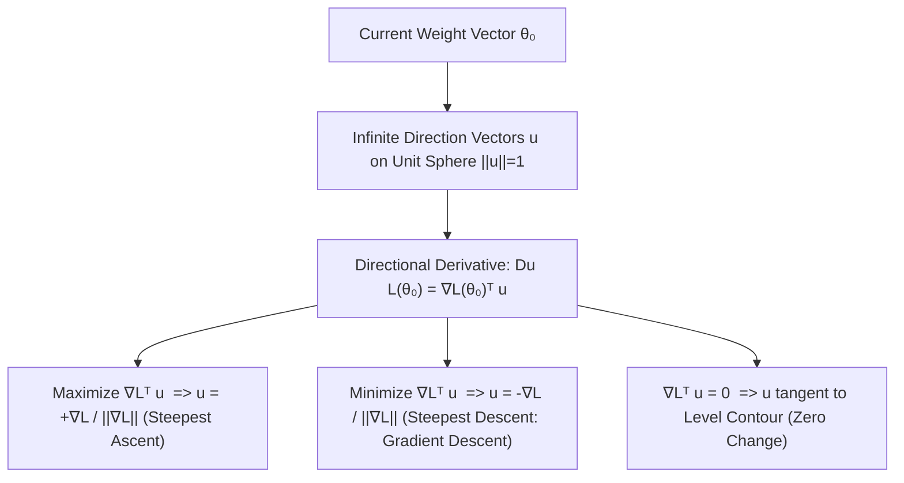
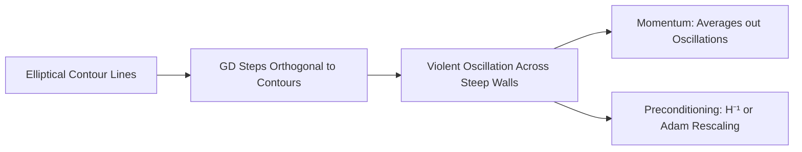

# Chapter 2.2: Directional Derivatives & Gradients

---

## Pedagogical Navigation
- **Module 02:** Multivariable Calculus & Automatic Differentiation
- **Previous Chapter:** [Chapter 2.1: Differential Calculus Foundations & Taylor Expansions](./01_differential_calculus_and_taylor.md)
- **Next Chapter:** [Chapter 2.3: The Jacobian Matrix](./03_the_jacobian_matrix.md)
- **Companion Code:** [02_directional_derivatives_and_gradients.py](./code/02_directional_derivatives_and_gradients.py)
- **Tracker & Index:** [Course Index & Progress Tracker](../00_index_and_tracker.md)

---

## Part 1: Intuition & 101 Motivation

In single-variable calculus, you can only move forwards or backwards along the real line: $x + h$ or $x - h$. The rate of change is simply the scalar derivative $f'(x)$.

In machine learning, your model parameters live in an $n$-dimensional vector space:
$$\theta = [\theta_1, \theta_2, \dots, \theta_n]^T \in \mathbb{R}^n$$
Partial derivatives $\frac{\partial \mathcal{L}}{\partial \theta_1}, \frac{\partial \mathcal{L}}{\partial \theta_2}, \dots$ measure how the loss changes if you tweak **exactly one parameter** while holding all other $n-1$ parameters frozen.
However, in practical deep learning, we **never** update one parameter at a time! When training an optimizer like SGD, Adam, or RMSprop, we update **all millions of parameters simultaneously**:
$$\theta_{t+1} = \theta_t + \Delta \theta$$
where $\Delta \theta$ is a displacement vector pointing in some arbitrary multidimensional direction $u \in \mathbb{R}^n$.

This raises two fundamental questions that form the backbone of modern machine learning optimization:
1. If I choose to step in an arbitrary unit direction $u$, what is the instantaneous rate of change of the loss? $\implies$ **The Directional Derivative $D_u \mathcal{L}(\theta)$**.
2. Out of all uncountably infinitely many directions $u \in \mathbb{R}^n$ on the unit sphere, which single direction produces the **fastest possible drop** in loss? $\implies$ **The Negative Gradient $-\nabla \mathcal{L}(\theta)$**.



---

## Part 2: Rigorous Mathematical Formulation

### 1. The Directional Derivative

#### Definition 2.2.1: Directional Derivative
Let $f: D \subseteq \mathbb{R}^n \to \mathbb{R}$ be a scalar field defined on an open set $D$, let $x \in D$, and let $u \in \mathbb{R}^n$ be a **unit vector** ($\|u\|_2 = 1$).
The **directional derivative of $f$ at $x$ along $u$**, denoted $D_u f(x)$ or $\nabla_u f(x)$, is defined as:
$$D_u f(x) = \lim_{t \to 0} \frac{f(x + t u) - f(x)}{t}$$
provided this scalar limit exists.

> [!IMPORTANT]
> The direction vector $u$ **must have unit norm** ($\|u\|_2 = 1$). If an arbitrary non-zero vector $v \neq 0$ is specified, the directional derivative along $v$ is formally defined by normalizing $v$:
> $$D_v f(x) \triangleq D_{\frac{v}{\|v\|_2}} f(x) = \lim_{t \to 0} \frac{f\left(x + t \frac{v}{\|v\|_2}\right) - f(x)}{t}$$

---

### 2. The Fundamental Gradient-Directional Derivative Identity

#### Theorem 2.2.1: Dot Product Representation
If $f: \mathbb{R}^n \to \mathbb{R}$ is Fréchet differentiable at $x$, then the directional derivative exists for every unit direction $u \in \mathbb{R}^n$, and is given by the Euclidean inner product of the gradient vector with $u$:
$$D_u f(x) = \nabla f(x)^T u = \langle \nabla f(x), u \rangle = \sum_{i=1}^n \frac{\partial f}{\partial x_i}(x) u_i$$

##### Formal Proof:
1. By Definition 2.1.5 (Fréchet Differentiability from Chapter 2.1), for any perturbation vector $h \in \mathbb{R}^n$:
   $$f(x + h) - f(x) = \nabla f(x)^T h + R(h), \quad \text{where } \lim_{h \to 0} \frac{R(h)}{\|h\|_2} = 0$$
2. Let $h = t u$, where $u$ is a fixed unit vector ($\|u\|_2 = 1$) and $t > 0$ is a scalar parameter.
   Then $\|h\|_2 = \|t u\|_2 = |t| \|u\|_2 = |t|$.
3. Substitute $h = t u$ into the differentiability formula:
   $$f(x + t u) - f(x) = \nabla f(x)^T (t u) + R(t u) = t (\nabla f(x)^T u) + R(t u)$$
4. Divide both sides by the scalar $t$ ($t \neq 0$):
   $$\frac{f(x + t u) - f(x)}{t} = \nabla f(x)^T u + \frac{R(t u)}{t}$$
5. Take the limit as $t \to 0$:
   $$\lim_{t \to 0} \frac{f(x + t u) - f(x)}{t} = \nabla f(x)^T u + \lim_{t \to 0} \frac{R(t u)}{t}$$
6. Since $\left|\frac{R(t u)}{t}\right| = \frac{|R(t u)|}{\|t u\|_2} \to 0$ as $t \to 0$ by definition of the remainder term:
   $$D_u f(x) = \nabla f(x)^T u$$
   This completes the proof. $\blacksquare$

---

### 3. Proof of the Direction of Steepest Descent

Why do we move along $-\nabla f(x)$ in gradient descent? Is it just a heuristic, or a mathematical certainty?

#### Theorem 2.2.2: Steepest Descent & Ascent Theorem
Let $f: \mathbb{R}^n \to \mathbb{R}$ be differentiable at $x$ with non-zero gradient $\nabla f(x) \neq 0$.
Among all possible unit direction vectors $u \in \mathbb{R}^n$ with $\|u\|_2 = 1$:
1. The direction of **maximum increase** (steepest ascent) is:
   $$u^*_{\text{ascent}} = \frac{\nabla f(x)}{\|\nabla f(x)\|_2}$$
   with maximum rate of increase equal to $\|\nabla f(x)\|_2$.
2. The direction of **maximum decrease** (steepest descent) is:
   $$u^*_{\text{descent}} = -\frac{\nabla f(x)}{\|\nabla f(x)\|_2}$$
   with maximum rate of decrease equal to $-\|\nabla f(x)\|_2$.

##### Formal Step-by-Step Proof:
1. By Theorem 2.2.1, the directional derivative is:
   $$D_u f(x) = \langle \nabla f(x), u \rangle$$
2. Recall the geometric formula for the Euclidean inner product between two vectors in $\mathbb{R}^n$ (Chapter 1.2):
   $$\langle \nabla f(x), u \rangle = \|\nabla f(x)\|_2 \|u\|_2 \cos \theta$$
   where $\theta \in [0, \pi]$ is the angle between the vectors $\nabla f(x)$ and $u$.
3. Since $u$ is a unit vector, $\|u\|_2 = 1$. Therefore:
   $$D_u f(x) = \|\nabla f(x)\|_2 \cos \theta$$
4. Since the cosine function is strictly bounded by $-1 \le \cos \theta \le 1$:
   $$-\|\nabla f(x)\|_2 \le D_u f(x) \le \|\nabla f(x)\|_2$$
5. **Maximization:**
   $D_u f(x)$ reaches its maximum if and only if $\cos \theta = 1$, which occurs if and only if $\theta = 0$.
   An angle of $\theta = 0$ means $u$ points in the exact same direction as $\nabla f(x)$:
   $$u = \frac{\nabla f(x)}{\|\nabla f(x)\|_2} \implies D_u f(x) = \|\nabla f(x)\|_2$$
6. **Minimization:**
   $D_u f(x)$ reaches its minimum if and only if $\cos \theta = -1$, which occurs if and only if $\theta = \pi$.
   An angle of $\theta = \pi$ means $u$ points in the exact opposite direction of $\nabla f(x)$:
   $$u = -\frac{\nabla f(x)}{\|\nabla f(x)\|_2} \implies D_u f(x) = -\|\nabla f(x)\|_2$$
7. This mathematically proves that $-\nabla f(x)$ is the unique direction of steepest descent. $\blacksquare$

---

### 4. Level Sets and Orthogonality of the Gradient

#### Definition 2.2.2: Level Set (Contour Line / Hypersurface)
For a scalar field $f: \mathbb{R}^n \to \mathbb{R}$ and a constant $c \in \mathbb{R}$, the **level set** (or contour hypersurface) $S_c$ is the set of all points where $f$ takes the value $c$:
$$S_c = \left\{ x \in \mathbb{R}^n \;\middle|\; f(x) = c \right\}$$
In $\mathbb{R}^2$, level sets are 1D curves (contour lines).
In $\mathbb{R}^3$, level sets are 2D surfaces (equipotential surfaces).

#### Theorem 2.2.3: Orthogonality of the Gradient to Level Sets
Let $S_c = \{x \in \mathbb{R}^n \mid f(x) = c\}$ be a smooth level set, and let $x_0 \in S_c$.
The gradient vector $\nabla f(x_0)$ is **strictly orthogonal (perpendicular)** to the tangent space of $S_c$ at $x_0$.

##### Formal Proof:
1. Let $\gamma: (-\epsilon, \epsilon) \to \mathbb{R}^n$ be any arbitrary smooth curve lying entirely within the level set $S_c$ such that $\gamma(0) = x_0$.
2. Because $\gamma(t)$ lies entirely on the level set for all $t \in (-\epsilon, \epsilon)$:
   $$f(\gamma(t)) = c \quad \text{for all } t \in (-\epsilon, \epsilon)$$
3. Differentiate both sides with respect to $t$ at $t = 0$:
   $$\frac{d}{dt} \left[ f(\gamma(t)) \right]_{t=0} = \frac{d}{dt} [c]_{t=0} = 0$$
4. By the multivariable chain rule:
   $$\frac{d}{dt} f(\gamma(t)) = \nabla f(\gamma(t))^T \gamma'(t)$$
5. Evaluating at $t = 0$:
   $$\nabla f(x_0)^T \gamma'(0) = 0 \iff \langle \nabla f(x_0), \gamma'(0) \rangle = 0$$
6. The vector $v = \gamma'(0) \in \mathbb{R}^n$ is the velocity vector tangent to the curve $\gamma$ at $x_0$.
   Since this holds for **every smooth curve** passing through $x_0$ on the level set, $\nabla f(x_0)$ is orthogonal to every tangent vector in the tangent space $T_{x_0} S_c$. $\blacksquare$

---

## Part 3: Geometric, Algebraic & Physical Interpretation

### 1. The Geometry of Contours and Orthogonal Steps
Because $\nabla f(x)$ is perpendicular to the tangent of the contour line $f(x) = c$:
- If you step in a direction $u$ tangent to the contour line, $D_u f(x) = \nabla f(x)^T u = 0$. The value of $f$ does not change to first order!
- To change $f$ as rapidly as possible, you must step directly away from the contour line, perpendicular to it.
- **Consequence for Gradient Descent:** In an elongated, narrow valley (an ill-conditioned quadratic bowl), the contour lines are tight ellipses. Gradient descent always steps perpendicular to these elliptical contours, causing it to bounce back and forth across the steep walls rather than moving smoothly along the valley floor!

```
                  Contour f(x) = c₁    Contour f(x) = c₂
                         |                    |
                         v                    v
         ----------------+--------------------+-----------------
                        /                    /
                       /   Tangential:      /
                      /    ∇fᵀ u = 0       /
                     /       <----->      /
                    /           |        /
                   /            | ∇f(x) /  (Orthogonal to contour!)
                  /             v      /
                 /              • x₀  /
                /                    /
         -------------------------------------------------------
```

### 2. Physical Analogy: Electrostatics and Topographic Maps
1. **Topographic Elevation Map:**
   On a hiking map, contour lines connect points of equal elevation.
   - If you walk along a contour line, you stay at the exact same elevation (slope = 0).
   - If you drop a marble, it rolls in the direction perpendicular to the contour line, straight down into the valley. That marble follows the negative gradient $-\nabla f(x)$.
2. **Electrostatic Fields:**
   In physics, electrostatic potential $V(x)$ forms equipotential surfaces ($V(x) = c$).
   The physical electric field is the negative gradient of potential:
   $$\mathbf{E} = -\nabla V$$
   Electric field lines always pierce equipotential surfaces at right angles ($90^\circ$).

---

## Part 4: Real-World Analogy

### The Skier on the Foggy Ridge
Imagine you are a downhill skier standing on a snowy mountain slope at coordinates $x_0$.
You have a compass that can point in any heading $\phi \in [0, 360^\circ]$, represented by unit vector $u(\phi) = [\cos \phi, \sin \phi]^T$.

1. **Heading $\phi_{\text{ridge}}$ (Traversing the Contour):**
   If you point your skis parallel to the ridge line, you neither gain nor lose height. The directional derivative is $D_u f(x_0) = 0$.
2. **Heading $\phi_{\text{ascent}}$ (Hiking Straight Up):**
   If you turn your skis to face directly up the steepest incline, your elevation increases at the maximum possible rate $\|\nabla f(x_0)\|$.
3. **Heading $\phi_{\text{fall-line}}$ (The Fall Line):**
   In skiing, the "fall line" is the path a snowball would roll down if released. It points in direction $-\nabla f(x_0)$. Pointing your skis along the fall line maximizes your acceleration downwards: $D_u f(x_0) = -\|\nabla f(x_0)\|$.

---

## Part 5: "AI by Hand" (Prof. Tom Yeh Style Visual Grids)

Let us calculate directional derivatives and verify contour orthogonality step-by-step using concrete numbers. No steps skipped.

### 1. Problem Setup & Toy Function
Consider the quadratic objective function $f: \mathbb{R}^2 \to \mathbb{R}$:
$$f(x_1, x_2) = 3 x_1^2 + 2 x_1 x_2 + x_2^2$$
Operating evaluation point:
$$x_0 = \begin{bmatrix} 2 \\ 1 \end{bmatrix}$$

---

### 2. "What Refers to What" Legend Protocol

| Symbol | Ambient Dimension | Pure Math Role | Deep Learning Meaning | Toy Value in Walkthrough |
| :--- | :--- | :--- | :--- | :--- |
| $x_0$ | $\mathbb{R}^{2 \times 1}$ | Current coordinate point | Model parameter vector $\theta_t$ | $[2, 1]^T$ |
| $f(x_0)$ | $\mathbb{R}$ | Scalar field value | Training loss at current step $\mathcal{L}(\theta_t)$ | $17.0$ |
| $\nabla f(x_0)$ | $\mathbb{R}^{2 \times 1}$ | Gradient vector | Raw unnormalized gradient $\mathbf{g}_t$ | $[14, 6]^T$ |
| $\|\nabla f(x_0)\|_2$ | $\mathbb{R}$ | Euclidean norm of gradient | Gradient norm (used in gradient clipping) | $\sqrt{232} \approx 15.2315$ |
| $u_1$ | $\mathbb{R}^{2 \times 1}$ | Unit vector: Steepest Ascent | Normalized gradient direction | $\frac{1}{\sqrt{232}} [14, 6]^T$ |
| $u_2$ | $\mathbb{R}^{2 \times 1}$ | Unit vector: Steepest Descent | Normalized SGD update direction | $-\frac{1}{\sqrt{232}} [14, 6]^T$ |
| $u_3$ | $\mathbb{R}^{2 \times 1}$ | Unit vector: Contour Tangent | Direction of neutral loss change | $\frac{1}{\sqrt{232}} [-6, 14]^T$ |
| $u_4$ | $\mathbb{R}^{2 \times 1}$ | Unit vector: First Coordinate axis | Update along $\theta_1$ alone | $[1, 0]^T$ |
| $u_5$ | $\mathbb{R}^{2 \times 1}$ | Unit vector: Second Coordinate axis | Update along $\theta_2$ alone | $[0, 1]^T$ |
| $D_u f(x_0)$ | $\mathbb{R}$ | Directional derivative | Instantaneous rate of loss change along $u$ | Scalar value |

---

### 3. Step-by-Step Manual Arithmetic

#### Step 1: Compute Value at $x_0 = [2, 1]^T$
$$f(2, 1) = 3(2)^2 + 2(2)(1) + (1)^2 = 3(4) + 4 + 1 = 12 + 4 + 1 = \mathbf{17.0}$$
The level set passing through $x_0$ is the ellipse:
$$S_{17} = \left\{ (x_1, x_2) \in \mathbb{R}^2 \;\middle|\; 3 x_1^2 + 2 x_1 x_2 + x_2^2 = 17 \right\}$$

#### Step 2: Compute Analytical Gradient $\nabla f(x)$
Compute partial derivatives:
$$\frac{\partial f}{\partial x_1} = \frac{\partial}{\partial x_1}(3 x_1^2 + 2 x_1 x_2 + x_2^2) = 6 x_1 + 2 x_2$$
$$\frac{\partial f}{\partial x_2} = \frac{\partial}{\partial x_2}(3 x_1^2 + 2 x_1 x_2 + x_2^2) = 2 x_1 + 2 x_2$$
Evaluate at $x_0 = [2, 1]^T$:
$$\frac{\partial f}{\partial x_1}(2, 1) = 6(2) + 2(1) = 12 + 2 = \mathbf{14.0}$$
$$\frac{\partial f}{\partial x_2}(2, 1) = 2(2) + 2(1) = 4 + 2 = \mathbf{6.0}$$
$$\nabla f(x_0) = \begin{bmatrix} 14.0 \\ 6.0 \end{bmatrix}$$

#### Step 3: Compute Gradient Norm $\|\nabla f(x_0)\|_2$
$$\|\nabla f(x_0)\|_2 = \sqrt{14^2 + 6^2} = \sqrt{196 + 36} = \sqrt{232} \approx \mathbf{15.2315462}$$

---

#### Step 4: Evaluate Directional Derivatives Across 5 Different Headings

##### Direction 1: Steepest Ascent ($u_1 = \frac{\nabla f}{\|\nabla f\|}$)
$$u_1 = \frac{1}{\sqrt{232}} \begin{bmatrix} 14 \\ 6 \end{bmatrix} \approx \begin{bmatrix} 0.919145 \\ 0.393919 \end{bmatrix}$$
Verify unit norm:
$$\|u_1\|_2^2 = (0.919145)^2 + (0.393919)^2 = 0.844828 + 0.155172 = 1.000000 \quad \checkmark$$
Compute directional derivative:
$$D_{u_1} f(x_0) = \nabla f(x_0)^T u_1 = \begin{bmatrix} 14 & 6 \end{bmatrix} \left( \frac{1}{\sqrt{232}} \begin{bmatrix} 14 \\ 6 \end{bmatrix} \right) = \frac{14^2 + 6^2}{\sqrt{232}} = \frac{232}{\sqrt{232}} = \sqrt{232} \approx \mathbf{+15.231546}$$

##### Direction 2: Steepest Descent ($u_2 = -u_1$)
$$u_2 = -\frac{1}{\sqrt{232}} \begin{bmatrix} 14 \\ 6 \end{bmatrix} \approx \begin{bmatrix} -0.919145 \\ -0.393919 \end{bmatrix}$$
Compute directional derivative:
$$D_{u_2} f(x_0) = \nabla f(x_0)^T u_2 = -\sqrt{232} \approx \mathbf{-15.231546}$$
This is the absolute most negative slope achievable in any direction.

##### Direction 3: Tangent to Contour Line ($u_3 \perp \nabla f$)
To construct a vector perpendicular to $[14, 6]^T$ in $\mathbb{R}^2$, swap coordinates and negate one:
$$v_{\text{tangent}} = \begin{bmatrix} -6 \\ 14 \end{bmatrix}$$
Normalize to unit length:
$$u_3 = \frac{1}{\sqrt{(-6)^2 + 14^2}} \begin{bmatrix} -6 \\ 14 \end{bmatrix} = \frac{1}{\sqrt{232}} \begin{bmatrix} -6 \\ 14 \end{bmatrix} \approx \begin{bmatrix} -0.393919 \\ 0.919145 \end{bmatrix}$$
Compute directional derivative:
$$D_{u_3} f(x_0) = \nabla f(x_0)^T u_3 = \begin{bmatrix} 14 & 6 \end{bmatrix} \left( \frac{1}{\sqrt{232}} \begin{bmatrix} -6 \\ 14 \end{bmatrix} \right) = \frac{(14)(-6) + (6)(14)}{\sqrt{232}} = \frac{-84 + 84}{\sqrt{232}} = \mathbf{0.000000}$$
**The rate of change along the contour tangent is exactly zero!**

##### Direction 4: Coordinate Axis 1 ($u_4 = e_1 = [1, 0]^T$)
$$D_{u_4} f(x_0) = \nabla f(x_0)^T e_1 = \begin{bmatrix} 14 & 6 \end{bmatrix} \begin{bmatrix} 1 \\ 0 \end{bmatrix} = (14)(1) + (6)(0) = \mathbf{14.000000} \equiv \frac{\partial f}{\partial x_1}$$

##### Direction 5: Coordinate Axis 2 ($u_5 = e_2 = [0, 1]^T$)
$$D_{u_5} f(x_0) = \nabla f(x_0)^T e_2 = \begin{bmatrix} 14 & 6 \end{bmatrix} \begin{bmatrix} 0 \\ 1 \end{bmatrix} = (14)(0) + (6)(1) = \mathbf{6.000000} \equiv \frac{\partial f}{\partial x_2}$$

---

### 4. Visual Summary Grid

```
+----------------------------------------------------------------------------------------------------------------+
|                             PROF. TOM YEH STYLE DIRECTIONAL DERIVATIVE GRID                                    |
+----------------------------------------------------------------------------------------------------------------+
| Base Point x₀: [2.0, 1.0]ᵀ               | Gradient ∇f(x₀): [14.0, 6.0]ᵀ           | Norm: ||∇f|| = 15.2315    |
| Function: f(x) = 3x₁² + 2x₁x₂ + x₂²       | Current Value f(x₀): 17.0000            | Contour: f(x) = 17.0      |
+----------------------------------------------------------------------------------------------------------------+
| DIRECTION TYPE      | UNIT VECTOR u                    | DOT PRODUCT ∇fᵀ u           | RATE OF CHANGE Du f(x₀) |
+---------------------+----------------------------------+-----------------------------+-------------------------+
| Steepest Ascent     | [+0.919145, +0.393919]ᵀ          | (14)(0.919) + (6)(0.394)    | +15.2315 (MAXIMUM)      |
| Steepest Descent    | [-0.919145, -0.393919]ᵀ          | (14)(-0.919) + (6)(-0.394)   | -15.2315 (MINIMUM: GD)  |
| Contour Tangent     | [-0.393919, +0.919145]ᵀ          | (14)(-0.394) + (6)(0.919)   |  0.0000 (ZERO CHANGE)   |
| Coordinate Axis x₁  | [ 1.000000,  0.000000]ᵀ          | (14)(1.000) + (6)(0.000)    | +14.0000 (∂f/∂x₁)       |
| Coordinate Axis x₂  | [ 0.000000,  1.000000]ᵀ          | (14)(0.000) + (6)(1.000)    |  +6.0000 (∂f/∂x₂)       |
| Diagonal (45°)      | [+0.707107, +0.707107]ᵀ          | (14)(0.707) + (6)(0.707)    | +14.1421                |
+---------------------+----------------------------------+-----------------------------+-------------------------+
```

---

## Part 6: Step-by-Step Solved Illustrations

### Case A: Binary Cross-Entropy Loss on a 2D Linear Classifier
Consider a single training example $(x, y) = ([1.0, -1.0]^T, 1)$.
The linear model logit is $z = w^T x = w_1 x_1 + w_2 x_2 = w_1 - w_2$.
The predicted probability is $\hat{y} = \sigma(z) = \frac{1}{1 + e^{-z}}$.
The Binary Cross-Entropy (BCE) loss for $y = 1$ is:
$$\mathcal{L}(w) = -\log \sigma(w_1 - w_2) = \log(1 + e^{-(w_1 - w_2)})$$

Let the current weights be $w_0 = [0.0, 0.0]^T$.
Find the direction of steepest descent and calculate the directional derivative along $u = [1/\sqrt{2}, 1/\sqrt{2}]^T$.

#### Step 1: Compute Gradient $\nabla \mathcal{L}(w_0)$
By the logistic regression gradient formula:
$$\frac{\partial \mathcal{L}}{\partial w} = (\hat{y} - y) x$$
At $w_0 = [0, 0]^T$:
- Logit $z = 0 - 0 = 0$.
- Prediction $\hat{y} = \sigma(0) = 0.5$.
- Error term: $\hat{y} - y = 0.5 - 1.0 = -0.5$.
- Gradient vector:
  $$\nabla \mathcal{L}(w_0) = (-0.5) \begin{bmatrix} 1.0 \\ -1.0 \end{bmatrix} = \begin{bmatrix} -0.5 \\ 0.5 \end{bmatrix}$$

#### Step 2: Direction of Steepest Descent
The negative gradient is:
$$-\nabla \mathcal{L}(w_0) = \begin{bmatrix} 0.5 \\ -0.5 \end{bmatrix}$$
Norm:
$$\|-\nabla \mathcal{L}(w_0)\|_2 = \sqrt{(0.5)^2 + (-0.5)^2} = \sqrt{0.25 + 0.25} = \sqrt{0.5} \approx 0.707107$$
Normalized steepest descent direction:
$$u^*_{\text{descent}} = \frac{1}{\sqrt{0.5}} \begin{bmatrix} 0.5 \\ -0.5 \end{bmatrix} = \begin{bmatrix} \frac{1}{\sqrt{2}} \\ -\frac{1}{\sqrt{2}} \end{bmatrix} \approx \begin{bmatrix} 0.707107 \\ -0.707107 \end{bmatrix}$$
The steepest rate of loss reduction is $-0.707107$.

#### Step 3: Directional Derivative along Diagonal $u = [1/\sqrt{2}, 1/\sqrt{2}]^T$
$$D_u \mathcal{L}(w_0) = \nabla \mathcal{L}(w_0)^T u = \begin{bmatrix} -0.5 & 0.5 \end{bmatrix} \begin{bmatrix} \frac{1}{\sqrt{2}} \\ \frac{1}{\sqrt{2}} \end{bmatrix} = -\frac{0.5}{\sqrt{2}} + \frac{0.5}{\sqrt{2}} = \mathbf{0.0}$$
Stepping along $[1/\sqrt{2}, 1/\sqrt{2}]^T$ increases $w_1$ and $w_2$ equally. Since $z = w_1 - w_2$, the logit does not change at all ($z = 0$), so the loss remains identically constant!

---

### Case B: Common Trap — Failing to Normalize the Direction Vector
Suppose someone asks for the directional derivative along the vector $v = [3, 4]^T$.
If you compute $\nabla f(x)^T v$:
$$\nabla f(x_0)^T v = (14)(3) + (6)(4) = 42 + 24 = 66$$
Is the directional derivative $66$?
**NO!** That is the rate of change scaled by a step of length $\|v\|_2 = \sqrt{3^2 + 4^2} = 5$.
The true directional derivative is strictly normalized per unit distance:
$$u = \frac{v}{\|v\|_2} = \begin{bmatrix} 3/5 \\ 4/5 \end{bmatrix} = \begin{bmatrix} 0.6 \\ 0.8 \end{bmatrix}$$
$$D_u f(x_0) = \nabla f(x_0)^T u = (14)(0.6) + (6)(0.8) = 8.4 + 4.8 = \mathbf{13.2}$$

---

### Case C: Circular Contour Orthogonality Proof
Consider the loss surface $f(x_1, x_2) = x_1^2 + x_2^2$ (a rotationally symmetric paraboloid).
The level curves are concentric circles $x_1^2 + x_2^2 = R^2$.
Pick any point $x_0 = [R \cos \theta, R \sin \theta]^T$ on the circle.

1. **Gradient Vector:**
   $$\nabla f(x_0) = \begin{bmatrix} 2 x_1 \\ 2 x_2 \end{bmatrix} = \begin{bmatrix} 2 R \cos \theta \\ 2 R \sin \theta \end{bmatrix} = 2 x_0$$
   The gradient points purely radially outwards away from the origin!
2. **Tangent Vector to Circle:**
   Parameterize the circle by angle $\phi$: $\gamma(\phi) = [R \cos \phi, R \sin \phi]^T$.
   The velocity tangent vector is:
   $$\gamma'(\theta) = \begin{bmatrix} -R \sin \theta \\ R \cos \theta \end{bmatrix}$$
3. **Inner Product:**
   $$\langle \nabla f(x_0), \gamma'(\theta) \rangle = (2 R \cos \theta)(-R \sin \theta) + (2 R \sin \theta)(R \cos \theta) = -2 R^2 \cos \theta \sin \theta + 2 R^2 \sin \theta \cos \theta = 0$$
   The radial gradient is strictly perpendicular to the circumferential tangent for every point on every circle.

---

## Part 7: Deep Learning Connection & Application

### 1. Why Gradient Descent Zig-Zags in Ravines
In deep networks, parameters have widely varying sensitivities. Some weights control massive cross-attention layers, while others control subtle biases.
This creates **anisotropic loss landscapes** (ravines):
- In one direction, the loss curves steeply upwards ($\lambda_{\max} \gg 1$).
- In another direction, the loss is nearly flat ($\lambda_{\min} \ll 1$).

Because gradient descent steps strictly orthogonal to contour lines:
- The gradient is dominated by the steep direction.
- The optimizer steps almost perpendicular to the ravine, repeatedly overshooting from one side to the other.
- **Remedy:** Momentum (Module 5, Chapter 5.5) accumulates velocity along the ravine floor, cancelling out the orthogonal oscillations!



### 2. Normalized Gradient Descent & Gradient Clipping
In Transformers and LLM pre-training, exploding gradients can instantly destabilize training.
To prevent this, two key gradient normalization techniques are used:
1. **Norm Clipping (`torch.nn.utils.clip_grad_norm_`):**
   If $\|\mathbf{g}\|_2 > c$, rescale:
   $$\mathbf{g}_{\text{clipped}} = c \frac{\mathbf{g}}{\|\mathbf{g}\|_2}$$
   This preserves the **exact direction of steepest descent** $u^* = \mathbf{g} / \|\mathbf{g}\|_2$ while capping the step magnitude to $c$.
2. **Sign Gradient Descent (Lion Optimizer / RMSProp without magnitude):**
   Steps purely according to $\text{sign}(\nabla \mathcal{L})$, which corresponds to steepest descent under the $L_\infty$ norm rather than the $L_2$ norm.

---

## Part 8: Code Implementation & Verification

The companion Python module [02_directional_derivatives_and_gradients.py](./code/02_directional_derivatives_and_gradients.py) provides full verification:
1. **Part 5 Visual Grid Verification:** Validates all 5 directions, steepest ascent ($+15.2315$), steepest descent ($-15.2315$), and contour tangent ($0.0$).
2. **Finite-Difference Limit vs. Inner Product Identity:** Proves $D_u f(x) = \lim_{t \to 0} \frac{f(x+tu)-f(x)}{t} = \nabla f(x)^T u$ across 360 random directions.
3. **Cauchy-Schwarz Inequality Bound:** Confirms that $|D_u f(x)| \le \|\nabla f(x)\|_2$ with equality if and only if $u = \pm \nabla f / \|\nabla f\|$.
4. **Contour Orthogonality Test:** Generates points on an elliptical contour and proves $\langle \nabla f, v_{\text{tangent}} \rangle = 0$ everywhere.
5. **BCE Loss Directional Derivative Test:** Replicates Case A classification model.
