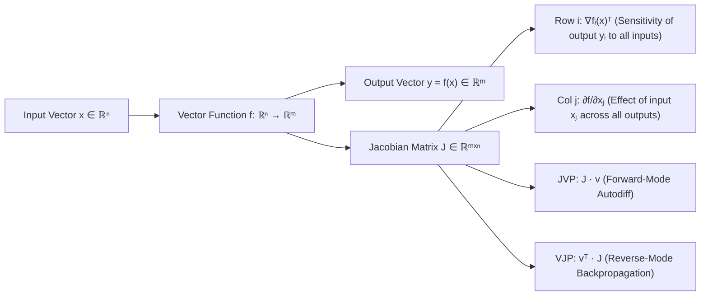

# Chapter 2.3: The Jacobian Matrix

---

## Pedagogical Navigation
- **Module 02:** Multivariable Calculus & Automatic Differentiation
- **Previous Chapter:** [Chapter 2.2: Directional Derivatives & Gradients](./02_directional_derivatives_and_gradients.md)
- **Next Chapter:** [Chapter 2.4: The Hessian Matrix & Curvature Analysis](./04_the_hessian_matrix.md)
- **Companion Code:** [03_the_jacobian_matrix.py](./code/03_the_jacobian_matrix.py)
- **Tracker & Index:** [Course Index & Progress Tracker](../00_index_and_tracker.md)

---

## Part 1: Intuition & 101 Motivation

In Chapters 2.1 and 2.2, we studied functions that map a multidimensional vector of parameters to a **single scalar output**:
$$f: \mathbb{R}^n \to \mathbb{R} \quad (\text{e.g., the scalar loss } \mathcal{L}(\theta))$$
The derivative of such a function is the **gradient vector** $\nabla f(x) \in \mathbb{R}^n$.

However, modern deep neural networks are built from layers that take a **vector in** and produce a **vector out**:
$$f: \mathbb{R}^n \to \mathbb{R}^m$$
Examples are everywhere in deep learning:
- A linear layer mapping 512 input features to 1024 hidden neurons ($f: \mathbb{R}^{512} \to \mathbb{R}^{1024}$).
- An activation layer applying elementwise GELU or Sigmoid ($f: \mathbb{R}^d \to \mathbb{R}^d$).
- A multi-class **Softmax classification head** converting $K$ raw logits into $K$ class probabilities ($f: \mathbb{R}^K \to \mathbb{R}^K$).
- A Transformer attention projection mapping word embeddings to Query/Key/Value vectors.

When an input vector $x \in \mathbb{R}^n$ is nudged by an infinitesimal perturbation $h \in \mathbb{R}^n$, **every single one of the $m$ outputs shifts simultaneously**.
How do we organize the $m \times n$ separate rates of change?
The answer is the **Jacobian Matrix**: the ultimate first-order derivative for vector-to-vector transformations.



---

## Part 2: Rigorous Mathematical Formulation

### 1. Vector-Valued Mappings and the Definition of the Jacobian

Let $f: D \subseteq \mathbb{R}^n \to \mathbb{R}^m$ be a mapping defined on an open set $D$.
We can write $f(x)$ in terms of its $m$ component scalar functions:
$$f(x) = \begin{bmatrix} f_1(x) \\ f_2(x) \\ \vdots \\ f_m(x) \end{bmatrix} = \begin{bmatrix} f_1(x_1, x_2, \dots, x_n) \\ f_2(x_1, x_2, \dots, x_n) \\ \vdots \\ f_m(x_1, x_2, \dots, x_n) \end{bmatrix}$$
where each $f_i: \mathbb{R}^n \to \mathbb{R}$ is a scalar-valued function.

#### Definition 2.3.1: The Jacobian Matrix
Let $f: \mathbb{R}^n \to \mathbb{R}^m$ be differentiable at $x$. The **Jacobian matrix** of $f$ at $x$, denoted $J_f(x)$, $\frac{\partial f}{\partial x}$, or $Df(x)$, is the $m \times n$ matrix whose entry in row $i$ and column $j$ is the partial derivative of the $i^{\text{th}}$ output component with respect to the $j^{\text{th}}$ input coordinate:
$$J_f(x) = \begin{bmatrix} 
\frac{\partial f_1}{\partial x_1} & \frac{\partial f_1}{\partial x_2} & \dots & \frac{\partial f_1}{\partial x_n} \\[8pt]
\frac{\partial f_2}{\partial x_1} & \frac{\partial f_2}{\partial x_2} & \dots & \frac{\partial f_2}{\partial x_n} \\[8pt]
\vdots & \vdots & \ddots & \vdots \\[8pt]
\frac{\partial f_m}{\partial x_1} & \frac{\partial f_m}{\partial x_2} & \dots & \frac{\partial f_m}{\partial x_n}
\end{bmatrix} \in \mathbb{R}^{m \times n}$$

---

### 2. Structural Anatomy: Rows vs. Columns

The Jacobian matrix possesses two complementary structural views that correspond directly to linear algebra concepts from Module 1:

#### View 1: Rows as Transposed Gradients
Each row $i$ of the Jacobian is the transpose of the gradient vector of the $i^{\text{th}}$ scalar output function $f_i$:
$$J_f(x) = \begin{bmatrix} 
— & \nabla f_1(x)^T & — \\
— & \nabla f_2(x)^T & — \\
& \vdots & \\
— & \nabla f_m(x)^T & — 
\end{bmatrix}$$
> **Deep Learning Meaning:** Row $i$ describes how output neuron $y_i$ aggregates information across all input neurons.

#### View 2: Columns as Sensitivity Vectors
Each column $j$ of the Jacobian is the derivative of the entire output vector with respect to a single input coordinate $x_j$:
$$J_f(x) = \begin{bmatrix} 
\vert & \vert & & \vert \\
\frac{\partial f}{\partial x_1} & \frac{\partial f}{\partial x_2} & \dots & \frac{\partial f}{\partial x_n} \\
\vert & \vert & & \vert 
\end{bmatrix}$$
> **Deep Learning Meaning:** Column $j$ describes how perturbing input neuron $x_j$ propagates outward and impacts every single output neuron.

---

### 3. Best Local Linear Approximation (Fréchet Derivative)

#### Theorem 2.3.1: Vector Differentiability
A vector-valued mapping $f: \mathbb{R}^n \to \mathbb{R}^m$ is differentiable at $x_0$ if and only if there exists a linear transformation represented by $J \in \mathbb{R}^{m \times n}$ such that:
$$f(x_0 + h) = f(x_0) + J(x_0) h + R(h)$$
where the remainder satisfies:
$$\lim_{h \to 0} \frac{\|R(h)\|_2}{\|h\|_2} = 0 \iff R(h) \in o(\|h\|_2)$$
In other words, the Jacobian $J(x_0)$ is the unique linear transformation that best approximates the non-linear vector mapping $f$ in the immediate vicinity of $x_0$.

---

### 4. Special Case: Affine Transformations
If $f: \mathbb{R}^n \to \mathbb{R}^m$ is an affine linear transformation:
$$f(x) = A x + b, \quad A \in \mathbb{R}^{m \times n}, \; b \in \mathbb{R}^m$$
Then for any $i \in \{1, \dots, m\}$ and $j \in \{1, \dots, n\}$:
$$f_i(x) = \sum_{k=1}^n A_{ik} x_k + b_i \implies \frac{\partial f_i}{\partial x_j} = A_{ij}$$
Therefore, the Jacobian of an affine transformation is constant and identical to the matrix $A$:
$$\mathbf{J_f(x) \equiv A}$$

---

### 5. The Jacobian Determinant and Local Volume Scaling

When $m = n$ (the input and output spaces have the same dimension), the Jacobian matrix $J \in \mathbb{R}^{n \times n}$ is square.
We can therefore compute its determinant: $\det(J_f(x))$.

#### Theorem 2.3.2: Geometric Meaning of the Jacobian Determinant
Let $U \subset \mathbb{R}^n$ be an infinitesimally small volume element containing $x_0$.
Under the non-linear transformation $f$, the image $f(U)$ has volume:
$$\text{Vol}(f(U)) \approx |\det(J_f(x_0))| \cdot \text{Vol}(U)$$
1. **$|\det(J)| > 1$:** The transformation locally **expands** volume (stretch).
2. **$|\det(J)| < 1$:** The transformation locally **compresses** volume (shrink).
3. **$|\det(J)| = 1$:** The transformation is locally **volume-preserving** (equiareall / symplectic).
4. **$\det(J) > 0$:** The transformation preserves orientation (right-handed systems stay right-handed).
5. **$\det(J) < 0$:** The transformation reverses orientation (mirrors the coordinate system).
6. **$\det(J) = 0$:** The transformation is locally degenerate; it collapses full $n$-dimensional space into a lower-dimensional subspace (rank-deficient).

> [!TIP]
> This property is the mathematical foundation of **Normalizing Flows** (e.g., RealNVP, Glow) in generative modeling, where invertible neural networks compute exact data likelihoods via the Change of Variables formula:
> $$p_X(x) = p_Z(f(x)) \cdot \left| \det(J_f(x)) \right|$$

---

## Part 3: Geometric, Algebraic & Physical Interpretation

### 1. Mapping an Infinitesimal Sphere to an Ellipsoid
What does the Jacobian do to geometry locally?
Consider an infinitesimally small sphere of perturbations $S = \{h \in \mathbb{R}^n \mid \|h\|_2 \le \epsilon\}$.
Under the first-order approximation $\Delta y \approx J h$, what shape is the output perturbation set?

Recall from Chapter 1.7 (Singular Value Decomposition) that any real matrix can be factored as:
$$J = U \Sigma V^T$$
- $V^T$: Rotates the input perturbation sphere in $\mathbb{R}^n$.
- $\Sigma$: Scales the sphere along principal axes by singular values $\sigma_1 \ge \sigma_2 \ge \dots \ge \sigma_{\min} \ge 0$.
- $U$: Rotates the resulting ellipsoid in $\mathbb{R}^m$.

**Geometric Conclusion:**
The Jacobian maps an infinitesimal hypersphere into an **infinitesimal hyperellipsoid**!
- The longest axis of the output ellipsoid has radius $\epsilon \cdot \sigma_1 = \epsilon \cdot \|J\|_2$.
- The shortest axis has radius $\epsilon \cdot \sigma_{\min}$.
- The product of all semi-axes is proportional to $\prod_{i=1}^n \sigma_i = |\det(J)|$.

```
     Input Space ℝⁿ                                Output Space ℝᵐ
    +---------------+                             +---------------+
    |       *       |     Non-Linear Map f(x)     |      ***      |
    |    *  h  *    |  ------------------------>  |   *   Δy  *   |  (Ellipsoid)
    |       *       |                             |      ***      |
    +---------------+                             +---------------+
      Infinitesimal                                 Semi-axes:
      Sphere (ε)                                    σ₁ ε, σ₂ ε, ...
```

---

## Part 4: Real-World Analogy

### The Rubber Sheet with Printed Grid
Imagine a flat, stretchable rubber sheet. You take a ruler and draw a perfect grid of square millimeter tiles ($1\text{ mm} \times 1\text{ mm}$, area $= 1\text{ mm}^2$).

Now, grab the rubber sheet by the corners and pull it unevenly in different directions, twisting and warping it over a bowl:
1. **The Mapping $f$:** Every original point $(x_1, x_2)$ on the relaxed sheet moves to a new 2D position $(y_1, y_2) = f(x_1, x_2)$.
2. **The Jacobian $J(x)$:** Focus on a single tiny square on the relaxed sheet. After stretching:
   - The square has deformed into a small tilted **parallelogram**.
   - The bottom edge of the square vector $[dx_1, 0]^T$ has turned into the vector $\begin{bmatrix} \frac{\partial f_1}{\partial x_1} \\ \frac{\partial f_2}{\partial x_1} \end{bmatrix} dx_1$ (Column 1 of $J$).
   - The left edge $[0, dx_2]^T$ has turned into $\begin{bmatrix} \frac{\partial f_1}{\partial x_2} \\ \frac{\partial f_2}{\partial x_2} \end{bmatrix} dx_2$ (Column 2 of $J$).
3. **The Determinant $|\det(J)|$:** The area of the new deformed parallelogram is precisely $|\det(J)| \text{ mm}^2$.
   - If $|\det(J)| = 2.5$, the rubber was stretched to $2.5\times$ its original area at that spot.
   - If $|\det(J)| = 0.4$, the rubber was compressed at that spot.

---

## Part 5: "AI by Hand" (Prof. Tom Yeh Style Visual Grids)

Let us calculate a complete 2D-to-2D non-linear neural layer Jacobian step-by-step using concrete numbers. No steps skipped.

### 1. Problem Setup & Toy Non-Linear Layer
Consider a non-linear mapping $f: \mathbb{R}^2 \to \mathbb{R}^2$:
$$f(x_1, x_2) = \begin{bmatrix} f_1(x_1, x_2) \\ f_2(x_1, x_2) \end{bmatrix} = \begin{bmatrix} x_1^2 + 2 x_1 x_2 \\ 3 x_1 x_2^2 - x_2 \end{bmatrix}$$
Operating evaluation point:
$$x_0 = \begin{bmatrix} 1.0 \\ 2.0 \end{bmatrix}$$
Perturbation vector:
$$h = \begin{bmatrix} 0.01 \\ -0.02 \end{bmatrix}$$
Target evaluation point:
$$x_{\text{target}} = x_0 + h = \begin{bmatrix} 1.0 + 0.01 \\ 2.0 - 0.02 \end{bmatrix} = \begin{bmatrix} 1.01 \\ 1.98 \end{bmatrix}$$

---

### 2. "What Refers to What" Legend Protocol

| Symbol | Ambient Dimension | Pure Math Role | Deep Learning Meaning | Toy Value in Walkthrough |
| :--- | :--- | :--- | :--- | :--- |
| $x_0$ | $\mathbb{R}^{2 \times 1}$ | Base coordinate point | Layer input activation vector $a^{[l-1]}$ | $[1.0, 2.0]^T$ |
| $h$ | $\mathbb{R}^{2 \times 1}$ | Input displacement | Perturbation or backward error $\delta$ | $[0.01, -0.02]^T$ |
| $f_1(x)$ | $\mathbb{R}$ | 1st component function | First hidden neuron output $a_1^{[l]}$ | $x_1^2 + 2x_1x_2$ |
| $f_2(x)$ | $\mathbb{R}$ | 2nd component function | Second hidden neuron output $a_2^{[l]}$ | $3x_1x_2^2 - x_2$ |
| $f(x_0)$ | $\mathbb{R}^{2 \times 1}$ | Base output vector | Layer forward activation at $x_0$ | $[5.0, 10.0]^T$ |
| $J(x_0)$ | $\mathbb{R}^{2 \times 2}$ | Jacobian matrix at $x_0$ | Layer input-output sensitivity matrix | $\begin{bmatrix} 6.0 & 2.0 \\ 12.0 & 11.0 \end{bmatrix}$ |
| $J h$ | $\mathbb{R}^{2 \times 1}$ | Linearized output shift | Predicted change in activations | $[0.02, -0.10]^T$ |
| $\det(J(x_0))$ | $\mathbb{R}$ | Jacobian determinant | Local volume expansion ratio | $42.0$ |
| $f(x_0 + h)$ | $\mathbb{R}^{2 \times 1}$ | Exact true output | True perturbed activation vector | $[5.0197, 9.9022]^T$ |

---

### 3. Step-by-Step Manual Arithmetic

#### Step 1: Compute Base Output $f(x_0)$ at $x_1 = 1.0, x_2 = 2.0$
- $f_1(1.0, 2.0) = (1.0)^2 + 2(1.0)(2.0) = 1.0 + 4.0 = \mathbf{5.0}$
- $f_2(1.0, 2.0) = 3(1.0)(2.0)^2 - (2.0) = 3(1)(4) - 2 = 12.0 - 2.0 = \mathbf{10.0}$
$$f(x_0) = \begin{bmatrix} 5.0 \\ 10.0 \end{bmatrix}$$

#### Step 2: Compute Analytical Jacobian Entries
Compute all 4 partial derivatives:
1. $J_{11} = \frac{\partial f_1}{\partial x_1} = \frac{\partial}{\partial x_1}(x_1^2 + 2 x_1 x_2) = 2 x_1 + 2 x_2$
2. $J_{12} = \frac{\partial f_1}{\partial x_2} = \frac{\partial}{\partial x_2}(x_1^2 + 2 x_1 x_2) = 2 x_1$
3. $J_{21} = \frac{\partial f_2}{\partial x_1} = \frac{\partial}{\partial x_1}(3 x_1 x_2^2 - x_2) = 3 x_2^2$
4. $J_{22} = \frac{\partial f_2}{\partial x_2} = \frac{\partial}{\partial x_2}(3 x_1 x_2^2 - x_2) = 6 x_1 x_2 - 1$

Evaluate each entry at $x_1 = 1.0, x_2 = 2.0$:
- $J_{11} = 2(1.0) + 2(2.0) = 2 + 4 = \mathbf{6.0}$
- $J_{12} = 2(1.0) = \mathbf{2.0}$
- $J_{21} = 3(2.0)^2 = 3(4) = \mathbf{12.0}$
- $J_{22} = 6(1.0)(2.0) - 1 = 12 - 1 = \mathbf{11.0}$

The Jacobian matrix is:
$$J(x_0) = \begin{bmatrix} 6.0 & 2.0 \\ 12.0 & 11.0 \end{bmatrix}$$

#### Step 3: Compute Jacobian Determinant $\det(J(x_0))$
$$\det(J(x_0)) = J_{11} J_{22} - J_{12} J_{21} = (6.0)(11.0) - (2.0)(12.0) = 66.0 - 24.0 = \mathbf{42.0}$$
Because $\det(J) = 42.0 > 0$:
- The mapping locally expands 2D areas by a factor of $42\times$!
- The mapping preserves orientation.

#### Step 4: Compute Linear Approximation $\Delta y_{\text{linear}} = J(x_0) h$
Multiply the $2 \times 2$ matrix by the displacement vector $h = [0.01, -0.02]^T$:
$$\Delta y_{\text{linear}} = \begin{bmatrix} 6.0 & 2.0 \\ 12.0 & 11.0 \end{bmatrix} \begin{bmatrix} 0.01 \\ -0.02 \end{bmatrix}$$
- Row 1: $(6.0)(0.01) + (2.0)(-0.02) = 0.06 - 0.04 = \mathbf{+0.02}$
- Row 2: $(12.0)(0.01) + (11.0)(-0.02) = 0.12 - 0.22 = \mathbf{-0.10}$
$$\Delta y_{\text{linear}} = \begin{bmatrix} +0.02 \\ -0.10 \end{bmatrix}$$

Predicted output via first-order Taylor expansion:
$$f_{\text{pred}}(x_0 + h) = f(x_0) + J(x_0) h = \begin{bmatrix} 5.0 \\ 10.0 \end{bmatrix} + \begin{bmatrix} +0.02 \\ -0.10 \end{bmatrix} = \begin{bmatrix} \mathbf{5.0200} \\ \mathbf{9.9000} \end{bmatrix}$$

#### Step 5: Compute True Exact Value $f(1.01, 1.98)$
Evaluate $f_1(1.01, 1.98)$:
- $(1.01)^2 = 1.0201$
- $2(1.01)(1.98) = 2(1.9998) = 3.9996$
- $f_1(1.01, 1.98) = 1.0201 + 3.9996 = \mathbf{5.0197}$

Evaluate $f_2(1.01, 1.98)$:
- $(1.98)^2 = 3.9204$
- $3(1.01)(3.9204) = 3(3.959604) = 11.878812$
- Subtract $x_2 = 1.98$:
- $f_2(1.01, 1.98) = 11.878812 - 1.98 = \mathbf{9.898812}$

True output:
$$f_{\text{true}}(x_0 + h) = \begin{bmatrix} 5.019700 \\ 9.898812 \end{bmatrix}$$

#### Step 6: Exact Error Analysis
- Output 1 error: $|5.019700 - 5.020000| = 0.000300$ ($\approx 0.006\%$)
- Output 2 error: $|9.898812 - 9.900000| = 0.001188$ ($\approx 0.012\%$)
The linear Jacobian approximation captured over **$99.98\%$** of the true non-linear transformation!

---

### 4. Visual Summary Grid

```
+-----------------------------------------------------------------------------------------------+
|                            PROF. TOM YEH STYLE JACOBIAN MATRIX GRID                           |
+-----------------------------------------------------------------------------------------------+
| Input Base Point x₀:    [1.0, 2.0]ᵀ            | Input Perturbation h: [0.01, -0.02]ᵀ         |
| Output Base Vector y₀:  [5.0, 10.0]ᵀ           | Determinant: det(J) = 42.0 (Volume x42)      |
+------------------------------------------------+----------------------------------------------+
| JACOBIAN MATRIX J(x₀)                          | LINEAR PREDICTION J · h                      |
|                                                |                                              |
|          Col 1 (∂/∂x₁)    Col 2 (∂/∂x₂)        |   Row 1: (6.0)(0.01) + (2.0)(-0.02)  = +0.02 |
| Row 1 [   6.0000            2.0000   ]         |   Row 2: (12.0)(0.01) + (11.0)(-0.02) = -0.10 |
| Row 2 [  12.0000           11.0000   ]         |                                              |
+------------------------------------------------+----------------------------------------------+
| OUTPUT COMPONENT      | 1ST-ORDER PREDICTION   | TRUE NON-LINEAR VALUE  | APPROXIMATION ERROR |
+-----------------------+------------------------+------------------------+---------------------+
| y₁ = f₁(x₀ + h)       | 5.00 + 0.02 = 5.0200   | 5.019700               | 0.000300 (0.006%)   |
| y₂ = f₂(x₀ + h)       | 10.0 - 0.10 = 9.9000   | 9.898812               | 0.001188 (0.012%)   |
+-----------------------------------------------------------------------------------------------+
```

---

## Part 6: Step-by-Step Solved Illustrations

### Case A: The Softmax Layer Jacobian (The Fundamental Deep Learning Case)
The Softmax function converts a vector of $K$ unconstrained real logits $z \in \mathbb{R}^K$ into a valid probability distribution $s \in \mathbb{R}^K$:
$$s_i = \text{softmax}(z)_i = \frac{e^{z_i}}{\sum_{k=1}^K e^{z_k}}, \quad i \in \{1, \dots, K\}$$
Find the full $K \times K$ Jacobian matrix $J = \frac{\partial s}{\partial z}$.

#### Step-by-Step Derivation:
Let $S = \sum_{k=1}^K e^{z_k}$. Then $s_i = \frac{e^{z_i}}{S}$.
Apply the quotient rule to differentiate $s_i$ with respect to $z_j$:
$$\frac{\partial s_i}{\partial z_j} = \frac{\frac{\partial(e^{z_i})}{\partial z_j} \cdot S - e^{z_i} \cdot \frac{\partial S}{\partial z_j}}{S^2}$$

Notice that:
- $\frac{\partial(e^{z_i})}{\partial z_j} = \begin{cases} e^{z_i}, & \text{if } i = j \\ 0, & \text{if } i \neq j \end{cases} = \delta_{ij} e^{z_i}$, where $\delta_{ij}$ is the Kronecker delta.
- $\frac{\partial S}{\partial z_j} = \frac{\partial}{\partial z_j} \left( \sum_{k=1}^K e^{z_k} \right) = e^{z_j}$.

Substitute these into the quotient rule:
$$\frac{\partial s_i}{\partial z_j} = \frac{\delta_{ij} e^{z_i} S - e^{z_i} e^{z_j}}{S^2} = \delta_{ij} \frac{e^{z_i}}{S} - \left(\frac{e^{z_i}}{S}\right) \left(\frac{e^{z_j}}{S}\right)$$
Since $s_i = \frac{e^{z_i}}{S}$ and $s_j = \frac{e^{z_j}}{S}$:
$$\mathbf{\frac{\partial s_i}{\partial z_j} = \delta_{ij} s_i - s_i s_j = s_i (\delta_{ij} - s_j)}$$

#### Matrix Form of the Softmax Jacobian:
In compact matrix notation:
$$\mathbf{J_{\text{softmax}}(z) = \text{diag}(s) - s s^T}$$
- $\text{diag}(s)$ is a diagonal matrix with probabilities $s_1, \dots, s_K$ on the diagonal.
- $s s^T$ is the rank-1 outer product matrix with entries $s_i s_j$.

#### Concrete $3 \times 3$ Toy Numerical Walkthrough:
Let $s = [0.7, 0.2, 0.1]^T$ (sum $= 1.0$).
1. Compute diagonal:
   $$\text{diag}(s) = \begin{bmatrix} 0.7 & 0 & 0 \\ 0 & 0.2 & 0 \\ 0 & 0 & 0.1 \end{bmatrix}$$
2. Compute outer product $s s^T$:
   $$s s^T = \begin{bmatrix} 0.7 \\ 0.2 \\ 0.1 \end{bmatrix} \begin{bmatrix} 0.7 & 0.2 & 0.1 \end{bmatrix} = \begin{bmatrix} 0.49 & 0.14 & 0.07 \\ 0.14 & 0.04 & 0.02 \\ 0.07 & 0.02 & 0.01 \end{bmatrix}$$
3. Subtract $J = \text{diag}(s) - s s^T$:
   $$J_{\text{softmax}} = \begin{bmatrix} 0.70 - 0.49 & 0 - 0.14 & 0 - 0.07 \\ 0 - 0.14 & 0.20 - 0.04 & 0 - 0.02 \\ 0 - 0.07 & 0 - 0.02 & 0.10 - 0.01 \end{bmatrix} = \begin{bmatrix} \mathbf{+0.21} & \mathbf{-0.14} & \mathbf{-0.07} \\ \mathbf{-0.14} & \mathbf{+0.16} & \mathbf{-0.02} \\ \mathbf{-0.07} & \mathbf{-0.02} & \mathbf{+0.09} \end{bmatrix}$$
Notice two critical properties:
- **Symmetric:** $J = J^T$ because $s_i s_j = s_j s_i$.
- **Zero Row/Column Sums:** Each row sums to $0.21 - 0.14 - 0.07 = 0.0$! Increasing all logits by a constant $c$ does not change the softmax output ($J \mathbf{1} = 0$).

---

### Case B: Linear Layer Transformation $f(x) = W x + b$
Let $W \in \mathbb{R}^{3 \times 2}$ and $b \in \mathbb{R}^3$:
$$W = \begin{bmatrix} 1 & 2 \\ 3 & 4 \\ 5 & 6 \end{bmatrix}, \quad b = \begin{bmatrix} 10 \\ 20 \\ 30 \end{bmatrix}$$
The output vector is:
$$f(x) = \begin{bmatrix} x_1 + 2 x_2 + 10 \\ 3 x_1 + 4 x_2 + 20 \\ 5 x_1 + 6 x_2 + 30 \end{bmatrix}$$
Compute the Jacobian:
$$J = \begin{bmatrix} \frac{\partial f_1}{\partial x_1} & \frac{\partial f_1}{\partial x_2} \\ \frac{\partial f_2}{\partial x_1} & \frac{\partial f_2}{\partial x_2} \\ \frac{\partial f_3}{\partial x_1} & \frac{\partial f_3}{\partial x_2} \end{bmatrix} = \begin{bmatrix} 1 & 2 \\ 3 & 4 \\ 5 & 6 \end{bmatrix} \equiv W$$
The Jacobian of any linear neural network layer with respect to its input is simply its weight matrix $W$!

---

### Case C: Coordinate Transformation (Polar to Cartesian)
Let $f(r, \theta) = \begin{bmatrix} r \cos \theta \\ r \sin \theta \end{bmatrix}$.
Compute Jacobian:
$$J = \begin{bmatrix} \frac{\partial(r \cos \theta)}{\partial r} & \frac{\partial(r \cos \theta)}{\partial \theta} \\ \frac{\partial(r \sin \theta)}{\partial r} & \frac{\partial(r \sin \theta)}{\partial \theta} \end{bmatrix} = \begin{bmatrix} \cos \theta & -r \sin \theta \\ \sin \theta & r \cos \theta \end{bmatrix}$$
Compute Determinant:
$$\det(J) = (\cos \theta)(r \cos \theta) - (-r \sin \theta)(\sin \theta) = r \cos^2 \theta + r \sin^2 \theta = r (\cos^2 \theta + \sin^2 \theta) = \mathbf{r}$$
This proves the famous calculus integration rule: $dx dy = r \, dr \, d\theta$!

---

## Part 7: Deep Learning Connection & Application

### 1. The Myth of the Explicit Jacobian Matrix
A model like LLaMA-3 or GPT-4 has over 70 billion parameters ($P \approx 7 \times 10^{10}$).
If a hidden layer maps $d_{\text{model}} = 8192$ to $d_{\text{ffn}} = 28672$, the Jacobian matrix between those activations has:
$$8192 \times 28672 \approx 2.35 \times 10^8 \text{ elements} \approx 940\text{ MB per sample!}$$
If you tried to compute the Jacobian of the loss with respect to all 70B weights, the matrix would require billions of gigabytes of RAM.

**Autograd Engines Never Materialize the Full Jacobian!**
Instead, deep learning frameworks (PyTorch, JAX, TensorFlow) rely entirely on two matrix-free projection operations:
1. **Vector-Jacobian Product (VJP) $\implies$ Reverse-Mode Automatic Differentiation:**
   Given an upstream loss gradient vector $v = \nabla_y \mathcal{L} \in \mathbb{R}^{1 \times m}$, compute:
   $$v J = \nabla_x \mathcal{L} \in \mathbb{R}^{1 \times n}$$
   This performs backpropagation in a single backward pass without ever storing $J$!
2. **Jacobian-Vector Product (JVP) $\implies$ Forward-Mode Automatic Differentiation:**
   Given an input perturbation direction $u \in \mathbb{R}^n$, compute:
   $$J u \in \mathbb{R}^m$$
   This computes directional derivatives forward through the computational graph.

---

### 2. Spectral Norm of the Jacobian & GAN Stability
In Generative Adversarial Networks (GANs), the Discriminator network $D: \mathbb{R}^d \to \mathbb{R}$ often suffers from exploding gradients.
To guarantee convergence under the Wasserstein metric (WGAN), the discriminator must be **$1$-Lipschitz continuous**:
$$\|D(x_1) - D(x_2)\| \le \|x_1 - x_2\|$$
By the Mean Value Theorem, this is equivalent to bounding the spectral norm of the Jacobian:
$$\|J_D(x)\|_2 \le 1 \quad \forall x$$
**Spectral Normalization** (Miyato et al., 2018) enforces this by dividing each layer's weight matrix $W$ by its largest singular value $\sigma_{\max}(W)$ using power iteration at every training step!

---

## Part 8: Code Implementation & Verification

The companion Python module [03_the_jacobian_matrix.py](./code/03_the_jacobian_matrix.py) provides full verification:
1. **Part 5 Non-Linear Layer Walkthrough:** Validates analytical $J(x_0)$, determinant ($42.0$), linear prediction, and true non-linear evaluation.
2. **Central Finite-Difference Jacobian vs. Analytical Jacobian:** Validates element-by-element numerical convergence.
3. **Softmax Jacobian Verification:** Computes the analytical formula $J = \text{diag}(s) - s s^T$ and tests against PyTorch autograd functional Jacobian.
4. **VJP vs. JVP Efficiency Benchmark:** Compares computational efficiency of matrix-free projections.
5. **Polar Coordinate Transformation:** Confirms $\det(J) = r$ across random $(r, \theta)$ points.
