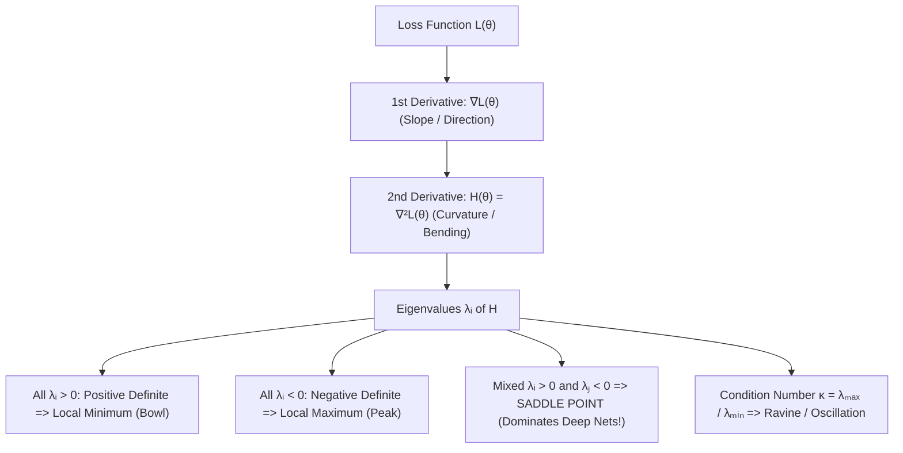

# Chapter 2.4: The Hessian Matrix & Curvature Analysis

---

## Pedagogical Navigation
- **Module 02:** Multivariable Calculus & Automatic Differentiation
- **Previous Chapter:** [Chapter 2.3: The Jacobian Matrix](./03_the_jacobian_matrix.md)
- **Next Chapter:** [Chapter 2.5: Multivariate Chain Rule](./05_multivariate_chain_rule.md)
- **Companion Code:** [04_the_hessian_matrix.py](./code/04_the_hessian_matrix.py)
- **Tracker & Index:** [Course Index & Progress Tracker](../00_index_and_tracker.md)

---

## Part 1: Intuition & 101 Motivation

The gradient vector $\nabla \mathcal{L}(\theta)$ tells an optimizer which way is uphill or downhill.
However, the gradient is **completely blind to curvature**:
- It cannot tell the difference between a gentle, shallow meadow and a knife-edge cliff.
- It cannot tell whether the slope is flattening out ahead (approaching a minimum) or getting steeper (accelerating into an explosion).
- It cannot detect whether a stationary point ($\nabla \mathcal{L} = 0$) is a true valley (minimum), an inverted peak (maximum), or a deceptive **saddle point** that curves up in some directions and down in others!

To answer these questions, we must ask: **How fast is the gradient itself changing?**
The rate of change of the gradient vector is the **Hessian Matrix**: the matrix of all second-order partial derivatives.
Curvature analysis via the Hessian explains why deep learning models are hard to optimize, why Newton's method fails at saddle points, and why flat minima generalize better than sharp minima.



---

## Part 2: Rigorous Mathematical Formulation

### 1. Definition of the Hessian Matrix

Let $f: D \subseteq \mathbb{R}^n \to \mathbb{R}$ be a twice continuously differentiable ($C^2$) scalar field.

#### Definition 2.4.1: The Hessian Matrix
The **Hessian matrix** of $f$ at $x$, denoted $H_f(x)$, $\nabla^2 f(x)$, or simply $H$, is the $n \times n$ square matrix of second-order partial derivatives:
$$H(x) = \begin{bmatrix}
\frac{\partial^2 f}{\partial x_1^2} & \frac{\partial^2 f}{\partial x_1 \partial x_2} & \dots & \frac{\partial^2 f}{\partial x_1 \partial x_n} \\[8pt]
\frac{\partial^2 f}{\partial x_2 \partial x_1} & \frac{\partial^2 f}{\partial x_2^2} & \dots & \frac{\partial^2 f}{\partial x_2 \partial x_n} \\[8pt]
\vdots & \vdots & \ddots & \vdots \\[8pt]
\frac{\partial^2 f}{\partial x_n \partial x_1} & \frac{\partial^2 f}{\partial x_n \partial x_2} & \dots & \frac{\partial^2 f}{\partial x_n^2}
\end{bmatrix} \in \mathbb{R}^{n \times n}$$

Notice that the Hessian is simply the **Jacobian matrix of the gradient vector**:
$$H(x) = J_{\nabla f}(x) = \frac{\partial}{\partial x} (\nabla f(x)^T)$$

---

### 2. Symmetry of the Hessian (Schwarz's / Clairaut's Theorem)

#### Theorem 2.4.1: Clairaut's Theorem on Equality of Mixed Partials
If $f: D \subseteq \mathbb{R}^n \to \mathbb{R}$ has continuous second-order partial derivatives on an open set $D$, then for all $i, j \in \{1, \dots, n\}$:
$$\frac{\partial^2 f}{\partial x_i \partial x_j} = \frac{\partial^2 f}{\partial x_j \partial x_i}$$
Consequently, the Hessian matrix is **always symmetric**:
$$\mathbf{H(x) = H(x)^T}$$

---

### 3. Spectral Decomposition & Curvature Along Arbitrary Directions

Because $H(x)$ is real and symmetric, by the Spectral Theorem (Chapter 1.6), it admits an orthonormal eigendecomposition:
$$H(x) = Q \Lambda Q^T = \sum_{i=1}^n \lambda_i q_i q_i^T$$
where:
- $\lambda_1 \ge \lambda_2 \ge \dots \ge \lambda_n$ are the real eigenvalues.
- $\{q_1, q_2, \dots, q_n\}$ is an orthonormal basis of eigenvectors in $\mathbb{R}^n$.

#### Definition 2.4.2: Directional Second Derivative (Curvature)
Let $u \in \mathbb{R}^n$ be any unit direction vector ($\|u\|_2 = 1$).
The curvature of $f$ in the direction $u$ is given by the quadratic form (Chapter 1.8):
$$\kappa_u = u^T H(x) u$$

By the Rayleigh-Ritz Theorem:
$$\lambda_{\min}(H) \le u^T H(x) u \le \lambda_{\max}(H)$$
- The **maximum curvature** on the entire landscape at point $x$ is $\lambda_{\max}(H)$, pointing along eigenvector $q_1$.
- The **minimum curvature** is $\lambda_{\min}(H)$, pointing along eigenvector $q_n$.

---

### 4. Classification of Stationary Points (Second-Order Optimality Conditions)

Let $x^*$ be a **stationary point** of $f$, meaning the gradient vanishes:
$$\nabla f(x^*) = \mathbf{0}$$

We classify the geometry of $x^*$ using the eigenvalues of $H(x^*)$:

| Eigenvalue Condition | Definiteness of $H(x^*)$ | Nature of Stationary Point | Loss Landscape Geometry |
| :--- | :--- | :--- | :--- |
| $\forall i, \; \lambda_i > 0$ | **Positive Definite ($H \succ 0$)** | **Strict Local Minimum** | Parabolic bowl curving upward in all directions |
| $\forall i, \; \lambda_i < 0$ | **Negative Definite ($H \prec 0$)** | **Strict Local Maximum** | Inverted dome curving downward in all directions |
| $\exists i, j$ with $\lambda_i > 0$ and $\lambda_j < 0$ | **Indefinite** | **Saddle Point** | Horse saddle; escapes along eigenvector $q_j$ |
| $\forall i, \; \lambda_i \ge 0$ with some $\lambda_k = 0$ | **Positive Semi-Definite ($H \succeq 0$)** | Inconclusive (Valley / Flat ridge) | Requires 3rd or 4th order Taylor expansion |

---

### 5. The Condition Number of the Hessian

#### Definition 2.4.3: Hessian Condition Number
For a positive-definite Hessian $H \succ 0$, the **condition number** $\kappa(H)$ is the ratio of its extreme curvatures:
$$\kappa(H) = \frac{\lambda_{\max}(H)}{\lambda_{\min}(H)} \ge 1$$
- **$\kappa(H) \approx 1$ (Well-Conditioned):** The contour lines are spherical. Gradient descent steps directly toward the global minimum without oscillation.
- **$\kappa(H) \gg 1$ (Ill-Conditioned):** The contour lines are elongated, highly eccentric ellipsoids (ravines). Gradient descent bounces back and forth across the steep walls ($\lambda_{\max}$) while crawling agonizingly slowly along the valley floor ($\lambda_{\min}$).

#### Theorem 2.4.2: Gradient Descent Convergence Rate on Quadratic Bowls
For a quadratic loss function $\mathcal{L}(\theta) = \frac{1}{2} \theta^T H \theta$ with condition number $\kappa$, gradient descent with optimal step size $\eta^* = \frac{2}{\lambda_{\max} + \lambda_{\min}}$ converges at the linear rate:
$$\frac{\|\theta_{t+1} - \theta^*\|_2}{\|\theta_t - \theta^*\|_2} \le \frac{\kappa - 1}{\kappa + 1}$$
When $\kappa = 10{,}000$ (common in deep networks), $\frac{\kappa - 1}{\kappa + 1} \approx 0.9998$, meaning thousands of iterations make virtually zero progress!

---

## Part 3: Geometric, Algebraic & Physical Interpretation

### 1. The Geometry of the Osculating Paraboloid
Recall from Chapter 2.1 that near a stationary point $x^*$ ($\nabla f(x^*) = 0$), the Taylor expansion reduces to:
$$f(x^* + h) \approx f(x^*) + \frac{1}{2} h^T H(x^*) h$$
In the coordinate system rotated to align with the eigenvectors of $H$ ($z = Q^T h$):
$$f(x^* + h) \approx f(x^*) + \frac{1}{2} \sum_{i=1}^n \lambda_i z_i^2$$
This decouples the $n$-dimensional curvature into $n$ independent 1D parabolas:
- Each positive eigenvalue $\lambda_i > 0$ forms an upward-opening parabola $\frac{1}{2} \lambda_i z_i^2$.
- Each negative eigenvalue $\lambda_j < 0$ forms a downward-opening parabola $-\frac{1}{2} |\lambda_j| z_j^2$.

```
           Positive Definite (H > 0)                Indefinite (Saddle)
                   \       /                              \       /  (curves up)
                    \     /                                \     /
                     \___/                                  •----•
                   Local Min                              /        \
                                                         /          \ (curves down)
```

---

## Part 4: Real-World Analogy

### The Mountain Pass and the Skateboard Park
1. **Positive Definite ($H \succ 0$): The Concrete Skate Bowl**
   You place a skateboard anywhere on the lip of a smooth, circular concrete skate bowl. Gravity accelerates the board downwards. No matter which direction you nudge it, the ground slopes upward around the bottom. It settles naturally at the local minimum.
2. **Negative Definite ($H \prec 0$): The Mountain Peak**
   You stand at the razor peak of Mount Everest. Every step in any 360° direction sends you plunging downwards into the valley.
3. **Indefinite ($H$ with mixed signs): The Mountain Pass (The Col)**
   You are hiking through a mountain pass between two towering peaks:
   - If you walk East or West, you climb steeply up the rocky mountain ridges ($\lambda_1 > 0$, positive curvature).
   - If you walk North or South, you descend rapidly down into the valleys on either side ($\lambda_2 < 0$, negative curvature).
   You are standing on a **saddle point**. If you want to descend to sea level, you must NOT stop here — you must step along the negative curvature direction!

---

## Part 5: "AI by Hand" (Prof. Tom Yeh Style Visual Grids)

Let us calculate the analytical Hessian, its eigenvalues, condition number, and classify stationary points step-by-step using concrete numbers.

### 1. Problem Setup & Toy Objective Function
Consider the non-linear function $f: \mathbb{R}^2 \to \mathbb{R}$:
$$f(x_1, x_2) = x_1^3 - 3 x_1 + 2 x_1 x_2 + 2 x_2^2$$
We will evaluate and analyze two key points:
1. **Operating Point A:** $x_A = [1.0, 2.0]^T$
2. **Operating Point B:** $x_B = [-1.0, 2.0]^T$

---

### 2. "What Refers to What" Legend Protocol

| Symbol | Ambient Dimension | Pure Math Role | Deep Learning Meaning | Toy Value in Walkthrough |
| :--- | :--- | :--- | :--- | :--- |
| $x_A$ | $\mathbb{R}^{2 \times 1}$ | Test coordinate point | Current model weights $\theta_A$ | $[1.0, 2.0]^T$ |
| $\nabla f(x)$ | $\mathbb{R}^{2 \times 1}$ | Gradient vector | Raw optimizer gradient $\mathbf{g}$ | $[3x_1^2 - 3 + 2x_2, 2x_1 + 4x_2]^T$ |
| $H(x)$ | $\mathbb{R}^{2 \times 2}$ | Hessian matrix | Loss curvature tensor | $\begin{bmatrix} 6x_1 & 2 \\ 2 & 4 \end{bmatrix}$ |
| $\lambda_1, \lambda_2$ | $\mathbb{R}$ | Hessian eigenvalues | Principal curvatures of loss surface | $\lambda_1 \approx 7.236, \lambda_2 \approx 2.764$ |
| $\text{Tr}(H)$ | $\mathbb{R}$ | Trace of Hessian | Flatness / Generalization metric | $10.0$ |
| $\det(H)$ | $\mathbb{R}$ | Determinant of Hessian | Product of principal curvatures | $20.0$ |
| $\kappa(H)$ | $\mathbb{R}$ | Condition number | Landscape anisotropy / Ravine ratio | $\approx 2.618$ |

---

### 3. Step-by-Step Manual Arithmetic

#### Step 1: Compute First-Order Gradient $\nabla f(x)$
$$\frac{\partial f}{\partial x_1} = \frac{\partial}{\partial x_1}\left(x_1^3 - 3 x_1 + 2 x_1 x_2 + 2 x_2^2\right) = 3 x_1^2 - 3 + 2 x_2$$
$$\frac{\partial f}{\partial x_2} = \frac{\partial}{\partial x_2}\left(x_1^3 - 3 x_1 + 2 x_1 x_2 + 2 x_2^2\right) = 2 x_1 + 4 x_2$$
Evaluate at Point A ($x_1 = 1.0, x_2 = 2.0$):
$$\nabla f(x_A) = \begin{bmatrix} 3(1)^2 - 3 + 2(2) \\ 2(1) + 4(2) \end{bmatrix} = \begin{bmatrix} 3 - 3 + 4 \\ 2 + 8 \end{bmatrix} = \begin{bmatrix} \mathbf{4.0} \\ \mathbf{10.0} \end{bmatrix}$$

#### Step 2: Compute Analytical Hessian Matrix $H(x)$
Compute all second-order partial derivatives:
- $H_{11} = \frac{\partial^2 f}{\partial x_1^2} = \frac{\partial}{\partial x_1}(3 x_1^2 - 3 + 2 x_2) = 6 x_1$
- $H_{12} = \frac{\partial^2 f}{\partial x_1 \partial x_2} = \frac{\partial}{\partial x_2}(3 x_1^2 - 3 + 2 x_2) = 2$
- $H_{21} = \frac{\partial^2 f}{\partial x_2 \partial x_1} = \frac{\partial}{\partial x_1}(2 x_1 + 4 x_2) = 2$
- $H_{22} = \frac{\partial^2 f}{\partial x_2^2} = \frac{\partial}{\partial x_2}(2 x_1 + 4 x_2) = 4$

Notice that $H_{12} = H_{21} = 2$ identically, confirming Clairaut's symmetry theorem!
General Hessian:
$$H(x_1, x_2) = \begin{bmatrix} 6 x_1 & 2 \\ 2 & 4 \end{bmatrix}$$

#### Step 3: Analyze Curvature at Point A: $x_A = [1.0, 2.0]^T$
Substitute $x_1 = 1.0$:
$$H(x_A) = \begin{bmatrix} 6(1) & 2 \\ 2 & 4 \end{bmatrix} = \begin{bmatrix} 6 & 2 \\ 2 & 4 \end{bmatrix}$$
1. **Trace:**
   $$\text{Tr}(H) = 6 + 4 = \mathbf{10.0}$$
2. **Determinant:**
   $$\det(H) = (6)(4) - (2)(2) = 24 - 4 = \mathbf{20.0}$$
3. **Eigenvalues via Characteristic Equation:**
   $$\det(H - \lambda I) = \lambda^2 - \text{Tr}(H) \lambda + \det(H) = \lambda^2 - 10 \lambda + 20 = 0$$
   Apply quadratic formula:
   $$\lambda = \frac{10 \pm \sqrt{(-10)^2 - 4(1)(20)}}{2} = \frac{10 \pm \sqrt{100 - 80}}{2} = \frac{10 \pm \sqrt{20}}{2} = 5 \pm \sqrt{5}$$
   Since $\sqrt{5} \approx 2.236068$:
   - $\lambda_1 = 5 + \sqrt{5} \approx \mathbf{7.236068}$
   - $\lambda_2 = 5 - \sqrt{5} \approx \mathbf{2.763932}$
4. **Classification:**
   Both $\lambda_1 > 0$ and $\lambda_2 > 0$.
   Therefore, $H(x_A) \succ 0$ is **strictly Positive Definite**! The local surface curves upward in every direction.
5. **Condition Number:**
   $$\kappa(H) = \frac{\lambda_1}{\lambda_2} = \frac{5 + \sqrt{5}}{5 - \sqrt{5}} = \frac{(5 + \sqrt{5})^2}{25 - 5} = \frac{25 + 10\sqrt{5} + 5}{20} = \frac{30 + 10\sqrt{5}}{20} = \frac{3 + \sqrt{5}}{2} \approx \mathbf{2.618034}$$

---

#### Step 4: Analyze Curvature at Point B: $x_B = [-1.0, 2.0]^T$
Substitute $x_1 = -1.0$:
$$H(x_B) = \begin{bmatrix} 6(-1) & 2 \\ 2 & 4 \end{bmatrix} = \begin{bmatrix} -6 & 2 \\ 2 & 4 \end{bmatrix}$$
1. **Trace:**
   $$\text{Tr}(H) = -6 + 4 = \mathbf{-2.0}$$
2. **Determinant:**
   $$\det(H) = (-6)(4) - (2)(2) = -24 - 4 = \mathbf{-28.0}$$
3. **Eigenvalues via Characteristic Equation:**
   $$\det(H - \lambda I) = \lambda^2 - (-2) \lambda + (-28) = \lambda^2 + 2 \lambda - 28 = 0$$
   Apply quadratic formula:
   $$\lambda = \frac{-2 \pm \sqrt{2^2 - 4(1)(-28)}}{2} = \frac{-2 \pm \sqrt{4 + 112}}{2} = \frac{-2 \pm \sqrt{116}}{2} = -1 \pm \sqrt{29}$$
   Since $\sqrt{29} \approx 5.385165$:
   - $\lambda_1 = -1 + \sqrt{29} \approx \mathbf{+4.385165}$ (Positive curvature!)
   - $\lambda_2 = -1 - \sqrt{29} \approx \mathbf{-6.385165}$ (Negative curvature!)
4. **Classification:**
   Because $\lambda_1 > 0$ and $\lambda_2 < 0$, $H(x_B)$ is **Indefinite**.
   The surface at Point B is a **Saddle Geometry**!
   - Moving along eigenvector $q_1$ leads uphill.
   - Moving along eigenvector $q_2$ plunges downhill.

---

### 4. Visual Summary Grid

```
+-----------------------------------------------------------------------------------------------+
|                            PROF. TOM YEH STYLE HESSIAN CURVATURE GRID                         |
+-----------------------------------------------------------------------------------------------+
| Function: f(x₁, x₂) = x₁³ - 3x₁ + 2x₁x₂ + 2x₂²                                                |
| General Hessian: H(x₁, x₂) = [[ 6x₁, 2 ], [ 2, 4 ]]                                          |
+------------------------------------+--------------------------+-------------------------------+
| METRIC / PROPERTY                  | POINT A: [1.0, 2.0]ᵀ     | POINT B: [-1.0, 2.0]ᵀ         |
+------------------------------------+--------------------------+-------------------------------+
| Gradient ∇f(x)                     | [4.0, 10.0]ᵀ             | [4.0, 6.0]ᵀ                   |
| Hessian Matrix H                   | [[ 6, 2 ], [ 2, 4 ]]     | [[ -6, 2 ], [ 2, 4 ]]         |
| Trace Tr(H)                        | 10.0000                  | -2.0000                       |
| Determinant det(H)                 | 20.0000                  | -28.0000                      |
| Eigenvalue λ₁                      | +7.2361 (Upward curve)   | +4.3852 (Upward curve)        |
| Eigenvalue λ₂                      | +2.7639 (Upward curve)   | -6.3852 (Downward plunge!)    |
| Definiteness                       | Positive Definite (H ≻ 0)| Indefinite                    |
| Landscape Geometry                 | Upward Parabolic Bowl    | Hyperbolic Saddle Surface     |
| Condition Number κ                 | 2.6180 (Mild Ravine)     | N/A (Indefinite / Unstable)   |
+------------------------------------+--------------------------+-------------------------------+
```

---

## Part 6: Step-by-Step Solved Illustrations

### Case A: The Degenerate Monkey Saddle
Consider the surface $f(x, y) = x^3 - 3 x y^2$.
Find all stationary points and evaluate the Hessian at the origin $(0, 0)$.

1. **Gradient:**
   $$\nabla f(x, y) = \begin{bmatrix} 3 x^2 - 3 y^2 \\ -6 x y \end{bmatrix}$$
   At $(0, 0)$, $\nabla f(0, 0) = [0, 0]^T$ (stationary point).
2. **Hessian:**
   $$H(x, y) = \begin{bmatrix} 6 x & -6 y \\ -6 y & -6 x \end{bmatrix} \implies H(0, 0) = \begin{bmatrix} 0 & 0 \\ 0 & 0 \end{bmatrix}$$
   Both eigenvalues are $\lambda_1 = \lambda_2 = 0$.
   The Hessian is completely degenerate!
   - In 2D, a regular horse saddle has 2 dips (for 2 legs).
   - The monkey saddle has **3 dips** (two for the monkey's legs, and one for its tail!). The 2nd-order Taylor expansion fails to reveal this; one must inspect the 3rd-order terms.

---

### Case B: The Ill-Conditioned Ravine & Optimal Learning Rate
Consider the anisotropic quadratic bowl:
$$f(x_1, x_2) = 50 x_1^2 + \frac{1}{2} x_2^2$$
1. **Hessian & Curvatures:**
   $$H = \begin{bmatrix} 100 & 0 \\ 0 & 1 \end{bmatrix} \implies \lambda_1 = 100, \; \lambda_2 = 1$$
   Condition number: $\kappa = \frac{100}{1} = \mathbf{100}$.
2. **Optimal Learning Rate:**
   $$\eta^* = \frac{2}{\lambda_{\max} + \lambda_{\min}} = \frac{2}{100 + 1} = \frac{2}{101} \approx 0.0198$$
3. **What happens if $\eta = 0.025 > \frac{2}{\lambda_{\max}} = 0.02$?**
   The update rule along $x_1$ is:
   $$x_1^{(t+1)} = x_1^{(t)} - \eta (100 x_1^{(t)}) = (1 - 100 \eta) x_1^{(t)} = (1 - 2.5) x_1^{(t)} = -1.5 x_1^{(t)}$$
   At every step, $x_1$ flips sign and grows by $1.5\times$ $\implies$ **instant exponential gradient explosion**!
   The steep direction constrains the maximum learning rate for the entire model.

---

### Case C: Pearlmutter's Trick (Hessian-Vector Product without Hessian)
In deep learning, storing $H \in \mathbb{R}^{P \times P}$ is impossible.
However, algorithms like Trust-Region Policy Optimization (TRPO) and second-order Hessian-Free optimization only ever require the product of the Hessian with an arbitrary vector $v$:
$$\mathbf{w = H v}$$

#### Pearlmutter's Derivation:
1. Consider the directional derivative of the gradient along direction $v$:
   $$\left.\frac{d}{dt} \nabla f(x + t v)\right|_{t=0} = \lim_{t \to 0} \frac{\nabla f(x + t v) - \nabla f(x)}{t}$$
2. By the chain rule:
   $$\frac{d}{dt} \nabla f(x + t v) = J_{\nabla f}(x + t v) \cdot v = H(x + t v) v$$
   Setting $t = 0$:
   $$\mathbf{H(x) v = \left.\frac{d}{dt} \nabla f(x + t v)\right|_{t=0}}$$
This means we can compute $H v$ with **two backpropagation passes** without ever computing or storing a single entry of the $P \times P$ Hessian matrix!

---

## Part 7: Deep Learning Connection & Application

### 1. The Proliferation of Saddle Points in Deep Nets
For decades, researchers worried that deep neural networks would get trapped in bad local minima.
In 2014, Dauphin et al. analyzed the eigenvalues of random high-dimensional Gaussian random fields. They proved:
> In a $P$-dimensional loss landscape ($P \gg 10^6$), the probability that all $P$ eigenvalues of $H$ are positive is:
> $$\mathbb{P}(H \succ 0) \approx \left(\frac{1}{2}\right)^P \approx 0$$
> Almost all critical points at high loss values are **saddle points**, not local minima!

#### Why Newton's Method Fails at Saddles:
Newton's step is $\Delta \theta = -H^{-1} \nabla \mathcal{L}$.
Along an eigenvector $q_j$ with negative eigenvalue $\lambda_j < 0$:
$$\Delta \theta_j = -\frac{1}{\lambda_j} g_j = +\frac{1}{|\lambda_j|} g_j$$
The minus signs cancel! Newton's method **climbs toward the saddle point** rather than escaping it!
In contrast, **Stochastic Gradient Descent (SGD)** with noise naturally perturbs the parameters along the negative curvature direction, sliding harmlessly down the saddle!

---

### 2. Flat vs. Sharp Minima and Generalization
Why does SGD find models that generalize well, while full-batch gradient descent often overfits?
Keskar et al. (2016) and Dinh et al. (2017) demonstrated that the Hessian's trace and spectral norm measure the **flatness** of a minimum:
- **Sharp Minimum ($\lambda_{\max}(H) \gg 1$):** The training loss is low, but a tiny shift between the training data distribution and test data distribution causes the loss to spike catastrophically.
- **Flat Minimum ($\text{Tr}(H) \approx 0$):** The loss stays low even under moderate parameter shifts, guaranteeing robust out-of-distribution generalization.
Modern optimizers like **Sharpness-Aware Minimization (SAM)** explicitly minimize both the loss and the local curvature to seek out flat basins!

---

## Part 8: Code Implementation & Verification

The companion Python module [04_the_hessian_matrix.py](./code/04_the_hessian_matrix.py) provides full verification:
1. **Part 5 Visual Grid Verification:** Validates Point A positive definiteness ($\lambda_1 \approx 7.236, \lambda_2 \approx 2.764$, $\kappa \approx 2.618$) and Point B saddle condition ($\lambda_1 > 0, \lambda_2 < 0$).
2. **Clairaut's Symmetry Test:** Confirms $H = H^T$ across 50 random test points.
3. **Pearlmutter's HVP Trick Verification:** Tests exact equality between matrix multiplication $H v$ and finite-difference gradient differentiation.
4. **Ill-Conditioned Ravine Simulation:** Proves gradient divergence when $\eta > 2/\lambda_{\max}$.
5. **PyTorch Functional Hessian Cross-Check:** Verifies exact agreement with `torch.autograd.functional.hessian`.
