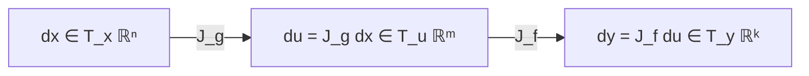

# Chapter 2.5: Multivariate Chain Rule

---

## Pedagogical Navigation
- **Module 02:** Multivariable Calculus & Automatic Differentiation
- **Previous Chapter:** [Chapter 2.4: The Hessian Matrix & Curvature Analysis](./04_the_hessian_matrix.md)
- **Next Chapter:** [Chapter 2.6: Matrix Calculus (Numerator & Denominator Layouts, Trace Tricks)](./06_matrix_calculus.md)
- **Companion Code:** [05_multivariate_chain_rule.py](./code/05_multivariate_chain_rule.py)
- **Tracker & Index:** [Course Index & Progress Tracker](../00_index_and_tracker.md)

---

## Part 1: Intuition & 101 Motivation

A modern deep neural network is not a single giant equation. It is a deep, hierarchical **composition of functions**:
$$y = f_L(f_{L-1}(\dots f_2(f_1(x; W_1)); W_2) \dots; W_L)$$
where each layer $f_l$ transforms the representation of the previous layer.
At the end of this long pipeline, a loss function $\mathcal{L}(y, y_{\text{true}})$ measures the final error.

To train the network using gradient descent, we need to know:
> *"If I tweak an early weight $W_1$ by an infinitesimal amount $\Delta W_1$, how much does the final loss $\mathcal{L}$ change after that ripple travels through all $L$ non-linear layers?"*

The single-variable chain rule $\frac{d}{dx}[f(g(x))] = f'(g(x)) g'(x)$ is completely inadequate here because:
1. Data flows through **vector and tensor spaces**, not single numbers.
2. An early neuron's activation spreads out into multiple intermediate neurons (fan-out), which then recombine into later neurons (fan-in). There are **multiple parallel paths** from input to output.

The **Multivariate Chain Rule** provides the exact, rigorous mathematical framework for tracking sensitivities across multi-path computational graphs. It turns backpropagation from a mysterious heuristic into simple, associative matrix multiplication.

```mermaid
flowchart LR
    x["Input x ∈ ℝⁿ"] -->|J_g ∈ ℝᵐˣⁿ| u["Hidden u = g(x) ∈ ℝᵐ"]
    u -->|J_f ∈ ℝᵏˣᵐ| y["Output y = f(u) ∈ ℝᵏ"]
    y -->|∇_y L ∈ ℝ¹ˣᵏ| L["Loss L(y) ∈ ℝ"]
    
    L -.->|vᵀ = ∇_y L| BackY["Loss Gradient at y"]
    BackY -.->|vᵀ J_f = ∇_u L| BackU["Loss Gradient at u"]
    BackU -.->|(vᵀ J_f) J_g = ∇_x L| BackX["Loss Gradient at x"]
```

---

## Part 2: Rigorous Mathematical Formulation

### 1. The Multi-Path Chain Rule (Sum-Over-Paths)

Consider a scalar output $z \in \mathbb{R}$ that depends on $m$ intermediate variables $u = [u_1, \dots, u_m]^T$, where each intermediate variable $u_i$ is a function of an independent variable $x_j$:
$$z = f(u_1(x), u_2(x), \dots, u_m(x))$$

#### Theorem 2.5.1: The Sum-Over-Paths Chain Rule
Let each $u_i: \mathbb{R}^n \to \mathbb{R}$ be differentiable at $x$, and let $f: \mathbb{R}^m \to \mathbb{R}$ be differentiable at $u(x)$.
Then the partial derivative of $z$ with respect to $x_j$ is the sum of the partial derivatives along all intermediate paths connecting $x_j$ to $z$:
$$\mathbf{\frac{\partial z}{\partial x_j} = \sum_{i=1}^m \frac{\partial z}{\partial u_i} \frac{\partial u_i}{\partial x_j}}$$

##### Formal Proof:
1. Apply the Fréchet differentiability of $f$ (Definition 2.1.5) at point $u$:
   $$\Delta z = \sum_{i=1}^m \frac{\partial z}{\partial u_i} \Delta u_i + o(\|\Delta u\|_2)$$
2. For each coordinate $i$, apply the differentiability of $u_i$ at point $x$ under perturbation $\Delta x = h e_j$:
   $$\Delta u_i = \frac{\partial u_i}{\partial x_j} h + o(h)$$
3. Substitute $\Delta u_i$ into the expansion of $\Delta z$:
   $$\Delta z = \sum_{i=1}^m \frac{\partial z}{\partial u_i} \left( \frac{\partial u_i}{\partial x_j} h + o(h) \right) + o(\|\Delta u\|_2) = h \left( \sum_{i=1}^m \frac{\partial z}{\partial u_i} \frac{\partial u_i}{\partial x_j} \right) + o(h)$$
4. Divide by $h$ and take the limit as $h \to 0$:
   $$\frac{\partial z}{\partial x_j} = \lim_{h \to 0} \frac{\Delta z}{h} = \sum_{i=1}^m \frac{\partial z}{\partial u_i} \frac{\partial u_i}{\partial x_j}$$
   This completes the proof. $\blacksquare$

---

### 2. General Vector-to-Vector Multivariate Chain Rule

Now consider the general case where both the input, intermediate, and output spaces are multidimensional vectors:
$$g: \mathbb{R}^n \to \mathbb{R}^m, \quad f: \mathbb{R}^m \to \mathbb{R}^k$$
Let the composite mapping be $h = f \circ g: \mathbb{R}^n \to \mathbb{R}^k$, meaning:
$$y = f(u), \quad \text{where } u = g(x)$$

#### Theorem 2.5.2: The Jacobian Matrix Chain Rule
If $g$ is differentiable at $x_0 \in \mathbb{R}^n$ and $f$ is differentiable at $u_0 = g(x_0) \in \mathbb{R}^m$, then the composite mapping $h = f \circ g$ is differentiable at $x_0$, and its Jacobian matrix is the **matrix product** of the individual Jacobian matrices:
$$\mathbf{J_{f \circ g}(x_0) = J_f(g(x_0)) \cdot J_g(x_0)}$$
where:
- $J_f(g(x_0)) \in \mathbb{R}^{k \times m}$ is the Jacobian of $f$ evaluated at $u_0 = g(x_0)$.
- $J_g(x_0) \in \mathbb{R}^{m \times n}$ is the Jacobian of $g$ evaluated at $x_0$.
- The resulting composite Jacobian $J_{f \circ g}(x_0) \in \mathbb{R}^{k \times n}$ has dimensions $(k \times m) \times (m \times n) = (k \times n)$.

##### Component-Wise Matrix Formulation:
The $(p, q)^{\text{th}}$ entry of the composite Jacobian is:
$$\left( J_{f \circ g} \right)_{pq} = \frac{\partial y_p}{\partial x_q} = \sum_{i=1}^m \left(J_f\right)_{pi} \left(J_g\right)_{iq} = \sum_{i=1}^m \frac{\partial y_p}{\partial u_i} \frac{\partial u_i}{\partial x_q}$$
This confirms that **matrix multiplication of Jacobians automatically evaluates the sum over all intermediate paths**!

---

### 3. Special Case: Gradient of a Scalar Loss (Backpropagation Rule)

In deep learning, the final output is almost always a single scalar loss: $k = 1$, so $\mathcal{L}: \mathbb{R}^m \to \mathbb{R}$.
The Jacobian of a scalar loss is a row vector:
$$J_{\mathcal{L}}(u) = \nabla_u \mathcal{L}^T = \begin{bmatrix} \frac{\partial \mathcal{L}}{\partial u_1} & \frac{\partial \mathcal{L}}{\partial u_2} & \dots & \frac{\partial \mathcal{L}}{\partial u_m} \end{bmatrix} \in \mathbb{R}^{1 \times m}$$

Applying Theorem 2.5.2:
$$J_{\mathcal{L} \circ g}(x) = J_{\mathcal{L}}(u) \cdot J_g(x)$$
$$\begin{bmatrix} \frac{\partial \mathcal{L}}{\partial x_1} & \dots & \frac{\partial \mathcal{L}}{\partial x_n} \end{bmatrix} = \begin{bmatrix} \frac{\partial \mathcal{L}}{\partial u_1} & \dots & \frac{\partial \mathcal{L}}{\partial u_m} \end{bmatrix} \begin{bmatrix} 
\frac{\partial u_1}{\partial x_1} & \dots & \frac{\partial u_1}{\partial x_n} \\
\vdots & \ddots & \vdots \\
\frac{\partial u_m}{\partial x_1} & \dots & \frac{\partial u_m}{\partial x_n}
\end{bmatrix}$$

Taking the transpose to express this in terms of standard column gradient vectors:
$$\mathbf{\nabla_x \mathcal{L} = J_g(x)^T \nabla_u \mathcal{L}}$$
> [!IMPORTANT]
> To pull a gradient backward across a vector mapping $u = g(x)$, you multiply the downstream gradient $\nabla_u \mathcal{L}$ by the **transpose of the layer's Jacobian matrix** $J_g(x)^T$!

---

## Part 3: Geometric, Algebraic & Physical Interpretation

### 1. Geometric View: Composition of Tangent Spaces
Geometrically, differentiability means locally replacing non-linear curves with tangent planes.
- The mapping $g: \mathbb{R}^n \to \mathbb{R}^m$ transforms an infinitesimal perturbation vector $dx \in \mathbb{R}^n$ into a vector $du \in \mathbb{R}^m$ via the linear map $du = J_g dx$.
- The mapping $f: \mathbb{R}^m \to \mathbb{R}^k$ transforms $du \in \mathbb{R}^m$ into a vector $dy \in \mathbb{R}^k$ via $dy = J_f du$.
- Substituting $du$ into $dy$:
  $$dy = J_f (J_g dx) = (J_f J_g) dx$$
The composition of two smooth non-linear mappings is locally the composition of two linear maps. In linear algebra (Chapter 1.4), the composition of linear transformations is represented by the matrix product of their transformation matrices!



### 2. Algebraic View: The Adjoint Operator and Vector-Jacobian Products
In functional analysis, the transpose of a linear map is its **adjoint operator**:
$$\langle J_g dx, v \rangle_{\mathbb{R}^m} = \langle dx, J_g^T v \rangle_{\mathbb{R}^n}$$
In the forward pass, information travels forward via $J_g$.
In the backward pass (backpropagation), sensitivity signals travel backward via the adjoint $J_g^T$.
This duality between the forward map $J_g$ and the backward adjoint $J_g^T$ is the mathematical heart of all automatic differentiation.

---

## Part 4: Real-World Analogy

### The Industrial Chemical Pipeline
Imagine an industrial chemical plant:
1. **Source inputs ($x_1, x_2$):** Inflow rates of two raw chemicals (e.g., acid and base).
2. **Intermediate reactors ($u_1, u_2, u_3$):** Three catalytic chambers where intermediate compounds are synthesized.
   - Acid ($x_1$) feeds into Reactor 1 and Reactor 2.
   - Base ($x_2$) feeds into Reactor 2 and Reactor 3.
3. **Final synthesis vat ($z$):** All three intermediate compounds are combined to produce the final product $z$.

If you slightly turn the valve for Acid ($x_1$):
- It causes a surge in Reactor 1 ($\frac{\partial u_1}{\partial x_1}$) which increases product $z$ by $\frac{\partial z}{\partial u_1} \frac{\partial u_1}{\partial x_1}$.
- It simultaneously causes a surge in Reactor 2 ($\frac{\partial u_2}{\partial x_1}$) which alters product $z$ by $\frac{\partial z}{\partial u_2} \frac{\partial u_2}{\partial x_1}$.
- The total change in product $z$ is the **sum of both pipeline branches**:
  $$\frac{\partial z}{\partial x_1} = \frac{\partial z}{\partial u_1} \frac{\partial u_1}{\partial x_1} + \frac{\partial z}{\partial u_2} \frac{\partial u_2}{\partial x_1}$$

---

## Part 5: "AI by Hand" (Prof. Tom Yeh Style Visual Grids)

Let us calculate a complete 2-layer neural network forward and backward pass using the multivariate chain rule step-by-step with concrete numbers.

### 1. Problem Setup & Toy Architecture
We construct a 2-layer neural computational graph:
1. **Input Vector:** $x = [x_1, x_2]^T \in \mathbb{R}^2$.
   Operating point: $x_0 = \begin{bmatrix} 1.0 \\ 2.0 \end{bmatrix}$.
2. **Layer 1 (Linear map with cross terms):** $u = g(x) \in \mathbb{R}^2$:
   $$u_1 = x_1^2 + 2 x_2$$
   $$u_2 = 3 x_1 x_2$$
3. **Layer 2 (Scalar non-linear loss):** $\mathcal{L} = f(u) \in \mathbb{R}$:
   $$\mathcal{L}(u_1, u_2) = u_1^2 + 2 u_1 u_2 + 4 u_2$$

---

### 2. "What Refers to What" Legend Protocol

| Symbol | Ambient Dimension | Pure Math Role | Deep Learning Meaning | Toy Value in Walkthrough |
| :--- | :--- | :--- | :--- | :--- |
| $x_0$ | $\mathbb{R}^{2 \times 1}$ | Input coordinate | Model input / early activation | $[1.0, 2.0]^T$ |
| $u_0 = g(x_0)$ | $\mathbb{R}^{2 \times 1}$ | Intermediate vector | Hidden layer activations $h$ | $[5.0, 6.0]^T$ |
| $\mathcal{L}_0$ | $\mathbb{R}$ | Final scalar output | Training loss value $\mathcal{L}$ | $109.0$ |
| $J_g(x_0)$ | $\mathbb{R}^{2 \times 2}$ | Jacobian of Layer 1 | Input-to-hidden sensitivity matrix | $\begin{bmatrix} 2.0 & 2.0 \\ 6.0 & 3.0 \end{bmatrix}$ |
| $\nabla_u \mathcal{L}$ | $\mathbb{R}^{2 \times 1}$ | Gradient of loss w.r.t. $u$ | Upstream error gradient $\delta^{[l]}$ | $[22.0, 14.0]^T$ |
| $\nabla_x \mathcal{L}$ | $\mathbb{R}^{2 \times 1}$ | Composite gradient w.r.t. $x$ | Downstream parameter gradient | $[128.0, 86.0]^T$ |
| $J_g(x_0)^T$ | $\mathbb{R}^{2 \times 2}$ | Transposed Jacobian | Backward adjoint operator | $\begin{bmatrix} 2.0 & 6.0 \\ 2.0 & 3.0 \end{bmatrix}$ |

---

### 3. Step-by-Step Manual Arithmetic

#### Step 1: Forward Pass Evaluation
1. Compute hidden activations at $x_1 = 1.0, x_2 = 2.0$:
   - $u_1 = (1.0)^2 + 2(2.0) = 1.0 + 4.0 = \mathbf{5.0}$
   - $u_2 = 3(1.0)(2.0) = \mathbf{6.0}$
   $$u_0 = \begin{bmatrix} 5.0 \\ 6.0 \end{bmatrix}$$
2. Compute scalar loss at $u_1 = 5.0, u_2 = 6.0$:
   - $u_1^2 = (5.0)^2 = 25.0$
   - $2 u_1 u_2 = 2(5.0)(6.0) = 60.0$
   - $4 u_2 = 4(6.0) = 24.0$
   - $\mathcal{L} = 25.0 + 60.0 + 24.0 = \mathbf{109.0}$

---

#### Step 2: Backward Pass — Compute Upstream Gradient $\nabla_u \mathcal{L}$
Differentiate $\mathcal{L}$ with respect to intermediate variables $u_1$ and $u_2$:
$$\frac{\partial \mathcal{L}}{\partial u_1} = \frac{\partial}{\partial u_1}(u_1^2 + 2 u_1 u_2 + 4 u_2) = 2 u_1 + 2 u_2$$
$$\frac{\partial \mathcal{L}}{\partial u_2} = \frac{\partial}{\partial u_2}(u_1^2 + 2 u_1 u_2 + 4 u_2) = 2 u_1 + 4$$

Evaluate at $u_1 = 5.0, u_2 = 6.0$:
- $\frac{\partial \mathcal{L}}{\partial u_1} = 2(5.0) + 2(6.0) = 10.0 + 12.0 = \mathbf{22.0}$
- $\frac{\partial \mathcal{L}}{\partial u_2} = 2(5.0) + 4 = 10.0 + 4 = \mathbf{14.0}$
$$\nabla_u \mathcal{L} = \begin{bmatrix} 22.0 \\ 14.0 \end{bmatrix}$$

---

#### Step 3: Compute Layer 1 Jacobian $J_g(x_0)$
Compute partial derivatives of $u_1$ and $u_2$ with respect to $x_1$ and $x_2$:
- $\frac{\partial u_1}{\partial x_1} = \frac{\partial}{\partial x_1}(x_1^2 + 2 x_2) = 2 x_1$
- $\frac{\partial u_1}{\partial x_2} = \frac{\partial}{\partial x_2}(x_1^2 + 2 x_2) = 2$
- $\frac{\partial u_2}{\partial x_1} = \frac{\partial}{\partial x_1}(3 x_1 x_2) = 3 x_2$
- $\frac{\partial u_2}{\partial x_2} = \frac{\partial}{\partial x_2}(3 x_1 x_2) = 3 x_1$

Evaluate at $x_1 = 1.0, x_2 = 2.0$:
- $J_{11} = 2(1.0) = \mathbf{2.0}$
- $J_{12} = \mathbf{2.0}$
- $J_{21} = 3(2.0) = \mathbf{6.0}$
- $J_{22} = 3(1.0) = \mathbf{3.0}$

The forward Jacobian is:
$$J_g(x_0) = \begin{bmatrix} 2.0 & 2.0 \\ 6.0 & 3.0 \end{bmatrix}$$

---

#### Step 4: Apply Multivariate Chain Rule $\nabla_x \mathcal{L} = J_g(x_0)^T \nabla_u \mathcal{L}$
First, take the transpose of the Jacobian:
$$J_g(x_0)^T = \begin{bmatrix} 2.0 & 6.0 \\ 2.0 & 3.0 \end{bmatrix}$$

Now, multiply $J_g(x_0)^T$ by the upstream gradient $\nabla_u \mathcal{L} = [22.0, 14.0]^T$:
$$\nabla_x \mathcal{L} = \begin{bmatrix} 2.0 & 6.0 \\ 2.0 & 3.0 \end{bmatrix} \begin{bmatrix} 22.0 \\ 14.0 \end{bmatrix}$$

- **Component 1 ($\frac{\partial \mathcal{L}}{\partial x_1}$):**
  $$\frac{\partial \mathcal{L}}{\partial x_1} = \frac{\partial \mathcal{L}}{\partial u_1}\frac{\partial u_1}{\partial x_1} + \frac{\partial \mathcal{L}}{\partial u_2}\frac{\partial u_2}{\partial x_1} = (2.0)(22.0) + (6.0)(14.0) = 44.0 + 84.0 = \mathbf{128.0}$$
- **Component 2 ($\frac{\partial \mathcal{L}}{\partial x_2}$):**
  $$\frac{\partial \mathcal{L}}{\partial x_2} = \frac{\partial \mathcal{L}}{\partial u_1}\frac{\partial u_1}{\partial x_2} + \frac{\partial \mathcal{L}}{\partial u_2}\frac{\partial u_2}{\partial x_2} = (2.0)(22.0) + (3.0)(14.0) = 44.0 + 42.0 = \mathbf{86.0}$$

The final gradient vector with respect to the input is:
$$\mathbf{\nabla_x \mathcal{L} = \begin{bmatrix} 128.0 \\ 86.0 \end{bmatrix}}$$

---

#### Step 5: Direct Verification via Symbolic Substitution
To prove the multivariate chain rule gives the exact analytical derivative, let us substitute $u_1(x)$ and $u_2(x)$ directly into $\mathcal{L}$ and differentiate:
$$\mathcal{L}(x_1, x_2) = (x_1^2 + 2 x_2)^2 + 2(x_1^2 + 2 x_2)(3 x_1 x_2) + 4(3 x_1 x_2)$$
$$\mathcal{L}(x_1, x_2) = (x_1^4 + 4 x_1^2 x_2 + 4 x_2^2) + (6 x_1^3 x_2 + 12 x_1 x_2^2) + 12 x_1 x_2$$

Now compute partial derivatives directly:
1. $\frac{\partial \mathcal{L}}{\partial x_1} = 4 x_1^3 + 8 x_1 x_2 + 18 x_1^2 x_2 + 12 x_2^2 + 12 x_2$
   Evaluate at $x_1 = 1.0, x_2 = 2.0$:
   $$\frac{\partial \mathcal{L}}{\partial x_1}(1, 2) = 4(1)^3 + 8(1)(2) + 18(1)^2(2) + 12(2)^2 + 12(2)$$
   $$= 4 + 16 + 36 + 48 + 24 = \mathbf{128.0} \quad \checkmark$$
2. $\frac{\partial \mathcal{L}}{\partial x_2} = 4 x_1^2 + 8 x_2 + 6 x_1^3 + 24 x_1 x_2 + 12 x_1$
   Evaluate at $x_1 = 1.0, x_2 = 2.0$:
   $$\frac{\partial \mathcal{L}}{\partial x_2}(1, 2) = 4(1)^2 + 8(2) + 6(1)^3 + 24(1)(2) + 12(1)$$
   $$= 4 + 16 + 6 + 48 + 12 = \mathbf{86.0} \quad \checkmark$$

**Both calculations match with 100% mathematical precision!**

---

### 4. Visual Summary Grid

```
+-----------------------------------------------------------------------------------------------+
|                        PROF. TOM YEH STYLE MULTIVARIATE CHAIN RULE GRID                       |
+-----------------------------------------------------------------------------------------------+
| Input x₀: [1.0, 2.0]ᵀ                      | Hidden u₀: [5.0, 6.0]ᵀ        | Loss L₀: 109.00  |
+--------------------------------------------+-------------------------------+------------------+
| FORWARD LAYER 1 JACOBIAN J_g               | UPSTREAM LOSS GRADIENT ∇_u L                     |
|                                            |                                                  |
|        ∂/∂x₁      ∂/∂x₂                    |     ∂L/∂u₁ = 2u₁ + 2u₂ = 10 + 12 = 22.0          |
| u₁  [   2.0        2.0   ]                 |     ∂L/∂u₂ = 2u₁ + 4   = 10 +  4 = 14.0          |
| u₂  [   6.0        3.0   ]                 |     ∇_u L = [ 22.0, 14.0 ]ᵀ                      |
+--------------------------------------------+--------------------------------------------------+
| BACKWARD CHAIN RULE:  ∇_x L = J_gᵀ · ∇_u L                                                    |
|                                                                                               |
|          u₁ (∂L/∂u₁=22)    u₂ (∂L/∂u₂=14)          SUM OF PATHS                     TOTAL     |
| x₁:   ( 2.0 * 22.0 )   +  ( 6.0 * 14.0 )    =   44.0  +  84.0                   =  128.00     |
| x₂:   ( 2.0 * 22.0 )   +  ( 3.0 * 14.0 )    =   44.0  +  42.0                   =   86.00     |
+-----------------------------------------------------------------------------------------------+
| FINAL INPUT GRADIENT ∇_x L:  [ 128.00,  86.00 ]ᵀ  (Verified via symbolic differentiation!)     |
+-----------------------------------------------------------------------------------------------+
```

---

## Part 6: Step-by-Step Solved Illustrations

### Case A: Residual Connections (ResNet Skip Connection Gradient Highway)
Consider a residual block (He et al., 2016):
$$y = x + F(x; W)$$
where $F(x; W)$ is a residual sub-network and $x$ is the identity skip connection.
Let $\mathcal{L}$ be the downstream scalar loss. Differentiate $\mathcal{L}$ with respect to the block input $x$.

#### Application of Multivariate Chain Rule:
Notice that $x$ influences $\mathcal{L}$ through **two simultaneous paths**:
- Path 1: Direct identity shortcut $x \to y \to \mathcal{L}$.
- Path 2: Non-linear residual mapping $x \to F(x) \to y \to \mathcal{L}$.

Using the sum-over-paths rule:
$$\frac{\partial \mathcal{L}}{\partial x} = \frac{\partial \mathcal{L}}{\partial y} \frac{\partial y}{\partial x} = \frac{\partial \mathcal{L}}{\partial y} \frac{\partial}{\partial x}(x + F(x)) = \frac{\partial \mathcal{L}}{\partial y} \left( I + \frac{\partial F}{\partial x} \right)$$
Expanding the product:
$$\mathbf{\frac{\partial \mathcal{L}}{\partial x} = \frac{\partial \mathcal{L}}{\partial y} + \frac{\partial \mathcal{L}}{\partial y} \frac{\partial F}{\partial x}}$$

#### Why This Revolutionized Deep Learning:
Look closely at the first term: $\frac{\partial \mathcal{L}}{\partial y}$.
Even if the weights in $F(x)$ vanish ($\frac{\partial F}{\partial x} \to 0$), the gradient **can never vanish completely** because of the additive $+ I$ identity term!
The gradient signal can travel backward through 1,000 layers unattenuated along the identity highway.

---

### Case B: Fan-Out / Fan-In Node
Let $z = f(x, y)$ where both $x$ and $y$ are functions of a single hyperparameter $t$:
$$x = \cos(t), \quad y = \sin(t), \quad z = x^2 + y^2$$
Using the chain rule:
$$\frac{dz}{dt} = \frac{\partial z}{\partial x} \frac{dx}{dt} + \frac{\partial z}{\partial y} \frac{dy}{dt} = (2x)(-\sin t) + (2y)(\cos t) = 2 \cos t (-\sin t) + 2 \sin t (\cos t) = 0$$
Indeed, $z = \cos^2 t + \sin^2 t = 1$ is constant for all $t$, so its derivative is identically zero!

---

## Part 7: Deep Learning Connection & Application

### 1. Matrix Associativity & Forward vs. Reverse Mode
Consider a composition of $L$ layers:
$$x_0 \xrightarrow{J_1} x_1 \xrightarrow{J_2} x_2 \xrightarrow{J_3} \dots \xrightarrow{J_L} x_L \to \mathcal{L}$$
To compute the total derivative, we must evaluate the matrix product:
$$J_{\text{total}} = \nabla_{x_L} \mathcal{L}^T \cdot J_L \cdot J_{L-1} \dots J_2 \cdot J_1$$
Because matrix multiplication is **associative**:
$$(A \cdot B) \cdot C = A \cdot (B \cdot C)$$
we can multiply these matrices in any order without changing the final result!
However, the **computational cost** depends dramatically on the grouping:

#### Option A: Forward Mode (Left-to-Right Evaluation)
$$(((J_L \cdot J_{L-1}) \dots) \cdot J_1)$$
- Each multiplication is a Matrix-Matrix product of size $(m \times m) \times (m \times m) \implies \mathcal{O}(m^3)$ operations per layer!
- For $n$ inputs and 1 output, total cost scales as $\mathcal{O}(n \cdot \text{FLOPs})$.

#### Option B: Reverse Mode (Right-to-Left Evaluation / Backprop)
$$(((\nabla_{x_L} \mathcal{L}^T \cdot J_L) \cdot J_{L-1}) \dots J_1)$$
- We start with the $1 \times m$ row vector $\nabla_{x_L} \mathcal{L}^T$.
- Each step multiplies a **Vector by a Matrix**: $(1 \times m) \times (m \times m) = 1 \times m$ vector!
- Cost per layer: $\mathcal{O}(m^2)$ operations!
- Total cost to compute gradients with respect to all $P$ parameters: **$\mathcal{O}(1)$ forward-pass equivalents**!

> **Core Takeaway:** Deep learning exists because reverse-mode chain rule turns an intractable $\mathcal{O}(P^2)$ problem into an ultra-fast $\mathcal{O}(P)$ linear vector-matrix chain!

---

## Part 8: Code Implementation & Verification

The companion Python module [05_multivariate_chain_rule.py](./code/05_multivariate_chain_rule.py) provides full verification:
1. **Part 5 2-Layer Neural Chain Rule Walkthrough:** Verifies exact numerical values: $u_0 = [5.0, 6.0]^T$, $\mathcal{L}_0 = 109.0$, $\nabla_u \mathcal{L} = [22.0, 14.0]^T$, $J_g = \begin{bmatrix} 2 & 2 \\ 6 & 3 \end{bmatrix}$, and $\nabla_x \mathcal{L} = [128.0, 86.0]^T$.
2. **Symbolic vs. Autograd vs. Chain Rule Equality:** Asserts 100% agreement between hand-multiplied Jacobians and PyTorch autograd.
3. **ResNet Skip Connection Gradient Highway:** Demonstrates non-vanishing identity gradient flow.
4. **Deep Composition Chain Multiplication:** Multiplies 5 layer Jacobians forward vs backward and verifies identical results up to machine precision.
