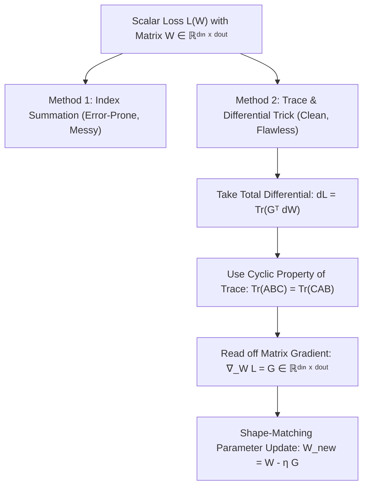

# Chapter 2.6: Matrix Calculus (Numerator & Denominator Layouts, Trace Tricks)

---

## Pedagogical Navigation
- **Module 02:** Multivariable Calculus & Automatic Differentiation
- **Previous Chapter:** [Chapter 2.5: Multivariate Chain Rule](./05_multivariate_chain_rule.md)
- **Next Chapter:** [Chapter 2.7: Computational Graphs & Automatic Differentiation (Reverse vs. Forward Mode)](./07_computational_graphs_and_autodiff.md)
- **Companion Code:** [06_matrix_calculus.py](./code/06_matrix_calculus.py)
- **Tracker & Index:** [Course Index & Progress Tracker](../00_index_and_tracker.md)

---

## Part 1: Intuition & 101 Motivation

In deep learning research papers, derivations rarely operate on individual scalar numbers like $x_i$ or $w_{ij}$.
Instead, entire equations are written compactly in matrix notation:
$$\mathcal{L}(W) = \frac{1}{2} \|Y - X W\|_F^2 + \frac{\lambda}{2} \text{Tr}(W^T W)$$
$$\nabla_W \mathcal{L} = X^T (X W - Y) + \lambda W$$

If you try to derive equations like this using scalar indices, you quickly drown in double- and triple-summations ($\sum_i \sum_j \sum_k$).
Worse, when you open different math and machine learning textbooks, you find fierce contradictions:
- One book claims $\frac{\partial (A x)}{\partial x} = A$.
- Another book claims $\frac{\partial (A x)}{\partial x} = A^T$.
- One author says the gradient of a scalar with respect to a vector is a row vector; another insists it is a column vector!

This confusion stems from the historical clash between **Numerator Layout** (used in pure mathematics and differential geometry) and **Denominator Layout** (used in physics, optimization, and deep learning).

In this chapter, we cut through the confusion. We establish:
1. The **Shape-Matching Principle** that guarantees you never get transposed dimensions in neural networks.
2. The elegant **Differential and Trace Framework** (Magnus & Neudecker) that lets you compute complex matrix gradients in two lines of algebra with zero index gymnastics.



---

## Part 2: Rigorous Mathematical Formulation

### 1. The Layout War: Numerator vs. Denominator Layout

Let $y \in \mathbb{R}^m$ be a vector function of $x \in \mathbb{R}^n$.
The derivative $\frac{\partial y}{\partial x}$ contains $m \times n$ partial derivatives $\frac{\partial y_i}{\partial x_j}$. How should they be arranged into a matrix?

#### Option 1: Numerator Layout (Jacobian Formulation)
The derivative has the shape of the numerator $y$ along rows, and the transpose of the denominator $x$ along columns:
$$\text{Shape}\left( \frac{\partial y}{\partial x} \right) = m \times n$$
- If $y \in \mathbb{R}$ is a **scalar** ($m = 1$), its derivative is a **row vector** ($1 \times n$):
  $$\frac{\partial y}{\partial x} = \begin{bmatrix} \frac{\partial y}{\partial x_1} & \frac{\partial y}{\partial x_2} & \dots & \frac{\partial y}{\partial x_n} \end{bmatrix}$$
- Used by: Pure mathematicians, differential geometers, vector calculus textbooks.

#### Option 2: Denominator Layout (Machine Learning / Optimization Formulation)
The derivative has the shape of the denominator $x$ along rows, and the transpose of the numerator $y$ along columns:
$$\text{Shape}\left( \frac{\partial y}{\partial x} \right) = n \times m$$
- If $y \in \mathbb{R}$ is a **scalar** ($m = 1$), its gradient $\nabla_x y$ is a **column vector** ($n \times 1$):
  $$\nabla_x y = \begin{bmatrix} \frac{\partial y}{\partial x_1} \\ \frac{\partial y}{\partial x_2} \\ \vdots \\ \frac{\partial y}{\partial x_n} \end{bmatrix}$$
- Used by: Optimization literature, deep learning libraries (PyTorch, TensorFlow, JAX).

---

### 2. The Shape-Matching Principle (The Modern Deep Learning Standard)

In deep learning, we adopt the **Denominator / Shape-Preserving Convention**:
> **The Shape-Matching Principle:**
> For any scalar loss $\mathcal{L} \in \mathbb{R}$ and any variable $X$ (whether scalar, vector, or matrix), the gradient $\nabla_X \mathcal{L} = \frac{\partial \mathcal{L}}{\partial X}$ **must have the exact same shape as $X$**.

$$\text{Shape}\left( \frac{\partial \mathcal{L}}{\partial X} \right) \equiv \text{Shape}(X)$$
Why? Because gradient descent updates parameters via:
$$X_{t+1} = X_t - \eta \frac{\partial \mathcal{L}}{\partial X_t}$$
For matrix subtraction $X_t - \eta \nabla_{X_t} \mathcal{L}$ to be defined, both matrices must have identical dimensions!

---

### 3. Fundamental Vector-Calculus Identities (Denominator Layout)

Let $x, a \in \mathbb{R}^n$, and $A \in \mathbb{R}^{n \times n}$.

| Scalar Function $f(x)$ | Gradient $\nabla_x f(x) = \frac{\partial f}{\partial x}$ | Proof / Derivation Sketch |
| :--- | :--- | :--- |
| $a^T x = x^T a$ | $a$ | $\frac{\partial}{\partial x_k} \sum_i a_i x_i = a_k$ |
| $x^T x = \|x\|_2^2$ | $2 x$ | Special case of $x^T A x$ with $A = I$ |
| $x^T A x$ | $(A + A^T) x$ | Product rule on $\sum_{i,j} A_{ij} x_i x_j$ |
| $x^T A x$ ($A$ is symmetric) | $2 A x$ | Since $A = A^T$, $(A + A^T) x = 2 A x$ |
| $\|A x - b\|_2^2$ | $2 A^T (A x - b)$ | Chain rule: let $u = A x - b$, $\nabla_u \|u\|^2 = 2u$, pull back via $A^T$ |

---

### 4. The Frobenius Matrix Inner Product & The Trace

#### Definition 2.6.1: Frobenius Inner Product
For two matrices $A, B \in \mathbb{R}^{m \times n}$, the standard Euclidean inner product on matrix space (Chapter 1.2) is the **Frobenius inner product**:
$$\langle A, B \rangle_F = \sum_{i=1}^m \sum_{j=1}^n A_{ij} B_{ij} = \text{Tr}(A^T B) = \text{Tr}(B A^T)$$

#### Properties of the Trace Operator:
1. **Linearity:** $\text{Tr}(\alpha A + \beta B) = \alpha \text{Tr}(A) + \beta \text{Tr}(B)$.
2. **Transpose Invariance:** $\text{Tr}(A^T) = \text{Tr}(A)$.
3. **Cyclic Permutation Property:**
   $$\mathbf{\text{Tr}(A B C) = \text{Tr}(B C A) = \text{Tr}(C A B)}$$
   provided matrix dimensions allow the products.

---

### 5. The Magnus-Neudecker Matrix Differential & Trace Framework

How do we take derivatives with respect to matrices without expanding indices?
We use the **First Differential**:

#### Theorem 2.6.1: The Fundamental Identification Theorem
Let $f: \mathbb{R}^{m \times n} \to \mathbb{R}$ be a differentiable scalar function of a matrix $X \in \mathbb{R}^{m \times n}$.
The total differential of $f$ can always be uniquely written in the trace form:
$$\mathbf{d f(X) = \text{Tr}\left( G^T dX \right)}$$
where $dX \in \mathbb{R}^{m \times n}$ is the differential of $X$.
When $d f(X)$ is cast into this canonical form, the matrix $G \in \mathbb{R}^{m \times n}$ is **identically the matrix gradient**:
$$\mathbf{\nabla_X f(X) = \frac{\partial f}{\partial X} \equiv G}$$

##### Differential Operational Rules & First-Principles Derivations:
1. $d(\alpha X) = \alpha dX$
2. $d(X + Y) = dX + dY$
3. $d(X Y) = (dX) Y + X (dY)$ (Leibniz Product Rule)
4. $d(X^T) = (dX)^T$
5. $d(\text{Tr}(X)) = \text{Tr}(dX)$
6. **Matrix Inverse Differential:** $\mathbf{d(X^{-1}) = -X^{-1} (dX) X^{-1}}$
   *Proof:* Since $X X^{-1} = I$, take the differential of both sides:
   $$d(X X^{-1}) = d(I) = 0$$
   Applying the Leibniz product rule:
   $$(dX) X^{-1} + X d(X^{-1}) = 0 \implies X d(X^{-1}) = -(dX) X^{-1}$$
   Multiply on the left by $X^{-1}$:
   $$d(X^{-1}) = -X^{-1} (dX) X^{-1} \quad \blacksquare$$
7. **Jacobi's Formula & Log-Determinant Differential:** $\mathbf{d(\log \det X) = \text{Tr}(X^{-1} dX)}$
   *Proof:*
   - For an invertible matrix $X$, recall from Cramer's rule that $X^{-1} = \frac{1}{\det(X)} C^T$, where $C$ is the cofactor matrix.
   - Expanding $\det(X)$ along row $i$: $\det(X) = \sum_{j=1}^n X_{ij} C_{ij}$.
   - Thus $\frac{\partial \det(X)}{\partial X_{ij}} = C_{ij} = (\det(X) X^{-T})_{ij} \implies d(\det X) = \text{Tr}(C^T dX) = \det(X) \text{Tr}(X^{-1} dX)$.
   - Now take the differential of the scalar logarithm:
     $$d(\log \det X) = \frac{1}{\det X} d(\det X) = \frac{1}{\det X} \left( \det(X) \text{Tr}(X^{-1} dX) \right) = \text{Tr}(X^{-1} dX) \quad \blacksquare$$

---

### 6. The Master Table of Matrix Trace Derivatives

Using the Trace Identification Theorem $df = \text{Tr}(G^T dX) \implies \nabla_X f = G$:

| Scalar Function $f(X)$ | Differential Derivation $df$ | Canonical Form $\text{Tr}(G^T dX)$ | Matrix Gradient $\nabla_X f$ |
| :--- | :--- | :--- | :--- |
| $\text{Tr}(A X)$ | $\text{Tr}(A dX)$ | $\text{Tr}((A^T)^T dX)$ | **$A^T$** |
| $\text{Tr}(X A)$ | $\text{Tr}(dX A) = \text{Tr}(A dX)$ | $\text{Tr}((A^T)^T dX)$ | **$A^T$** |
| $\text{Tr}(X^T A)$ | $\text{Tr}(dX^T A) = \text{Tr}(A^T dX)$ | $\text{Tr}(A^T dX)$ | **$A$** |
| $\text{Tr}(A X B)$ | $\text{Tr}(A dX B) = \text{Tr}(B A dX)$ | $\text{Tr}((A^T B^T)^T dX)$ | **$A^T B^T$** |
| $\text{Tr}(X^T A X)$ | $\text{Tr}(dX^T A X + X^T A dX) = \text{Tr}((X^T A^T + X^T A) dX)$ | $\text{Tr}(((A + A^T) X)^T dX)$ | **$(A + A^T) X$** |
| $\log \det(X)$ | $\text{Tr}(X^{-1} dX)$ | $\text{Tr}((X^{-T})^T dX)$ | **$X^{-T}$** |
| $\text{Tr}(A X^{-1} B)$ | $\text{Tr}(A (-X^{-1} dX X^{-1}) B) = -\text{Tr}(X^{-1} B A X^{-1} dX)$ | $-\text{Tr}(( (X^{-1} B A X^{-1})^T )^T dX)$ | **$-(X^{-1} B A X^{-1})^T$** |

---

## Part 3: Geometric, Algebraic & Physical Interpretation

### 1. Geometric View: Directional Derivatives on Matrix Manifolds
A matrix $X \in \mathbb{R}^{m \times n}$ is simply a vector with $m \times n$ coordinates.
The space of all $m \times n$ matrices is an inner product space equipped with the Frobenius norm $\|X\|_F = \sqrt{\text{Tr}(X^T X)}$.
- If you move from $X$ along a matrix direction $V \in \mathbb{R}^{m \times n}$ with $\|V\|_F = 1$, the directional derivative of a scalar loss $\mathcal{L}$ is:
  $$D_V \mathcal{L}(X) = \langle \nabla_X \mathcal{L}, V \rangle_F = \text{Tr}\left( (\nabla_X \mathcal{L})^T V \right)$$
- By Cauchy-Schwarz on matrix space:
  $$|D_V \mathcal{L}(X)| \le \|\nabla_X \mathcal{L}\|_F \|V\|_F$$
- Maximum rate of descent occurs when $V = -\frac{\nabla_X \mathcal{L}}{\|\nabla_X \mathcal{L}\|_F}$.

---

## Part 4: Real-World Analogy

### The Multi-Department Company Budget Ledger
Imagine you are the Chief Financial Officer (CFO) of a company with $m$ branches and $n$ product lines:
- The matrix $W \in \mathbb{R}^{m \times n}$ contains the budget allocation for branch $i$ on product $j$.
- The trace $\text{Tr}(A W B)$ represents the final consolidated net profit of the entire corporation.

1. **Cyclic Permutations of Trace:**
   You can report financial transfers from Headquarters $\to$ Regional Office $\to$ Local Branch $\to$ Headquarters, or shift the perspective to Regional Office $\to$ Local Branch $\to$ Headquarters $\to$ Regional Office. The internal cash reordering does not alter the bottom-line total profit.
2. **The Matrix Gradient:**
   The matrix gradient $\nabla_W \mathcal{L}$ is the exact **spreadsheet of sensitivities**: entry $(i, j)$ tells you how much corporate profit will rise if you allocate \$1 more to branch $i$ for product $j$.

---

## Part 5: "AI by Hand" (Prof. Tom Yeh Style Visual Grids)

Let us derive and calculate the exact matrix gradient for a Linear Regression Least-Squares layer step-by-step using concrete numbers.

### 1. Problem Setup & Toy Matrix Data
Consider the Frobenius least-squares loss:
$$\mathcal{L}(W) = \frac{1}{2} \|Y - X W\|_F^2$$
Dimensions: $X \in \mathbb{R}^{2 \times 2}, W \in \mathbb{R}^{2 \times 2}, Y \in \mathbb{R}^{2 \times 2}$.

Toy values:
$$X = \begin{bmatrix} 1.0 & 2.0 \\ 3.0 & 1.0 \end{bmatrix}, \quad W_0 = \begin{bmatrix} 2.0 & 1.0 \\ 0.0 & 3.0 \end{bmatrix}, \quad Y = \begin{bmatrix} 3.0 & 8.0 \\ 6.0 & 7.0 \end{bmatrix}$$

---

### 2. "What Refers to What" Legend Protocol

| Symbol | Ambient Dimension | Pure Math Role | Deep Learning Meaning | Toy Value in Walkthrough |
| :--- | :--- | :--- | :--- | :--- |
| $X$ | $\mathbb{R}^{2 \times 2}$ | Design / feature matrix | Input batch of tokens ($B=2, d_{\text{in}}=2$) | $\begin{bmatrix} 1 & 2 \\ 3 & 1 \end{bmatrix}$ |
| $W_0$ | $\mathbb{R}^{2 \times 2}$ | Weight parameter matrix | Linear projection layer weights | $\begin{bmatrix} 2 & 1 \\ 0 & 3 \end{bmatrix}$ |
| $Y$ | $\mathbb{R}^{2 \times 2}$ | Target observation matrix | Ground-truth targets | $\begin{bmatrix} 3 & 8 \\ 6 & 7 \end{bmatrix}$ |
| $\hat{Y} = X W$ | $\mathbb{R}^{2 \times 2}$ | Linear prediction | Model forward prediction | $\begin{bmatrix} 2 & 7 \\ 6 & 6 \end{bmatrix}$ |
| $R = \hat{Y} - Y$ | $\mathbb{R}^{2 \times 2}$ | Residual error matrix | Output prediction error | $\begin{bmatrix} -1 & -1 \\ 0 & -1 \end{bmatrix}$ |
| $\mathcal{L}_0$ | $\mathbb{R}$ | Scalar Frobenius loss | Mean Squared Error / batch loss | $1.50$ |
| $\nabla_W \mathcal{L}$ | $\mathbb{R}^{2 \times 2}$ | Matrix gradient | Weight update gradient | $\begin{bmatrix} -1 & -4 \\ -2 & -3 \end{bmatrix}$ |

---

### 3. Step-by-Step Manual Arithmetic

#### Step 1: Forward Prediction $\hat{Y} = X W_0$
Perform matrix multiplication $X W_0$:
$$\hat{Y} = \begin{bmatrix} 1.0 & 2.0 \\ 3.0 & 1.0 \end{bmatrix} \begin{bmatrix} 2.0 & 1.0 \\ 0.0 & 3.0 \end{bmatrix}$$
- $\hat{Y}_{11} = (1.0)(2.0) + (2.0)(0.0) = 2.0 + 0.0 = \mathbf{2.0}$
- $\hat{Y}_{12} = (1.0)(1.0) + (2.0)(3.0) = 1.0 + 6.0 = \mathbf{7.0}$
- $\hat{Y}_{21} = (3.0)(2.0) + (1.0)(0.0) = 6.0 + 0.0 = \mathbf{6.0}$
- $\hat{Y}_{22} = (3.0)(1.0) + (1.0)(3.0) = 3.0 + 3.0 = \mathbf{6.0}$
$$\hat{Y} = \begin{bmatrix} 2.0 & 7.0 \\ 6.0 & 6.0 \end{bmatrix}$$

#### Step 2: Compute Residual Error Matrix $R = \hat{Y} - Y$
$$R = \begin{bmatrix} 2.0 & 7.0 \\ 6.0 & 6.0 \end{bmatrix} - \begin{bmatrix} 3.0 & 8.0 \\ 6.0 & 7.0 \end{bmatrix} = \begin{bmatrix} 2 - 3 & 7 - 8 \\ 6 - 6 & 6 - 7 \end{bmatrix} = \begin{bmatrix} \mathbf{-1.0} & \mathbf{-1.0} \\ \mathbf{0.0} & \mathbf{-1.0} \end{bmatrix}$$

#### Step 3: Compute Scalar Loss $\mathcal{L}_0 = \frac{1}{2} \|R\|_F^2$
$$\|R\|_F^2 = (-1.0)^2 + (-1.0)^2 + (0.0)^2 + (-1.0)^2 = 1.0 + 1.0 + 0.0 + 1.0 = 3.0$$
$$\mathcal{L}_0 = \frac{1}{2}(3.0) = \mathbf{1.50}$$

---

#### Step 4: Derive Analytical Matrix Gradient via Trace Trick
Write the loss in trace formulation:
$$\mathcal{L}(W) = \frac{1}{2} \text{Tr}(R^T R) = \frac{1}{2} \text{Tr}\left( (X W - Y)^T (X W - Y) \right)$$

Take the total differential:
$$d\mathcal{L} = \frac{1}{2} \text{Tr}\left( dR^T R + R^T dR \right) = \text{Tr}(R^T dR)$$
Since $R = X W - Y$, its differential is $dR = X dW - 0 = X dW$.
Substitute $dR = X dW$:
$$d\mathcal{L} = \text{Tr}\left( R^T (X dW) \right)$$
Using the associative and cyclic property of the trace:
$$d\mathcal{L} = \text{Tr}\left( (R^T X) dW \right) = \text{Tr}\left( (X^T R)^T dW \right)$$
By Theorem 2.6.1 (The Trace Identification Theorem):
$$\mathbf{\nabla_W \mathcal{L} = X^T R = X^T (X W - Y)}$$

---

#### Step 5: Cell-by-Cell Calculation of $\nabla_W \mathcal{L} = X^T R$
Compute $X^T$:
$$X = \begin{bmatrix} 1.0 & 2.0 \\ 3.0 & 1.0 \end{bmatrix} \implies X^T = \begin{bmatrix} 1.0 & 3.0 \\ 2.0 & 1.0 \end{bmatrix}$$

Multiply $X^T R$:
$$\nabla_W \mathcal{L} = \begin{bmatrix} 1.0 & 3.0 \\ 2.0 & 1.0 \end{bmatrix} \begin{bmatrix} -1.0 & -1.0 \\ 0.0 & -1.0 \end{bmatrix}$$
- Entry $(1, 1)$: $(1.0)(-1.0) + (3.0)(0.0) = -1.0 + 0.0 = \mathbf{-1.0}$
- Entry $(1, 2)$: $(1.0)(-1.0) + (3.0)(-1.0) = -1.0 - 3.0 = \mathbf{-4.0}$
- Entry $(2, 1)$: $(2.0)(-1.0) + (1.0)(0.0) = -2.0 + 0.0 = \mathbf{-2.0}$
- Entry $(2, 2)$: $(2.0)(-1.0) + (1.0)(-1.0) = -2.0 - 1.0 = \mathbf{-3.0}$

The final matrix gradient is:
$$\mathbf{\nabla_W \mathcal{L} = \begin{bmatrix} -1.0 & -4.0 \\ -2.0 & -3.0 \end{bmatrix}}$$

---

### 4. Visual Summary Grid

```
+-----------------------------------------------------------------------------------------------+
|                         PROF. TOM YEH STYLE MATRIX CALCULUS GRID                              |
+-----------------------------------------------------------------------------------------------+
| Loss: L(W) = 0.5 ||XW - Y||_F²                                                                |
| Design X: [[1, 2], [3, 1]]      | Target Y: [[3, 8], [6, 7]]    | Weight W₀: [[2, 1], [0, 3]] |
+---------------------------------+-------------------------------+-----------------------------+
| FORWARD PREDICTION Y_hat = X W  | RESIDUAL R = Y_hat - Y        | SCALAR LOSS L               |
|                                 |                               |                             |
|       Col 1       Col 2         |       Col 1       Col 2       |   ||R||_F² = 1 + 1 + 0 + 1  |
| Row 1 [ 2.0         7.0 ]       | Row 1 [ -1.0        -1.0 ]    |            = 3.0            |
| Row 2 [ 6.0         6.0 ]       | Row 2 [  0.0        -1.0 ]    |   L₀ = 0.5 * 3.0 = 1.50     |
+---------------------------------+-------------------------------+-----------------------------+
| MATRIX GRADIENT EVALUATION:  ∇_W L = Xᵀ · R                                                   |
|                                                                                               |
|                 Residual Col 1 ([-1, 0]ᵀ)     Residual Col 2 ([-1, -1]ᵀ)       FINAL GRADIENT |
| Xᵀ Row 1 [1, 3]  (1)(-1) + (3)(0) = -1.0        (1)(-1) + (3)(-1) = -4.0    -> [ -1.0,  -4.0 ]|
| Xᵀ Row 2 [2, 1]  (2)(-1) + (1)(0) = -2.0        (2)(-1) + (1)(-1) = -3.0    -> [ -2.0,  -3.0 ]|
+-----------------------------------------------------------------------------------------------+
| SHAPE MATCH: Shape(W) = (2, 2)  <===>  Shape(∇_W L) = (2, 2)  (Identical!)                     |
+-----------------------------------------------------------------------------------------------+
```

---

## Part 6: Step-by-Step Solved Illustrations

### Case A: Ordinary Least Squares (OLS) Closed-Form Solution
Using our derived gradient:
$$\nabla_W \mathcal{L} = X^T (X W - Y) = \mathbf{0}$$
Expand:
$$X^T X W - X^T Y = 0 \implies X^T X W = X^T Y$$
Assuming $X$ has full column rank, $X^T X$ is invertible:
$$\mathbf{W^* = (X^T X)^{-1} X^T Y}$$
This derives the legendary Normal Equations of Gauss and Legendre in 3 lines of matrix calculus!

---

### Case B: Ridge Regression ($L_2$ Regularization)
Add weight decay $\frac{\lambda}{2} \text{Tr}(W^T W)$ to the loss:
$$\mathcal{L}_{\text{ridge}}(W) = \frac{1}{2} \|X W - Y\|_F^2 + \frac{\lambda}{2} \text{Tr}(W^T W)$$
Differentiate the regularization penalty:
$$d\left( \frac{\lambda}{2} \text{Tr}(W^T W) \right) = \frac{\lambda}{2} \text{Tr}(dW^T W + W^T dW) = \lambda \text{Tr}(W^T dW) \implies \nabla_W = \lambda W$$
Combine with the data loss gradient:
$$\nabla_W \mathcal{L}_{\text{ridge}} = X^T (X W - Y) + \lambda W = \mathbf{0}$$
$$(X^T X + \lambda I) W = X^T Y \implies \mathbf{W^*_{\text{ridge}} = (X^T X + \lambda I)^{-1} X^T Y}$$
Because $\lambda > 0$, the matrix $(X^T X + \lambda I)$ is strictly positive definite and **always invertible**, even if $X$ is rank-deficient!

---

### Case C: Backpropagation Across a Standard Neural Layer
In deep networks, a dense layer performs:
$$Y = X W + b, \quad X \in \mathbb{R}^{B \times d_{\text{in}}}, \; W \in \mathbb{R}^{d_{\text{in}} \times d_{\text{out}}}, \; Y \in \mathbb{R}^{B \times d_{\text{out}}}$$
Given the upstream gradient matrix $G_Y = \frac{\partial \mathcal{L}}{\partial Y} \in \mathbb{R}^{B \times d_{\text{out}}}$, find $\frac{\partial \mathcal{L}}{\partial W}$, $\frac{\partial \mathcal{L}}{\partial X}$, and $\frac{\partial \mathcal{L}}{\partial b}$.

1. **Gradient with respect to weights $W$:**
   $$d\mathcal{L} = \text{Tr}(G_Y^T dY) = \text{Tr}(G_Y^T (X dW)) = \text{Tr}((X^T G_Y)^T dW) \implies \mathbf{\frac{\partial \mathcal{L}}{\partial W} = X^T G_Y}$$
   - Dimension check: $(d_{\text{in}} \times B) \times (B \times d_{\text{out}}) = d_{\text{in}} \times d_{\text{out}} \equiv \text{Shape}(W) \quad \checkmark$
2. **Gradient with respect to inputs $X$:**
   $$d\mathcal{L} = \text{Tr}(G_Y^T dY) = \text{Tr}(G_Y^T (dX W)) = \text{Tr}(W G_Y^T dX) = \text{Tr}((G_Y W^T)^T dX) \implies \mathbf{\frac{\partial \mathcal{L}}{\partial X} = G_Y W^T}$$
   - Dimension check: $(B \times d_{\text{out}}) \times (d_{\text{out}} \times d_{\text{in}}) = B \times d_{\text{in}} \equiv \text{Shape}(X) \quad \checkmark$
3. **Gradient with respect to bias $b \in \mathbb{R}^{1 \times d_{\text{out}}}$:**
   $$\mathbf{\frac{\partial \mathcal{L}}{\partial b} = \mathbf{1}_{1 \times B} G_Y = \sum_{i=1}^B (G_Y)_{i, :}}$$

---

### Case D: Covariance Matrix Maximum Likelihood (Log-Determinant Optimization)
In multivariate Gaussian generative modeling and Variational Autoencoders (VAEs), we frequently minimize the negative log-likelihood of a covariance matrix $\Sigma \succ 0$ given an empirical sample covariance matrix $S \succ 0$:
$$\mathcal{L}(\Sigma) = \log\det(\Sigma) + \text{Tr}(\Sigma^{-1} S)$$

#### Step 1: Analytical Matrix Differential Derivation
Take the total differential using our derived rules:
1. $d(\log\det\Sigma) = \text{Tr}(\Sigma^{-1} d\Sigma)$
2. $d(\text{Tr}(\Sigma^{-1} S)) = \text{Tr}(d(\Sigma^{-1}) S) = \text{Tr}((-\Sigma^{-1} d\Sigma \Sigma^{-1}) S)$
3. Apply cyclic permutation to reorder the second trace term:
   $$\text{Tr}(-\Sigma^{-1} d\Sigma \Sigma^{-1} S) = -\text{Tr}(\Sigma^{-1} S \Sigma^{-1} d\Sigma)$$
4. Combine differentials:
   $$d\mathcal{L} = \text{Tr}\left( \left( \Sigma^{-1} - \Sigma^{-1} S \Sigma^{-1} \right) d\Sigma \right) = \text{Tr}\left( \left( \Sigma^{-1} - \Sigma^{-1} S \Sigma^{-1} \right)^T d\Sigma \right)$$
5. By the Trace Identification Theorem:
   $$\mathbf{\nabla_\Sigma \mathcal{L} = \Sigma^{-1} - \Sigma^{-1} S \Sigma^{-1}}$$

#### Step 2: Global Optimum (MLE)
Setting the matrix gradient to zero:
$$\Sigma^{-1} - \Sigma^{-1} S \Sigma^{-1} = 0 \implies \Sigma^{-1}(I - S \Sigma^{-1}) = 0 \implies \mathbf{\Sigma^* = S}$$
This proves in 5 lines of matrix calculus that the Maximum Likelihood Estimator of a Gaussian covariance matrix is identically the empirical sample covariance matrix $S$!

#### Step 3: Concrete Numerical Walkthrough
Let $S = \begin{bmatrix} 2.0 & 0.0 \\ 0.0 & 4.0 \end{bmatrix}$, and operating iterate $\Sigma_0 = \begin{bmatrix} 1.0 & 0.0 \\ 0.0 & 2.0 \end{bmatrix}$.
1. **Current Loss:**
   - $\det(\Sigma_0) = (1.0)(2.0) = 2.0 \implies \log\det(\Sigma_0) = \log(2.0) \approx 0.693147$
   - $\Sigma_0^{-1} = \begin{bmatrix} 1.0 & 0.0 \\ 0.0 & 0.5 \end{bmatrix}$
   - $\Sigma_0^{-1} S = \begin{bmatrix} 1.0 & 0 \\ 0 & 0.5 \end{bmatrix} \begin{bmatrix} 2.0 & 0 \\ 0 & 4.0 \end{bmatrix} = \begin{bmatrix} 2.0 & 0 \\ 0 & 2.0 \end{bmatrix} \implies \text{Tr}(\Sigma_0^{-1} S) = 2.0 + 2.0 = 4.0$
   - $\mathcal{L}(\Sigma_0) = 0.693147 + 4.0 = \mathbf{4.693147}$
2. **Matrix Gradient Calculation:**
   - $\Sigma_0^{-1} S \Sigma_0^{-1} = \begin{bmatrix} 2.0 & 0 \\ 0 & 2.0 \end{bmatrix} \begin{bmatrix} 1.0 & 0 \\ 0 & 0.5 \end{bmatrix} = \begin{bmatrix} 2.0 & 0 \\ 0 & 1.0 \end{bmatrix}$
   - $\nabla_\Sigma \mathcal{L} = \begin{bmatrix} 1.0 & 0.0 \\ 0.0 & 0.5 \end{bmatrix} - \begin{bmatrix} 2.0 & 0.0 \\ 0.0 & 1.0 \end{bmatrix} = \begin{bmatrix} \mathbf{-1.0} & \mathbf{0.0} \\ \mathbf{0.0} & \mathbf{-0.5} \end{bmatrix}$
3. **Interpretation:** Both diagonal entries of the gradient are negative, correctly indicating that increasing $\Sigma_{11}$ (from 1 to 2) and $\Sigma_{22}$ (from 2 to 4) will strictly decrease the loss until $\Sigma = S$.

---

### Case E: Matrix Gradient of Bilinear Attention Form $s = q^T W k$
In Transformer self-attention (Vaswani et al., 2017), the raw attention affinity score between query vector $q \in \mathbb{R}^d$ and key vector $k \in \mathbb{R}^d$ is mediated by a bilinear weight projection matrix $W \in \mathbb{R}^{d \times d}$:
$$s = q^T W k \in \mathbb{R}$$
Find the analytical matrix gradient $\nabla_W s = \frac{\partial s}{\partial W}$.

#### Step 1: Trace Formulation & Differential
1. Since $s$ is a scalar:
   $$s = \text{Tr}(s) = \text{Tr}(q^T W k) = \text{Tr}(k q^T W)$$
2. Take the total differential with respect to $W$:
   $$ds = \text{Tr}(k q^T dW)$$
3. Cast into canonical trace inner product form $\text{Tr}(G^T dW)$:
   $$ds = \text{Tr}\left( (q k^T)^T dW \right)$$
4. By Theorem 2.6.1 (Trace Identification Theorem):
   $$\mathbf{\nabla_W s = q k^T}$$
**The gradient of a bilinear score with respect to the weight matrix is precisely the outer product of the query and key vectors!**

#### Step 2: Concrete Numerical Walkthrough
Let $q = [1.0, 2.0]^T$ and $k = [3.0, -1.0]^T$.
Current weight matrix:
$$W_0 = \begin{bmatrix} 1.0 & 0.0 \\ 0.0 & 1.0 \end{bmatrix}$$
1. Forward attention score:
   $$W_0 k = \begin{bmatrix} 3.0 \\ -1.0 \end{bmatrix}$$
   $$s = q^T (W_0 k) = [1.0, 2.0] \begin{bmatrix} 3.0 \\ -1.0 \end{bmatrix} = 1.0(3.0) + 2.0(-1.0) = 3.0 - 2.0 = \mathbf{1.0}$$
2. Outer product matrix gradient:
   $$\nabla_W s = q k^T = \begin{bmatrix} 1.0 \\ 2.0 \end{bmatrix} \begin{bmatrix} 3.0 & -1.0 \end{bmatrix} = \begin{bmatrix} 1(3) & 1(-1) \\ 2(3) & 2(-1) \end{bmatrix} = \begin{bmatrix} \mathbf{3.0} & \mathbf{-1.0} \\ \mathbf{6.0} & \mathbf{-2.0} \end{bmatrix}$$
3. Perturbation check: Let $\Delta W = \begin{bmatrix} 0.01 & 0.00 \\ 0.00 & 0.01 \end{bmatrix}$.
   - Linear prediction:
     $$\Delta s = \text{Tr}((\nabla_W s)^T \Delta W) = 3.0(0.01) + (-2.0)(0.01) = 0.03 - 0.02 = \mathbf{0.010}$$
   - Exact calculation:
     $$s(W_0 + \Delta W) = [1, 2] \begin{bmatrix} 1.01 & 0 \\ 0 & 1.01 \end{bmatrix} \begin{bmatrix} 3 \\ -1 \end{bmatrix} = [1, 2] \begin{bmatrix} 3.03 \\ -1.01 \end{bmatrix} = 3.03 - 2.02 = 1.010$$
     $$\Delta s_{\text{true}} = 1.010 - 1.000 = \mathbf{0.010} \quad \checkmark$$

---

## Part 7: Deep Learning Connection & Application

### The Shape-Matching Cheat Sheet for Deep Learning
When writing custom autograd backward functions in PyTorch, you never need to re-derive scalar indices if you use the **Shape-Matching Rule**:

```
Forward:  Y = X · W
Shapes:   (B x d_out) = (B x d_in) · (d_in x d_out)

Backward given G_Y of shape (B x d_out):
- Want dW of shape (d_in x d_out):
    Multiply Xᵀ (d_in x B) by G_Y (B x d_out)  ===>  dW = Xᵀ · G_Y
- Want dX of shape (B x d_in):
    Multiply G_Y (B x d_out) by Wᵀ (d_out x d_in) ===>  dX = G_Y · Wᵀ
```

There is **only one valid matrix multiplication** that matches the required parameter shape without illegal dimension mismatch!

---

## Part 8: Code Implementation & Verification

The companion Python module [06_matrix_calculus.py](./code/06_matrix_calculus.py) provides full verification:
1. **Part 5 Least-Squares Matrix Walkthrough:** Validates forward prediction $\hat{Y}$, loss $\mathcal{L}_0 = 1.50$, and gradient $\nabla_W \mathcal{L} = \begin{bmatrix} -1 & -4 \\ -2 & -3 \end{bmatrix}$.
2. **Finite-Difference Matrix Gradient Checker:** Verifies numerical gradient entry-by-entry against analytical $X^T R$.
3. **Linear Layer Backward Pass Implementation:** Custom PyTorch-style `LinearFunction` with analytical backward pass matching `torch.autograd.gradcheck`.
4. **Log-Determinant Derivative:** Validates $\nabla_X \log\det(X) = X^{-T}$ against central difference.
