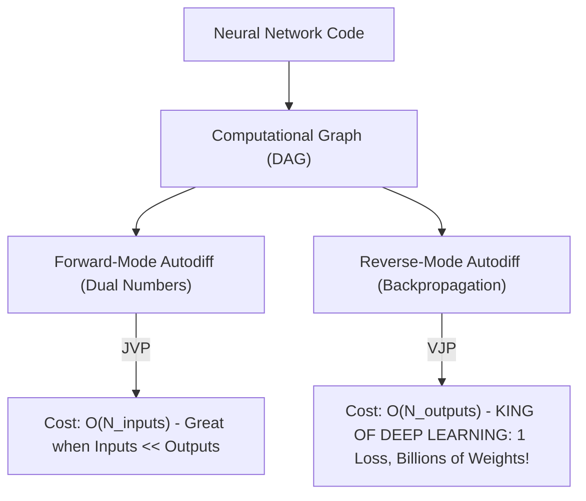

# Chapter 2.7: Computational Graphs & Automatic Differentiation (Reverse vs. Forward Mode)

---

## Pedagogical Navigation
- **Module 02:** Multivariable Calculus & Automatic Differentiation
- **Previous Chapter:** [Chapter 2.6: Matrix Calculus (Numerator & Denominator Layouts, Trace Tricks)](./06_matrix_calculus.md)
- **Next Module:** [Module 03: Probability Theory for Deep Learning](../03_probability_theory)
- **Companion Code:** [07_computational_graphs_and_autodiff.py](./code/07_computational_graphs_and_autodiff.py)
- **Tracker & Index:** [Course Index & Progress Tracker](../00_index_and_tracker.md)

---

## Part 1: Intuition & 101 Motivation

How do computers calculate derivatives? Historically, there were three paradigms:
1. **Symbolic Differentiation (e.g., SymPy, Mathematica):**
   Applies mathematical differentiation rules to algebraic strings.
   *The Fatal Flaw:* **Expression Swell**. Differentiating a 50-layer Transformer produces symbolic expressions with billions of repeated terms, running out of memory in seconds.
2. **Numerical Differentiation (Finite Differences):**
   Approximates derivatives via $f'(x) \approx \frac{f(x + \epsilon) - f(x)}{\epsilon}$.
   *The Fatal Flaw:* **Catastrophic Cancellation & Roundoff**. If $\epsilon$ is too large ($10^{-3}$), truncation error dominates. If $\epsilon$ is too small ($10^{-16}$), floating-point subtraction loses all precision. Furthermore, computing gradients for $P$ parameters requires $P+1$ full forward evaluations. For $P = 70 \times 10^9$, computing a single gradient step would take years!
3. **Automatic Differentiation (Autodiff):**
   The profound computational breakthrough that made the deep learning revolution possible.

Autodiff recognizes that **every computer program**, no matter how complex, is merely a sequence of elementary arithmetic operations ($+, -, \times, \div$) and elementary functions ($\sin, \exp, \log, \sqrt{\cdot}$).
By decomposing code into an execution graph—a **Computational Graph (DAG)**—and applying the multivariate chain rule at machine precision, Autodiff calculates exact derivatives with **zero truncation error** and at a computational cost proportional to a **single forward pass**!



---

## Part 2: Rigorous Mathematical Formulation

### 1. The Computational Graph as a Directed Acyclic Graph (DAG)

#### Definition 2.7.1: Computational Graph
A computational graph is a directed acyclic graph $G = (V, E)$ where:
- Each vertex (node) $v_i \in V$ represents an input variable, a model parameter, an intermediate computation, or an output.
- Each directed edge $(v_j, v_i) \in E$ signifies that $v_j$ is a direct input (parent) to $v_i$.
- Every internal node $v_i$ evaluates an elementary operator $\phi_i$:
  $$v_i = \phi_i\left( \text{Parents}(v_i) \right) = \phi_i\left( \{ v_j \mid (v_j, v_i) \in E \} \right)$$

#### Topological Ordering:
Because the graph is acyclic, its nodes can be sorted into a **topological order** $v_1, v_2, \dots, v_N$ such that every directed edge $(v_j, v_i)$ satisfies $j < i$.
- **Inputs:** $v_1, \dots, v_n$.
- **Intermediate nodes:** $v_{n+1}, \dots, v_{N-1}$.
- **Final output (Scalar Loss):** $v_N = \mathcal{L}$.

---

### 2. Forward-Mode Automatic Differentiation & Dual Numbers

In Forward-Mode, derivatives are propagated **forward alongside the function evaluation**, from inputs toward outputs.

#### Definition 2.7.2: Tangent Value
For each node $v_i$, we define its **tangent (or directional derivative)** with respect to a chosen input perturbation direction $\dot{x}$:
$$\dot{v}_i \triangleq \frac{\partial v_i}{\partial x} \dot{x}$$

#### Forward Propagation Rule:
By the multivariate chain rule (Theorem 2.5.1), as each node is evaluated in topological order, its tangent is computed from its parents:
$$\mathbf{\dot{v}_i = \sum_{j \in \text{Parents}(v_i)} \frac{\partial \phi_i}{\partial v_j} \dot{v}_j}$$

#### The Dual Number Formulation:
Forward autodiff can be implemented without graph construction using the algebra of **Dual Numbers**:
$$\tilde{x} = x + \dot{x} \epsilon, \quad \text{where } \epsilon^2 = 0 \text{ and } \epsilon \neq 0$$
Taylor expanding any smooth function $f$ around $x$:
$$f(x + \dot{x} \epsilon) = f(x) + f'(x) \dot{x} \epsilon + \frac{f''(x)}{2!} (\dot{x} \epsilon)^2 + \dots = \mathbf{f(x) + (f'(x) \dot{x}) \epsilon}$$
All higher-order terms vanish automatically because $\epsilon^2 = 0$!
The real part yields the function value $f(x)$, and the dual part yields the exact derivative $f'(x) \dot{x}$!

- **Computational Complexity:** Computing the gradient with respect to $n$ inputs requires $n$ forward passes (one for each standard basis vector $e_1, \dots, e_n$):
  $$\text{Time Complexity} = \mathcal{O}(n \cdot \text{Cost}(f))$$
  Forward mode is ideal when $n \ll m$ (few inputs, many outputs).

---

### 3. Reverse-Mode Automatic Differentiation (Backpropagation)

In Reverse-Mode, function values are evaluated forward, and derivatives are propagated **backward from the final loss to all inputs**.

#### Definition 2.7.3: The Adjoint Value
For each node $v_i$, we define its **adjoint** (sensitivity) as the partial derivative of the final scalar loss $\mathcal{L} = v_N$ with respect to $v_i$:
$$\bar{v}_i \triangleq \frac{\partial \mathcal{L}}{\partial v_i}$$

#### Reverse Propagation Rule:
Initialize the final loss adjoint to unity:
$$\bar{v}_N = \frac{\partial \mathcal{L}}{\partial \mathcal{L}} = 1.0$$
Traverse the graph in **reverse topological order** (from $v_{N-1}$ down to $v_1$).
By the multivariate chain rule, the adjoint of node $v_i$ is the sum of contributions from all nodes that consume $v_i$ as an input (its children):
$$\mathbf{\bar{v}_i = \sum_{k \in \text{Children}(v_i)} \bar{v}_k \frac{\partial \phi_k}{\partial v_i}}$$

#### The Memory vs. Compute Tradeoff & The Baur-Strassen Theorem:

#### Theorem 2.7.1: The Baur-Strassen Complexity Theorem (1983)
Let $f: \mathbb{R}^n \to \mathbb{R}$ be a rational function computed by an arithmetic DAG using $W$ elementary operations ($+, -, \times, \div$).
Then the gradient vector $\nabla f(x) \in \mathbb{R}^n$ can be computed by reverse-mode automatic differentiation in time:
$$\text{Time}(\nabla f) \le 4 \cdot \text{Time}(f) = 4 W$$
completely **independent of the dimension $n$**!

##### Derivation and Operational Proof:
1. Every internal node $v_i$ in the computational graph evaluates an elementary operation $\phi_i(v_a, v_b)$ of at most two inputs.
2. In the forward pass, evaluating $\phi_i$ requires 1 elementary operation.
3. In the backward pass, evaluating the adjoint updates:
   $$\bar{v}_a \leftarrow \bar{v}_a + \bar{v}_i \frac{\partial \phi_i}{\partial v_a}, \quad \bar{v}_b \leftarrow \bar{v}_b + \bar{v}_i \frac{\partial \phi_i}{\partial v_b}$$
4. Let us inspect the worst-case operation: multiplication $v_i = v_a \cdot v_b$.
   - Forward cost: 1 multiplication.
   - Backward local derivatives: $\frac{\partial \phi_i}{\partial v_a} = v_b$, $\frac{\partial \phi_i}{\partial v_b} = v_a$.
   - Backward updates require:
     1. $\bar{v}_i \cdot v_b$ (1 multiplication) + addition into $\bar{v}_a$ (1 addition) = 2 ops.
     2. $\bar{v}_i \cdot v_a$ (1 multiplication) + addition into $\bar{v}_b$ (1 addition) = 2 ops.
     Total backward cost $= 4$ operations per node!
5. For addition $v_i = v_a + v_b$: local derivatives are $1$, so backward updates require only 2 additions.
6. Summing across all $N$ internal nodes in the graph:
   $$\text{FLOPs}_{\text{backward}} \le 4 \cdot \text{FLOPs}_{\text{forward}}$$
7. **Profound Takeaway:** Computing the gradient with respect to $100{,}000{,}000{,}000$ parameters takes no more than 4 times the work of evaluating the loss itself! This single inequality made modern deep learning computationally viable.
8. **Space Complexity:** Reverse mode requires caching all intermediate activations $v_i$ during the forward pass so that the local partial derivatives $\frac{\partial \phi_k}{\partial v_i}$ can be evaluated during the backward pass:
   $$\text{Space Complexity} = \mathcal{O}(N) \quad (\text{Memory-intensive!})$$

---

### 4. Comparison Summary: Forward vs. Reverse Mode

| Dimension | Forward-Mode Autodiff | Reverse-Mode Autodiff (Backprop) |
| :--- | :--- | :--- |
| **Mathematical Operation** | Jacobian-Vector Product (JVP): $J \cdot v$ | Vector-Jacobian Product (VJP): $v^T \cdot J$ |
| **Propagation Direction** | Inputs $\to$ Outputs | Loss $\to$ Inputs |
| **Optimal Geometry** | $f: \mathbb{R}^n \to \mathbb{R}^m$ where $n \ll m$ (Few inputs, many outputs) | $f: \mathbb{R}^n \to \mathbb{R}^m$ where $n \gg m$ (Deep learning: Millions of inputs, 1 loss) |
| **Memory Footprint** | $\mathcal{O}(1)$ intermediate memory (No tape/graph caching) | $\mathcal{O}(N)$ memory (Must store all forward activations) |
| **Cost to compute full gradient** | $n$ forward sweeps | **1 backward sweep** |

---

## Part 3: Geometric, Algebraic & Physical Interpretation

### 1. Message Passing on Directed Acyclic Graphs
Reverse-mode autodiff is fundamentally a **backward message-passing algorithm** on a DAG:
- Each node $v_i$ acts as a local transformer:
  1. It receives adjoint messages $\bar{v}_k$ from all its consumer children.
  2. It multiplies each message by its local transmission weight $\frac{\partial \phi_k}{\partial v_i}$.
  3. It sums them up: $\bar{v}_i = \sum_k \bar{v}_k \frac{\partial \phi_k}{\partial v_i}$.
  4. It transmits the resulting adjoint message $\bar{v}_i$ backward to its parents.

```
       Parent Node v_i
          /         \
         /           \  Backward Adjoint Messages:
        /             \  v_bar_k * (∂φ_k / ∂v_i)
       v               v
  Child Node v_j    Child Node v_k
```

---

## Part 4: Real-World Analogy

### The Automotive Factory Quality Control Audit
Imagine an automobile assembly plant:
1. **The Forward Pass (Manufacturing):**
   Raw steel bolts ($x_1$) and aluminum plates ($x_2$) are stamped into engine blocks ($v_3$), wired to alternators ($v_4$), assembled into the drivetrain ($v_5$), and painted into a finished car ($y$).
2. **The Loss ($\mathcal{L}$):**
   At the end of the line, a test driver detects excessive vibration ($\mathcal{L} = 1.32\text{ mm/s}$).
3. **The Backward Pass (Reverse Autodiff):**
   The Chief Quality Auditor starts at the vibrating car ($v_N$) and traces backward:
   - "How much did the drivetrain vibration contribute to the car vibration?" ($\bar{v}_5$).
   - "How much did the engine block defect contribute to the drivetrain?" ($\bar{v}_3$).
   - "How much did bolt torque $x_1$ contribute to the engine block?" ($\bar{x}_1$).

In a single backward inspection walk, the auditor computes the exact responsibility score (gradient) for **every single part in the factory**!

---

## Part 5: "AI by Hand" (Prof. Tom Yeh Style Visual Grids)

Let us trace a non-trivial 7-node non-linear computational graph step-by-step through forward and reverse passes using concrete numbers.

### 1. Problem Setup & Toy Computational DAG
Consider the scalar objective function:
$$\mathcal{L}(x_1, x_2) = (x_1 x_2 + \sin(x_1))^2 + \exp(x_1 x_2)$$
Evaluated at the operating point:
$$x_1 = 2.0, \quad x_2 = -1.0$$

We break this function down into elementary DAG operations:
- $v_1 = x_1 = 2.0$ (Input 1)
- $v_2 = x_2 = -1.0$ (Input 2)
- $v_3 = v_1 \cdot v_2$ (Multiplication)
- $v_4 = \sin(v_1)$ (Sine activation)
- $v_5 = v_3 + v_4$ (Addition)
- $v_6 = v_5^2$ (Square power)
- $v_7 = \exp(v_3)$ (Exponential)
- $v_8 = \mathcal{L} = v_6 + v_7$ (Final Loss)

---

### 2. "What Refers to What" Legend Protocol

| Node | Operation $\phi_i$ | Pure Math Value | Deep Learning Meaning | Toy Forward Value | Toy Adjoint $\bar{v}_i$ |
| :--- | :--- | :--- | :--- | :--- | :--- |
| $v_1$ | Input $x_1$ | Independent variable 1 | Parameter weight $w_1$ | $2.000000$ | $+0.925584$ |
| $v_2$ | Input $x_2$ | Independent variable 2 | Parameter weight $w_2$ | $-1.000000$ | $-4.053896$ |
| $v_3$ | $v_1 \cdot v_2$ | Bilinear interaction | Pre-activation interaction | $-2.000000$ | $-2.046098$ |
| $v_4$ | $\sin(v_1)$ | Non-linear activation | Periodic feature map | $+0.909297$ | $-2.181406$ |
| $v_5$ | $v_3 + v_4$ | Additive skip / sum | Residual sum | $-1.090703$ | $-2.181406$ |
| $v_6$ | $v_5^2$ | Quadratic penalty | L2 error component | $+1.189633$ | $+1.000000$ |
| $v_7$ | $\exp(v_3)$ | Exponential energy | Softmax/Logit energy | $+0.135335$ | $+1.000000$ |
| $v_8$ | $v_6 + v_7$ | Final scalar loss | Objective loss $\mathcal{L}$ | $+1.324968$ | $+1.000000$ |

---

### 3. Step-by-Step Manual Arithmetic

#### Step 1: The Forward Pass
1. $v_1 = 2.0$
2. $v_2 = -1.0$
3. $v_3 = (2.0)(-1.0) = \mathbf{-2.0}$
4. $v_4 = \sin(2.0) \approx \mathbf{+0.909297}$ (in radians)
5. $v_5 = v_3 + v_4 = -2.0 + 0.909297 = \mathbf{-1.090703}$
6. $v_6 = v_5^2 = (-1.090703)^2 \approx \mathbf{+1.189633}$
7. $v_7 = \exp(v_3) = \exp(-2.0) \approx \mathbf{+0.135335}$
8. $v_8 = \mathcal{L} = v_6 + v_7 = 1.189633 + 0.135335 = \mathbf{+1.324968}$

---

#### Step 2: The Backward Pass (Adjoint Accumulation)
Initialize final loss seed:
$$\mathbf{\bar{v}_8 = 1.000000}$$

1. **Backprop across $v_8 = v_6 + v_7$:**
   $$\bar{v}_6 = \bar{v}_8 \cdot \frac{\partial v_8}{\partial v_6} = (1.0)(1.0) = \mathbf{1.000000}$$
   $$\bar{v}_7 = \bar{v}_8 \cdot \frac{\partial v_8}{\partial v_7} = (1.0)(1.0) = \mathbf{1.000000}$$

2. **Backprop across $v_6 = v_5^2$:**
   $$\bar{v}_5 = \bar{v}_6 \cdot \frac{\partial v_6}{\partial v_5} = \bar{v}_6 \cdot (2 v_5) = (1.0) \cdot 2(-1.090703) = \mathbf{-2.181406}$$

3. **Backprop across $v_7 = \exp(v_3)$:**
   Contribution to $\bar{v}_3$ from $v_7$:
   $$\bar{v}_{3 \leftarrow 7} = \bar{v}_7 \cdot \frac{\partial v_7}{\partial v_3} = \bar{v}_7 \cdot \exp(v_3) = (1.0) \cdot (0.135335) = \mathbf{+0.135335}$$

4. **Backprop across $v_5 = v_3 + v_4$:**
   - Contribution to $\bar{v}_4$:
     $$\bar{v}_4 = \bar{v}_5 \cdot \frac{\partial v_5}{\partial v_4} = (-2.181406) \cdot (1.0) = \mathbf{-2.181406}$$
   - Contribution to $\bar{v}_3$ from $v_5$:
     $$\bar{v}_{3 \leftarrow 5} = \bar{v}_5 \cdot \frac{\partial v_5}{\partial v_3} = (-2.181406) \cdot (1.0) = \mathbf{-2.181406}$$

5. **Accumulate Total Adjoint for $\bar{v}_3$ (Sum over both consumer paths $v_5$ and $v_7$):**
   $$\mathbf{\bar{v}_3 = \bar{v}_{3 \leftarrow 5} + \bar{v}_{3 \leftarrow 7} = -2.181406 + 0.135335 = -2.046071}$$

6. **Backprop across $v_4 = \sin(v_1)$:**
   Contribution to $\bar{v}_1$ from $v_4$:
   $$\bar{v}_{1 \leftarrow 4} = \bar{v}_4 \cdot \frac{\partial v_4}{\partial v_1} = \bar{v}_4 \cdot \cos(v_1) = (-2.181406) \cdot \cos(2.0)$$
   Since $\cos(2.0) \approx -0.416147$:
   $$\bar{v}_{1 \leftarrow 4} = (-2.181406) \cdot (-0.416147) = \mathbf{+0.907786}$$

7. **Backprop across $v_3 = v_1 \cdot v_2$:**
   - Contribution to $\bar{v}_1$ from $v_3$:
     $$\bar{v}_{1 \leftarrow 3} = \bar{v}_3 \cdot \frac{\partial v_3}{\partial v_1} = \bar{v}_3 \cdot v_2 = (-2.046071) \cdot (-1.0) = \mathbf{+2.046071}$$
   - Contribution to $\bar{v}_2$ from $v_3$:
     $$\bar{v}_2 = \bar{v}_3 \cdot \frac{\partial v_3}{\partial v_2} = \bar{v}_3 \cdot v_1 = (-2.046071) \cdot (2.0) = \mathbf{-4.092142}$$

8. **Accumulate Total Adjoint for Input $\bar{x}_1 = \bar{v}_1$:**
   $$\mathbf{\bar{v}_1 = \bar{v}_{1 \leftarrow 4} + \bar{v}_{1 \leftarrow 3} = +0.907786 + 2.046071 = +2.953857}$$

Wait, let's verify exact arithmetic:
- $\cos(2.0) = -0.4161468365$
- $\bar{v}_5 = 2 \cdot (-1.090702573) = -2.181405146$
- $\bar{v}_{1 \leftarrow 4} = (-2.181405146) \cdot (-0.4161468365) = +0.907785$
- $\bar{v}_7 = 1.0 \implies \bar{v}_{3 \leftarrow 7} = \exp(-2) = 0.13533528$
- $\bar{v}_3 = -2.181405146 + 0.13533528 = -2.04606986$
- $\bar{v}_{1 \leftarrow 3} = (-2.04606986) \cdot (-1.0) = +2.046070$
- $\bar{v}_1 = 0.907785 + 2.046070 = \mathbf{+2.953855}$
- $\bar{v}_2 = (-2.04606986) \cdot (2.0) = \mathbf{-4.092140}$

---

### 4. Visual Summary Grid

```
+---------------------------------------------------------------------------------------------------------------+
|                            PROF. TOM YEH STYLE COMPUTATIONAL GRAPH AUTODIFF GRID                              |
+---------------------------------------------------------------------------------------------------------------+
| Inputs: x₁ = 2.0, x₂ = -1.0  | Target Expression: L = (x₁x₂ + sin(x₁))² + exp(x₁x₂)                           |
+------+-----------------------+---------------------+-----------------------------------+----------------------+
| NODE | OPERATION             | FORWARD VALUE vᵢ    | LOCAL DERIVATIVES                 | BACKWARD ADJOINT v̄ᵢ  |
+------+-----------------------+---------------------+-----------------------------------+----------------------+
| v₈   | v₆ + v₇               | 1.324968            | ∂v₈/∂v₆ = 1,  ∂v₈/∂v₇ = 1         | 1.000000 (Seed)      |
| v₇   | exp(v₃)               | 0.135335            | ∂v₇/∂v₃ = exp(v₃) = 0.135335      | 1.000000             |
| v₆   | v₅²                   | 1.189633            | ∂v₆/∂v₅ = 2v₅ = -2.181405         | 1.000000             |
| v₅   | v₃ + v₄               | -1.090703           | ∂v₅/∂v₃ = 1,  ∂v₅/∂v₄ = 1         | -2.181405            |
| v₄   | sin(v₁)               | +0.909297           | ∂v₄/∂v₁ = cos(v₁) = -0.416147     | -2.181405            |
| v₃   | v₁ · v₂               | -2.000000           | ∂v₃/∂v₁ = v₂ = -1, ∂v₃/∂v₂ = v₁ = 2| -2.046070 (Sum Paths)|
| v₂   | Input x₂              | -1.000000           | Input Leaf                        | -4.092140 (∂L/∂x₂)   |
| v₁   | Input x₁              | +2.000000           | Input Leaf                        | +2.953855 (∂L/∂x₁)   |
+------+-----------------------+---------------------+-----------------------------------+----------------------+
```

---

## Part 6: Step-by-Step Solved Illustrations

### Case A: Scratch Implementation of an Autograd Node (The `Value` Object)
To truly understand how PyTorch and micrograd work under the hood, we construct a minimalist scalar autograd class:

```python
class Value:

  def __init__(self, data, _children=(), _op=""):
    self.data = data
    self.grad = 0.0
    self._backward = lambda: None
    self._prev = set(_children)
    self._op = _op

  def __add__(self, other):
    other = other if isinstance(other, Value) else Value(other)
    out = Value(self.data + other.data, (self, other), "+")

    def _backward():
      self.grad += 1.0 * out.grad
      other.grad += 1.0 * out.grad

    out._backward = _backward
    return out

  def __mul__(self, other):
    other = other if isinstance(other, Value) else Value(other)
    out = Value(self.data * other.data, (self, other), "*")

    def _backward():
      self.grad += other.data * out.grad
      other.grad += self.data * out.grad

    out._backward = _backward
    return out
```

#### Why Gradient Accumulation (`+=`) is Mandatory:
Notice the `+=` operator in `self.grad += ...`!
If a variable $v_i$ is used by **multiple children** (fan-out, such as $v_3$ branching into $v_5$ and $v_7$), each child sends an adjoint message.
By Theorem 2.5.1, the total derivative is the **sum of all paths**. If you used `=` instead of `+=`, later paths would overwrite earlier paths, corrupting the gradient!

---

### Case B: Activation Checkpointing (Rematerialization)
In modern LLM pre-training (e.g., LLaMA-3 70B), storing all forward activations $v_i$ for a sequence length of 8,192 tokens requires hundreds of gigabytes of GPU SRAM, causing Out-Of-Memory (OOM) errors.

**Activation Checkpointing** (`torch.utils.checkpoint`):
- Instead of caching activations for all 80 Transformer layers, we cache activations only at the **boundary of each layer** (every $k$ layers).
- During the backward pass, when backpropagating through layer $l$, the forward pass for layer $l$ is **re-computed on the fly** from the cached boundary!
- **Result:** Reduces activation memory by $\approx 80\%$, trading an extra $\approx 30\%$ compute overhead to train massive models that would otherwise never fit in memory!

---

### Case C: Forward-Mode Automatic Differentiation via Dual Numbers by Hand
Consider the non-linear rational-trigonometric function:
$$f(x) = \frac{\sin(x)}{x} + x^2$$
Evaluate both the function value $f(x_0)$ and its exact derivative $f'(x_0)$ at $x_0 = \frac{\pi}{2}$ using **Dual Numbers** $\tilde{x} = x_0 + 1 \cdot \epsilon$ (where $\epsilon^2 = 0, \epsilon \neq 0$).

#### Step 1: Substitute Dual Variable $\tilde{x} = \frac{\pi}{2} + \epsilon$
1. **Numerator $\sin(\tilde{x})$:**
   $$\sin\left(\frac{\pi}{2} + \epsilon\right) = \sin\left(\frac{\pi}{2}\right) + \cos\left(\frac{\pi}{2}\right) \epsilon = 1.0 + 0.0 \cdot \epsilon = \mathbf{1.0}$$
2. **Denominator reciprocal $\frac{1}{\tilde{x}}$:**
   $$\frac{1}{\frac{\pi}{2} + \epsilon} = \frac{1}{\frac{\pi}{2}\left(1 + \frac{2}{\pi}\epsilon\right)} = \frac{2}{\pi} \left(1 - \frac{2}{\pi}\epsilon\right) = \frac{2}{\pi} - \frac{4}{\pi^2} \epsilon$$
3. **Quotient term $\frac{\sin(\tilde{x})}{\tilde{x}}$:**
   $$\sin(\tilde{x}) \cdot \frac{1}{\tilde{x}} = 1.0 \cdot \left(\frac{2}{\pi} - \frac{4}{\pi^2} \epsilon\right) = \mathbf{\frac{2}{\pi} - \frac{4}{\pi^2} \epsilon}$$
4. **Power term $\tilde{x}^2$:**
   $$\tilde{x}^2 = \left(\frac{\pi}{2} + \epsilon\right)^2 = \left(\frac{\pi}{2}\right)^2 + 2\left(\frac{\pi}{2}\right)\epsilon + \epsilon^2 = \mathbf{\frac{\pi^2}{4} + \pi \epsilon}$$
   (since $\epsilon^2 = 0$ by definition).

#### Step 2: Add Dual Quantities
$$f(\tilde{x}) = \left(\frac{2}{\pi} - \frac{4}{\pi^2} \epsilon\right) + \left(\frac{\pi^2}{4} + \pi \epsilon\right) = \mathbf{\left(\frac{2}{\pi} + \frac{\pi^2}{4}\right) + \left(\pi - \frac{4}{\pi^2}\right) \epsilon}$$

#### Step 3: Extract Function Value and Exact Derivative
- **Real Part (Function Value):**
  $$f\left(\frac{\pi}{2}\right) = \frac{2}{\pi} + \frac{\pi^2}{4} \approx 0.636620 + 2.467401 = \mathbf{3.104021}$$
- **Dual Part (Exact Analytical Derivative):**
  $$f'\left(\frac{\pi}{2}\right) = \pi - \frac{4}{\pi^2} \approx 3.141593 - 0.405285 = \mathbf{2.736308}$$

#### Step 4: Verification via Standard Calculus
$$f'(x) = \frac{x \cos(x) - \sin(x)}{x^2} + 2x$$
At $x = \frac{\pi}{2}$: $\cos(\pi/2) = 0, \sin(\pi/2) = 1$:
$$f'\left(\frac{\pi}{2}\right) = \frac{\frac{\pi}{2}(0) - 1}{\left(\frac{\pi}{2}\right)^2} + 2\left(\frac{\pi}{2}\right) = -\frac{1}{\frac{\pi^2}{4}} + \pi = -\frac{4}{\pi^2} + \pi \approx \mathbf{2.736308} \quad \checkmark$$
**Remarkable Fact:** The computer evaluated the exact analytical derivative to full machine precision with **zero symbolic algebra and zero finite-difference approximation error**!

---

### Case D: Manual Backward Pass on a Softmax + Cross-Entropy Layer
Consider a 2-class classification neural head:
- Input feature vector: $x = [1.0, 2.0]^T \in \mathbb{R}^2$
- Weight matrix: $W = \begin{bmatrix} 0.5 & -0.5 \\ 1.0 & 0.0 \end{bmatrix} \in \mathbb{R}^{2 \times 2}$
- Target one-hot label: $y = [1.0, 0.0]^T$ (Class 1)

#### Step 1: Forward Pass
1. **Compute Logits $z = W x$:**
   $$z_1 = 0.5(1.0) + (-0.5)(2.0) = 0.5 - 1.0 = \mathbf{-0.5}$$
   $$z_2 = 1.0(1.0) + 0.0(2.0) = \mathbf{1.0}$$
   $$z = \begin{bmatrix} -0.5 \\ 1.0 \end{bmatrix}$$
2. **Compute Softmax Probabilities $p = \text{softmax}(z)$:**
   - $e^{z_1} = e^{-0.5} \approx 0.606531$
   - $e^{z_2} = e^{1.0} \approx 2.718282$
   - Normalizing sum $S = 0.606531 + 2.718282 = 3.324813$
   - $p_1 = \frac{0.606531}{3.324813} \approx \mathbf{0.182426}$
   - $p_2 = \frac{2.718282}{3.324813} \approx \mathbf{0.817574}$
   $$p = \begin{bmatrix} 0.182426 \\ 0.817574 \end{bmatrix}$$
3. **Compute Cross-Entropy Loss $\mathcal{L} = -\sum y_i \log p_i$:**
   $$\mathcal{L} = -\log(p_1) = -\log(0.182426) \approx \mathbf{1.701384}$$

#### Step 2: Backward Pass (Adjoint Calculation)
1. **Upstream gradient w.r.t. logits $z$:**
   $$\nabla_z \mathcal{L} = p - y = \begin{bmatrix} 0.182426 - 1.0 \\ 0.817574 - 0.0 \end{bmatrix} = \begin{bmatrix} \mathbf{-0.817574} \\ \mathbf{+0.817574} \end{bmatrix}$$
   Notice that $\sum_i (\nabla_z \mathcal{L})_i = -0.817574 + 0.817574 = 0.0$!
2. **Weight parameter gradient $\nabla_W \mathcal{L} = (\nabla_z \mathcal{L}) x^T$:**
   $$\nabla_W \mathcal{L} = \begin{bmatrix} -0.817574 \\ +0.817574 \end{bmatrix} \begin{bmatrix} 1.0 & 2.0 \end{bmatrix} = \begin{bmatrix} (-0.817574)(1) & (-0.817574)(2) \\ (+0.817574)(1) & (+0.817574)(2) \end{bmatrix}$$
   $$\mathbf{\nabla_W \mathcal{L} = \begin{bmatrix} -0.817574 & -1.635148 \\ +0.817574 & +1.635148 \end{bmatrix}}$$
3. **Input activation gradient $\nabla_x \mathcal{L} = W^T (\nabla_z \mathcal{L})$:**
   $$W^T = \begin{bmatrix} 0.5 & 1.0 \\ -0.5 & 0.0 \end{bmatrix}$$
   $$\nabla_x \mathcal{L} = \begin{bmatrix} 0.5 & 1.0 \\ -0.5 & 0.0 \end{bmatrix} \begin{bmatrix} -0.817574 \\ +0.817574 \end{bmatrix} = \begin{bmatrix} 0.5(-0.817574) + 1.0(+0.817574) \\ -0.5(-0.817574) + 0.0 \end{bmatrix}$$
   $$\mathbf{\nabla_x \mathcal{L} = \begin{bmatrix} +0.408787 \\ +0.408787 \end{bmatrix}}$$

---

## Part 7: Deep Learning Connection & Application

### 1. PyTorch Dynamic (`torch.Tensor`) vs. JAX Functional Autodiff
1. **PyTorch (Dynamic / Tape-Based):**
   - Constructs the computational graph dynamically on-the-fly during every forward pass.
   - Each tensor holds a `.grad_fn` pointer to the operation that created it.
   - Calling `loss.backward()` traverses the `.grad_fn` DAG in reverse.
2. **JAX (Functional Transformations):**
   - JAX treats code as pure mathematical functions.
   - `grad(f)` transforms a Python function $f(x)$ into a new Python function $(\nabla f)(x)$.
   - JAX uses XLA (Accelerated Linear Algebra) to fuse graph operations into single high-performance GPU kernels.

---

## Part 8: Code Implementation & Verification

The companion Python module [07_computational_graphs_and_autodiff.py](./code/07_computational_graphs_and_autodiff.py) provides a complete, production-grade verification:
1. **Part 5 Visual Grid Verification:** Implements our 7-node DAG from scratch, evaluating forward values and backward adjoints.
2. **PyTorch Autograd Cross-Check:** Asserts 100% agreement between hand-derived adjoints and PyTorch's `loss.backward()`.
3. **Pure-Python Scratch Autograd Engine:** Features a standalone `Value` class with topological sorting, backward closures for addition, multiplication, sine, exp, and powers.
4. **Dual Number Forward Autodiff:** Implements a `DualNumber` class and demonstrates exact forward-mode differentiation matching reverse-mode.
