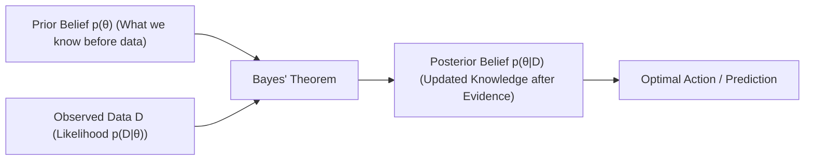

# Chapter 3.1: Probability Foundations, Axioms & Bayes' Theorem

---

## Pedagogical Navigation
- **Module 03:** Probability Theory for Deep Learning
- **Previous Module:** [Module 02: Multivariable Calculus & Automatic Differentiation](../02_multivariable_calculus)
- **Next Chapter:** [Chapter 3.2: Random Variables (Discrete vs. Continuous), PMF, PDF, CDF](./02_random_variables_pmf_pdf_cdf.md)
- **Companion Code:** [01_probability_foundations_and_bayes.py](./code/01_probability_foundations_and_bayes.py)
- **Tracker & Index:** [Course Index & Progress Tracker](../00_index_and_tracker.md)

---

## Part 1: Intuition & 101 Motivation

Why is probability theory the bedrock of machine learning?
A deterministic computer program executes rules: `if x > 0: return 1`.
However, real-world data is inherently **uncertain**:
1. **Aleatoric Uncertainty (Noise in the World):**
   Sensors are noisy, pixel measurements vary under fluctuating lighting, audio recordings have background static, and human annotators disagree on image labels.
2. **Epistemic Uncertainty (Ignorance in the Model):**
   Our training dataset is only a tiny finite sample of the infinite universe of possible images or sentences. When a self-driving car encounters a visual scene unlike anything in its training data, how confident should it be?

Without probability theory, a neural network is an overconfident black box that will output incorrect predictions with $99.9\%$ confidence.
With probability theory:
- Classification heads output calibrated **probability distributions** (via Softmax).
- Training is formulated as **Maximum Likelihood Estimation (MLE)** or **Maximum A Posteriori (MAP)**.
- Generative models (VAEs, Diffusion, LLMs) model the true **data-generating distribution** $p_{\text{data}}(x)$.

Probability theory provides the mathematical language for reasoning under uncertainty. At the crown of this theory sits **Bayes' Theorem**: the universal formula for updating beliefs in the light of new evidence.



---

## Part 2: Rigorous Mathematical Formulation

### 1. The Measure-Theoretic Probability Space $(\Omega, \mathcal{F}, P)$

In modern mathematics (formalized by Andrey Kolmogorov in 1933), a probability model is defined by a rigorous **probability space**: a triplet $(\Omega, \mathcal{F}, P)$.

#### Definition 3.1.1: The Sample Space $\Omega$
The **sample space** $\Omega$ is the set of all possible fundamental outcomes of a random experiment.
- A coin toss: $\Omega = \{\text{Heads}, \text{Tails}\}$.
- A pixel intensity: $\Omega = [0, 255]$ or $[0, 1] \subset \mathbb{R}$.
- An image of size $256 \times 256 \times 3$: $\Omega = \mathbb{R}^{196608}$.

#### Definition 3.1.2: The Event Space ($\sigma$-Algebra) $\mathcal{F}$
An **event** $E \subseteq \Omega$ is a subset of outcomes.
The collection of all valid events is a $\sigma$-algebra $\mathcal{F}$ satisfying three axioms:
1. $\Omega \in \mathcal{F}$ (the certain event is in $\mathcal{F}$).
2. If $E \in \mathcal{F}$, then its complement $E^c = \Omega \setminus E \in \mathcal{F}$ (closure under complementation).
3. If $E_1, E_2, \dots \in \mathcal{F}$, then their countable union $\bigcup_{i=1}^\infty E_i \in \mathcal{F}$ (closure under countable unions).

#### Definition 3.1.3: Kolmogorov's Three Axioms of Probability
A **probability measure** is a function $P: \mathcal{F} \to [0, 1]$ satisfying:
1. **Axiom 1 (Non-negativity):**
   $$\forall E \in \mathcal{F}, \quad P(E) \ge 0$$
2. **Axiom 2 (Normalization / Unit Measure):**
   $$P(\Omega) = 1.0$$
3. **Axiom 3 (Countable Additivity):**
   For any countable sequence of pairwise disjoint events $E_1, E_2, \dots$ ($E_i \cap E_j = \emptyset$ for $i \neq j$):
   $$P\left( \bigcup_{i=1}^\infty E_i \right) = \sum_{i=1}^\infty P(E_i)$$

---

### 2. Fundamental Corollaries of the Axioms

From Kolmogorov's three axioms, all classic probability laws follow by deduction:

#### Corollary 3.1.1: Complement Rule
$$P(E^c) = 1 - P(E)$$
*Proof:* Since $E \cup E^c = \Omega$ and $E \cap E^c = \emptyset$, by Axioms 2 and 3:
$$P(\Omega) = P(E \cup E^c) = P(E) + P(E^c) = 1 \implies P(E^c) = 1 - P(E). \quad \blacksquare$$

#### Corollary 3.1.2: Empty Set Probability
$$P(\emptyset) = 0$$
*Proof:* $\emptyset = \Omega^c \implies P(\emptyset) = 1 - P(\Omega) = 1 - 1 = 0. \quad \blacksquare$

#### Corollary 3.1.3: Monotonicity
If $A \subseteq B$, then $P(A) \le P(B)$.
*Proof:* Decompose $B = A \cup (B \setminus A)$ where $A$ and $(B \setminus A)$ are disjoint.
$$P(B) = P(A) + P(B \setminus A) \ge P(A) \quad (\text{since } P(B \setminus A) \ge 0). \quad \blacksquare$$

#### Corollary 3.1.4: Inclusion-Exclusion Principle
For any two events $A$ and $B$ (not necessarily disjoint):
$$P(A \cup B) = P(A) + P(B) - P(A \cap B)$$

#### Corollary 3.1.5: Boole's Inequality (Union Bound)
For any finite or countable collection of events $E_1, E_2, \dots$:
$$P\left( \bigcup_{i=1}^n E_i \right) \le \sum_{i=1}^n P(E_i)$$
> **Deep Learning Role:** The Union Bound is the foundational tool in **Statistical Learning Theory** and PAC learning to bound the probability that *any* model in a hypothesis class overfits!

---

### 3. Conditional Probability & The Product Rule

#### Definition 3.1.4: Conditional Probability
Let $A, B \in \mathcal{F}$ with $P(B) > 0$. The **conditional probability of $A$ given that $B$ has occurred**, denoted $P(A \mid B)$, is defined as:
$$P(A \mid B) \triangleq \frac{P(A \cap B)}{P(B)}$$

#### Geometric Meaning:
Conditioning on $B$ **restricts the sample space** from the entire universe $\Omega$ down to the smaller universe $B$.
The probability of $A$ inside this new universe is the fraction of $B$ that overlaps with $A$, rescaled by $\frac{1}{P(B)}$ so that the new total probability $P(B \mid B) = 1$.

#### Theorem 3.1.1: The Product Rule (Multiplication Rule)
Rearranging Definition 3.1.4 gives:
$$P(A \cap B) = P(A \mid B) P(B) = P(B \mid A) P(A)$$
For $n$ joint events, applying this recursively yields the **General Chain Rule of Probability**:
$$\mathbf{P(E_1 \cap E_2 \cap \dots \cap E_n) = P(E_1) P(E_2 \mid E_1) P(E_3 \mid E_1 \cap E_2) \dots P(E_n \mid \bigcap_{i=1}^{n-1} E_i)}$$
> **Deep Learning Role:** This exact formula powers all **Autoregressive Large Language Models (LLMs)**!
> $$P(\text{token}_1, \dots, \text{token}_T) = \prod_{t=1}^T P(\text{token}_t \mid \text{token}_1, \dots, \text{token}_{t-1})$$

---

### 4. Partitions & The Law of Total Probability

#### Definition 3.1.5: Partition of the Sample Space
A collection of events $\{B_1, B_2, \dots, B_K\}$ forms a **partition** of $\Omega$ if:
1. They are mutually exclusive: $B_i \cap B_j = \emptyset$ for all $i \neq j$.
2. They are collectively exhaustive: $\bigcup_{k=1}^K B_k = \Omega$.
3. $P(B_k) > 0$ for all $k$.

#### Theorem 3.1.2: Law of Total Probability
Let $\{B_1, \dots, B_K\}$ be a partition of $\Omega$. For any arbitrary event $A \in \mathcal{F}$:
$$\mathbf{P(A) = \sum_{k=1}^K P(A \cap B_k) = \sum_{k=1}^K P(A \mid B_k) P(B_k)}$$

##### Formal Proof:
1. Express $A$ as an intersection with the entire sample space:
   $$A = A \cap \Omega = A \cap \left( \bigcup_{k=1}^K B_k \right)$$
2. By the distributive law of set theory:
   $$A = \bigcup_{k=1}^K (A \cap B_k)$$
3. Since $B_i \cap B_j = \emptyset$, the subsets $(A \cap B_k)$ are pairwise disjoint.
4. By Kolmogorov's Axiom 3 (Additivity):
   $$P(A) = \sum_{k=1}^K P(A \cap B_k)$$
5. Substitute the product rule $P(A \cap B_k) = P(A \mid B_k) P(B_k)$:
   $$P(A) = \sum_{k=1}^K P(A \mid B_k) P(B_k). \quad \blacksquare$$

---

### 5. Bayes' Theorem: The Engine of Inference

#### Theorem 3.1.3: Bayes' Theorem
Let $\{B_1, \dots, B_K\}$ be a partition of $\Omega$, and let $A$ be an observed event with $P(A) > 0$.
The conditional probability of hypothesis $B_j$ given observation $A$ is:
$$\mathbf{P(B_j \mid A) = \frac{P(A \mid B_j) P(B_j)}{P(A)} = \frac{P(A \mid B_j) P(B_j)}{\sum_{k=1}^K P(A \mid B_k) P(B_k)}}$$

##### The Four Pillars of Bayesian Terminology:
$$\mathbf{\text{Posterior} = \frac{\text{Likelihood} \times \text{Prior}}{\text{Evidence}}}$$

1. **Prior Probability $P(B_j)$:**
   Our initial belief in the probability of hypothesis $B_j$ *before* observing data $A$.
2. **Likelihood $P(A \mid B_j)$:**
   The probability that evidence $A$ would be observed *if* hypothesis $B_j$ were true.
3. **Evidence (Marginal Likelihood) $P(A) = \sum_k P(A \mid B_k) P(B_k)$:**
   The total probability of observing evidence $A$ across all possible hypotheses. Acts as a normalizing constant ensuring $\sum_j P(B_j \mid A) = 1$.
4. **Posterior Probability $P(B_j \mid A)$:**
   Our updated belief in hypothesis $B_j$ *after* incorporating evidence $A$.

---

### 6. Statistical Independence vs. Conditional Independence

#### Definition 3.1.6: Mutual Independence
Two events $A$ and $B$ are **statistically independent** ($A \perp B$) if and only if:
$$P(A \cap B) = P(A) P(B)$$
Equivalently, if $P(B) > 0$:
$$P(A \mid B) = P(A)$$
Learning that $B$ occurred provides **zero information** about the occurrence of $A$.

#### Definition 3.1.7: Conditional Independence
Two events $A$ and $B$ are **conditionally independent given $C$** ($A \perp B \mid C$) if and only if:
$$P(A \cap B \mid C) = P(A \mid C) P(B \mid C)$$
Equivalently:
$$P(A \mid B, C) = P(A \mid C)$$
Once the state of $C$ is known, learning $B$ gives no additional information about $A$.

> [!WARNING]
> Independence does **NOT** imply conditional independence!
> Conversely, conditional independence does **NOT** imply marginal independence!
> - Example: Two unfair coins whose biases are both governed by the temperature in the room. Unconditionally, their flips are correlated (marginally dependent). Once the temperature is measured and fixed, the flips become independent!

---

## Part 3: Geometric, Algebraic & Physical Interpretation

### 1. The Venn Diagram as a Probability Measure
Think of the sample space $\Omega$ as a square sheet of paper with area equal to $1.0$.
- Any event $A$ is a patch of ink on the paper with area $P(A) \in [0, 1]$.
- The joint event $A \cap B$ is the overlapping ink area.
- Conditioned on $B$: We cut out the region $B$ with scissors, discard the rest of the paper, and magnify $B$ until its area equals $1.0$. The new fraction occupied by $A$ is precisely $\frac{\text{Area}(A \cap B)}{\text{Area}(B)} = P(A \mid B)$.

```
     Sample Space Ω (Total Area = 1.0)
    +-----------------------------------------------+
    |                                               |
    |      +---------------+                        |
    |      |       A       |                        |
    |      |         +-----+---------+              |
    |      |         |  A∩B|    B    |              |
    |      |         +-----+         |              |
    |      +---------------+         |              |
    |                +---------------+              |
    |                                               |
    +-----------------------------------------------+
```

---

## Part 4: Real-World Analogy

### The Medical Diagnostic Test & The Base Rate Fallacy
Imagine a rare disease affects $1$ in every $1{,}000$ people ($0.1\%$ prevalence).
A biotech lab designs a test with $99\%$ accuracy:
- **Sensitivity (True Positive Rate):** If you have the disease, the test is positive $99\%$ of the time ($P(T^+ \mid D) = 0.99$).
- **Specificity (True Negative Rate):** If you are healthy, the test is negative $99\%$ of the time ($P(T^- \mid \neg D) = 0.99 \implies$ False positive rate $P(T^+ \mid \neg D) = 0.01$).

You take the test, and it returns **Positive ($T^+$)**.
What is the probability that you actually have the disease?
Most doctors and patients guess $\approx 99\%$.

**The Actual Math via Bayes' Theorem:**
- Prior: $P(D) = 0.001$, $P(\neg D) = 0.999$.
- Likelihoods: $P(T^+ \mid D) = 0.99$, $P(T^+ \mid \neg D) = 0.01$.
- Total positive evidence (Law of Total Probability):
  $$P(T^+) = (0.99)(0.001) + (0.01)(0.999) = 0.00099 + 0.00999 = 0.01098$$
- Posterior:
  $$P(D \mid T^+) = \frac{0.00099}{0.01098} \approx \mathbf{9.02\%}!$$
Despite a $99\%$ accurate test, a positive result means there is only a **$9\%$ chance** you are sick!
Why? Because healthy people outnumber sick people 999 to 1. The sheer volume of false positives from the healthy population dwarfs the true positives from the sick population!

---

## Part 5: "AI by Hand" (Prof. Tom Yeh Style Visual Grids)

Let us solve a complete Bayesian spam classifier inference problem cell-by-cell using concrete numbers.

### 1. Problem Setup & Toy Corpus
A spam filter evaluates emails for the keyword `"crypto"`.
We have:
1. **Prior Probabilities:**
   - $P(\text{Spam}) = 0.20$ (20% of all incoming emails are spam).
   - $P(\text{Ham}) = 0.80$ (80% are legitimate).
2. **Likelihood of containing keyword `"crypto"` ($W$):**
   - If an email is Spam, probability it contains `"crypto"` is $70\%$:
     $$P(W \mid \text{Spam}) = 0.70$$
   - If an email is Ham, probability it contains `"crypto"` is only $5\%$:
     $$P(W \mid \text{Ham}) = 0.05$$

An incoming email contains the word `"crypto"`. What is the posterior probability that it is Spam?

---

### 2. "What Refers to What" Legend Protocol

| Symbol | Pure Math Role | Deep Learning Meaning | Toy Value in Walkthrough |
| :--- | :--- | :--- | :--- |
| $\text{Spam} (S)$ | Hypothesis event $B_1$ | Class label $y = 1$ | $P(S) = 0.20$ |
| $\text{Ham} (H)$ | Hypothesis event $B_2$ | Class label $y = 0$ | $P(H) = 0.80$ |
| $W$ | Conditioning evidence event $A$ | Feature presence / token match | Word `"crypto"` observed |
| $P(W \mid S)$ | Conditional likelihood | Class-conditional feature likelihood | $0.70$ |
| $P(W \mid H)$ | False alarm likelihood | Class-conditional feature likelihood | $0.05$ |
| $P(W \cap S)$ | Joint probability | Co-occurrence probability | $(0.70)(0.20) = 0.140$ |
| $P(W \cap H)$ | Joint probability | Co-occurrence probability | $(0.05)(0.80) = 0.040$ |
| $P(W)$ | Marginal evidence | Normalizing constant (denominator) | $0.140 + 0.040 = 0.180$ |
| $P(S \mid W)$ | Posterior probability | Model output prediction $\hat{y}$ | $\frac{0.140}{0.180} \approx 0.7778$ ($77.8\%$) |

---

### 3. Step-by-Step Manual Arithmetic

#### Step 1: Compute Joint Probabilities (Numerator Terms)
- Joint probability of being Spam AND containing `"crypto"`:
  $$P(W \cap S) = P(W \mid S) P(S) = (0.70) \times (0.20) = \mathbf{0.1400}$$
- Joint probability of being Ham AND containing `"crypto"`:
  $$P(W \cap H) = P(W \mid H) P(H) = (0.05) \times (0.80) = \mathbf{0.0400}$$

#### Step 2: Compute Marginal Evidence $P(W)$ via Law of Total Probability
Sum the joint probabilities across all mutually exclusive email categories:
$$P(W) = P(W \cap S) + P(W \cap H) = 0.1400 + 0.0400 = \mathbf{0.1800}$$
(Exactly $18\%$ of all emails in the system contain the word `"crypto"`).

#### Step 3: Compute Posterior Probabilities via Bayes' Rule
- **Posterior for Spam:**
  $$P(S \mid W) = \frac{P(W \cap S)}{P(W)} = \frac{0.1400}{0.1800} = \frac{14}{18} = \frac{7}{9} \approx \mathbf{0.777778} \quad (\mathbf{77.78\%})$$
- **Posterior for Ham:**
  $$P(H \mid W) = \frac{P(W \cap H)}{P(W)} = \frac{0.0400}{0.1800} = \frac{4}{18} = \frac{2}{9} \approx \mathbf{0.222222} \quad (\mathbf{22.22\%})$$

Notice that:
$$P(S \mid W) + P(H \mid W) = \frac{7}{9} + \frac{2}{9} = 1.000000 \quad \checkmark$$

The observation of the word `"crypto"` caused our belief that the email is Spam to surge from a prior of **$20\%$** to a posterior of **$77.8\%$**!

---

### 4. Visual Summary Grid

```
+-----------------------------------------------------------------------------------------------+
|                       PROF. TOM YEH STYLE BAYES' THEOREM CONTINGENCY GRID                     |
+-----------------------------------------------------------------------------------------------+
| Priors: P(Spam) = 0.20, P(Ham) = 0.80       | Likelihoods: P(W|Spam) = 0.70, P(W|Ham) = 0.05 |
+-----------------------+---------------------+---------------------+---------------------------+
| CLASS (HYPOTHESIS)    | PRIOR P(Class)      | LIKELIHOOD P(W|C)   | JOINT P(W ∩ C) (P · L)    |
+-----------------------+---------------------+---------------------+---------------------------+
| Spam (S)              | 0.2000 (20%)        | 0.7000 (70%)        | 0.20 * 0.70 = 0.1400      |
| Ham  (H)              | 0.8000 (80%)        | 0.0500 ( 5%)        | 0.80 * 0.05 = 0.0400      |
+-----------------------+---------------------+---------------------+---------------------------+
| TOTAL EVIDENCE P(W):  | 1.0000              |                     | SUM = 0.1800 (18% total)  |
+-----------------------+---------------------+---------------------+---------------------------+
| POSTERIOR PROBABILITIES AFTER OBSERVING "crypto" (W):                                         |
|                                                                                               |
|   P(Spam | W) = Joint / Evidence = 0.1400 / 0.1800 = 7/9  = 0.7778 ( 77.78% SPAM! )          |
|   P(Ham  | W) = Joint / Evidence = 0.0400 / 0.1800 = 2/9  = 0.2222 ( 22.22% HAM  )          |
+-----------------------------------------------------------------------------------------------+
```

---

## Part 6: Step-by-Step Solved Illustrations

### Case A: The Naive Bayes Classifier Formula Derivation
In a multi-feature classification task, we observe a feature vector $x = [x_1, x_2, \dots, x_D]^T$ and want to predict class label $y \in \{1, \dots, K\}$.
By Bayes' rule:
$$P(y = c \mid x) = \frac{P(x \mid y = c) P(y = c)}{P(x)}$$

#### The "Naive" Conditional Independence Assumption:
Modeling the full joint likelihood $P(x_1, \dots, x_D \mid y = c)$ is intractable because it requires estimating $2^D$ parameters.
The **Naive Bayes assumption** asserts that **all features are conditionally independent given the class label $y$**:
$$P(x_1, \dots, x_D \mid y = c) = \prod_{d=1}^D P(x_d \mid y = c)$$
Substitute this into Bayes' rule:
$$\mathbf{P(y = c \mid x) = \frac{P(y = c) \prod_{d=1}^D P(x_d \mid y = c)}{\sum_{k=1}^K P(y = k) \prod_{d=1}^D P(x_d \mid y = k)}}$$
To classify a new sample, we choose the class maximizing the numerator (taking logs avoids underflow):
$$\hat{y} = \arg\max_{c} \left[ \log P(y = c) + \sum_{d=1}^D \log P(x_d \mid y = c) \right]$$

---

### Case B: Simpson's Paradox (Reversal of Conditional Probabilities)
Consider a new medical treatment tested on men and women:
- **Among Men:** Treatment success rate ($70\%$) > Control success rate ($60\%$).
- **Among Women:** Treatment success rate ($40\%$) > Control success rate ($30\%$).
*The treatment is strictly superior for men, and strictly superior for women!*
Can the treatment be **worse overall** when we pool the data?

**Yes! (Simpson's Paradox):**
Suppose:
- Men test group: 90 treated (63 cured = 70%), 10 control (6 cured = 60%).
- Women test group: 10 treated (4 cured = 40%), 90 control (27 cured = 30%).
Combined Totals:
- **Treated Group:** $\frac{63 + 4}{90 + 10} = \frac{67}{100} = \mathbf{67\%}$
- **Control Group:** $\frac{6 + 27}{10 + 90} = \frac{33}{100} = \mathbf{33\%}$
Wait, let us reverse the sample sizes to show the paradox!
Suppose:
- Men: 10 treated (7 cured = 70%), 100 control (60 cured = 60%).
- Women: 100 treated (40 cured = 40%), 10 control (3 cured = 30%).
Combined:
- **Treated:** $\frac{7 + 40}{10 + 100} = \frac{47}{110} \approx \mathbf{42.7\%}$
- **Control:** $\frac{60 + 3}{100 + 10} = \frac{63}{110} \approx \mathbf{57.3\%}$!
The treatment appears to **harm** patients in the aggregate, even though it helps every demographic!
Why? Because the confounding variable (gender) was heavily unbalanced across the test arms.
Conditioning on the correct variables via probability theory is essential to avoid lethal causal errors.

---

## Part 7: Deep Learning Connection & Application

### 1. Maximum A Posteriori (MAP) and Weight Decay Equivalence
In deep learning, we seek optimal network weights $\theta$ given training dataset $\mathcal{D}$:
$$p(\theta \mid \mathcal{D}) = \frac{p(\mathcal{D} \mid \theta) p(\theta)}{p(\mathcal{D})}$$
Taking the negative logarithm:
$$-\log p(\theta \mid \mathcal{D}) = -\log p(\mathcal{D} \mid \theta) - \log p(\theta) + \text{const}$$

1. **Maximum Likelihood Estimation (MLE):** Assumes a uniform (flat) prior $p(\theta) = \text{const}$:
   $$\theta_{\text{MLE}} = \arg\min_\theta [-\log p(\mathcal{D} \mid \theta)] = \arg\min_\theta \mathcal{L}_{\text{data}}(\theta)$$
2. **Maximum A Posteriori (MAP) with Gaussian Prior:**
   Assume weights have a zero-mean isotropic Gaussian prior: $\theta \sim \mathcal{N}(0, \sigma^2 I)$:
   $$p(\theta) = \prod_{i} \frac{1}{\sqrt{2\pi}\sigma} \exp\left( -\frac{\theta_i^2}{2\sigma^2} \right)$$
   $$-\log p(\theta) = \sum_i \frac{\theta_i^2}{2\sigma^2} + \text{const} = \frac{1}{2\sigma^2} \|\theta\|_2^2$$
   Substitute into MAP:
   $$\mathbf{\theta_{\text{MAP}} = \arg\min_\theta \left[ \mathcal{L}_{\text{data}}(\theta) + \frac{1}{2\sigma^2} \|\theta\|_2^2 \right]}$$

> **Theorem:** **$L_2$ Regularization (Weight Decay)** in neural networks is mathematically identical to MAP estimation under an independent Gaussian prior on the weights, with weight decay coefficient $\lambda = \frac{1}{\sigma^2}$!
> Similarly, **$L_1$ Lasso Regularization** ($\lambda \|\theta\|_1$) is identical to MAP estimation under an independent **Laplace prior**!

---

## Part 8: Code Implementation & Verification

The companion Python module [01_probability_foundations_and_bayes.py](./code/01_probability_foundations_and_bayes.py) provides full verification:
1. **Part 5 Spam Filter Bayesian Grid:** Verifies exact joint probabilities ($0.14, 0.04$), total evidence ($0.18$), and posterior ($7/9 \approx 0.777778$).
2. **Medical Diagnosis Base Rate Fallacy Simulation:** Runs $1{,}000{,}000$ synthetic patients to empirically verify $P(D \mid T^+) \approx 9.02\%$.
3. **Naive Bayes Text Classifier from Scratch:** Implements training (frequency counting) and inference on a multi-feature text dataset.
4. **Simpson's Paradox Verification:** Numerically confirms reversal of aggregated conditional distributions.
5. **MAP vs. Weight Decay Numerical Optimization:** Demonstrates exact parameter trajectory equivalence between Gaussian log-prior optimization and PyTorch $L_2$ penalty.
