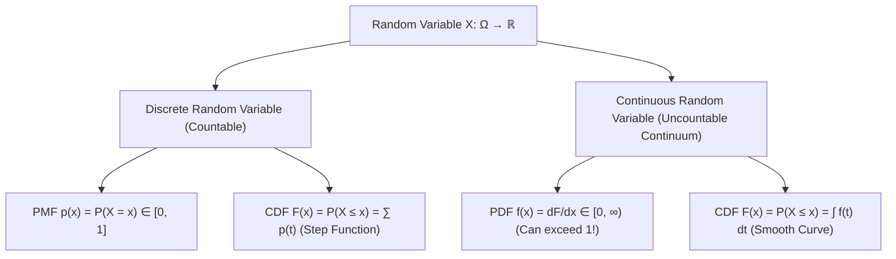

# Chapter 3.2: Random Variables (Discrete vs. Continuous), PMF, PDF, CDF

---

## Pedagogical Navigation
- **Module 03:** Probability Theory for Deep Learning
- **Previous Chapter:** [Chapter 3.1: Probability Foundations, Axioms & Bayes' Theorem](./01_probability_foundations_and_bayes.md)
- **Next Chapter:** [Chapter 3.3: Expectation, Variance, Covariance & Covariance Matrices](./03_expectation_variance_covariance.md)
- **Companion Code:** [02_random_variables_pmf_pdf_cdf.py](./code/02_random_variables_pmf_pdf_cdf.py)
- **Tracker & Index:** [Course Index & Progress Tracker](../00_index_and_tracker.md)

---

## Part 1: Intuition & 101 Motivation

In everyday speech, the phrase *"random variable"* sounds like a number that changes unpredictably.
In mathematics, a **random variable is neither random nor a variable**.
It is a **deterministic function**:
$$X: \Omega \to \mathbb{R}$$
that takes an abstract real-world outcome $\omega$ from the sample space and translates it into a precise numerical value $x \in \mathbb{R}$.
- In Computer Vision: $\omega$ is a physical cat in the real world $\to X(\omega)$ is a $256 \times 256 \times 3$ tensor of pixel intensities in $[0, 255]$.
- In NLP: $\omega$ is an English word $\to X(\omega) \in \{1, 2, \dots, 32000\}$ is its discrete token ID in the vocabulary.

When transitioning from discrete counts to continuous signals, human intuition frequently breaks:
> *"If I pick a real number uniformly between $0$ and $1$, what is the probability that I pick the exact number $0.50000000\dots$?"*
> The answer is **strictly zero**: $P(X = 0.5) = 0$.
> In fact, for any continuous distribution, the probability of hitting *any specific number* is exactly zero!

To navigate machine learning without falling into mathematical traps, you must master the three representations of random variables:
1. **PMF (Probability Mass Function):** For discrete quantities (tokens, classes).
2. **PDF (Probability Density Function):** For continuous quantities (latents, audio, images).
3. **CDF (Cumulative Distribution Function):** The universal, unified representation valid for both.



---

## Part 2: Rigorous Mathematical Formulation

### 1. Formal Definition of a Random Variable

Let $(\Omega, \mathcal{F}, P)$ be a probability space.

#### Definition 3.2.1: Random Variable (Borel Measurable Function)
A **random variable** $X$ is a function $X: \Omega \to \mathbb{R}$ such that for every threshold $t \in \mathbb{R}$, the pre-image event belongs to the $\sigma$-algebra $\mathcal{F}$:
$$\forall t \in \mathbb{R}, \quad \{ \omega \in \Omega \mid X(\omega) \le t \} \in \mathcal{F}$$
This measurability condition guarantees that we can assign a valid probability to statements like $P(X \le t)$.

---

### 2. The Cumulative Distribution Function (CDF)

The CDF is the universal foundation of probability theory because it exists for **all** random variables (discrete, continuous, and mixed).

#### Definition 3.2.2: Cumulative Distribution Function (CDF)
The **Cumulative Distribution Function (CDF)** of a random variable $X$, denoted $F_X: \mathbb{R} \to [0, 1]$, is defined as:
$$F_X(x) \triangleq P(X \le x)$$

#### Theorem 3.2.1: Fundamental Properties of CDFs
Any valid CDF $F_X(x)$ must satisfy four mathematical properties:
1. **Monotonically Non-Decreasing:**
   $$x_1 < x_2 \implies F_X(x_1) \le F_X(x_2)$$
2. **Lower Asymptotic Limit:**
   $$\lim_{x \to -\infty} F_X(x) = 0$$
3. **Upper Asymptotic Limit:**
   $$\lim_{x \to +\infty} F_X(x) = 1$$
4. **Right-Continuous with Left Limits (CÀDLÀG):**
   $$\lim_{h \to 0^+} F_X(x + h) = F_X(x)$$

#### Computing Interval Probabilities via CDF:
For any interval $(a, b]$ where $a < b$:
$$\mathbf{P(a < X \le b) = F_X(b) - F_X(a)}$$

---

### 3. Discrete Random Variables & Probability Mass Functions (PMF)

A random variable $X$ is **discrete** if its range $\mathcal{X} = \{x_1, x_2, \dots\}$ is finite or countably infinite.

#### Definition 3.2.3: Probability Mass Function (PMF)
The **PMF** of a discrete random variable $X$ is the function $p_X: \mathbb{R} \to [0, 1]$:
$$p_X(x) \triangleq P(X = x)$$

#### PMF Axioms:
1. **Non-negativity & Boundedness:** $0 \le p_X(x) \le 1$ for all $x$.
2. **Total Mass Sums to 1:**
   $$\sum_{x \in \mathcal{X}} p_X(x) = 1.0$$
3. **Relation to CDF:** The CDF of a discrete variable is a right-continuous **staircase step function**:
   $$F_X(x) = \sum_{x_i \le x} p_X(x_i)$$
   with jump discontinuities of height $p_X(x_i)$ at each point mass $x_i$.

---

### 4. Continuous Random Variables & Probability Density Functions (PDF)

A random variable $X$ is **continuous** if its CDF $F_X(x)$ is continuous everywhere and differentiable almost everywhere.

#### Definition 3.2.4: Probability Density Function (PDF)
A non-negative integrable function $f_X: \mathbb{R} \to [0, \infty)$ is the **PDF** of $X$ if for all $x \in \mathbb{R}$:
$$F_X(x) = \int_{-\infty}^x f_X(t) \, dt$$
By the Fundamental Theorem of Calculus, at points where $f_X$ is continuous:
$$\mathbf{f_X(x) = \frac{d}{dx} F_X(x)}$$

#### Critical Properties of PDFs (The Traps that Catch Practitioners):
1. **$f_X(x)$ is NOT a probability:**
   $f_X(x)$ is a **probability per unit length** (density).
   While probabilities are strictly bounded in $[0, 1]$, **a probability density can be arbitrarily large ($\gg 1$) or even infinite!**
   *Example:* If $X \sim \text{Uniform}[0, 0.1]$, then $f_X(x) = \frac{1}{0.1 - 0} = \mathbf{10.0}$ for $x \in [0, 0.1]$!
2. **Total Area Normalization:**
   $$\int_{-\infty}^\infty f_X(x) \, dx = 1.0$$
3. **Probability of a Single Point is Exactly Zero:**
   $$P(X = c) = \int_c^c f_X(x) \, dx = 0.0$$
   Consequently, strict vs. non-strict inequalities are identical for continuous variables:
   $$P(a \le X \le b) = P(a < X \le b) = P(a \le X < b) = P(a < X < b) = \int_a^b f_X(x) \, dx$$
4. **Infinitesimal Probability:**
   For an infinitesimally small interval $dx$:
   $$P(x \le X \le x + dx) \approx f_X(x) \, dx$$

---

### 5. Change of Variables Formula (1D & Multivariate)

Suppose $X$ is a continuous random variable with PDF $f_X(x)$, and we transform it via a smooth, monotonic function $Y = g(X)$.
What is the PDF $f_Y(y)$ of the transformed variable $Y$?

#### Theorem 3.2.2: 1D Change of Variables Theorem
If $g: \mathbb{R} \to \mathbb{R}$ is strictly monotonic (strictly increasing or strictly decreasing) and continuously differentiable with inverse $x = g^{-1}(y)$, then:
$$\mathbf{f_Y(y) = f_X(g^{-1}(y)) \cdot \left| \frac{d}{dy} g^{-1}(y) \right| = f_X(x) \cdot \left| \frac{dx}{dy} \right| = \frac{f_X(x)}{\left| g'(x) \right|}}$$

##### Formal Proof:
1. Case 1: $g$ is strictly increasing ($g'(x) > 0$).
   $$F_Y(y) = P(Y \le y) = P(g(X) \le y) = P(X \le g^{-1}(y)) = F_X(g^{-1}(y))$$
   Differentiate both sides with respect to $y$ using the chain rule:
   $$f_Y(y) = \frac{d}{dy} F_X(g^{-1}(y)) = f_X(g^{-1}(y)) \frac{d}{dy} g^{-1}(y)$$
2. Case 2: $g$ is strictly decreasing ($g'(x) < 0$).
   $$F_Y(y) = P(Y \le y) = P(g(X) \le y) = P(X \ge g^{-1}(y)) = 1 - F_X(g^{-1}(y))$$
   Differentiate with respect to $y$:
   $$f_Y(y) = -f_X(g^{-1}(y)) \frac{d}{dy} g^{-1}(y) = f_X(g^{-1}(y)) \left( -\frac{d}{dy} g^{-1}(y) \right)$$
3. Combining both cases with the absolute value:
   $$f_Y(y) = f_X(g^{-1}(y)) \left| \frac{d}{dy} g^{-1}(y) \right|. \quad \blacksquare$$

---

#### Theorem 3.2.2b: General Multi-Branch (Non-Monotonic) Change of Variables
When the transformation $Y = g(X)$ is **not strictly monotonic** (e.g., $g(x) = x^2$), a single output $y$ may originate from multiple distinct input roots $x_1, x_2, \dots, x_k$ such that $g(x_k) = y$.
In this case, the total density is the sum of probability densities contributed by each local branch:
$$\mathbf{f_Y(y) = \sum_{k: g(x_k) = y} \frac{f_X(x_k)}{\left| g'(x_k) \right|}}$$

##### Derivation (Deriving the $\chi^2(1)$ Distribution from Standard Normal):
1. Let $X \sim \mathcal{N}(0, 1)$ with PDF $f_X(x) = \frac{1}{\sqrt{2\pi}} e^{-x^2/2}$, and let $Y = X^2$.
2. For $y > 0$, the equation $x^2 = y$ has exactly two roots:
   $$x_1 = +\sqrt{y}, \quad x_2 = -\sqrt{y}$$
3. Differentiate the transformation $g(x) = x^2 \implies g'(x) = 2x$:
   $$|g'(x_1)| = |2\sqrt{y}| = 2\sqrt{y}, \quad |g'(x_2)| = |-2\sqrt{y}| = 2\sqrt{y}$$
4. Apply the multi-branch formula:
   $$f_Y(y) = \frac{f_X(\sqrt{y})}{2\sqrt{y}} + \frac{f_X(-\sqrt{y})}{2\sqrt{y}} = \frac{\frac{1}{\sqrt{2\pi}} e^{-y/2}}{2\sqrt{y}} + \frac{\frac{1}{\sqrt{2\pi}} e^{-y/2}}{2\sqrt{y}} = \frac{2 \frac{1}{\sqrt{2\pi}} e^{-y/2}}{2\sqrt{y}}$$
   $$\mathbf{f_Y(y) = \frac{1}{\sqrt{2\pi y}} e^{-y/2} = \frac{1}{2^{1/2} \Gamma(1/2)} y^{1/2 - 1} e^{-y/2}, \quad y > 0}$$
5. This proves from first principles that the square of a standard Gaussian is identically a **Chi-squared distribution with 1 degree of freedom** ($\chi^2(1)$)! $\blacksquare$

---

#### Multivariate Extension (Normalizing Flows Foundation):
If $Y = g(X)$ where $g: \mathbb{R}^D \to \mathbb{R}^D$ is a bijective, differentiable transformation with Jacobian matrix $J_g(x) = \frac{\partial g}{\partial x}$ (from Chapter 2.3):
$$\mathbf{p_Y(y) = p_X(g^{-1}(y)) \cdot \left| \det \left( J_{g^{-1}}(y) \right) \right| = p_X(x) \cdot \left| \det \left( J_g(x) \right) \right|^{-1}}$$
Taking the logarithm:
$$\mathbf{\log p_Y(y) = \log p_X(x) - \log \left| \det J_g(x) \right|}$$
This is the core mathematical objective function of **Normalizing Flows** (RealNVP, Glow, FFJORD)!

---

## Part 3: Geometric, Algebraic & Physical Interpretation

### 1. Physical Analogy: Linear Mass Density vs. Point Masses
- **Discrete Random Variable (Point Masses):**
  Imagine a wire with physical lead beads soldered at specific coordinates $x = 1, 2, 3$.
  Each bead has a measurable mass $p(x) = 0.33\text{ kg}$.
- **Continuous Random Variable (Continuous Density):**
  Imagine a smooth iron rod where the mass is distributed continuously along its length.
  - The density at point $x$ is $f(x) = \frac{dm}{dx} \text{ [kg/meter]}$.
  - An infinitely thin cross-section of the rod at coordinate $x = 1.5000000$ has **zero mass** ($m = 0$).
  - Mass only exists over a finite interval $[a, b]$: $m = \int_a^b f(x) \, dx$.

### 2. Inverse Transform Sampling (The Universal Generator)
How does PyTorch generate samples from arbitrary probability distributions?

#### Theorem 3.2.3: Probability Integral Transform
Let $X$ have continuous and strictly increasing CDF $F_X$.
1. If $X \sim F_X$, then the transformed variable $U = F_X(X)$ is uniformly distributed:
   $$U \sim \text{Uniform}(0, 1)$$
2. Conversely, if $U \sim \text{Uniform}(0, 1)$, then:
   $$\mathbf{X = F_X^{-1}(U) \sim F_X}$$

*Proof:*
$$P(F_X^{-1}(U) \le x) = P(U \le F_X(x)) = F_X(x) \quad (\text{since } P(U \le u) = u \text{ for uniform } U). \quad \blacksquare$$
This means any distribution whose CDF can be inverted can be sampled using a simple uniform random number generator!

---

## Part 4: Real-World Analogy

### The Rain Gauge vs. The Weather Radar
1. **The CDF (The Bucket Volume):**
   You leave a cylindrical rain gauge in your garden overnight.
   The total water depth in the bucket at time $t$ is $F(t)$.
   - At midnight ($t = 0$), $F(0) = 0\text{ mm}$.
   - The water level can only rise or stay constant (monotonicity).
   - By morning ($t = 8\text{ hr}$), the storm has passed and $F(8) = 50\text{ mm}$ ($100\%$ of total rain).
2. **The PDF (The Instantaneous Rainfall Intensity):**
   The weather radar measures how hard it is raining right now: $f(t) = \frac{dF}{dt}\text{ [mm/hour]}$.
   - During a cloudburst at 3 AM, the rainfall rate might spike to $f(3) = 120\text{ mm/hour}$ (density can far exceed 1!).
   - The rain that fell in that single, exact microsecond at 3:00:00.0000 AM is 0 mm. Rain only accumulates over a span of time.

---

## Part 5: "AI by Hand" (Prof. Tom Yeh Style Visual Grids)

Let us solve a complete continuous distribution and Change-of-Variables problem step-by-step using concrete numbers.

### 1. Problem Setup & Triangular Distribution
Consider a continuous random variable $X$ with the classic **Triangular PDF** supported on $[0, 2]$:
$$f_X(x) = \begin{cases} 
x, & 0 \le x \le 1 \\ 
2 - x, & 1 < x \le 2 \\ 
0, & \text{otherwise} 
\end{cases}$$

We will:
1. Verify total probability integrates to $1.0$.
2. Derive the analytical CDF $F_X(x)$.
3. Compute exact numerical values at test points $x \in \{0.5, 1.0, 1.5\}$.
4. Compute the interval probability $P(0.5 < X \le 1.5)$.
5. Apply the affine transformation $Y = 2 X + 1$ and find $f_Y(y)$ at $y = 3.0$.

---

### 2. "What Refers to What" Legend Protocol

| Symbol | Pure Math Role | Deep Learning Meaning | Toy Value in Walkthrough |
| :--- | :--- | :--- | :--- |
| $X$ | Base continuous random variable | Latent variable $z$ | Supported on $[0, 2]$ |
| $f_X(x)$ | Probability Density Function (PDF) | Likelihood density $p(z)$ | Triangular profile |
| $F_X(x)$ | Cumulative Distribution Function (CDF) | Cumulative quantile | Piecewise quadratic curve |
| $P(0.5 < X \le 1.5)$ | Interval probability | Mass within confidence region | $0.750$ ($75\%$) |
| $Y = g(X) = 2X + 1$ | Transformed random variable | Layer forward mapping $y = W x + b$ | Support: $[1, 5]$ |
| $\left\vert \frac{dx}{dy} \right\vert$ | 1D Jacobian determinant | Layer volume contraction factor | $\left\vert \frac{1}{2} \right\vert = 0.5$ |
| $f_Y(3.0)$ | Transformed density | Normalizing flow output density | $0.500000$ |

---

### 3. Step-by-Step Manual Arithmetic

#### Step 1: Verify Normalization $\int_{-\infty}^\infty f_X(x) dx = 1.0$
Split the integral into two regions:
$$\int_0^2 f_X(x) \, dx = \int_0^1 x \, dx + \int_1^2 (2 - x) \, dx$$
- First region:
  $$\int_0^1 x \, dx = \left[ \frac{x^2}{2} \right]_0^1 = \frac{1}{2} - 0 = 0.5$$
- Second region:
  $$\int_1^2 (2 - x) \, dx = \left[ 2x - \frac{x^2}{2} \right]_1^2 = \left( 2(2) - \frac{4}{2} \right) - \left( 2(1) - \frac{1}{2} \right) = (4 - 2) - (2 - 0.5) = 2 - 1.5 = 0.5$$
$$\text{Total Area} = 0.5 + 0.5 = \mathbf{1.000000} \quad \checkmark$$

---

#### Step 2: Derive the Analytical CDF $F_X(x) = \int_0^x f_X(t) dt$
- **Region 1 ($0 \le x \le 1$):**
  $$F_X(x) = \int_0^x t \, dt = \mathbf{\frac{x^2}{2}}$$
- **Region 2 ($1 < x \le 2$):**
  Accumulate area from Region 1 ($0.5$) plus integral over second piece:
  $$F_X(x) = 0.5 + \int_1^x (2 - t) \, dt = 0.5 + \left[ 2t - \frac{t^2}{2} \right]_1^x = 0.5 + \left( 2x - \frac{x^2}{2} \right) - (2 - 0.5)$$
  $$F_X(x) = 0.5 + 2x - \frac{x^2}{2} - 1.5 = \mathbf{2x - \frac{x^2}{2} - 1}$$

Verify continuity at $x = 1$:
- From left: $F_X(1) = \frac{1^2}{2} = 0.5$.
- From right: $F_X(1) = 2(1) - \frac{1}{2} - 1 = 2 - 1.5 = 0.5$. Continuous! $\checkmark$
Verify boundary at $x = 2$:
- $F_X(2) = 2(2) - \frac{2^2}{2} - 1 = 4 - 2 - 1 = 1.0$. $\checkmark$

---

#### Step 3: Evaluate PDF & CDF at Three Evaluation Points
1. **At $x = 0.5$:**
   - $f_X(0.5) = x = \mathbf{0.500000}$
   - $F_X(0.5) = \frac{(0.5)^2}{2} = \frac{0.25}{2} = \mathbf{0.125000}$
2. **At $x = 1.0$ (The Peak):**
   - $f_X(1.0) = \mathbf{1.000000}$
   - $F_X(1.0) = \frac{1^2}{2} = \mathbf{0.500000}$
3. **At $x = 1.5$:**
   - $f_X(1.5) = 2 - x = 2 - 1.5 = \mathbf{0.500000}$
   - $F_X(1.5) = 2(1.5) - \frac{(1.5)^2}{2} - 1 = 3.0 - \frac{2.25}{2} - 1 = 2.0 - 1.125 = \mathbf{0.875000}$

---

#### Step 4: Compute Interval Probability $P(0.5 < X \le 1.5)$
$$P(0.5 < X \le 1.5) = F_X(1.5) - F_X(0.5) = 0.875000 - 0.125000 = \mathbf{0.750000} \quad (\mathbf{75.0\%})$$

---

#### Step 5: Change of Variables for $Y = 2 X + 1$
Let $Y = g(X) = 2 X + 1$.
1. Invert the function:
   $$x = g^{-1}(y) = \frac{y - 1}{2}$$
2. Compute the Jacobian derivative:
   $$\frac{dx}{dy} = \frac{d}{dy}\left( \frac{y - 1}{2} \right) = \frac{1}{2} \implies \left| \frac{dx}{dy} \right| = \mathbf{0.5}$$
3. Apply Theorem 3.2.2:
   $$f_Y(y) = f_X\left( \frac{y - 1}{2} \right) \cdot \left| \frac{dx}{dy} \right| = f_X\left( \frac{y - 1}{2} \right) \cdot 0.5$$

Let us evaluate $f_Y(y)$ at $y = 3.0$:
- Inverse input: $x = \frac{3 - 1}{2} = 1.0$.
- Base density: $f_X(1.0) = 1.0$.
- Transformed density:
  $$f_Y(3.0) = f_X(1.0) \times 0.5 = 1.0 \times 0.5 = \mathbf{0.500000}$$

Notice how the density was **cut in half** because the linear transformation $Y = 2X+1$ stretched the domain from width $2$ ($[0, 2]$) to width $4$ ($[1, 5]$). Total area remains $1.0$!

---

### 4. Visual Summary Grid

```
+-----------------------------------------------------------------------------------------------+
|                       PROF. TOM YEH STYLE CONTINUOUS PDF / CDF GRID                           |
+-----------------------------------------------------------------------------------------------+
| Base Distribution: Triangular on [0, 2]     | Transformation: Y = 2X + 1 (Stretches to [1, 5])|
+-------+-------------------+---------------------+---------------------+-----------------------+
| POINT | REGION FORMULA    | PDF VALUE f_X(x)    | CDF VALUE F_X(x)    | GEOMETRIC ROLE        |
+-------+-------------------+---------------------+---------------------+-----------------------+
| x=0.0 | Boundary          | 0.000000            | 0.000000 (0%)       | Left Support Edge     |
| x=0.5 | f(x)=x, F(x)=x²/2 | 0.500000            | 0.125000 (12.5%)    | First Quartile Region |
| x=1.0 | Peak mode         | 1.000000            | 0.500000 (50.0%)    | Median & Mode         |
| x=1.5 | f(x)=2-x          | 0.500000            | 0.875000 (87.5%)    | Third Quartile Region |
| x=2.0 | Boundary          | 0.000000            | 1.000000 (100%)     | Right Support Edge    |
+-------+-------------------+---------------------+---------------------+-----------------------+
| INTERVAL PROBABILITY:  P(0.5 < X ≤ 1.5) = F(1.5) - F(0.5) = 0.875 - 0.125 = 0.7500 (75.0%)   |
| CHANGE OF VARIABLES:   f_Y(3.0) = f_X(1.0) · |dx/dy| = 1.000 · 0.500 = 0.500000                |
+-----------------------------------------------------------------------------------------------+
```

---

## Part 6: Step-by-Step Solved Illustrations

### Case A: Inverse Transform Sampling for the Exponential Distribution
Let $X \sim \text{Exponential}(\lambda)$ with PDF $f_X(x) = \lambda e^{-\lambda x}$ for $x \ge 0$.
Derive the exact algorithm to generate samples of $X$ from uniform random numbers $U \sim \text{Uniform}(0, 1)$.

#### Step 1: Compute the CDF $F_X(x)$
$$F_X(x) = \int_0^x \lambda e^{-\lambda t} \, dt = \left[ -e^{-\lambda t} \right]_0^x = 1 - e^{-\lambda x}$$

#### Step 2: Invert the CDF $F_X(x) = u$
Set $1 - e^{-\lambda x} = u$:
$$e^{-\lambda x} = 1 - u \implies -\lambda x = \log(1 - u) \implies x = -\frac{1}{\lambda} \log(1 - u)$$
Since $(1 - u) \sim \text{Uniform}(0, 1)$ whenever $u \sim \text{Uniform}(0, 1)$, we can simplify:
$$\mathbf{X = -\frac{\log(U)}{\lambda}}$$
This is the standard, exact sampling algorithm used in NumPy's `np.random.exponential`!

---

### Case B: The Dirac Delta Function as Generalized PDF
Can discrete random variables be treated with calculus?
Yes, using the **Dirac Delta function** $\delta(x)$, defined by:
$$\delta(x - c) = 0 \text{ for } x \neq c, \quad \text{and} \quad \int_{-\infty}^\infty \delta(x - c) \, dx = 1$$
A discrete PMF $P(X = x_i) = p_i$ can be written as a generalized continuous PDF:
$$f_X(x) = \sum_{i} p_i \delta(x - x_i)$$
Integrating to get the CDF:
$$F_X(x) = \int_{-\infty}^x \sum_i p_i \delta(t - x_i) \, dt = \sum_{x_i \le x} p_i H(x - x_i)$$
where $H(x)$ is the Heaviside step function.
This unifies discrete and continuous probability under the single framework of **Lebesgue integration**!

---

### Case C: Non-Linear Transformation $Y = X^2$ on an Asymmetric Uniform Distribution
Let $X \sim \text{Uniform}(-1, 2)$ with probability density:
$$f_X(x) = \begin{cases} \frac{1}{3}, & -1 \le x \le 2 \\ 0, & \text{otherwise} \end{cases}$$
Find the complete probability density function $f_Y(y)$ of the transformed variable $Y = X^2$.

#### Step 1: Identify Output Range and Pre-Images
Because $-1 \le X \le 2$, the transformed variable spans $Y \in [0, 4]$.
For any $y > 0$, the roots of $g(x) = x^2 = y$ are:
$$x_1 = -\sqrt{y}, \quad x_2 = +\sqrt{y}$$
The derivative is $g'(x) = 2x \implies |g'(x_1)| = |g'(x_2)| = 2\sqrt{y}$.

#### Step 2: Apply Multi-Branch Formula across Piecewise Regions
By Theorem 3.2.2b:
$$f_Y(y) = \sum_{k} \frac{f_X(x_k)}{|g'(x_k)|} = \frac{f_X(-\sqrt{y})}{2\sqrt{y}} + \frac{f_X(\sqrt{y})}{2\sqrt{y}}$$

1. **Region 1: $0 < y < 1$ (Two Active Pre-Image Branches)**
   - Negative root: $x_1 = -\sqrt{y} \in (-1, 0) \implies f_X(x_1) = \frac{1}{3}$ (inside support)
   - Positive root: $x_2 = +\sqrt{y} \in (0, 1) \implies f_X(x_2) = \frac{1}{3}$ (inside support)
   $$f_Y(y) = \frac{1/3}{2\sqrt{y}} + \frac{1/3}{2\sqrt{y}} = \mathbf{\frac{1}{3\sqrt{y}}}$$

2. **Region 2: $1 \le y \le 4$ (One Active Pre-Image Branch)**
   - Negative root: $x_1 = -\sqrt{y} \in [-2, -1] \implies f_X(x_1) = 0$ (outside support $[-1, 2]$!)
   - Positive root: $x_2 = +\sqrt{y} \in [1, 2] \implies f_X(x_2) = \frac{1}{3}$ (inside support)
   $$f_Y(y) = \frac{0}{2\sqrt{y}} + \frac{1/3}{2\sqrt{y}} = \mathbf{\frac{1}{6\sqrt{y}}}$$

#### Step 3: Analytical Verification of Normalization
$$\int_0^4 f_Y(y) \, dy = \int_0^1 \frac{1}{3\sqrt{y}} \, dy + \int_1^4 \frac{1}{6\sqrt{y}} \, dy = \left[ \frac{2}{3}\sqrt{y} \right]_0^1 + \left[ \frac{1}{3}\sqrt{y} \right]_1^4 = \frac{2}{3}(1 - 0) + \frac{1}{3}(2 - 1) = \frac{2}{3} + \frac{1}{3} = \mathbf{1.000000} \quad \checkmark$$

#### Step 4: Concrete Numerical Evaluations
- At $y = 0.25$: $f_Y(0.25) = \frac{1}{3\sqrt{0.25}} = \frac{1}{3(0.5)} = \mathbf{\frac{2}{3}} \approx \mathbf{0.666667}$
- At $y = 2.25$: $f_Y(2.25) = \frac{1}{6\sqrt{2.25}} = \frac{1}{6(1.5)} = \frac{1}{9.0} \approx \mathbf{0.111111}$

---

### Case D: Inverse Transform Sampling for the Standard Cauchy Distribution
Consider the heavy-tailed **Standard Cauchy distribution**:
$$f_X(x) = \frac{1}{\pi (1 + x^2)}, \quad x \in (-\infty, \infty)$$
Derive its closed-form sampling algorithm from a uniform generator $U \sim \text{Uniform}(0, 1)$.

#### Step 1: Derive Analytical CDF $F_X(x)$
$$F_X(x) = \int_{-\infty}^x \frac{1}{\pi (1 + t^2)} \, dt = \frac{1}{\pi} \left[ \arctan(t) \right]_{-\infty}^x = \frac{1}{\pi} \left( \arctan(x) - \left(-\frac{\pi}{2}\right) \right) = \mathbf{\frac{1}{\pi} \arctan(x) + \frac{1}{2}}$$

#### Step 2: Invert the CDF $F_X(x) = u$
Set $\frac{1}{\pi} \arctan(x) + \frac{1}{2} = u$ for $u \in (0, 1)$:
$$\frac{1}{\pi} \arctan(x) = u - \frac{1}{2} \implies \arctan(x) = \pi \left( u - \frac{1}{2} \right)$$
$$\mathbf{X = \tan\left( \pi \left( U - \frac{1}{2} \right) \right)}$$

#### Step 3: Numerical Verification
1. Median quantile $u = 0.50$:
   $$x = \tan\left(\pi(0.50 - 0.50)\right) = \tan(0) = \mathbf{0.000000}$$
2. Upper quartile $u = 0.75$:
   $$x = \tan\left(\pi(0.75 - 0.50)\right) = \tan\left(\frac{\pi}{4}\right) = \mathbf{+1.000000}$$
3. Lower quartile $u = 0.25$:
   $$x = \tan\left(\pi(0.25 - 0.50)\right) = \tan\left(-\frac{\pi}{4}\right) = \mathbf{-1.000000}$$
4. Interquartile interval probability:
   $$P(-1.0 \le X \le 1.0) = F_X(1.0) - F_X(-1.0) = 0.75 - 0.25 = \mathbf{0.500000} \quad (\mathbf{50.0\%})$$

---

## Part 7: Deep Learning Connection & Application

### 1. Categorical PMF vs. Cross-Entropy Loss
In multi-class classification ($K$ classes), the true label $y$ is a one-hot vector representing a discrete Categorical PMF:
$$p(k) = \mathbb{I}(y = k)$$
The neural network outputs predicted probabilities $\hat{p}(k) = \text{softmax}(z)_k$.
The training loss is the negative log-likelihood of the observed discrete class:
$$\mathcal{L}_{\text{CE}} = -\log \hat{p}(y) = -\sum_{k=1}^K p(k) \log \hat{p}(k)$$

---

### 2. The Reparameterization Trick as an Affine Change of Variables
In Variational Autoencoders (VAEs), the encoder outputs a mean $\mu$ and standard deviation $\sigma$.
We need to sample a latent vector $z \sim \mathcal{N}(\mu, \sigma^2 I)$.
However, sampling a random node directly prevents backpropagation because standard random sampling has no derivative ($\frac{\partial z}{\partial \mu} = ?$).

**The Solution (Kingma & Welling, 2013):**
Apply the Change of Variables formula to decouple stochasticity:
1. Sample parameter-free Gaussian noise: $\epsilon \sim \mathcal{N}(0, I)$.
2. Apply the deterministic transformation:
   $$\mathbf{z = g(\epsilon; \mu, \sigma) = \mu + \sigma \odot \epsilon}$$
By the change of variables theorem, $z$ has the exact desired PDF $\mathcal{N}(\mu, \sigma^2 I)$, while being fully differentiable with respect to model parameters:
$$\frac{\partial z}{\partial \mu} = I, \quad \frac{\partial z}{\partial \sigma} = \text{diag}(\epsilon)$$
This allows the entire neural network to be trained with standard backpropagation!

---

## Part 8: Code Implementation & Verification

The companion Python module [02_random_variables_pmf_pdf_cdf.py](./code/02_random_variables_pmf_pdf_cdf.py) provides full verification:
1. **Part 5 Triangular Distribution Verification:** Numerical integration of $f_X(x)$ to verify unit area, exact analytical CDF values, and interval probability $P(0.5 < X \le 1.5) = 0.750$.
2. **Change of Variables Numerical Test:** Compares transformed density $f_Y(y)$ against empirical histogram of $1{,}000{,}000$ transformed samples.
3. **Inverse Transform Sampling Engine:** Implements Exponential sampling from Uniform$(0, 1)$ and performs a Kolmogorov-Smirnov goodness-of-fit test.
4. **PyTorch VAE Reparameterization Trick:** Implements the forward and backward passes of the reparameterization trick, validating analytical gradients against `torch.autograd`.
