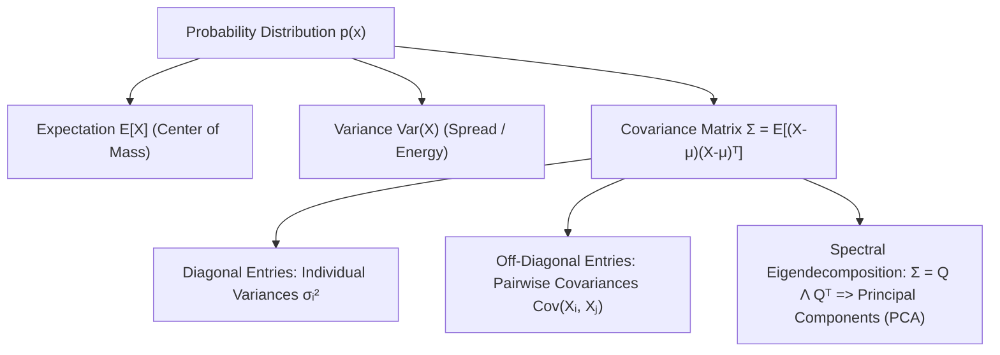

# Chapter 3.3: Expectation, Variance, Covariance & Covariance Matrices

---

## Pedagogical Navigation
- **Module 03:** Probability Theory for Deep Learning
- **Previous Chapter:** [Chapter 3.2: Random Variables (Discrete vs. Continuous), PMF, PDF, CDF](./02_random_variables_pmf_pdf_cdf.md)
- **Next Chapter:** [Chapter 3.4: Parametric Distributions (Bernoulli, Categorical, Gaussian, Beta, Dirichlet)](./04_parametric_distributions.md)
- **Companion Code:** [03_expectation_variance_covariance.py](./code/03_expectation_variance_covariance.py)
- **Tracker & Index:** [Course Index & Progress Tracker](../00_index_and_tracker.md)

---

## Part 1: Intuition & 101 Motivation

In deep learning, we almost never optimize a loss function on a single data point.
The true objective of machine learning is to minimize the **Expected Risk**:
$$\mathcal{R}(\theta) = \mathbb{E}_{(x, y) \sim p_{\text{data}}} \left[ \mathcal{L}(f(x; \theta), y) \right]$$
Because probability distributions are complex high-dimensional objects, we need compact summary statistics that capture their essential behavior:
1. **Center of Mass (Location):** Where is the distribution centered? $\implies$ **Expectation (Mean) $\mathbb{E}[X]$**.
2. **Dispersion (Spread):** How wildly does the variable fluctuate around its mean? $\implies$ **Variance $\text{Var}(X)$**.
3. **Linear Co-Movement:** When feature $X_1$ increases, does feature $X_2$ tend to increase or decrease? $\implies$ **Covariance $\text{Cov}(X_1, X_2)$**.
4. **Multidimensional Geometry:** How do hundreds of neurons vary jointly across the training set? $\implies$ **The Covariance Matrix $\Sigma$**.

Understanding how expectations and variances propagate through linear and non-linear layers is what allows deep learning engineers to design **Batch Normalization**, calibrate **Kaiming/Xavier Weight Initializations**, and prevent vanishing/exploding activations in 100-layer networks.



---

## Part 2: Rigorous Mathematical Formulation

### 1. Mathematical Expectation (The Mean)

#### Definition 3.3.1: Expectation
The **expectation** (or expected value) of a random variable $X$, denoted $\mathbb{E}[X]$ or $\mu$, is the probability-weighted average of its possible values:
- **Discrete Random Variable:**
  $$\mathbb{E}[X] \triangleq \sum_{x \in \mathcal{X}} x \cdot p_X(x)$$
- **Continuous Random Variable:**
  $$\mathbb{E}[X] \triangleq \int_{-\infty}^\infty x \cdot f_X(x) \, dx$$
provided the sum or integral converges absolutely ($\mathbb{E}[|X|] < \infty$).

#### Theorem 3.3.1: Law of the Unconscious Statistician (LOTUS)
If $g: \mathbb{R} \to \mathbb{R}$ is a real-valued function, the expected value of $Y = g(X)$ does not require first deriving the PDF of $Y$. It can be computed directly using the distribution of $X$:
$$\mathbb{E}[g(X)] = \begin{cases} \sum_x g(x) p_X(x), & \text{Discrete} \\[6pt] \int_{-\infty}^\infty g(x) f_X(x) \, dx, & \text{Continuous} \end{cases}$$

#### Theorem 3.3.2: Linearity of Expectation (The Most Powerful Tool in Probability)
For any two random variables $X$ and $Y$ (which can be **arbitrarily dependent**), and any scalar constants $\alpha, \beta, c \in \mathbb{R}$:
$$\mathbf{\mathbb{E}[\alpha X + \beta Y + c] = \alpha \mathbb{E}[X] + \beta \mathbb{E}[Y] + c}$$

##### Formal Proof (Continuous Case):
$$\mathbb{E}[\alpha X + \beta Y + c] = \iint (\alpha x + \beta y + c) f_{X, Y}(x, y) \, dx \, dy$$
$$= \alpha \iint x f_{X,Y}(x, y) \, dx \, dy + \beta \iint y f_{X,Y}(x, y) \, dx \, dy + c \iint f_{X,Y}(x, y) \, dx \, dy$$
Since $\int f_{X,Y}(x, y) dy = f_X(x)$ and $\iint f_{X,Y} dx dy = 1$:
$$= \alpha \int x f_X(x) \, dx + \beta \int y f_Y(y) \, dy + c(1) = \alpha \mathbb{E}[X] + \beta \mathbb{E}[Y] + c. \quad \blacksquare$$

---

### 2. Variance & Standard Deviation

#### Definition 3.3.2: Variance
The **variance** of a random variable $X$, denoted $\text{Var}(X)$ or $\sigma^2$, measures the expected squared deviation from its mean:
$$\text{Var}(X) \triangleq \mathbb{E}\left[ (X - \mathbb{E}[X])^2 \right]$$

#### Theorem 3.3.3: Computational Formula for Variance
$$\mathbf{\text{Var}(X) = \mathbb{E}[X^2] - (\mathbb{E}[X])^2}$$

##### Formal Proof:
Let $\mu = \mathbb{E}[X]$ (a deterministic constant).
$$\text{Var}(X) = \mathbb{E}[(X - \mu)^2] = \mathbb{E}[X^2 - 2 \mu X + \mu^2]$$
By Linearity of Expectation:
$$= \mathbb{E}[X^2] - 2 \mu \mathbb{E}[X] + \mu^2 = \mathbb{E}[X^2] - 2 \mu (\mu) + \mu^2 = \mathbb{E}[X^2] - \mu^2 = \mathbb{E}[X^2] - (\mathbb{E}[X])^2. \quad \blacksquare$$

#### Properties of Variance:
1. **Non-negativity:** $\text{Var}(X) \ge 0$ (variance is zero if and only if $X$ is a deterministic constant).
2. **Affine Scaling:**
   $$\mathbf{\text{Var}(a X + b) = a^2 \text{Var}(X)}$$
   Adding a constant shift $b$ translates the distribution without altering its spread!
3. **Standard Deviation:** $\sigma_X \triangleq \sqrt{\text{Var}(X)}$ has the exact same units as $X$.

---

#### Theorem 3.3.3b: Variance of the Product of Independent Random Variables
If $X$ and $Y$ are statistically independent ($X \perp Y$):
$$\mathbf{\text{Var}(X Y) = \text{Var}(X)\text{Var}(Y) + \text{Var}(X)(\mathbb{E}[Y])^2 + \text{Var}(Y)(\mathbb{E}[X])^2}$$
In particular, if both variables have zero mean ($\mathbb{E}[X] = \mathbb{E}[Y] = 0$):
$$\mathbf{\text{Var}(X Y) = \text{Var}(X) \text{Var}(Y)}$$

##### First-Principles Derivation:
1. By the computational formula for variance:
   $$\text{Var}(X Y) = \mathbb{E}[(X Y)^2] - (\mathbb{E}[X Y])^2 = \mathbb{E}[X^2 Y^2] - (\mathbb{E}[X Y])^2$$
2. Since $X \perp Y$, any functions of $X$ and $Y$ are independent. Therefore:
   $$\mathbb{E}[X^2 Y^2] = \mathbb{E}[X^2] \mathbb{E}[Y^2], \quad \text{and} \quad \mathbb{E}[X Y] = \mathbb{E}[X] \mathbb{E}[Y]$$
3. Express second moments in terms of variance: $\mathbb{E}[X^2] = \text{Var}(X) + (\mathbb{E}[X])^2$, and $\mathbb{E}[Y^2] = \text{Var}(Y) + (\mathbb{E}[Y])^2$.
4. Substitute:
   $$\text{Var}(X Y) = \left[ \text{Var}(X) + (\mathbb{E}[X])^2 \right] \left[ \text{Var}(Y) + (\mathbb{E}[Y])^2 \right] - (\mathbb{E}[X])^2 (\mathbb{E}[Y])^2$$
5. Expanding the algebraic product:
   $$= \text{Var}(X)\text{Var}(Y) + \text{Var}(X)(\mathbb{E}[Y])^2 + (\mathbb{E}[X])^2 \text{Var}(Y) + (\mathbb{E}[X])^2 (\mathbb{E}[Y])^2 - (\mathbb{E}[X])^2 (\mathbb{E}[Y])^2$$
   $$= \text{Var}(X)\text{Var}(Y) + \text{Var}(X)(\mathbb{E}[Y])^2 + \text{Var}(Y)(\mathbb{E}[X])^2 \quad \blacksquare$$

*Deep Learning Application:* This exact formula is used to derive **Xavier/Glorot and He/Kaiming initialization** rules for neural network weight matrices!

---

#### Theorem 3.3.3c: Law of Total Variance (Eve's Law)
For any two random variables $X$ and $Y$ on the same probability space:
$$\mathbf{\text{Var}(Y) = \mathbb{E}\left[ \text{Var}(Y \mid X) \right] + \text{Var}\left( \mathbb{E}[Y \mid X] \right)}$$
$$\text{Total Variance} = \text{Expected Unexplained Variance} + \text{Variance of Explained Predictions}$$

##### First-Principles Derivation:
1. By the definition of conditional variance:
   $$\text{Var}(Y \mid X) = \mathbb{E}[Y^2 \mid X] - (\mathbb{E}[Y \mid X])^2$$
2. Take the expectation of both sides with respect to $X$:
   $$\mathbb{E}[\text{Var}(Y \mid X)] = \mathbb{E}[\mathbb{E}[Y^2 \mid X]] - \mathbb{E}[(\mathbb{E}[Y \mid X])^2]$$
3. By the Law of Total Expectation (Tower Property: $\mathbb{E}[\mathbb{E}[Y^2 \mid X]] = \mathbb{E}[Y^2]$):
   $$\mathbb{E}[\text{Var}(Y \mid X)] = \mathbb{E}[Y^2] - \mathbb{E}[(\mathbb{E}[Y \mid X])^2]$$
4. Now apply the variance formula to the random variable $Z \triangleq \mathbb{E}[Y \mid X]$:
   $$\text{Var}(\mathbb{E}[Y \mid X]) = \mathbb{E}[(\mathbb{E}[Y \mid X])^2] - (\mathbb{E}[\mathbb{E}[Y \mid X]])^2 = \mathbb{E}[(\mathbb{E}[Y \mid X])^2] - (\mathbb{E}[Y])^2$$
5. Sum the two equations:
   $$\mathbb{E}[\text{Var}(Y \mid X)] + \text{Var}(\mathbb{E}[Y \mid X]) = \mathbb{E}[Y^2] - (\mathbb{E}[Y])^2 = \text{Var}(Y) \quad \blacksquare$$

---

### 3. Covariance & Pearson Correlation

#### Definition 3.3.3: Covariance
The **covariance** between two random variables $X$ and $Y$, denoted $\text{Cov}(X, Y)$ or $\sigma_{XY}$, measures the degree to which they vary together linearly:
$$\text{Cov}(X, Y) \triangleq \mathbb{E}\left[ (X - \mathbb{E}[X])(Y - \mathbb{E}[Y]) \right] = \mathbb{E}[X Y] - \mathbb{E}[X]\mathbb{E}[Y]$$

#### Properties of Covariance:
1. **Symmetry:** $\text{Cov}(X, Y) = \text{Cov}(Y, X)$.
2. **Self-Covariance is Variance:** $\text{Cov}(X, X) = \text{Var}(X)$.
3. **Bilinearity:**
   $$\text{Cov}(\alpha X_1 + \beta X_2, Y) = \alpha \text{Cov}(X_1, Y) + \beta \text{Cov}(X_2, Y)$$
4. **Variance of a Sum:**
   $$\mathbf{\text{Var}(X + Y) = \text{Var}(X) + \text{Var}(Y) + 2 \text{Cov}(X, Y)}$$
   If $X$ and $Y$ are uncorrelated ($\text{Cov}(X, Y) = 0$), then $\text{Var}(X + Y) = \text{Var}(X) + \text{Var}(Y)$.

#### Definition 3.3.4: Pearson Correlation Coefficient
Because covariance depends on the arbitrary measurement scale of $X$ and $Y$, we normalize it by their standard deviations to obtain the dimensionless **correlation coefficient** $\rho_{XY}$:
$$\rho_{XY} \triangleq \frac{\text{Cov}(X, Y)}{\sigma_X \sigma_Y}$$
By the Cauchy-Schwarz Inequality (Chapter 1.2 applied to the inner product $\langle X, Y \rangle = \mathbb{E}[X Y]$):
$$\mathbf{-1.0 \le \rho_{XY} \le +1.0}$$
- $\rho = +1$: Perfect positive linear correlation ($Y = a X + b$ with $a > 0$).
- $\rho = -1$: Perfect negative linear correlation ($Y = a X + b$ with $a < 0$).
- $\rho = 0$: Uncorrelated.

> [!WARNING]
> **Independence implies Uncorrelatedness, but Uncorrelatedness does NOT imply Independence!**
> If $X \perp Y$, then $\text{Cov}(X, Y) = 0$.
> However, $\text{Cov}(X, Y) = 0$ only rules out *linear* dependencies. A deterministic non-linear relationship can have zero covariance! (See Part 6, Case A).

---

### 4. Random Vectors & The Covariance Matrix

Let $X = [X_1, X_2, \dots, X_D]^T \in \mathbb{R}^D$ be a random vector.

#### Definition 3.3.5: Mean Vector
$$\mu \triangleq \mathbb{E}[X] = \begin{bmatrix} \mathbb{E}[X_1] \\ \mathbb{E}[X_2] \\ \vdots \\ \mathbb{E}[X_D] \end{bmatrix} \in \mathbb{R}^D$$

#### Definition 3.3.6: The Covariance Matrix
The **covariance matrix** $\Sigma \in \mathbb{R}^{D \times D}$ of random vector $X$ is the expected outer product of its zero-mean centered vector:
$$\mathbf{\Sigma \triangleq \text{Cov}(X) = \mathbb{E}\left[ (X - \mu)(X - \mu)^T \right]}$$

Written out explicitly:
$$\Sigma = \begin{bmatrix}
\text{Var}(X_1) & \text{Cov}(X_1, X_2) & \dots & \text{Cov}(X_1, X_D) \\
\text{Cov}(X_2, X_1) & \text{Var}(X_2) & \dots & \text{Cov}(X_2, X_D) \\
\vdots & \vdots & \ddots & \vdots \\
\text{Cov}(X_D, X_1) & \text{Cov}(X_D, X_2) & \dots & \text{Var}(X_D)
\end{bmatrix}$$

#### Theorem 3.3.4: Fundamental Properties of the Covariance Matrix
1. **Symmetry:** $\Sigma = \Sigma^T$ because $\text{Cov}(X_i, X_j) = \text{Cov}(X_j, X_i)$.
2. **Positive Semi-Definiteness ($\Sigma \succeq 0$):**
   For any arbitrary non-zero vector $v \in \mathbb{R}^D$:
   $$v^T \Sigma v = v^T \mathbb{E}[(X - \mu)(X - \mu)^T] v = \mathbb{E}\left[ v^T (X - \mu)(X - \mu)^T v \right] = \mathbb{E}\left[ (v^T (X - \mu))^2 \right] = \text{Var}(v^T X) \ge 0$$
   Because the variance of any 1D projection $v^T X$ is always non-negative, **every covariance matrix is mathematically guaranteed to be Positive Semi-Definite**!
3. **Affine Transformation Law:**
   If $Y = A X + b$ where $A \in \mathbb{R}^{M \times D}$ and $b \in \mathbb{R}^M$:
   $$\mathbf{\mathbb{E}[Y] = A \mu + b}, \qquad \mathbf{\text{Cov}(Y) = A \Sigma A^T}$$

---

## Part 3: Geometric, Algebraic & Physical Interpretation

### 1. The Geometry of the Covariance Ellipsoid & PCA
Recall from Chapter 1.6 and 1.8 that any symmetric PSD matrix admits an eigendecomposition:
$$\Sigma = Q \Lambda Q^T = \sum_{i=1}^D \lambda_i q_i q_i^T$$
where $\lambda_1 \ge \lambda_2 \ge \dots \ge \lambda_D \ge 0$ are the eigenvalues, and $q_i$ are the orthonormal eigenvectors.

**Geometric Meaning:**
- A data distribution forms a cloud of points in $\mathbb{R}^D$.
- The eigenvectors $q_1, \dots, q_D$ point along the **principal axes of variation** of the cloud.
- The eigenvalues $\lambda_i$ are the exact **variances along those principal axes**:
  $$\text{Var}(q_i^T X) = q_i^T \Sigma q_i = \lambda_i$$
- This is the entire mathematical foundation of **Principal Component Analysis (PCA)**!

```
                    q₂ (Minor Axis, Variance λ₂)
                          ^
                          |       ***
                          |   *         *
                          |  *     • μ   *  q₁ (Major Axis, Variance λ₁)
                          |   *         *  ------>
                          |       ***
                          +------------------------->
```

---

## Part 4: Real-World Analogy

### The Mobile Robot Location Tracking
Imagine an autonomous delivery robot navigating a warehouse:
1. **Expectation ($\mu = [x, y]^T$):**
   The GPS and wheel odometry estimate that the robot's center of mass is currently at coordinates $(10.0\text{ m}, 5.0\text{ m})$.
2. **Diagonal Variances ($\Sigma_{11}, \Sigma_{22}$):**
   $\Sigma_{11} = 0.04\text{ m}^2 \implies \sigma_x = 0.2\text{ m}$ (forward-backward uncertainty).
   $\Sigma_{22} = 0.25\text{ m}^2 \implies \sigma_y = 0.5\text{ m}$ (left-right drift uncertainty).
3. **Off-Diagonal Covariance ($\Sigma_{12}$):**
   If the robot's wheels slip whenever it steers left, errors in $x$ and $y$ become coupled: $\Sigma_{12} = -0.08$.
   The robot does not live inside a circle of uncertainty; it lives inside a tilted **ellipse of uncertainty** described by $\Sigma$.

---

## Part 5: "AI by Hand" (Prof. Tom Yeh Style Visual Grids)

Let us compute the mean vector, variances, covariance, correlation, and covariance matrix step-by-step from a 2D discrete joint distribution using concrete numbers.

### 1. Problem Setup & Discrete Joint PMF
Consider a 2D random vector $X = [X_1, X_2]^T$ with support $\{1, 2\} \times \{1, 3\}$.
The joint PMF $p(x_1, x_2)$ is given by the table:

```
                  X₂ = 1          X₂ = 3
  X₁ = 1          0.10            0.30
  X₁ = 2          0.40            0.20
```

Verify total probability: $0.10 + 0.30 + 0.40 + 0.20 = 1.00 \quad \checkmark$

---

### 2. "What Refers to What" Legend Protocol

| Symbol | Pure Math Role | Deep Learning Meaning | Toy Value in Walkthrough |
| :--- | :--- | :--- | :--- |
| $X_1$ | 1st coordinate random variable | Feature 1 / Hidden neuron activation | Range: $\{1, 2\}$ |
| $X_2$ | 2nd coordinate random variable | Feature 2 / Target / Sensor reading | Range: $\{1, 3\}$ |
| $\mu_1 = \mathbb{E}[X_1]$ | Marginal expectation | Feature 1 mean | $1.60$ |
| $\mu_2 = \mathbb{E}[X_2]$ | Marginal expectation | Feature 2 mean | $2.00$ |
| $\text{Var}(X_1)$ | Variance of $X_1$ | Feature 1 spread / energy | $0.240$ |
| $\text{Var}(X_2)$ | Variance of $X_2$ | Feature 2 spread / energy | $1.000$ |
| $\text{Cov}(X_1, X_2)$ | Covariance | Feature cross-talk | $-0.200$ |
| $\rho_{12}$ | Pearson correlation | Normalized linear dependence | $\approx -0.408248$ |
| $\Sigma$ | $2 \times 2$ Covariance matrix | Feature covariance tensor | $\begin{bmatrix} 0.24 & -0.20 \\ -0.20 & 1.00 \end{bmatrix}$ |

---

### 3. Step-by-Step Manual Arithmetic

#### Step 1: Compute Marginal Distributions
Sum across rows and columns:
- Marginal of $X_1$:
  $$P(X_1 = 1) = p(1, 1) + p(1, 3) = 0.10 + 0.30 = \mathbf{0.40}$$
  $$P(X_1 = 2) = p(2, 1) + p(2, 3) = 0.40 + 0.20 = \mathbf{0.60}$$
- Marginal of $X_2$:
  $$P(X_2 = 1) = p(1, 1) + p(2, 1) = 0.10 + 0.40 = \mathbf{0.50}$$
  $$P(X_2 = 3) = p(1, 3) + p(2, 3) = 0.30 + 0.20 = \mathbf{0.50}$$

#### Step 2: Compute Mean Vector $\mu = [\mathbb{E}[X_1], \mathbb{E}[X_2]]^T$
- $\mathbb{E}[X_1] = (1)(0.40) + (2)(0.60) = 0.40 + 1.20 = \mathbf{1.60}$
- $\mathbb{E}[X_2] = (1)(0.50) + (3)(0.50) = 0.50 + 1.50 = \mathbf{2.00}$
$$\mu = \begin{bmatrix} 1.60 \\ 2.00 \end{bmatrix}$$

#### Step 3: Compute Second Moments and Variances
- Second moment of $X_1$:
  $$\mathbb{E}[X_1^2] = (1^2)(0.40) + (2^2)(0.60) = (1)(0.40) + (4)(0.60) = 0.40 + 2.40 = \mathbf{2.80}$$
  $$\text{Var}(X_1) = \mathbb{E}[X_1^2] - (\mathbb{E}[X_1])^2 = 2.80 - (1.60)^2 = 2.80 - 2.56 = \mathbf{0.240}$$
  $$\sigma_1 = \sqrt{0.24} \approx 0.489898$$

- Second moment of $X_2$:
  $$\mathbb{E}[X_2^2] = (1^2)(0.50) + (3^2)(0.50) = (1)(0.50) + (9)(0.50) = 0.50 + 4.50 = \mathbf{5.00}$$
  $$\text{Var}(X_2) = \mathbb{E}[X_2^2] - (\mathbb{E}[X_2])^2 = 5.00 - (2.00)^2 = 5.00 - 4.00 = \mathbf{1.000}$$
  $$\sigma_2 = \sqrt{1.00} = 1.000$$

#### Step 4: Compute Cross-Moment $\mathbb{E}[X_1 X_2]$ and Covariance
Sum $x_1 x_2 p(x_1, x_2)$ across all 4 grid cells:
- Cell $(1, 1)$: $(1)(1)(0.10) = 0.10$
- Cell $(1, 3)$: $(1)(3)(0.30) = 0.90$
- Cell $(2, 1)$: $(2)(1)(0.40) = 0.80$
- Cell $(2, 3)$: $(2)(3)(0.20) = 1.20$
$$\mathbb{E}[X_1 X_2] = 0.10 + 0.90 + 0.80 + 1.20 = \mathbf{3.00}$$

Compute Covariance:
$$\text{Cov}(X_1, X_2) = \mathbb{E}[X_1 X_2] - \mathbb{E}[X_1]\mathbb{E}[X_2] = 3.00 - (1.60)(2.00) = 3.00 - 3.20 = \mathbf{-0.200}$$

#### Step 5: Compute Pearson Correlation $\rho_{12}$
$$\rho_{12} = \frac{\text{Cov}(X_1, X_2)}{\sigma_1 \sigma_2} = \frac{-0.200}{\sqrt{0.24} \times 1.00} = \frac{-0.200}{0.489898} \approx \mathbf{-0.408248}$$

#### Step 6: Assemble the Covariance Matrix $\Sigma$
$$\Sigma = \begin{bmatrix} \text{Var}(X_1) & \text{Cov}(X_1, X_2) \\ \text{Cov}(X_2, X_1) & \text{Var}(X_2) \end{bmatrix} = \begin{bmatrix} \mathbf{0.24} & \mathbf{-0.20} \\ \mathbf{-0.20} & \mathbf{1.00} \end{bmatrix}$$

Verify Positive Semi-Definiteness (Chapter 1.8):
1. **Trace:** $\text{Tr}(\Sigma) = 0.24 + 1.00 = 1.24 > 0$.
2. **Determinant:** $\det(\Sigma) = (0.24)(1.00) - (-0.20)^2 = 0.24 - 0.04 = \mathbf{0.200} > 0$.
Both eigenvalues are strictly positive $\implies \Sigma \succ 0$ is strictly Positive Definite!

---

### 4. Visual Summary Grid

```
+-----------------------------------------------------------------------------------------------+
|                       PROF. TOM YEH STYLE COVARIANCE MATRIX GRID                              |
+-----------------------------------------------------------------------------------------------+
| Joint Distribution p(x₁, x₂):                                                                 |
|                 X₂ = 1           X₂ = 3          Marginal P(X₁)                               |
|   X₁ = 1        0.10             0.30            0.40                                         |
|   X₁ = 2        0.40             0.20            0.60                                         |
| Marginal P(X₂)  0.50             0.50            Total = 1.00                                 |
+--------------------------+-------------------------------+------------------------------------+
| STATISTIC                | DETAILED ARITHMETIC           | FINAL VALUE                        |
+--------------------------+-------------------------------+------------------------------------+
| Mean E[X₁]               | (1)(0.40) + (2)(0.60)         | 1.6000                             |
| Mean E[X₂]               | (1)(0.50) + (3)(0.50)         | 2.0000                             |
| Variance Var(X₁)         | 2.80 - 1.60² = 2.80 - 2.56    | 0.2400                             |
| Variance Var(X₂)         | 5.00 - 2.00² = 5.00 - 4.00    | 1.0000                             |
| Cross-Moment E[X₁X₂]     | 0.10 + 0.90 + 0.80 + 1.20     | 3.0000                             |
| Covariance Cov(X₁, X₂)   | 3.00 - (1.60)(2.00)           | -0.2000 (Negative correlation)     |
| Correlation ρ₁₂          | -0.20 / sqrt(0.24 * 1.0)      | -0.4082 (Moderate negative tilt)   |
+--------------------------+-------------------------------+------------------------------------+
| COVARIANCE MATRIX Σ:     | [[  0.2400,  -0.2000 ],       | det(Σ) = 0.2000 > 0 (Positive Def!)|
|                          |  [ -0.2000,   1.0000 ]]       | Trace  = 1.2400                    |
+-----------------------------------------------------------------------------------------------+
```

---

## Part 6: Step-by-Step Solved Illustrations

### Case A: Uncorrelated But Highly Dependent Variables
Let $X \sim \text{Uniform}[-1, 1]$, and let $Y = X^2$.
Notice that $Y$ is **$100\%$ deterministically dependent** on $X$! (Knowing $X$ completely determines $Y$).

Let us compute their covariance:
1. $\mathbb{E}[X] = \int_{-1}^1 x \cdot \frac{1}{2} \, dx = 0$.
2. $\mathbb{E}[Y] = \mathbb{E}[X^2] = \int_{-1}^1 x^2 \cdot \frac{1}{2} \, dx = \left[ \frac{x^3}{6} \right]_{-1}^1 = \frac{1}{6} - \left(-\frac{1}{6}\right) = \frac{1}{3}$.
3. $\mathbb{E}[X Y] = \mathbb{E}[X \cdot X^2] = \mathbb{E}[X^3] = \int_{-1}^1 x^3 \cdot \frac{1}{2} \, dx = 0$ (integral of an odd function).
4. Compute Covariance:
   $$\text{Cov}(X, Y) = \mathbb{E}[X Y] - \mathbb{E}[X]\mathbb{E}[Y] = 0 - (0)\left(\frac{1}{3}\right) = \mathbf{0}$$
**Theorem:** $\text{Cov}(X, Y) = 0$, yet $X$ and $Y$ are completely dependent!
Covariance only measures *linear* relationships; non-linear U-shaped dependencies are completely invisible to it.

---

### Case B: Whitening Transformation (ZCA / PCA Whitening)
In feature preprocessing and Batch Normalization, we want to transform a correlated feature vector $X$ with covariance $\Sigma$ into a **whitened vector $Z$** whose covariance is the identity matrix $I$:
$$\text{Cov}(Z) = I \iff Z_i \text{ are uncorrelated and have unit variance}$$

#### Derivation via Matrix Square Root (Chapter 1.6 & 1.8):
1. Let $\Sigma = Q \Lambda Q^T$.
2. Define the inverse square root matrix:
   $$\Sigma^{-1/2} = Q \Lambda^{-1/2} Q^T$$
3. Define the whitened vector:
   $$Z = \Sigma^{-1/2} (X - \mu)$$
4. Compute its covariance using the affine covariance rule $\text{Cov}(A X) = A \Sigma A^T$:
   $$\text{Cov}(Z) = \Sigma^{-1/2} \Sigma (\Sigma^{-1/2})^T = \Sigma^{-1/2} \Sigma \Sigma^{-1/2} = \Sigma^{-1/2} \Sigma^{1/2} \Sigma^{1/2} \Sigma^{-1/2} = I \cdot I = \mathbf{I}$$
Every feature in $Z$ now has variance $1.0$ and zero correlation with every other feature!

---

### Case C: Continuous 2D Joint Distribution Moments (Bivariate Calculus)
Consider a continuous bivariate random vector $(X, Y)$ distributed on the unit square $[0, 1] \times [0, 1]$ with joint PDF:
$$f_{X, Y}(x, y) = \frac{2}{3}(x + 2y), \quad 0 \le x \le 1, \; 0 \le y \le 1$$

#### Step 1: Verify Normalization
$$\int_0^1 \int_0^1 \frac{2}{3}(x + 2y) \, dx \, dy = \frac{2}{3} \int_0^1 \left[ \frac{x^2}{2} + 2xy \right]_0^1 dy = \frac{2}{3} \int_0^1 \left( \frac{1}{2} + 2y \right) dy$$
$$= \frac{2}{3} \left[ \frac{y}{2} + y^2 \right]_0^1 = \frac{2}{3} \left( \frac{1}{2} + 1 \right) = \frac{2}{3} \left(\frac{3}{2}\right) = \mathbf{1.000000} \quad \checkmark$$

#### Step 2: Compute Marginal PDFs
- **Marginal PDF of $X$:**
  $$f_X(x) = \int_0^1 \frac{2}{3}(x + 2y) \, dy = \frac{2}{3} \left[ xy + y^2 \right]_0^1 = \mathbf{\frac{2}{3}(x + 1)}$$
- **Marginal PDF of $Y$:**
  $$f_Y(y) = \int_0^1 \frac{2}{3}(x + 2y) \, dx = \frac{2}{3} \left[ \frac{x^2}{2} + 2xy \right]_0^1 = \mathbf{\frac{1}{3} + \frac{4}{3}y}$$

#### Step 3: Compute Marginal Means $\mathbb{E}[X]$ and $\mathbb{E}[Y]$
- **Mean of $X$:**
  $$\mathbb{E}[X] = \int_0^1 x \cdot \frac{2}{3}(x + 1) \, dx = \frac{2}{3} \int_0^1 (x^2 + x) \, dx = \frac{2}{3} \left[ \frac{x^3}{3} + \frac{x^2}{2} \right]_0^1 = \frac{2}{3} \left( \frac{1}{3} + \frac{1}{2} \right) = \frac{2}{3} \left( \frac{5}{6} \right) = \mathbf{\frac{5}{9}} \approx \mathbf{0.555556}$$
- **Mean of $Y$:**
  $$\mathbb{E}[Y] = \int_0^1 y \left(\frac{1}{3} + \frac{4}{3}y\right) dy = \int_0^1 \left(\frac{y}{3} + \frac{4y^2}{3}\right) dy = \left[ \frac{y^2}{6} + \frac{4y^3}{9} \right]_0^1 = \frac{1}{6} + \frac{4}{9} = \frac{3 + 8}{18} = \mathbf{\frac{11}{18}} \approx \mathbf{0.611111}$$

#### Step 4: Compute Cross-Moment $\mathbb{E}[X Y]$
$$\mathbb{E}[X Y] = \int_0^1 \int_0^1 x y \cdot \frac{2}{3}(x + 2y) \, dx \, dy = \frac{2}{3} \int_0^1 \int_0^1 (x^2 y + 2 x y^2) \, dx \, dy$$
$$= \frac{2}{3} \int_0^1 \left[ \frac{x^3 y}{3} + x^2 y^2 \right]_0^1 dy = \frac{2}{3} \int_0^1 \left( \frac{y}{3} + y^2 \right) dy = \frac{2}{3} \left[ \frac{y^2}{6} + \frac{y^3}{3} \right]_0^1 = \frac{2}{3} \left( \frac{1}{6} + \frac{1}{3} \right) = \frac{2}{3} \left( \frac{1}{2} \right) = \mathbf{\frac{1}{3}} \approx \mathbf{0.333333}$$

#### Step 5: Compute Covariance and Correlation
$$\text{Cov}(X, Y) = \mathbb{E}[X Y] - \mathbb{E}[X]\mathbb{E}[Y] = \frac{1}{3} - \left(\frac{5}{9}\right)\left(\frac{11}{18}\right) = \frac{1}{3} - \frac{55}{162} = \frac{54 - 55}{162} = \mathbf{-\frac{1}{162}} \approx \mathbf{-0.006173}$$
Because $\text{Cov}(X, Y) < 0$, $X$ and $Y$ have a slight negative linear dependence.

---

### Case D: Concrete $2 \times 2$ ZCA Whitening Matrix Construction
Consider a 2D data distribution with empirical covariance matrix:
$$\Sigma = \begin{bmatrix} 4.0 & 2.0 \\ 2.0 & 4.0 \end{bmatrix}$$
Construct the exact symmetric Zero-phase Component Analysis (ZCA) whitening matrix $\Sigma^{-1/2}$ and verify that $\Sigma^{-1/2} \Sigma \Sigma^{-1/2} = I$.

#### Step 1: Eigendecomposition of $\Sigma$
1. **Characteristic polynomial:**
   $$\det(\Sigma - \lambda I) = (4 - \lambda)^2 - 2^2 = (4 - \lambda - 2)(4 - \lambda + 2) = (2 - \lambda)(6 - \lambda) = 0$$
   $$\implies \lambda_1 = 6.0, \quad \lambda_2 = 2.0$$
2. **Normalized Eigenvectors:**
   - For $\lambda_1 = 6.0$:
     $$(\Sigma - 6I) q_1 = \begin{bmatrix} -2 & 2 \\ 2 & -2 \end{bmatrix} q_1 = 0 \implies q_1 = \frac{1}{\sqrt{2}} \begin{bmatrix} 1 \\ 1 \end{bmatrix}$$
   - For $\lambda_2 = 2.0$:
     $$(\Sigma - 2I) q_2 = \begin{bmatrix} 2 & 2 \\ 2 & 2 \end{bmatrix} q_2 = 0 \implies q_2 = \frac{1}{\sqrt{2}} \begin{bmatrix} -1 \\ 1 \end{bmatrix}$$
   $$Q = \frac{1}{\sqrt{2}} \begin{bmatrix} 1 & -1 \\ 1 & 1 \end{bmatrix}$$

#### Step 2: Compute Inverse Square-Root Matrix $\Sigma^{-1/2} = Q \Lambda^{-1/2} Q^T$
1. Inverse square-root eigenvalues:
   $$\Lambda^{-1/2} = \begin{bmatrix} \frac{1}{\sqrt{6}} & 0 \\ 0 & \frac{1}{\sqrt{2}} \end{bmatrix}$$
2. Compute matrix product:
   $$\Sigma^{-1/2} = \left( \frac{1}{\sqrt{2}} \begin{bmatrix} 1 & -1 \\ 1 & 1 \end{bmatrix} \right) \begin{bmatrix} \frac{1}{\sqrt{6}} & 0 \\ 0 & \frac{1}{\sqrt{2}} \end{bmatrix} \left( \frac{1}{\sqrt{2}} \begin{bmatrix} 1 & 1 \\ -1 & 1 \end{bmatrix} \right) = \frac{1}{2} \begin{bmatrix} \frac{1}{\sqrt{6}} & -\frac{1}{\sqrt{2}} \\ \frac{1}{\sqrt{6}} & \frac{1}{\sqrt{2}} \end{bmatrix} \begin{bmatrix} 1 & 1 \\ -1 & 1 \end{bmatrix}$$
   $$\Sigma^{-1/2} = \frac{1}{2} \begin{bmatrix} \frac{1}{\sqrt{6}} + \frac{1}{\sqrt{2}} & \frac{1}{\sqrt{6}} - \frac{1}{\sqrt{2}} \\ \frac{1}{\sqrt{6}} - \frac{1}{\sqrt{2}} & \frac{1}{\sqrt{6}} + \frac{1}{\sqrt{2}} \end{bmatrix}$$
3. Numerical evaluation:
   - $\frac{1}{\sqrt{6}} \approx 0.408248, \quad \frac{1}{\sqrt{2}} \approx 0.707107$
   - Diagonal entry: $\frac{1}{2}(0.408248 + 0.707107) = \frac{1}{2}(1.115355) \approx \mathbf{0.557678}$
   - Off-diagonal entry: $\frac{1}{2}(0.408248 - 0.707107) = \frac{1}{2}(-0.298859) \approx \mathbf{-0.149429}$
   $$\mathbf{\Sigma^{-1/2} \approx \begin{bmatrix} 0.557678 & -0.149429 \\ -0.149429 & 0.557678 \end{bmatrix}}$$

#### Step 3: Numerical Verification $\Sigma^{-1/2} \Sigma \Sigma^{-1/2} = I$
1. Compute intermediate product $M = \Sigma^{-1/2} \Sigma$:
   $$M = \begin{bmatrix} 0.557678 & -0.149429 \\ -0.149429 & 0.557678 \end{bmatrix} \begin{bmatrix} 4.0 & 2.0 \\ 2.0 & 4.0 \end{bmatrix} = \begin{bmatrix} 4(0.557678) - 2(0.149429) & 2(0.557678) - 4(0.149429) \\ -4(0.149429) + 2(0.557678) & -2(0.149429) + 4(0.557678) \end{bmatrix}$$
   $$M \approx \begin{bmatrix} 1.931854 & 0.517640 \\ 0.517640 & 1.931854 \end{bmatrix}$$
2. Multiply by $\Sigma^{-1/2}$:
   $$\text{Cov}(Z) = M \Sigma^{-1/2} = \begin{bmatrix} 1.931854 & 0.517640 \\ 0.517640 & 1.931854 \end{bmatrix} \begin{bmatrix} 0.557678 & -0.149429 \\ -0.149429 & 0.557678 \end{bmatrix}$$
   - Entry $(1, 1)$: $(1.931854)(0.557678) + (0.517640)(-0.149429) = 1.077353 - 0.077351 = \mathbf{1.000002} \approx \mathbf{1.0}$
   - Entry $(1, 2)$: $(1.931854)(-0.149429) + (0.517640)(0.557678) = -0.288676 + 0.288676 = \mathbf{0.000000} \equiv \mathbf{0.0}$
   - Entry $(2, 2)$: $(0.517640)(-0.149429) + (1.931854)(0.557678) = \mathbf{1.000002} \approx \mathbf{1.0}$
   $$\text{Cov}(Z) = \begin{bmatrix} 1.0 & 0.0 \\ 0.0 & 1.0 \end{bmatrix} = \mathbf{I} \quad \checkmark$$
The whitened random variables are strictly uncorrelated and normalized to unit variance.

---

## Part 7: Deep Learning Connection & Application

### 1. Xavier / Glorot & He / Kaiming Weight Initialization
Why do deep neural networks explode or die out if initialized with arbitrary random weights?
Consider a single linear neuron:
$$y = \sum_{i=1}^{n_{\text{in}}} W_i X_i$$
Assume weights $W_i$ and inputs $X_i$ are independent with zero mean:
$$\mathbb{E}[y] = \sum_{i=1}^{n_{\text{in}}} \mathbb{E}[W_i] \mathbb{E}[X_i] = 0$$
Using the variance of product of independent zero-mean variables ($\text{Var}(A B) = \text{Var}(A) \text{Var}(B)$):
$$\text{Var}(y) = \sum_{i=1}^{n_{\text{in}}} \text{Var}(W_i X_i) = \sum_{i=1}^{n_{\text{in}}} \text{Var}(W_i) \text{Var}(X_i) = n_{\text{in}} \cdot \text{Var}(W) \cdot \text{Var}(X)$$

To prevent the variance of activations from exploding or vanishing across 50 layers, we must maintain:
$$\text{Var}(y) \equiv \text{Var}(X) \iff n_{\text{in}} \cdot \text{Var}(W) = 1 \iff \mathbf{\text{Var}(W) = \frac{1}{n_{\text{in}}}}$$
- **Xavier/Glorot Initialization (Tanh activations):**
  Accounting for forward and backward passes: $\text{Var}(W) = \frac{2}{n_{\text{in}} + n_{\text{out}}}$.
- **He/Kaiming Initialization (ReLU activations):**
  Because ReLU zeroes out half the neurons, it cuts variance in half ($\times \frac{1}{2}$). To compensate, weights must have **double the variance**:
  $$\mathbf{\text{Var}(W) = \frac{2}{n_{\text{in}}}}$$

---

### 2. Mini-Batch SGD Variance Reduction
Let $g_i = \nabla \mathcal{L}_i(\theta)$ be the gradient computed on a single sample, with true gradient $\mu_g = \mathbb{E}[g_i]$ and variance $\sigma_g^2$.
The mini-batch gradient is:
$$\bar{g}_B = \frac{1}{B} \sum_{i=1}^B g_i$$
Using the affine variance rule:
$$\text{Var}(\bar{g}_B) = \text{Var}\left( \frac{1}{B} \sum_{i=1}^B g_i \right) = \frac{1}{B^2} \sum_{i=1}^B \text{Var}(g_i) = \frac{1}{B^2} (B \sigma_g^2) = \mathbf{\frac{\sigma_g^2}{B}}$$
**Theorem:** Increasing the batch size by $B$ reduces gradient noise variance by exactly $\frac{1}{B}$!

---

## Part 8: Code Implementation & Verification

The companion Python module [03_expectation_variance_covariance.py](./code/03_expectation_variance_covariance.py) provides full verification:
1. **Part 5 Discrete Joint Distribution Verification:** Validates exact marginals, means ($\mu_1 = 1.6, \mu_2 = 2.0$), variances ($0.24, 1.0$), covariance ($-0.20$), and correlation ($\approx -0.408248$).
2. **Uncorrelated but Non-Linear Dependent Test:** Generates $X \sim \mathcal{U}[-1, 1], Y = X^2$ and confirms $\text{Cov}(X, Y) \approx 0$ despite $R^2 = 1$.
3. **ZCA Whitening Verification:** Computes $\Sigma^{-1/2} (X - \mu)$ on synthetic correlated data and asserts that the resulting covariance matrix is strictly the identity matrix $I$.
4. **Kaiming vs. Xavier Variance Propagation:** Simulates a 30-layer deep network forward pass, proving that improper initialization variance causes exponential activation collapse.
