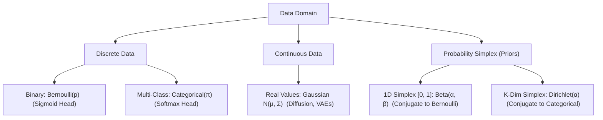

# Chapter 3.4: Parametric Distributions (Bernoulli, Categorical, Gaussian, Beta, Dirichlet)

---

## Pedagogical Navigation
- **Module 03:** Probability Theory for Deep Learning
- **Previous Chapter:** [Chapter 3.3: Expectation, Variance, Covariance & Covariance Matrices](./03_expectation_variance_covariance.md)
- **Next Chapter:** [Chapter 3.5: Joint, Marginal & Conditional Distributions](./05_joint_marginal_conditional.md)
- **Companion Code:** [04_parametric_distributions.py](./code/04_parametric_distributions.py)
- **Tracker & Index:** [Course Index & Progress Tracker](../00_index_and_tracker.md)

---

## Part 1: Intuition & 101 Motivation

Why does deep learning rely on **parametric distributions**?
An arbitrary, non-parametric probability distribution over an image of size $256 \times 256$ with 256 color levels would require storing $256^{196608}$ numbers—more than the number of atoms in the observable universe.
A **parametric distribution** $p(x; \theta)$ compresses an infinite universe of possibilities into a finite vector of tunable parameters $\theta$.

In modern deep learning, five parametric families form the universal grammar of neural architectures:
1. **Bernoulli:** Binary decisions ($y \in \{0, 1\}$), Sigmoid classification, Dropout mask generation.
2. **Categorical (Multinoulli):** Multi-class tokens ($y \in \{1, \dots, K\}$), Softmax heads in Transformers and LLMs.
3. **Gaussian (Normal):** The backbone of continuous deep learning—Latent spaces in VAEs, Markov transition kernels in Diffusion Models, weight initialization distributions.
4. **Beta:** The conjugate prior over a single continuous probability parameter $p \in [0, 1]$.
5. **Dirichlet:** The conjugate prior over the entire probability simplex $\Delta^{K-1}$ (distributions over distributions), used in Bayesian Neural Networks, Topic Models, and Mixture of Experts routing priors.



---

## Part 2: Rigorous Mathematical Formulation

### 1. The Bernoulli Distribution (Binary Outcomes)

Models a single binary trial with success probability $p \in [0, 1]$.

- **Support:** $\mathcal{X} = \{0, 1\}$
- **Parameter:** $p \in [0, 1]$
- **PMF:**
  $$p_X(x; p) = p^x (1 - p)^{1 - x} = \begin{cases} p, & x = 1 \\ 1 - p, & x = 0 \end{cases}$$
- **Mean & Variance:**
  $$\mathbf{\mathbb{E}[X] = p}, \qquad \mathbf{\text{Var}(X) = p(1 - p)}$$
- **Binary Cross-Entropy Loss Connection:**
  The negative log-likelihood of a Bernoulli observation $y \in \{0, 1\}$ given model prediction $\hat{y} = \sigma(z) \in (0, 1)$ is:
  $$\mathcal{L}_{\text{BCE}} = -\log p(y; \hat{y}) = -\left[ y \log \hat{y} + (1 - y) \log(1 - \hat{y}) \right]$$

#### Deep Derivation 3.4.1: First-Principles Derivation of Bernoulli Maximum Likelihood Estimator (MLE)
Let $\mathcal{D} = \{x_1, x_2, \dots, x_N\}$ be $N$ independent and identically distributed (i.i.d.) observations sampled from $\text{Bernoulli}(p)$, where $x_i \in \{0, 1\}$.

1. **Likelihood Function:**
   $$L(p; \mathcal{D}) = \prod_{i=1}^N p^{x_i} (1 - p)^{1 - x_i} = p^{\sum_{i=1}^N x_i} (1 - p)^{N - \sum_{i=1}^N x_i}$$
   Let $k = \sum_{i=1}^N x_i$ denote the total number of successes (ones). Then:
   $$L(p; \mathcal{D}) = p^k (1 - p)^{N - k}$$

2. **Log-Likelihood Function:**
   Taking the natural logarithm:
   $$\ell(p) \triangleq \ln L(p; \mathcal{D}) = k \ln(p) + (N - k) \ln(1 - p)$$

3. **First-Order Stationarity Condition:**
   Differentiating with respect to $p$:
   $$\frac{d\ell}{dp} = \frac{k}{p} - \frac{N - k}{1 - p} = 0$$
   Equating terms:
   $$\frac{k}{p} = \frac{N - k}{1 - p} \implies k(1 - p) = p(N - k) \implies k - k p = N p - k p \implies k = N p$$
   Solving for $p$ yields the maximum likelihood estimator:
   $$\mathbf{\hat{p}_{\text{MLE}} = \frac{k}{N} = \frac{1}{N} \sum_{i=1}^N x_i = \bar{x}}$$

4. **Second-Order Sufficiency (Strict Concavity Check):**
   $$\frac{d^2\ell}{dp^2} = -\frac{k}{p^2} - \frac{N - k}{(1 - p)^2}$$
   Since $k \ge 0$, $N - k \ge 0$, and for any non-trivial sample with at least one 0 and one 1, both terms are strictly positive, we have:
   $$\frac{d^2\ell}{dp^2} < 0 \quad \forall p \in (0, 1)$$
   The log-likelihood function is strictly concave, guaranteeing that $\hat{p}_{\text{MLE}}$ is the unique global maximum.

5. **Fisher Information & Asymptotic Variance:**
   The Fisher Information $I(p)$ for $N$ trials is:
   $$I(p) = -\mathbb{E}\left[ \frac{d^2\ell}{dp^2} \right] = \frac{\mathbb{E}[k]}{p^2} + \frac{N - \mathbb{E}[k]}{(1 - p)^2} = \frac{N p}{p^2} + \frac{N(1 - p)}{(1 - p)^2} = \frac{N}{p} + \frac{N}{1 - p} = \frac{N}{p(1 - p)}$$
   By the Cramér-Rao Lower Bound, the minimum achievable variance for any unbiased estimator of $p$ is:
   $$\text{Var}(\hat{p}) \ge \frac{1}{I(p)} = \frac{p(1 - p)}{N}$$
   Since $\text{Var}(\bar{x}) = \frac{\text{Var}(X_i)}{N} = \frac{p(1 - p)}{N}$, the Bernoulli MLE achieves the Cramér-Rao bound with exact equality for all sample sizes $N$, proving that $\hat{p}_{\text{MLE}}$ is an efficient, Minimum-Variance Unbiased Estimator (MVUE).

---

### 2. The Categorical Distribution (Multi-Class Outcomes)

Models a single trial resulting in one of $K$ mutually exclusive categories.

- **Support:** $\mathcal{X} = \{e_1, e_2, \dots, e_K\}$ (one-hot vectors in $\mathbb{R}^K$)
- **Parameters:** $\pi = [\pi_1, \pi_2, \dots, \pi_K]^T \in \Delta^{K-1}$ such that $\pi_k \ge 0$ and $\sum_{k=1}^K \pi_k = 1$.
- **PMF:**
  $$p_X(x; \pi) = \prod_{k=1}^K \pi_k^{x_k}$$
- **Mean & Covariance Matrix:**
  $$\mathbf{\mathbb{E}[X] = \pi}, \qquad \mathbf{\text{Cov}(X) = \text{diag}(\pi) - \pi \pi^T}$$
  *(Notice: The covariance matrix of a Categorical variable is mathematically identical to the Softmax Jacobian derived in Chapter 2.3!)*
- **Categorical Cross-Entropy Loss Connection:**
  $$\mathcal{L}_{\text{CCE}} = -\sum_{k=1}^K y_k \log \hat{\pi}_k, \quad \text{where } \hat{\pi} = \text{softmax}(z)$$

#### Deep Derivation 3.4.2: Categorical MLE via Constrained Optimization (Lagrange Multipliers)
Let $\mathcal{D} = \{x_1, \dots, x_N\}$ be $N$ i.i.d. one-hot vectors sampled from $\text{Categorical}(\pi)$, where $x_{ik} \in \{0, 1\}$ and $\sum_{k=1}^K x_{ik} = 1$.
Let $N_k \triangleq \sum_{i=1}^N x_{ik}$ denote the total count of observations in class $k$, such that $\sum_{k=1}^K N_k = N$.

1. **Likelihood & Log-Likelihood:**
   $$L(\pi; \mathcal{D}) = \prod_{i=1}^N \prod_{k=1}^K \pi_k^{x_{ik}} = \prod_{k=1}^K \pi_k^{N_k}$$
   $$\ell(\pi) \triangleq \ln L(\pi; \mathcal{D}) = \sum_{k=1}^K N_k \ln \pi_k$$

2. **The Simplex Constraint & The Lagrangian:**
   The parameter vector $\pi$ is constrained to lie on the probability simplex: $\sum_{k=1}^K \pi_k = 1$.
   Formulate the Lagrangian function with Lagrange multiplier $\lambda$:
   $$\mathcal{L}(\pi, \lambda) = \sum_{k=1}^K N_k \ln \pi_k - \lambda \left( \sum_{k=1}^K \pi_k - 1 \right)$$

3. **Karush-Kuhn-Tucker (KKT) Stationarity:**
   Take the partial derivative with respect to each parameter $\pi_k$:
   $$\frac{\partial \mathcal{L}}{\partial \pi_k} = \frac{N_k}{\pi_k} - \lambda = 0 \implies \pi_k = \frac{N_k}{\lambda}$$

4. **Solving for the Dual Variable $\lambda$:**
   Sum both sides over all $K$ categories:
   $$\sum_{k=1}^K \pi_k = \sum_{k=1}^K \frac{N_k}{\lambda} = \frac{1}{\lambda} \sum_{k=1}^K N_k$$
   Since $\sum_{k=1}^K \pi_k = 1$ and $\sum_{k=1}^K N_k = N$:
   $$1 = \frac{N}{\lambda} \implies \mathbf{\lambda = N}$$

5. **Final Maximum Likelihood Estimator:**
   Substituting $\lambda = N$ back into the stationarity equation:
   $$\mathbf{\hat{\pi}_k^{\text{MLE}} = \frac{N_k}{N} = \frac{1}{N} \sum_{i=1}^N x_{ik}}$$
   The MLE for categorical parameters is simply the empirical fraction of observations falling into category $k$.

---

### 3. The Multivariate Gaussian (Normal) Distribution

The central distribution of continuous mathematics.

- **Support:** $\mathcal{X} = \mathbb{R}^D$
- **Parameters:** Mean vector $\mu \in \mathbb{R}^D$, Covariance matrix $\Sigma \in \mathbb{R}^{D \times D}$ ($\Sigma \succ 0$ is symmetric positive definite).
- **PDF:**
  $$\mathbf{p(x; \mu, \Sigma) = \frac{1}{(2\pi)^{D/2} |\det \Sigma|^{1/2}} \exp\left( -\frac{1}{2} (x - \mu)^T \Sigma^{-1} (x - \mu) \right)}$$

#### Key Components:
1. **Mahalanobis Distance:** $\Delta^2 = (x - \mu)^T \Sigma^{-1} (x - \mu)$ measures statistical distance scaled by variance and correlation.
2. **Log-Likelihood:**
   $$\log p(x; \mu, \Sigma) = -\frac{D}{2} \log(2\pi) - \frac{1}{2} \log \det \Sigma - \frac{1}{2} (x - \mu)^T \Sigma^{-1} (x - \mu)$$
3. **Maximum Entropy Theorem:** Among all continuous multivariate distributions with a specified mean $\mu$ and covariance $\Sigma$, the Gaussian distribution **maximizes Shannon Differential Entropy**:
   $$H(X) = \frac{1}{2} \log \left( (2\pi e)^D \det \Sigma \right)$$
   It is the most honest, least-assuming distribution given first and second moments!

#### Deep Derivation 3.4.3: Univariate Gaussian MLE & Proof of Bessel's Correction for Sample Variance
Let $\mathcal{D} = \{x_1, x_2, \dots, x_N\}$ be $N$ i.i.d. continuous real numbers sampled from $\mathcal{N}(\mu, \sigma^2)$.

1. **Log-Likelihood Function:**
   $$\ell(\mu, \sigma^2) = \sum_{i=1}^N \ln\left[ \frac{1}{\sqrt{2\pi \sigma^2}} \exp\left( -\frac{(x_i - \mu)^2}{2\sigma^2} \right) \right] = -\frac{N}{2} \ln(2\pi) - \frac{N}{2} \ln(\sigma^2) - \frac{1}{2\sigma^2} \sum_{i=1}^N (x_i - \mu)^2$$

2. **Derivation of $\hat{\mu}_{\text{MLE}}$:**
   $$\frac{\partial \ell}{\partial \mu} = \frac{1}{\sigma^2} \sum_{i=1}^N (x_i - \mu) = 0 \implies \sum_{i=1}^N x_i - N \mu = 0 \implies \mathbf{\hat{\mu}_{\text{MLE}} = \frac{1}{N} \sum_{i=1}^N x_i = \bar{x}}$$

3. **Derivation of $\hat{\sigma}^2_{\text{MLE}}$:**
   Differentiating with respect to $\sigma^2$:
   $$\frac{\partial \ell}{\partial (\sigma^2)} = -\frac{N}{2\sigma^2} + \frac{1}{2(\sigma^2)^2} \sum_{i=1}^N (x_i - \mu)^2 = 0$$
   Multiply by $2(\sigma^2)^2$:
   $$-N \sigma^2 + \sum_{i=1}^N (x_i - \mu)^2 = 0 \implies \mathbf{\hat{\sigma}^2_{\text{MLE}} = \frac{1}{N} \sum_{i=1}^N (x_i - \bar{x})^2}$$

4. **Proof of Small-Sample Bias in $\hat{\sigma}^2_{\text{MLE}}$ (Bessel's Correction):**
   Is $\hat{\sigma}^2_{\text{MLE}}$ an unbiased estimator? Let us compute its mathematical expectation:
   $$\mathbb{E}[\hat{\sigma}^2_{\text{MLE}}] = \frac{1}{N} \mathbb{E}\left[ \sum_{i=1}^N (x_i - \bar{x})^2 \right]$$
   Decompose the term $(x_i - \bar{x})$ around the true population mean $\mu$:
   $$x_i - \bar{x} = (x_i - \mu) - (\bar{x} - \mu)$$
   Square both sides and expand:
   $$(x_i - \bar{x})^2 = (x_i - \mu)^2 - 2(x_i - \mu)(\bar{x} - \mu) + (\bar{x} - \mu)^2$$
   Sum over all $i = 1, \dots, N$:
   $$\sum_{i=1}^N (x_i - \bar{x})^2 = \sum_{i=1}^N (x_i - \mu)^2 - 2(\bar{x} - \mu) \underbrace{\sum_{i=1}^N (x_i - \mu)}_{= N(\bar{x} - \mu)} + N(\bar{x} - \mu)^2$$
   $$\sum_{i=1}^N (x_i - \bar{x})^2 = \sum_{i=1}^N (x_i - \mu)^2 - 2 N (\bar{x} - \mu)^2 + N (\bar{x} - \mu)^2 = \sum_{i=1}^N (x_i - \mu)^2 - N (\bar{x} - \mu)^2$$

   Now take expectations of both terms:
   - Term 1: $\mathbb{E}\left[ \sum_{i=1}^N (x_i - \mu)^2 \right] = \sum_{i=1}^N \mathbb{E}[(x_i - \mu)^2] = \sum_{i=1}^N \text{Var}(X_i) = N \sigma^2$.
   - Term 2: $\mathbb{E}\left[ N (\bar{x} - \mu)^2 \right] = N \text{Var}(\bar{x}) = N \left( \frac{\sigma^2}{N} \right) = \sigma^2$.

   Substitute these into the expectation:
   $$\mathbb{E}\left[ \sum_{i=1}^N (x_i - \bar{x})^2 \right] = N \sigma^2 - \sigma^2 = (N - 1) \sigma^2$$
   Dividing by $N$:
   $$\mathbf{\mathbb{E}[\hat{\sigma}^2_{\text{MLE}}] = \frac{N - 1}{N} \sigma^2 < \sigma^2}$$
   The maximum likelihood estimator of Gaussian variance is **systematically biased downward**! Because the sample mean $\bar{x}$ is chosen to minimize the sum of squared deviations for this specific sample, $(x_i - \bar{x})^2$ is on average smaller than $(x_i - \mu)^2$ by exactly 1 degree of freedom.
   To obtain an **unbiased estimator**, we multiply by Bessel's correction factor $\frac{N}{N - 1}$:
   $$\mathbf{s^2 \triangleq \frac{1}{N - 1} \sum_{i=1}^N (x_i - \bar{x})^2 \implies \mathbb{E}[s^2] = \sigma^2} \quad \blacksquare$$

#### Deep Derivation 3.4.4: Derivation of the Gaussian Conditioning Theorem via Schur Complements
Let $\mathbf{x} = \begin{bmatrix} x_1 \\ x_2 \end{bmatrix} \sim \mathcal{N}\left( \begin{bmatrix} \mu_1 \\ \mu_2 \end{bmatrix}, \begin{bmatrix} \Sigma_{11} & \Sigma_{12} \\ \Sigma_{21} & \Sigma_{22} \end{bmatrix} \right)$.
Define the precision (inverse covariance) matrix:
$$\Lambda \triangleq \Sigma^{-1} = \begin{bmatrix} \Lambda_{11} & \Lambda_{12} \\ \Lambda_{21} & \Lambda_{22} \end{bmatrix}$$

1. **Conditional Density Proportionality:**
   By Definition 3.5.2, for a fixed observed $x_2$:
   $$p(x_1 \mid x_2) = \frac{p(x_1, x_2)}{p(x_2)} \propto p(x_1, x_2)$$
   Ignoring terms that do not depend on $x_1$, the joint exponent is:
   $$-\frac{1}{2} (\mathbf{x} - \mu)^T \Lambda (\mathbf{x} - \mu) = -\frac{1}{2} \left[ (x_1 - \mu_1)^T \Lambda_{11} (x_1 - \mu_1) + 2(x_1 - \mu_1)^T \Lambda_{12} (x_2 - \mu_2) + \text{const}(x_2) \right]$$

2. **Completing the Square in $x_1$:**
   Expand the quadratic form:
   $$-\frac{1}{2} \left[ x_1^T \Lambda_{11} x_1 - 2 x_1^T \left( \Lambda_{11} \mu_1 - \Lambda_{12}(x_2 - \mu_2) \right) \right] + \text{const}$$
   Matching this to a standard Gaussian density $\mathcal{N}(x_1; \mu_{1|2}, \Sigma_{1|2})$ whose quadratic exponent is $-\frac{1}{2} (x_1 - \mu_{1|2})^T \Sigma_{1|2}^{-1} (x_1 - \mu_{1|2})$:
   - **Conditional Precision:**
     $$\Sigma_{1|2}^{-1} = \Lambda_{11} \implies \mathbf{\Sigma_{1|2} = \Lambda_{11}^{-1}}$$
   - **Conditional Mean:**
     $$\Sigma_{1|2}^{-1} \mu_{1|2} = \Lambda_{11} \mu_1 - \Lambda_{12}(x_2 - \mu_2) \implies \mathbf{\mu_{1|2} = \mu_1 - \Lambda_{11}^{-1} \Lambda_{12} (x_2 - \mu_2)}$$

3. **Block Matrix Inversion Identity:**
   Using the standard Schur complement block inversion identity for partitioned matrices:
   $$\Lambda_{11} = (\Sigma_{11} - \Sigma_{12} \Sigma_{22}^{-1} \Sigma_{21})^{-1}$$
   $$\Lambda_{11}^{-1} \Lambda_{12} = -\Sigma_{12} \Sigma_{22}^{-1}$$
   Substituting these into our conditional parameters yields the famous formulas:
   $$\mathbf{\mu_{1|2} = \mu_1 + \Sigma_{12} \Sigma_{22}^{-1} (x_2 - \mu_2)}$$
   $$\mathbf{\Sigma_{1|2} = \Sigma_{11} - \Sigma_{12} \Sigma_{22}^{-1} \Sigma_{21}} \quad \blacksquare$$
   The conditional covariance $\Sigma_{1|2}$ is exactly the **Schur Complement** of block $\Sigma_{22}$ in $\Sigma$!

---

### 4. The Beta Distribution (Priors Over Probabilities)

The continuous distribution over the interval $[0, 1]$, serving as the natural conjugate prior for Bernoulli trials.

- **Support:** $\mathcal{X} = [0, 1]$
- **Parameters:** Shape parameters $\alpha > 0, \beta > 0$ (pseudo-counts of successes and failures).
- **PDF:**
  $$p(p; \alpha, \beta) = \frac{1}{\text{B}(\alpha, \beta)} p^{\alpha - 1} (1 - p)^{\beta - 1}$$
  where $\text{B}(\alpha, \beta) = \frac{\Gamma(\alpha)\Gamma(\beta)}{\Gamma(\alpha + \beta)}$ is the Beta function, and $\Gamma(z) = \int_0^\infty t^{z-1} e^{-t} dt$ is the Gamma function.
- **Mean & Variance:**
  $$\mathbf{\mathbb{E}[p] = \frac{\alpha}{\alpha + \beta}}, \qquad \mathbf{\text{Var}(p) = \frac{\alpha \beta}{(\alpha + \beta)^2 (\alpha + \beta + 1)}}$$
- **Mode (MAP estimate):**
  For $\alpha > 1, \beta > 1$:
  $$\mathbf{\text{Mode}(p) = \frac{\alpha - 1}{\alpha + \beta - 2}}$$

#### Deep Derivation 3.4.5: Analytical Proof of Beta-Binomial Conjugacy
Let the prior distribution over parameter $p \in [0, 1]$ be:
$$p_{\text{prior}}(p) = \frac{1}{\text{B}(\alpha, \beta)} p^{\alpha - 1} (1 - p)^{\beta - 1}$$
Let $k$ be the number of successes observed in $n$ independent Bernoulli trials. The likelihood function is:
$$P(k \mid n, p) = \binom{n}{k} p^k (1 - p)^{n - k}$$

1. **Bayes' Rule Formulation:**
   $$p(p \mid k, n) = \frac{P(k \mid n, p) \, p_{\text{prior}}(p)}{\int_0^1 P(k \mid n, p') \, p_{\text{prior}}(p') \, dp'}$$
2. **Proportionality Kernel:**
   Drop terms independent of $p$ (e.g., $\binom{n}{k}$ and $\text{B}(\alpha, \beta)$):
   $$p(p \mid k, n) \propto p^k (1 - p)^{n - k} \cdot p^{\alpha - 1} (1 - p)^{\beta - 1} = p^{(\alpha + k) - 1} (1 - p)^{(\beta + n - k) - 1}$$
3. **Identification of Functional Form:**
   This functional kernel is recognizable as the kernel of a Beta distribution with updated parameters:
   $$\alpha' \triangleq \alpha + k, \qquad \beta' \triangleq \beta + n - k$$
4. **Normalizing Constant Evaluation:**
   Since $\int_0^1 p^{\alpha' - 1} (1 - p)^{\beta' - 1} dp = \text{B}(\alpha', \beta')$, the exact posterior density is:
   $$\mathbf{p(p \mid k, n) = \frac{1}{\text{B}(\alpha + k, \beta + n - k)} p^{\alpha + k - 1} (1 - p)^{\beta + n - k - 1} \equiv \text{Beta}(\alpha + k, \beta + n - k)} \quad \blacksquare$$
   This proves that the Beta distribution is strictly **conjugate** to the Binomial likelihood.

---

### 5. The Dirichlet Distribution (Priors Over Categorical Distributions)

The multivariate generalization of the Beta distribution, supported on the $(K-1)$-dimensional probability simplex:
$$\Delta^{K-1} = \left\{ \pi \in \mathbb{R}^K \;\middle|\; \pi_k \ge 0, \; \sum_{k=1}^K \pi_k = 1 \right\}$$

- **Support:** $\mathcal{X} = \Delta^{K-1}$
- **Parameters:** Concentration parameters $\alpha = [\alpha_1, \alpha_2, \dots, \alpha_K]^T$ with $\alpha_k > 0$.
- **PDF:**
  $$\mathbf{p(\pi; \alpha) = \frac{1}{\text{B}(\alpha)} \prod_{k=1}^K \pi_k^{\alpha_k - 1}}$$
  where $\text{B}(\alpha) = \frac{\prod_{k=1}^K \Gamma(\alpha_k)}{\Gamma(\alpha_0)}$ and $\alpha_0 = \sum_{k=1}^K \alpha_k$.
- **Mean & Covariance:**
  $$\mathbf{\mathbb{E}[\pi_k] = \frac{\alpha_k}{\alpha_0}}, \qquad \mathbf{\text{Var}(\pi_k) = \frac{\alpha_k (\alpha_0 - \alpha_k)}{\alpha_0^2 (\alpha_0 + 1)}}$$
  $$\mathbf{\text{Cov}(\pi_j, \pi_k) = -\frac{\alpha_j \alpha_k}{\alpha_0^2 (\alpha_0 + 1)}} \quad (j \neq k)$$
- **Mode (MAP estimate):**
  For all $\alpha_k > 1$:
  $$\mathbf{\pi_k^* = \frac{\alpha_k - 1}{\alpha_0 - K}}$$

#### Deep Derivation 3.4.6: Dirichlet-Multinomial Conjugacy on the Simplex
Let prior $\pi \sim \text{Dirichlet}(\alpha_1, \dots, \alpha_K)$.
Let observation counts across $K$ classes be $c = [c_1, c_2, \dots, c_K]^T$ from $N = \sum_{k=1}^K c_k$ trials.
The multinomial likelihood is:
$$P(c \mid \pi) = \frac{N!}{\prod_{k=1}^K c_k!} \prod_{k=1}^K \pi_k^{c_k}$$
Multiplying prior and likelihood:
$$p(\pi \mid c) \propto P(c \mid \pi) p(\pi; \alpha) \propto \left( \prod_{k=1}^K \pi_k^{c_k} \right) \left( \prod_{k=1}^K \pi_k^{\alpha_k - 1} \right) = \prod_{k=1}^K \pi_k^{(\alpha_k + c_k) - 1}$$
This kernel is identically a Dirichlet distribution with updated concentration parameters:
$$\mathbf{\alpha_k' = \alpha_k + c_k \implies \pi \mid c \sim \text{Dirichlet}(\alpha_1 + c_1, \dots, \alpha_K + c_K)} \quad \blacksquare$$

#### The Shape of the Simplex as $\alpha$ Varies:
- **$\alpha_k = 1$ for all $k$:** Uniform distribution over the entire simplex.
- **$\alpha_k > 1$ for all $k$:** Distribution concentrates in the **center** of the simplex (encourages balanced probabilities, like uniform distributions).
- **$\alpha_k < 1$ for all $k$:** Distribution concentrates at the **corners** of the simplex (encourages **sparsity**: one-hot like distributions where one probability is 1 and all others are 0).

---

## Part 3: Geometric, Algebraic & Physical Interpretation

### 1. Conjugate Prior Family Tree
A prior is **conjugate** to a likelihood if the posterior belongs to the exact same parametric family as the prior.

```
       Likelihood                  Conjugate Prior
       -----------------------     -------------------------
       Bernoulli(p)          <---> Beta(α, β)
       Categorical(π)        <---> Dirichlet(α₁, ..., α_K)
       Gaussian N(x; μ, σ²)  <---> Gaussian N(μ; μ₀, σ₀²) (for mean)
                                   Inverse-Gamma(σ²) (for variance)
```

In deep learning, conjugacy guarantees closed-form analytical posteriors without requiring costly Markov Chain Monte Carlo (MCMC) simulations!

---

## Part 4: Real-World Analogy

### The Rookie Baseball Batter & The Master Chef
1. **The Beta Distribution (The Rookie Batter):**
   A rookie baseball player steps up to bat. Before seeing him play, you give him a prior $\text{Beta}(2, 2)$ (prior mean $= 2/4 = 0.50$, representing moderate uncertainty).
   - In his first 10 at-bats, he gets 3 hits and 7 strikeouts.
   - His updated posterior is immediately $\text{Beta}(2 + 3, 2 + 7) = \text{Beta}(5, 9)$.
   - New expected batting average: $\frac{5}{14} \approx 0.357$.
2. **The Dirichlet Distribution (The Master Chef's Spice Blend):**
   A chef is creating a blend of three spices: Salt, Pepper, and Cumin.
   The proportions must sum to $100\%$ ($\pi_1 + \pi_2 + \pi_3 = 1$).
   - A Dirichlet prior with $\alpha = [10, 10, 10]$ enforces that any acceptable blend must be balanced near the center.
   - A Dirichlet prior with $\alpha = [0.2, 0.2, 0.2]$ enforces that any acceptable blend must be pure: mostly all salt, mostly all pepper, or mostly all cumin!

---

## Part 5: "AI by Hand" (Prof. Tom Yeh Style Visual Grids)

Let us evaluate a 2D Bivariate Gaussian density and its log-likelihood step-by-step using concrete numbers. No steps skipped.

### 1. Problem Setup & Toy Parameters
Consider a 2D Gaussian random vector $X \sim \mathcal{N}(\mu, \Sigma)$:
$$\mu = \begin{bmatrix} 0.0 \\ 1.0 \end{bmatrix}, \quad \Sigma = \begin{bmatrix} 2.0 & 1.0 \\ 1.0 & 2.0 \end{bmatrix}$$
Target evaluation point:
$$x = \begin{bmatrix} 1.0 \\ 2.0 \end{bmatrix}$$

---

### 2. "What Refers to What" Legend Protocol

| Symbol | Ambient Dimension | Pure Math Role | Deep Learning Meaning | Toy Value in Walkthrough |
| :--- | :--- | :--- | :--- | :--- |
| $\mu$ | $\mathbb{R}^{2 \times 1}$ | Distribution mean vector | Latent mean $\mu(x)$ in VAE encoder | $[0.0, 1.0]^T$ |
| $\Sigma$ | $\mathbb{R}^{2 \times 2}$ | Covariance matrix | Latent covariance matrix | $\begin{bmatrix} 2 & 1 \\ 1 & 2 \end{bmatrix}$ |
| $x$ | $\mathbb{R}^{2 \times 1}$ | Evaluation point | Latent sample $z$ | $[1.0, 2.0]^T$ |
| $\Delta x = x - \mu$ | $\mathbb{R}^{2 \times 1}$ | Centered deviation | Residual vector | $[1.0, 1.0]^T$ |
| $\det(\Sigma)$ | $\mathbb{R}$ | Covariance determinant | Generalized variance / volume factor | $3.0$ |
| $\Sigma^{-1}$ | $\mathbb{R}^{2 \times 2}$ | Precision matrix | Inverse covariance metric tensor | $\frac{1}{3} \begin{bmatrix} 2 & -1 \\ -1 & 2 \end{bmatrix}$ |
| $\Delta^2$ | $\mathbb{R}$ | Squared Mahalanobis distance | Scaled distance penalty | $2/3 \approx 0.666667$ |
| $Z_{\text{norm}}$ | $\mathbb{R}$ | Normalizing constant | $(2\pi)^{D/2} \vert \det\Sigma \vert^{1/2}$ | $2\pi\sqrt{3} \approx 10.882796$ |
| $p(x)$ | $\mathbb{R}$ | Continuous probability density | Likelihood $p_\theta(z)$ | $\approx 0.065841$ |
| $\log p(x)$ | $\mathbb{R}$ | Log-likelihood | Reconstruction / Energy term | $\approx -2.720480$ |

---

### 3. Step-by-Step Manual Arithmetic

#### Step 1: Compute Centered Deviation $\Delta x = x - \mu$
$$\Delta x = \begin{bmatrix} 1.0 \\ 2.0 \end{bmatrix} - \begin{bmatrix} 0.0 \\ 1.0 \end{bmatrix} = \begin{bmatrix} 1.0 - 0.0 \\ 2.0 - 1.0 \end{bmatrix} = \begin{bmatrix} \mathbf{1.0} \\ \mathbf{1.0} \end{bmatrix}$$

#### Step 2: Compute Determinant & Precision Matrix $\Sigma^{-1}$
$$\det(\Sigma) = (2.0)(2.0) - (1.0)(1.0) = 4.0 - 1.0 = \mathbf{3.0}$$
Compute inverse via 2x2 formula $\Sigma^{-1} = \frac{1}{\det\Sigma} \begin{bmatrix} d & -b \\ -c & a \end{bmatrix}$:
$$\Sigma^{-1} = \frac{1}{3.0} \begin{bmatrix} 2.0 & -1.0 \\ -1.0 & 2.0 \end{bmatrix} = \begin{bmatrix} 2/3 & -1/3 \\ -1/3 & 2/3 \end{bmatrix}$$

#### Step 3: Compute Squared Mahalanobis Distance $\Delta^2 = \Delta x^T \Sigma^{-1} \Delta x$
First, compute vector product $\Sigma^{-1} \Delta x$:
$$\Sigma^{-1} \Delta x = \frac{1}{3} \begin{bmatrix} 2 & -1 \\ -1 & 2 \end{bmatrix} \begin{bmatrix} 1 \\ 1 \end{bmatrix} = \frac{1}{3} \begin{bmatrix} 2(1) - 1(1) \\ -1(1) + 2(1) \end{bmatrix} = \frac{1}{3} \begin{bmatrix} 1 \\ 1 \end{bmatrix} = \begin{bmatrix} 1/3 \\ 1/3 \end{bmatrix}$$

Second, compute dot product $\Delta x^T (\Sigma^{-1} \Delta x)$:
$$\Delta^2 = \begin{bmatrix} 1.0 & 1.0 \end{bmatrix} \begin{bmatrix} 1/3 \\ 1/3 \end{bmatrix} = (1.0)(1/3) + (1.0)(1/3) = \frac{2}{3} \approx \mathbf{0.666667}$$

#### Step 4: Compute Exponential Factor
$$\exp\left( -\frac{1}{2} \Delta^2 \right) = \exp\left( -\frac{1}{2} \cdot \frac{2}{3} \right) = \exp\left( -\frac{1}{3} \right) \approx \mathbf{0.71653131}$$

#### Step 5: Compute Normalization Constant $Z_{\text{norm}}$
For $D = 2$:
$$Z_{\text{norm}} = (2\pi)^{D/2} |\det \Sigma|^{1/2} = (2\pi)^1 \sqrt{3} = 2 \pi \sqrt{3}$$
Since $\pi \approx 3.14159265$ and $\sqrt{3} \approx 1.73205081$:
$$Z_{\text{norm}} \approx 2 \times 3.14159265 \times 1.73205081 \approx \mathbf{10.88279618}$$

#### Step 6: Compute Final PDF Value $p(x)$
$$p(x) = \frac{\exp(-1/3)}{2\pi\sqrt{3}} = \frac{0.71653131}{10.88279618} \approx \mathbf{0.06584074}$$

#### Step 7: Compute Exact Analytical Log-Likelihood $\log p(x)$
$$\log p(x) = -\frac{1}{3} - \log(2\pi\sqrt{3}) = -0.33333333 - \log(10.88279618)$$
Since $\log(10.88279618) \approx 2.38714732$:
$$\log p(x) = -0.33333333 - 2.38714732 = \mathbf{-2.72048065}$$

---

### 4. Visual Summary Grid

```
+-----------------------------------------------------------------------------------------------+
|                       PROF. TOM YEH STYLE MULTIVARIATE GAUSSIAN GRID                          |
+-----------------------------------------------------------------------------------------------+
| Parameters: μ = [0.0, 1.0]ᵀ,  Σ = [[2, 1], [1, 2]]       | Target Point: x = [1.0, 2.0]ᵀ      |
+------------------------------------+---------------------+------------------------------------+
| STEP / COMPONENT                   | FORMULA             | COMPUTED VALUE                     |
+------------------------------------+---------------------+------------------------------------+
| Centered Difference Δx             | x - μ               | [ 1.0,  1.0 ]ᵀ                     |
| Determinant det(Σ)                 | 2*2 - 1*1           | 3.000000                           |
| Precision Matrix Σ⁻¹               | (1/det) · adj(Σ)    | [[ 2/3, -1/3 ], [ -1/3, 2/3 ]]     |
| Precision Vector Σ⁻¹ Δx            | Matrix-Vector       | [ 1/3,  1/3 ]ᵀ                     |
| Mahalanobis Distance Δ²            | Δxᵀ Σ⁻¹ Δx          | 2/3 = 0.666667                     |
| Exponential Term                   | exp(-0.5 · Δ²)      | exp(-1/3) = 0.716531               |
| Normalizer Z_norm                  | 2π · sqrt(det)      | 2π · sqrt(3) = 10.882796           |
| FINAL PDF VALUE p(x)               | exp_term / Z_norm   | 0.065841                           |
| LOG-LIKELIHOOD log p(x)            | -0.5 Δ² - log(Z)    | -2.720481                          |
+------------------------------------+---------------------+------------------------------------+
```

---

## Part 6: Step-by-Step Solved Illustrations

### Case A: Beta-Binomial Updating for A/B Testing
A machine learning startup launches an A/B test for a new landing page:
- **Prior:** $\text{Beta}(\alpha_{\text{prior}} = 10, \beta_{\text{prior}} = 10)$ (prior mean $= 50\%$, equivalent to 20 historical pseudo-observations).
- **Observed Data:** $n = 100$ visitors, $k = 25$ conversions ($n - k = 75$ non-conversions).

1. **Posterior Parameters:**
   $$\alpha_{\text{post}} = \alpha_{\text{prior}} + k = 10 + 25 = \mathbf{35}$$
   $$\beta_{\text{post}} = \beta_{\text{prior}} + (n - k) = 10 + 75 = \mathbf{85}$$
   $$\text{Posterior } p \mid \mathcal{D} \sim \mathbf{\text{Beta}(35, 85)}$$

2. **Posterior Mean Conversion Rate:**
   $$\mathbb{E}[p \mid \mathcal{D}] = \frac{\alpha_{\text{post}}}{\alpha_{\text{post}} + \beta_{\text{post}}} = \frac{35}{35 + 85} = \frac{35}{120} = \mathbf{\frac{7}{24} \approx 0.291667 \quad (29.17\%)}$$

3. **Maximum A Posteriori (MAP) Estimate (Posterior Mode):**
   $$\hat{p}_{\text{MAP}} = \frac{\alpha_{\text{post}} - 1}{\alpha_{\text{post}} + \beta_{\text{post}} - 2} = \frac{35 - 1}{120 - 2} = \frac{34}{118} = \mathbf{\frac{17}{59} \approx 0.288136 \quad (28.81\%)}$$

4. **Posterior Variance & Standard Deviation:**
   $$\text{Var}(p \mid \mathcal{D}) = \frac{(35)(85)}{(120)^2 (121)} = \frac{2975}{14400 \times 121} = \frac{2975}{1742400} \approx \mathbf{0.00170747}$$
   $$\sigma_{\text{post}} = \sqrt{0.00170747} \approx \mathbf{0.041322 \quad (4.13\%)}$$

5. **Bayesian 95% Credible Interval (Normal Approximation):**
   $$\mu_{\text{post}} \pm 1.96 \, \sigma_{\text{post}} = 0.2917 \pm 1.96(0.0413) = 0.2917 \pm 0.0810 \implies [\mathbf{0.2107, 0.3727}]$$
   There is a $95\%$ posterior probability that the true conversion rate lies between $21.07\%$ and $37.27\%$.

---

### Case B: Bivariate Gaussian Conditioning Numerical Walkthrough
Consider a joint 2D Gaussian feature vector $\begin{bmatrix} X_1 \\ X_2 \end{bmatrix} \sim \mathcal{N}(\mu, \Sigma)$ where $X_1$ is a student's final exam score and $X_2$ is their midterm score:
$$\mu = \begin{bmatrix} \mu_1 \\ \mu_2 \end{bmatrix} = \begin{bmatrix} 70.0 \\ 65.0 \end{bmatrix}, \quad \Sigma = \begin{bmatrix} \Sigma_{11} & \Sigma_{12} \\ \Sigma_{21} & \Sigma_{22} \end{bmatrix} = \begin{bmatrix} 100.0 & 60.0 \\ 60.0 & 144.0 \end{bmatrix}$$
Here $\sigma_1 = 10, \sigma_2 = 12$, and correlation $\rho = \frac{60}{10 \times 12} = 0.50$.
A student scores $X_2 = 80.0$ on the midterm. What is the conditional distribution of their final exam score $X_1 \mid X_2 = 80.0$?

1. **Conditional Mean $\mu_{1|2}$:**
   $$\mu_{1|2} = \mu_1 + \Sigma_{12} \Sigma_{22}^{-1} (x_2 - \mu_2)$$
   Compute regression slope coefficient:
   $$\beta = \Sigma_{12} \Sigma_{22}^{-1} = \frac{60.0}{144.0} = \frac{5}{12} \approx 0.416667$$
   Compute residual deviation:
   $$x_2 - \mu_2 = 80.0 - 65.0 = +15.0$$
   Compute updated mean:
   $$\mu_{1|2} = 70.0 + \frac{5}{12}(15.0) = 70.0 + \frac{75.0}{12} = 70.0 + 6.25 = \mathbf{76.250000}$$

2. **Conditional Variance $\Sigma_{1|2}$ (Schur Complement):**
   $$\Sigma_{1|2} = \Sigma_{11} - \Sigma_{12} \Sigma_{22}^{-1} \Sigma_{21} = 100.0 - \frac{(60.0)(60.0)}{144.0} = 100.0 - \frac{3600.0}{144.0} = 100.0 - 25.0 = \mathbf{75.000000}$$
   $$\sigma_{1|2} = \sqrt{75.0} = 5\sqrt{3} \approx \mathbf{8.660254}$$
   *Notice:* The unconditional variance was $100.0$. Observing $X_2$ reduced our uncertainty by $25\%$ ($\rho^2 = 0.50^2 = 0.25$), leaving $75.0$!

3. **Conditional Distribution:**
   $$\mathbf{X_1 \mid (X_2 = 80.0) \sim \mathcal{N}(76.25, 75.0)}$$

4. **Probability Calculation $P(X_1 \ge 85 \mid X_2 = 80)$:**
   Standardize the cutoff $85.0$:
   $$Z = \frac{85.0 - 76.25}{8.660254} = \frac{8.75}{8.660254} \approx \mathbf{1.01036}$$
   $$P(X_1 \ge 85 \mid X_2 = 80) = 1 - \Phi(1.0104) \approx 1 - 0.8438 = \mathbf{0.1562 \quad (15.62\%)}$$

---

### Case C: Gaussian Maximum Likelihood Estimation with Small-Sample Bias
A sensor records $N = 6$ temperature measurements (in $^\circ\text{C}$):
$$\mathcal{D} = \{2.0, 4.0, 4.0, 5.0, 7.0, 8.0\}$$

1. **Step 1: Compute Sample Mean $\hat{\mu}_{\text{MLE}}$:**
   $$\sum_{i=1}^6 x_i = 2.0 + 4.0 + 4.0 + 5.0 + 7.0 + 8.0 = 30.0$$
   $$\mathbf{\hat{\mu}_{\text{MLE}} = \frac{30.0}{6} = 5.000000}$$

2. **Step 2: Compute Squared Deviations $(x_i - \hat{\mu})^2$:**
   - $(2.0 - 5.0)^2 = (-3.0)^2 = 9.0$
   - $(4.0 - 5.0)^2 = (-1.0)^2 = 1.0$
   - $(4.0 - 5.0)^2 = (-1.0)^2 = 1.0$
   - $(5.0 - 5.0)^2 = (0.0)^2 = 0.0$
   - $(7.0 - 5.0)^2 = (+2.0)^2 = 4.0$
   - $(8.0 - 5.0)^2 = (+3.0)^2 = 9.0$
   $$\sum_{i=1}^6 (x_i - \hat{\mu})^2 = 9.0 + 1.0 + 1.0 + 0.0 + 4.0 + 9.0 = \mathbf{24.000000}$$

3. **Step 3: Biased Maximum Likelihood Variance $\hat{\sigma}^2_{\text{MLE}}$:**
   $$\mathbf{\hat{\sigma}^2_{\text{MLE}} = \frac{1}{N} \sum_{i=1}^N (x_i - \hat{\mu})^2 = \frac{24.0}{6} = 4.000000 \implies \hat{\sigma}_{\text{MLE}} = 2.000000}$$

4. **Step 4: Unbiased Sample Variance $s^2$ (Bessel's Correction):**
   $$\mathbf{s^2 = \frac{1}{N - 1} \sum_{i=1}^N (x_i - \hat{\mu})^2 = \frac{24.0}{5} = 4.800000 \implies s = \sqrt{4.8} \approx 2.190890}$$
   *Check Bias Ratio:*
   $$\frac{s^2}{\hat{\sigma}^2_{\text{MLE}}} = \frac{4.80}{4.00} = 1.20 = \frac{6}{5} \equiv \frac{N}{N - 1} \quad \checkmark$$

5. **Step 5: Compute Maximized Log-Likelihood $\ell(\hat{\mu}, \hat{\sigma}^2_{\text{MLE}})$:**
   $$\ell = -\frac{N}{2} \ln(2\pi) - \frac{N}{2} \ln(\hat{\sigma}^2_{\text{MLE}}) - \frac{1}{2\hat{\sigma}^2_{\text{MLE}}} \sum_{i=1}^N (x_i - \hat{\mu})^2$$
   - Term 1: $-3 \ln(2\pi) = -3(1.837877) \approx \mathbf{-5.513631}$
   - Term 2: $-3 \ln(4.0) = -3(1.386294) \approx \mathbf{-4.158883}$
   - Term 3: $-\frac{24.0}{2(4.0)} = -\frac{24.0}{8.0} = \mathbf{-3.000000}$
   $$\mathbf{\ell_{\text{max}} = -5.513631 - 4.158883 - 3.000000 = -12.672514}$$

---

### Case D: Dirichlet-Multinomial Conjugate Posterior Updating on 3-Class Topics
In Latent Dirichlet Allocation (LDA) and Mixture of Experts routing, we maintain a prior distribution over $K = 3$ topics: `[Sports, Politics, Tech]`.
- **Prior:** $\pi \sim \text{Dirichlet}(\alpha = [2.0, 3.0, 5.0]^T)$ with $\alpha_0 = 2 + 3 + 5 = 10.0$.
  - Prior mean token distribution:
    $$\mathbb{E}[\pi] = \left[ \frac{2}{10}, \frac{3}{10}, \frac{5}{10} \right] = [\mathbf{0.20, 0.30, 0.50}]$$
- **Observed Document Word Counts:** A new article contains $c = [10, 15, 5]^T$ words mapped to the 3 topics ($N = 10 + 15 + 5 = 30$ total words).

1. **Posterior Concentration Parameters:**
   By Deep Derivation 3.4.6:
   $$\alpha_1' = 2 + 10 = \mathbf{12.0}, \quad \alpha_2' = 3 + 15 = \mathbf{18.0}, \quad \alpha_3' = 5 + 5 = \mathbf{10.0}$$
   $$\alpha_0' = 12 + 18 + 10 = \mathbf{40.0}$$
   $$\mathbf{\pi \mid c \sim \text{Dirichlet}([12.0, 18.0, 10.0])}$$

2. **Posterior Mean & Convex Combination Structure:**
   $$\mathbb{E}[\pi \mid c] = \left[ \frac{12}{40}, \frac{18}{40}, \frac{10}{40} \right] = [\mathbf{0.3000, 0.4500, 0.2500}]$$
   Observe how the posterior mean exactly blends the prior mean and the sample MLE ($\hat{\pi}_{\text{MLE}} = [10/30, 15/30, 5/30] = [1/3, 1/2, 1/6]$):
   $$\mathbb{E}[\pi \mid c] = \frac{\alpha_0}{\alpha_0 + N} \mathbb{E}_{\text{prior}}[\pi] + \frac{N}{\alpha_0 + N} \hat{\pi}_{\text{MLE}}$$
   $$\mathbb{E}[\pi \mid c] = \frac{10}{40} \begin{bmatrix} 0.20 \\ 0.30 \\ 0.50 \end{bmatrix} + \frac{30}{40} \begin{bmatrix} 0.3333 \\ 0.5000 \\ 0.1667 \end{bmatrix} = \begin{bmatrix} 0.05 + 0.25 \\ 0.075 + 0.375 \\ 0.125 + 0.125 \end{bmatrix} = \begin{bmatrix} \mathbf{0.30} \\ \mathbf{0.45} \\ \mathbf{0.25} \end{bmatrix} \quad \checkmark$$

3. **Posterior Variances:**
   For class 1 (Sports):
   $$\text{Var}(\pi_1 \mid c) = \frac{\alpha_1'(\alpha_0' - \alpha_1')}{(\alpha_0')^2(\alpha_0' + 1)} = \frac{(12)(28)}{(40)^2(41)} = \frac{336}{1600 \times 41} = \frac{336}{65600} \approx \mathbf{0.005122}$$
   Compare with prior variance: $\text{Var}(\pi_1) = \frac{(2)(8)}{(10)^2(11)} = \frac{16}{1100} \approx 0.014545$.
   Observing 30 words reduced parameter uncertainty by nearly $65\%$!

---

### Case E: Bernoulli MLE vs. MAP Under Uniform vs. Informative Priors
In natural language modeling, suppose a rare vocabulary token appears $k = 4$ times in $N = 4$ context windows (e.g., in a tiny training batch).

1. **Maximum Likelihood Estimator (MLE):**
   $$\hat{p}_{\text{MLE}} = \frac{k}{N} = \frac{4}{4} = \mathbf{1.000000}$$
   *Catastrophic Failure:* The model assigns probability $0$ to the token ever failing to appear ($1 - \hat{p} = 0$). If this token is missing in a single test window, the log loss $-\log(0)$ diverges to $+\infty$!

2. **Bayesian MAP with Laplace Prior (Beta(2, 2)):**
   Assume a weak regularizing prior centered at $0.5$: $\text{Beta}(\alpha=2, \beta=2)$.
   $$\hat{p}_{\text{MAP}} = \frac{\alpha + k - 1}{\alpha + \beta + N - 2} = \frac{2 + 4 - 1}{2 + 2 + 4 - 2} = \frac{5}{6} \approx \mathbf{0.833333}$$

3. **Bayesian Posterior Mean (Laplace's Rule of Succession with Beta(1, 1)):**
   With uniform prior $\text{Beta}(1, 1)$:
   $$\mathbb{E}[p \mid \mathcal{D}] = \frac{k + 1}{N + 2} = \frac{4 + 1}{4 + 2} = \frac{5}{6} \approx \mathbf{0.833333}$$
   *Deep Learning Takeaway:* Bayesian smoothing guarantees $\hat{p} \in (0, 1)$, eliminating infinite loss spikes caused by zero-frequency events in mini-batch training.

---

## Part 7: Deep Learning Connection & Application

### 1. Denoising Diffusion Probabilistic Models (DDPM)
In diffusion models (Ho et al., 2020), the forward corruption process is a chain of conditional Gaussians:
$$q(x_t \mid x_{t-1}) = \mathcal{N}\left( x_t; \sqrt{1 - \beta_t} x_{t-1}, \beta_t I \right)$$
Using Gaussian marginalization, we can jump directly from $x_0$ to any arbitrary timestep $t$ in a single step:
$$q(x_t \mid x_0) = \mathcal{N}\left( x_t; \sqrt{\bar{\alpha}_t} x_0, (1 - \bar{\alpha}_t) I \right)$$
where $\alpha_t = 1 - \beta_t$ and $\bar{\alpha}_t = \prod_{s=1}^t \alpha_s$.
The reparameterization trick allows exact closed-form sampling:
$$x_t = \sqrt{\bar{\alpha}_t} x_0 + \sqrt{1 - \bar{\alpha}_t} \, \epsilon, \quad \epsilon \sim \mathcal{N}(0, I)$$

---

### 2. Label Smoothing as a Dirichlet Prior
Standard cross-entropy uses hard one-hot targets $y \in \{0, 1\}^K$, which causes neural networks to output extreme logits ($z_k \to \infty$) and become dangerously overconfident.
**Label Smoothing** replaces the one-hot target with:
$$y_{\text{smooth}} = (1 - \epsilon) y_{\text{one-hot}} + \frac{\epsilon}{K}$$
This corresponds to taking the expectation of a symmetric Dirichlet prior $\text{Dirichlet}(\alpha)$ with concentration $\alpha = \frac{\epsilon}{K}$, regularizing the model's confidence!

---

## Part 8: Code Implementation & Verification

The companion Python module [04_parametric_distributions.py](./code/04_parametric_distributions.py) provides full verification:
1. **Part 5 Bivariate Gaussian Grid Verification:** Validates analytical determinant ($3.0$), Mahalanobis distance ($2/3$), PDF value ($0.065841$), and log-likelihood ($-2.720481$).
2. **PyTorch vs. SciPy Multivariate Normal:** Asserts exact agreement with `scipy.stats.multivariate_normal` and PyTorch distributions.
3. **Beta-Binomial Conjugacy Test:** Generates synthetic flips and confirms analytical posterior parameter updating.
4. **Dirichlet Simplex Sampling & Sparsity:** Visualizes and tests corner concentration when $\alpha < 1$ vs. center concentration when $\alpha > 1$.
5. **Gaussian Conditioning Closed-Form Verification:** Implements Schur complement conditional formulas and verifies via Monte Carlo slicing.
