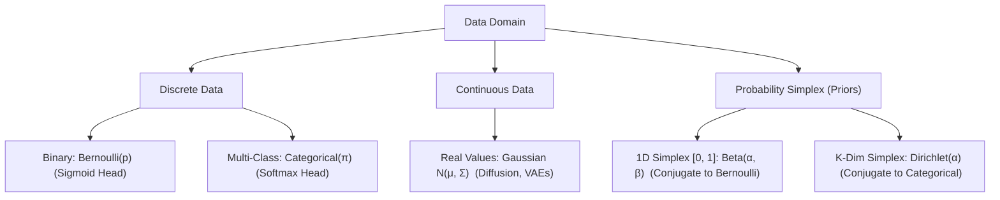

# Chapter 3.4: Parametric Distributions (Bernoulli, Categorical, Gaussian, Beta, Dirichlet)

---

## Pedagogical Navigation
- **Module 03:** Probability Theory for Deep Learning
- **Previous Chapter:** [Chapter 3.3: Expectation, Variance, Covariance & Covariance Matrices](./03_expectation_variance_covariance.md)
- **Next Chapter:** [Chapter 3.5: Joint, Marginal & Conditional Distributions](./05_joint_marginal_conditional.md)
- **Companion Code:** [04_parametric_distributions.py](./code/04_parametric_distributions.py)
- **Tracker & Index:** [Course Index & Progress Tracker](../00_index_and_tracker.md)

---

## Part 1: Intuition & 101 Motivation

Why does deep learning rely on **parametric distributions**?
An arbitrary, non-parametric probability distribution over an image of size $256 \times 256$ with 256 color levels would require storing $256^{196608}$ numbers—more than the number of atoms in the observable universe.
A **parametric distribution** $p(x; \theta)$ compresses an infinite universe of possibilities into a finite vector of tunable parameters $\theta$.

In modern deep learning, five parametric families form the universal grammar of neural architectures:
1. **Bernoulli:** Binary decisions ($y \in \{0, 1\}$), Sigmoid classification, Dropout mask generation.
2. **Categorical (Multinoulli):** Multi-class tokens ($y \in \{1, \dots, K\}$), Softmax heads in Transformers and LLMs.
3. **Gaussian (Normal):** The backbone of continuous deep learning—Latent spaces in VAEs, Markov transition kernels in Diffusion Models, weight initialization distributions.
4. **Beta:** The conjugate prior over a single continuous probability parameter $p \in [0, 1]$.
5. **Dirichlet:** The conjugate prior over the entire probability simplex $\Delta^{K-1}$ (distributions over distributions), used in Bayesian Neural Networks, Topic Models, and Mixture of Experts routing priors.



---

## Part 2: Rigorous Mathematical Formulation

### 1. The Bernoulli Distribution (Binary Outcomes)

Models a single binary trial with success probability $p \in [0, 1]$.

- **Support:** $\mathcal{X} = \{0, 1\}$
- **Parameter:** $p \in [0, 1]$
- **PMF:**
  $$p_X(x; p) = p^x (1 - p)^{1 - x} = \begin{cases} p, & x = 1 \\ 1 - p, & x = 0 \end{cases}$$
- **Mean & Variance:**
  $$\mathbf{\mathbb{E}[X] = p}, \qquad \mathbf{\text{Var}(X) = p(1 - p)}$$
- **Binary Cross-Entropy Loss Connection:**
  The negative log-likelihood of a Bernoulli observation $y \in \{0, 1\}$ given model prediction $\hat{y} = \sigma(z) \in (0, 1)$ is:
  $$\mathcal{L}_{\text{BCE}} = -\log p(y; \hat{y}) = -\left[ y \log \hat{y} + (1 - y) \log(1 - \hat{y}) \right]$$

---

### 2. The Categorical Distribution (Multi-Class Outcomes)

Models a single trial resulting in one of $K$ mutually exclusive categories.

- **Support:** $\mathcal{X} = \{e_1, e_2, \dots, e_K\}$ (one-hot vectors in $\mathbb{R}^K$)
- **Parameters:** $\pi = [\pi_1, \pi_2, \dots, \pi_K]^T \in \Delta^{K-1}$ such that $\pi_k \ge 0$ and $\sum_{k=1}^K \pi_k = 1$.
- **PMF:**
  $$p_X(x; \pi) = \prod_{k=1}^K \pi_k^{x_k}$$
- **Mean & Covariance Matrix:**
  $$\mathbf{\mathbb{E}[X] = \pi}, \qquad \mathbf{\text{Cov}(X) = \text{diag}(\pi) - \pi \pi^T}$$
  *(Notice: The covariance matrix of a Categorical variable is mathematically identical to the Softmax Jacobian derived in Chapter 2.3!)*
- **Categorical Cross-Entropy Loss Connection:**
  $$\mathcal{L}_{\text{CCE}} = -\sum_{k=1}^K y_k \log \hat{\pi}_k, \quad \text{where } \hat{\pi} = \text{softmax}(z)$$

---

### 3. The Multivariate Gaussian (Normal) Distribution

The central distribution of continuous mathematics.

- **Support:** $\mathcal{X} = \mathbb{R}^D$
- **Parameters:** Mean vector $\mu \in \mathbb{R}^D$, Covariance matrix $\Sigma \in \mathbb{R}^{D \times D}$ ($\Sigma \succ 0$ is symmetric positive definite).
- **PDF:**
  $$\mathbf{p(x; \mu, \Sigma) = \frac{1}{(2\pi)^{D/2} |\det \Sigma|^{1/2}} \exp\left( -\frac{1}{2} (x - \mu)^T \Sigma^{-1} (x - \mu) \right)}$$

#### Key Components:
1. **Mahalanobis Distance:** $\Delta^2 = (x - \mu)^T \Sigma^{-1} (x - \mu)$ measures statistical distance scaled by variance and correlation.
2. **Log-Likelihood:**
   $$\log p(x; \mu, \Sigma) = -\frac{D}{2} \log(2\pi) - \frac{1}{2} \log \det \Sigma - \frac{1}{2} (x - \mu)^T \Sigma^{-1} (x - \mu)$$
3. **Maximum Entropy Theorem:** Among all continuous multivariate distributions with a specified mean $\mu$ and covariance $\Sigma$, the Gaussian distribution **maximizes Shannon Differential Entropy**:
   $$H(X) = \frac{1}{2} \log \left( (2\pi e)^D \det \Sigma \right)$$
   It is the most honest, least-assuming distribution given first and second moments!

---

### 4. The Beta Distribution (Priors Over Probabilities)

The continuous distribution over the interval $[0, 1]$, serving as the natural conjugate prior for Bernoulli trials.

- **Support:** $\mathcal{X} = [0, 1]$
- **Parameters:** Shape parameters $\alpha > 0, \beta > 0$ (pseudo-counts of successes and failures).
- **PDF:**
  $$p(p; \alpha, \beta) = \frac{1}{\text{B}(\alpha, \beta)} p^{\alpha - 1} (1 - p)^{\beta - 1}$$
  where $\text{B}(\alpha, \beta) = \frac{\Gamma(\alpha)\Gamma(\beta)}{\Gamma(\alpha + \beta)}$ is the Beta function, and $\Gamma(z) = \int_0^\infty t^{z-1} e^{-t} dt$ is the Gamma function.
- **Mean & Variance:**
  $$\mathbf{\mathbb{E}[p] = \frac{\alpha}{\alpha + \beta}}, \qquad \mathbf{\text{Var}(p) = \frac{\alpha \beta}{(\alpha + \beta)^2 (\alpha + \beta + 1)}}$$

#### Bayesian Conjugacy with Bernoulli:
If Prior $p \sim \text{Beta}(\alpha, \beta)$ and we observe $k$ successes in $n$ Bernoulli trials:
$$\text{Posterior } p \mid \text{data} \sim \mathbf{\text{Beta}(\alpha + k, \beta + n - k)}$$
Bayesian updating is simply **adding integer counts** to the prior parameters!

---

### 5. The Dirichlet Distribution (Priors Over Categorical Distributions)

The multivariate generalization of the Beta distribution, supported on the $(K-1)$-dimensional probability simplex:
$$\Delta^{K-1} = \left\{ \pi \in \mathbb{R}^K \;\middle|\; \pi_k \ge 0, \; \sum_{k=1}^K \pi_k = 1 \right\}$$

- **Support:** $\mathcal{X} = \Delta^{K-1}$
- **Parameters:** Concentration parameters $\alpha = [\alpha_1, \alpha_2, \dots, \alpha_K]^T$ with $\alpha_k > 0$.
- **PDF:**
  $$\mathbf{p(\pi; \alpha) = \frac{1}{\text{B}(\alpha)} \prod_{k=1}^K \pi_k^{\alpha_k - 1}}$$
  where $\text{B}(\alpha) = \frac{\prod_{k=1}^K \Gamma(\alpha_k)}{\Gamma(\alpha_0)}$ and $\alpha_0 = \sum_{k=1}^K \alpha_k$.
- **Mean & Covariance:**
  $$\mathbf{\mathbb{E}[\pi_k] = \frac{\alpha_k}{\alpha_0}}, \qquad \mathbf{\text{Var}(\pi_k) = \frac{\alpha_k (\alpha_0 - \alpha_k)}{\alpha_0^2 (\alpha_0 + 1)}}$$
  $$\mathbf{\text{Cov}(\pi_j, \pi_k) = -\frac{\alpha_j \alpha_k}{\alpha_0^2 (\alpha_0 + 1)}} \quad (j \neq k)$$

#### The Shape of the Simplex as $\alpha$ Varies:
- **$\alpha_k = 1$ for all $k$:** Uniform distribution over the entire simplex.
- **$\alpha_k > 1$ for all $k$:** Distribution concentrates in the **center** of the simplex (encourages balanced probabilities, like uniform distributions).
- **$\alpha_k < 1$ for all $k$:** Distribution concentrates at the **corners** of the simplex (encourages **sparsity**: one-hot like distributions where one probability is 1 and all others are 0).

---

## Part 3: Geometric, Algebraic & Physical Interpretation

### 1. Conjugate Prior Family Tree
A prior is **conjugate** to a likelihood if the posterior belongs to the exact same parametric family as the prior.

```
       Likelihood                  Conjugate Prior
       -----------------------     -------------------------
       Bernoulli(p)          <---> Beta(α, β)
       Categorical(π)        <---> Dirichlet(α₁, ..., α_K)
       Gaussian N(x; μ, σ²)  <---> Gaussian N(μ; μ₀, σ₀²) (for mean)
                                   Inverse-Gamma(σ²) (for variance)
```

In deep learning, conjugacy guarantees closed-form analytical posteriors without requiring costly Markov Chain Monte Carlo (MCMC) simulations!

---

## Part 4: Real-World Analogy

### The Rookie Baseball Batter & The Master Chef
1. **The Beta Distribution (The Rookie Batter):**
   A rookie baseball player steps up to bat. Before seeing him play, you give him a prior $\text{Beta}(2, 2)$ (prior mean $= 2/4 = 0.50$, representing moderate uncertainty).
   - In his first 10 at-bats, he gets 3 hits and 7 strikeouts.
   - His updated posterior is immediately $\text{Beta}(2 + 3, 2 + 7) = \text{Beta}(5, 9)$.
   - New expected batting average: $\frac{5}{14} \approx 0.357$.
2. **The Dirichlet Distribution (The Master Chef's Spice Blend):**
   A chef is creating a blend of three spices: Salt, Pepper, and Cumin.
   The proportions must sum to $100\%$ ($\pi_1 + \pi_2 + \pi_3 = 1$).
   - A Dirichlet prior with $\alpha = [10, 10, 10]$ enforces that any acceptable blend must be balanced near the center.
   - A Dirichlet prior with $\alpha = [0.2, 0.2, 0.2]$ enforces that any acceptable blend must be pure: mostly all salt, mostly all pepper, or mostly all cumin!

---

## Part 5: "AI by Hand" (Prof. Tom Yeh Style Visual Grids)

Let us evaluate a 2D Bivariate Gaussian density and its log-likelihood step-by-step using concrete numbers. No steps skipped.

### 1. Problem Setup & Toy Parameters
Consider a 2D Gaussian random vector $X \sim \mathcal{N}(\mu, \Sigma)$:
$$\mu = \begin{bmatrix} 0.0 \\ 1.0 \end{bmatrix}, \quad \Sigma = \begin{bmatrix} 2.0 & 1.0 \\ 1.0 & 2.0 \end{bmatrix}$$
Target evaluation point:
$$x = \begin{bmatrix} 1.0 \\ 2.0 \end{bmatrix}$$

---

### 2. "What Refers to What" Legend Protocol

| Symbol | Ambient Dimension | Pure Math Role | Deep Learning Meaning | Toy Value in Walkthrough |
| :--- | :--- | :--- | :--- | :--- |
| $\mu$ | $\mathbb{R}^{2 \times 1}$ | Distribution mean vector | Latent mean $\mu(x)$ in VAE encoder | $[0.0, 1.0]^T$ |
| $\Sigma$ | $\mathbb{R}^{2 \times 2}$ | Covariance matrix | Latent covariance matrix | $\begin{bmatrix} 2 & 1 \\ 1 & 2 \end{bmatrix}$ |
| $x$ | $\mathbb{R}^{2 \times 1}$ | Evaluation point | Latent sample $z$ | $[1.0, 2.0]^T$ |
| $\Delta x = x - \mu$ | $\mathbb{R}^{2 \times 1}$ | Centered deviation | Residual vector | $[1.0, 1.0]^T$ |
| $\det(\Sigma)$ | $\mathbb{R}$ | Covariance determinant | Generalized variance / volume factor | $3.0$ |
| $\Sigma^{-1}$ | $\mathbb{R}^{2 \times 2}$ | Precision matrix | Inverse covariance metric tensor | $\frac{1}{3} \begin{bmatrix} 2 & -1 \\ -1 & 2 \end{bmatrix}$ |
| $\Delta^2$ | $\mathbb{R}$ | Squared Mahalanobis distance | Scaled distance penalty | $2/3 \approx 0.666667$ |
| $Z_{\text{norm}}$ | $\mathbb{R}$ | Normalizing constant | $(2\pi)^{D/2} |\det\Sigma|^{1/2}$ | $2\pi\sqrt{3} \approx 10.882796$ |
| $p(x)$ | $\mathbb{R}$ | Continuous probability density | Likelihood $p_\theta(z)$ | $\approx 0.065841$ |
| $\log p(x)$ | $\mathbb{R}$ | Log-likelihood | Reconstruction / Energy term | $\approx -2.720480$ |

---

### 3. Step-by-Step Manual Arithmetic

#### Step 1: Compute Centered Deviation $\Delta x = x - \mu$
$$\Delta x = \begin{bmatrix} 1.0 \\ 2.0 \end{bmatrix} - \begin{bmatrix} 0.0 \\ 1.0 \end{bmatrix} = \begin{bmatrix} 1.0 - 0.0 \\ 2.0 - 1.0 \end{bmatrix} = \begin{bmatrix} \mathbf{1.0} \\ \mathbf{1.0} \end{bmatrix}$$

#### Step 2: Compute Determinant & Precision Matrix $\Sigma^{-1}$
$$\det(\Sigma) = (2.0)(2.0) - (1.0)(1.0) = 4.0 - 1.0 = \mathbf{3.0}$$
Compute inverse via 2x2 formula $\Sigma^{-1} = \frac{1}{\det\Sigma} \begin{bmatrix} d & -b \\ -c & a \end{bmatrix}$:
$$\Sigma^{-1} = \frac{1}{3.0} \begin{bmatrix} 2.0 & -1.0 \\ -1.0 & 2.0 \end{bmatrix} = \begin{bmatrix} 2/3 & -1/3 \\ -1/3 & 2/3 \end{bmatrix}$$

#### Step 3: Compute Squared Mahalanobis Distance $\Delta^2 = \Delta x^T \Sigma^{-1} \Delta x$
First, compute vector product $\Sigma^{-1} \Delta x$:
$$\Sigma^{-1} \Delta x = \frac{1}{3} \begin{bmatrix} 2 & -1 \\ -1 & 2 \end{bmatrix} \begin{bmatrix} 1 \\ 1 \end{bmatrix} = \frac{1}{3} \begin{bmatrix} 2(1) - 1(1) \\ -1(1) + 2(1) \end{bmatrix} = \frac{1}{3} \begin{bmatrix} 1 \\ 1 \end{bmatrix} = \begin{bmatrix} 1/3 \\ 1/3 \end{bmatrix}$$

Second, compute dot product $\Delta x^T (\Sigma^{-1} \Delta x)$:
$$\Delta^2 = \begin{bmatrix} 1.0 & 1.0 \end{bmatrix} \begin{bmatrix} 1/3 \\ 1/3 \end{bmatrix} = (1.0)(1/3) + (1.0)(1/3) = \frac{2}{3} \approx \mathbf{0.666667}$$

#### Step 4: Compute Exponential Factor
$$\exp\left( -\frac{1}{2} \Delta^2 \right) = \exp\left( -\frac{1}{2} \cdot \frac{2}{3} \right) = \exp\left( -\frac{1}{3} \right) \approx \mathbf{0.71653131}$$

#### Step 5: Compute Normalization Constant $Z_{\text{norm}}$
For $D = 2$:
$$Z_{\text{norm}} = (2\pi)^{D/2} |\det \Sigma|^{1/2} = (2\pi)^1 \sqrt{3} = 2 \pi \sqrt{3}$$
Since $\pi \approx 3.14159265$ and $\sqrt{3} \approx 1.73205081$:
$$Z_{\text{norm}} \approx 2 \times 3.14159265 \times 1.73205081 \approx \mathbf{10.88279618}$$

#### Step 6: Compute Final PDF Value $p(x)$
$$p(x) = \frac{\exp(-1/3)}{2\pi\sqrt{3}} = \frac{0.71653131}{10.88279618} \approx \mathbf{0.06584074}$$

#### Step 7: Compute Exact Analytical Log-Likelihood $\log p(x)$
$$\log p(x) = -\frac{1}{3} - \log(2\pi\sqrt{3}) = -0.33333333 - \log(10.88279618)$$
Since $\log(10.88279618) \approx 2.38714732$:
$$\log p(x) = -0.33333333 - 2.38714732 = \mathbf{-2.72048065}$$

---

### 4. Visual Summary Grid

```
+-----------------------------------------------------------------------------------------------+
|                       PROF. TOM YEH STYLE MULTIVARIATE GAUSSIAN GRID                          |
+-----------------------------------------------------------------------------------------------+
| Parameters: μ = [0.0, 1.0]ᵀ,  Σ = [[2, 1], [1, 2]]       | Target Point: x = [1.0, 2.0]ᵀ      |
+------------------------------------+---------------------+------------------------------------+
| STEP / COMPONENT                   | FORMULA             | COMPUTED VALUE                     |
+------------------------------------+---------------------+------------------------------------+
| Centered Difference Δx             | x - μ               | [ 1.0,  1.0 ]ᵀ                     |
| Determinant det(Σ)                 | 2*2 - 1*1           | 3.000000                           |
| Precision Matrix Σ⁻¹               | (1/det) · adj(Σ)    | [[ 2/3, -1/3 ], [ -1/3, 2/3 ]]     |
| Precision Vector Σ⁻¹ Δx            | Matrix-Vector       | [ 1/3,  1/3 ]ᵀ                     |
| Mahalanobis Distance Δ²            | Δxᵀ Σ⁻¹ Δx          | 2/3 = 0.666667                     |
| Exponential Term                   | exp(-0.5 · Δ²)      | exp(-1/3) = 0.716531               |
| Normalizer Z_norm                  | 2π · sqrt(det)      | 2π · sqrt(3) = 10.882796           |
| FINAL PDF VALUE p(x)               | exp_term / Z_norm   | 0.065841                           |
| LOG-LIKELIHOOD log p(x)            | -0.5 Δ² - log(Z)    | -2.720481                          |
+------------------------------------+---------------------+------------------------------------+
```

---

## Part 6: Step-by-Step Solved Illustrations

### Case A: Beta-Binomial Updating for A/B Testing
A machine learning startup launches an A/B test for a new landing page:
- **Prior:** $\text{Beta}(10, 10)$ (prior mean $= 50\%$, equivalent to 20 historical views).
- **Observed Data:** $100$ visitors, $25$ conversions ($k = 25, n - k = 75$).

1. **Posterior Parameters:**
   $$\alpha_{\text{post}} = \alpha_{\text{prior}} + k = 10 + 25 = \mathbf{35}$$
   $$\beta_{\text{post}} = \beta_{\text{prior}} + (n - k) = 10 + 75 = \mathbf{85}$$
2. **Posterior Mean Conversion Rate:**
   $$\mathbb{E}[p \mid \text{data}] = \frac{\alpha_{\text{post}}}{\alpha_{\text{post}} + \beta_{\text{post}}} = \frac{35}{35 + 85} = \frac{35}{120} \approx \mathbf{0.2917} \quad (\mathbf{29.17\%})$$
3. **Posterior Variance:**
   $$\text{Var}(p \mid \text{data}) = \frac{(35)(85)}{(120)^2 (121)} = \frac{2975}{14400 \times 121} = \frac{2975}{1742400} \approx \mathbf{0.001707} \implies \sigma \approx 4.13\%$$

---

### Case B: Gaussian Conditioning (Schur Complement Formulation)
Let $[X_1, X_2]^T \sim \mathcal{N}(\mu, \Sigma)$ be partitioned:
$$\mu = \begin{bmatrix} \mu_1 \\ \mu_2 \end{bmatrix}, \quad \Sigma = \begin{bmatrix} \Sigma_{11} & \Sigma_{12} \\ \Sigma_{21} & \Sigma_{22} \end{bmatrix}$$
Conditioned on observing $X_2 = x_2$, what is the conditional distribution $X_1 \mid X_2 = x_2$?

#### Theorem 3.4.1: Gaussian Conditioning Theorem
The conditional distribution is **still Gaussian**:
$$X_1 \mid X_2 = x_2 \sim \mathcal{N}(\mu_{1|2}, \Sigma_{1|2})$$
where:
$$\mathbf{\mu_{1|2} = \mu_1 + \Sigma_{12} \Sigma_{22}^{-1} (x_2 - \mu_2)}$$
$$\mathbf{\Sigma_{1|2} = \Sigma_{11} - \Sigma_{12} \Sigma_{22}^{-1} \Sigma_{21}}$$
The matrix $\Sigma_{1|2}$ is the **Schur Complement** of $\Sigma_{22}$ in $\Sigma$!
Notice that the conditional variance $\Sigma_{1|2}$ **does not depend on the observed value $x_2$**!

---

## Part 7: Deep Learning Connection & Application

### 1. Denoising Diffusion Probabilistic Models (DDPM)
In diffusion models (Ho et al., 2020), the forward corruption process is a chain of conditional Gaussians:
$$q(x_t \mid x_{t-1}) = \mathcal{N}\left( x_t; \sqrt{1 - \beta_t} x_{t-1}, \beta_t I \right)$$
Using Gaussian marginalization, we can jump directly from $x_0$ to any arbitrary timestep $t$ in a single step:
$$q(x_t \mid x_0) = \mathcal{N}\left( x_t; \sqrt{\bar{\alpha}_t} x_0, (1 - \bar{\alpha}_t) I \right)$$
where $\alpha_t = 1 - \beta_t$ and $\bar{\alpha}_t = \prod_{s=1}^t \alpha_s$.
The reparameterization trick allows exact closed-form sampling:
$$x_t = \sqrt{\bar{\alpha}_t} x_0 + \sqrt{1 - \bar{\alpha}_t} \, \epsilon, \quad \epsilon \sim \mathcal{N}(0, I)$$

---

### 2. Label Smoothing as a Dirichlet Prior
Standard cross-entropy uses hard one-hot targets $y \in \{0, 1\}^K$, which causes neural networks to output extreme logits ($z_k \to \infty$) and become dangerously overconfident.
**Label Smoothing** replaces the one-hot target with:
$$y_{\text{smooth}} = (1 - \epsilon) y_{\text{one-hot}} + \frac{\epsilon}{K}$$
This corresponds to taking the expectation of a symmetric Dirichlet prior $\text{Dirichlet}(\alpha)$ with concentration $\alpha = \frac{\epsilon}{K}$, regularizing the model's confidence!

---

## Part 8: Code Implementation & Verification

The companion Python module [04_parametric_distributions.py](./code/04_parametric_distributions.py) provides full verification:
1. **Part 5 Bivariate Gaussian Grid Verification:** Validates analytical determinant ($3.0$), Mahalanobis distance ($2/3$), PDF value ($0.065841$), and log-likelihood ($-2.720481$).
2. **PyTorch vs. SciPy Multivariate Normal:** Asserts exact agreement with `scipy.stats.multivariate_normal` and PyTorch distributions.
3. **Beta-Binomial Conjugacy Test:** Generates synthetic flips and confirms analytical posterior parameter updating.
4. **Dirichlet Simplex Sampling & Sparsity:** Visualizes and tests corner concentration when $\alpha < 1$ vs. center concentration when $\alpha > 1$.
5. **Gaussian Conditioning Closed-Form Verification:** Implements Schur complement conditional formulas and verifies via Monte Carlo slicing.
