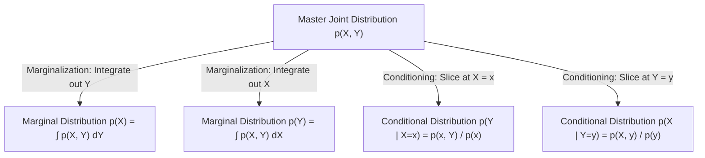

# Chapter 3.5: Joint, Marginal & Conditional Distributions

---

## Pedagogical Navigation
- **Module 03:** Probability Theory for Deep Learning
- **Previous Chapter:** [Chapter 3.4: Parametric Distributions (Bernoulli, Categorical, Gaussian, Beta, Dirichlet)](./04_parametric_distributions.md)
- **Next Chapter:** [Chapter 3.6: Asymptotic Theorems (LLN, CLT) & Inequalities](./06_asymptotic_theorems_and_inequalities.md)
- **Companion Code:** [05_joint_marginal_conditional.py](./code/05_joint_marginal_conditional.py)
- **Tracker & Index:** [Course Index & Progress Tracker](../00_index_and_tracker.md)

---

## Part 1: Intuition & 101 Motivation

In real-world machine learning, data is never a single lone variable.
Every modern problem involves interacting collections of variables:
- In Supervised Learning: Input features $X$ and ground-truth labels $Y$.
- In Generative Modeling (VAEs & Diffusion): Observed data $X$ and unobserved latent factors $Z$.
- In Bayesian Deep Learning: Dataset $\mathcal{D}$, model weights $\theta$, and hyper-parameters $\alpha$.

The complete, omniscient model of reality is the **Joint Probability Distribution**:
$$p(X, Y, Z)$$
It contains every correlation, non-linear interaction, and statistical dependency that exists in the system.

However, in practice, we almost never have direct access to all variables at once. We must perform two fundamental operations that define the core of AI inference:
1. **Marginalization (Summing or Integrating Out Unobserved Variables):**
   > *"I don't know the exact latent pose $Z$ of the cat in the image. What is the marginal probability $p(X)$ of the pixels alone across all possible poses?"*
   $$p(X) = \int p(X, Z) \, dZ$$
2. **Conditioning (Slicing the Distribution Given Observed Evidence):**
   > *"Given that I have observed the pixel values $X = x_{\text{obs}}$, what is the posterior distribution over class label $Y$ or latent factor $Z$?"*
   $$p(Z \mid X = x_{\text{obs}}) = \frac{p(x_{\text{obs}}, Z)}{\int p(x_{\text{obs}}, Z') \, dZ'}$$

Understanding how joint, marginal, and conditional distributions interact—and why the marginalizing integral $\int p(x, z) dz$ becomes an intractable wall in high dimensions—is the exact mathematical foundation for **Variational Autoencoders (VAEs)**, **Autoregressive LLMs**, and **Markov Decision Processes (RL)**.



---

## Part 2: Rigorous Mathematical Formulation

### 1. Joint Distributions (Discrete & Continuous)

#### Definition 3.5.1: Joint Cumulative Distribution Function (JCDF)
For two random variables $X$ and $Y$, their **Joint CDF** is:
$$F_{X, Y}(x, y) \triangleq P(X \le x, Y \le y)$$
- Bounded: $0 \le F_{X, Y}(x, y) \le 1$.
- Asymptotics: $\lim_{x, y \to -\infty} F(x, y) = 0$, and $\lim_{x, y \to +\infty} F(x, y) = 1$.

#### Discrete Case (Joint PMF):
$$p_{X, Y}(x, y) = P(X = x, Y = y)$$
Satisfying $p_{X,Y}(x, y) \ge 0$ and $\sum_x \sum_y p_{X,Y}(x, y) = 1.0$.

#### Continuous Case (Joint PDF):
If $F_{X, Y}$ is differentiable:
$$f_{X, Y}(x, y) = \frac{\partial^2 F_{X, Y}}{\partial x \partial y}(x, y)$$
The probability that $(X, Y)$ falls inside a 2D region $\mathcal{A} \subset \mathbb{R}^2$ is the volume under the joint surface:
$$P((X, Y) \in \mathcal{A}) = \iint_{\mathcal{A}} f_{X, Y}(x, y) \, dx \, dy$$

---

### 2. Marginalization: The Sum Rule

How do we extract the distribution of one variable while ignoring the rest?
We **sum over** (for discrete) or **integrate over** (for continuous) all possible values of the nuisance variables.

#### Theorem 3.5.1: Marginalization (The Sum Rule)
- **Discrete Marginal PMF:**
  $$p_X(x) = \sum_{y \in \mathcal{Y}} p_{X, Y}(x, y)$$
- **Continuous Marginal PDF:**
  $$f_X(x) = \int_{-\infty}^\infty f_{X, Y}(x, y) \, dy$$

*Proof (Continuous Case):*
$$F_X(x) = P(X \le x) = P(X \le x, Y < \infty) = \int_{-\infty}^x \left( \int_{-\infty}^\infty f_{X, Y}(t, y) \, dy \right) dt$$
Differentiating with respect to $x$ via the Fundamental Theorem of Calculus:
$$f_X(x) = \frac{d}{dx} F_X(x) = \int_{-\infty}^\infty f_{X, Y}(x, y) \, dy. \quad \blacksquare$$

---

### 3. Conditioning: Slicing the Joint Surface

#### Definition 3.5.2: Conditional Distribution
For a fixed observed value $X = x$ where $f_X(x) > 0$:
- **Discrete Conditional PMF:**
  $$p_{Y \mid X}(y \mid x) \triangleq \frac{p_{X, Y}(x, y)}{p_X(x)}$$
- **Continuous Conditional PDF:**
  $$\mathbf{f_{Y \mid X}(y \mid x) \triangleq \frac{f_{X, Y}(x, y)}{f_X(x)} = \frac{f_{X, Y}(x, y)}{\int_{-\infty}^\infty f_{X, Y}(x, y') \, dy'}}$$

#### Verification of Valid Probability Density:
For any fixed $x$, $f_{Y \mid X}(y \mid x)$ is a valid 1D probability density over $y$:
1. $f_{Y \mid X}(y \mid x) \ge 0$ because both numerator and denominator are non-negative.
2. Integrates to $1.0$:
   $$\int_{-\infty}^\infty f_{Y \mid X}(y \mid x) \, dy = \int_{-\infty}^\infty \frac{f_{X, Y}(x, y)}{f_X(x)} \, dy = \frac{1}{f_X(x)} \int_{-\infty}^\infty f_{X, Y}(x, y) \, dy = \frac{f_X(x)}{f_X(x)} = 1.0 \quad \checkmark$$

---

### 4. The Law of Total Expectation (The Tower Property)

What is the expected value of $Y$ if we first predict $Y$ given $X$, and then average those predictions across all possible inputs $X$?

#### Definition 3.5.3: Conditional Expectation
The **conditional expectation** of $Y$ given $X = x$, denoted $\mathbb{E}[Y \mid X = x]$, is the mean of the conditional distribution:
$$\mathbb{E}[Y \mid X = x] = \int_{-\infty}^\infty y \cdot f_{Y \mid X}(y \mid x) \, dy$$
Notice that as $x$ varies, $\mathbb{E}[Y \mid X = x]$ is a **deterministic function of $x$**:
$$g(x) \triangleq \mathbb{E}[Y \mid X = x]$$
Therefore, $\mathbb{E}[Y \mid X] = g(X)$ is itself a **random variable**!

#### Theorem 3.5.2: Law of Total Expectation (Adam's Law / Tower Property)
$$\mathbf{\mathbb{E}[Y] = \mathbb{E}_X\left[ \mathbb{E}_{Y \mid X}[Y \mid X] \right]}$$

##### Formal Proof:
$$\mathbb{E}_X\left[ \mathbb{E}_{Y \mid X}[Y \mid X] \right] = \int_{-\infty}^\infty \left( \int_{-\infty}^\infty y f_{Y \mid X}(y \mid x) \, dy \right) f_X(x) \, dx$$
Substitute $f_{Y \mid X}(y \mid x) f_X(x) = f_{X, Y}(x, y)$:
$$= \int_{-\infty}^\infty \int_{-\infty}^\infty y f_{X, Y}(x, y) \, dy \, dx = \int_{-\infty}^\infty y \left( \int_{-\infty}^\infty f_{X, Y}(x, y) \, dx \right) dy = \int_{-\infty}^\infty y f_Y(y) \, dy = \mathbb{E}[Y]. \quad \blacksquare$$

---

### 5. The Law of Total Variance (Eve's Law)

How does uncertainty decompose across multiple variables?

#### Theorem 3.5.3: Law of Total Variance (Eve's Law)
$$\mathbf{\text{Var}(Y) = \mathbb{E}_X\left[ \text{Var}(Y \mid X) \right] + \text{Var}_X\left( \mathbb{E}[Y \mid X] \right)}$$

##### First-Principles Mathematical Proof:
Recall the fundamental definition of variance:
$$\text{Var}(Y) = \mathbb{E}[Y^2] - (\mathbb{E}[Y])^2$$

1. By the Tower Property (Theorem 3.5.2), the unconditional expectation of $Y^2$ is:
   $$\mathbb{E}[Y^2] = \mathbb{E}_X\left[ \mathbb{E}_{Y \mid X}[Y^2 \mid X] \right]$$
2. For any fixed $X$, the definition of conditional variance is:
   $$\text{Var}(Y \mid X) = \mathbb{E}[Y^2 \mid X] - (\mathbb{E}[Y \mid X])^2 \implies \mathbb{E}[Y^2 \mid X] = \text{Var}(Y \mid X) + (\mathbb{E}[Y \mid X])^2$$
3. Taking the outer expectation over $X$ on both sides:
   $$\mathbb{E}[Y^2] = \mathbb{E}_X\left[ \text{Var}(Y \mid X) + (\mathbb{E}[Y \mid X])^2 \right] = \mathbb{E}_X[\text{Var}(Y \mid X)] + \mathbb{E}_X\left[(\mathbb{E}[Y \mid X])^2\right]$$
4. Now consider $(\mathbb{E}[Y])^2$. Again by the Tower Property:
   $$\mathbb{E}[Y] = \mathbb{E}_X[\mathbb{E}[Y \mid X]] \implies (\mathbb{E}[Y])^2 = \left( \mathbb{E}_X[\mathbb{E}[Y \mid X]] \right)^2$$
5. Substitute equations (3) and (4) into $\text{Var}(Y) = \mathbb{E}[Y^2] - (\mathbb{E}[Y])^2$:
   $$\text{Var}(Y) = \mathbb{E}_X[\text{Var}(Y \mid X)] + \underbrace{\left( \mathbb{E}_X\left[(\mathbb{E}[Y \mid X])^2\right] - \left( \mathbb{E}_X[\mathbb{E}[Y \mid X]] \right)^2 \right)}_{\equiv \text{Var}_X(\mathbb{E}[Y \mid X])}$$
   $$\mathbf{\text{Var}(Y) = \mathbb{E}_X[\text{Var}(Y \mid X)] + \text{Var}_X(\mathbb{E}[Y \mid X])} \quad \blacksquare$$

##### The Two Components:
1. **$\mathbb{E}_X[\text{Var}(Y \mid X)]$ (Unexplained / Aleatoric Variance):**
   The average noise that remains in $Y$ even after we observe $X$.
2. **$\text{Var}_X(\mathbb{E}[Y \mid X])$ (Explained Variance):**
   The variance in our best prediction $\mathbb{E}[Y \mid X]$ due to fluctuations in $X$.
This identity forms the mathematical foundation of the **Coefficient of Determination ($R^2$)** and ANOVA in statistics!

---

### 6. The MMSE Theorem: Conditional Expectation as the Optimal L2 Predictor

In supervised regression, a neural network $g(X; \theta)$ is trained to predict $Y$ from input features $X$ by minimizing the Mean Squared Error (MSE) loss:
$$\mathcal{L}(\theta) = \mathbb{E}_{(X, Y)} \left[ (Y - g(X))^2 \right]$$
What is the theoretical performance ceiling of *any* arbitrary regression model, regardless of neural network capacity?

#### Theorem 3.5.4: Minimum Mean Square Error (MMSE) Optimal Predictor
Among all measurable functions $g(X)$, the **conditional expectation** $g^*(X) \triangleq \mathbb{E}[Y \mid X]$ is the unique global minimizer of the mean squared error:
$$\mathbf{\arg\min_{g} \mathbb{E}\left[ (Y - g(X))^2 \right] = \mathbb{E}[Y \mid X]}$$

##### First-Principles Proof:
Add and subtract $\mathbb{E}[Y \mid X]$ inside the quadratic loss:
$$Y - g(X) = (Y - \mathbb{E}[Y \mid X]) + (\mathbb{E}[Y \mid X] - g(X))$$
Square both sides:
$$(Y - g(X))^2 = (Y - \mathbb{E}[Y \mid X])^2 + 2(Y - \mathbb{E}[Y \mid X])(\mathbb{E}[Y \mid X] - g(X)) + (\mathbb{E}[Y \mid X] - g(X))^2$$
Take the expected value of both sides. By linearity of expectation:
$$\mathbb{E}[(Y - g(X))^2] = \mathbb{E}[(Y - \mathbb{E}[Y \mid X])^2] + 2 \mathbb{E}\left[ (Y - \mathbb{E}[Y \mid X])(\mathbb{E}[Y \mid X] - g(X)) \right] + \mathbb{E}[(\mathbb{E}[Y \mid X] - g(X))^2]$$

Now evaluate the cross-term using the Tower Property (Theorem 3.5.2):
$$\mathbb{E}\left[ (Y - \mathbb{E}[Y \mid X])(\mathbb{E}[Y \mid X] - g(X)) \right] = \mathbb{E}_X \left[ \mathbb{E}_{Y \mid X} \left[ (Y - \mathbb{E}[Y \mid X])(\mathbb{E}[Y \mid X] - g(X)) \;\middle|\; X \right] \right]$$
Since $(\mathbb{E}[Y \mid X] - g(X))$ is a purely deterministic function of $X$, it pulls out of the inner conditional expectation:
$$= \mathbb{E}_X \left[ (\mathbb{E}[Y \mid X] - g(X)) \cdot \underbrace{\mathbb{E}_{Y \mid X} [ Y - \mathbb{E}[Y \mid X] \mid X ]}_{= \mathbb{E}[Y \mid X] - \mathbb{E}[Y \mid X] = 0} \right] = \mathbb{E}_X [ 0 ] = 0$$
The cross-term is identically zero! Therefore:
$$\mathbb{E}[(Y - g(X))^2] = \mathbb{E}\left[(Y - \mathbb{E}[Y \mid X])^2\right] + \mathbb{E}\left[(\mathbb{E}[Y \mid X] - g(X))^2\right]$$
- The first term $\mathbb{E}[(Y - \mathbb{E}[Y \mid X])^2] = \mathbb{E}[\text{Var}(Y \mid X)]$ is the **irreducible aleatoric noise** inherent to the universe. It does not depend on the choice of $g$.
- The second term $\mathbb{E}[(\mathbb{E}[Y \mid X] - g(X))^2] \ge 0$ is strictly non-negative.
To minimize the total MSE, we must set the second term to zero, which occurs if and only if:
$$\mathbf{g(X) = \mathbb{E}[Y \mid X] \quad \text{almost surely.}} \quad \blacksquare$$
*Deep Learning Takeaway:* When you train a deep neural network on regression with MSE loss, the network is explicitly approximating the mathematical conditional expectation $\mathbb{E}[Y \mid X]$!

---

### 7. Conditional Independence and Factorization

#### Definition 3.5.4: Conditional Independence
Two random variables $X$ and $Y$ are **conditionally independent given $Z$**, denoted:
$$X \perp Y \mid Z$$
if and only if their conditional joint distribution factorizes as the product of their individual conditional distributions:
$$\mathbf{p(x, y \mid z) = p(x \mid z) \, p(y \mid z) \quad \forall x, y, z \text{ with } p(z) > 0}$$

#### Equivalent Characterization:
$$X \perp Y \mid Z \iff \mathbf{p(x \mid y, z) = p(x \mid z)}$$
*Intuition:* Once you observe $Z$, learning the value of $Y$ provides **zero additional information** about $X$.
- **In Naive Bayes Classifiers:** Features $X_i, X_j$ are assumed conditionally independent given class label $Y$: $p(x_1, \dots, x_D \mid y) = \prod_{i=1}^D p(x_i \mid y)$.
- **In Markov Decision Processes (RL):** The future state $S_{t+1}$ depends on history only through the current state-action pair: $S_{t+1} \perp (S_0, A_0, \dots, S_{t-1}, A_{t-1}) \mid (S_t, A_t)$.

---

## Part 3: Geometric, Algebraic & Physical Interpretation

### 1. Geometric View: Terrain, Shadows, and Knife Slices
Imagine a joint continuous probability density $f(x, y)$ as a 3D mountain range plotted above the $xy$-ground plane:
- **Joint Density $f(x, y)$:** The elevation of the terrain at coordinates $(x, y)$.
- **Marginal Density $f(x)$:** Shine a strong horizontal light parallel to the $y$-axis. The shadow cast onto the $x$-wall is the marginal distribution $f(x) = \int f(x, y) dy$.
- **Conditional Density $f(y \mid x = x_0)$:** Take a vertical machete and slice the mountain range along the line $x = x_0$. The exposed 2D cross-section outline has the exact shape of $f(y \mid x = x_0)$. Rescaling its area to $1.0$ yields the conditional density!

```
         z = f(x, y)
             ▲
             |        __/\__
             |       /      \   <--- Slicing at x = x₀ gives the 
             |      /        \       Conditional Profile f(y | x₀)
             +--------------------> y
            /
           /  (Projecting entire volume onto x gives Marginal f(x))
          ▼ x
```

---

## Part 4: Real-World Analogy

### The Weather Radar & The Airport Flight Delay
Suppose you are analyzing flight departure delays ($Y$) based on thunderstorm intensity ($X$):
1. **Joint Distribution $p(X, Y)$:** The historical frequency of flights experiencing storm level $X$ and delay $Y$.
2. **Marginal Distribution $p(Y)$:** The overall probability that your flight is delayed by 2 hours, without knowing anything about today's weather.
3. **Conditional Distribution $p(Y \mid X = \text{Severe})$:** You look out the terminal window and see a category-5 thunderstorm raging. Your flight delay distribution shifts dramatically: the probability of an on-time departure drops to near zero.
4. **Law of Total Variance:**
   The total variance in flight arrival times across the entire year ($\text{Var}(Y)$) equals:
   - The variation caused by changing weather seasons ($\text{Var}_X(\mathbb{E}[Y \mid X])$), PLUS
   - The random mechanical and baggage delays that occur on any given stormy day ($\mathbb{E}_X[\text{Var}(Y \mid X)]$).

---

## Part 5: "AI by Hand" (Prof. Tom Yeh Style Visual Grids)

Let us calculate a continuous joint distribution, its marginals, conditional densities, and expectations step-by-step using concrete numbers.

### 1. Problem Setup & Triangular Joint Support
Consider the continuous joint PDF defined on the triangular domain $0 \le y \le x \le 1$:
$$f_{X, Y}(x, y) = \begin{cases} 8 x y, & 0 \le y \le x \le 1 \\ 0, & \text{otherwise} \end{cases}$$

Notice:
- $X$ is restricted to $[0, 1]$.
- For any given $X = x$, $Y$ is restricted to $[0, x]$.

We will:
1. Verify $\iint f(x, y) \, dx \, dy = 1.0$.
2. Compute marginal densities $f_X(x)$ and $f_Y(y)$.
3. Compute conditional density $f_{Y \mid X}(y \mid x)$.
4. Evaluate at concrete numerical point: $x = 0.80, y = 0.40$.
5. Compute conditional expectation $\mathbb{E}[Y \mid X = 0.80]$.
6. Verify the Law of Total Expectation $\mathbb{E}[Y] = \mathbb{E}_X[\mathbb{E}[Y \mid X]]$.

---

### 2. "What Refers to What" Legend Protocol

| Symbol | Pure Math Role | Deep Learning Meaning | Toy Value in Walkthrough |
| :--- | :--- | :--- | :--- |
| $(X, Y)$ | 2D random vector | Joint input-output pair | Supported on $0 \le y \le x \le 1$ |
| $f_{X, Y}(0.8, 0.4)$ | Joint density | Joint likelihood $p(x, y)$ | $2.560000$ |
| $f_X(0.8)$ | Marginal density of $X$ | Input evidence $p(x)$ | $2.048000$ |
| $f_Y(0.4)$ | Marginal density of $Y$ | Target prior $p(y)$ | $1.344000$ |
| $f_{Y \mid X}(0.4 \mid 0.8)$ | Conditional density | Model predictive distribution $p(y \mid x)$ | $1.250000$ |
| $\mathbb{E}[Y \mid X = 0.8]$ | Conditional mean | Model regression prediction $\hat{y} = f(x)$ | $1.6/3 \approx 0.533333$ |
| $\mathbb{E}[Y]$ | Unconditional mean | Mean baseline prediction | $8/15 \approx 0.533333$ |

---

### 3. Step-by-Step Manual Arithmetic

#### Step 1: Verify Normalization $\iint f(x, y) dx dy = 1.0$
Set up the iterated integral with inner variable $y$ running from $0$ to $x$:
$$\int_0^1 \left( \int_0^x 8 x y \, dy \right) dx$$
- Inner integral w.r.t. $y$:
  $$\int_0^x 8 x y \, dy = 8 x \left[ \frac{y^2}{2} \right]_0^x = 8 x \left( \frac{x^2}{2} - 0 \right) = \mathbf{4 x^3}$$
- Outer integral w.r.t. $x$:
  $$\int_0^1 4 x^3 \, dx = \left[ x^4 \right]_0^1 = 1^4 - 0^4 = \mathbf{1.000000} \quad \checkmark$$

---

#### Step 2: Compute Marginal Densities
1. **Marginal of $X$ ($f_X(x)$):**
   By the inner integral above:
   $$\mathbf{f_X(x) = \int_0^x 8 x y \, dy = 4 x^3, \quad x \in [0, 1]}$$
2. **Marginal of $Y$ ($f_Y(y)$):**
   For a fixed $y \in [0, 1]$, $x$ runs from $y$ to $1$:
   $$f_Y(y) = \int_y^1 8 x y \, dx = 8 y \left[ \frac{x^2}{2} \right]_y^1 = 8 y \left( \frac{1}{2} - \frac{y^2}{2} \right) = \mathbf{4 y (1 - y^2) = 4 y - 4 y^3, \quad y \in [0, 1]}$$

---

#### Step 3: Compute Conditional Density $f_{Y \mid X}(y \mid x)$
Apply Definition 3.5.2:
$$f_{Y \mid X}(y \mid x) = \frac{f_{X, Y}(x, y)}{f_X(x)} = \frac{8 x y}{4 x^3} = \mathbf{\frac{2 y}{x^2}, \quad 0 \le y \le x}$$

Verify that this integrates to $1.0$ over $y \in [0, x]$:
$$\int_0^x \frac{2 y}{x^2} \, dy = \frac{2}{x^2} \left[ \frac{y^2}{2} \right]_0^x = \frac{2}{x^2} \cdot \frac{x^2}{2} = 1.0 \quad \checkmark$$

---

#### Step 4: Evaluate at Test Point $x = 0.80, y = 0.40$
1. Joint density:
   $$f_{X, Y}(0.8, 0.4) = 8(0.80)(0.40) = 8(0.32) = \mathbf{2.560000}$$
2. Marginal density of $X$:
   $$f_X(0.8) = 4(0.80)^3 = 4(0.512) = \mathbf{2.048000}$$
3. Marginal density of $Y$:
   $$f_Y(0.4) = 4(0.40) - 4(0.40)^3 = 1.60 - 4(0.064) = 1.60 - 0.256 = \mathbf{1.344000}$$
4. Conditional density $f_{Y \mid X}(0.4 \mid 0.8)$:
   $$f_{Y \mid X}(0.4 \mid 0.8) = \frac{2(0.40)}{(0.80)^2} = \frac{0.80}{0.64} = \mathbf{1.250000}$$
   Check quotient: $\frac{f_{X, Y}}{f_X} = \frac{2.560000}{2.048000} = \mathbf{1.250000} \quad \checkmark$

---

#### Step 5: Compute Conditional Expectation $\mathbb{E}[Y \mid X = x]$
$$\mathbb{E}[Y \mid X = x] = \int_0^x y \cdot f_{Y \mid X}(y \mid x) \, dy = \int_0^x y \left( \frac{2 y}{x^2} \right) dy = \frac{2}{x^2} \int_0^x y^2 \, dy = \frac{2}{x^2} \left[ \frac{y^3}{3} \right]_0^x = \frac{2}{x^2} \cdot \frac{x^3}{3} = \mathbf{\frac{2}{3} x}$$

Evaluate at $x = 0.80$:
$$\mathbb{E}[Y \mid X = 0.80] = \frac{2}{3}(0.80) = \frac{1.60}{3} \approx \mathbf{0.533333}$$

---

#### Step 6: Verify the Law of Total Expectation $\mathbb{E}[Y] = \mathbb{E}_X[\mathbb{E}[Y \mid X]]$
- Left Side: Direct computation of $\mathbb{E}[Y]$ from marginal $f_Y(y)$:
  $$\mathbb{E}[Y] = \int_0^1 y \cdot f_Y(y) \, dy = \int_0^1 y (4 y - 4 y^3) \, dy = \int_0^1 (4 y^2 - 4 y^4) \, dy = \left[ \frac{4 y^3}{3} - \frac{4 y^5}{5} \right]_0^1$$
  $$= \frac{4}{3} - \frac{4}{5} = \frac{20 - 12}{15} = \mathbf{\frac{8}{15} \approx 0.533333}$$

- Right Side: Expectation of conditional expectation:
  $$\mathbb{E}_X\left[ \mathbb{E}[Y \mid X] \right] = \mathbb{E}_X\left[ \frac{2}{3} X \right] = \frac{2}{3} \int_0^1 x \cdot f_X(x) \, dx = \frac{2}{3} \int_0^1 x (4 x^3) \, dx = \frac{8}{3} \int_0^1 x^4 \, dx$$
  $$= \frac{8}{3} \left[ \frac{x^5}{5} \right]_0^1 = \frac{8}{3} \cdot \frac{1}{5} = \mathbf{\frac{8}{15} \approx 0.533333}$$

**Both sides match to the exact fraction: $\frac{8}{15}$! The Tower Property is verified!**

---

### 4. Visual Summary Grid

```
+-----------------------------------------------------------------------------------------------+
|                    PROF. TOM YEH STYLE JOINT / MARGINAL / CONDITIONAL GRID                    |
+-----------------------------------------------------------------------------------------------+
| Joint Distribution: f(x, y) = 8xy  on  0 ≤ y ≤ x ≤ 1           | Test Point: (x=0.80, y=0.40) |
+-------------------------------+--------------------------------+------------------------------+
| PROBABILITY OBJECT            | ANALYTICAL CLOSED FORM         | VALUE AT (x=0.80, y=0.40)    |
+-------------------------------+--------------------------------+------------------------------+
| Joint Density f_XY(x, y)      | 8 x y                          | 2.560000                     |
| Marginal Density f_X(x)       | 4 x³                           | 2.048000                     |
| Marginal Density f_Y(y)       | 4 y - 4 y³                     | 1.344000                     |
| Conditional Density f(y | x)  | 2 y / x²                       | 1.250000                     |
| Consistency Check             | f_XY / f_X = 2.56 / 2.048      | 1.250000 (EXACT MATCH!)      |
| Conditional Mean E[Y | X=x]   | (2/3) x                        | (2/3)(0.8) = 0.533333        |
| Unconditional Mean E[Y]       | 8 / 15                         | 8/15       = 0.533333        |
+-------------------------------+--------------------------------+------------------------------+
| TOWER PROPERTY VERIFICATION:   E_X[ E[Y | X] ] = E_X[ (2/3)X ] = (2/3)(4/5) = 8/15 = E[Y]     |
+-----------------------------------------------------------------------------------------------+
```

---

## Part 6: Step-by-Step Solved Illustrations

### Case A: Eve's Law (Law of Total Variance) Verification
Compute both sides of $\text{Var}(Y) = \mathbb{E}_X[\text{Var}(Y \mid X)] + \text{Var}_X(\mathbb{E}[Y \mid X])$ for our triangular joint distribution.

1. **Direct Variance $\text{Var}(Y)$:**
   $$\mathbb{E}[Y^2] = \int_0^1 y^2 (4 y - 4 y^3) \, dy = \int_0^1 (4 y^3 - 4 y^5) \, dy = \left[ y^4 - \frac{2 y^6}{3} \right]_0^1 = 1 - \frac{2}{3} = \frac{1}{3}$$
   $$\text{Var}(Y) = \mathbb{E}[Y^2] - (\mathbb{E}[Y])^2 = \frac{1}{3} - \left(\frac{8}{15}\right)^2 = \frac{1}{3} - \frac{64}{225} = \frac{75 - 64}{225} = \mathbf{\frac{11}{225} \approx 0.048889}$$
2. **Conditional Variance $\text{Var}(Y \mid X = x)$:**
   $$\mathbb{E}[Y^2 \mid X = x] = \int_0^x y^2 \left(\frac{2y}{x^2}\right) dy = \frac{2}{x^2} \left[ \frac{y^4}{4} \right]_0^x = \frac{x^2}{2}$$
   $$\text{Var}(Y \mid X = x) = \mathbb{E}[Y^2 \mid X = x] - (\mathbb{E}[Y \mid X = x])^2 = \frac{x^2}{2} - \left(\frac{2x}{3}\right)^2 = \frac{x^2}{2} - \frac{4x^2}{9} = \frac{x^2}{18}$$
3. **Term 1 (Expected Conditional Variance):**
   $$\mathbb{E}_X[\text{Var}(Y \mid X)] = \int_0^1 \left(\frac{x^2}{18}\right) (4 x^3) \, dx = \frac{4}{18} \int_0^1 x^5 \, dx = \frac{2}{9} \left[ \frac{x^6}{6} \right]_0^1 = \frac{2}{54} = \mathbf{\frac{1}{27} = \frac{25}{675}}$$
4. **Term 2 (Variance of Conditional Mean):**
   Since $\mathbb{E}[Y \mid X] = \frac{2}{3} X$:
   $$\text{Var}_X\left( \frac{2}{3} X \right) = \frac{4}{9} \text{Var}(X)$$
   $\mathbb{E}[X] = \int_0^1 x (4 x^3) dx = 4/5$. $\mathbb{E}[X^2] = \int_0^1 x^2 (4 x^3) dx = 4/6 = 2/3$.
   $\text{Var}(X) = \frac{2}{3} - \left(\frac{4}{5}\right)^2 = \frac{2}{3} - \frac{16}{25} = \frac{2}{75}$.
   $$\text{Var}_X(\mathbb{E}[Y \mid X]) = \frac{4}{9} \left( \frac{2}{75} \right) = \mathbf{\frac{8}{675}}$$
5. **Sum of Terms:**
   $$\text{Total} = \frac{25}{675} + \frac{8}{675} = \frac{33}{675} = \frac{11}{225} \equiv \text{Var}(Y)! \quad \checkmark$$
Eve's Law holds with exact fractional precision!

---

### Case B: Discrete Joint Contingency Table (User Rating vs. Ad Clicks)
A recommendation system analyzes the interaction between a user's satisfaction rating $X \in \{1, 2, 3\}$ (Low, Medium, High) and the number of subsequent ad clicks $Y \in \{0, 1, 2\}$.
The discrete joint PMF $p_{X, Y}(x, y) = P(X = x, Y = y)$ is given by the contingency matrix:

$$\begin{array}{c|ccc|c}
X \backslash Y & Y = 0 & Y = 1 & Y = 2 & \text{Marginal } p_X(x) \\
\hline
X = 1 & 0.15 & 0.10 & 0.05 & \mathbf{0.30} \\
X = 2 & 0.10 & 0.20 & 0.10 & \mathbf{0.40} \\
X = 3 & 0.05 & 0.10 & 0.15 & \mathbf{0.30} \\
\hline
\text{Marginal } p_Y(y) & \mathbf{0.30} & \mathbf{0.40} & \mathbf{0.30} & \mathbf{1.00}
\end{array}$$

1. **Step 1: Compute Marginal PMFs:**
   - For $X$:
     $$p_X(1) = 0.15 + 0.10 + 0.05 = \mathbf{0.30}$$
     $$p_X(2) = 0.10 + 0.20 + 0.10 = \mathbf{0.40}$$
     $$p_X(3) = 0.05 + 0.10 + 0.15 = \mathbf{0.30}$$
   - For $Y$:
     $$p_Y(0) = 0.15 + 0.10 + 0.05 = \mathbf{0.30}$$
     $$p_Y(1) = 0.10 + 0.20 + 0.10 = \mathbf{0.40}$$
     $$p_Y(2) = 0.05 + 0.10 + 0.15 = \mathbf{0.30}$$

2. **Step 2: Compute Conditional PMF $p_{Y \mid X}(y \mid X = 2)$:**
   Slice along row $X = 2$, dividing by marginal $p_X(2) = 0.40$:
   $$p_{Y \mid X}(0 \mid 2) = \frac{p_{X, Y}(2, 0)}{p_X(2)} = \frac{0.10}{0.40} = \mathbf{0.250000}$$
   $$p_{Y \mid X}(1 \mid 2) = \frac{p_{X, Y}(2, 1)}{p_X(2)} = \frac{0.20}{0.40} = \mathbf{0.500000}$$
   $$p_{Y \mid X}(2 \mid 2) = \frac{p_{X, Y}(2, 2)}{p_X(2)} = \frac{0.10}{0.40} = \mathbf{0.250000}$$
   *Verification:* $0.25 + 0.50 + 0.25 = 1.0000 \quad \checkmark$

3. **Step 3: Compute Conditional Expectation & Variance:**
   $$\mathbb{E}[Y \mid X = 2] = \sum_{y=0}^2 y \cdot p_{Y \mid X}(y \mid 2) = 0(0.25) + 1(0.50) + 2(0.25) = 0.50 + 0.50 = \mathbf{1.000000}$$
   $$\mathbb{E}[Y^2 \mid X = 2] = 0^2(0.25) + 1^2(0.50) + 2^2(0.25) = 0 + 0.50 + 1.00 = \mathbf{1.500000}$$
   $$\text{Var}(Y \mid X = 2) = \mathbb{E}[Y^2 \mid X = 2] - (\mathbb{E}[Y \mid X = 2])^2 = 1.50 - (1.00)^2 = \mathbf{0.500000}$$

4. **Step 4: Formal Statistical Independence Test:**
   Are user rating $X$ and ad clicks $Y$ independent?
   Test cell $(X = 1, Y = 0)$:
   $$p_{X, Y}(1, 0) = 0.150000$$
   $$p_X(1) \cdot p_Y(0) = (0.30)(0.30) = 0.090000$$
   Since $p_{X, Y}(1, 0) \ne p_X(1) p_Y(0)$ ($0.15 \ne 0.09$), the variables are **statistically dependent**. Low satisfaction users click significantly fewer ads than expected under independence.

---

### Case C: Joint Gaussian Conditioning & Prediction Intervals in Supervised Regression
Suppose a continuous feature $X$ (e.g., years of experience) and target $Y$ (salary in thousands) follow a bivariate Gaussian distribution:
$$\begin{bmatrix} X \\ Y \end{bmatrix} \sim \mathcal{N}\left( \begin{bmatrix} 10.0 \\ 50.0 \end{bmatrix}, \begin{bmatrix} 4.0 & 8.0 \\ 8.0 & 25.0 \end{bmatrix} \right)$$
Here $\mu_X = 10, \mu_Y = 50, \sigma_X = \sqrt{4} = 2, \sigma_Y = \sqrt{25} = 5$.
The Pearson correlation coefficient is:
$$\rho = \frac{\text{Cov}(X, Y)}{\sigma_X \sigma_Y} = \frac{8.0}{(2.0)(5.0)} = \frac{8.0}{10.0} = \mathbf{0.80}$$

A new candidate has $X = 13.0$ years of experience. Predict their salary distribution.

1. **Step 1: Compute MMSE Regression Prediction (Conditional Mean):**
   $$\hat{y} = \mathbb{E}[Y \mid X = 13.0] = \mu_Y + \rho \frac{\sigma_Y}{\sigma_X} (X - \mu_X)$$
   $$\hat{y} = 50.0 + 0.80 \left( \frac{5.0}{2.0} \right) (13.0 - 10.0) = 50.0 + 0.80(2.5)(3.0) = 50.0 + 2.0(3.0) = 50.0 + 6.0 = \mathbf{56.000000 \quad (\$56{,}000)}$$

2. **Step 2: Compute Conditional Variance (Residual Aleatoric Noise):**
   $$\sigma^2_{Y \mid X} = \sigma_Y^2 (1 - \rho^2) = 25.0 \left( 1 - 0.80^2 \right) = 25.0(1 - 0.64) = 25.0(0.36) = \mathbf{9.000000}$$
   $$\sigma_{Y \mid X} = \sqrt{9.0} = \mathbf{3.000000 \quad (\$3{,}000)}$$
   *Insight:* Conditioned on $X$, the target variance drops from $25.0$ to $9.0$—an exact $64\%$ reduction in uncertainty ($R^2 = \rho^2 = 0.64$)!

3. **Step 3: Construct Exact 95% Bayesian / Frequentist Prediction Interval:**
   $$\mu_{Y \mid X} \pm 1.96 \, \sigma_{Y \mid X} = 56.0 \pm 1.96(3.0) = 56.0 \pm 5.88 = [\mathbf{50.120000, 61.880000}]$$
   The model predicts a salary of $\$56{,}000$ with a $95\%$ confidence interval between $\$50{,}120$ and $\$61{,}880$.

---

### Case D: Simpson's Paradox in Machine Learning Model Evaluation
A data science team evaluates two generative image models (Model A vs. Model B) on human preference ratings across two hardware modalities: Mobile vs. Desktop.

#### 1. Conditional Win Rates within Each Modality:
- **Mobile Users:**
  - Model A: 90 preferences out of 100 evaluations $\implies \mathbf{90.0\%}$ win rate.
  - Model B: 80 preferences out of 100 evaluations $\implies \mathbf{80.0\%}$ win rate.
  *(Model A beats Model B by 10% on Mobile!)*
- **Desktop Users:**
  - Model A: 20 preferences out of 100 evaluations $\implies \mathbf{20.0\%}$ win rate.
  - Model B: 15 preferences out of 100 evaluations $\implies \mathbf{15.0\%}$ win rate.
  *(Model A beats Model B by 5% on Desktop!)*

#### 2. The Unbalanced Real-World Traffic Distribution:
In production, the deployment routing was biased:
- Model A was assigned to 100 Mobile users and 900 Desktop users (total $N_A = 1000$).
- Model B was assigned to 900 Mobile users and 100 Desktop users (total $N_B = 1000$).

#### 3. Marginal (Aggregate) Win Rates:
- **Model A Aggregate Win Rate:**
  $$P(\text{Win} \mid \text{Model A}) = \frac{90(\text{Mobile wins}) + 180(\text{Desktop wins})}{1000} = \frac{270}{1000} = \mathbf{27.0\%}$$
- **Model B Aggregate Win Rate:**
  $$P(\text{Win} \mid \text{Model B}) = \frac{720(\text{Mobile wins}) + 15(\text{Desktop wins})}{1000} = \frac{735}{1000} = \mathbf{73.5\%}$$

#### 4. The Paradox & Mathematical Explanation:
Even though **Model A is strictly superior to Model B for every single sub-population** ($90\% > 80\%$ on Mobile, and $20\% > 15\%$ on Desktop), **Model B appears nearly $3\times$ superior in the aggregate marginal distribution ($73.5\%$ vs $27.0\%$)!**

*The Causal Mechanism:*
By the Law of Total Probability:
$$P(\text{Win} \mid M) = P(\text{Win} \mid M, \text{Mobile}) P(\text{Mobile} \mid M) + P(\text{Win} \mid M, \text{Desktop}) P(\text{Desktop} \mid M)$$
Here, user device $Z$ is a **confounder**. Mobile users are vastly more generous overall (average win rate $\approx 85\%$) than Desktop users (average win rate $\approx 17.5\%$).
Because Model B was disproportionately tested on the easy Mobile cohort ($90\%$ vs $10\%$), marginalizing out $Z$ completely distorted the comparison!
*Deep Learning Rule:* In A/B testing and RLHF reward modeling, **never compare marginal probabilities without conditioning on or balancing confounders!**

---

## Part 7: Deep Learning Connection & Application

### 1. Autoregressive Language Models (GPT / LLaMA)
Why do decoder-only Transformers use causal masks?
By the general probability product rule (Theorem 3.1.1), the joint distribution of a text document $x = (w_1, w_2, \dots, w_T)$ factorizes as a chain of **conditional distributions**:
$$p(w_1, \dots, w_T) = \prod_{t=1}^T p(w_t \mid w_1, \dots, w_{t-1})$$
At inference time:
- The model conditions on all preceding tokens $w_{<t}$.
- It predicts the conditional distribution $p(w_t \mid w_{<t})$ via Softmax.
- A token is sampled, appended to the sequence, and the process repeats!

---

### 2. The Intractable Marginal in VAEs (Why We Need ELBO)
In deep latent variable models (e.g., Variational Autoencoders), the data $x$ is generated from latent variables $z$:
$$p_\theta(x) = \int p_\theta(x \mid z) p(z) \, dz$$
If $z \in \mathbb{R}^{512}$, this is a 512-dimensional continuous integral across non-linear neural networks.
Numerical quadrature on a grid with just 10 points per dimension would require $10^{512}$ evaluations!
Because the marginal $p_\theta(x)$ is intractable, computing the true posterior:
$$p_\theta(z \mid x) = \frac{p_\theta(x \mid z) p(z)}{p_\theta(x)}$$
is also intractable!
This mathematical bottleneck is precisely why Kingma & Welling invented the **Evidence Lower Bound (ELBO)** to optimize a tractable surrogate!

---

## Part 8: Code Implementation & Verification

The companion Python module [05_joint_marginal_conditional.py](./code/05_joint_marginal_conditional.py) provides full verification:
1. **Part 5 Triangular Joint Distribution Walkthrough:** Numerical 2D integration of $f(x, y)$, checking marginals $f_X(0.8) = 2.048, f_Y(0.4) = 1.344$, and conditional $f(0.4 \mid 0.8) = 1.25$.
2. **Tower Property (Law of Total Expectation):** Verifies that $\mathbb{E}[Y] = \mathbb{E}_X[\mathbb{E}[Y \mid X]] = 8/15$ via Monte Carlo sampling.
3. **Eve's Law (Law of Total Variance):** Verifies the variance decomposition $\text{Var}(Y) = \mathbb{E}[\text{Var}(Y \mid X)] + \text{Var}(\mathbb{E}[Y \mid X]) = 11/225$.
4. **Bivariate Gaussian Conditioning vs. Marginalization:** Numerical comparison of marginal slicing vs. conditioning.
