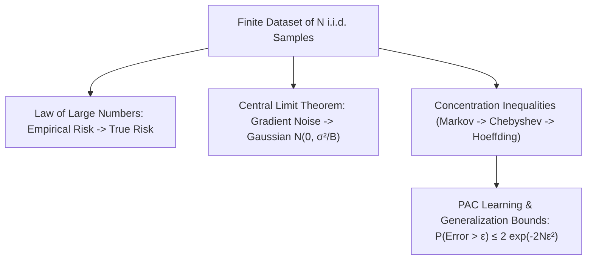

# Chapter 3.6: Asymptotic Theorems (LLN, CLT) & Inequalities

---

## Pedagogical Navigation
- **Module 03:** Probability Theory for Deep Learning
- **Previous Chapter:** [Chapter 3.5: Joint, Marginal & Conditional Distributions](./05_joint_marginal_conditional.md)
- **Next Chapter:** [Chapter 3.7: Information Theory (Entropy, Cross-Entropy, KL Divergence, Mutual Information)](./07_information_theory.md)
- **Companion Code:** [06_asymptotic_theorems_and_inequalities.py](./code/06_asymptotic_theorems_and_inequalities.py)
- **Tracker & Index:** [Course Index & Progress Tracker](../00_index_and_tracker.md)

---

## Part 1: Intuition & 101 Motivation

Why is machine learning possible?
Think about the audacity of the enterprise:
We train a model on a finite dataset of $N$ images, and we expect it to generalize to millions of future, unseen images from anywhere on Earth.
Why should a model that performs well on training data perform well on test data?

The answer lies in the **Asymptotic Limit Theorems** and **Concentration Inequalities** of probability theory:
1. **The Law of Large Numbers (LLN):** Guarantees that the empirical training loss converges to the true expected risk as dataset size grows ($N \to \infty$).
2. **The Central Limit Theorem (CLT):** Explains why noise in deep learning (residuals, weight initializations, mini-batch gradient fluctuations) naturally aggregates into a bell-shaped Gaussian distribution, regardless of the underlying data distribution!
3. **Concentration Inequalities (Markov, Chebyshev, Hoeffding):** Provide finite-sample, distribution-free guarantees. They answer the million-dollar question:
   > *"Given a finite training set of size $N$, what is the strict mathematical upper bound on the probability that my test error exceeds my training error by more than $\epsilon$?"*



---

## Part 2: Rigorous Mathematical Formulation

### 1. Modes of Stochastic Convergence

In real analysis, a sequence of real numbers $a_n$ converges to $L$ if $|a_n - L| \to 0$.
For a sequence of random variables $X_1, X_2, \dots$ defined on a sample space $\Omega$, convergence is fundamentally nuanced:

#### Definition 3.6.1: Convergence in Probability ($X_n \xrightarrow{P} X$)
$$\forall \epsilon > 0, \quad \lim_{n \to \infty} P(|X_n - X| > \epsilon) = 0$$
The probability of observing an outlier deviation vanishes as $n \to \infty$.

#### Definition 3.6.2: Almost Sure Convergence ($X_n \xrightarrow{a.s.} X$)
$$P\left( \lim_{n \to \infty} X_n = X \right) = 1$$
The set of sample paths $\omega \in \Omega$ for which $X_n(\omega)$ fails to converge to $X(\omega)$ has measure zero. (Strictly stronger than convergence in probability).

#### Definition 3.6.3: Convergence in Distribution ($X_n \xrightarrow{D} X$)
$$\lim_{n \to \infty} F_{X_n}(x) = F_X(x)$$
at all continuity points $x$ of the limiting CDF $F_X$.

#### Hierarchy of Convergence:
$$X_n \xrightarrow{a.s.} X \implies X_n \xrightarrow{P} X \implies X_n \xrightarrow{D} X$$

---

### 2. The Laws of Large Numbers

Let $X_1, X_2, \dots, X_n$ be independent and identically distributed (i.i.d.) random variables with mean $\mu = \mathbb{E}[X_i]$.
The **sample average** is:
$$\bar{X}_n \triangleq \frac{1}{n} \sum_{i=1}^n X_i$$

#### Theorem 3.6.1: Weak Law of Large Numbers (WLLN / Khinchin's Theorem)
If $\mathbb{E}[|X_i|] < \infty$, then the sample average converges in probability to the true mean:
$$\mathbf{\bar{X}_n \xrightarrow{P} \mu \quad \text{as } n \to \infty}$$

#### Theorem 3.6.2: Strong Law of Large Numbers (SLLN / Kolmogorov's Theorem)
$$\mathbf{\bar{X}_n \xrightarrow{a.s.} \mu \quad \text{as } n \to \infty}$$

> **Deep Learning Role:** The Strong Law of Large Numbers is the foundational guarantee of **Empirical Risk Minimization (ERM)**:
> $$\mathcal{L}_{\text{train}}(\theta) = \frac{1}{N} \sum_{i=1}^N \ell(f(x_i; \theta), y_i) \xrightarrow{a.s.} \mathbb{E}_{(x, y) \sim p_{\text{data}}} [\ell(f(x; \theta), y)]$$

---

### 3. The Central Limit Theorem (Lindeberg-Lévy CLT)

The Law of Large Numbers tells us that $\bar{X}_n \to \mu$.
The Central Limit Theorem tells us **how fast** it converges, and describes the **shape of the fluctuations** around $\mu$!

#### Theorem 3.6.3: The Central Limit Theorem
Let $X_1, X_2, \dots, X_n$ be i.i.d. random variables with finite mean $\mu$ and finite variance $\sigma^2 > 0$.
Then the standardized error:
$$Z_n \triangleq \frac{\bar{X}_n - \mu}{\sigma / \sqrt{n}} = \frac{\sum_{i=1}^n X_i - n \mu}{\sigma \sqrt{n}}$$
converges in distribution to a **Standard Normal distribution**:
$$\mathbf{Z_n \xrightarrow{D} \mathcal{N}(0, 1) \quad \text{as } n \to \infty}$$

Equivalently, for large $n$:
$$\mathbf{\bar{X}_n \sim_{\text{approx}} \mathcal{N}\left( \mu, \frac{\sigma^2}{n} \right)}$$

> [!IMPORTANT]
> The CLT does **NOT** require the underlying variables $X_i$ to be Gaussian! The $X_i$ can be Bernoulli coin flips, uniform noise, Poisson counts, or arbitrary asymmetric distributions. As long as the variance is finite, their normalized sum **will always converge to a Gaussian**!

#### Deep Derivation 3.6.1: Characteristic Function Proof of the Central Limit Theorem
Let $Y_i \triangleq \frac{X_i - \mu}{\sigma}$. Then $Y_1, \dots, Y_n$ are i.i.d. with $\mathbb{E}[Y_i] = 0$ and $\text{Var}(Y_i) = \mathbb{E}[Y_i^2] = 1$.
The standardized sum is $Z_n = \frac{1}{\sqrt{n}} \sum_{i=1}^n Y_i$.

1. **Taylor Expansion of the Characteristic Function of $Y_i$:**
   The characteristic function $\phi_Y(t) \triangleq \mathbb{E}[e^{i t Y}]$ is expanded around $t = 0$:
   $$\phi_Y(t) = \mathbb{E}\left[ 1 + i t Y - \frac{t^2 Y^2}{2} + o(t^2) \right] = 1 + i t \underbrace{\mathbb{E}[Y]}_{= 0} - \frac{t^2}{2} \underbrace{\mathbb{E}[Y^2]}_{= 1} + o(t^2) = 1 - \frac{t^2}{2} + o(t^2)$$

2. **Characteristic Function of the Sum $Z_n$:**
   By independence of $Y_i$:
   $$\phi_{Z_n}(t) = \mathbb{E}\left[ \exp\left( i t \frac{1}{\sqrt{n}} \sum_{i=1}^n Y_i \right) \right] = \prod_{i=1}^n \mathbb{E}\left[ \exp\left( i \frac{t}{\sqrt{n}} Y_i \right) \right] = \left[ \phi_Y\left( \frac{t}{\sqrt{n}} \right) \right]^n$$
   Substitute the Taylor expansion evaluated at $\frac{t}{\sqrt{n}}$:
   $$\phi_{Z_n}(t) = \left( 1 - \frac{t^2}{2n} + o\left( \frac{t^2}{n} \right) \right)^n$$

3. **Asymptotic Limit as $n \to \infty$:**
   Using the classical real analysis identity $\lim_{n \to \infty} \left( 1 + \frac{a}{n} \right)^n = e^a$:
   $$\lim_{n \to \infty} \phi_{Z_n}(t) = \lim_{n \to \infty} \left( 1 - \frac{t^2/2}{n} \right)^n = \mathbf{e^{-t^2 / 2}}$$

4. **Conclusion via Lévy's Continuity Theorem:**
   The function $\phi(t) = e^{-t^2 / 2}$ is the unique characteristic function of the Standard Normal distribution $\mathcal{N}(0, 1)$.
   By Lévy's Continuity Theorem, convergence of characteristic functions guarantees **convergence in distribution**:
   $$\mathbf{Z_n \xrightarrow{D} \mathcal{N}(0, 1)} \quad \blacksquare$$

---

### 4. The Hierarchy of Concentration Inequalities

When training models on finite datasets ($N < \infty$), asymptotic limits ($N \to \infty$) are not enough. We need strict numerical bounds on tail probabilities.

#### 1. Markov's Inequality (First-Moment Bound)
Let $X \ge 0$ be a non-negative random variable. For any threshold $a > 0$:
$$\mathbf{P(X \ge a) \le \frac{\mathbb{E}[X]}{a}}$$

*Proof:*
$$\mathbb{E}[X] = \int_0^\infty x f(x) \, dx = \int_0^a x f(x) \, dx + \int_a^\infty x f(x) \, dx \ge 0 + \int_a^\infty a f(x) \, dx = a P(X \ge a). \quad \blacksquare$$

---

#### 2. Chebyshev's Inequality (Second-Moment Bound)
Let $X$ have finite mean $\mu$ and variance $\sigma^2$. For any $k > 0$:
$$\mathbf{P(|X - \mu| \ge k \sigma) \le \frac{1}{k^2}}$$
Or for an absolute deviation $\epsilon > 0$:
$$\mathbf{P(|X - \mu| \ge \epsilon) \le \frac{\text{Var}(X)}{\epsilon^2}}$$

*Proof:* Apply Markov's inequality to the non-negative variable $Y = (X - \mu)^2$ with threshold $a = \epsilon^2$:
$$P(|X - \mu| \ge \epsilon) = P((X - \mu)^2 \ge \epsilon^2) \le \frac{\mathbb{E}[(X - \mu)^2]}{\epsilon^2} = \frac{\sigma^2}{\epsilon^2}. \quad \blacksquare$$

---

#### 3. Deep Derivation 3.6.2: The Chernoff Bounding Technique
While Chebyshev exploits the 2nd moment, the **Chernoff bound** exploits **all infinite higher moments** simultaneously by applying Markov's inequality to the exponential transform.

For any tuning parameter $s > 0$ and any threshold $a$:
$$P(X \ge a) = P\left( e^{s X} \ge e^{s a} \right)$$
Since $e^{s X} > 0$ is strictly positive, we apply Markov's inequality directly:
$$P\left( e^{s X} \ge e^{s a} \right) \le \frac{\mathbb{E}[e^{s X}]}{e^{s a}} = e^{-s a} M_X(s)$$
where $M_X(s) \triangleq \mathbb{E}[e^{s X}]$ is the **Moment Generating Function (MGF)** of $X$.
Because this inequality holds for *every* choice of $s > 0$, we can optimize $s$ to find the tightest possible bound:
$$\mathbf{P(X \ge a) \le \inf_{s > 0} \left\{ e^{-s a} M_X(s) \right\} = \exp\left( -\sup_{s > 0} [s a - \ln M_X(s)] \right)}$$
The quantity $\sup_{s > 0} [s a - \ln M_X(s)]$ is the **Legendre-Fenchel convex dual transform** of the cumulant generating function. This master recipe produces exponential tail bounds!

---

#### 4. Deep Derivation 3.6.3: Hoeffding's Lemma & Hoeffding's Inequality

##### Lemma 3.6.1 (Hoeffding's Lemma):
Let $Z$ be a zero-mean random variable with bounded support $Z \in [a, b]$ ($\mathbb{E}[Z] = 0$). Then for any $s \in \mathbb{R}$:
$$\mathbb{E}\left[ e^{s Z} \right] \le \exp\left( \frac{s^2 (b - a)^2}{8} \right)$$
*Proof Sketch:* By convexity of the exponential function $t \mapsto e^{s t}$, for any $z \in [a, b]$:
$$e^{s z} \le \frac{b - z}{b - a} e^{s a} + \frac{z - a}{b - a} e^{s b}$$
Taking expectations with $\mathbb{E}[Z] = 0$:
$$\mathbb{E}[e^{s Z}] \le \frac{b}{b - a} e^{s a} - \frac{a}{b - a} e^{s b} \triangleq e^{\psi(u)}$$
where $u = s(b - a)$. A Taylor series expansion of $\psi(u)$ around $u = 0$ reveals $\psi(0) = 0, \psi'(0) = 0$, and $\psi''(u) \le 1/4$, yielding $\psi(u) \le \frac{u^2}{8} = \frac{s^2(b - a)^2}{8}$. $\blacksquare$

##### Theorem 3.6.4: Hoeffding's Inequality
Let $X_1, \dots, X_n$ be independent random variables such that each $X_i \in [a_i, b_i]$ with probability 1.
Let $\bar{X}_n = \frac{1}{n} \sum_{i=1}^n X_i$ and $\mu = \mathbb{E}[\bar{X}_n]$. For any $\epsilon > 0$:
$$\mathbf{P(|\bar{X}_n - \mu| \ge \epsilon) \le 2 \exp\left( -\frac{2 n^2 \epsilon^2}{\sum_{i=1}^n (b_i - a_i)^2} \right)}$$

*Proof:*
Let $S_n = \sum_{i=1}^n (X_i - \mathbb{E}[X_i])$. We bound the one-sided tail $P(S_n \ge t)$ where $t = n \epsilon$.
By the Chernoff technique:
$$P(S_n \ge t) \le e^{-s t} \mathbb{E}[e^{s S_n}] = e^{-s t} \prod_{i=1}^n \mathbb{E}\left[ e^{s (X_i - \mathbb{E}[X_i])} \right]$$
Apply Hoeffding's Lemma to each independent term:
$$P(S_n \ge t) \le e^{-s t} \prod_{i=1}^n \exp\left( \frac{s^2 (b_i - a_i)^2}{8} \right) = \exp\left( -s t + \frac{s^2}{8} \sum_{i=1}^n (b_i - a_i)^2 \right)$$
To minimize this quadratic exponent w.r.t. $s$, differentiate and set to zero:
$$-t + \frac{s}{4} \sum_{i=1}^n (b_i - a_i)^2 = 0 \implies s^* = \frac{4 t}{\sum_{i=1}^n (b_i - a_i)^2}$$
Substitute $s^*$ back into the exponent:
$$-s^* t + \frac{(s^*)^2}{8} \sum_{i=1}^n (b_i - a_i)^2 = -\frac{4 t^2}{\sum (b_i - a_i)^2} + \frac{2 t^2}{\sum (b_i - a_i)^2} = -\frac{2 t^2}{\sum_{i=1}^n (b_i - a_i)^2}$$
Setting $t = n \epsilon$ and applying a union bound for both tails $P(|S_n| \ge n \epsilon) \le 2 P(S_n \ge n \epsilon)$ yields:
$$\mathbf{P(|\bar{X}_n - \mu| \ge \epsilon) \le 2 \exp\left( -\frac{2 n^2 \epsilon^2}{\sum_{i=1}^n (b_i - a_i)^2} \right)} \quad \blacksquare$$

For variables bounded in the unit interval $X_i \in [0, 1]$ (such as classification 0-1 error loss):
$$\mathbf{P(|\bar{X}_n - \mu| \ge \epsilon) \le 2 \exp\left( -2 n \epsilon^2 \right)}$$

---

## Part 3: Geometric, Algebraic & Physical Interpretation

### 1. High-Dimensional Geometry: Concentration of Measure
In high dimensions $\mathbb{R}^D$ ($D \gg 10^3$), geometry defies human 3D intuition:
- **The Hollow Orange Phenomenon:**
  Consider a unit hypersphere of radius 1 in $\mathbb{R}^D$.
  The volume of a shell of thickness $\epsilon$ just below the surface is:
  $$\frac{\text{Vol}(B_1) - \text{Vol}(B_{1-\epsilon})}{\text{Vol}(B_1)} = 1 - (1 - \epsilon)^D \approx 1 - e^{-D \epsilon}$$
  If $D = 10{,}000$ and $\epsilon = 0.001$, then $1 - e^{-10} \approx \mathbf{0.99995}$!
  Over **$99.99\%$ of the entire volume of the sphere lives in an ultra-thin skin at the surface**!
- In deep learning, random embeddings and high-dimensional representations do not scatter randomly throughout space; they concentrate tightly on the surface of a hypersphere!

---

## Part 4: Real-World Analogy

### The Casino House Edge & The Gambler's Fallacy
Imagine a casino roulette wheel with 38 slots (numbers 1-36, plus `0` and `00`).
If you bet \$1 on Red:
- You win with probability $p = 18/38 \approx 47.37\%$.
- The casino wins with probability $q = 20/38 \approx 52.63\%$.
- Expected return per bet: $\mu = (+1)(18/38) + (-1)(20/38) = -2/38 \approx -\$0.0526$ (a $5.26\%$ loss).

1. **For an Individual Gambler ($n = 10$ bets):**
   Variance is high: $\sigma / \sqrt{10} \approx 0.316$.
   You might easily win 7 out of 10 bets and leave the casino feeling like a genius.
2. **For the Casino ($n = 10{,}000{,}000$ bets per year):**
   By the Central Limit Theorem and Law of Large Numbers:
   $$\bar{X}_n \sim \mathcal{N}\left( -0.0526, \frac{0.997}{10^7} \right) \implies \text{Standard Error} = \sqrt{\frac{0.997}{10^7}} \approx 0.000316$$
   The casino's average profit margin is guaranteed to fall within $[-5.29\%, -5.23\%]$ with $99.9999\%$ certainty.
   The casino does not gamble; **the casino harvests the Law of Large Numbers!**

---

## Part 5: "AI by Hand" (Prof. Tom Yeh Style Visual Grids)

Let us compare all concentration inequalities against exact probabilities using concrete numbers.

### 1. Problem Setup & Toy Coin Toss Experiment
Let $X$ be the number of Heads obtained in $n = 100$ independent fair coin tosses:
$$X \sim \text{Binomial}(n = 100, p = 0.5)$$
- Mean: $\mu = n p = 100(0.5) = \mathbf{50.0}$
- Variance: $\sigma^2 = n p (1 - p) = 100(0.5)(0.5) = \mathbf{25.0}$
- Standard Deviation: $\sigma = \sqrt{25.0} = \mathbf{5.0}$

**Target Problem:**
What is the probability of obtaining **at least 70 Heads** ($X \ge 70$)?
This represents a deviation of $\Delta = X - \mu = 70 - 50 = \mathbf{+20}$ heads (a $4\sigma$ deviation).
In terms of the sample average $\bar{X} = X/100$, $\bar{X} \ge 0.70$, so $\epsilon = 0.70 - 0.50 = \mathbf{0.20}$.

---

### 2. "What Refers to What" Legend Protocol

| Symbol | Pure Math Role | Deep Learning Meaning | Toy Value in Walkthrough |
| :--- | :--- | :--- | :--- |
| $n$ | Number of trials | Training dataset sample size $N$ | $100$ |
| $p$ | Trial success probability | Underlying classification accuracy | $0.50$ |
| $\mu = \mathbb{E}[X]$ | Expected total | Expected correct predictions | $50.0$ |
| $\sigma = \sqrt{\text{Var}(X)}$ | Standard deviation | Gradient / loss standard error | $5.0$ |
| $a = 70$ | Threshold value | Catastrophic error threshold | $70$ |
| $\epsilon = 0.20$ | Mean deviation threshold | Generalization error tolerance | $0.20$ |
| $P(X \ge 70)$ | True tail probability | Probability of catastrophic failure | $\approx 0.00003925$ |

---

### 3. Step-by-Step Manual Arithmetic

#### Method 1: Markov's Inequality
Since $X \ge 0$ is non-negative:
$$P(X \ge 70) \le \frac{\mathbb{E}[X]}{70} = \frac{50.0}{70} = \frac{5}{7} \approx \mathbf{0.714286} \quad (\mathbf{71.43\%})$$
*Verdict:* Extremely loose, but requires zero assumptions about variance or independence!

---

#### Method 2: Chebyshev's Inequality (Two-Sided and One-Sided)
- **Standard Two-Sided Chebyshev:**
  $$P(|X - 50| \ge 20) \le \frac{\sigma^2}{20^2} = \frac{25.0}{400} = \mathbf{0.062500} \quad (\mathbf{6.25\%})$$
- **Cantelli's Inequality (One-Sided Chebyshev):**
  For a one-sided deviation $X - \mu \ge k$:
  $$P(X - \mu \ge k) \le \frac{\sigma^2}{\sigma^2 + k^2} = \frac{25.0}{25.0 + 20^2} = \frac{25}{425} = \frac{1}{17} \approx \mathbf{0.058824} \quad (\mathbf{5.88\%})$$
*Verdict:* Over $12\times$ tighter than Markov because it leverages variance information!

---

#### Method 3: Hoeffding's Inequality
Each coin flip $X_i \in \{0, 1\}$, so $b_i - a_i = 1 - 0 = 1$.
We want $P(\bar{X}_{100} - 0.5 \ge 0.20)$ with $\epsilon = 0.20$ and $n = 100$:
$$P(\bar{X} - \mu \ge \epsilon) \le \exp(-2 n \epsilon^2)$$
Compute the exponent:
$$-2 n \epsilon^2 = -2(100)(0.20)^2 = -200 \times 0.04 = \mathbf{-8.0}$$
Compute exponential:
$$P(X \ge 70) \le \exp(-8.0) \approx \mathbf{0.00033546} \quad (\mathbf{0.0335\%})$$
*Verdict:* Over $175\times$ tighter than Chebyshev! Exponential decay in action!

---

#### Method 4: Central Limit Theorem (Gaussian Approximation)
Standardize the threshold $X = 70$:
$$Z = \frac{X - \mu}{\sigma} = \frac{70 - 50}{5} = \frac{20}{5} = \mathbf{4.0}$$
Using the continuity correction ($X \ge 69.5 \implies Z = \frac{69.5 - 50}{5} = 3.90$):
$$P(Z \ge 3.90) = 1 - \Phi(3.90) \approx \mathbf{0.00004810}$$
Without continuity correction ($Z = 4.0$):
$$P(Z \ge 4.0) = 1 - \Phi(4.0) \approx \mathbf{0.00003167} \quad (\mathbf{0.00317\%})$$

---

#### Method 5: Exact Binomial Probability (Ground Truth)
$$P(X \ge 70) = \sum_{k=70}^{100} \binom{100}{k} (0.5)^{100} \approx \mathbf{0.00003925} \quad (\mathbf{0.00393\%})$$

---

### 4. Visual Summary Grid

```
+-----------------------------------------------------------------------------------------------+
|                       PROF. TOM YEH STYLE CONCENTRATION INEQUALITY GRID                       |
+-----------------------------------------------------------------------------------------------+
| Experiment: 100 Fair Coin Flips (μ = 50, σ = 5)             | Target Tail Event: X ≥ 70 (4σ)   |
+--------------------------+----------------------------------+-------------------+-------------+
| METHOD / THEOREM         | MATHEMATICAL BOUND FORMULA       | BOUND VALUE       | TIGHTNESS   |
+--------------------------+----------------------------------+-------------------+-------------+
| Markov's Inequality      | E[X] / a = 50 / 70               | 0.714286 (71.4%)  | Very Loose  |
| Two-Sided Chebyshev      | σ² / k² = 25 / 400               | 0.062500 ( 6.25%) | Moderate    |
| Cantelli (One-Sided)     | σ² / (σ² + k²) = 25 / 425        | 0.058824 ( 5.88%) | Moderate    |
| Hoeffding's Inequality   | exp(-2 n ε²) = exp(-8)           | 0.000335 ( 0.03%) | Very Tight! |
| CLT Approximation        | 1 - Φ(4.0)                       | 0.000032 ( 0.00%) | Asymptotic  |
+--------------------------+----------------------------------+-------------------+-------------+
| EXACT GROUND TRUTH       | ∑ Binomial(100, k) · 0.5¹⁰⁰       | 0.000039 ( 0.00%) | Truth Target|
+-----------------------------------------------------------------------------------------------+
```

---

## Part 6: Step-by-Step Solved Illustrations

### Case A: PAC Learning Sample Complexity Derivation
In Probably Approximately Correct (PAC) learning (Valiant, 1984), we want to guarantee that our model's generalization error satisfies:
$$P\left( |\mathcal{L}_{\text{test}} - \mathcal{L}_{\text{train}}| \ge \epsilon \right) \le \delta$$
where $\epsilon > 0$ is the error tolerance (e.g., $5\%$), and $\delta > 0$ is the failure confidence parameter (e.g., $1\%$).

#### Step-by-Step Derivation of Sample Size $N$:
1. Apply Hoeffding's Inequality for a single hypothesis $h$:
   $$P(|\mathcal{L}_{\text{test}}(h) - \mathcal{L}_{\text{train}}(h)| \ge \epsilon) \le 2 \exp(-2 N \epsilon^2)$$
2. Set the upper bound equal to the failure budget $\delta$:
   $$2 \exp(-2 N \epsilon^2) \le \delta$$
3. Divide by 2:
   $$\exp(-2 N \epsilon^2) \le \frac{\delta}{2}$$
4. Take the natural logarithm:
   $$-2 N \epsilon^2 \le \log\left( \frac{\delta}{2} \right) = -\log\left( \frac{2}{\delta} \right)$$
5. Divide by $-2 \epsilon^2$ (reversing the inequality):
   $$\mathbf{N \ge \frac{1}{2 \epsilon^2} \log\left( \frac{2}{\delta} \right)}$$

*Numerical Example:* For $\epsilon = 0.05$ ($5\%$ error) and $\delta = 0.01$ ($99\%$ confidence):
$$N \ge \frac{1}{2(0.0025)} \log\left( \frac{2}{0.01} \right) = 200 \times \log(200) \approx 200 \times 5.2983 = \mathbf{1{,}060 \text{ samples}}$$
With just $1{,}060$ samples, the test error is guaranteed to be within $5\%$ of the training error with $99\%$ mathematical certainty!

---

### Case B: When the Central Limit Theorem Fails (Heavy Tails & The Cauchy Distribution)
Does the Central Limit Theorem *always* work?
**No!** The CLT requires **finite variance** ($\sigma^2 < \infty$).
Consider the standard **Cauchy distribution**:
$$f(x) = \frac{1}{\pi (1 + x^2)}$$
Because its tails decay only as $\mathcal{O}(1/x^2)$, its variance is **infinite** ($\sigma^2 = \infty$), and its mean does not exist!

If you take the sample average of $n$ independent Cauchy random variables:
$$\bar{X}_n = \frac{1}{n} \sum_{i=1}^n X_i$$
By characteristic functions:
$$\bar{X}_n \sim \mathbf{\text{Cauchy}(0, 1) \quad \text{for ALL } n!}$$
Averaging 1,000,000 Cauchy samples produces **zero variance reduction**!
In deep learning, gradient explosions in un-normalized RNNs or unstable Transformers often exhibit heavy Cauchy-like tails, causing standard gradient descent to fail unless gradient clipping is applied!

---

### Case C: Multi-Sample Tail Bounds on Server Response Latency
A cluster of $n = 25$ independent microservice workers processes user queries.
Individual request latency $X_i$ has:
- Mean: $\mu = 10.0\text{ ms}$
- Standard Deviation: $\sigma = 5.0\text{ ms}$ ($\sigma^2 = 25.0\text{ ms}^2$)
The service-level agreement (SLA) alerts the engineering team if the **average latency** of the batch exceeds $13.0\text{ ms}$ ($\bar{X}_{25} \ge 13.0\text{ ms}$, representing a deviation $\epsilon = +3.0\text{ ms}$).

Let us calculate and compare the upper bound on $P(\bar{X}_{25} \ge 13.0)$ using different probability tools:

1. **Method 1: Markov's Inequality on Total Latency $S_{25} = \sum_{i=1}^{25} X_i$:**
   $$\mathbb{E}[S_{25}] = 25 \times 10.0 = 250.0\text{ ms}$$
   Target total latency cutoff: $25 \times 13.0 = 325.0\text{ ms}$.
   $$P(S_{25} \ge 325.0) \le \frac{\mathbb{E}[S_{25}]}{325.0} = \frac{250.0}{325.0} = \mathbf{\frac{10}{13} \approx 0.769231 \quad (76.92\%)}$$

2. **Method 2: Two-Sided Chebyshev's Inequality on Sample Mean $\bar{X}_{25}$:**
   The standard error of the sample mean is:
   $$\text{Var}(\bar{X}_{25}) = \frac{\sigma^2}{n} = \frac{25.0}{25} = \mathbf{1.000000\text{ ms}^2} \implies \text{SE} = \sqrt{1.0} = 1.0\text{ ms}$$
   Deviation threshold: $\epsilon = 13.0 - 10.0 = 3.0\text{ ms}$ ($k = \epsilon / \text{SE} = 3.0 / 1.0 = 3.0$ standard deviations).
   $$P(|\bar{X}_{25} - 10.0| \ge 3.0) \le \frac{\text{Var}(\bar{X}_{25})}{\epsilon^2} = \frac{1.0}{3.0^2} = \mathbf{\frac{1}{9} \approx 0.111111 \quad (11.11\%)}$$

3. **Method 3: Cantelli's One-Sided Chebyshev Inequality:**
   $$P(\bar{X}_{25} - \mu \ge \epsilon) \le \frac{\text{Var}(\bar{X}_{25})}{\text{Var}(\bar{X}_{25}) + \epsilon^2} = \frac{1.0}{1.0 + 3.0^2} = \frac{1.0}{1.0 + 9.0} = \mathbf{\frac{1}{10} = 0.100000 \quad (10.00\%)}$$

4. **Method 4: Central Limit Theorem Gaussian Approximation:**
   Standardize $\bar{X}_{25} = 13.0$:
   $$Z = \frac{\bar{X}_{25} - \mu}{\sigma / \sqrt{n}} = \frac{13.0 - 10.0}{1.0} = \mathbf{+3.000000}$$
   $$P(Z \ge 3.0) = 1 - \Phi(3.0) \approx \mathbf{0.0013499 \quad (0.135\%)}$$

5. **Comparison Summary Table:**

```
+-----------------------------------+--------------------+------------------------+
| METHOD                            | BOUND / ESTIMATE   | ASSUMPTIONS REQUIRED   |
+-----------------------------------+--------------------+------------------------+
| Markov's Inequality               | ≤ 76.92%           | Non-negative only      |
| Two-Sided Chebyshev               | ≤ 11.11%           | Mean + Finite Variance |
| Cantelli (One-Sided Chebyshev)    | ≤ 10.00%           | Mean + Finite Variance |
| CLT Gaussian Approximation        | ≈  0.135%          | Asymptotic normality   |
+-----------------------------------+--------------------+------------------------+
```

---

### Case D: Mini-Batch Gradient Variance & Optimal Batch Size Determination via CLT
In deep learning optimization, suppose the stochastic gradient for a single training sample $i$ is scalar $g_i \in \mathbb{R}$ with:
- True population gradient signal: $\mu = \mathbb{E}[g_i] = 0.050000$ (encourages weight decrease)
- Per-sample gradient noise variance: $\sigma^2 = \text{Var}(g_i) = 4.000000$ ($\sigma = 2.0$)
The mini-batch gradient estimator with batch size $B$ is:
$$\bar{g}_B = \frac{1}{B} \sum_{i=1}^B g_i$$
By the Central Limit Theorem:
$$\bar{g}_B \sim \mathcal{N}\left( 0.05, \frac{4.0}{B} \right)$$
A **gradient sign flip** occurs when $\bar{g}_B \le 0$ (the mini-batch gradient points in the wrong direction, increasing loss instead of decreasing it!).
What minimum batch size $B$ guarantees that the probability of a gradient sign flip is at most $\delta = 0.01$ ($1\%$)?

1. **Step 1: Standardize the Sign Flip Condition $\bar{g}_B \le 0$:**
   $$Z = \frac{0 - \mu}{\sigma / \sqrt{B}} = \frac{-0.05}{2.0 / \sqrt{B}} = -\frac{0.05 \sqrt{B}}{2.0} = \mathbf{-0.025 \sqrt{B}}$$

2. **Step 2: Relate to Standard Normal Critical Value:**
   We require:
   $$P(Z \le -0.025 \sqrt{B}) \le 0.01$$
   From the standard normal cumulative distribution $\Phi(-2.326348) \approx 0.01$:
   $$-0.025 \sqrt{B} \le -2.326348 \implies 0.025 \sqrt{B} \ge 2.326348$$

3. **Step 3: Solve for Batch Size $B$:**
   $$\sqrt{B} \ge \frac{2.326348}{0.025} = \mathbf{93.053920}$$
   Square both sides:
   $$B \ge (93.053920)^2 \approx \mathbf{8{,}659.03} \implies \mathbf{B_{\text{min}} = 8{,}660 \text{ samples}}$$

4. **Step 4: Comparison with $5\%$ Sign Flip Tolerance ($\delta = 0.05$):**
   For $\delta = 0.05$, the critical value is $z_{0.05} = 1.644853$:
   $$\sqrt{B} \ge \frac{1.644853}{0.025} = 65.794120 \implies B \ge (65.794120)^2 \approx 4{,}328.87 \implies \mathbf{B = 4{,}329 \text{ samples}}$$
   *Deep Learning Takeaway:* This CLT calculation is the exact theoretical basis of the **Gradient Noise Scale** (McCandlish et al., OpenAI 2018):
   $$B_{\text{crit}} \propto \frac{\text{Tr}(\Sigma)}{\|\nabla \mathcal{L}\|^2}$$
   When the true signal $\|\nabla \mathcal{L}\|$ is small relative to noise $\sigma$, training requires massive batch sizes to avoid taking destructive steps in the wrong direction!

---

## Part 7: Deep Learning Connection & Application

### 1. The Gaussian Stochastic Gradient Noise Hypothesis
Why can we model SGD as Stochastic Differential Equations (SDEs)?
The mini-batch gradient $\mathbf{g}_B(\theta) = \frac{1}{B} \sum_{i=1}^B \nabla \ell_i(\theta)$ is an average of $B$ independent per-sample gradients.
By the Central Limit Theorem:
$$\mathbf{g}_B(\theta) \sim_{\text{approx}} \mathcal{N}\left( \nabla \mathcal{L}(\theta), \frac{\Sigma(\theta)}{B} \right)$$
This enables researchers to analyze neural network training using Langevin dynamics:
$$d\theta_t = -\nabla \mathcal{L}(\theta_t) dt + \sqrt{\frac{2\eta}{B} \Sigma} \, dW_t$$
The Gaussian noise injected by mini-batching acts as thermal noise, helping SGD escape sharp minima and find flat, generalizing basins!

---

## Part 8: Code Implementation & Verification

The companion Python module [06_asymptotic_theorems_and_inequalities.py](./code/06_asymptotic_theorems_and_inequalities.py) provides full verification:
1. **Part 5 Inequality Grid Verification:** Validates Markov ($0.714$), Chebyshev ($0.0625$), Cantelli ($0.0588$), Hoeffding ($0.000335$), CLT ($0.000032$), and Exact Binomial ($0.000039$).
2. **Law of Large Numbers Convergence Rate:** Tracks sample mean error $|\bar{X}_N - \mu|$ as $N \to 100{,}000$ to confirm $\mathcal{O}(1/\sqrt{N})$ rate.
3. **Central Limit Theorem Visualization:** Sums $n$ Uniform$[0, 1]$ samples to show rapid Gaussian convergence (Irwin-Hall test).
4. **Cauchy Failure Test:** Demonstrates failure of LLN and CLT on heavy-tailed Cauchy samples.
5. **PAC Learning Sample Complexity Verification:** Tests empirical generalization gap against Hoeffding's bound across varying sample sizes $N$.
