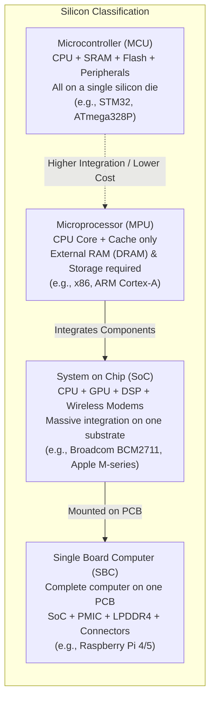
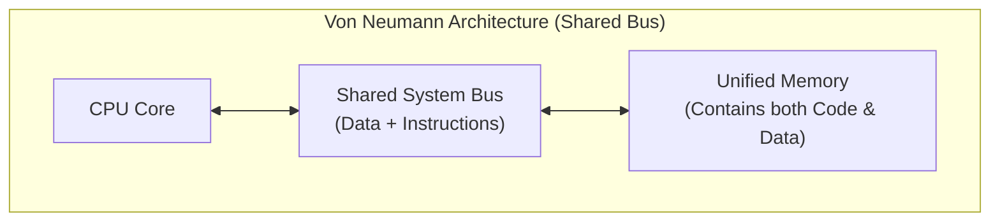
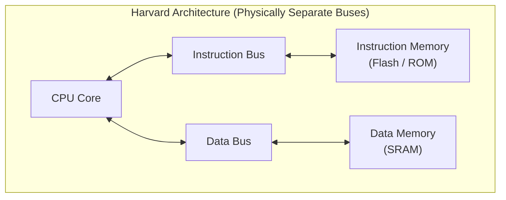
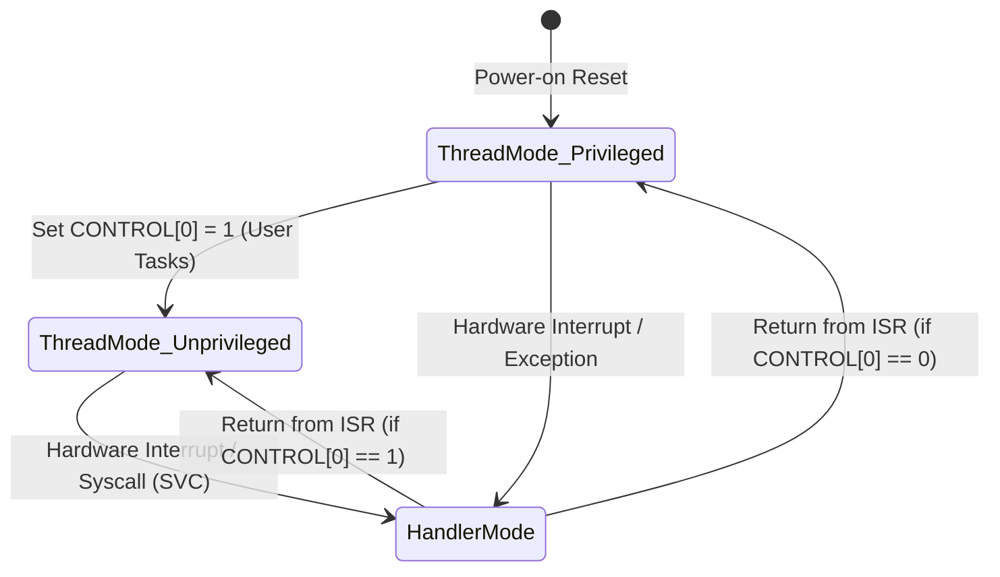
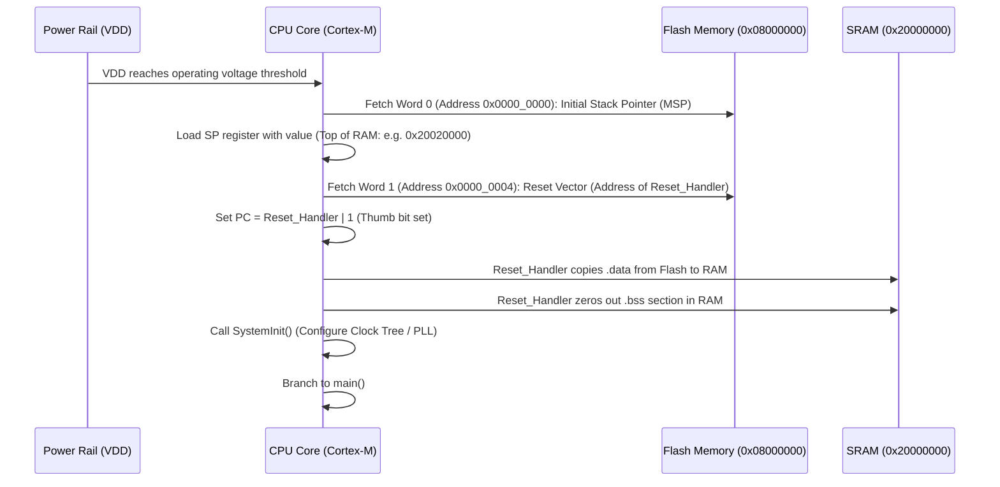

# 01. Foundations of Embedded Systems & Computer Architecture

> **References & Influential Literature:**
> - *Computer Organization and Design: The Hardware/Software Interface (ARM Edition)* — David A. Patterson & John L. Hennessy
> - *The Definitive Guide to ARM Cortex-M3 and Cortex-M4 Processors* — Joseph Yiu
> - *Embedded Systems: Introduction to ARM Cortex-M Microcontrollers* — Jonathan W. Valvano
> - *Making Embedded Systems* (Chapter 2: Architecture & Constraints) — Elecia White

---

## 1. What Defines an Embedded System?

An **embedded system** is an engineered combination of computer hardware and software designed to perform a dedicated, real-time function within a larger mechanical or electrical system. Unlike a general-purpose personal computer designed to execute arbitrary user workloads, an embedded system operates under strict domain-specific constraints:

1. **Deterministic Latency**: The system must react to external physical events within hard mathematical deadlines.
2. **Resource Scarcity**: Tight limits on non-volatile memory (Flash), volatile memory (SRAM), and processing clock cycles.
3. **Power Budget**: Often powered by batteries or energy harvesting; demands ultra-low-power sleep modes ($< 1\text{ to } 10\,\mu\text{A}$).
4. **Reliability & Autonomy**: Must execute continuously for months or years without human intervention or reboots.

---

## 2. Silicon Classification: MCU vs MPU vs SoC vs SBC



### 2.1 Microcontroller Unit (MCU)
A self-contained computer on a single chip. It integrates:
- **Processor Core**: 8-bit, 16-bit, or 32-bit CPU (e.g., AVR, ARM Cortex-M, RISC-V).
- **On-Chip Volatile Memory**: Static RAM (SRAM), ranging from $512\text{ bytes}$ to $1\text{ MB}$.
- **On-Chip Non-Volatile Memory**: Flash memory ($16\text{ KB}$ to $2\text{ MB}$) for code storage.
- **Integrated Peripherals**: Timers, ADCs, DACs, UART, SPI, I2C, CAN, DMA controllers.
- **Execution Model**: Runs bare-metal firmware or an RTOS directly out of Flash memory (Execute-In-Place / XIP).

### 2.2 Microprocessor Unit (MPU)
Focuses exclusively on computational horsepower:
- Contains CPU cores, memory management unit (MMU), and multi-level caches (L1/L2/L3).
- **Lacks integrated RAM and Flash**: Relies on external high-speed DDR3/DDR4/LPDDR5 memory chips and external storage (eMMC, NVMe, SD card).
- Operates at clock frequencies from $800\text{ MHz}$ to $5\text{ GHz}$.
- Runs complex multi-user, multi-tasking operating systems (Linux, Android, Windows).

### 2.3 System on Chip (SoC) & Single Board Computer (SBC)
- An **SoC** packages multi-core high-speed MPUs, graphics processing units (GPU), hardware video encoders/decoders, cellular/Wi-Fi/Bluetooth basebands, and neural processing units (NPU) into a single silicon package.
- An **SBC** is a complete, deployable circuit board built around an SoC. The Raspberry Pi 4 is an SBC built around the **Broadcom BCM2711 SoC** (quad-core ARM Cortex-A72 at 1.8 GHz, VideoCore VI GPU, PCIe controller, and LPDDR4 interface).

---

## 3. Computer Architecture: Von Neumann vs. Harvard

The fundamental architectural distinction in processing units is how instructions (code) and operands (data) are fetched and transported.





### 3.1 Von Neumann Architecture (Princeton Architecture)
- **Design**: A single shared bus transfers both instructions and data between the CPU and memory.
- **The Von Neumann Bottleneck**: The CPU cannot read an instruction and read/write data simultaneously. Throughput is constrained by bus bandwidth.
- **Security Implications**: Code and data occupy the same address space. A buffer overflow can overwrite return addresses with executable shellcode on the stack (mitigated in modern MPUs by the NX/XD No-Execute bit).
- **Dominant Platforms**: Modern desktop x86/ARM Cortex-A processors (though they utilize split L1 instruction and data caches internally, functioning as *Modified Harvard* at the cache boundary).

### 3.2 Harvard Architecture
- **Design**: Physically separate storage mechanisms and independent electrical signal pathways (buses) for instructions and data.
- **Simultaneous Access**: The CPU can execute an instruction operand fetch on the Data Bus in the exact same clock cycle that it fetches the next opcode on the Instruction Bus.
- **Deterministic Pipeline**: Instruction pipelining is predictable and stalls due to bus contention are minimized.
- **Dominant Platforms**: Microcontrollers (AVR ATmega328P, PIC, DSPs).

### 3.3 Modified Harvard Architecture (ARM Cortex-M)
ARM Cortex-M processors use a **Modified Harvard** architecture:
- Separate internal buses (**I-Code bus** for instruction fetches from Flash, **D-Code bus** for literal/constant lookups in Flash, and **System bus** for SRAM and peripheral access).
- However, they share a unified **32-bit linear address space** ($4\text{ GB}$). A single pointer can technically address code, data, or hardware registers.

---

## 4. The 32-Bit Linear Memory Map & MMIO

In ARM Cortex-M microcontrollers, the 32-bit architecture provides a $4\text{ GB}$ ($2^{32}\text{ bytes}$) linear address space ranging from `0x0000_0000` to `0xFFFF_FFFF`. ARM standardized this address layout via the **CMSIS (Cortex Microcontroller Software Interface Standard)**:

```
+------------------------------------+ 0xFFFF_FFFF
| System Level & Private Peripherals | (NVIC, SysTick, MPU, SCB)
| (Internal Cortex-M Core Peripherals)| Base: 0xE000_0000 (512 MB)
+------------------------------------+ 0xDFFF_FFFF
| External RAM / Off-chip Devices    |
| (FMC / FSMC mapped external chips) | Base: 0x6000_0000 (1 GB)
+------------------------------------+ 0x5FFF_FFFF
| Peripherals (On-Chip)              | (Timers, USART, SPI, I2C, GPIO)
| Memory-Mapped Registers (MMIO)     | Base: 0x4000_0000 (512 MB)
+------------------------------------+ 0x3FFF_FFFF
| SRAM (On-Chip Data Memory)         | Internal Static RAM (Stack, Heap)
| (.data, .bss sections)             | Base: 0x2000_0000 (512 MB)
+------------------------------------+ 0x1FFF_FFFF
| Code Region                        | Internal Flash Memory
| (Vector Table, .text, .rodata)     | Base: 0x0000_0000 (512 MB)
+------------------------------------+ 0x0000_0000
```

### 4.1 Memory-Mapped I/O (MMIO)
In embedded microcontrollers, there are no special CPU instructions for talking to hardware peripherals (unlike the x86 `IN` and `OUT` port-mapped instructions). Instead, **hardware registers are mapped directly to memory addresses**:

- Writing to address `0x40020014` sets electrical voltage levels on physical GPIO pins.
- Reading from address `0x40011004` reads the received byte from a hardware UART serial receiver.

#### Register Struct Mapping in C:
Because peripheral registers are placed at fixed contiguous offsets, embedded C programs map C `struct` pointers directly to hardware memory:

```c
#include <stdint.h>

/* Register definition for STM32 GPIO port */
typedef struct {
    volatile uint32_t MODER;    /* 0x00: GPIO port mode register */
    volatile uint32_t OTYPER;   /* 0x04: GPIO port output type register */
    volatile uint32_t OSPEEDR;  /* 0x08: GPIO port output speed register */
    volatile uint32_t PUPDR;    /* 0x0C: GPIO port pull-up/pull-down register */
    volatile uint32_t IDR;      /* 0x10: GPIO port input data register */
    volatile uint32_t ODR;      /* 0x14: GPIO port output data register */
    volatile uint32_t BSRR;     /* 0x18: GPIO port bit set/reset register */
    volatile uint32_t LCKR;     /* 0x1C: GPIO port configuration lock register */
    volatile uint32_t AFR[2];   /* 0x20-0x24: GPIO alternate function registers */
} GPIO_TypeDef;

/* Base address of GPIOC on STM32F4 bus */
#define GPIOC_BASE   (0x40020800UL)
#define GPIOC        ((GPIO_TypeDef *) GPIOC_BASE)

/* Manipulating the hardware register directly: */
void turn_on_led(void) {
    /* Set Pin 13 HIGH by writing to Bit 13 of Output Data Register */
    GPIOC->ODR |= (1UL << 13);
}
```

### 4.2 Bit-Banding (ARM Cortex-M3 / M4)
Standard read-modify-write operations on peripheral registers (`GPIOC->ODR |= (1 << 13)`) require 3 assembly instructions:
1. `LDR` (Load register into CPU core register).
2. `ORR` (Perform bitwise OR).
3. `STR` (Store result back into peripheral register).

If an interrupt occurs between the `LDR` and `STR`, a catastrophic race condition occurs!
To solve this without disabling interrupts, ARM introduced **Bit-Banding**:
- A $1\text{ MB}$ peripheral region (`0x4000_0000` to `0x400F_FFFF`) is mapped to a $32\text{ MB}$ **Bit-Band Alias region** (`0x4200_0000` to `0x43FF_FFFF`).
- Every individual bit in the peripheral region corresponds to a distinct 32-bit word in the alias region!
- Writing `1` or `0` to a bit-band alias address performs an **atomic, single-cycle hardware bit set or clear**:

$$\text{Alias Address} = \text{Alias Base} + (\text{Byte Offset} \times 32) + (\text{Bit Number} \times 4)$$

---

## 5. ARM Cortex-M Processor Architecture & Registers

ARM Cortex-M processors are 32-bit RISC cores featuring a 3-stage (Cortex-M0/M3/M4) to 6-stage (Cortex-M7) pipeline implementing the **ARMv7-M** or **ARMv8-M** Thumb-2 instruction set.

```
+-------------------------------------------------------------+
|               CORE REGISTERS (Low Registers)                |
|  R0  : General Purpose / Function Argument 1 / Return Value  |
|  R1  : General Purpose / Function Argument 2                |
|  R2  : General Purpose / Function Argument 3                |
|  R3  : General Purpose / Function Argument 4                |
|  R4 - R7 : General Purpose (Callee-saved)                   |
+-------------------------------------------------------------+
|               CORE REGISTERS (High Registers)               |
|  R8 - R11: General Purpose (Callee-saved)                   |
|  R12     : Intra-Procedure-call Scratch Register (IP)       |
|  R13 (SP): Stack Pointer (Banked: MSP and PSP)              |
|  R14 (LR): Link Register (Stores function return address)   |
|  R15 (PC): Program Counter (Points to current instruction+4)|
+-------------------------------------------------------------+
|               SPECIAL STATUS REGISTERS                      |
|  xPSR: Combined Program Status Register (APSR, IPSR, EPSR)  |
|  PRIMASK : 1-bit register to disable all maskable interrupts |
|  FAULTMASK: 1-bit register to disable all faults except NMI |
|  BASEPRI : Threshold register (masks interrupts < priority) |
|  CONTROL : Privileged/Unprivileged mode, MSP vs PSP select  |
+-------------------------------------------------------------+
```

### 5.1 The Dual Banked Stack Pointers: MSP vs PSP
Cortex-M provides two physically separate Stack Pointer registers mapped to `R13`:
1. **Main Stack Pointer (MSP)**:
   - Used by the operating system kernel, bare-metal runtime, and all **Interrupt Service Routines (ISRs)**.
   - Initialized at system reset from the very first entry of the Vector Table (`0x0000_0000`).
2. **Process Stack Pointer (PSP)**:
   - Used exclusively by application user tasks when running under an RTOS (like FreeRTOS).
   - **Fault Isolation**: If an application task overflows its stack, it crashes only its own PSP stack region. The OS kernel's MSP remains pristine, allowing the OS to catch the fault, log the error, and kill only the errant task!

### 5.2 Processor Operational Modes & Privilege Levels



1. **Thread Mode**:
   - The default execution mode for application code.
   - Can run in either **Privileged** or **Unprivileged** access levels.
2. **Handler Mode**:
   - Entered automatically whenever an exception or hardware interrupt fires.
   - **Always Privileged** and **always uses the Main Stack Pointer (MSP)**.

---

## 6. The Microcontroller Reset Sequence & Vector Table

What happens mechanically in the first microseconds after an MCU receives power?



### 6.1 The Vector Table Layout
The **Vector Table** is an array of 32-bit function pointers placed at address `0x0000_0000` (aliased to Flash at `0x0800_0000` on STM32):

| Address Offset | Vector Entry | Description |
| :--- | :--- | :--- |
| `0x0000_0000` | Initial SP | Top of Stack address (e.g., `&_estack` = `0x20020000`) |
| `0x0000_0004` | Reset Handler | Address of `Reset_Handler()` (Code entry point) |
| `0x0000_0008` | NMI Handler | Non-Maskable Interrupt (Hardware failure, Clock security) |
| `0x0000_000C` | HardFault | Catastrophic CPU fault (Bus error, invalid instruction) |
| `0x0000_0010` | MemManage | Memory Protection Unit (MPU) violation |
| `0x0000_0014` | BusFault | Pre-fetch abort or data bus access timeout |
| `0x0000_0018` | UsageFault | Undefined instruction, unaligned access, divide-by-zero |
| `0x0000_002C` | SVCall | Supervisor Call (`svc` instruction used for OS syscalls) |
| `0x0000_0038` | PendSV | Pendable Service Call (Context switching in RTOS) |
| `0x0000_003C` | SysTick | System Tick Timer (RTOS 1ms heartbeat) |
| `0x0000_0040+`| External IRQ 0..N | Vendor-specific peripherals (UART, Timers, DMA, SPI) |

> [!IMPORTANT]
> **The Thumb Bit Rule**: In ARM Cortex-M, all code addresses in the Vector Table must have their **Least Significant Bit (bit 0) set to `1`**. This informs the core that the destination code executes in the **Thumb-2** instruction state. If bit 0 is `0`, the processor attempts to enter ARM 32-bit state (unsupported on Cortex-M) and immediately triggers an unrecoverable `HardFault`!

---

## 7. Endianness & Memory Alignment

### 7.1 Little-Endian vs Big-Endian
- **Little-Endian (Standard on ARM Cortex-M and x86)**: The *least significant byte (LSB)* is stored at the lowest memory address.
- **Big-Endian (Network Byte Order, older PowerPC/M68k)**: The *most significant byte (MSB)* is stored at the lowest memory address.

For a 32-bit integer `0x12345678` stored at address `0x20000000`:
```
Address:        0x20000000   0x20000001   0x20000002   0x20000003
Little-Endian:     0x78         0x56         0x34         0x12     (LSB first)
Big-Endian:        0x12         0x34         0x56         0x78     (MSB first)
```

### 7.2 Memory Alignment & Unaligned Access Faults
In 32-bit microcontrollers, the system bus is 32 bits (4 bytes) wide:
- A 32-bit word (`uint32_t`) must be stored at an address divisible by 4 (`addr % 4 == 0`).
- A 16-bit half-word (`uint16_t`) must be stored at an address divisible by 2 (`addr % 2 == 0`).

```
Aligned Address (0x20000000):   [ B0 | B1 | B2 | B3 ] -> Single bus transfer (1 cycle)
Unaligned Access (0x20000001):   -- [ B0 | B1 | B2 ] [ B3 ] -- -> Requires TWO bus cycles or Fault!
```

While Cortex-M3/M4/M7 cores contain hardware logic to handle some unaligned data accesses (with a 2-cycle penalty), Cortex-M0/M0+ cores and certain ARM instructions (such as multi-register load/store `LDM`/`STM` and float load/store `VLDR`) **strictly disallow unaligned addresses** and will immediately throw a hardware `UsageFault`!
