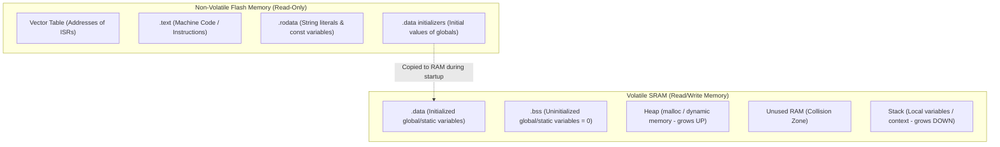

# 02. Embedded C & Assembly Programming Fundamentals

> **References & Influential Literature:**
> - *Programming Embedded Systems in C and C++* — Michael Barr (O'Reilly)
> - *Making Embedded Systems* (Chapter 4: A Few Assembly Lines, Chapter 5: Inputs and Outputs) — Elecia White
> - *The C Programming Language (2nd Edition)* — Brian W. Kernighan & Dennis M. Ritchie
> - *MISRA C:2012 Guidelines for the Use of the C Language in Critical Systems* — MIRA Ltd.

---

## 1. Embedded C Qualifiers & Memory Model

Writing code for resource-constrained microcontrollers differs fundamentally from writing desktop C software. In embedded firmware, memory addresses correspond to physical silicon switches, interrupts preempt execution asynchronously, and compiler optimizations can accidentally eliminate hardware operations.

### 1.1 The Crucial Role of `volatile`

The `volatile` type qualifier informs the C compiler that **a variable's value can change at any time without any action being taken by the code the compiler finds nearby**. Consequently, the compiler **must never cache the variable's value in a CPU register**, but must reload it from RAM or hardware address on every single read, and commit every write immediately.

#### The Three Mandatory Scenarios for `volatile`:
1. **Memory-Mapped Peripheral Registers**: Hardware alters register bits autonomously (e.g., UART receiver flag `RXNE` set by silicon when a byte arrives).
2. **Global Variables Shared Between Main Loop and an ISR**: An interrupt service routine modifies a state flag.
3. **Variables Shared Between Concurrent Tasks in a Multi-Threaded / RTOS Environment**.

#### The Deadly Optimization Bug:
```c
/* WITHOUT volatile: BUG! */
uint8_t flag = 0;

void USART1_IRQHandler(void) {
    flag = 1; /* Triggered asynchronously by incoming serial byte */
}

int main(void) {
    /* ... setup hardware ... */
    while (flag == 0) {
        /*
         * Under -O2 or -O3 optimization, the compiler checks that 'flag' is never
         * modified inside this loop. It generates assembly:
         *     LDR R0, =flag
         *     LDR R1, [R0]       ; Load flag into register R1 ONCE
         * loop:
         *     CMP R1, #0
         *     BEQ loop           ; Infinite loop! Never re-reads from memory!
         */
    }
    process_data();
}
```

```c
/* WITH volatile: CORRECT! */
volatile uint8_t flag = 0;

/*
 * The compiler generates:
 * loop:
 *     LDR R0, =flag
 *     LDR R1, [R0]           ; Reloads from RAM address on EVERY iteration!
 *     CMP R1, #0
 *     BEQ loop
 */
```

### 1.2 `const`, `static`, and Pointer Declarations

```c
/* 1. Placing Constant Data into Flash Memory (Saves precious SRAM) */
const uint8_t calibration_curve[256] = { ... }; 
/* Stored in .rodata section in Flash. Consumes 0 bytes of RAM! */

/* 2. Complex Pointer Qualifiers: Read right-to-left! */
const uint32_t * ptr_to_const;       /* Pointer to constant data (data cannot change) */
uint32_t * const const_ptr;          /* Constant pointer (address cannot change) */
volatile uint32_t * const p_reg;     /* Constant pointer to volatile hardware register (MMIO standard) */

/* 3. 'static' in Embedded Systems */
static uint32_t internal_counter;    /* File-scope: Enforces encapsulation (private to this .c file) */

void log_event(void) {
    static uint32_t boot_events = 0; /* Function-scope: Retains value across calls without polluting global namespace */
    boot_events++;
}
```

---

## 2. Bitwise Register Manipulation & Macros

Microcontroller peripherals are configured by setting, clearing, and toggling specific bits inside 8-bit, 16-bit, or 32-bit control registers.

```
Bit Position:     7   6   5   4   3   2   1   0
Register Value: [ 0 | 0 | 1 | 0 | 1 | 1 | 0 | 0 ] = 0x2C
```

### 2.1 The Standard Bitwise Manipulation Idioms

```c
#include <stdint.h>

/* Standard CMSIS Bit-Operation Macros */
#define SET_BIT(REG, BIT)     ((REG) |= (BIT))
#define CLEAR_BIT(REG, BIT)   ((REG) &= ~(BIT))
#define READ_BIT(REG, BIT)    ((REG) & (BIT))
#define TOGGLE_BIT(REG, BIT)  ((REG) ^= (BIT))
#define WRITE_REG(REG, VAL)   ((REG) = (VAL))
#define READ_REG(REG)         ((REG))
#define MODIFY_REG(REG, CLEARMASK, SETMASK) \
    WRITE_REG((REG), (((READ_REG(REG)) & (~(CLEARMASK))) | (SETMASK)))
```

#### Detailed Operation Walkthrough:

```c
/* Suppose GPIOA_MODER controls pin modes (2 bits per pin).
 * Pin 5 mode bits occupy positions 11:10 (00=Input, 01=Output, 10=Alternate, 11=Analog)
 */

/* 1. Setting Bit 5 High (Using a Bitmask) */
GPIOA->ODR |= (1UL << 5);
/*
 * (1UL << 5) = 0000 0000 0000 0000 0000 0000 0010 0000
 * ODR        = xxxx xxxx xxxx xxxx xxxx xxxx xx0x xxxx
 * RESULT     = xxxx xxxx xxxx xxxx xxxx xxxx xx1x xxxx (Pin 5 forced to 1, others unchanged)
 */

/* 2. Clearing Bit 5 Low */
GPIOA->ODR &= ~(1UL << 5);
/*
 * ~(1UL << 5)= 1111 1111 1111 1111 1111 1111 1101 1111
 * ODR        = xxxx xxxx xxxx xxxx xxxx xxxx xx1x xxxx
 * RESULT     = xxxx xxxx xxxx xxxx xxxx xxxx xx0x xxxx (Pin 5 forced to 0, others unchanged)
 */

/* 3. Toggling Bit 5 (XOR) */
GPIOA->ODR ^= (1UL << 5);

/* 4. Modifying a Multi-Bit Field (Clear then Set) */
/* Set Pin 5 to Output Mode (01b) */
GPIOA->MODER &= ~(0x3UL << (5 * 2)); /* Clear bits 11:10 */
GPIOA->MODER |=  (0x1UL << (5 * 2)); /* Set bit 10 to 1 */
```

> [!WARNING]
> **Why MISRA-C Rejects C Bitfields for Hardware Registers**:
> While `struct { uint32_t pin0:1; uint32_t pin1:1; }` looks elegant, the C standard **does not specify the bit-ordering within a storage unit** (LSB-first vs MSB-first is implementation-defined). Furthermore, bitfield updates generate compiler-dependent read-modify-write assembly instructions that can touch adjacent register bits, causing unintended side effects on hardware registers with self-clearing flags!

---

## 3. Structure Packing, Padding & Memory Alignment

In C, the compiler aligns struct members to memory boundaries matching their natural size:
- `uint8_t` aligns to 1-byte boundaries.
- `uint16_t` aligns to 2-byte boundaries (`addr % 2 == 0`).
- `uint32_t` and pointers align to 4-byte boundaries (`addr % 4 == 0`).

```c
/* Unoptimized Struct: Wastes RAM due to Padding */
struct SensorData_Bad {
    uint8_t  sensor_id;  /* 1 byte  - Offset 0 */
    /* 3 bytes PADDING inserted by compiler here! */
    uint32_t timestamp;  /* 4 bytes - Offset 4 */
    uint16_t voltage;    /* 2 bytes - Offset 8 */
    uint8_t  status;     /* 1 byte  - Offset 10 */
    /* 1 byte PADDING inserted at end to align struct to 4 bytes! */
};
/* Total Size = 12 bytes! (4 bytes wasted = 33% memory overhead) */

/* Optimized Struct: Sorted by Member Size (Largest to Smallest) */
struct SensorData_Optimized {
    uint32_t timestamp;  /* 4 bytes - Offset 0 */
    uint16_t voltage;    /* 2 bytes - Offset 4 */
    uint8_t  sensor_id;  /* 1 byte  - Offset 6 */
    uint8_t  status;     /* 1 byte  - Offset 7 */
};
/* Total Size = 8 bytes! (0 bytes wasted, 100% efficient) */
```

### 3.1 Packed Structs for Network & Communication Packets
When sending data over UART, SPI, or CAN bus, packets must not contain arbitrary compiler padding bytes:

```c
/* Packed Attribute: Forces compiler to eliminate all padding */
struct __attribute__((packed)) CanPacket {
    uint8_t  command_id; /* Offset 0 */
    uint32_t parameter;  /* Offset 1 (Unaligned!) */
    uint8_t  crc;        /* Offset 5 */
}; /* Total Size = exactly 6 bytes */
```

> [!CAUTION]
> Accessing a packed 32-bit integer across an unaligned address boundary (like `pkt->parameter` at offset 1) forces the CPU to perform multiple memory bus cycles. On ARM Cortex-M0, this will immediately crash the MCU with an unaligned access `HardFault`! To access unaligned values safely, use `memcpy()`.

---

## 4. The Compilation Toolchain & ELF Memory Layout

An embedded C toolchain (e.g., `arm-none-eabi-gcc`) compiles source code into machine opcodes and organizes them into an **Executable and Linkable Format (ELF)** binary:

```
[source.c] ---> [ Preprocessor (cpp) ] ---> [source.i]
                    |
                [ Compiler (cc1) ]
                    |
                [ Assembly (source.s) ]
                    |
                [ Assembler (as) ]
                    |
                [ Relocatable Object (source.o) ]
                    |
        +-------+-------+ Linker Script (.ld)
        |
    [ Linker (ld) ]
        |
    [ Output.elf ] ---> [ objcopy ] ---> [ Output.bin / Output.hex ]
```

### 4.1 Memory Sections in an Embedded System



1. **`.text` (Code Section)**: Compiled CPU instructions stored in Flash.
2. **`.rodata` (Read-Only Data)**: `const` tables and string literals stored in Flash.
3. **`.data` (Initialized Data)**: Global variables with non-zero initial values (e.g., `int timeout = 500;`).
   - **Load Memory Address (LMA)**: Stored in Flash so values persist through power cycles.
   - **Virtual Memory Address (VMA)**: Executed out of SRAM so values can be modified at runtime.
4. **`.bss` (Block Started by Symbol)**: Global variables uninitialized or initialized to zero (e.g., `int buffer[100];`).
   - Does **not** occupy space in Flash! The startup code zeros out this RAM region.
5. **Heap**: Managed by `malloc()` / `free()`. Grows upwards towards higher memory.
6. **Stack**: Managed by CPU Stack Pointer (`SP`). Grows downwards from top of RAM.

---

## 5. Anatomy of a Production Linker Script (`.ld`)

The **Linker Script** instructs GNU `ld` how to map compiled object sections into physical hardware memory blocks.

```ld
/* File: stm32f401re.ld */
ENTRY(Reset_Handler)

/* 1. Define Physical Hardware Memory Boundaries */
MEMORY
{
    FLASH (rx)  : ORIGIN = 0x08000000, LENGTH = 512K
    SRAM  (rwx) : ORIGIN = 0x20000000, LENGTH = 96K
}

/* Define Top of Stack at end of SRAM */
_estack = ORIGIN(SRAM) + LENGTH(SRAM);

/* Define minimum heap and stack sizes */
_min_heap_size  = 0x400; /* 1 KB */
_min_stack_size = 0x800; /* 2 KB */

/* 2. Map Output Sections into Memory */
SECTIONS
{
    /* The Vector Table must be placed at the very beginning of Flash */
    .isr_vector :
    {
        . = ALIGN(4);
        KEEP(*(.isr_vector)) /* Prevent garbage collection */
        . = ALIGN(4);
    } > FLASH

    /* Program instructions and read-only constants */
    .text :
    {
        . = ALIGN(4);
        *(.text)           /* All .text sections from all .o files */
        *(.text*)          /* Sub-functions */
        *(.rodata)         /* Read-only data */
        *(.rodata*)
        . = ALIGN(4);
        _etext = .;        /* Global symbol marking end of code */
    } > FLASH

    /* Used by startup to copy initialized data to RAM */
    _sidata = LOADADDR(.data);

    /* Initialized data section: LMA in FLASH, VMA in SRAM */
    .data :
    {
        . = ALIGN(4);
        _sdata = .;        /* Symbol marking start of .data in RAM */
        *(.data)
        *(.data*)
        . = ALIGN(4);
        _edata = .;        /* Symbol marking end of .data in RAM */
    } > SRAM AT> FLASH

    /* Zero-initialized data section: Occupies RAM only */
    .bss :
    {
        . = ALIGN(4);
        _sbss = .;         /* Symbol marking start of .bss */
        *(.bss)
        *(.bss*)
        *(COMMON)
        . = ALIGN(4);
        _ebss = .;         /* Symbol marking end of .bss */
    } > SRAM

    /* User Heap and Stack verification section */
    ._user_heap_stack :
    {
        . = ALIGN(8);
        PROVIDE ( end = . );
        . = . + _min_heap_size;
        . = . + _min_stack_size;
        . = ALIGN(8);
    } > SRAM
}
```

---

## 6. Bare-Metal Startup Code: From Reset to `main()`

Before C code can execute, the hardware environment must be initialized. Below is a complete, production-grade `startup.c` written in clean C:

```c
/* File: startup.c */
#include <stdint.h>

/* Symbols exported from Linker Script */
extern uint32_t _estack;
extern uint32_t _sidata;  /* LMA of .data in Flash */
extern uint32_t _sdata;   /* VMA start of .data in SRAM */
extern uint32_t _edata;   /* VMA end of .data in SRAM */
extern uint32_t _sbss;    /* VMA start of .bss in SRAM */
extern uint32_t _ebss;    /* VMA end of .bss in SRAM */

/* Forward declarations */
void Reset_Handler(void);
void Default_Handler(void);
extern int main(void);
extern void SystemInit(void);

/* Default exception handlers aliased to Default_Handler */
void NMI_Handler(void)        __attribute__((weak, alias("Default_Handler")));
void HardFault_Handler(void)  __attribute__((weak, alias("Default_Handler")));
void SysTick_Handler(void)    __attribute__((weak, alias("Default_Handler")));

/* Vector Table Array placed into .isr_vector section */
__attribute__((section(".isr_vector"), used))
const uint32_t * vector_table[] = {
    (uint32_t *)&_estack,          /* 0x0000: Initial Stack Pointer */
    (uint32_t *)Reset_Handler,     /* 0x0004: Reset Handler */
    (uint32_t *)NMI_Handler,       /* 0x0008: Non-Maskable Interrupt */
    (uint32_t *)HardFault_Handler, /* 0x000C: Hard Fault */
    0, 0, 0, 0, 0, 0, 0,           /* Reserved */
    (uint32_t *)SysTick_Handler,   /* 0x003C: SysTick Timer */
};

void Reset_Handler(void) {
    /* 1. Copy initialized .data section from Flash (LMA) to SRAM (VMA) */
    uint32_t *p_src = &_sidata;
    uint32_t *p_dst = &_sdata;
    while (p_dst < &_edata) {
        *p_dst++ = *p_src++;
    }

    /* 2. Zero-initialize the .bss section in SRAM */
    p_dst = &_sbss;
    while (p_dst < &_ebss) {
        *p_dst++ = 0;
    }

    /* 3. Call chip hardware architecture clock setup */
    SystemInit();

    /* 4. Branch to Application Entry Point */
    main();

    /* Trap processor if main() ever returns */
    while (1) {
        __asm__ volatile("wfi"); /* Wait For Interrupt */
    }
}

void Default_Handler(void) {
    /* Infinite loop trap for unhandled interrupts */
    while (1) {}
}
```

---

## 7. Inline Assembly & Hardware Memory Barriers

Sometimes C code cannot express low-level CPU instructions (e.g., enabling interrupts, synchronizing memory pipelines). Embedded engineers use GCC inline assembly:

### 7.1 GCC Inline Assembly Syntax
```c
__asm__ volatile (
    "assembly template"
    : output operands  /* format: "=r" (var) */
    : input operands   /* format: "r" (var)  */
    : clobbered registers /* e.g. "memory", "r0" */
);
```

### 7.2 ARM Cortex-M Pipeline Barriers
In deeply pipelined or multi-master architectures (e.g., with DMA), CPU instructions can execute out-of-order or memory writes can be delayed in write-buffers:

1. **`DMB` (Data Memory Barrier)**: Ensures all outstanding memory transactions complete before any subsequent memory accesses occur.
2. **`DSB` (Data Synchronization Barrier)**: Halts execution of *all* further instructions until all memory transactions have completed.
3. **`ISB` (Instruction Synchronization Barrier)**: Flushes the CPU instruction pre-fetch pipeline so that instructions are refetched from cache or memory (mandatory after configuring the MPU or changing the vector table offset register `VTOR`).

```c
/* Disabling Interrupts Globally */
static inline void disable_interrupts(void) {
    __asm__ volatile ("cpsid i" : : : "memory");
    __asm__ volatile ("dsb"     : : : "memory");
    __asm__ volatile ("isb"     : : : "memory");
}

/* Enabling Interrupts Globally */
static inline void enable_interrupts(void) {
    __asm__ volatile ("cpsie i" : : : "memory");
}
```
