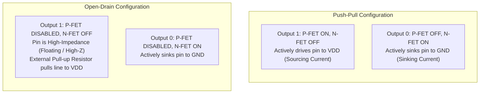
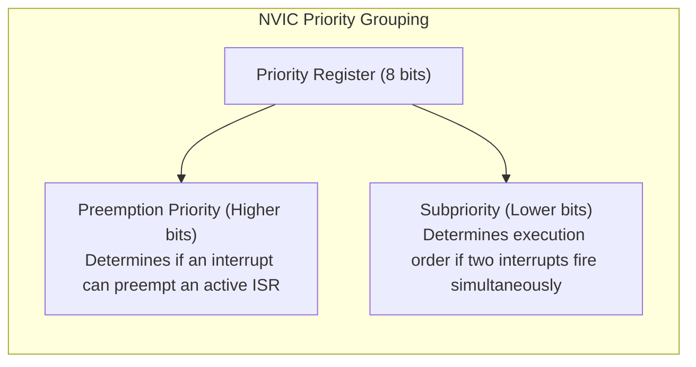
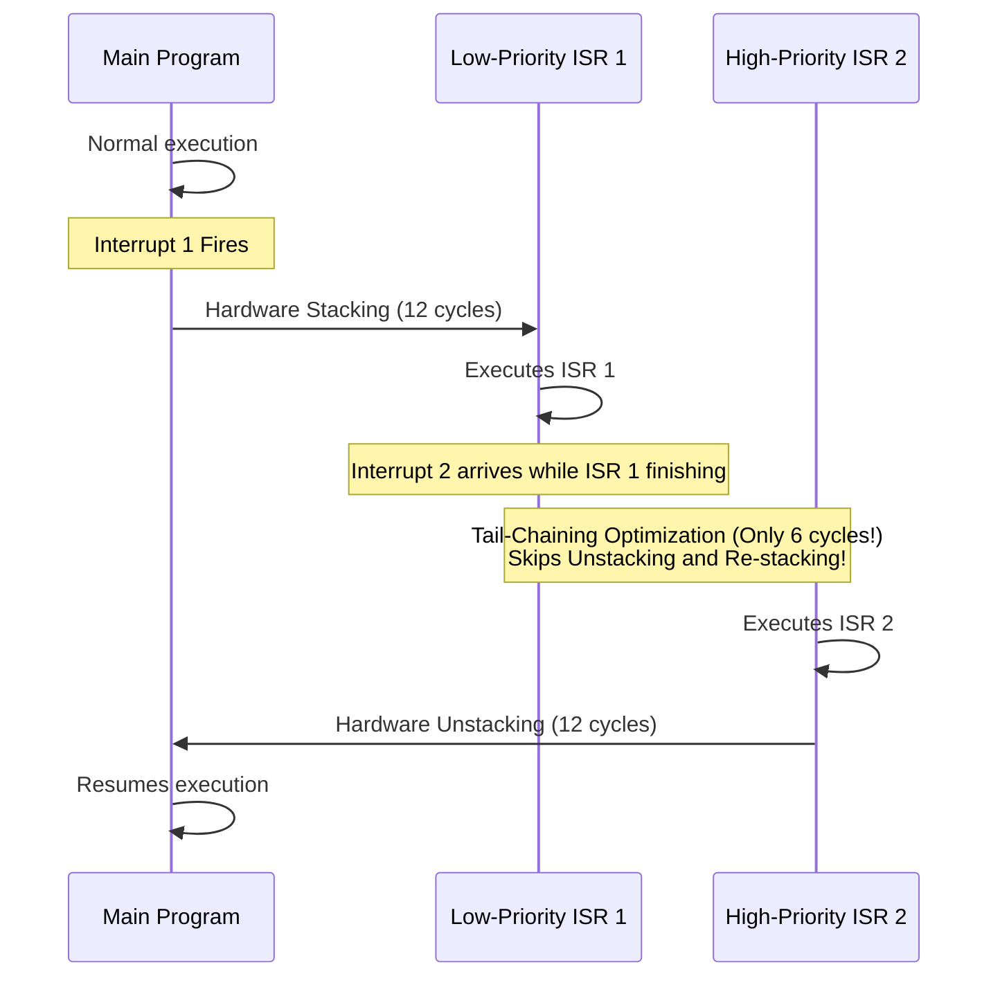
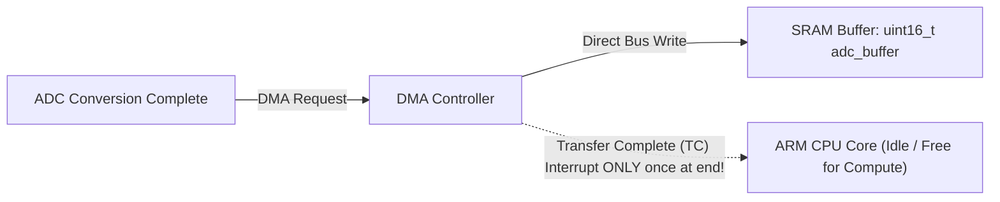
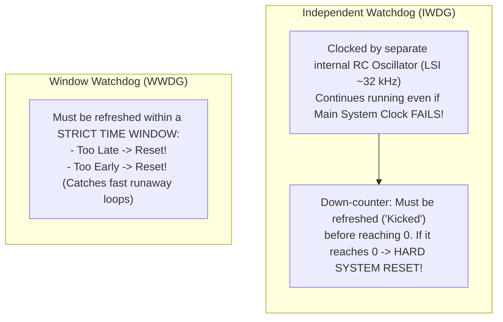

# 03. Microcontroller Peripherals & Hardware Interfacing (Bare-Metal)

> **References & Influential Literature:**
> - *Embedded Systems: Introduction to ARM Cortex-M Microcontrollers* (Vol 1) — Jonathan W. Valvano
> - *The Definitive Guide to ARM Cortex-M3 and Cortex-M4 Processors* (Chapter 7: Exceptions and Interrupts) — Joseph Yiu
> - *Mastering STM32* (Chapter 8: General-Purpose Timers, Chapter 13: Analog-to-Digital Converter) — Carmine Noviello
> - *Making Embedded Systems* (Chapter 5: Inputs and Outputs) — Elecia White

---

## 1. General Purpose Input/Output (GPIO) Architecture

GPIO pins are the primary physical bridge between silicon logic and the analog world. A single GPIO pin contains complex internal circuitry configured via control registers.

```
                  +--- VDD (3.3V)
                  |
                 [P-FET] (P-Channel MOSFET)
                  |
    Output Data --+-----> PHYSICAL PIN
                  |
                 [N-FET] (N-Channel MOSFET)
                  |
                 GND
```

### 1.1 Output Stages: Push-Pull vs. Open-Drain



1. **Push-Pull Output**:
   - Both high-side (P-FET) and low-side (N-FET) transistors are active.
   - Actively drives signals high ($3.3\text{ V}$) and low ($0\text{ V}$) with fast rise and fall times.
   - **Use Cases**: Driving LEDs, SPI clock/data lines, UART TX, chip selects.
   - **Danger**: Never connect two push-pull outputs together! If one outputs HIGH ($3.3\text{ V}$) and the other outputs LOW ($0\text{ V}$), a direct short-circuit occurs, destroying the silicon output stages.

2. **Open-Drain Output**:
   - The top P-FET is permanently disabled. The pin can only pull to Ground ($0\text{ V}$) or float (High-Z).
   - Requires an external or internal **Pull-Up Resistor** ($R_{\text{pullup}} \approx 2.2\text{ k}\Omega\text{ to }10\text{ k}\Omega$) to bring the line HIGH when released.
   - **Wired-AND Capability**: Multiple open-drain devices can connect to the same physical wire without short-circuits. If any device outputs LOW, the entire wire drops LOW.
   - **Use Cases**: **I2C Bus (SDA/SCL)**, shared interrupt request lines, level-shifting between $3.3\text{ V}$ and $5\text{ V}$ domains.

### 1.2 Input Stages & Schmitt Triggers

```
Physical Pin ---> [ESD Protection Diodes] ---> [Pull-up / Pull-down Resistors]
              ---> [Schmitt Trigger] --------> Input Data Register (IDR)
```

- **Floating (High-Z)**: Pin has near-infinite input impedance ($> 10\text{ M}\Omega$). Prone to picking up stray electromagnetic noise; never leave an unconnected input floating.
- **Internal Pull-Up / Pull-Down**: Weak internal resistors ($\sim 40\text{ k}\Omega$) pull the pin deterministically to $V_{\text{DD}}$ or $\text{GND}$ when idle.
- **The Schmitt Trigger**: Eliminates digital oscillation caused by slow-rising or noisy analog signals by introducing **Hysteresis**:
  - Shifts state to HIGH only when voltage crosses $V_{T+} \approx 0.7 \times V_{\text{DD}}$ ($2.31\text{ V}$).
  - Shifts state to LOW only when voltage drops below $V_{T-} \approx 0.3 \times V_{\text{DD}}$ ($0.99\text{ V}$).

---

## 2. Hardware Timers, Counters & Pulse Width Modulation (PWM)

A hardware timer is an autonomous digital counter incremented by clock pulses, running completely independent of CPU instruction execution.

```
Clock Source (e.g. 84 MHz)
      |
      v
+------------------+     +------------------+     +------------------+
| Prescaler (PSC)  | --> | Counter (CNT)    | <-> | Auto-Reload (ARR)|
+------------------+     +------------------+     +------------------+
                                  |
                                  v
                         +------------------+
                         | Compare (CCR1)   | --> PWM Output Pin
                         +------------------+
```

### 2.1 Timer Mathematical Foundations

The timer input clock frequency $f_{\text{clk}}$ is stepped down by a 16-bit **Prescaler Register (PSC)**:

$$f_{\text{timer}} = \frac{f_{\text{clk}}}{\text{PSC} + 1}$$

The **Counter Register (CNT)** counts upwards from $0$ until it equals the **Auto-Reload Register (ARR)**, at which point an **Update Event (UEV)** / Timer Overflow occurs and the counter resets:

$$\text{Timer Period } T_{\text{overflow}} = \frac{\text{ARR} + 1}{f_{\text{timer}}} = \frac{(\text{PSC} + 1) \times (\text{ARR} + 1)}{f_{\text{clk}}}$$

$$\text{Update Event Frequency } f_{\text{overflow}} = \frac{f_{\text{clk}}}{(\text{PSC} + 1) \times (\text{ARR} + 1)}$$

#### Practical Engineering Example:
> Configure an STM32 timer running on an $84\text{ MHz}$ clock to trigger an interrupt exactly every $1.0\text{ ms}$ ($1000\text{ Hz}$):
> 1. Set $\text{PSC} = 83$ (Divides clock by $84 \implies f_{\text{timer}} = 1\text{ MHz}$, tick $= 1\mu\text{s}$).
> 2. Set $\text{ARR} = 999$ (Counts $1000$ ticks of $1\mu\text{s} = 1.0\text{ ms}$).

### 2.2 Pulse Width Modulation (PWM)
By comparing the running `CNT` register with a **Capture/Compare Register (CCR)**, the hardware generates a high-speed square wave with a configurable **Duty Cycle**:

$$\text{Duty Cycle } D = \frac{\text{CCR}}{\text{ARR} + 1} \times 100\%$$

```
ARR = 1000, CCR = 250 -> 25% Duty Cycle
Voltage
  ^
  |   +---+               +---+
  |   |   |               |   |
  +---+---+---+---+---+---+---+---+---> Time
      <---> 25% High
      <-------------------> 100% Period (ARR)
```

**Industrial Applications**:
- **DC Motor Speed Control**: Average voltage applied to armature $= V_{\text{DD}} \times D$.
- **LED Brightness (Dimming)**: Human eyes integrate light intensity without perceiving flicker at PWM frequencies $> 200\text{ Hz}$.
- **RC Servo Motor Positioning**: Standard $50\text{ Hz}$ PWM ($20\text{ ms}$ period) where pulse width encodes position ($1.0\text{ ms} = -90^\circ$, $1.5\text{ ms} = 0^\circ$, $2.0\text{ ms} = +90^\circ$).

---

## 3. Interrupts & The Nested Vectored Interrupt Controller (NVIC)

Polling peripherals in a `while(1)` loop wastes millions of CPU cycles and cannot guarantee low latency. Interrupts allow external hardware events to asynchronously pause the CPU and force it to execute an **Interrupt Service Routine (ISR)**.

### 3.1 ARM Cortex-M NVIC Hardware Features
The ARM NVIC is integrated directly into the processor core to achieve deterministic, ultra-low-latency interrupt dispatch:
- **Zero-Software Vectoring**: The hardware automatically reads the Vector Table and branches to the ISR address.
- **Fixed Hardware Stacking**: Upon interrupt entry, the hardware automatically pushes eight CPU registers (`R0`, `R1`, `R2`, `R3`, `R12`, `LR`, `PC`, and `xPSR`) onto the currently active stack (MSP or PSP) in exactly **12 clock cycles**.



### 3.2 Advanced NVIC Optimizations: Tail-Chaining & Late-Arrival



1. **Tail-Chaining**: If an interrupt is pended while another ISR is finishing, the core skips the 12-cycle register pop and 12-cycle register push. It transitions between ISRs in **only 6 clock cycles**.
2. **Late-Arrival**: If a higher-priority interrupt arrives while the core is in the middle of stacking registers for a lower-priority interrupt, the core immediately directs execution to the higher-priority handler without restarting the stacking process.

### 3.3 Golden Rules of Writing Production ISRs
1. **Never Call Blocking Functions**: Never use `delay()`, `printf()`, or wait on mutexes inside an ISR.
2. **Keep ISRs Short & Deterministic**: Perform only the immediate hardware acknowledge (e.g., read byte from UART `DR` register, clear interrupt flag) and set a `volatile` flag or post to an RTOS queue.
3. **Deferred Processing (Bottom-Half / Task Notification)**: Offload heavy processing (parsing JSON, filtering sensor data) to background tasks or main loops.

---

## 4. Analog-to-Digital Converters (ADC) & Signal Acquisition

Microcontrollers operate in the digital domain ($0$ and $1$), but physical reality is continuous and analog (temperature, pressure, sound, strain). The ADC samples a continuous voltage and converts it into a discrete digital number.

### 4.1 Successive Approximation Register (SAR) ADC Architecture
The SAR ADC is the standard architecture in microcontrollers because it balances high speed ($1\text{ to }5\text{ MSPS}$), low power, and medium-to-high resolution ($10\text{ to }16\text{ bits}$).

```
Analog In (Vin) ---> [Sample & Hold]
                            |
                     (Comparator) <--- [Internal R-2R DAC]
                            |                   ^
                            v                   |
             [Successive Approximation Register (SAR)]
                            |
                     Digital Output Word
```

- **Operation (Binary Search)**:
  1. The internal DAC sets its MSB to `1` (half-scale: $V_{\text{ref}} / 2$).
  2. The comparator checks if $V_{\text{in}} > V_{\text{DAC}}$. If yes, MSB remains `1`; if no, MSB is cleared to `0`.
  3. The SAR moves to the next bit and repeats. An $N$-bit conversion takes exactly $N$ clock cycles.

### 4.2 Mathematical Resolution & Quantization Error

$$\text{Digital ADC Code } = \left\lfloor \frac{V_{\text{in}}}{V_{\text{ref}}} \times (2^N - 1) \right\rfloor$$

$$\text{Voltage Resolution per LSB } \Delta V = \frac{V_{\text{ref}}}{2^N - 1}$$

| Resolution ($N$) | Total Steps ($2^N$) | Resolution ($\Delta V$ with $V_{\text{ref}} = 3.3\text{ V}$) | Dynamic Range ($\text{SNR} \approx 6.02N + 1.76\text{ dB}$) |
| :--- | :--- | :--- | :--- |
| **8-bit** | 256 | $12.89\text{ mV}$ | $49.9\text{ dB}$ |
| **10-bit (Arduino)**| 1,024 | $3.22\text{ mV}$ | $61.9\text{ dB}$ |
| **12-bit (STM32)**  | 4,096 | $0.805\text{ mV}$ ($805\,\mu\text{V}$) | $74.0\text{ dB}$ |
| **16-bit** | 65,536 | $50.35\,\mu\text{V}$ | $98.1\text{ dB}$ |

### 4.3 The Nyquist-Shannon Sampling Theorem & Anti-Aliasing
To faithfully reconstruct an analog signal without **Aliasing** (where high-frequency components disguise themselves as false low frequencies), the sampling frequency $f_s$ must be strictly greater than twice the highest frequency component $f_{\text{max}}$ present in the signal:

$$f_s > 2 \times f_{\text{max}}$$

An analog **Anti-Aliasing Low-Pass Filter (RC or Op-Amp)** must be placed physically before the ADC input pin to attenuate all signal frequencies above $f_s / 2$.

---

## 5. Direct Memory Access (DMA): Zero-CPU Streaming

Without DMA, streaming $1000$ samples from an ADC to memory requires an interrupt on every sample:
$$1000\text{ samples} \times (12\text{ stack cycles} + \text{ISR execution} + 12\text{ unstack cycles}) \implies 50,000+\text{ CPU cycles wasted!}$$

**Direct Memory Access (DMA)** is an independent bus master that transfers data directly between peripherals and SRAM across the system bus without involving the CPU core.



### 5.1 DMA Operational Modes
1. **Normal Mode**: DMA transfers $N$ bytes into a buffer and stops, firing a Transfer Complete (TC) interrupt.
2. **Circular Mode**: Upon reaching the end of the buffer, the DMA counter automatically resets to the beginning. The CPU processes the first half of the buffer (Half-Transfer Interrupt) while the DMA hardware fills the second half without stopping.

---

## 6. Watchdog Timers & Power Management

In unattended industrial systems, software deadlocks, infinite loops, or electrostatic discharges (ESD) corrupting the program counter can freeze the firmware. The **Watchdog Timer (WDT)** is the ultimate safety mechanism that automatically resets the MCU if software becomes unresponsive.

### 6.1 Independent Watchdog (IWDG) vs. Window Watchdog (WWDG)



### 6.2 Low-Power Sleep Modes
To maximize battery life in portable IoT devices, modern MCUs provide graded low-power states:

| Power Mode | CPU Clock | Peripherals | SRAM Retention | Wakeup Latency | Current Draw |
| :--- | :--- | :--- | :--- | :--- | :--- |
| **Run** | Active | All Active | Yes | 0 | $10\text{ to }40\text{ mA}$ |
| **Sleep** | Stopped (`wfi`) | Active | Yes | Clock cycles | $1\text{ to }3\text{ mA}$ |
| **Stop** | Stopped | Disabled (RTC only)| Yes | $\sim 5\,\mu\text{s}$ | $10\text{ to }50\,\mu\text{A}$ |
| **Standby** | Power Removed | RTC Only | Lost (Except Backup Regs)| $\sim 50\,\mu\text{s}$ | $1.5\text{ to }3\,\mu\text{A}$ |
