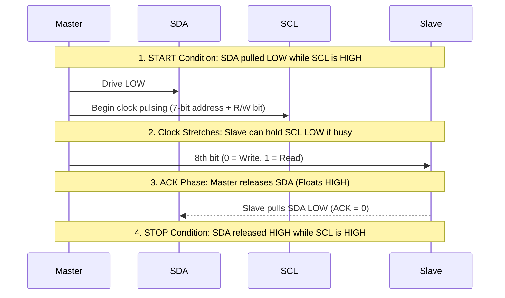

# 04. Communication Protocols - UART, SPI, I2C, CAN & USB

> **References & Influential Literature:**
> - *Serial Port Complete: COM Ports, USB Virtual COM Ports, and Ports for Embedded Systems* — Jan Axelson
> - *The I2C Bus: From Specification to Implementation* — Dominique Paret
> - *Controller Area Network (CAN) Basics and Protocols* — Hermann Kopetz & Robert Bosch GmbH Spec
> - *USB Complete: The Developer's Guide (5th Edition)* — Jan Axelson
> - *Embedded Systems: Real-Time Interfacing to ARM Cortex-M Microcontrollers* — Jonathan W. Valvano

---

## 1. Protocol Comparison Matrix

Microcontrollers rely on serial buses to interface with sensors, storage, displays, actuators, and companion computers. Choosing the correct communication protocol requires balancing pin count, transmission distance, data throughput, and fault tolerance:

| Protocol | Signal Type | Wire Count | Max Data Rate | Distance | Duplex | Topology | Multi-Master |
| :--- | :--- | :--- | :--- | :--- | :--- | :--- | :--- |
| **UART** | Asynchronous Single-Ended | 2 (TX, RX) | Up to $10\text{ Mbps}$ | $< 5\text{ m}$ (RS-232: $15\text{ m}$, RS-485: $1.2\text{ km}$) | Full | Point-to-Point (RS-485: Multi-drop) | No (RS-485: Token/Poll) |
| **I2C** | Synchronous Open-Drain | 2 (SDA, SCL) | $100\text{ kbps}$ (Std), $400\text{ kbps}$ (Fast), $3.4\text{ Mbps}$ (High) | $< 2\text{ m}$ (Capacitance limited) | Half | Multi-drop Bus | Yes (Wired-AND Arbitration) |
| **SPI** | Synchronous Push-Pull | $3 + N$ (SCK, MOSI, MISO, CS) | $20\text{ to }80+\text{ Mbps}$ | $< 30\text{ cm}$ (Board level) | Full | Master / Multi-Slave | No (Single Master standard) |
| **CAN Bus**| Synchronous Differential | 2 (CAN_H, CAN_L)| $1\text{ Mbps}$ (Classical), $8\text{ Mbps}$ (CAN FD) | $40\text{ m}$ at $1\text{ Mbps}$, $1\text{ km}$ at $50\text{ kbps}$ | Half | Multi-Master Broadcast Bus | Yes (Non-destructive bitwise) |
| **USB 2.0**| Packetized Differential | 2 (D+, D-) + 2 Pwr | $1.5\text{ Mbps}$ (Low), $12\text{ Mbps}$ (Full), $480\text{ Mbps}$ (High) | $< 5\text{ m}$ | Half | Tiered Star (Host / Device) | No (Strict Host polling) |

---

## 2. UART & USART: Universal Asynchronous Receiver-Transmitter

UART transmits data sequentially bit-by-bit without sharing a dedicated clock signal. Both devices must agree beforehand on an exact **Baud Rate** (bits per second) and framing structure.

```
Idle (Mark: HIGH)
  \     Start Bit      Data Bits (LSB First: Bit 0 to 7)      Parity  Stop Bit(s)
   \   +---+---+---+---+---+---+---+---+---+---+---+---+---+   +---+   +-------+
    \  | 0 | D0| D1| D2| D3| D4| D5| D6| D7| P | 1 | 1 |
     +-+   +---+---+---+---+---+---+---+---+---+---+---+---+---+---+---+
       <--->                                                   <------->
       1 bit                                                   1 or 2 bits
```

### 2.1 Baud Rate Generation & Sampling
Because there is no shared clock wire, the receiver's internal clock runs at **$16\times$ the baud rate (oversampling)**. 
1. The receiver idles at logic HIGH.
2. When the line drops LOW (falling edge of the **Start Bit**), the receiver counts $8$ oversampling clock pulses to align itself directly with the **center of the start bit**.
3. It then samples every $16$ clock ticks to read data bits $D_0$ through $D_7$ at the absolute center of each bit period, maximizing noise margin.

$$\text{Baud Rate Divisor } \text{USART\_DIV} = \frac{f_{\text{PCLK}}}{16 \times \text{Baud}}$$

### 2.2 Production UART Ring Buffer Driver (C Implementation)

```c
#include <stdint.h>
#include <stdbool.h>

#define RING_BUFFER_SIZE 128

typedef struct {
    uint8_t buffer[RING_BUFFER_SIZE];
    volatile uint16_t head;
    volatile uint16_t tail;
} RingBuffer_t;

static RingBuffer_t uart_rx_buffer = { .head = 0, .tail = 0 };

/* Push byte into circular ring buffer (called inside ISR) */
bool ring_buffer_push(RingBuffer_t *rb, uint8_t byte) {
    uint16_t next = (rb->head + 1) % RING_BUFFER_SIZE;
    if (next == rb->tail) {
        return false; /* Buffer overflow! Dropping byte */
    }
    rb->buffer[rb->head] = byte;
    rb->head = next;
    return true;
}

/* Pop byte from circular ring buffer (called in main thread) */
bool ring_buffer_pop(RingBuffer_t *rb, uint8_t *byte) {
    if (rb->head == rb->tail) {
        return false; /* Buffer empty */
    }
    *byte = rb->buffer[rb->tail];
    rb->tail = (rb->tail + 1) % RING_BUFFER_SIZE;
    return true;
}

/* Interrupt Service Routine for UART RX */
void USART1_IRQHandler(void) {
    /* Check if RXNE (Read Data Register Not Empty) flag is set */
    if (USART1->SR & (1UL << 5)) {
        uint8_t received_byte = (uint8_t)(USART1->DR & 0xFF);
        ring_buffer_push(&uart_rx_buffer, received_byte);
    }
}
```

### 2.3 Physical Transceivers: RS-232 vs. RS-485
- **Logic-Level UART**: Signals swing between $0\text{ V}$ and $3.3\text{ V}$ / $5\text{ V}$. Susceptible to ground loops and EMI beyond a few meters.
- **RS-232**: Inverts logic and swings from $+12\text{ V}$ (Logic 0 / Space) to $-12\text{ V}$ (Logic 1 / Mark). Extends distance to $15\text{ m}$.
- **RS-485 (Industrial Differential Standard)**: Uses a balanced twisted pair ($A$ and $B$). Logic is encoded as a **differential voltage**:
  $$V_{A} - V_{B} > +200\text{ mV} \implies \text{Logic 1}$$
  $$V_{A} - V_{B} < -200\text{ mV} \implies \text{Logic 0}$$
  Differential receivers reject common-mode electromagnetic noise induced on both wires. Supports **multi-drop networks up to 32 transceivers across 1,200 meters** at $100\text{ kbps}$, terminated with $120\,\Omega$ resistors at both physical ends.

---

## 3. I2C (Inter-Integrated Circuit) Deep Dive

Invented by Philips (NXP), **I2C** is a synchronous, multi-master, open-drain serial bus requiring only two physical lines:
- **SDA (Serial Data)**: Bidirectional data line.
- **SCL (Serial Clock)**: Clock generated by the bus master.

```
       +3.3V
         |
       [Rp] Pull-up Resistors (e.g. 4.7 kOhm)
         |     +-------------------------+
SDA -----+-----+ Master       Slave 1    | Slave 2
               | Open-Drain   Open-Drain | Open-Drain
SCL -----------+-------------------------+
```

### 3.1 Framing & Signaling Conditions



1. **START Condition (S)**: A transition from HIGH to LOW on the SDA line while SCL is HIGH.
2. **Data Validity**: While SCL is HIGH, the data on SDA **must remain stable**. Data may only change states when SCL is LOW.
3. **ACK / NACK Phase**: After 8 bits are clocked, the transmitting device releases SDA. The receiving device must pull SDA LOW during the 9th clock pulse to signal **Acknowledge (ACK)**. Leaving SDA floating HIGH indicates **Not-Acknowledge (NACK)**.
4. **STOP Condition (P)**: A transition from LOW to HIGH on the SDA line while SCL is HIGH.
5. **Clock Stretching**: If a slow slave needs time to process an ADC reading or write to EEPROM, it can **hold SCL LOW** in hardware. The master's hardware detects this and pauses until the slave releases the clock.

### 3.2 Pull-Up Resistor Sizing Math
Because I2C uses open-drain pins, lines are pulled HIGH exclusively by external resistors $R_p$. The maximum allowed bus capacitance $C_b$ (traces + pins) for Standard Mode ($100\text{ kHz}$) is $400\text{ pF}$, and maximum rise time $t_r$ is $1000\text{ ns}$:

$$R_{p(\max)} = \frac{t_r}{0.8473 \times C_b} = \frac{1000\text{ ns}}{0.8473 \times 400\text{ pF}} \approx 2.95\text{ k}\Omega$$

$$R_{p(\min)} = \frac{V_{\text{DD}} - V_{OL(\max)}}{I_{OL}} = \frac{3.3\text{ V} - 0.4\text{ V}}{3\text{ mA}} \approx 967\,\Omega$$

Standard engineering values: **$4.7\text{ k}\Omega$** for short board traces at $100\text{ kHz}$, **$2.2\text{ k}\Omega$** for $400\text{ kHz}$ Fast Mode.

---

## 4. SPI (Serial Peripheral Interface)

Motorola's SPI is a synchronous, full-duplex, high-speed master-slave interface. Unlike I2C, SPI lines use **push-pull** drivers, enabling speeds exceeding $50\text{ Mbps}$.

```
  Master (MCU)                       Slave (Sensor/SD Card)
+--------------+                   +------------------------+
|         MOSI | ----------------> | SDI (Serial Data In)   |
|         MISO | <---------------- | SDO (Serial Data Out)  |
|          SCK | ----------------> | SCLK (Serial Clock)    |
|          CS0 | ----------------> | CS / SS (Chip Select)  |
+--------------+                   +------------------------+
```

### 4.1 Circular Shift Register Architecture
SPI hardware is fundamentally two synchronous shift registers connected in a full-duplex continuous ring:

```
Master Shift Register [ M7 | M6 | M5 | M4 | M3 | M2 | M1 | M0 ]
      ^                                                     |
      | MOSI (Master Out Slave In)                          |
      |                                                     v
Slave Shift Register  [ S7 | S6 | S5 | S4 | S3 | S2 | S1 | S0 ]
```
Every clock pulse simultaneously shifts one bit **out** of the Master onto MOSI and one bit **into** the Master from MISO. You cannot "read" from an SPI slave without simultaneously "writing" a dummy byte (`0xFF`) to supply clock ticks!

### 4.2 The 4 SPI Modes: CPOL and CPHA
The bus timing is dictated by two configuration bits:
- **CPOL (Clock Polarity)**: Logic level of SCK when the bus is idle ($0 = \text{Low}$, $1 = \text{High}$).
- **CPHA (Clock Phase)**: Determines which clock edge captures data ($0 = \text{First/Leading edge}$, $1 = \text{Second/Trailing edge}$).

| SPI Mode | CPOL (Idle Clock) | CPHA (Sample Edge) | Description |
| :--- | :--- | :--- | :--- |
| **Mode 0 (0, 0)** | Low ($0\text{ V}$) | Leading (Rising) Edge | Data sampled on rising edge, shifted out on falling edge |
| **Mode 1 (0, 1)** | Low ($0\text{ V}$) | Trailing (Falling) Edge | Data sampled on falling edge, shifted out on rising edge |
| **Mode 2 (1, 0)** | High ($3.3\text{ V}$) | Leading (Falling) Edge | Data sampled on falling edge, shifted out on rising edge |
| **Mode 3 (1, 1)** | High ($3.3\text{ V}$) | Trailing (Rising) Edge | Data sampled on rising edge, shifted out on falling edge |

*Mode 0 and Mode 3 are the most universally supported modes in modern flash memories and sensors.*

---

## 5. CAN Bus (Controller Area Network)

Developed by Robert Bosch GmbH for the automotive industry, CAN is a rugged, message-based broadcast bus designed to operate in severe electromagnetic environments (engine compartments, robotics, avionics).

```
          120 Ohm                                                       120 Ohm
          Termination                                                   Termination
          +----+                                                         +----+
CAN_H ----|    |---------------------------------------------------------|    |----
          |    |          |                        |                     |    |
CAN_L ----|    |----------+------------------------+---------------------|    |----
          +----+          |                        |                     +----+
                    +------------+           +------------+
                    | Transceiver|           | Transceiver|
                    +------------+           +------------+
                    | Controller |           | Controller |
                    | (Node A)   |           | (Node B)   |
                    +------------+           +------------+
```

### 5.1 Physical Signaling: Recessive vs. Dominant Bits
CAN transceivers encode bits differentially on two lines: **CAN_H** and **CAN_L**:

```
Voltage
  ^
  |        CAN_H = 3.5V
3.5V +-----+            +-----+
     |     |            |     |
2.5V +-----+------------+-----+----+ CAN_H / CAN_L = 2.5V (Common-mode)
     |     |            |     |
1.5V +-----+            +-----+
  |        CAN_L = 1.5V
  +--+-----+------------+-----+----> Time
     Dominant (0)    Recessive (1)
     Diff = 2.0V      Diff = 0.0V
```

- **Dominant Bit (Logic 0)**: Transceiver actively drives $\text{CAN\_H} \to 3.5\text{ V}$ and $\text{CAN\_L} \to 1.5\text{ V}$ ($\Delta V = 2.0\text{ V}$).
- **Recessive Bit (Logic 1)**: Transceiver outputs float; termination resistors pull both lines to $2.5\text{ V}$ ($\Delta V = 0.0\text{ V}$).
- **Wired-AND Priority**: If Node A transmits Dominant (0) and Node B transmits Recessive (1) at the same instant, **the Dominant bit (0) overwrites the Recessive bit (1)** across the entire bus!

### 5.2 Non-Destructive Bitwise Arbitration
CAN does not use central master scheduling or packet collisions. Instead, nodes arbitrate in real-time during the **11-bit (Standard) or 29-bit (Extended) Identifier field**:

```
Node A (ID: 0x120 = 001 0010 0000)   -- Transmits bit-by-bit
Node B (ID: 0x124 = 001 0010 0100)   -- Transmits bit-by-bit

Bit Step:      1  2  3  4  5  6  7  8  9  10 11
Node A sends:  0  0  1  0  0  1  0  0  0  0  0  (Dominant on Bit 9)
Node B sends:  0  0  1  0  0  1  0  0  1  0  0  (Recessive on Bit 9)
                                       ^
Bus State:     0  0  1  0  0  1  0  0  0  ...
Node B listens to the bus on Bit 9, sees Dominant (0) while it sent Recessive (1).
Node B realizes a higher-priority message is transmitting, INSTANTLY backs off!
Node A continues transmitting without a single microsecond of delay or packet loss!
```

> [!IMPORTANT]
> **Lowest Numerical Identifier = Highest Bus Priority**. For instance, an Airbag or Anti-lock Braking System (ABS) broadcast message uses ID `0x001`, while an in-cabin climate control sensor uses ID `0x7FF`.

---

## 6. USB (Universal Serial Bus) Architecture

USB is a high-speed, tiered-star, host-centric packet architecture. Unlike peer-to-peer serial buses, an embedded device cannot speak on the USB bus unless explicitly polled by the **USB Host** (e.g., PC or Raspberry Pi).

```
USB Host (PC)
      |
      +---> Root Hub ---> Device 1 (USB Mouse - HID Class)
      |
      +---> External Hub ---> Device 2 (MCU - Virtual COM Port / CDC Class)
```

### 6.1 Physical Signaling & NRZI Encoding
USB 2.0 communicates over a $90\,\Omega$ differential impedance twisted pair: **D+** and **D-**:
- **Low Speed ($1.5\text{ Mbps}$)**: Pull-up resistor on D-.
- **Full Speed ($12\text{ Mbps}$)**: Pull-up resistor on D+.
- **High Speed ($480\text{ Mbps}$)**: Negotiated via chirp handshake.
- **NRZI Encoding (Non-Return-to-Zero Inverted)**: A logic `0` is represented by a voltage transition on the bus; a logic `1` is represented by no transition.
- **Bit Stuffing**: If six consecutive `1`s occur, the hardware automatically inserts a dummy `0` bit to guarantee an edge transition for receiver clock recovery.

### 6.2 The USB Descriptor Hierarchy
When an MCU is plugged into a USB host, an **Enumeration Sequence** occurs. The host issues standard requests to endpoint 0 (`GET_DESCRIPTOR`) to build the device tree:

```
[ Device Descriptor ] (Vendor ID: VID, Product ID: PID, Device Class)
        |
    [ Configuration Descriptor ] (Bus-powered vs Self-powered, Max mA)
            |
        [ Interface Descriptor ] (e.g., Interface 0: CDC Control, Interface 1: CDC Data)
                |
            [ Endpoint Descriptors ] (Pipe addresses: EP1 IN, EP1 OUT, Attributes: Bulk/Interrupt)
```

### 6.3 Common Embedded USB Classes
1. **USB CDC (Communication Device Class - Virtual COM Port)**:
   - Emulates a legacy RS-232 serial UART port over USB.
   - Operating systems load standard drivers (`/dev/ttyACM0` on Linux, `COMx` on Windows).
   - Uses **Bulk Endpoints** ($64\text{-byte}$ packets) for error-checked, high-throughput serial terminal communication.
2. **USB HID (Human Interface Device)**:
   - Keyboards, mice, gamepads, custom data loggers.
   - **Zero Driver Installation**: Native drivers exist in all modern OS kernels.
   - Uses **Interrupt Endpoints** guaranteed to be polled by the host at fixed intervals (e.g., every $1\text{ ms}$).
