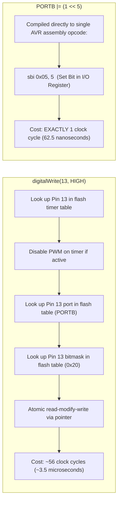

# 05. Arduino Ecosystem - Architecture, Internals & Hardware Interfacing

> **References & Influential Literature:**
> - *Arduino Cookbook (3rd Edition)* — Michael Margolis & Brian Jepson
> - *AVR Microcontroller and Embedded Systems: Using Assembly and C* — Muhammad Ali Mazidi et al.
> - *Making Embedded Systems* (Chapter 1: Introduction, Chapter 6: Friendly Interfaces) — Elecia White
> - *ATmega328P Complete Datasheet* — Microchip Technology (Atmel)

---

## 1. The ATmega328P Silicon Architecture

The Arduino Uno R3 is built around the **Microchip (Atmel) ATmega328P**, an 8-bit AVR RISC microcontroller executing most instructions in a single clock cycle ($1\text{ MIPS per MHz}$).

```
+-------------------------------------------------------------+
|               ATmega328P 8-BIT AVR ARCHITECTURE             |
|                                                             |
|  +-------------------------------------------------------+  |
|  | Flash Memory (32 KB) - 16-bit wide instructions        |  |
|  | Boot Flash Section (Optiboot: 512 bytes at 0x7E00)     |  |
|  +-------------------------------------------------------+  |
|                             |                               |
|                     Instruction Bus                         |
|                             v                               |
|  +-------------------------------------------------------+  |
|  | 32 x 8-bit General Purpose Registers (R0 - R31)       |  |
|  | Pointer Registers: X (R27:R26), Y (R29:R28), Z (R31:R30)|
|  +-------------------------------------------------------+  |
|                             |                               |
|                         8-bit ALU                           |
|                             |                               |
|  +-------------------------------------------------------+  |
|  | I/O Memory (64 Registers: DDRx, PORTx, PINx)          |  |
|  | Extended I/O Memory (160 Registers)                   |  |
|  +-------------------------------------------------------+  |
|                             |                               |
|  +-------------------------------------------------------+  |
|  | Internal SRAM (2048 Bytes = 2 KB)                     |  |
|  | Internal EEPROM (1024 Bytes = 1 KB)                   |  |
|  +-------------------------------------------------------+  |
+-------------------------------------------------------------+
```

### 1.1 Memory Architecture: Harvard Separation
- **Program Memory**: $32\text{ KB}$ of on-chip In-System Programmable (ISP) Flash organized as $16\text{K} \times 16\text{ bits}$.
- **Data Memory (SRAM)**: Exactly $2\text{ KB}$ ($2,048\text{ bytes}$). The stack grows downwards from `0x08FF` to `0x0100`.
- **EEPROM**: $1\text{ KB}$ ($1,024\text{ bytes}$) of true non-volatile byte-writable storage (rated for $100,000$ write cycles) accessed via specialized registers (`EEAR`, `EEDR`, `EECR`).
- **The Optiboot Bootloader**: Resides in the top $512\text{ bytes}$ of Flash. Upon power-on reset, it listens on UART at $115,200\text{ baud}$ for incoming hex programming commands using the **STK500** protocol. If no flashing command is received within $500\text{ ms}$, it jumps to address `0x0000` to execute the user sketch.

---

## 2. Anatomy of the Arduino Core: Beneath the Abstraction

The Arduino framework is not a distinct programming language; it is standard C/C++ compiled by `avr-gcc` against a lightweight hardware runtime library.

### 2.1 The Hidden `main()` Function
When an Arduino sketch compiles, the IDE links `main.cpp` from the Arduino core:

```cpp
/* File: hardware/arduino/avr/cores/arduino/main.cpp */
#include <Arduino.h>

int main(void) {
    init();          /* 1. Configure hardware timers, ADC prescaler, and interrupts */
    initVariant();   /* 2. Board-specific pin mappings */

#if defined(USBCON)
    USBDevice.attach();
#endif

    setup();         /* 3. Call user setup() function once */

    for (;;) {
        loop();      /* 4. Execute user loop() infinitely */
        if (serialEventRun) serialEventRun();
    }
    return 0;
}
```

### 2.2 Inside `wiring.c`: The Magic Behind `millis()` and `delay()`
In `init()`, the core sets up **Timer0** as an 8-bit counter running with a prescaler of 64:

$$f_{\text{timer0}} = \frac{16\text{ MHz}}{64} = 250\text{ kHz} \implies \text{Tick Period} = 4\,\mu\text{s}$$

Timer0 overflows every 256 counts:
$$\text{Overflow Period} = 256 \times 4\,\mu\text{s} = 1.024\text{ ms}$$

```c
/* File: hardware/arduino/avr/cores/arduino/wiring.c */
volatile unsigned long timer0_overflow_count = 0;
volatile unsigned long timer0_millis = 0;
static unsigned char timer0_fract = 0;

ISR(TIMER0_OVF_vect) {
    /* Copy variables to local register */
    unsigned long m = timer0_millis;
    unsigned char f = timer0_fract;

    m += 1;
    f += 3; /* 1.024 ms - 1.000 ms = 0.024 ms error */
    if (f >= 125) { /* 125 * 0.024 = 3 ms correction! */
        f -= 125;
        m += 1;
    }

    timer0_fract = f;
    timer0_millis = m;
    timer0_overflow_count++;
}

unsigned long millis(void) {
    unsigned long m;
    uint8_t oldSREG = SREG;
    cli(); /* Disable interrupts to read 32-bit integer atomically */
    m = timer0_millis;
    SREG = oldSREG; /* Restore interrupt state */
    return m;
}
```

---

## 3. Abstraction Cost Benchmark: `digitalWrite()` vs. Direct Port Manipulation

The convenience of Arduino's `digitalWrite()` introduces immense CPU overhead that can cripple high-speed communication or precise bit-banging.

```
Arduino Pin Mapping:
Digital Pins 0 to 7   <--> PORTD (Bits 0 to 7)
Digital Pins 8 to 13  <--> PORTB (Bits 0 to 5)  -- Pin 13 is PB5 (LED_BUILTIN)
Analog Pins A0 to A5  <--> PORTC (Bits 0 to 5)
```

### 3.1 The Oscilloscope Benchmark

```c
/* METHOD A: Arduino High-Level Abstraction */
void loop() {
    digitalWrite(13, HIGH);
    digitalWrite(13, LOW);
}

/* METHOD B: Bare-Metal Direct Port Manipulation (AVR C) */
void loop() {
    PORTB |= (1 << 5);  /* Set PB5 HIGH */
    PORTB &= ~(1 << 5); /* Clear PB5 LOW */
}
```



**Result**: Bare-metal direct port manipulation is **56 times faster** and consumes negligible code space compared to `digitalWrite()`.

---

## 4. Hardware Interfacing & Sensor Drivers

### 4.1 Ultrasonic Distance Sensor (HC-SR04)
The HC-SR04 measures distance via echo time of a $40\text{ kHz}$ ultrasonic burst.
1. Send a $10\,\mu\text{s}$ trigger pulse on the `TRIG` pin.
2. The sensor emits an 8-cycle ultrasonic burst and drives the `ECHO` pin HIGH.
3. `ECHO` stays HIGH until the sound reflects off an obstacle and returns to the transducer.

$$\text{Speed of Sound in Dry Air } v = 343\text{ m/s} = 0.0343\text{ cm/}\mu\text{s}$$

$$\text{Distance } d = \frac{\text{Echo Pulse Width }(\mu\text{s}) \times 0.0343\text{ cm/}\mu\text{s}}{2}$$

```cpp
const int TRIG_PIN = 9;
const int ECHO_PIN = 10;

void setup() {
    pinMode(TRIG_PIN, OUTPUT);
    pinMode(ECHO_PIN, INPUT);
    Serial.begin(115200);
}

float measure_distance_cm() {
    /* 1. Generate clean 10us trigger pulse */
    digitalWrite(TRIG_PIN, LOW);
    delayMicroseconds(2);
    digitalWrite(TRIG_PIN, HIGH);
    delayMicroseconds(10);
    digitalWrite(TRIG_PIN, LOW);

    /* 2. Measure high pulse width in microseconds (timeout after 30ms = ~5m) */
    unsigned long duration = pulseIn(ECHO_PIN, HIGH, 30000UL);
    if (duration == 0) return -1.0f; /* Out of range */

    /* 3. Calculate distance in cm */
    return (float)duration * 0.0343f / 2.0f;
}
```

### 4.2 Precision Environmental Sensing: Bosch BME280 (I2C)
The BME280 measures temperature, barometric pressure, and relative humidity over I2C (Address `0x76` or `0x77`). It requires reading 24 factory calibration coefficients from non-volatile memory to compute floating-point or fixed-point integer compensation:

```cpp
#include <Wire.h>
#define BME280_ADDR 0x76

/* Raw compensation parameters stored inside sensor ROM */
uint16_t dig_T1;
int16_t  dig_T2, dig_T3;

void read_calibration_data() {
    Wire.beginTransmission(BME280_ADDR);
    Wire.write(0x88); /* Start address of calibration constants */
    Wire.endTransmission();
    
    Wire.requestFrom(BME280_ADDR, 6);
    dig_T1 = (Wire.read()) | (Wire.read() << 8);
    dig_T2 = (Wire.read()) | (Wire.read() << 8);
    dig_T3 = (Wire.read()) | (Wire.read() << 8);
}

/* Bosch integer temperature compensation formula */
int32_t t_fine;
int32_t bme280_compensate_T_int32(int32_t adc_T) {
    int32_t var1, var2, T;
    var1 = ((((adc_T >> 3) - ((int32_t)dig_T1 << 1))) * ((int32_t)dig_T2)) >> 11;
    var2 = (((((adc_T >> 4) - ((int32_t)dig_T1)) * ((adc_T >> 4) - ((int32_t)dig_T1))) >> 12) * ((int32_t)dig_T3)) >> 14;
    t_fine = var1 + var2;
    T = (t_fine * 5 + 128) >> 8;
    return T; /* Returns temperature in DegC * 100 (e.g. 2550 = 25.50 C) */
}
```

### 4.3 6-DOF IMU: InvenSense MPU-6050 & Complementary Filter
The MPU-6050 combines a 3-axis MEMS accelerometer and a 3-axis MEMS gyroscope.
- **Accelerometer**: Measures linear acceleration and gravity. Sensitive to high-frequency vibrations but has **zero long-term drift**.
- **Gyroscope**: Measures angular velocity ($\omega$). Highly responsive and immune to linear vibration, but suffers from integration **DC drift** over time.

#### The Complementary Filter Algorithm:
Combines high-pass filtered gyroscope data with low-pass filtered accelerometer data:

$$\theta_{t} = \alpha \times (\theta_{t-1} + \omega \cdot \Delta t) + (1 - \alpha) \times \theta_{\text{accel}}$$

```cpp
float pitch = 0.0f;
const float alpha = 0.96f; /* 96% gyro, 4% accelerometer */
unsigned long last_time = 0;

void update_orientation(float gyro_pitch_rate, float ax, float ay, float az) {
    unsigned long now = micros();
    float dt = (float)(now - last_time) / 1000000.0f;
    last_time = now;

    /* Calculate pitch angle from gravity vector */
    float accel_pitch = atan2(ay, sqrt(ax * ax + az * az)) * 180.0f / PI;

    /* Complementary filter fusion */
    pitch = alpha * (pitch + gyro_pitch_rate * dt) + (1.0f - alpha) * accel_pitch;
}
```

---

## 5. Actuator Interfacing & Drive Electronics

Microcontroller pins can source or sink a maximum of $20\text{ to }40\text{ mA}$. Connecting inductive loads (relays, motors, solenoids) directly to an MCU pin will destroy the chip.

### 5.1 Relay Interfacing & The Flyback Diode
Inductors store energy in magnetic fields: $E = \frac{1}{2} L I^2$. When current is abruptly cut off, the collapsing magnetic field creates a massive reverse voltage spike (**inductive kickback**):

$$V_{\text{spike}} = -L \frac{dI}{dt} \implies \text{Spikes exceeding } 100\text{ to } 500\text{ Volts!}$$

```
+12V Power Rail
     |
     +---------+-----------+
     |         |           |
     |       [Diode]     [Relay Coil] (12V)
     |       1N4007        | (Cathode to +12V, Anode to Collector)
     |         |           |
     |         +-----------+
     |                     |
     |                   Collector
MCU Pin ---[ 1k Resistor ]--- Base (2N2222 NPN Transistor)
                         Emitter
                           |
                          GND
```

- The **Flyback Diode (1N4007 or Schottky)** placed in reverse parallel across the relay coil provides a safe recirculation current path, clamping the voltage spike to $V_{\text{rail}} + 0.7\text{ V}$.

### 5.2 Stepper Motor Control with A4988 / TMC2209
Bipolar stepper motors contain two internal coils that must be driven in precise phase sequences. Modern drivers accept simple **STEP** and **DIR** digital pulses:

```
MCU Output Pin (DIR)  ---> Sets rotation direction (HIGH = Clockwise, LOW = Counter-clockwise)
MCU Output Pin (STEP) ---> Each rising edge advances motor by one microstep
```

```cpp
const int STEP_PIN = 3;
const int DIR_PIN  = 4;

void step_motor(int steps, bool clockwise, int delay_us) {
    digitalWrite(DIR_PIN, clockwise ? HIGH : LOW);
    for (int i = 0; i < steps; i++) {
        digitalWrite(STEP_PIN, HIGH);
        delayMicroseconds(delay_us);
        digitalWrite(STEP_PIN, LOW);
        delayMicroseconds(delay_us);
    }
}
```
