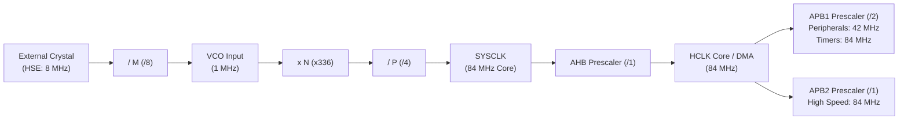
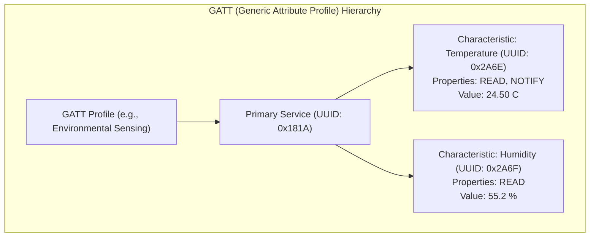

# 06. Modern Microcontrollers - ARM Cortex-M (STM32) & ESP32 (IoT & Wireless)

> **References & Influential Literature:**
> - *Mastering STM32 (2nd Edition)* — Carmine Noviello
> - *The Definitive Guide to ARM Cortex-M3 and Cortex-M4 Processors* — Joseph Yiu
> - *Developing IoT Projects with ESP32 (2nd Edition)* — Vedat Ozan Oner
> - *ESP-IDF Programming Guide* — Espressif Systems
> - *Real-Time Systems: Design Principles for Distributed Embedded Applications* — Hermann Kopetz

---

## 1. The STM32 ARM Cortex-M Ecosystem & CMSIS

STMicroelectronics' **STM32** family dominates industrial automation, robotics, medical devices, and automotive subsystems. Built on ARM Cortex-M0/M3/M4/M7 cores, it implements the **ARM Cortex Microcontroller Software Interface Standard (CMSIS)**.

```
+-------------------------------------------------------------+
|                     APPLICATION LAYER                       |
+-------------------------------------------------------------+
|   STM32Cube HAL (High-Level)    |    STM32 LL (Low-Layer)   |
|   - Maximum hardware portability|    - Zero abstraction overhead|
|   - Heavy RAM/Flash footprint   |    - Direct register bitmasks |
+---------------------------------+---------------------------+
|                          CMSIS-CORE                         |
|   - Standardized core registers (NVIC, SysTick, MPU, SCB)   |
|   - Intrinsic functions (__enable_irq, __NOP, __WFI)        |
+-------------------------------------------------------------+
|                      PHYSICAL HARDWARE                      |
|   ARM Cortex-M Core + STM32 Peripherals (RCC, DMA, Timers)  |
+-------------------------------------------------------------+
```

---

## 2. STM32 Reset & Clock Control (RCC): The Clock Tree

Microcontrollers do not run on a single fixed frequency. Every bus, timer, and peripheral can be dynamically clocked at different rates to balance computational throughput against battery draw.



### 2.1 Phase-Locked Loop (PLL) Mathematics

$$\text{VCO Input Frequency } f_{\text{VCO\_IN}} = \frac{f_{\text{OSC}}}{M}$$

$$\text{VCO Output Frequency } f_{\text{VCO\_OUT}} = f_{\text{VCO\_IN}} \times N$$

$$\text{System Clock } f_{\text{SYSCLK}} = \frac{f_{\text{VCO\_OUT}}}{P} = f_{\text{OSC}} \times \frac{N}{M \times P}$$

#### Industrial Configuration Example (STM32F401 @ 84 MHz):
- Input: External Crystal $f_{\text{HSE}} = 8\text{ MHz}$.
- Set $M = 8 \implies f_{\text{VCO\_IN}} = 1\text{ MHz}$ (must be between $1\text{ and }2\text{ MHz}$).
- Set $N = 336 \implies f_{\text{VCO\_OUT}} = 336\text{ MHz}$ (must be between $100\text{ and }432\text{ MHz}$).
- Set $P = 4 \implies f_{\text{SYSCLK}} = \frac{336}{4} = \mathbf{84\text{ MHz}}$.

---

## 3. High-Throughput ADC Streaming with DMA on STM32

In signal processing and motor control, the CPU cannot afford to trigger ADC reads individually. Using an internal timer to trigger the ADC and routing conversions directly into RAM via **DMA Circular Mode** achieves **zero CPU overhead**:

```c
#include "stm32f4xx_hal.h"

#define ADC_BUFFER_LEN 512
uint16_t adc_dma_buffer[ADC_BUFFER_LEN];

extern ADC_HandleTypeDef hadc1;
extern TIM_HandleTypeDef htim2;

void start_continuous_sampling(void) {
    /*
     * 1. Start Hardware Timer2 at 10 kHz
     * 2. Configure ADC1 to trigger on TIM2 TRGO event
     * 3. Start DMA in CIRCULAR mode: continuously fills adc_dma_buffer
     */
    HAL_TIM_Base_Start(&htim2);
    HAL_ADC_Start_DMA(&hadc1, (uint32_t *)adc_dma_buffer, ADC_BUFFER_LEN);
}

/* Fired by DMA Controller when first 256 samples are ready */
void HAL_ADC_ConvHalfCpltCallback(ADC_HandleTypeDef* hadc) {
    /* Process first half of buffer while DMA fills the second half! */
    process_dsp_filter(&adc_dma_buffer[0], ADC_BUFFER_LEN / 2);
}

/* Fired by DMA Controller when entire buffer is full */
void HAL_ADC_ConvCpltCallback(ADC_HandleTypeDef* hadc) {
    /* Process second half of buffer while DMA wraps around to start */
    process_dsp_filter(&adc_dma_buffer[ADC_BUFFER_LEN / 2], ADC_BUFFER_LEN / 2);
}
```

---

## 4. The ESP32 Architecture & Dual-Core FreeRTOS

Espressif's **ESP32** is an ultra-low-cost, high-performance System-on-Chip integrating 2.4 GHz Wi-Fi and Bluetooth.

```
+-------------------------------------------------------------+
|                     ESP32 SILICON DIE                       |
|                                                             |
|  +---------------------------+  +------------------------+  |
|  | Core 0: PRO_CPU (240 MHz) |  | Core 1: APP_CPU(240MHz)|  |
|  | Runs Wi-Fi / BLE Stacks   |  | Runs User Application  |  |
|  +---------------------------+  +------------------------+  |
|               |                             |               |
|               +--------------+--------------+               |
|                              |                              |
|  +-------------------------------------------------------+  |
|  | 520 KB Internal SRAM (Data + Instructions)            |  |
|  | 448 KB Internal ROM                                   |  |
|  | External SPI Flash / PSRAM (4 MB to 16 MB via QSPI)   |  |
|  +-------------------------------------------------------+  |
|  | Ultra-Low-Power (ULP) Coprocessor (Runs in Deep Sleep)|  |
|  +-------------------------------------------------------+  |
|  | Peripherals: Wi-Fi 802.11b/g/n, BLE 5, Touch, CAN/TWAI|  |
+-------------------------------------------------------------+
```

### 4.1 Symmetric Multiprocessing (SMP) in ESP-IDF
Unlike standard single-core FreeRTOS, the ESP-IDF FreeRTOS port schedules tasks across both cores simultaneously:

```c
#include "freertos/FreeRTOS.h"
#include "freertos/task.h"
#include "esp_log.h"

static const char *TAG = "MULTI_CORE";

void compute_heavy_task(void *pvParameters) {
    while (1) {
        ESP_LOGI(TAG, "Running heavy DSP on Core %d", xPortGetCoreID());
        vTaskDelay(pdMS_TO_TICKS(100));
    }
}

void app_main(void) {
    /* Pin compute task explicitly to Core 1, leaving Core 0 free for Wi-Fi RF */
    xTaskCreatePinnedToCore(
        compute_heavy_task, /* Task function */
        "dsp_worker",       /* Name */
        4096,               /* Stack size (bytes) */
        NULL,               /* Parameters */
        5,                  /* Priority */
        NULL,               /* Task handle */
        1                   /* Core ID: 1 (APP_CPU) */
    );
}
```

---

## 5. Wireless IoT Protocols on ESP32

### 5.1 ESP-NOW: Ultra-Low-Latency Peer-to-Peer Protocol
Standard Wi-Fi requires establishing an Access Point, performing a 4-way handshake, and routing packets through a router, consuming hundreds of milliseconds.
**ESP-NOW** is a connectionless protocol developed by Espressif that uses raw **IEEE 802.11 Action Frames**:
- **Zero Handshake**: Devices communicate immediately upon power-on.
- **Latency**: $< 5\text{ ms}$ round-trip time.
- **Payload**: Up to 250 bytes per packet, encrypted via AES-128.
- **Ideal For**: Battery-operated remote sensor nodes waking up, transmitting readings, and returning to deep sleep within $30\text{ ms}$.

```c
#include "esp_now.h"
#include "esp_wifi.h"

/* Peer MAC address */
static uint8_t peer_mac[6] = { 0x24, 0x0A, 0xC4, 0x12, 0x34, 0x56 };

void send_sensor_data(float temperature, float humidity) {
    uint8_t payload[8];
    memcpy(&payload[0], &temperature, 4);
    memcpy(&payload[4], &humidity, 4);

    esp_err_t result = esp_now_send(peer_mac, payload, sizeof(payload));
    if (result == ESP_OK) {
        ESP_LOGI("ESPNOW", "Packet sent successfully");
    }
}
```

### 5.2 Bluetooth Low Energy (BLE 5.0) Architecture



- **GAP (Generic Access Profile)**: Controls advertising and connections. A peripheral broadcasts **Advertising Packets** every $100\text{ ms}$; a central device (phone) scans and connects.
- **GATT (Generic Attribute Profile)**: Organizes data into **Services** and **Characteristics** identified by 16-bit or 128-bit UUIDs.
- **Notifications**: The server pushes data to the client without the client polling, conserving radio power.

### 5.3 MQTT over mTLS (Cloud IoT Telemetry)
In modern IoT architectures, the ESP32 publishes telemetry to MQTT brokers (AWS IoT Core, HiveMQ, Mosquitto) over a secure TLS 1.3 socket:

```
[ ESP32 Sensor ] ---> MQTT PUBLISH (Topic: "factory/cell1/temp", QoS: 1) ---> [ Cloud Broker ]
                                                                                      |
[ Real-Time Dashboard ] <--- MQTT SUBSCRIBE (Topic: "factory/+/temp") <----------------+
```

---

## 6. Power Management, Deep Sleep & OTA Firmware Updates

### 6.1 ESP32 Deep Sleep Optimization ($10\,\mu\text{A}$ Operation)
In **Deep Sleep Mode**, the CPU cores, digital peripherals, and Wi-Fi/BT baseband are powered off. Only the **RTC (Real-Time Clock) controller**, RTC peripherals, and **8 KB RTC Fast/Slow SRAM** remain powered:

```c
#include "esp_sleep.h"

#define TIME_TO_SLEEP_SEC 60
RTC_DATA_ATTR static int boot_counter = 0; /* Persists across deep sleep cycles in RTC RAM! */

void app_main(void) {
    boot_counter++;
    ESP_LOGI("PWR", "Boot count: %d. Reading sensors...", boot_counter);

    /* Take sensor reading, publish via MQTT/ESP-NOW (takes ~150 ms) */
    read_and_transmit_telemetry();

    /* Configure timer wakeup: 60 seconds */
    esp_sleep_enable_timer_wakeup(TIME_TO_SLEEP_SEC * 1000000ULL);
    
    ESP_LOGI("PWR", "Entering deep sleep (10 uA draw)...");
    esp_deep_sleep_start();
    /* Execution NEVER passes this line! Device resets on wake. */
}
```

### 6.2 Over-The-Air (OTA) Dual-Partition Architecture
To prevent "bricking" field devices during firmware upgrades, the flash is partitioned into two application slots:

```
+-------------------------------------------------------------+
|                      FLASH MEMORY MAP                       |
|  [Bootloader]  [Partition Table]  [NVS Key-Value Storage]   |
|  [ota_0 (Active App: v1.0.0)]     [ota_1 (Target Slot)]     |
|  [ota_data (Points to active boot partition)]               |
+-------------------------------------------------------------+
```

1. Device boots and runs firmware from `ota_0`.
2. New firmware image is downloaded over HTTPS and written to `ota_1`.
3. Firmware validates cryptographic SHA-256 hash and ECDSA signature.
4. `ota_data` flag is updated to point to `ota_1`, and MCU reboots.
5. **Automated Rollback (Self-Test)**: The new firmware must explicitly call `esp_ota_mark_app_valid_cancel_rollback()`. If the new firmware crashes or panics before executing this call, the bootloader automatically reverts to `ota_0` on the next reboot!
