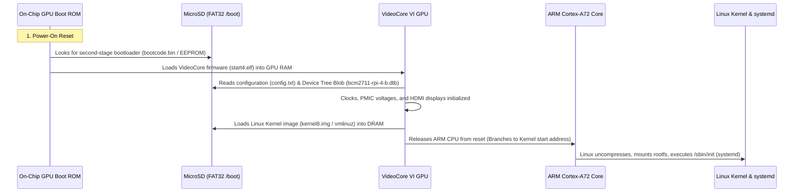
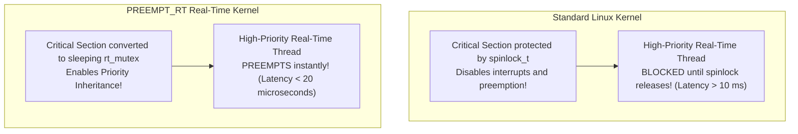

# 07. Single Board Computers - Raspberry Pi, Embedded Linux & Interfacing

> **References & Influential Literature:**
> - *Exploring Raspberry Pi: Architecture, Software, Hardware, and Interfacing* — Derek Molloy
> - *Embedded Linux Primer: A Practical Real-World Approach (2nd Edition)* — Christopher Hallinan
> - *Building Embedded Linux Systems* — Karim Yaghmour et al.
> - *Linux Device Drivers (3rd Edition)* — Jonathan Corbet, Alessandro Rubini, Greg Kroah-Hartman

---

## 1. Raspberry Pi Hardware Architecture & Broadcom SoC

The **Raspberry Pi 4 Model B** is a full Single Board Computer (SBC) built around the **Broadcom BCM2711**, a 64-bit quad-core application processor running at $1.8\text{ GHz}$.

```
+-------------------------------------------------------------+
|                BROADCOM BCM2711 SYSTEM-ON-CHIP              |
|                                                             |
|  +-------------------------------------------------------+  |
|  | Quad-Core ARM Cortex-A72 CPU Core Cluster (1.8 GHz)   |  |
|  | ARMv8-A 64-bit Architecture, MMU, 1 MB L2 Cache       |  |
|  +-------------------------------------------------------+  |
|                             |                               |
|                     High-Speed AXI Bus                      |
|                             v                               |
|  +-------------------------------------------------------+  |
|  | VideoCore VI 3D GPU (Runs Initial Stage Bootloader)   |  |
|  | Hardware 4Kp60 HEVC/H.265 & H.264 Video Decoders      |  |
|  +-------------------------------------------------------+  |
|                             |                               |
|  +-------------------------------------------------------+  |
|  | LPDDR4 Memory Controller (2 GB / 4 GB / 8 GB RAM)     |  |
|  | PCIe 2.0 x1 Lane (Connected to VIA VL805 USB 3.0 Hub) |  |
|  | Broadcom Gigabit Ethernet PHY (True 1000BASE-T)       |  |
|  | MIPI CSI (Camera) & MIPI DSI (Display) Serial Ports   |  |
|  | 40-Pin Low-Speed Peripheral Header (GPIO, I2C, SPI)   |  |
|  +-------------------------------------------------------+  |
+-------------------------------------------------------------+
```

### 1.1 The 40-Pin GPIO Header & Electrical Ratings
The 40-pin header exposes power, ground, and multi-function GPIO lines:
- **Voltage Levels**: All digital I/O pins operate strictly at **$3.3\text{ V}$**.
- **NOT 5V Tolerant**: Applying $5\text{ V}$ directly from an Arduino or sensor into a Raspberry Pi GPIO pin will destroy the Broadcom SoC silicon! Use bidirectional logic level shifters (e.g., BSS138).
- **Drive Strength**: Configurable in kernel from $2\text{ mA}$ to $16\text{ mA}$ (default $\approx 8\text{ mA}$).
- **Hardware Pin Multiplexing**: Pins can be dynamically routed to internal hardware blocks (**ALT0** through **ALT5**) for hardware SPI, I2C, UART, or PWM.

---

## 2. Embedded Linux Boot Sequence & Device Tree

The boot process of a Raspberry Pi differs radically from an x86 PC (which uses BIOS/UEFI) or a microcontroller (which executes from Flash address `0x0000_0000`). On the Pi, **the GPU boots first**!



### 2.1 The Linux Device Tree (`.dts` and `.dtb`)
In embedded Linux, hardware is not auto-discoverable via PCI buses. The **Device Tree** is a hardware description file compiled into a binary (`.dtb`) passed to the kernel at boot:
- Informs the Linux kernel about peripheral base addresses, interrupt lines, and pin assignments.
- Configured dynamically via **Device Tree Overlays (`.dtbo`)** in `/boot/config.txt`:
  ```ini
  # File: /boot/config.txt
  dtparam=i2c_arm=on          # Enables /dev/i2c-1
  dtparam=spi=on              # Enables /dev/spidev0.0 and /dev/spidev0.1
  dtoverlay=pwm-2chan,pin=12,func=4,pin2=13,func2=4 # Routes hardware PWM to GPIO 12 & 13
  dtoverlay=w1-gpio,gpiopin=4 # Enables 1-Wire protocol for DS18B20 on GPIO 4
  ```

---

## 3. Modern Linux Hardware Interfacing: `libgpiod`

Historically, embedded Linux code manipulated GPIOs via the `/sys/class/gpio` virtual filesystem. The Linux kernel community **deprecated `/sys/class/gpio`** due to severe limitations:
1. Every pin change required opening, formatting strings, writing, and closing file descriptors (`fork`/`open`/`write` overhead).
2. It lacked hardware timestamps on input edge changes.
3. It provided no ownership locks, allowing conflicting processes to overwrite pins.

### 3.1 The Modern Character Device API (`/dev/gpiochip*`)
The modern standard interfaces with GPIO through the **character device API (`/dev/gpiochip0` to `/dev/gpiochip4`)** using the high-performance **`libgpiod`** C library and Python bindings.

#### High-Performance C Implementation with `libgpiod`:

```c
/* Compile: gcc -o blink_gpiod blink_gpiod.c -lgpiod */
#include <gpiod.h>
#include <stdio.h>
#include <unistd.h>

#define CHIP_NAME   "gpiochip0" /* Main BCM2711 GPIO controller */
#define GPIO_PIN    17          /* BCM GPIO 17 (Pin 11 on header) */

int main(void) {
    struct gpiod_chip *chip;
    struct gpiod_line *line;
    int val = 0;

    /* 1. Open the GPIO controller character device */
    chip = gpiod_chip_open_by_name(CHIP_NAME);
    if (!chip) {
        perror("Failed to open GPIO chip");
        return 1;
    }

    /* 2. Claim the line */
    line = gpiod_chip_get_line(chip, GPIO_PIN);
    if (!line) {
        perror("Failed to get GPIO line");
        gpiod_chip_close(chip);
        return 1;
    }

    /* 3. Request line as output with consumer tag */
    if (gpiod_line_request_output(line, "blink_daemon", 0) < 0) {
        perror("Failed to request line output");
        gpiod_chip_close(chip);
        return 1;
    }

    /* 4. High-speed toggle loop */
    printf("Toggling GPIO 17 using modern libgpiod...\n");
    for (int i = 0; i < 20; i++) {
        val = !val;
        gpiod_line_set_value(line, val);
        usleep(100000); /* 100 ms */
    }

    /* 5. Release hardware resources cleanly */
    gpiod_line_release(line);
    gpiod_chip_close(chip);
    return 0;
}
```

---

## 4. Production Python Hardware Drivers on Linux

For rapid prototyping and edge cloud connectivity, Python leverages native C-extensions (`gpiod`, `smbus2`, `spidev`):

```python
#!/usr/bin/env python3
"""
Production Edge Sensor Acquisition Script
Interfaces I2C Sensor (BME280) and GPIO Event Monitoring
"""
import gpiod
import smbus2
import time

# 1. Initialize I2C Bus 1 (/dev/i2c-1)
i2c_bus = smbus2.SMBus(1)
BME280_I2C_ADDR = 0x76

def read_sensor_raw():
    # Read 6 contiguous burst bytes starting at register 0xF7
    data = i2c_bus.read_i2c_block_data(BME280_I2C_ADDR, 0xF7, 6)
    raw_press = (data[0] << 12) | (data[1] << 4) | (data[2] >> 4)
    raw_temp  = (data[3] << 12) | (data[4] << 4) | (data[5] >> 4)
    return raw_temp, raw_press

# 2. Asynchronous Hardware Interrupts using libgpiod
chip = gpiod.Chip('gpiochip0')
button_line = chip.get_line(27) # BCM 27 (Input Button)

# Configure hardware edge detection with debounce pull-up
button_line.request(
    consumer="emergency_stop",
    type=gpiod.LINE_REQ_EV_FALLING_EDGE,
    flags=gpiod.LINE_REQ_FLAG_BIAS_PULL_UP
)

print("Monitoring hardware events with kernel microsecond timestamps...")
while True:
    # Blocks in kernel epoll until physical button edge occurs (zero CPU load!)
    if button_line.event_wait(nsec=100_000_000): # 100ms timeout
        event = button_line.event_read()
        print(f"[ALERT] Emergency Stop Triggered at: {event.sec}s {event.nsec}ns")
        temp, press = read_sensor_raw()
        print(f"Current Raw Temp: {raw_temp}, Pressure: {raw_press}")
```

---

## 5. Edge AI & Computer Vision: MIPI-CSI & Tensor Lite

Unlike microcontrollers that struggle to execute convolutional neural networks (CNNs), the Raspberry Pi 4 possesses sufficient memory bandwidth and NEON vector SIMD extensions to execute real-time computer vision inference:

```
[ MIPI-CSI Camera ] ---> VideoCore Hardware ISP ---> V4L2 Buffer (/dev/video0)
                                                          |
[ OpenCV Frame Capture ] <--------------------------------+
        |
[ Quantized INT8 MobileNet / YOLOv8 ] ---> Edge Inference in 25-40 ms (25 FPS)
```

```python
import cv2
import numpy as np

# Capture hardware video stream directly via Video4Linux2 (V4L2)
cap = cv2.VideoCapture(0)
cap.set(cv2.CAP_PROP_FRAME_WIDTH, 640)
cap.set(cv2.CAP_PROP_FRAME_HEIGHT, 480)

while cap.isOpened():
    ret, frame = cap.read()
    if not ret: break

    # Convert frame for Edge AI inference
    input_blob = cv2.dnn.blobFromImage(frame, 1.0/127.5, (300, 300), (127.5, 127.5, 127.5), swapRB=True)
    
    # Process detected bounding boxes...
    cv2.imshow('Industrial Edge Vision', frame)
    if cv2.waitKey(1) == 27: break

cap.release()
cv2.destroyAllWindows()
```

---

## 6. Real-Time Linux with `PREEMPT_RT`

Standard Linux is a general-purpose, throughput-optimized OS. It is **non-deterministic**:
- Kernel spinlocks disable preemption, delaying time-critical user processes.
- Page faults and the Completely Fair Scheduler (CFS) introduce latency spikes exceeding **$10\text{ to }50\text{ milliseconds}$**.

For hard real-time control (e.g., flight controllers, industrial robotics, CNC machines), the Linux kernel must be compiled with the **`PREEMPT_RT` patch**.



### 6.1 `PREEMPT_RT` Key Transformations
1. **Sleeping Locks**: Spinlocks (`spinlock_t`) are transformed into sleeping mutexes with **Priority Inheritance**, preventing unbounded Priority Inversion.
2. **Threaded Interrupt Handlers**: Hardware IRQ handlers do not execute in raw interrupt context; they are converted into individual kernel threads (`[irq/86-mmc0]`) whose scheduling priorities can be managed via `chrt`.
3. **High-Resolution Timers (`hrtimers`)**: Provides sub-microsecond timer resolution.

### 6.2 Latency Verification with `cyclictest`
```bash
# Run real-time latency verification on isolated CPU core 3
sudo cyclictest -m -p 98 -t 1 -a 3 -h 100 -i 1000 -l 1000000
```
- **Standard Linux Kernel**: Max latency spikes $\approx 12,000\,\mu\text{s}$ ($12\text{ ms}$).
- **Linux with `PREEMPT_RT`**: Max latency bounded deterministically at $< \mathbf{25\,\mu\text{s}}$!
