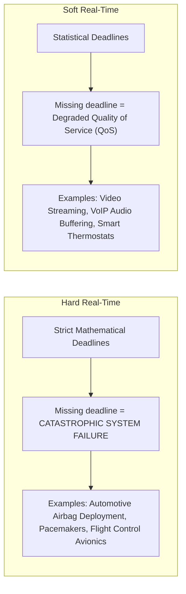
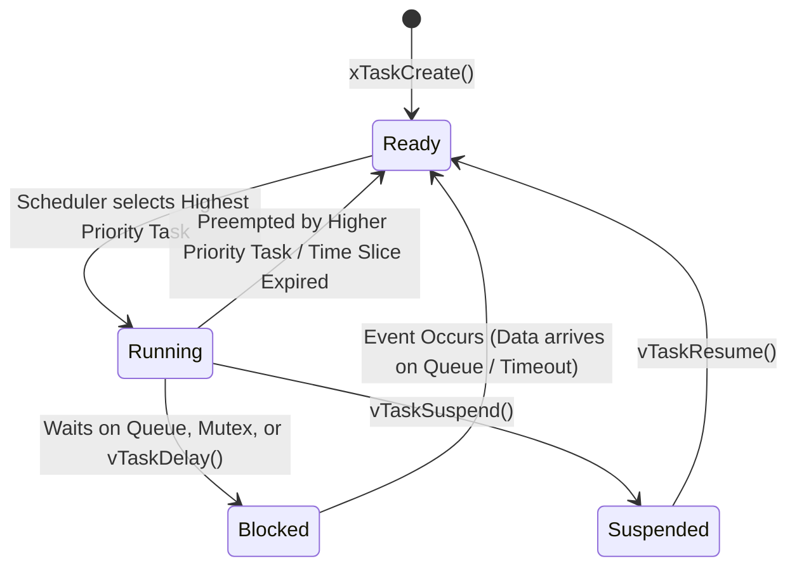
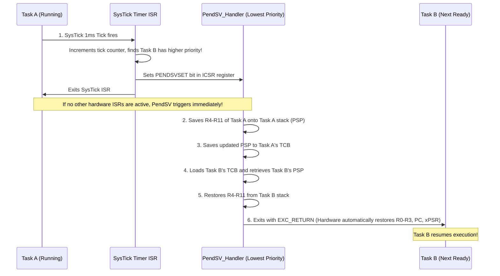
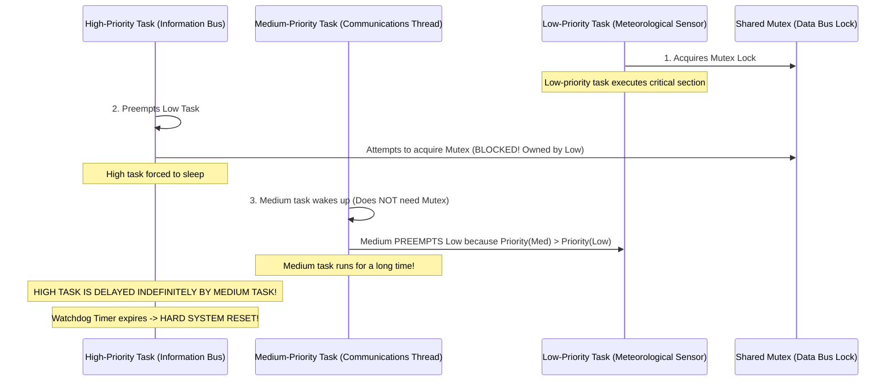

# 08. Real-Time Operating Systems (RTOS) - FreeRTOS & Zephyr

> **References & Influential Literature:**
> - *Real-Time Operating Systems for ARM Cortex-M Microcontrollers* (Vol 3) — Jonathan W. Valvano
> - *Mastering the FreeRTOS Real Time Kernel* — Richard Barry (AWS FreeRTOS Founder)
> - *Real-Time Systems: Design Principles for Distributed Embedded Applications* — Hermann Kopetz
> - *Zephyr Project Documentation & Architectural Blueprint* — The Linux Foundation

---

## 1. What Makes an Operating System "Real-Time"?

The term **Real-Time** does not mean "fast"; it means **deterministic**. In a real-time system, the correctness of a computation depends not only on its logical result, but also on the **exact instant in time at which the result is delivered**.



---

## 2. RTOS Kernel Mechanics: Tasks, TCB & Context Switching

In FreeRTOS, a running application is decomposed into independent threads of execution called **Tasks**. Each task operates in its own infinite loop and believes it has exclusive ownership of the CPU core.

```
+-------------------------------------------------------------+
|                 TASK CONTROL BLOCK (TCB)                    |
|                                                             |
|  *pxTopOfStack    : Points to current top of task stack RAM |
|  xStateListItem   : Node linking task into Ready/Blocked List|
|  uxPriority       : Task priority (0 = Lowest, configMAX-1) |
|  *pxStack         : Base address of allocated task stack    |
|  pcTaskName[16]   : Descriptive human-readable string tag  |
+-------------------------------------------------------------+
```

### 2.1 The Task State Machine



### 2.2 ARM Cortex-M Context Switching via PendSV
Context switching cannot be executed inside a standard high-priority interrupt because doing so would delay urgent hardware ISRs. Instead, ARM Cortex-M delegates context switching to the **PendSV (Pendable Service Call)** exception, which is configured to the **absolute lowest NVIC priority** (`0xFF`).



#### Production Context Switch Assembly (`PendSV_Handler`):
```assembly
.thumb_func
.type PendSV_Handler, %function
PendSV_Handler:
    /* 1. Get current Process Stack Pointer (PSP) */
    mrs     r0, psp
    isb

    /* 2. Save software context (registers R4-R11) onto Task A's stack */
    stmdb   r0!, {r4-r11}

    /* 3. Save updated stack pointer into current task's TCB */
    ldr     r1, =pxCurrentTCB
    ldr     r2, [r1]            /* r2 = pxCurrentTCB pointer */
    str     r0, [r2]            /* First member of TCB is pxTopOfStack */

    /* 4. Call FreeRTOS C scheduler function to pick next ready task */
    push    {r14}
    cpsid   i                   /* Disable interrupts during scheduling */
    bl      vTaskSwitchContext
    cpsie   i                   /* Re-enable interrupts */
    pop     {r14}

    /* 5. Retrieve new task's TCB and load its Stack Pointer */
    ldr     r1, =pxCurrentTCB
    ldr     r2, [r1]
    ldr     r0, [r2]            /* r0 = new task pxTopOfStack */

    /* 6. Restore software context (registers R4-R11) of new task */
    ldmia   r0!, {r4-r11}

    /* 7. Update PSP with new task's stack address */
    msr     psp, r0
    isb

    /* 8. Return from exception using EXC_RETURN (0xFFFFFFFD) */
    /* Hardware automatically pops R0-R3, R12, LR, PC, and xPSR from PSP */
    bx      r14
```

---

## 3. Real-Time Scheduling Theory

### 3.1 Rate Monotonic Scheduling (RMS)
In fixed-priority preemptive scheduling, **Rate Monotonic Scheduling (RMS)** is mathematically proven to be the optimal static priority assignment algorithm:
$$\text{Rule: The shorter the task period } T_i \text{, the HIGHER its static priority } P_i$$

#### Liu & Layland Schedulability Bound (1973):
For a set of $n$ periodic tasks with computation times $C_i$ and periods $T_i$, the total CPU utilization $U$ is schedulable under RMS if:

$$U = \sum_{i=1}^{n} \frac{C_i}{T_i} \le n \left(2^{1/n} - 1\right)$$

$$\lim_{n \to \infty} n \left(2^{1/n} - 1\right) = \ln(2) \approx 69.3\%$$

> If total CPU utilization is below **$69.3\%$**, all task deadlines are mathematically guaranteed to be met under all operating conditions!

---

## 4. Concurrency Primitives & The Priority Inversion Crisis

### 4.1 The Mars Pathfinder Anomaly (1997)
On July 4, 1997, NASA's Mars Pathfinder spacecraft landed on Mars. A few days in, the spacecraft began experiencing total system resets. The root cause was classic **Priority Inversion** in the VxWorks RTOS:



### 4.2 The Solution: Priority Inheritance Protocol (PIP)
FreeRTOS mutexes solve this using **Priority Inheritance**:
- When the High-Priority task blocks waiting for a mutex held by the Low-Priority task, the kernel **temporarily boosts the priority of the Low-Priority task to match the High-Priority task**.
- The Medium-Priority task can no longer preempt the Low task!
- The Low task quickly finishes its critical section, releases the mutex, its priority is restored to Low, and the High-Priority task immediately acquires the mutex and runs.

```c
#include "FreeRTOS.h"
#include "semphr.h"

SemaphoreHandle_t xBusMutex;

void vHighPriorityTask(void *pvParameters) {
    while (1) {
        /* Take mutex with 100ms timeout */
        if (xSemaphoreTake(xBusMutex, pdMS_TO_TICKS(100)) == pdTRUE) {
            /* Access shared hardware bus safely */
            transmit_telemetry();
            xSemaphoreGive(xBusMutex); /* Priority automatically restored */
        }
        vTaskDelay(pdMS_TO_TICKS(10));
    }
}
```

---

## 5. FreeRTOS Queues & Direct Task Notifications

### 5.1 FreeRTOS Queues (By-Copy Semantics)
Queues are the primary thread-safe communication primitive between tasks and ISRs:
- Data is transferred **by copy**, not by reference (prevents data races where the sender modifies a buffer while the receiver is reading it).

```c
/* Structure transmitted over Queue */
typedef struct {
    uint8_t sensor_id;
    float reading;
} SensorMsg_t;

QueueHandle_t xSensorQueue;

/* ISR Posting to Queue */
void EXTI0_IRQHandler(void) {
    BaseType_t xHigherPriorityTaskWoken = pdFALSE;
    SensorMsg_t msg = { .sensor_id = 1, .reading = 42.5f };

    /* Post from ISR context safely */
    xQueueSendFromISR(xSensorQueue, &msg, &xHigherPriorityTaskWoken);

    /* If sending woke up a higher-priority task, switch immediately! */
    portYIELD_FROM_ISR(xHigherPriorityTaskWoken);
}
```

### 5.2 Direct-to-Task Notifications (Lightweight Signaling)
Direct-to-task notifications send events directly into a target task's TCB without allocating a separate FreeRTOS queue or semaphore object:
- **$45\%$ faster** execution time than a binary semaphore.
- Consumes **zero additional bytes of RAM**.

```c
TaskHandle_t xDataProcessingTaskHandle;

/* ISR unblocks worker task directly */
void DMA1_Stream0_IRQHandler(void) {
    BaseType_t xHigherPriorityTaskWoken = pdFALSE;
    vTaskNotifyGiveFromISR(xDataProcessingTaskHandle, &xHigherPriorityTaskWoken);
    portYIELD_FROM_ISR(xHigherPriorityTaskWoken);
}

/* Worker Task waiting for hardware notification */
void vDataProcessingTask(void *pvParameters) {
    while (1) {
        /* Sleep until notified by DMA ISR (Zero CPU overhead) */
        ulTaskNotifyTake(pdTRUE, portMAX_DELAY);
        process_dma_buffer();
    }
}
```

---

## 6. Memory Management Schemes & Stack Safety

Dynamic memory (`malloc`/`free`) in embedded systems is notorious for causing **Heap Fragmentation**, where scattered small allocations prevent large contiguous blocks from being allocated, eventually crashing the system.

### 6.1 FreeRTOS Memory Allocation Strategies: `heap_1` to `heap_5`
- **`heap_1.c`**: Allocate-only. Memory cannot be freed (`vPortFree` does nothing). Ideal for safety-critical systems where tasks and queues are created once at boot and never deleted.
- **`heap_2.c`**: Best-fit algorithm without block coalescing. Susceptible to fragmentation.
- **`heap_3.c`**: Simple thread-safe wrapper around compiler standard `malloc()` and `free()`.
- **`heap_4.c` (Industry Standard)**: First-fit algorithm with **automatic coalescing of adjacent free blocks**. Minimizes fragmentation.
- **`heap_5.c`**: Identical to `heap_4`, but can span multiple non-contiguous memory regions (e.g., internal SRAM + external SPI PSRAM).

### 6.2 Stack Overflow Detection Hooks
Every task has a dedicated stack. To detect stack exhaustion:

```c
/* Enable in FreeRTOSConfig.h: #define configCHECK_FOR_STACK_OVERFLOW 2 */
/* Fills stack with 0xA5 at creation; checks last 16 bytes for overwrite */
void vApplicationStackOverflowHook(TaskHandle_t xTask, char *pcTaskName) {
    /* Trap processor and log fatal fault */
    printf("[FATAL] Stack Overflow in Task: %s\n", pcTaskName);
    __asm__ volatile ("cpsid i");
    while (1);
}
```

---

## 7. Next-Generation RTOS: Zephyr Project

Sponsored by the Linux Foundation, **Zephyr RTOS** is a modular, secure, microkernel-based real-time operating system designed for resource-constrained connected IoT devices.

```
+-------------------------------------------------------------+
|                      ZEPHYR ARCHITECTURE                    |
|                                                             |
|  Application Code (C / C++)                                 |
+-------------------------------------------------------------+
|  Subsystems: BLE Stack (Host + Controller), IPv4/IPv6, LwM2M|
+-------------------------------------------------------------+
|  Zephyr OS Kernel (Preemptive, EDF, POSIX Threads API)      |
+-------------------------------------------------------------+
|  Hardware Models: Defined by Linux-style DeviceTree (.dts)  |
|  Configuration System: Kconfig (CONFIG_BT=y, CONFIG_I2C=y) |
+-------------------------------------------------------------+
|  Hardware Drivers: Zephyr Driver Model (UART, SPI, Flash)   |
+-------------------------------------------------------------+
```

### Key Differences Between FreeRTOS and Zephyr:
1. **Hardware Definition**: FreeRTOS uses vendor header files (`stm32f4xx.h`); Zephyr uses **Linux-standard DeviceTree (`.dts`)**, ensuring drivers remain 100% agnostic of silicon vendor.
2. **Configuration**: Zephyr uses the Linux kernel's **Kconfig** build system, allowing fine-grained toggling of every module and cryptographic algorithm.
3. **Connectivity**: Zephyr includes a certified, open-source Bluetooth Low Energy (BLE) controller and IPv6/OpenThread network stack out-of-the-box.
