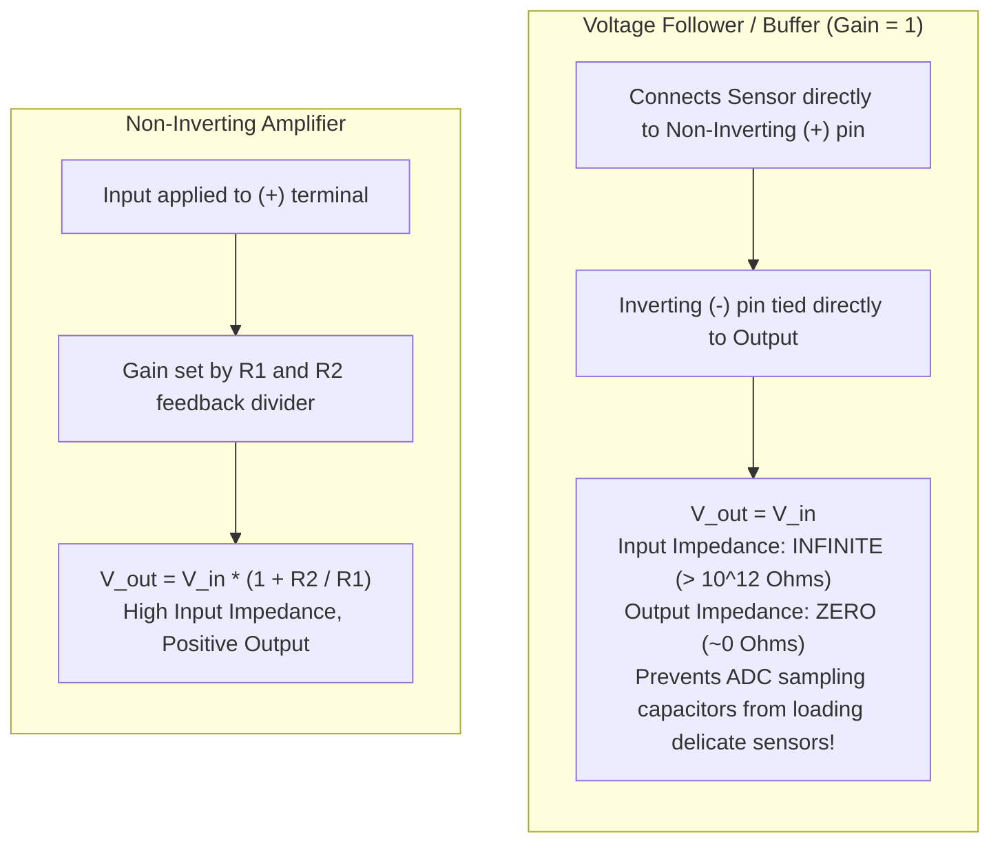
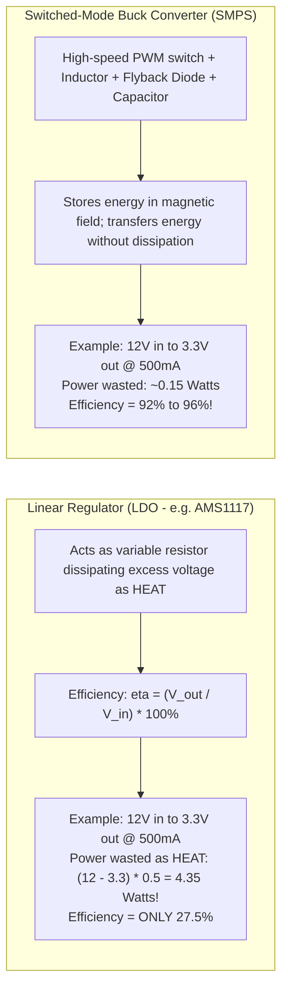

# 09. Sensors, Actuators & Power Electronics Interfacing

> **References & Influential Literature:**
> - *The Art of Electronics (3rd Edition)* — Paul Horowitz & Winfield Hill
> - *Operational Amplifiers & Linear Integrated Circuits (6th Edition)* — Robert F. Coughlin & Frederick F. Driscoll
> - *Embedded Systems: Real-Time Interfacing to ARM Cortex-M Microcontrollers* — Jonathan W. Valvano
> - *Power Electronics: Converters, Applications, and Design* — Ned Mohan, Tore M. Undeland, William P. Robbins

---

## 1. Analog Signal Conditioning & Operational Amplifiers (Op-Amps)

Real-world physical sensors output signals that cannot be wired directly to a microcontroller ADC:
- A thermocouple outputs microvolts ($\mu\text{V}$).
- A piezoelectric pressure transducer has an output impedance of millions of ohms ($> 10\text{ M}\Omega$).
- A current sense resistor outputs small differential voltages on a high-voltage rail.

An **Operational Amplifier (Op-Amp)** is an active circuit building block providing amplification, impedance buffering, and analog filtering.

```
       +Vcc (e.g. 5V)
         |
       +---+
In- ---| - |
       |   |---- Output (Vout)
In+ ---| + |
       +---+
         |
       -Vee (GND or -5V)
```

### 1.1 The Two Golden Rules of Ideal Op-Amps (with Negative Feedback)
1. **Zero Input Current**: The input impedance of the inverting ($-$) and non-inverting ($+$) pins is infinite; no current flows into or out of the input terminals:
   $$I_+ = I_- = 0$$
2. **Virtual Short Circuit**: The op-amp output will do whatever is necessary to make the voltage difference between the two inputs zero:
   $$V_+ = V_-$$

---

### 1.2 Essential Op-Amp Circuit Topologies



### 1.3 The Instrumentation Amplifier (In-Amp)
When reading Wheatstone strain gauges, load cells, or biomedical ECG leads, the desired sensor signal is a tiny differential voltage ($1\text{ to }10\text{ mV}$) riding on top of a massive $60\text{ Hz}$ common-mode noise voltage ($> 2\text{ V}$).

```
Sensor (+) ---> [ Buffer A1 ] --+
                                 +--> [ Differential Amp A3 ] ---> V_out
Sensor (-) ---> [ Buffer A2 ] --+
```

An **Instrumentation Amplifier (e.g., AD620 / INA128)** combines three op-amps with precision laser-trimmed internal resistors to achieve a **Common-Mode Rejection Ratio (CMRR) exceeding $100\text{ dB}$**, amplifying only the differential signal while rejecting common-mode noise by a factor of $100,000:1$.

---

## 2. Sensor Fusion: IMU Orientation & Madgwick Filter

A 6-DOF Inertial Measurement Unit (IMU) provides 3-axis accelerometer readings ($a_x, a_y, a_z$) and 3-axis gyroscope angular velocities ($\omega_x, \omega_y, \omega_z$).

### 2.1 Why Raw Sensors Fail
- **Accelerometer**: Measures gravitational acceleration vector. Perfect for calculating static tilt ($\text{roll} = \text{atan2}(a_y, a_z)$), but highly corruptible by dynamic linear motion and motor vibrations.
- **Gyroscope**: Integrates angular velocity over time ($\theta = \int \omega \, dt$). Extremely accurate over short time horizons, but accumulates integration bias and **drifts indefinitely**.

### 2.2 The Madgwick Gradient Descent Filter
Invented by Sebastian Madgwick in 2010, this algorithm represents orientation as a **Quaternion** ($q = [q_0, q_1, q_2, q_3]$):
1. Numerically integrates gyroscope angular rates.
2. Formulates an objective function comparing the measured gravity direction against the theoretical gravity vector.
3. Computes the Jacobian matrix and performs a single-step **Gradient Descent** to correct the gyroscope drift using accelerometer data.
4. Computationally lightweight: Can execute at $> 500\text{ Hz}$ on an ARM Cortex-M4 microcontroller!

```c
#include <math.h>

/* Quaternion state vector */
float q0 = 1.0f, q1 = 0.0f, q2 = 0.0f, q3 = 0.0f;
#define beta 0.041f /* Filter gain representing gyro measurement error */

void MadgwickAHRSupdateIMU(float gx, float gy, float gz, float ax, float ay, float az, float dt) {
    float recipNorm;
    float s0, s1, s2, s3;
    float qDot1, qDot2, qDot3, qDot4;
    float _2q0, _2q1, _2q2, _2q3, _4q0, _4q1, _4q2, _8q1, _8q2, q0q0, q1q1, q2q2, q3q3;

    /* Rate of change of quaternion from gyroscope */
    qDot1 = 0.5f * (-q1 * gx - q2 * gy - q3 * gz);
    qDot2 = 0.5f * ( q0 * gx + q2 * gz - q3 * gy);
    qDot3 = 0.5f * ( q0 * gy - q1 * gz + q3 * gx);
    qDot4 = 0.5f * ( q0 * gz + q1 * gy - q2 * gx);

    /* Normalize accelerometer measurement */
    if (!((ax == 0.0f) && (ay == 0.0f) && (az == 0.0f))) {
        recipNorm = 1.0f / sqrtf(ax * ax + ay * ay + az * az);
        ax *= recipNorm; ay *= recipNorm; az *= recipNorm;

        /* Auxiliary variables to avoid repeated arithmetic */
        _2q0 = 2.0f * q0; _2q1 = 2.0f * q1; _2q2 = 2.0f * q2; _2q3 = 2.0f * q3;
        _4q0 = 4.0f * q0; _4q1 = 4.0f * q1; _4q2 = 4.0f * q2;
        _8q1 = 8.0f * q1; _8q2 = 8.0f * q2;
        q0q0 = q0 * q0;   q1q1 = q1 * q1;   q2q2 = q2 * q2;   q3q3 = q3 * q3;

        /* Gradient descent algorithm corrective step */
        s0 = _4q0 * q2q2 + _2q2 * ax + _4q0 * q1q1 - _2q1 * ay;
        s1 = _4q1 * q3q3 - _2q3 * ax + 4.0f * q0q0 * q1 - _2q0 * ay - _4q1 + _8q1 * q1q1 + _8q1 * q2q2 + _4q1 * az;
        s2 = 4.0f * q0q0 * q2 + _2q0 * ax + _4q2 * q3q3 - _2q3 * ay - _4q2 + _8q2 * q1q1 + _8q2 * q2q2 + _4q2 * az;
        s3 = 4.0f * q1q1 * q3 - _2q1 * ax + 4.0f * q2q2 * q3 - _2q2 * ay;

        recipNorm = 1.0f / sqrtf(s0 * s0 + s1 * s1 + s2 * s2 + s3 * s3);
        s0 *= recipNorm; s1 *= recipNorm; s2 *= recipNorm; s3 *= recipNorm;

        /* Apply feedback step */
        qDot1 -= beta * s0;
        qDot2 -= beta * s1;
        qDot3 -= beta * s2;
        qDot4 -= beta * s3;
    }

    /* Integrate rate of change of quaternion */
    q0 += qDot1 * dt; q1 += qDot2 * dt; q2 += qDot3 * dt; q3 += qDot4 * dt;

    /* Normalize quaternion */
    recipNorm = 1.0f / sqrtf(q0 * q0 + q1 * q1 + q2 * q2 + q3 * q3);
    q0 *= recipNorm; q1 *= recipNorm; q2 *= recipNorm; q3 *= recipNorm;
}
```

---

## 3. Power Switching: Transistors & MOSFET Gate Driving

When switching large loads (solenoids, heaters, high-current LED strips), an electromechanical relay is often too slow and wears out mechanically. Semiconductor switches offer infinite operational lifespans and megahertz switching speeds.

### 3.1 BJT vs. Logic-Level N-Channel MOSFET

| Parameter | BJT (e.g. 2N2222, TIP120) | Logic-Level MOSFET (e.g. IRLZ44N) |
| :--- | :--- | :--- |
| **Control Mechanism** | **Current-Controlled** ($I_c = \beta \cdot I_b$) | **Voltage-Controlled** ($V_{gs}$ creates electric field) |
| **Gate/Base Current** | Continuous base current required ($10\text{ to }50\text{ mA}$) | Static gate current $\approx 0\text{ A}$ (Leakage only) |
| **On-State Voltage Drop** | Saturation voltage $V_{ce(\text{sat})} \approx 0.2\text{ to }1.5\text{ V}$ | Pure resistance $R_{ds(\text{on})} \approx 0.005\text{ to }0.02\,\Omega$ |
| **Power Dissipation ($10\text{ A}$)** | $P = V_{ce} \times I = 1.0\text{ V} \times 10\text{ A} = \mathbf{10\text{ Watts!}}$ | $P = I^2 \times R_{ds} = 100 \times 0.01\,\Omega = \mathbf{1\text{ Watt!}}$ |

```
+24V High-Power Load Rail
        |
      [LOAD] (e.g. 10A Solenoid or Heater)
        |
      Drain (D)
MCU Pin --- [ Rg: 100 Ohm ] ---> Gate (G)   [Logic-Level N-MOSFET]
                                Source (S)
                                  |
                                 GND
```

### 3.2 Gate Capacitance & The Gate Resistor ($R_g$)
Although a MOSFET draws zero DC gate current, its physical structure forms a parallel-plate capacitor: the **Input Gate Capacitance ($C_{iss} = C_{gs} + C_{gd} \approx 1000\text{ to }3000\text{ pF}$)**.
- At the exact microsecond the MCU pin switches from $0\text{ V}$ to $3.3\text{ V}$, the uncharged gate capacitor acts as an **instantaneous short-circuit to Ground**!
- If connected directly without a resistor, an inrush current of $> 150\text{ mA}$ surges out of the MCU pin, damaging the internal silicon output buffer.

$$\text{Minimum Gate Resistor } R_g = \frac{V_{\text{pin}}}{I_{\max\_pin}} = \frac{3.3\text{ V}}{0.025\text{ A}} \approx 132\,\Omega \implies \mathbf{150\,\Omega\text{ standard}}$$

---

## 4. Motor Drive Topologies: The H-Bridge & Dead-Time Insertion

To rotate a DC motor bidirectionally, current must flow in either direction through the armature coils. An **H-Bridge** arranges four MOSFET switches around the motor.

```
       +V_motor (e.g. 24V)
           |
     +-----+-----+
     |           |
    [Q1]        [Q3]  (High-Side Switches: P-FETs or N-FETs with bootstrap)
     |     M     |
     +---( O )---+
     |     |     |
    [Q2]        [Q4]  (Low-Side Switches: N-FETs)
     |           |
     +-----+-----+
           |
          GND
```

### 4.1 H-Bridge Operational States
- **Forward Rotation**: Turn ON **Q1** and **Q4** (Current flows Left $\to$ Right).
- **Reverse Rotation**: Turn ON **Q3** and **Q2** (Current flows Right $\to$ Left).
- **Dynamic Braking**: Turn ON **Q2** and **Q4** (Shorts motor armature to GND; back-EMF creates immediate electromagnetic braking torque).
- **Freewheeling / Coasting**: Turn OFF all switches (Armature current recirculates through body diodes).

### 4.2 The Shoot-Through Fault & Dead-Time Insertion
If **Q1** (High-side) and **Q2** (Low-side) are turned ON simultaneously even for a few nanoseconds, a direct short-circuit from $+V_{\text{motor}}$ to Ground occurs (**Shoot-Through**), vaporizing the MOSFETs!

```
Q1 Control  ---+       +----------------------- (Turning OFF)
               |       |
               +-------+-----------------------
                       <---> DEAD-TIME (e.g. 500 ns)
Q2 Control  -------------------+       +------- (Turning ON)
                               |       |
                               +-------+
```

Modern advanced microcontroller timers (e.g., STM32 Advanced Timer `TIM1`) include **hardware dead-time generators** that automatically insert programmable delays between complementary PWM outputs before switching the complementary MOSFET ON.

---

## 5. Power Supply Design: LDO vs. Switched-Mode (SMPS)

Embedded devices often receive unregulated power ($12\text{ V}$ automotive, $24\text{ V}$ industrial, $3.7\text{ V}$ LiPo) and must convert it to clean $3.3\text{ V}$ or $5.0\text{ V}$ rails.



### 5.1 Decoupling Capacitors & Ground Bounce
When a 32-bit microcontroller switches its internal clock or toggles 16 GPIO pins simultaneously, an instantaneous transient current spike ($dI/dt$) occurs across the parasitic inductance ($L_{\text{trace}}$) of the PCB power traces:

$$\Delta V = L_{\text{trace}} \frac{dI}{dt}$$

This causes **Ground Bounce** and supply voltage dips, causing the CPU to execute corrupt instructions or trigger brownout resets.

#### The Golden Rules of Decoupling:
1. Place a **$0.1\,\mu\text{F}$ Ceramic Surface-Mount (MLCC) capacitor** physically as close as possible ($< 2\text{ mm}$) to **every single $V_{\text{DD}}$ pin** on the IC.
2. Route the capacitor directly to an unbroken, solid **Ground Plane** with low-inductance vias.
3. Place a bulk **$10\,\mu\text{F}$ to $47\,\mu\text{F}$ Tantalum or Electrolytic capacitor** at the power entry point of the board to buffer low-frequency load steps.
