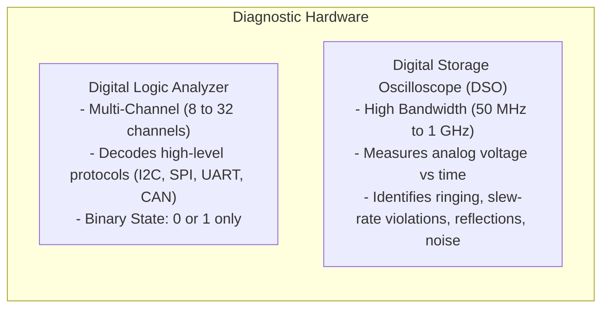
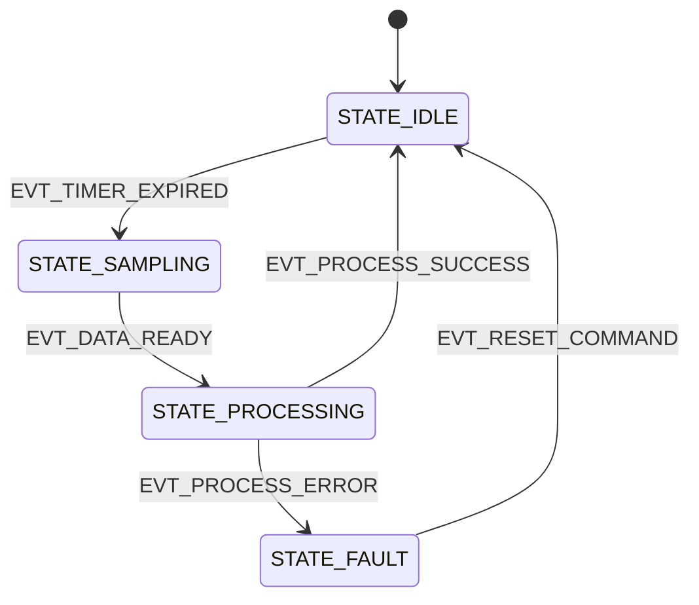
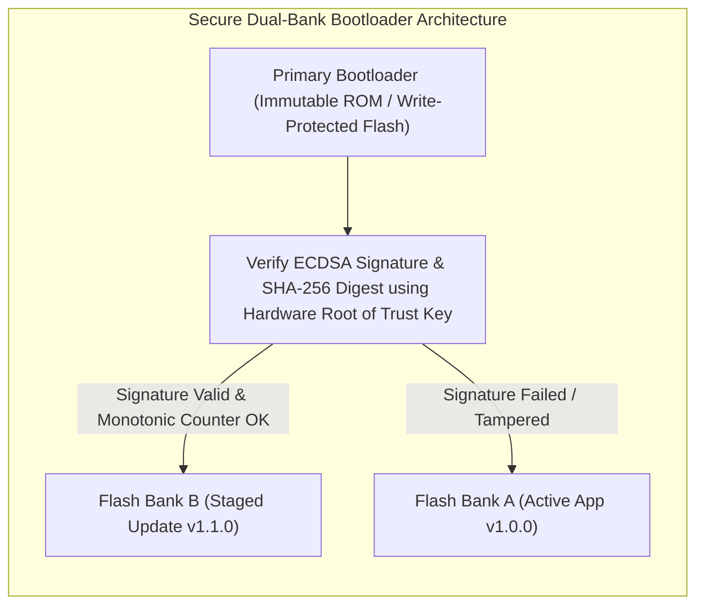

# 10. Embedded Software Testing, Debugging & Production Firmware Engineering

> **References & Influential Literature:**
> - *Making Embedded Systems: Design Patterns for Great Software* — Elecia White
> - *The Definitive Guide to ARM Cortex-M3 and Cortex-M4 Processors* (Chapter 12: Fault Exceptions, Chapter 15: Debug Architecture) — Joseph Yiu
> - *Test Driven Development for Embedded C* — James W. Grenning
> - *MISRA C:2012 Guidelines for the Use of the C Language in Critical Systems* — MIRA Ltd.

---

## 1. Hardware Debug Interfaces: JTAG, SWD & ITM

Debugging an embedded system goes far beyond adding `printf()` statements. Dedicated silicon debug hardware allows developers to halt the processor, step through assembly opcodes, inspect internal SRAM, and observe bus transactions in real time.

```
+-------------------------------------------------------------+
|                      JTAG (IEEE 1149.1)                     |
|  - 4 to 5 Pins: TCK (Clock), TMS (Mode), TDI (In), TDO (Out)|
|  - Standard boundary scan for multi-chip board testing      |
+-------------------------------------------------------------+
                              |
                     Silicon Optimization
                              v
+-------------------------------------------------------------+
|               ARM SERIAL WIRE DEBUG (SWD)                   |
|  - 2 Pins: SWCLK (Clock) + SWDIO (Bidirectional Data)        |
|  - Pin-efficient replacement for JTAG on Cortex-M           |
|  - Optional 3rd pin: SWO (Serial Wire Output / ITM Trace)   |
+-------------------------------------------------------------+
```

### 1.1 Hardware Breakpoints vs. Software Breakpoints
- **Hardware Breakpoints (FPB - Flash Patch and Breakpoint Unit)**: ARM Cortex-M cores include 4 to 8 physical hardware comparator registers. When the Program Counter matches a comparator address, the CPU halts. **Works natively on code executing directly from read-only Flash memory**.
- **Software Breakpoints**: The debugger replaces an instruction with the ARM breakpoint opcode (`BKPT 0xAB`). When the CPU fetches this opcode, it enters debug halt. **Only works in writable RAM**, as Flash cannot be rewritten on a single instruction boundary.

### 1.2 Instrumentation Trace Macrocell (ITM): Zero-Overhead `printf`
Calling standard `printf()` over UART blocks the CPU for milliseconds while waiting for baud dividers, altering system timing and masking race conditions (**Heisenbugs**).
**ARM ITM** routes diagnostic data out through the dedicated high-speed **SWO pin**:
- The CPU writes a single byte into an internal CoreSight hardware register (`ITM->PORT[0]`).
- Write completes in **exactly 1 CPU clock cycle** ($< 12\text{ ns}$)!
- External debug probes (J-Link, ST-LINK) decode and display the string in the host IDE console with negligible timing intrusion.

```c
#include "stm32f4xx.h"

/* Retarget standard C library printf to ARM ITM hardware */
int _write(int file, char *ptr, int len) {
    for (int i = 0; i < len; i++) {
        /* Check if ITM stimulus port 0 is enabled by host debugger */
        if ((ITM->TCR & ITM_TCR_ITMENA_Msk) && (ITM->TER & (1UL << 0))) {
            while (ITM->PORT[0].u32 == 0UL); /* Wait for hardware FIFO ready */
            ITM->PORT[0].u8 = (uint8_t)*ptr++;
        }
    }
    return len;
}
```

---

## 2. Diagnostic Instrumentation: Logic Analyzers & Oscilloscopes

When hardware and firmware interact, a software debugger cannot observe physical signal integrity anomalies (capacitive loading, ground bounce, bus contention).



### 2.1 Oscilloscope Signal Integrity Diagnostics
1. **Slow Rise Times on I2C**: If the SCL/SDA waveform looks like a curved shark fin rather than a crisp square wave, the pull-up resistor $R_p$ is too large for the bus capacitance. Reduce $R_p$ (e.g., from $10\text{ k}\Omega \to 2.2\text{ k}\Omega$).
2. **Transmission Line Ringing (Overshoot & Undershoot)**: On high-speed SPI lines ($> 20\text{ MHz}$), trace impedance mismatches cause reflections that exceed $V_{\text{DD}} + 0.5\text{ V}$. Place a **$22\,\Omega\text{ to }47\,\Omega$ series damping resistor** right at the driver's output pin.
3. **Ground Bounce**: Visible when multiple outputs toggle simultaneously, causing the local Ground plane to bounce by several hundred millivolts. Fix by improving decoupling capacitor placement.

---

## 3. Firmware Architecture Patterns: State Machines

Complex firmware quickly degenerates into an unmaintainable "spaghetti" of nested `if-else` branches. Professional firmware engineers structure control loops as **Finite State Machines (FSM)**.

### 3.1 The State Table Pattern (Event-Driven FSM)



```c
#include <stdio.h>
#include <stdbool.h>

typedef enum {
    STATE_IDLE,
    STATE_SAMPLING,
    STATE_PROCESSING,
    STATE_FAULT
} SystemState_t;

typedef enum {
    EVT_TIMER_EXPIRED,
    EVT_DATA_READY,
    EVT_PROCESS_SUCCESS,
    EVT_PROCESS_ERROR,
    EVT_RESET_COMMAND
} SystemEvent_t;

/* Function pointer signature for state handler actions */
typedef void (*StateHandler_t)(void);

typedef struct {
    SystemState_t current_state;
    SystemEvent_t event;
    SystemState_t next_state;
    StateHandler_t action;
} StateTransition_t;

/* Action function prototypes */
void action_start_adc(void);
void action_filter_data(void);
void action_log_error(void);
void action_system_reset(void);

/* Clean, declarative state transition table */
static const StateTransition_t transition_table[] = {
    { STATE_IDLE,       EVT_TIMER_EXPIRED,   STATE_SAMPLING,   action_start_adc },
    { STATE_SAMPLING,   EVT_DATA_READY,      STATE_PROCESSING, action_filter_data },
    { STATE_PROCESSING, EVT_PROCESS_SUCCESS, STATE_IDLE,       NULL },
    { STATE_PROCESSING, EVT_PROCESS_ERROR,   STATE_FAULT,      action_log_error },
    { STATE_FAULT,      EVT_RESET_COMMAND,   STATE_IDLE,       action_system_reset }
};

#define TRANSITION_COUNT (sizeof(transition_table) / sizeof(StateTransition_t))

static SystemState_t current_system_state = STATE_IDLE;

void dispatch_event(SystemEvent_t event) {
    for (size_t i = 0; i < TRANSITION_COUNT; i++) {
        if (transition_table[i].current_state == current_system_state &&
            transition_table[i].event == event) {
            
            /* Execute state action callback */
            if (transition_table[i].action != NULL) {
                transition_table[i].action();
            }
            /* Transition to new state */
            current_system_state = transition_table[i].next_state;
            return;
        }
    }
}
```

---

## 4. Safety-Critical Firmware: MISRA-C & Defensive Programming

The **Motor Industry Software Reliability Association (MISRA)** published guidelines to prevent undefined behaviors, memory corruption, and security vulnerabilities in embedded C.

### 4.1 Fundamental MISRA-C Rules for High-Reliability Systems
1. **Rule 17.2 (No Recursion)**: Functions must never call themselves directly or indirectly. Microcontrollers have fixed stack limits; recursion risks unbounded stack growth and catastrophic stack collisions.
2. **Rule 21.3 (No Dynamic Heap Allocation)**: The standard library functions `malloc()`, `calloc()`, `realloc()`, and `free()` shall **not be used after system initialization**. Memory must be statically pre-allocated to eliminate fragmentation risk.
3. **Rule 14.2 (Bounded Loop Execution)**: Every `while` and `for` loop must have an invariant terminating condition. Never write unbounded polling loops:
   ```c
   /* NON-COMPLIANT BUG: If hardware hangs, CPU locks up forever! */
   while (!(USART1->SR & USART_SR_TXE));

   /* COMPLIANT: Enforces bounded timeout */
   uint32_t timeout = 100000;
   while (!(USART1->SR & USART_SR_TXE)) {
       if (--timeout == 0) {
           handle_hardware_fault();
           break;
       }
   }
   ```
4. **Rule 10.1 (Explicit Integer Types)**: Avoid primitive types whose width varies across architectures (`int`, `short`, `long`). Always use fixed-width `<stdint.h>` types (`uint8_t`, `int32_t`, `uint16_t`).

---

## 5. ARM Cortex-M Fault Handling & Post-Mortem Diagnostics

When a null-pointer dereference, unaligned memory read, or bus timeout occurs, the CPU core vector-jumps to the **`HardFault_Handler()`**.

```
Stacked Context Frame on Exception Entry:
SP + 0x00 : R0
SP + 0x04 : R1
SP + 0x08 : R2
SP + 0x0C : R3
SP + 0x10 : R12
SP + 0x14 : LR (Link Register)
SP + 0x18 : PC (Program Counter at time of fault!)
SP + 0x1C : xPSR
```

### 5.1 The Production Fault Diagnostic Extractor (C & Assembly)

```c
#include <stdint.h>
#include <stdio.h>

/* Forward declaration */
void prvGetRegistersFromStack(uint32_t *pulFaultStackAddress);

/* Naked assembly wrapper to extract active stack pointer (MSP vs PSP) */
__attribute__((naked)) void HardFault_Handler(void) {
    __asm__ volatile (
        "tst lr, #4 \n"          /* Test bit 2 of EXC_RETURN to see if MSP or PSP was active */
        "ite eq \n"
        "mrseq r0, msp \n"       /* If bit 2 is 0, fault occurred on Main Stack (MSP) */
        "mrsne r0, psp \n"       /* If bit 2 is 1, fault occurred on Process Stack (PSP) */
        "ldr r1, [r0, #24] \n"   /* Load PC (offset 24) from stacked frame */
        "ldr r2, =prvGetRegistersFromStack \n"
        "bx r2 \n"
    );
}

void prvGetRegistersFromStack(uint32_t *pulFaultStackAddress) {
    volatile uint32_t r0  = pulFaultStackAddress[0];
    volatile uint32_t r1  = pulFaultStackAddress[1];
    volatile uint32_t r2  = pulFaultStackAddress[2];
    volatile uint32_t r3  = pulFaultStackAddress[3];
    volatile uint32_t r12 = pulFaultStackAddress[4];
    volatile uint32_t lr  = pulFaultStackAddress[5];
    volatile uint32_t pc  = pulFaultStackAddress[6];  /* EXACT instruction that crashed! */
    volatile uint32_t psr = pulFaultStackAddress[7];

    /* Read Core Fault Status Registers */
    volatile uint32_t cfsr = (*((volatile uint32_t *)(0xE000ED28)));
    volatile uint32_t hfsr = (*((volatile uint32_t *)(0xE000ED2C)));
    volatile uint32_t mmar = (*((volatile uint32_t *)(0xE000ED34))); /* Fault address */

    printf("\n=== [FATAL SYSTEM HARD FAULT] ===\n");
    printf("Faulting PC  : 0x%08X\n", (unsigned int)pc);
    printf("Link Register: 0x%08X\n", (unsigned int)lr);
    printf("CFSR Status  : 0x%08X\n", (unsigned int)cfsr);
    
    if (cfsr & (1 << 7)) {
        printf("MemManage Fault! Illegal Address: 0x%08X\n", (unsigned int)mmar);
    }
    if (cfsr & (1 << 25)) {
        printf("Usage Fault: Divide By Zero!\n");
    }
    if (cfsr & (1 << 24)) {
        printf("Usage Fault: Unaligned Memory Access!\n");
    }

    /* Trigger hardware reset via Application Interrupt and Reset Control Register (AIRCR) */
    SCB->AIRCR = (0x5FAUL << SCB_AIRCR_VECTKEY_Pos) | SCB_AIRCR_SYSRESETREQ_Msk;
    while (1);
}
```

---

## 6. Secure Bootloaders & Cryptographic Firmware Integrity

In commercial and industrial deployments, embedded devices must accept remote firmware updates without vulnerability to malicious tampering or man-in-the-middle attacks.



### 6.1 Cryptographic Verification Pipeline
1. **Integrity (SHA-256 Hash)**: The manufacturer compiles firmware binary `firmware.bin` and hashes the entire image into a 32-byte digest.
2. **Authenticity & Non-Repudiation (Digital Signature)**: The manufacturer signs the SHA-256 hash with their **Private Key** using an asymmetric curve (**ECDSA P-256** or **Ed25519**).
3. **Root of Trust Verification**: The bootloader contains the manufacturer's **Public Key** burned into write-protected Flash or One-Time-Programmable (OTP) eFuses.
4. **Anti-Rollback Protection**: The firmware header contains a monotonic sequence version number. The bootloader rejects any signed firmware whose version number is lower than the currently installed version, thwarting downgrade attacks that exploit known past vulnerabilities.
