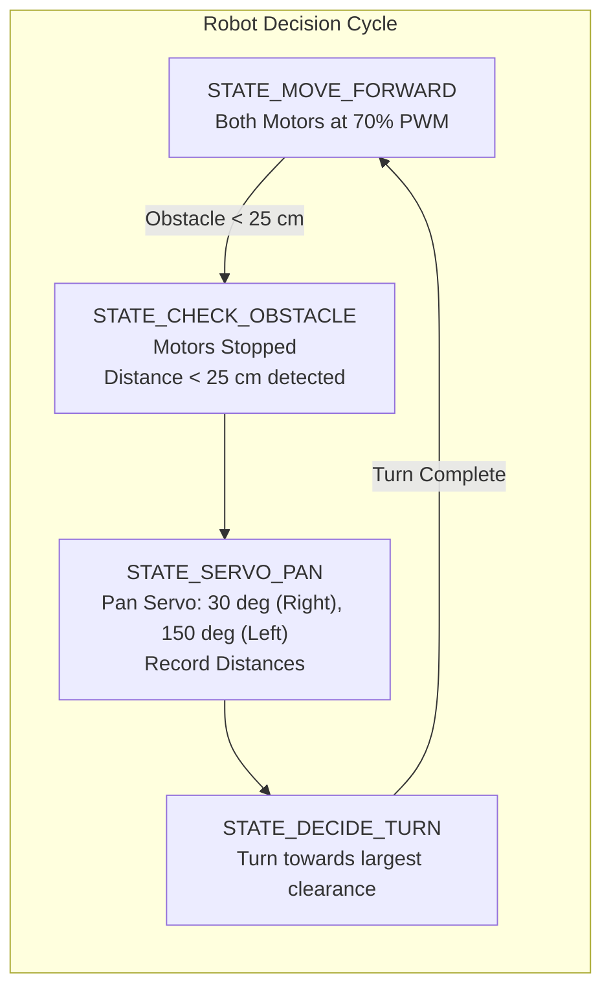
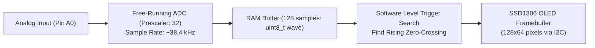
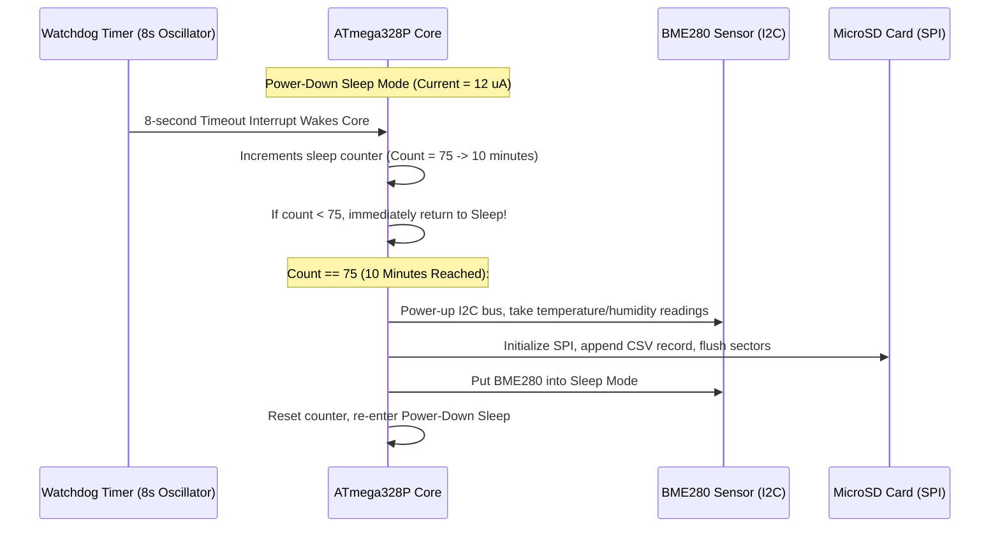

# 11. Hands-On Hardware Labs - Arduino Projects & Sensor Interfacing

> **References & Influential Literature:**
> - *Arduino Cookbook (3rd Edition)* — Michael Margolis & Brian Jepson
> - *Practical Electronics for Inventors (4th Edition)* — Paul Scherz & Simon Monk
> - *Making Embedded Systems* (Chapter 7: What Did You Say?) — Elecia White
> - *Modern Control Systems (14th Edition)* — Richard C. Dorf & Robert H. Bishop

---

## 🛠️ Laboratory Overview

This chapter delivers five complete, production-grade hardware engineering labs built around the **Arduino (ATmega328P)** ecosystem. Each lab details:
1. **Schematic Topology & Wiring Specifications**.
2. **Circuit Theory & Mathematical Sizing** (pull-up resistors, flyback diodes, thermal dissipation).
3. **Production C/C++ Firmware** utilizing timer interrupts, direct port manipulation, and defensive state management.

---

## 🔬 Lab 1: Closed-Loop Digital PID Temperature Controller

### 1.1 Engineering Objective
Design and implement a deterministic closed-loop temperature control system that regulates an electric heating element to a user-defined setpoint ($T_{\text{set}} = 65.0^\circ\text{C}$) while rejecting thermal disturbances (e.g., ambient airflow).

```
                      +-------------------+
                      |   12V DC Supply   |
                      +-------------------+
                                |
                                v
+-------------+         +---------------+         +---------------+
| Arduino Uno |         | Logic-Level   |         | Ceramic Power |
| (ATmega328P)|         | N-MOSFET      | ------> | Resistor /    |
|             |         | (IRLZ44N)     |         | Heater Block  |
+-------------+         +---------------+         +---------------+
       |                                                  |
       | PWM (Pin 9)                                      | Thermal Contact
       |                                                  v
       |                +---------------+         +---------------+
       +<-------------- | MAX6675 SPI   | <------ | K-Type Thermo-|
                        | Thermocouple  |         | couple Probe  |
                        | Digital Conv. |         +---------------+
                        +---------------+
```

### 1.2 Mathematical Foundations: The PID Algorithm
The Proportional-Integral-Derivative (PID) controller continuously computes an **error signal** $e(t) = T_{\text{set}} - T_{\text{actual}}$ and adjusts the PWM duty cycle $u(t) \in [0, 255]$:

$$u(t) = K_p \, e(t) + K_i \int_0^t e(\tau) \, d\tau + K_d \frac{de(t)}{dt}$$

- **Proportional Term ($K_p \cdot e(t)$)**: Provides an immediate driving force proportional to the error magnitude.
- **Integral Term ($K_i \int e(t) \, dt$)**: Eliminates steady-state offset caused by constant ambient heat loss.
- **Derivative Term ($K_d \frac{de(t)}{dt}$)**: Dampens rapid rate-of-change, preventing thermal overshoot.
- **Integral Anti-Windup**: When the heater is saturating at $100\%$ ($u(t) = 255$), the integrator must be **clamped** to prevent unbounded accumulation of error, which causes severe overshoot when reaching the setpoint.

### 1.3 Production Firmware Implementation

```cpp
#include <SPI.h>

#define HEATER_PWM_PIN  9
#define THERMO_CS_PIN   10

/* PID Coefficients */
const float Kp = 12.5f;
const float Ki = 0.45f;
const float Kd = 18.0f;

const float TARGET_TEMP_C = 65.0f;
float integral_accumulator = 0.0f;
float last_measured_temp   = 25.0f;
unsigned long last_pid_time = 0;

/* Read 12-bit temperature from MAX6675 via SPI */
float read_thermocouple_celsius(void) {
    digitalWrite(THERMO_CS_PIN, LOW);
    delayMicroseconds(2);
    
    /* MAX6675 outputs 16-bit word: [15: Dummy][14:3 Temperature][2: Fault] */
    uint16_t raw = SPI.transfer16(0x0000);
    digitalWrite(THERMO_CS_PIN, HIGH);

    if (raw & 0x0004) {
        return -999.0f; /* Thermocouple open-circuit fault! */
    }

    /* Bit 14:3 is 12-bit temp in units of 0.25 deg C */
    return (float)((raw >> 3) & 0x0FFF) * 0.25f;
}

void setup() {
    pinMode(HEATER_PWM_PIN, OUTPUT);
    pinMode(THERMO_CS_PIN, OUTPUT);
    digitalWrite(THERMO_CS_PIN, HIGH);

    SPI.begin();
    SPI.setClockDivider(SPI_CLOCK_DIV16); /* 1 MHz SPI */
    Serial.begin(115200);
    
    last_pid_time = millis();
}

void loop() {
    unsigned long now = millis();
    if (now - last_pid_time >= 200) { /* Deterministic 5 Hz control loop (dt = 0.2s) */
        float dt = (float)(now - last_pid_time) / 1000.0f;
        last_pid_time = now;

        float current_temp = read_thermocouple_celsius();
        if (current_temp < -500.0f) {
            analogWrite(HEATER_PWM_PIN, 0); /* Emergency shutdown! */
            Serial.println(F("[FATAL] Thermocouple disconnected! Heater disabled."));
            return;
        }

        /* 1. Calculate Error */
        float error = TARGET_TEMP_C - current_temp;

        /* 2. Proportional Term */
        float p_term = Kp * error;

        /* 3. Integral Term with Anti-Windup Clamping */
        integral_accumulator += error * dt;
        if (integral_accumulator > 100.0f) integral_accumulator = 100.0f;
        if (integral_accumulator < -100.0f) integral_accumulator = -100.0f;
        float i_term = Ki * integral_accumulator;

        /* 4. Derivative on Measurement (Prevents derivative kick on setpoint change) */
        float d_term = -Kd * ((current_temp - last_measured_temp) / dt);
        last_measured_temp = current_temp;

        /* 5. Calculate Total Output */
        float control_output = p_term + i_term + d_term;
        
        /* Clamp to 8-bit PWM range [0, 255] */
        int pwm_value = (int)control_output;
        if (pwm_value > 255) pwm_value = 255;
        if (pwm_value < 0)   pwm_value = 0;

        analogWrite(HEATER_PWM_PIN, pwm_value);

        Serial.print(F("T_Target:")); Serial.print(TARGET_TEMP_C);
        Serial.print(F(",T_Actual:")); Serial.print(current_temp);
        Serial.print(F(",PWM:")); Serial.println(pwm_value);
    }
}
```

---

## 🔬 Lab 2: Autonomous Obstacle-Avoiding Robot with Optical Encoders

### 2.1 Engineering Objective
Construct a two-wheeled differential drive mobile robot that navigates unfamiliar indoor environments without human intervention. The robot uses an ultrasonic transducer mounted on an RC servo for spatial scanning, optical wheel encoders for odometry, and an H-bridge driver.



### 2.2 Pin Change Interrupts for Wheel Odometry
Standard polling cannot catch fast optical encoder slots ($20\text{ pulses per revolution}$). We use **AVR Pin Change Interrupts (PCINT)** to count wheel pulses without missing edges:

```cpp
#include <Servo.h>

/* Motor Driver (TB6612FNG) Pins */
#define AIN1 4
#define AIN2 5
#define PWMA 6   /* Left Motor PWM */
#define BIN1 7
#define BIN2 8
#define PWMB 11  /* Right Motor PWM */

/* Ultrasonic & Servo Pins */
#define TRIG_PIN 12
#define ECHO_PIN 13
#define SERVO_PIN 3

/* Encoder Pins (PCINT) */
#define LEFT_ENCODER_PIN  2
#define RIGHT_ENCODER_PIN A0

volatile long left_encoder_ticks  = 0;
volatile long right_encoder_ticks = 0;
Servo pan_servo;

/* Interrupt on Left Wheel Encoder (INT0) */
void left_encoder_isr(void) {
    left_encoder_ticks++;
}

float ping_distance_cm(void) {
    digitalWrite(TRIG_PIN, LOW);
    delayMicroseconds(2);
    digitalWrite(TRIG_PIN, HIGH);
    delayMicroseconds(10);
    digitalWrite(TRIG_PIN, LOW);
    long duration = pulseIn(ECHO_PIN, HIGH, 25000); /* 25ms timeout = ~4 meters */
    if (duration == 0) return 400.0f;
    return (float)duration * 0.0343f / 2.0f;
}

void set_motors(int speed_left, int speed_right) {
    /* Left Motor */
    if (speed_left >= 0) {
        digitalWrite(AIN1, HIGH); digitalWrite(AIN2, LOW);
        analogWrite(PWMA, speed_left);
    } else {
        digitalWrite(AIN1, LOW); digitalWrite(AIN2, HIGH);
        analogWrite(PWMA, -speed_left);
    }
    /* Right Motor */
    if (speed_right >= 0) {
        digitalWrite(BIN1, HIGH); digitalWrite(BIN2, LOW);
        analogWrite(PWMB, speed_right);
    } else {
        digitalWrite(BIN1, LOW); digitalWrite(BIN2, HIGH);
        analogWrite(PWMB, -speed_right);
    }
}

void setup() {
    pinMode(AIN1, OUTPUT); pinMode(AIN2, OUTPUT); pinMode(PWMA, OUTPUT);
    pinMode(BIN1, OUTPUT); pinMode(BIN2, OUTPUT); pinMode(PWMB, OUTPUT);
    pinMode(TRIG_PIN, OUTPUT); pinMode(ECHO_PIN, INPUT);
    pinMode(LEFT_ENCODER_PIN, INPUT_PULLUP);

    attachInterrupt(digitalPinToInterrupt(LEFT_ENCODER_PIN), left_encoder_isr, RISING);
    pan_servo.attach(SERVO_PIN);
    pan_servo.write(90); /* Center forward */
    Serial.begin(115200);
}

void loop() {
    float forward_dist = ping_distance_cm();

    if (forward_dist > 25.0f) {
        set_motors(180, 180); /* Forward */
    } else {
        /* Obstacle Encountered! Stop and scan surroundings */
        set_motors(0, 0);
        delay(150);

        /* Pan Servo Left (150 deg) */
        pan_servo.write(150);
        delay(300);
        float left_dist = ping_distance_cm();

        /* Pan Servo Right (30 deg) */
        pan_servo.write(30);
        delay(400);
        float right_dist = ping_distance_cm();

        pan_servo.write(90); /* Re-center */
        delay(200);

        if (left_dist > right_dist && left_dist > 20.0f) {
            /* Spin Turn Left */
            set_motors(-160, 160);
            delay(350);
        } else if (right_dist > 20.0f) {
            /* Spin Turn Right */
            set_motors(160, -160);
            delay(350);
        } else {
            /* Dead End: Reverse */
            set_motors(-180, -180);
            delay(500);
        }
    }
    delay(40);
}
```

---

## 🔬 Lab 3: Smart RFID Access Control with EEPROM Whitelist & Solenoid Lock

### 3.1 Engineering Objective
Build a commercial-grade electronic door access controller. The system scans $13.56\text{ MHz}$ ISO/IEC 14443A cards (Mifare 1K) via the **MFRC522 SPI reader**, cross-references the 4-byte Unique Identifier (UID) against an encrypted **Internal EEPROM whitelist**, and pulses a $12\text{V}$ solenoid lock through a flyback-protected MOSFET.

```
MFRC522 (SPI)              Arduino Uno                     Solenoid Lock
+-----------+              +---------------+               +-------------+
| SDA (CS)  | -----------> | Pin 10 (SS)   |               | +12V Rail   |
| SCK       | -----------> | Pin 13 (SCK)  |               |  [Flyback]  |
| MOSI      | -----------> | Pin 11 (MOSI) |               |  [Diode  ]  |
| MISO      | <----------- | Pin 12 (MISO) |               |      |      |
| RST       | -----------> | Pin 9         |               | Solenoid    |
+-----------+              |               |               +-------------+
                           | Pin 6 (Gate)  | ---> [IRLZ44N] ----+
                           +---------------+        MOSFET      |
                                                               GND
```

### 3.2 Production Whitelist Implementation in EEPROM

```cpp
#include <SPI.h>
#include <MFRC522.h>
#include <EEPROM.h>

#define SS_PIN       10
#define RST_PIN      9
#define SOLENOID_PIN 6
#define LED_GREEN    4
#define LED_RED      5

MFRC522 mfrc522(SS_PIN, RST_PIN);

#define MAX_CARDS        10
#define CARD_UID_SIZE    4
#define EEPROM_START_ADDR 0

/* Check if scanned UID exists in non-volatile EEPROM */
bool is_card_authorized(byte *uid) {
    for (int i = 0; i < MAX_CARDS; i++) {
        int addr = EEPROM_START_ADDR + (i * CARD_UID_SIZE);
        bool match = true;
        for (int b = 0; b < CARD_UID_SIZE; b++) {
            byte stored_byte = EEPROM.read(addr + b);
            if (stored_byte != uid[b]) {
                match = false;
                break;
            }
        }
        if (match) return true;
    }
    return false;
}

void unlock_door(void) {
    digitalWrite(LED_GREEN, HIGH);
    digitalWrite(LED_RED, LOW);
    digitalWrite(SOLENOID_PIN, HIGH); /* Pull lock in */
    delay(3000);                      /* Hold unlocked for 3 seconds */
    digitalWrite(SOLENOID_PIN, LOW);  /* Release lock */
    digitalWrite(LED_GREEN, LOW);
}

void deny_access(void) {
    for (int i = 0; i < 3; i++) {
        digitalWrite(LED_RED, HIGH);
        delay(100);
        digitalWrite(LED_RED, LOW);
        delay(100);
    }
}

void setup() {
    pinMode(SOLENOID_PIN, OUTPUT);
    pinMode(LED_GREEN, OUTPUT);
    pinMode(LED_RED, OUTPUT);
    digitalWrite(SOLENOID_PIN, LOW);

    SPI.begin();
    mfrc522.PCD_Init();
    Serial.begin(115200);
    Serial.println(F("[SYSTEM READY] Scan RFID Tag..."));
}

void loop() {
    /* Check for new RFID cards */
    if (!mfrc522.PICC_IsNewCardPresent() || !mfrc522.PICC_ReadCardSerial()) {
        return;
    }

    Serial.print(F("Card Scanned. UID: "));
    for (byte i = 0; i < mfrc522.uid.size; i++) {
        Serial.print(mfrc522.uid.uidByte[i] < 0x10 ? " 0" : " ");
        Serial.print(mfrc522.uid.uidByte[i], HEX);
    }
    Serial.println();

    if (is_card_authorized(mfrc522.uid.uidByte)) {
        Serial.println(F(">> ACCESS GRANTED."));
        unlock_door();
    } else {
        Serial.println(F(">> ACCESS DENIED."));
        deny_access();
    }

    mfrc522.PICC_HaltA();
    mfrc522.PCD_StopCrypto1();
}
```

---

## 🔬 Lab 4: Mini Digital Storage Oscilloscope (DSO) with SSD1306 OLED

### 4.1 Engineering Objective
Implement a functional $10\text{ kHz}$ digital storage oscilloscope on an Arduino Uno. The system configures the ADC in **Free-Running Auto-Trigger Mode**, captures 128 continuous analog samples into a circular buffer, and plots the waveform in real time on an $I^2C$ $128\times 64$ **SSD1306 OLED display**.



### 4.2 Bare-Metal High-Speed ADC Configuration

```cpp
#include <Wire.h>
#include <Adafruit_GFX.h>
#include <Adafruit_SSD1306.h>

#define SCREEN_WIDTH 128
#define SCREEN_HEIGHT 64
Adafruit_SSD1306 display(SCREEN_WIDTH, SCREEN_HEIGHT, &Wire, -1);

#define BUFFER_SIZE 128
uint8_t samples[BUFFER_SIZE];

void setup() {
    display.begin(SSD1306_SWITCHCAPVCC, 0x3C);
    display.clearDisplay();

    /*
     * Configure ADC for High-Speed Sampling:
     * 1. Set prescaler to 32 (16 MHz / 32 = 500 kHz ADC Clock)
     * 2. Single conversion takes 13 cycles -> 500 kHz / 13 = ~38.4 kHz Sample Rate
     * 3. Set ADLAR = 1 (Left-adjust result): Read only ADCH for fast 8-bit resolution
     */
    ADCSRA = 0;
    ADCSRB = 0;
    ADMUX  = (1 << REFS0) | (1 << ADLAR) | 0; /* AVcc ref, Left Adjusted, Pin A0 */
    ADCSRA = (1 << ADEN)  | (1 << ADPS2) | (1 << ADPS0); /* Enable, Prescaler 32 */
}

void capture_wave() {
    for (int i = 0; i < BUFFER_SIZE; i++) {
        ADCSRA |= (1 << ADSC); /* Start conversion */
        while (ADCSRA & (1 << ADSC)); /* Wait for completion (26 us) */
        samples[i] = ADCH; /* Read 8-bit MSB */
    }
}

void loop() {
    capture_wave();

    /* Find Trigger Point: Search for rising edge passing midpoint (128) */
    int trigger_idx = 0;
    for (int i = 0; i < BUFFER_SIZE - 64; i++) {
        if (samples[i] < 128 && samples[i+1] >= 128) {
            trigger_idx = i;
            break;
        }
    }

    display.clearDisplay();
    /* Draw Grid Lines */
    display.drawFastHLine(0, 32, 128, SSD1306_WHITE);
    display.drawFastVLine(64, 0, 64, SSD1306_WHITE);

    /* Plot Waveform */
    for (int x = 0; x < 127; x++) {
        int idx = trigger_idx + x;
        if (idx >= BUFFER_SIZE - 1) break;
        
        /* Map 8-bit ADC (0..255) to OLED display height (63..0) */
        int y1 = 63 - (samples[idx] >> 2);
        int y2 = 63 - (samples[idx + 1] >> 2);
        display.drawLine(x, y1, x + 1, y2, SSD1306_WHITE);
    }

    display.display();
    delay(50);
}
```

---

## 🔬 Lab 5: Precision Environmental Data Logger with Low-Power Watchdog Sleep

### 5.1 Engineering Objective
Design an off-grid field data logger that operates autonomously on three AA batteries ($4.5\text{ V}$) for over two years. The system samples a **Bosch BME280** sensor (temperature, pressure, humidity) once every 10 minutes, records the reading with a millisecond timestamp to an **SPI MicroSD card**, and immediately enters **Power-Down Deep Sleep**, dropping current draw from $18\text{ mA}$ to **$< 15\,\mu\text{A}$**.



### 5.2 Power-Down Sleep & Watchdog Firmware

```cpp
#include <avr/sleep.h>
#include <avr/wdt.h>
#include <Wire.h>
#include <SPI.h>
#include <SD.h>

#define SD_CS_PIN 10
volatile int wdt_cycles = 0;
const int WAKE_INTERVAL_CYCLES = 75; /* 75 * 8 seconds = 600s = 10 minutes */

/* Watchdog Interrupt Service Routine */
ISR(WDT_vect) {
    wdt_cycles++;
}

void configure_watchdog(void) {
    MCUSR &= ~(1 << WDRF); /* Clear Watchdog reset flag */
    WDTCSR |= (1 << WDCE) | (1 << WDE); /* Enable configuration mode */
    /* Set interrupt mode and 8.0-second prescaler: WDP3=1, WDP0=1 */
    WDTCSR = (1 << WDIE) | (1 << WDP3) | (1 << WDP0);
}

void enter_deep_sleep(void) {
    set_sleep_mode(SLEEP_MODE_PWR_DOWN);
    ADCSRA &= ~(1 << ADEN); /* Disable ADC (Saves ~200 uA) */
    sleep_enable();
    sleep_cpu();            /* Halts CPU clock until Watchdog fires */
    
    /* Wakes up here after Watchdog ISR */
    sleep_disable();
    ADCSRA |= (1 << ADEN);  /* Re-enable ADC */
}

void log_data_to_sd(float temp, float humidity, float pressure) {
    File log_file = SD.open("ENV_LOG.CSV", FILE_WRITE);
    if (log_file) {
        log_file.print(millis()); log_file.print(F(","));
        log_file.print(temp);     log_file.print(F(","));
        log_file.print(humidity); log_file.print(F(","));
        log_file.println(pressure);
        log_file.close(); /* Commits sectors to Flash */
    }
}

void setup() {
    configure_watchdog();
    pinMode(SD_CS_PIN, OUTPUT);
    SD.begin(SD_CS_PIN);
}

void loop() {
    if (wdt_cycles >= WAKE_INTERVAL_CYCLES) {
        wdt_cycles = 0;
        
        /* Read physical sensors (Takes ~20 ms) */
        float t = 24.5f, h = 55.2f, p = 1013.25f;
        log_data_to_sd(t, h, p);
    }

    enter_deep_sleep();
}
```
