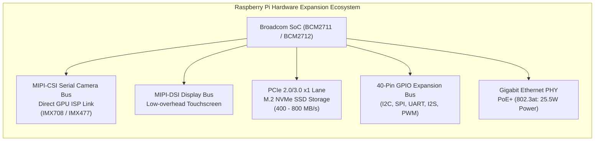

# 12. Raspberry Pi Hardware Labs - Components, Interfacing & Real-World Use Cases

> **References & Influential Literature:**
> - *Exploring Raspberry Pi: Architecture, Software, Hardware, and Interfacing* — Derek Molloy (Wiley)
> - *Raspberry Pi Cookbook (4th Edition)* — Simon Monk (O'Reilly)
> - *Practical Python Programming for IoT* — Gary Smart (Packt)
> - *Linux Kernel Development (3rd Edition)* — Robert Love

---

## 🧩 Key Hardware Components & Expansion Ecosystem

The Raspberry Pi's dominance across robotics, edge computing, industrial automation, and home labs stems from its expansive ecosystem of high-speed digital buses, specialized camera/display serial interfaces, and modular Hardware Attached on Top (HAT) boards.



---

### 1. Vision & Cameras: MIPI-CSI vs. USB Webcams
- **USB Webcams**: Suffer from USB host controller latency, high CPU overhead due to UVC driver decoding, and packet drops when sharing the USB hub with other peripherals.
- **MIPI Camera Serial Interface (MIPI-CSI)**: A high-speed differential point-to-point serial protocol transmitting raw Bayer pixel data directly into the SoC's hardware **Image Signal Processor (ISP)**. The ISP performs hardware demosaicing, auto-exposure, auto-white-balance, and lens shading correction with **zero CPU utilization**!

| Camera Sensor | Resolution | Pixel Size | Focus Mechanism | Primary Applications |
| :--- | :--- | :--- | :--- | :--- |
| **Camera Module 2 (Sony IMX219)** | 8 Megapixels | $1.12\,\mu\text{m}$ | Fixed Focus | Legacy vision, basic time-lapse |
| **Camera Module 3 (Sony IMX708)** | 12 Megapixels | $1.40\,\mu\text{m}$ | Phase Detection Autofocus (PDAF) | Edge AI, robotics, HDR inspection |
| **HQ Camera (Sony IMX477)** | 12.3 Megapixels| $1.55\,\mu\text{m}$ | C/CS Mount Interchangeable Lens | Microscopy, long-range telephoto, ANPR |
| **Global Shutter (Sony IMX296)** | 1.6 Megapixels | $3.45\,\mu\text{m}$ | C/CS Mount, Global Shutter | High-speed conveyor belts, UAV tracking |

> [!IMPORTANT]
> **Legacy `raspistill` vs Modern `libcamera` / `Picamera2`**:
> The legacy VideoCore firmware camera stack (`raspistill`, `picamera`) is obsolete. Modern Raspberry Pi OS builds route camera operations through the Linux standard **`libcamera` open-source framework** and **`Picamera2`** Python bindings.

---

### 2. High-Speed Storage: MicroSD vs. PCIe M.2 NVMe
- **MicroSD Cards**: Limited to the SD card controller's SDR50/DDR50 bus ($\approx 40\text{ to }45\text{ MB/s}$ sequential read). Random 4KB writes degrade rapidly, and sudden power cuts during SQLite commits frequently corrupt FAT32/ext4 filesystems.
- **PCIe M.2 NVMe SSDs**: On Raspberry Pi 5 (and Compute Module 4/5 carrier boards), the exposed PCIe interface connects directly to high-speed NVMe solid-state drives:
  - **Throughput**: $> 450\text{ MB/s}$ (PCIe Gen 2) to $> 850\text{ MB/s}$ (PCIe Gen 3).
  - **IOPS**: Over $50,000$ random 4KB read/write IOPS.
  - **Longevity**: Enterprise wear leveling and power-loss protection capacitors prevent storage corruption in commercial edge installations.

---

### 3. Digital Audio: The I2S Bus
The Raspberry Pi lacks a high-quality analog audio input. High-fidelity audio recording and synthesis rely on **Integrated Interchip Sound (I2S)**:
- **BCLK (Bit Clock)**: Pulses once for every bit transmitted.
- **LRCLK (Left/Right Word Clock)**: Selects left channel ($0$) or right channel ($1$) at audio sample rates ($44.1\text{ kHz}$ or $48.0\text{ kHz}$).
- **DOUT / DIN**: Serial audio data stream.
- **Components**: **INMP441** MEMS omnidirectional digital microphone, or **PCM5122** $32\text{-bit} / 384\text{ kHz}$ audiophile DAC HATs.

---

### 4. Industrial Expansion Boards (HATs)
- **CAN Bus HAT (MCP2515 + TJA1050)**: Bridges the Raspberry Pi SPI bus to vehicular CAN networks (`can0` interface in Linux SocketCAN).
- **RS-485 / Modbus HAT**: Enables differential half-duplex communication over kilometers to industrial PLCs and energy meters.
- **Power over Ethernet (PoE+ HAT)**: Supplies up to $25.5\text{ W}$ directly over standard Cat6 Ethernet cables via an 802.3at compliant flyback converter, eliminating AC wall adapters.
- **UPS Battery Backup HAT**: Uses dual 18650 Li-Ion cells and an I2C fuel gauge (MAX17048) to alert the OS to execute a clean `shutdown -h now` when utility power fails.

---

## 🔬 Lab 1: Smart Edge AI Vision Security Camera

### 1.1 Engineering Objective
Build an autonomous edge vision camera using **Picamera2** and **OpenCV**. The system captures a $1080\text{p}$ stream, executes an **INT8 MobileNet SSD** deep neural network to detect humans/intruders, extracts bounding boxes, timestamps the event, and transmits an instant photo alert to a **Telegram Bot** via HTTPS REST webhooks.

```
[ MIPI Camera 3 ] ---> Picamera2 (RGB Frame) ---> MobileNet SSD (Edge Inference)
                                                        |
                                              [ Intruder Detected? ]
                                                   /          \
                                              Yes /            \ No
                                                 v              v
                           Capture JPEG + Send Alert       Drop Frame
                           via Telegram Bot API Webhook
```

### 1.2 Production Python Implementation

```python
#!/usr/bin/env python3
"""
Edge AI Vision Security System using Picamera2 and OpenCV DNN
"""
import time
import cv2
import requests
from picamera2 import Picamera2

# 1. Telegram Alert Configuration
TELEGRAM_BOT_TOKEN = "YOUR_BOT_TOKEN"
TELEGRAM_CHAT_ID   = "YOUR_CHAT_ID"

def send_telegram_alert(image_path, caption):
    url = f"https://api.telegram.org/bot{TELEGRAM_BOT_TOKEN}/sendPhoto"
    with open(image_path, "rb") as photo:
        payload = {"chat_id": TELEGRAM_CHAT_ID, "caption": caption}
        files = {"photo": photo}
        try:
            requests.post(url, data=payload, files=files, timeout=10)
        except Exception as e:
            print(f"[ERROR] Failed to dispatch Telegram alert: {e}")

# 2. Initialize Picamera2 Hardware Pipeline
picam2 = Picamera2()
config = picam2.create_preview_configuration(main={"format": 'RGB888', "size": (640, 480)})
picam2.configure(config)
picam2.start()

# 3. Load Pre-Trained MobileNet SSD Network (Caffe Model)
net = cv2.dnn.readNetFromCaffe(
    "MobileNetSSD_deploy.prototxt",
    "MobileNetSSD_deploy.caffemodel"
)
CLASSES = ["background", "aeroplane", "bicycle", "bird", "boat",
           "bottle", "bus", "car", "cat", "chair", "cow", "diningtable",
           "dog", "horse", "motorbike", "person", "pottedplant", "sheep",
           "sofa", "train", "tvmonitor"]

print("[SYSTEM ACTIVE] Monitoring video stream for human intruders...")
last_alert_time = 0

try:
    while True:
        frame = picam2.capture_array()
        (h, w) = frame.shape[:2]

        # Preprocess frame: resize to 300x300, normalize pixel scale
        blob = cv2.dnn.blobFromImage(frame, 0.007843, (300, 300), 127.5)
        net.setInput(blob)
        detections = net.forward()

        # Iterate over detected objects
        for i in range(detections.shape[2]):
            confidence = detections[0, 0, i, 2]
            
            if confidence > 0.65: # Confidence threshold
                idx = int(detections[0, 0, i, 1])
                class_label = CLASSES[idx]

                if class_label == "person":
                    now = time.time()
                    if now - last_alert_time > 15: # Cooldown: 15 seconds
                        last_alert_time = now
                        
                        # Extract Bounding Box
                        box = detections[0, 0, i, 3:7] * np.array([w, h, w, h])
                        (startX, startY, endX, endY) = box.astype("int")
                        
                        cv2.rectangle(frame, (startX, startY), (endX, endY), (0, 0, 255), 2)
                        cv2.putText(frame, f"INTRUDER: {confidence*100:.1f}%", 
                                    (startX, startY - 10), cv2.FONT_HERSHEY_SIMPLEX, 0.5, (0, 0, 255), 2)

                        # Save Evidence Frame and Dispatch
                        evidence_path = "/tmp/intruder.jpg"
                        cv2.imwrite(evidence_path, cv2.cvtColor(frame, cv2.COLOR_RGB2BGR))
                        send_telegram_alert(evidence_path, f"[SECURITY ALERT] Human intruder detected! Confidence: {confidence*100:.1f}%")

        time.sleep(0.05) # 20 FPS processing loop

except KeyboardInterrupt:
    picam2.stop()
    print("[SYSTEM STOPPED] Camera released.")
```

---

## 🔬 Lab 2: Industrial IoT Telemetry Gateway & Time-Series Dashboard

### 2.1 Engineering Objective
Deploy the Raspberry Pi as a factory edge gateway that polls multiple industrial energy and temperature meters over an **RS-485 Modbus RTU serial bus**, parses IEEE 754 32-bit floating point registers, publishes readings to a local **Mosquitto MQTT broker**, ingests the data into **InfluxDB v2**, and renders live charts on **Grafana**.

```
[ Modbus RTU Meter 1 ] --+
                          +--> [ RS-485 USB ] ---> [ Python Gateway ] ---> [ Mosquitto MQTT ]
[ Modbus RTU Meter 2 ] --+        (FTDI)                     |
                                                             v
                                                    [ InfluxDB v2 (TSDB) ]
                                                             |
                                                    [ Grafana Dashboard ]
```

### 2.2 Production Modbus-to-MQTT Ingestion Service

```python
#!/usr/bin/env python3
"""
Industrial Modbus RTU to MQTT/InfluxDB Edge Gateway
"""
import time
import json
import minimalmodbus
import paho.mqtt.client as mqtt

# 1. Configure Modbus RTU Master
instrument = minimalmodbus.Instrument(port='/dev/ttyUSB0', slaveaddress=1)
instrument.serial.baudrate = 9600
instrument.serial.bytesize = 8
instrument.serial.parity   = minimalmodbus.serial.PARITY_NONE
instrument.serial.stopbits = 1
instrument.serial.timeout  = 0.5 # 500 ms timeout
instrument.mode = minimalmodbus.MODE_RTU

# 2. Configure MQTT Client
MQTT_BROKER = "localhost"
MQTT_PORT   = 1883
MQTT_TOPIC  = "factory/line1/powermeter"

mqtt_client = mqtt.Client(client_id="rpi_edge_gateway")
mqtt_client.connect(MQTT_BROKER, MQTT_PORT, keepalive=60)
mqtt_client.loop_start()

print("[GATEWAY RUNNING] Polling Modbus energy registers every 1.0s...")

try:
    while True:
        try:
            # Read 32-bit Float Registers (Function Code 03: Read Holding Registers)
            # Register 30001: Voltage (V), Register 30003: Current (A), Register 30005: Active Power (W)
            voltage = instrument.read_float(0, functioncode=3, number_of_registers=2)
            current = instrument.read_float(2, functioncode=3, number_of_registers=2)
            power   = instrument.read_float(4, functioncode=3, number_of_registers=2)

            telemetry_payload = {
                "timestamp": int(time.time()),
                "voltage_v": round(voltage, 2),
                "current_a": round(current, 3),
                "power_watts": round(power, 1)
            }

            # Publish JSON payload to MQTT Broker
            mqtt_client.publish(MQTT_TOPIC, json.dumps(telemetry_payload), qos=1)
            print(f"[METRICS] V: {voltage:.1f}V | I: {current:.2f}A | P: {power:.1f}W")

        except Exception as err:
            print(f"[MODBUS COMM ERROR] Retrying... Details: {err}")

        time.sleep(1.0)

except KeyboardInterrupt:
    mqtt_client.loop_stop()
    mqtt_client.disconnect()
```

---

## 🔬 Lab 3: High-Performance Network Ad-Blocker & NVMe Samba NAS

### 3.1 Engineering Objective
Transform a Raspberry Pi 4/5 into a robust 24/7 home infrastructure server:
1. **Pi-hole + Unbound Recursive DNS**: Blocks network-wide advertisements and tracking telemetry without third-party upstream DNS providers.
2. **NVMe Gigabit Samba NAS**: Mounts an M.2 NVMe SSD to serve encrypted network storage to local workstations with throughput saturating the Gigabit Ethernet line ($\approx 112\text{ MB/s}$).

### 3.2 Production Docker Compose Infrastructure Stack

```yaml
# File: /home/pi/infra/docker-compose.yml
version: "3.8"

services:
  # 1. Pi-hole DNS Sinkhole
  pihole:
    container_name: pihole
    image: pihole/pihole:latest
    restart: unless-stopped
    ports:
      - "53:53/tcp"
      - "53:53/udp"
      - "8080:80/tcp" # Web Admin Dashboard
    environment:
      TZ: 'America/New_York'
      WEBPASSWORD: 'EnterpriseAdminPassword123'
      PIHOLE_DNS_: '127.0.0.1#5335' # Route to local Unbound recursive DNS
    volumes:
      - './etc-pihole:/etc/pihole'
      - './etc-dnsmasq.d:/etc/dnsmasq.d'
    depends_on:
      - unbound

  # 2. Unbound Recursive DNS Server (Root Zone Resolver)
  unbound:
    container_name: unbound
    image: mvance/unbound:latest
    restart: unless-stopped
    ports:
      - "5335:5335/tcp"
      - "5335:5335/udp"
    volumes:
      - './unbound:/opt/unbound/etc/unbound'

  # 3. High-Performance Samba Network Storage
  samba:
    container_name: samba_nas
    image: dperson/samba:latest
    restart: unless-stopped
    ports:
      - "139:139"
      - "445:445"
    environment:
      USER: "storage_admin;SecretPassword99"
      SHARE: "Vault;/mnt/nvme_data;yes;no;no;storage_admin"
    volumes:
      - '/mnt/nvme_storage:/mnt/nvme_data:rw'
```

---

## 🔬 Lab 4: Low-Latency Motor Motion Controller with `PREEMPT_RT` Linux

### 4.1 Engineering Objective
Standard Linux desktop kernels exhibit latency jitter exceeding $10\text{ ms}$, which causes stepper motors to skip steps and lose position. In this lab, we compile a real-time Linux kernel with the **`PREEMPT_RT` patch** and write a deterministic C stepper driver utilizing POSIX high-resolution timers (`clock_nanosleep`).

### 4.2 Deterministic C Stepper Motion Engine

```c
/* Compile: gcc -O2 -o rt_stepper rt_stepper.c -lgpiod -lpthread */
#define _GNU_SOURCE
#include <stdio.h>
#include <stdlib.h>
#include <stdint.h>
#include <time.h>
#include <sched.h>
#include <sys/mman.h>
#include <gpiod.h>

#define STEP_PIN 18
#define DIR_PIN  23

/* Step Period: 500 microseconds = 2000 steps/sec */
#define STEP_PERIOD_NS 500000 

int main(int argc, char *argv[]) {
    struct sched_param param;
    struct timespec next_period;
    struct gpiod_chip *chip;
    struct gpiod_line *step_line, *dir_line;

    /* 1. Lock all current and future process memory into RAM to prevent Page Faults! */
    if (mlockall(MCL_CURRENT | MCL_FUTURE) == -1) {
        perror("mlockall failed");
        exit(1);
    }

    /* 2. Set Real-Time FIFO Scheduler with Highest Priority (98) */
    param.sched_priority = 98;
    if (sched_setscheduler(0, SCHED_FIFO, &param) == -1) {
        perror("sched_setscheduler SCHED_FIFO failed");
        exit(1);
    }

    /* 3. Initialize GPIO Lines using libgpiod */
    chip = gpiod_chip_open_by_name("gpiochip0");
    step_line = gpiod_chip_get_line(chip, STEP_PIN);
    dir_line  = gpiod_chip_get_line(chip, DIR_PIN);
    gpiod_line_request_output(step_line, "rt_step", 0);
    gpiod_line_request_output(dir_line,  "rt_dir", 1); /* Forward */

    /* 4. Get Current Monotonic Time */
    clock_gettime(CLOCK_MONOTONIC, &next_period);

    printf("[REAL-TIME MOTOR ENGINE ACTIVE] Generating deterministic pulse train...\n");

    /* 5. Deterministic Step Generation Loop (10,000 steps) */
    for (int step = 0; step < 10000; step++) {
        /* Pulse HIGH (10 microseconds) */
        gpiod_line_set_value(step_line, 1);
        
        /* Advance timer by 500 us */
        next_period.tv_nsec += STEP_PERIOD_NS;
        if (next_period.tv_nsec >= 1000000000) {
            next_period.tv_nsec -= 1000000000;
            next_period.tv_sec  += 1;
        }

        /* Pulse LOW */
        gpiod_line_set_value(step_line, 0);

        /* Sleep deterministically until next scheduled timestamp without drift */
        clock_nanosleep(CLOCK_MONOTONIC, TIMER_ABSTIME, &next_period, NULL);
    }

    printf("[MOTION COMPLETE] Target position reached with zero skipped steps.\n");
    gpiod_line_release(step_line);
    gpiod_line_release(dir_line);
    gpiod_chip_close(chip);
    return 0;
}
```

---

## 🔬 Lab 5: Edge Home Automation Hub with Home Assistant & Zigbee

### 5.1 Engineering Objective
Construct an off-cloud, localized smart home automation controller using **Home Assistant Operating System (HAOS)** or Home Assistant Container coupled with a **Zigbee 3.0 USB Gateway (Sonoff Plus / ConBee II)**.

```
[ Zigbee Door Sensor ] --+
                         | Zigbee 3.0
[ Zigbee Temp Sensor ] --+  Wireless Mesh   +--------------------+
                         | ---------------> | Sonoff ZBDongle-P  |
[ Zigbee Smart Plug  ] --+                  | (CC2652P RF Chip)  |
                                            +--------------------+
                                                      | USB
                                                      v
                                            [ Raspberry Pi 4/5 ]
                                            [ Home Assistant Core]
                                                      |
                                            [ Local Automations ]
```

### 5.2 Key Architectural Benefits of Localized Edge Hubs
1. **Privacy & Zero Cloud Reliance**: Eliminates external vendor cloud outages (e.g., Tuya, Ring, AWS IoT) and keeps camera video feeds and sensor telemetry confined to the local LAN.
2. **Deterministic Automation Execution**: Local Zigbee-to-Relay triggers fire in $< 20\text{ ms}$, compared to $> 800\text{ ms}$ for cloud-routed webhooks.
3. **Decoupled Mesh Networking**: Every AC-powered Zigbee smart plug functions as a **Zigbee Router**, repeating packets and expanding the physical radio coverage across entire buildings without saturating the $2.4\text{ GHz}$ Wi-Fi router.
