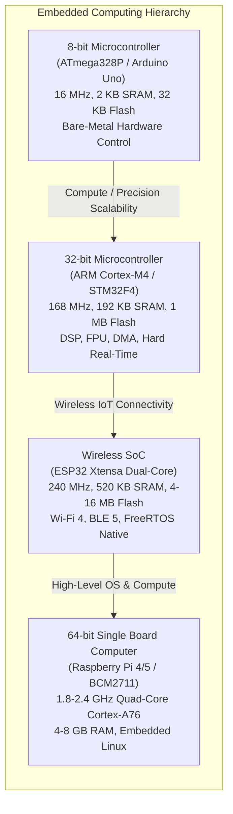

# Embedded Systems & Hardware Firmware Engineering

A comprehensive, industry-grade reference curriculum on embedded systems architecture, firmware engineering, bare-metal programming, real-time operating systems (RTOS), and single-board computers. This repository bridges theoretical hardware engineering with practical, production-level C/C++ firmware across the **Arduino (AVR)**, **ARM Cortex-M (STM32)**, **ESP32 (IoT & Wireless)**, and **Raspberry Pi (Embedded Linux)** ecosystems.

---

## 📚 Academic & Industry Reference Books

This curriculum synthesizes foundational concepts, mathematical models, and architectural patterns from the definitive texts in embedded systems:

| Book Title | Author(s) | Primary Focus & Domain |
| :--- | :--- | :--- |
| **Making Embedded Systems: Design Patterns for Great Software** | Elecia White (O'Reilly) | Architecture patterns, state machines, hardware abstraction, memory constraints |
| **Embedded Systems: Introduction to ARM Cortex-M Microcontrollers** (Vol 1 & 2) | Jonathan W. Valvano (UT Austin) | Bare-metal ARM Cortex-M, NVIC, timers, ADC, DAC, signal conditioning |
| **Real-Time Operating Systems for ARM Cortex-M Microcontrollers** (Vol 3) | Jonathan W. Valvano (UT Austin) | Hard real-time scheduling, thread switching, semaphores, priority inversion |
| **The Definitive Guide to ARM Cortex-M3 and Cortex-M4 Processors** | Joseph Yiu (Newnes) | Hardware architecture, fault exceptions, MPU, NVIC tail-chaining, bit-banding |
| **Programming Embedded Systems in C and C++** | Michael Barr (O'Reilly) | Memory mapping, bit-manipulation, flash memory architectures, device drivers |
| **Exploring Raspberry Pi: Architecture, Software, Hardware, and Interfacing** | Derek Molloy (Wiley) | Embedded Linux, Device Trees, libgpiod, low-level bus interfacing, kernel modules |
| **Embedded Linux Primer: A Practical Real-World Approach** | Christopher Hallinan (Prentice Hall) | U-Boot, kernel porting, rootfs, busybox, cross-compilation toolchains |
| **Mastering STM32** | Carmine Noviello | STM32Cube HAL/LL, clock configuration (RCC), DMA, multi-channel timers |
| **Real-Time Systems: Design Principles for Distributed Embedded Applications** | Hermann Kopetz (Springer) | Determinism, clock synchronization, CAN bus arbitration, fault tolerance |

---

## 🗺️ Architectural Comparison Matrix: Hardware Platforms



| Feature | Arduino Uno (ATmega328P) | STM32F401 (ARM Cortex-M4) | ESP32-WROOM-32 (Xtensa LX6) | Raspberry Pi 4 (BCM2711) |
| :--- | :--- | :--- | :--- | :--- |
| **Processor Class** | 8-bit AVR RISC | 32-bit ARM Cortex-M4F | 32-bit Tensilica Dual-Core | 64-bit Quad ARM Cortex-A72 |
| **Architecture** | Modified Harvard | Modified Harvard | Harvard | Princeton / Von Neumann |
| **Clock Frequency** | 16 MHz | 84 MHz | Up to 240 MHz | 1.5 - 1.8 GHz |
| **SRAM** | 2 KB | 96 KB | 520 KB | 2 GB, 4 GB, or 8 GB LPDDR4 |
| **Non-Volatile Storage** | 32 KB Flash, 1 KB EEPROM | 512 KB Flash | 4 MB - 16 MB SPI Flash | MicroSD / USB 3.0 SSD (GBs) |
| **Operating Voltage** | 5.0 V | 3.3 V (5V tolerant pins) | 3.3 V | 3.3 V I/O, 5V input power |
| **Operating System** | Bare-Metal Super-Loop | Bare-Metal or RTOS (FreeRTOS) | FreeRTOS (Native dual-core) | Full Linux (Debian / DietPi / Yocto) |
| **Interrupt Latency** | ~4 cycles (250 ns) | 12 cycles (~140 ns, tail-chain) | ~20-30 cycles | Microseconds (Non-deterministic) |
| **Hardware Peripherals** | Timers, ADC (10-bit), UART, SPI, I2C | Timers, ADC (12-bit), DMA, SPI, I2C, CAN, USB, RTC | Timers, ADC, DAC, capacitive touch, SPI, I2C, UART, CAN | PCIe, Gigabit Ethernet, 2x HDMI 4K, USB 3.0, MIPI-CSI/DSI |
| **Wireless Support** | None (External shield needed) | None (External transceiver needed) | Integrated 802.11 b/g/n & BLE 4.2/5 | Dual-Band Wi-Fi 5 & Bluetooth 5.0 |
| **Power Consumption** | ~15-20 mA active, ~1 µA power-down | ~10-40 mA active, ~2 µA standby | ~80-240 mA Wi-Fi, ~10 µA deep sleep | ~600 mA idle, up to 1.5 A load |
| **Primary Domain** | Rapid prototyping, education | Industrial control, automotive, DSP | Connected IoT, sensor nodes, smart home | Edge AI, computer vision, gateways |

---

## 📑 Curriculum & Chapter Roadmap

### [01. Foundations of Embedded Systems & Computer Architecture](file:///Users/kunalkumar/desktop/knowledge-base/Projects/embedded-systems/01.%20Foundations%20of%20Embedded%20Systems%20&%20Computer%20Architecture.md)
- Microcontroller (MCU) vs Microprocessor (MPU) vs System on Chip (SoC).
- Von Neumann vs Harvard memory architectures; instruction and data buses.
- Memory hierarchies: Flash, SRAM, EEPROM, Memory-Mapped I/O (MMIO), and Bit-Banding.
- Processor execution models: Endianness, CPU registers, Program Counter (PC), Stack Pointer (SP), Link Register (LR), Status Register (PSR).
- Reset sequence: Vector table lookup, Stack Pointer initialization, and C-runtime (`_start`).

### [02. Embedded C & Assembly Programming Fundamentals](file:///Users/kunalkumar/desktop/knowledge-base/Projects/embedded-systems/02.%20Embedded%20C%20&%20Assembly%20Programming%20Fundamentals.md)
- Low-level C idioms: `volatile`, `const`, `static`, `inline`, and `register`.
- Bitwise register manipulation macros: `SET_BIT`, `CLEAR_BIT`, `TOGGLE_BIT`, and bitmasks.
- Structure packing, memory alignment, and struct member padding (`#pragma pack`).
- Linker scripts (`.ld`): Memory regions (`MEMORY`), output sections (`.text`, `.rodata`, `.data`, `.bss`), and VMA vs LMA.
- Startup assembly code (`startup.s`), Vector Table definitions, and C-runtime initialization (`__libc_init_array`).
- Inline assembly syntax (`__asm__ volatile`), compiler optimization barriers, and CPU instruction barriers (`DMB`, `DSB`, `ISB`).

### [03. Microcontroller Peripherals & Hardware Interfacing (Bare-Metal)](file:///Users/kunalkumar/desktop/knowledge-base/Projects/embedded-systems/03.%20Microcontroller%20Peripherals%20&%20Hardware%20Interfacing%20%28Bare-Metal%29.md)
- General Purpose Input/Output (GPIO): Push-pull vs Open-drain, internal pull-up/down, slew rate, Schmitt triggers.
- Timers and Counters: Prescalers, Auto-Reload Registers (ARR), Input Capture, Output Compare, and Pulse Width Modulation (PWM).
- Interrupts & NVIC: Nested Vectored Interrupt Controller, priority grouping, tail-chaining, latency, reentrancy, and debouncing.
- Analog-to-Digital Converters (ADC): Successive Approximation Register (SAR), sampling frequency, Nyquist criteria, and DMA streaming.
- Watchdog Timers (WDT): Independent Watchdogs (IWDG) vs Window Watchdogs (WWDG); brown-out detectors (BOD).

### [04. Communication Protocols - UART, SPI, I2C, CAN & USB](file:///Users/kunalkumar/desktop/knowledge-base/Projects/embedded-systems/04.%20Communication%20Protocols%20-%20UART,%20SPI,%20I2C,%20CAN%20&%20USB.md)
- **UART / USART**: Asynchronous framing, start/stop/parity bits, baud rate generation, circular ring buffers with interrupt service routines.
- **I2C**: Open-drain topology, pull-up resistor sizing math, 7-bit/10-bit addressing, clock stretching, bus arbitration, repeated START.
- **SPI**: Synchronous full-duplex, 4-wire bus, clock polarity (CPOL) and phase (CPHA) modes 0–3, multi-slave topologies.
- **CAN Bus**: Differential signaling (CAN_H / CAN_L), dominant vs recessive bits, non-destructive bitwise arbitration, frame structure, CRC, CAN FD.
- **USB**: Differential pair signaling (D+/D-), NRZI, bit stuffing, token/data/handshake packets, USB CDC and HID device classes.

### [05. Arduino Ecosystem - Architecture, Internals & Hardware Interfacing](file:///Users/kunalkumar/desktop/knowledge-base/Projects/embedded-systems/05.%20Arduino%20Ecosystem%20-%20Architecture,%20Internals%20&%20Hardware%20Interfacing.md)
- ATmega328P AVR architecture: Register file (R0-R31), I/O registers, status register (SREG), flash bootloader (Optiboot).
- Anatomy of the Arduino Core: Inside `main.cpp`, `wiring.c`, timer0 overflow ISR driving `millis()` and `micros()`.
- Abstraction overhead benchmark: `digitalWrite()` (50+ assembly instructions) vs Direct Port Manipulation (`PORTB |= (1 << 5)`, 1 instruction).
- Interfacing sensors: Ultrasonic (HC-SR04), Environmental (BME280), 6-DOF IMU (MPU6050 with DMP).
- Interfacing actuators: Relay modules (flyback diodes, optoisolation), Servo motors (50 Hz PWM), Stepper motors (A4988 / TMC2209 driver).

### [06. Modern Microcontrollers - ARM Cortex-M (STM32) & ESP32 (IoT & Wireless)](file:///Users/kunalkumar/desktop/knowledge-base/Projects/embedded-systems/06.%20Modern%20Microcontrollers%20-%20ARM%20Cortex-M%20%28STM32%29%20&%20ESP32%20%28IoT%20&%20Wireless%29.md)
- **STM32 & CMSIS**: Hardware Abstraction Layer (HAL) vs Low-Layer (LL) drivers, Reset and Clock Control (RCC) clock tree setup.
- Direct Memory Access (DMA): Circular vs normal mode, memory-to-peripheral, peripheral-to-memory, zero-copy buffer processing.
- **ESP32 Architecture**: Dual-core Xtensa LX6 / RISC-V, ESP-IDF framework, FreeRTOS symmetric multiprocessing (SMP).
- Wireless IoT networking: Wi-Fi STA/AP, BLE GATT server/client architecture, ESP-NOW protocol, MQTT over mTLS.
- Power optimization: Sleep modes (Active, Modem Sleep, Light Sleep, Deep Sleep), Ultra Low Power (ULP) coprocessor operation.

### [07. Single Board Computers - Raspberry Pi, Embedded Linux & Interfacing](file:///Users/kunalkumar/desktop/knowledge-base/Projects/embedded-systems/07.%20Single%20Board%20Computers%20-%20Raspberry%20Pi,%20Embedded%20Linux%20&%20Interfacing.md)
- Hardware architecture: Broadcom BCM2711 SoC, VideoCore VI GPU, ARM Cortex-A72, 40-pin GPIO pinout and multiplexing.
- Embedded Linux boot sequence: ROM bootloader, VideoCore firmware (`bootcode.bin`, `start.elf`), Linux kernel (`zImage`), Device Tree Blobs (`.dtb`).
- Modern Linux GPIO with `libgpiod`: Why `/sys/class/gpio` is deprecated, character device interface (`/dev/gpiochip*`), event monitoring.
- Kernel bus interfaces: `/dev/i2c-*`, `/dev/spidev*.*`, `/dev/ttyAMA*`.
- Real-Time Linux with `PREEMPT_RT`: Kernel compilation, deterministic thread scheduling, latency profiling via `cyclictest`.

### [08. Real-Time Operating Systems (RTOS) - FreeRTOS & Zephyr](file:///Users/kunalkumar/desktop/knowledge-base/Projects/embedded-systems/08.%20Real-Time%20Operating%20Systems%20%28RTOS%29%20-%20FreeRTOS%20&%20Zephyr.md)
- RTOS core principles: Determinism vs throughput, hard vs soft real-time systems.
- Task Control Block (TCB), task states, context switching via SysTick and PendSV interrupt handlers.
- Schedulers: Preemptive fixed-priority, cooperative round-robin, Rate Monotonic Scheduling (RMS).
- Inter-task synchronization: Binary/counting semaphores, mutexes with Priority Inheritance (preventing Priority Inversion), queues, event groups.
- Memory management strategies: FreeRTOS `heap_1` through `heap_5`, stack overflow hook detection.
- Introduction to Zephyr RTOS: DeviceTree integration, Kconfig, CMake/West build workflow.

### [09. Sensors, Actuators & Power Electronics Interfacing](file:///Users/kunalkumar/desktop/knowledge-base/Projects/embedded-systems/09.%20Sensors,%20Actuators%20&%20Power%20Electronics%20Interfacing.md)
- Analog signal conditioning: Operational amplifiers (buffer, non-inverting, differential, active low-pass filtering).
- Sensor fusion algorithms: Complementary filter and Madgwick filter implementation for 6-DOF / 9-DOF IMU orientation tracking.
- Power switching: BJT vs Logic-Level N-Channel / P-Channel MOSFETs, gate capacitance, gate drivers, inductive spike suppression (flyback diodes).
- Motor drivers: H-Bridge topology, shoot-through prevention, dead-time insertion, PWM frequency selection.
- Power supply design: Linear Low-Dropout (LDO) regulators vs Buck/Boost Switched-Mode Power Supplies (SMPS), decoupling capacitor rules.

### [10. Embedded Software Testing, Debugging & Production Firmware Engineering](file:///Users/kunalkumar/desktop/knowledge-base/Projects/embedded-systems/10.%20Embedded%20Software%20Testing,%20Debugging%20&%20Production%20Firmware%20Engineering.md)
- Hardware debugging interfaces: JTAG boundary scan, ARM Serial Wire Debug (SWD), Instrumentation Trace Macrocell (ITM).
- Logic analyzer and oscilloscope workflows: Decoding I2C/SPI packets, troubleshooting clock jitter, bus contention, and rise time violations.
- Firmware architectural patterns: Event-driven finite state machines (FSM), hierarchical state charts, ring buffer circular queues.
- Safety & Reliability: MISRA-C guidelines, static analysis tools, ARM Cortex-M Fault Handlers (`HardFault`, `BusFault`, `MemManage`).
- Bootloader engineering: Dual-bank Flash partitions, secure boot, firmware integrity verification via SHA-256 and ECC signatures, OTA update lifecycles.

### [11. Hands-On Hardware Labs - Arduino Projects & Sensor Interfacing](file:///Users/kunalkumar/desktop/knowledge-base/Projects/embedded-systems/11.%20Hands-On%20Hardware%20Labs%20-%20Arduino%20Projects%20&%20Sensor%20Interfacing.md)
- **Lab 1**: Closed-Loop Digital PID Temperature Controller with K-Type Thermocouple (MAX6675 SPI), MOSFET PWM, and anti-windup clamping.
- **Lab 2**: Autonomous Obstacle-Avoiding Robotic Vehicle with Pin Change Interrupt (PCINT) optical wheel encoders, TB6612FNG H-bridge, and servo-panned ultrasonic sensor.
- **Lab 3**: Smart RFID Biometric Access Controller with MFRC522 SPI, EEPROM non-volatile encrypted card whitelist, and flyback-protected solenoid door lock.
- **Lab 4**: Mini Digital Storage Oscilloscope (DSO) & Logic Probe on $128\times 64$ SSD1306 OLED utilizing free-running $38.4\text{ kHz}$ ADC with software trigger alignment.
- **Lab 5**: Precision Off-Grid Environmental Data Logger operating for 2+ years on AA batteries using Watchdog Timer Power-Down Deep Sleep ($< 15\,\mu\text{A}$ draw), BME280 I2C, and SPI MicroSD logging.

### [12. Raspberry Pi Hardware Labs - Components, Interfacing & Real-World Use Cases](file:///Users/kunalkumar/desktop/knowledge-base/Projects/embedded-systems/12.%20Raspberry%20Pi%20Hardware%20Labs%20-%20Components,%20Interfacing%20&%20Real-World%20Use%20Cases.md)
- **Key Hardware Component Deep Dive**: MIPI-CSI Camera Module 3 (IMX708 with PDAF autofocus) vs HQ Camera, PCIe M.2 NVMe SSD storage ($> 800\text{ MB/s}$), I2S digital audio (INMP441 MEMS microphone), PoE+ (802.3at $25.5\text{ W}$) HAT, and CAN Bus MCP2515 SPI expansion.
- **Lab 1**: Smart Edge AI Vision Security Camera with Picamera2, OpenCV, MobileNet SSD deep neural network detection, and instant photo Telegram bot alerts.
- **Lab 2**: Industrial IoT Telemetry Gateway polling RS-485 Modbus RTU meters, bridging to local Mosquitto MQTT broker, InfluxDB v2, and Grafana dashboards.
- **Lab 3**: High-Performance Network Ad-Blocking DNS Sinkhole (Pi-hole container + Unbound recursive DNS) & Gigabit NVMe Samba NAS.
- **Lab 4**: Low-Latency High-Precision Motor Motion Controller with `PREEMPT_RT` Real-Time Linux kernel and POSIX `clock_nanosleep(CLOCK_MONOTONIC)` deterministic stepping.
- **Lab 5**: Localized Edge Home Automation Hub with Home Assistant OS, Zigbee 3.0 CC2652P USB coordinator mesh, and sub-20ms local automation rules.

---

## 🛠️ Recommended Laboratory & Hardware Equipment

To execute the practical firmware and hardware experiments in this curriculum, the following hardware lab setup is recommended:

```
+-------------------------------------------------------------------------------+
|                           RECOMMENDED LAB BENCH                              |
+-------------------------------------------------------------------------------+
| Development Boards:                                                           |
|   - Arduino Uno R3 / R4 (ATmega328P or Renesas RA4M1)                         |
|   - STM32 Nucleo-F401RE or Nucleo-G474RE (ARM Cortex-M4 with ST-LINK/V2-1)     |
|   - ESP32-WROOM-32 Development Board (Dual-Core Xtensa with micro-USB)        |
|   - Raspberry Pi 4 Model B (4GB RAM) or Raspberry Pi 5 with Raspbian OS       |
|                                                                               |
| Diagnostic Instrumentation:                                                   |
|   - 8-Channel USB Logic Analyzer (24 MHz, Saleae compatible)                  |
|   - Digital Storage Oscilloscope (2-channel, 50-100 MHz bandwidth)            |
|   - Digital Multimeter (True-RMS with continuity, resistance, capacitance)    |
|   - Hardware Debugger: ST-LINK/V2, J-Link EDU Mini, or Raspberry Pi Debug Probe|
|                                                                               |
| Sensors & Actuators:                                                          |
|   - Environmental: BME280 (I2C/SPI temperature, humidity, barometric pressure)|
|   - Motion/IMU: MPU-6050 or ISM330DHCX (6-axis accelerometer + gyroscope)     |
|   - Actuators: SG90 Micro Servo, 28BYJ-48 Stepper with ULN2003, N20 DC Motor  |
|   - Power components: L298N / TB6612FNG H-Bridge, Logic-Level IRLZ44N MOSFETs|
|   - Passive components: 0.1 uF MLCCs, 10 uF Electrolytics, 330R, 4.7k, 10k res|
+-------------------------------------------------------------------------------+
```
