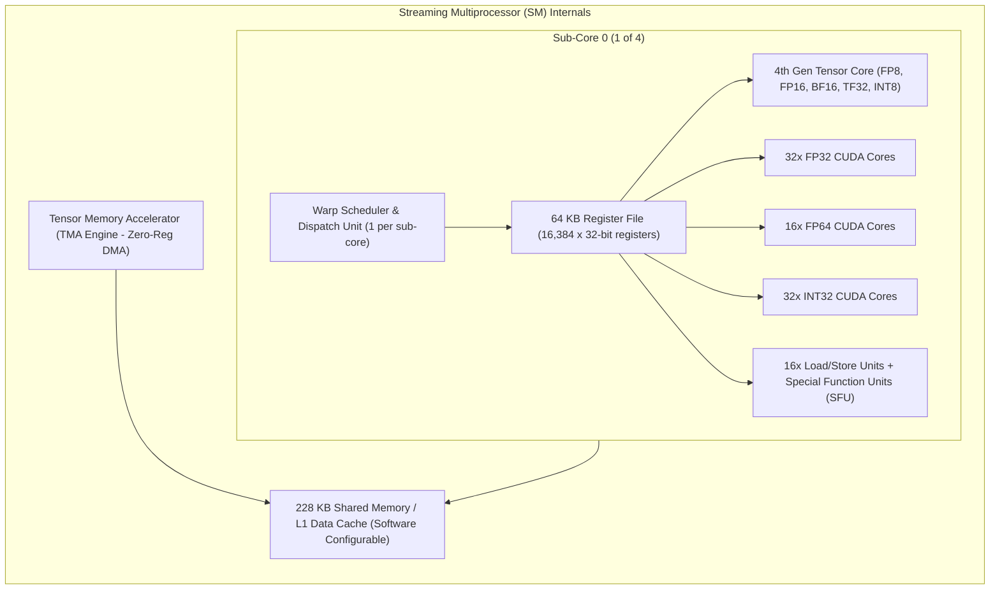
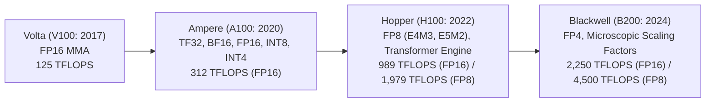
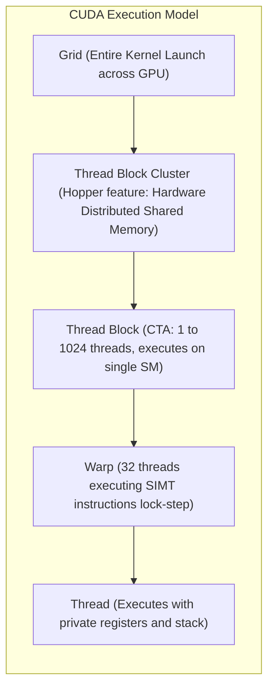

# 01. GPU Architecture & Microarchitectural Internals

> **References & Influential Literature:**
> - *NVIDIA Hopper Architecture In-Depth* (NVIDIA Whitepaper)
> - *NVIDIA Blackwell Architecture Technical Whitepaper* (NVIDIA Whitepaper)
> - *CUDA Programming Guide & PTX ISA Manual* — NVIDIA Corporation
> - *Parallel Computer Architecture: A Hardware/Software Approach* — David Culler & Jaswinder Pal Singh

---

## 1. High-Level GPU Anatomy: From Die to Streaming Multiprocessors

Modern data-center accelerators (e.g., NVIDIA H100 SXM5, Blackwell B200) are massive multi-core stream engines designed around **Single Instruction, Multiple Threads (SIMT)**. Rather than dedicating silicon area to massive branch predictors, large out-of-order execution windows, and deep speculative pipelines like general-purpose CPUs, GPUs maximize silicon area devoted to **raw arithmetic compute units (ALUs and Tensor Cores)** and **ultra-wide memory bandwidth**.

```
+-------------------------------------------------------------------------------+
|                       NVIDIA H100 SXM5 FULL SILICON DIE                       |
|   (TSMC 4N, 814 mm^2, 80 Billion Transistors, 132 SMs Enabled in SXM5)       |
|                                                                               |
|  +-------------------------------------------------------------------------+  |
|  | 8x Graphics Processing Clusters (GPCs)                                  |  |
|  | - Each GPC contains 9x Texture Processing Clusters (TPCs)               |  |
|  | - Each TPC contains 2x Streaming Multiprocessors (SMs)                  |  |
|  | - Total: 144 physical SMs on die, 132 active in production SXM5          |  |
|  +-------------------------------------------------------------------------+  |
|                                     |                                         |
|                     High-Speed Crossbar Interconnect                          |
|                                     v                                         |
|  +-------------------------------------------------------------------------+  |
|  | 50 MB High-Bandwidth L2 Cache (Divided into 2 Partitions)               |  |
|  +-------------------------------------------------------------------------+  |
|                                     |                                         |
|                   6x HBM3 Stacks (80 GB Total Capacity)                       |
|                   5120-bit Memory Interface @ 3.35 TB/s                       |
|                                     |                                         |
|  +-------------------------------------------------------------------------+  |
|  | 4th Gen NVLink (18 Links: 900 GB/s Bidirectional) + PCIe Gen 5 x16      |  |
|  +-------------------------------------------------------------------------+  |
+-------------------------------------------------------------------------------+
```

---

## 2. Streaming Multiprocessor (SM) Microarchitecture

The **Streaming Multiprocessor (SM)** is the core computational building block of the GPU. On the NVIDIA Hopper architecture, each SM is divided into **4 distinct processing blocks (sub-cores)**.



### 2.1 SM Execution Mechanics: Warps and Scheduling
- **The Warp**: The fundamental execution unit in CUDA is a **Warp**, consisting of **32 parallel threads**. All 32 threads in a warp execute the same instruction simultaneously on separate data lanes.
- **Dual Warp Schedulers**: Each of the 4 sub-cores contains its own warp scheduler capable of selecting one ready warp per cycle and dispatching instructions across available execution units.
- **Latency Hiding via Concurrency**: GPUs do not eliminate memory latency with massive caches; they **hide latency by switching warps**. When Warp 0 issues a global memory load (costing 400 clock cycles), the warp scheduler instantly swaps to Warp 1, Warp 2, etc., keeping compute units 100% utilized.

---

## 3. Tensor Cores: Specialized Matrix Multiplication Engines

While standard CUDA cores compute one multiply-accumulate per cycle ($y = a \times b + c$), **Tensor Cores** execute full matrix multiply-accumulate (**MMA**) operations directly in hardware silicon:

$$D = A \times B + C$$

```
Matrix A (M x K)  x  Matrix B (K x N)  +  Matrix C (M x N)  =  Matrix D (M x N)
```

```
MMA Instruction: mma.sync.aligned.m16n8k16.row.col
A Warp of 32 threads collaboratively loads 16x16 and 16x8 matrix tiles into registers
and computes 4,096 floating-point operations in a single hardware cycle!
```

### 3.1 Numerical Formats & Tensor Core Throughput Evolution



| Precision Format | Sign Bits | Exponent Bits | Mantissa Bits | Dynamic Range | Primary LLM Workload Phase |
| :--- | :--- | :--- | :--- | :--- | :--- |
| **FP32** | 1 | 8 | 23 | $10^{\pm 38}$ | Master weights, optimizer states (Adam) |
| **TF32 (TensorFloat)**| 1 | 8 | 10 | $10^{\pm 38}$ | FP32 drop-in acceleration (No code change) |
| **BF16 (Bfloat16)**| 1 | 8 | 7 | $10^{\pm 38}$ | Standard LLM pre-training activations/weights |
| **FP16** | 1 | 5 | 10 | $10^{\pm 5}$ | High precision inference / vision models |
| **FP8 (E4M3)** | 1 | 4 | 3 | $\pm 448$ | Forward pass GEMM activations and weights |
| **FP8 (E5M2)** | 1 | 5 | 2 | $\pm 57,344$ | Backward pass GEMM gradients (Wide range) |

---

## 4. Tensor Memory Accelerator (TMA) & Asynchronous Transfer

In pre-Hopper architectures (Ampere and earlier), loading data from Global Memory (HBM) into Shared Memory (SRAM) required routing every 32-bit word through CPU registers:

```
Pre-Hopper (Ampere):
Global Memory (HBM) ---> [CPU Register File: R0..R31] ---> Shared Memory (SRAM)
(Wastes register space, burns SM instruction cycles, limits occupancy)
```

Hopper introduced the **Tensor Memory Accelerator (TMA)**:
- An autonomous hardware direct-memory-access (DMA) engine.
- Bypasses the register file entirely:
  $$\text{Global Memory (HBM)} \xrightarrow{\text{TMA Hardware Bus}} \text{Shared Memory (SRAM)}$$
- Computes multidimensional tensor address strides (e.g., 5D tensor slicing) directly in silicon without software address calculation instructions.
- Works synchronously with **Asynchronous Transaction Barriers (`mbarrier`)**, allowing threads to initiate asynchronous data prefetching and proceed with computation immediately.

---

## 5. Memory Hierarchy & Coalescing Mechanics

Data movement is the primary performance bottleneck in deep learning. Accelerators arrange memory in a steep hierarchy of bandwidth and capacity:

```
+-------------------------------------------------------------------------------+
| Level                 | Capacity (H100) | Bandwidth     | Latency             |
+-------------------------------------------------------------------------------+
| Register File         | ~33 MB total    | ~30 TB/s      | ~1 cycle (~1 ns)    |
| Shared Memory / L1    | 228 KB / SM     | ~15 TB/s      | ~15-30 cycles       |
| L2 Cache (Crossbar)   | 50 MB unified   | 12 TB/s       | ~150-200 cycles     |
| High Bandwidth (HBM3) | 80 GB           | 3.35 TB/s     | ~400-600 cycles     |
| Host Memory (RAM via PCIe)| 1-2 TB      | 64 GB/s       | ~10,000+ cycles     |
+-------------------------------------------------------------------------------+
```

### 5.1 Memory Coalescing: Maximizing HBM Efficiency
The GPU memory controller serves global memory accesses in **32-byte or 128-byte aligned cache lines**.
- **Coalesced Access**: If thread 0 accesses address `0x00`, thread 1 accesses `0x04`, thread 2 accesses `0x08`, etc., all 32 threads in the warp are serviced by a **single 128-byte memory transaction**.
- **Uncoalesced (Strided) Access**: If threads access memory with large strides or random pointer indirections, the hardware issues up to **32 separate memory transactions**, wasting $96\%$ of memory bus bandwidth!

```
Coalesced (Optimal: 1 Transaction):
Warp Threads:  [ T0 | T1 | T2 | T3 | ... | T31 ]
Memory Bus:    [ Byte 0-127 Aligned Cache Line ] -> 100% Efficiency

Uncoalesced (Pathological: 32 Transactions):
Warp Threads:  [ T0 ] ----------> [ T1 ] ----------> [ T2 ] ...
Memory Bus:    [ 128B Line ]      [ 128B Line ]      [ 128B Line ] -> 3.1% Efficiency!
```

### 5.2 Shared Memory Bank Conflicts
Shared memory is divided into **32 independent memory banks**, each 4 bytes (32 bits) wide:

$$\text{Bank Index} = \left(\frac{\text{Byte Address}}{4}\right) \pmod{32}$$

- **Conflict-Free**: When each of the 32 threads in a warp accesses an address in a distinct bank, all 32 accesses complete simultaneously in **1 clock cycle**.
- **Bank Conflict**: If 2 or more threads access different addresses within the **same bank**, the requests are **serialized**:
  $$\text{Latency Multiplier} = K \quad (K\text{-way bank conflict})$$
- **Broadcast Exception**: If all 32 threads access the exact same address in a bank, the hardware performs a single-cycle **broadcast** with zero penalty.

---

## 6. Thread Execution Hierarchy & Occupancy Calculation



### 6.1 Theoretical vs. Achieved Occupancy
**Occupancy** is the ratio of active warps executing on an SM to the maximum theoretical warps supported by the hardware (e.g., 64 warps = 2,048 threads per SM on H100):

$$\text{Occupancy} = \frac{\text{Active Warps per SM}}{\text{Max Theoretical Warps per SM}}$$

Occupancy is constrained by three physical hardware limits:
1. **Registers per Thread**: Each SM possesses 65,536 registers. If a kernel uses 64 registers per thread, an SM can host at most:
   $$\frac{65,536}{64} = 1,024\text{ threads} = 32\text{ warps} \implies \mathbf{50\%\text{ Occupancy}}$$
2. **Shared Memory per Block**: An SM provides 228 KB. If each block requests 120 KB of shared memory, only 1 block can reside on the SM at a time, regardless of warp counts.
3. **Thread Blocks per SM**: Hardware limit (e.g., maximum 32 blocks per SM).
