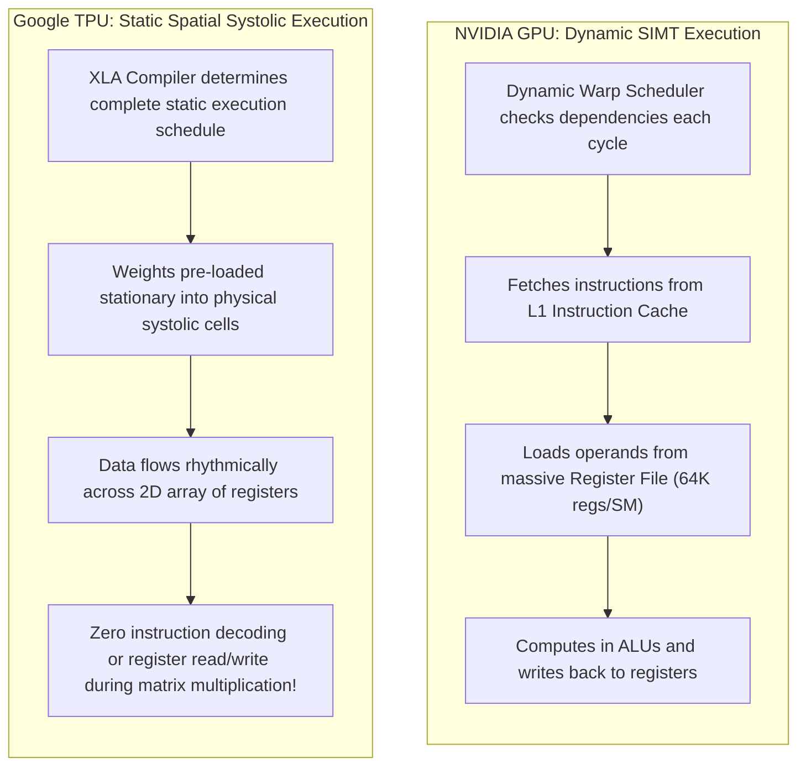
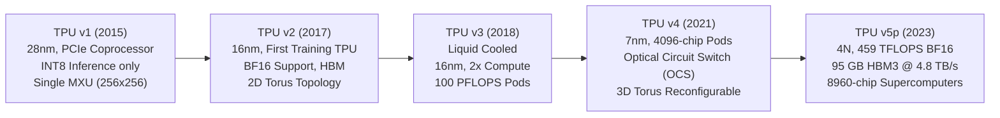
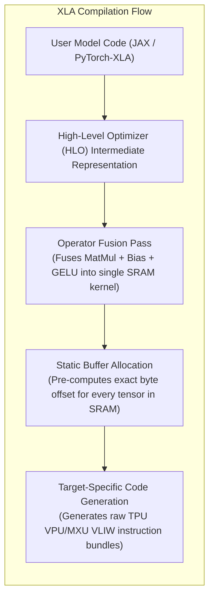

# 02. TPU Architecture & Systolic Array Deep Dive

> **References & Influential Literature:**
> - *In-Datacenter Performance Analysis of a Tensor Processing Unit* — Norman P. Jouppi et al. (Google, ISCA 2017)
> - *TPU v4: An Optically Reconfigurable Supercomputer for Machine Learning with Hardware Support for Embeddings* — Norman P. Jouppi et al. (Google, ISCA 2023)
> - *A Domain-Specific Architecture for Deep Neural Networks* — David Patterson & Norman Jouppi (Communications of the ACM, 2020)
> - *OpenXLA Project Documentation & Compiler Architecture* — Google / OpenXLA Consortium

---

## 1. Architectural Philosophy: SIMT (GPU) vs. Systolic Compute (TPU)

While NVIDIA GPUs rely on **Single Instruction, Multiple Threads (SIMT)** with dynamic warp schedulers and multi-tiered caches to handle arbitrary parallel workloads, Google's **Tensor Processing Unit (TPU)** is a **Domain-Specific Architecture (DSA)** engineered specifically for dense multi-dimensional tensor linear algebra.



### 1.1 Why Systolic Arrays Outperform SIMT in Pure Matrix Math
In a standard CPU or GPU, every single multiply-accumulate operation ($y = a \cdot b + c$) requires:
1. Fetching instruction from cache.
2. Reading operand $a$ from the register file.
3. Reading operand $b$ from the register file.
4. Reading accumulator $c$ from the register file.
5. Executing multiplication and addition in an ALU.
6. Writing result back to the register file.

**Register file access consumes significantly more electrical energy and silicon area than the actual arithmetic operation!**
In a **Systolic Array**, data flows directly from one physical arithmetic unit to its direct neighbor without ever touching a register file or cache.

---

## 2. Matrix Multiply Unit (MXU): The 2D Systolic Array

The core computational engine of every TPU generation is the **Matrix Multiply Unit (MXU)**, an autonomous $128 \times 128$ or $256 \times 256$ 2D grid of hardware Multiply-Accumulate (MAC) cells.

```
                  Activations Stream In Horizontally (Shifted by 1 cycle per row)
                           A00    A01    A02    A03
                           ---    A10    A11    A12
                                  ---    A20    A21
                                         ---    A30
                                  |
                                  v
             +----------+----------+----------+----------+
             | Cell 0,0 | Cell 0,1 | Cell 0,2 | Cell 0,3 |
             +----------+----------+----------+----------+
             | Cell 1,0 | Cell 1,1 | Cell 1,2 | Cell 1,3 |
             +----------+----------+----------+----------+
             | Cell 2,0 | Cell 2,1 | Cell 2,2 | Cell 2,3 |
             +----------+----------+----------+----------+
             | Cell 3,0 | Cell 3,1 | Cell 3,2 | Cell 3,3 |
             +----------+----------+----------+----------+
                                  |
                                  v
                Partial Sums Emerge Vertically from Bottom:
                           C00    C01    C02    C03
```

### 2.1 Mechanical Step-by-Step Dataflow
1. **Weight Stationary Mode**: Prior to computation, a $128 \times 128$ tile of model weights is pre-loaded into internal registers inside each cell and held stationary.
2. **Activation Ingestion**: Activation values $A_{i,j}$ are streamed into the left edge of the array. Each successive row is delayed (skewed) by **1 clock cycle** to align with the arrival of partial sums.
3. **Pipelined Multiplication**:
   - At clock cycle $t$, Cell $(r, c)$ multiplies its incoming horizontal activation by its stationary weight:
     $$P = A_{\text{in}} \times W_{r,c}$$
   - It adds this product to the partial sum arriving from the cell directly above it:
     $$\text{Sum}_{\text{out}} = \text{Sum}_{\text{in}} + P$$
   - It passes the activation $A_{\text{in}}$ to the cell directly to its right:
     $$A_{\text{out}} = A_{\text{in}}$$
   - It passes $\text{Sum}_{\text{out}}$ to the cell directly below it.
4. **Output Extraction**: Completed matrix multiplication results emerge from the bottom edge of the array after passing through all 128 stages.

### 2.2 Mathematical Compute Throughput of a Single MXU
A $128 \times 128$ systolic array operating at $1.0\text{ GHz}$:
$$\text{MACs per Cycle} = 128 \times 128 = 16,384\text{ MACs}$$
Since each multiply-accumulate represents 2 operations (1 multiplication + 1 addition):
$$\text{Operations per Cycle} = 16,384 \times 2 = 32,768\text{ FLOPs per Cycle}$$
$$\text{Throughput at } 1.05\text{ GHz} = 32,768 \times 1.05 \times 10^9 = \mathbf{34.4\text{ TFLOPS (BF16)}}$$
A TPU v4 chip packs **4 independent MXUs per core (2 cores per chip)**, yielding **$275\text{ TFLOPS}$** of dense bfloat16 matrix compute.

---

## 3. TPU Generation Evolution: v1 to v5p & v6e



| Specification | TPU v2 | TPU v3 | TPU v4 | TPU v5e | TPU v5p |
| :--- | :--- | :--- | :--- | :--- | :--- |
| **Year Deployed** | 2017 | 2018 | 2021 | 2023 | 2023 |
| **Process Node** | TSMC 16nm | TSMC 16nm | TSMC 7nm | TSMC 5nm | TSMC 4N |
| **Peak BF16 TFLOPS** | 45 | 123 | 275 | 197 | **459** |
| **HBM Memory Type** | 16 GB HBM | 32 GB HBM2 | 32 GB HBM2 | 16 GB HBM2 | **95 GB HBM3** |
| **Memory Bandwidth** | 700 GB/s | 1.3 TB/s | 1.2 TB/s | 819 GB/s | **4.8 TB/s** |
| **Interconnect (ICI)**| 2D Torus | 2D Torus | 3D Torus + OCS | 2D Torus | **3D Torus + OCS** |
| **Max Pod Scale** | 256 chips | 1,024 chips | 4,096 chips | 256 chips | **8,960 chips** |

---

## 4. Optical Circuit Switching (OCS) & 3D Torus Interconnect

The TPU's scale-out network bypasses standard Ethernet or InfiniBand switches entirely. Instead, TPU chips are hardwired in a **3D Torus topology** via high-speed **Inter-Core Interconnect (ICI)** links ($4,800\text{ Gbps per chip}$ on v5p).

```
        +---------+               +---------+
       /         /|              /         /|
      +---------+ |             +---------+ |
      |  TPU    | |  == ICI ==  |  TPU    | |
      | (0,0,0) | +             | (1,0,0) | +
      |         |/              |         |/
      +---------+               +---------+
           ||                        ||
          ICI                       ICI
           ||                        ||
      +---------+               +---------+
     /         /|              /         /|
    +---------+ |             +---------+ |
    |  TPU    | |  == ICI ==  |  TPU    | |
    | (0,1,0) | +             | (1,1,0) | +
    |         |/              |         |/
    +---------+               +---------+
```

### 4.1 Optical Circuit Switches (OCS)
In TPU v4 and v5p pods, the inter-rack connections are routed through **Optical Circuit Switches (OCS)**:
- Uses an array of micro-electro-mechanical system (**MEMS**) mirrors.
- Photons travel through mirrors directly from fiber to fiber **without optical-electrical-optical (OEO) conversion**.
- **Dynamic Topology Reconfiguration**: The cluster can dynamically reshape its 3D Torus dimensions (e.g., from $4 \times 4 \times 16 \to 8 \times 8 \times 8$) to match the communication patterns of 3D parallelism (Tensor vs Pipeline vs Data Parallelism)!
- **Instant Fault Isolation**: If a single TPU or optical fiber fails, the OCS mirrors physically tilt within milliseconds to reroute the torus ring around the damaged hardware, preventing job termination.

---

## 5. The XLA (Accelerated Linear Algebra) Compiler Pipeline

Unlike PyTorch's native eager execution on GPUs (which dispatches discrete CUDA kernels one by one), TPUs execute code compiled ahead-of-time (or just-in-time) through **XLA**:



### 5.1 Operator Fusion: The Secret to High MFU
In eager mode, computing $\text{GELU}(X \cdot W + b)$ requires:
1. Launching GEMM kernel $\to$ write output matrix to HBM.
2. Launching Bias Addition kernel $\to$ read from HBM, add $b$, write to HBM.
3. Launching GELU kernel $\to$ read from HBM, compute non-linearity, write to HBM.
Total: **3 round-trips to HBM!**

XLA's compiler fusions analyze the compute graph and compile a **single unified kernel**:
- Matrix multiplication finishes in MXU $\to$ result piped directly into Vector Processing Unit (VPU) $\to$ bias added and GELU evaluated while data is still in on-chip SRAM $\to$ written to HBM **once**.
- Eliminates memory bandwidth stalls and achieves $> 60\%\text{ Model FLOPs Utilization (MFU)}$.
