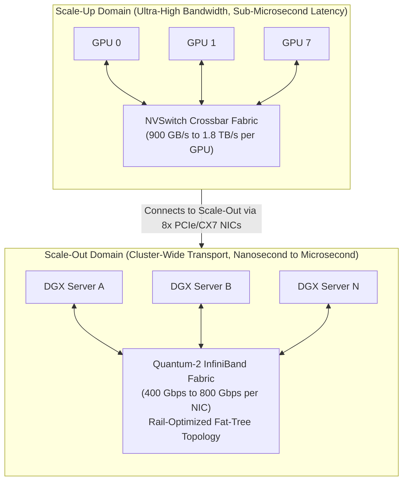
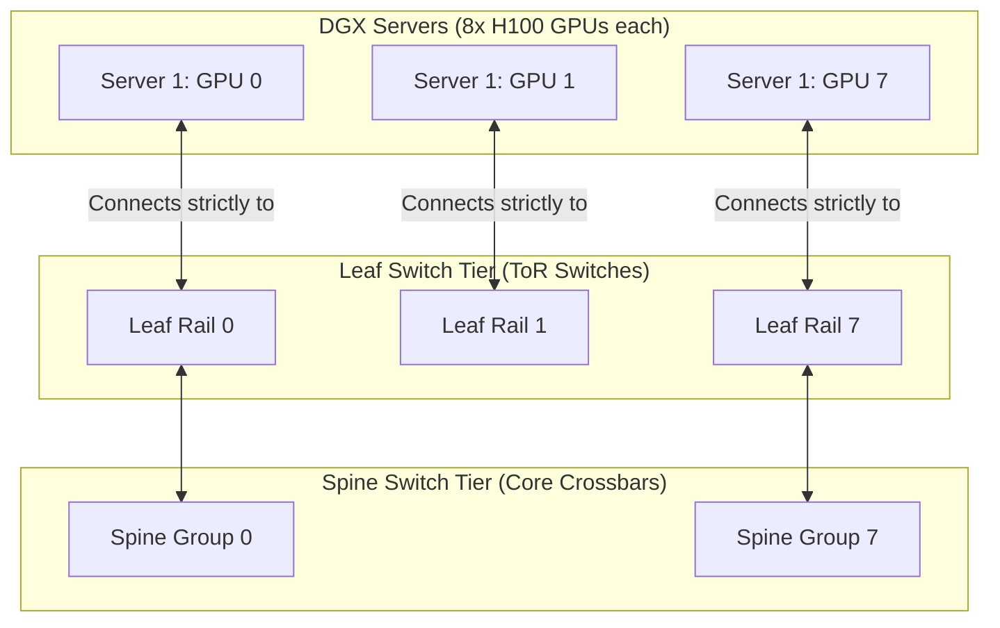

# 03. Datacenter Hardware & High-Speed Interconnects

> **References & Influential Literature:**
> - *NVIDIA Quantum-2 InfiniBand Architecture Whitepaper* — NVIDIA Networking
> - *NVIDIA DGX H100 System Architecture* — NVIDIA Corporation
> - *Building an AI Datacenter: Power, Thermal, and Networking at Hyperscale* — Meta Infrastructure Engineering
> - *Congestion Control for High-Throughput RDMA Networks (DCQCN)* — Yibo Zhu et al. (ACM SIGCOMM 2015)

---

## 1. The Interconnect Hierarchy: Scale-Up vs. Scale-Out

Training a $100\text{B}+$ to $1\text{T}+$ parameter model requires thousands of accelerators working synchronously. The network interconnects must be partitioned into two distinct physical hierarchies:



1. **Scale-Up (Intra-Node / Intra-Rack)**: Connects accelerators via proprietary high-speed fabrics (**NVLink** on NVIDIA, **ICI** on Google TPU). Memory is cache-coherent or memory-mapped across all GPUs in the domain. Bandwidth exceeds **$900\text{ GB/s}$ to $1.8\text{ TB/s}$ per chip**.
2. **Scale-Out (Inter-Node / Cluster-Wide)**: Connects distinct physical server chassis across datacenter rows via **Remote Direct Memory Access (RDMA)** over **InfiniBand (NDR/XDR)** or **RoCEv2**. Bandwidth is **$400\text{ Gbps to }800\text{ Gbps}$ per port ($50\text{ to }100\text{ GB/s}$)**.

---

## 2. NVLink & NVSwitch Deep Dive

Standard PCIe Gen 5 x16 slots offer $64\text{ GB/s}$ bidirectional bandwidth, which is a massive bottleneck for multi-GPU model parallelism. NVIDIA's **NVLink** bypasses PCIe entirely with dedicated high-speed copper interconnect traces directly between GPUs.

### 2.1 NVLink 4 (Hopper) vs. NVLink 5 (Blackwell)
- **NVLink 4 (H100)**:
  - 18 links per H100 chip.
  - Each link uses 2 differential pairs in each direction running at $53.125\text{ Gbaud}$ PAM4 ($50\text{ GB/s}$ bidirectional per link).
  - Total Bandwidth: $18 \times 50\text{ GB/s} = \mathbf{900\text{ GB/s}\text{ Bidirectional}}$ (Over $7\times$ the bandwidth of PCIe Gen 5!).
- **NVLink 5 (Blackwell B200)**:
  - Doubles throughput to **$1.8\text{ TB/s}$ bidirectional per GPU** using 224 Gbps PAM4 signaling.

### 2.2 NVSwitch 3 ASIC & The DGX H100 Substrate
Within an 8-GPU **DGX H100** chassis, the 8 GPUs are not connected in a point-to-point ring. Instead, they connect to **4 on-board NVSwitch 3 ASICs**:

```
[ GPU 0 ]   [ GPU 1 ]   [ GPU 2 ]   [ GPU 3 ]   [ GPU 4 ]   [ GPU 5 ]   [ GPU 6 ]   [ GPU 7 ]
    ||          ||          ||          ||          ||          ||          ||          ||
+-----------------------------------------------------------------------------------------------+
|                      4x NVSWITCH 3 ASICs (Crossbar Non-Blocking Fabric)                       |
|           Total Bisection Bandwidth: 7.2 TB/s | Full Any-to-Any All-to-All                    |
+-----------------------------------------------------------------------------------------------+
```

- Every GPU can read or write to any other GPU's HBM memory at the full $900\text{ GB/s}$ with zero hop penalties.
- **Hardware SHARP (Scalable Hierarchical Aggregation and Reduction Protocol)**: The NVSwitch silicon contains dedicated mathematical reduction units. When doing an All-Reduce sum, the NVSwitches perform the floating-point addition **inside the switch fabric itself**, cutting data traffic in half!

### 2.3 The Blackwell NVL72 Liquid-Cooled Rack
In the Blackwell generation, NVIDIA expanded the NVLink scale-up boundary from an 8-GPU server to an entire **72-GPU rack (NVL72)**:
- 18 compute nodes (36 Grace CPUs + 72 B200 GPUs) connected via an **internal passive copper NVLink backplane**.
- All 72 GPUs share a single unified memory space of **$13.8\text{ TB}$ of HBM3e** with **$130\text{ TB/s}$ of bisection bandwidth**!

---

## 3. Cluster Networking: InfiniBand Quantum-2 vs. RoCEv2

For cluster-wide scale-out across hundreds of servers, two networking technologies dominate:

### 3.1 InfiniBand Quantum-2 (NDR 400G / XDR 800G)
InfiniBand is purpose-built for High-Performance Computing (HPC) and AI:
- **Credit-Based Hardware Flow Control**: A sender never transmits a packet unless the receiving switch buffer has confirmed available credits. **Zero packet loss by physical design**!
- **Ultra-Low Latency**: Sub-microsecond cut-through switching ($\approx 100\text{ to }200\text{ ns}$ port-to-port).
- **Subnet Manager (SM)**: Centralized management daemon computes loop-free routes and guarantees deterministic failover.
- **In-Network Computing (SHARPv3)**: Computes reductions across switches in the network tree.

### 3.2 RoCEv2 (RDMA over Converged Ethernet)
Hyperscalers with existing Ethernet infrastructures (e.g., Meta, Microsoft Azure) utilize **RoCEv2** (UDP-encapsulated InfiniBand transport over standard Ethernet switches).

Because standard Ethernet is fundamentally "best-effort" and drops packets under congestion, RoCEv2 requires careful datacenter tuning:
1. **Priority Flow Control (PFC - IEEE 802.1Qbb)**: Pauses specific traffic classes (CoS 3) when ingress switch buffers reach high watermarks, preventing packet loss.
2. **PFC Deadlock Storms**: Circular buffer dependencies across multi-tier switches can cause pause frames to propagate endlessly, freezing the entire datacenter!
3. **Explicit Congestion Notification (ECN) & DCQCN**:
   - Switches mark ECN bits (`CE = 11b`) in the IP header when queues build up.
   - The receiver generates a **Congestion Notification Packet (CNP)** back to the sending NIC.
   - The sender's hardware immediately throttles its transmission rate using the **DCQCN algorithm**, preventing PFC triggers before buffers overflow.

---

## 4. Datacenter Topology: Rail-Optimized Non-Blocking Fat-Tree

When designing a 16,000-GPU training cluster, naive network topologies suffer from **Hash Polarization** (where multiple heavy flows hash to the same physical uplink) and cross-tier oversubscription.

Modern AI supercomputers employ a **Rail-Optimized Fat-Tree Topology**:



### 4.1 Rail Optimization Mechanics
- Each DGX H100 server houses **8 independent ConnectX-7 400G NICs**, one dedicated to each of the 8 GPUs.
- All "GPU 0" NICs across all servers in the cluster connect to **Leaf Rail 0**.
- All "GPU 1" NICs connect to **Leaf Rail 1**, and so on.
- **Impact on All-Reduce Communication**: During distributed data-parallel gradient synchronization, GPU 0 only communicates with GPU 0 on other servers. Its traffic remains **strictly confined within Rail 0**, completely eliminating cross-rail packet collisions and switch oversubscription!

---

## 5. Facility Engineering: Thermal, Power & Liquid Cooling

Frontier AI clusters push datacenter electrical and mechanical infrastructure to extreme limits:

```
+-------------------------------------------------------------+
|               RACK DENSITY & COOLING THRESHOLDS             |
|                                                             |
|  0 - 15 kW / rack   : Standard Enterprise Air Cooling       |
|  15 - 35 kW / rack  : High-Density Air Cooling (Rear Doors) |
|  40 - 100+ kW / rack: DIRECT-TO-CHIP (D2C) LIQUID COOLING   |
|  120+ kW / rack     : Full Immersion / Cold-Plate Hybrid    |
+-------------------------------------------------------------+
```

### 5.1 Direct-to-Chip (D2C) Liquid Cooling Architecture
At $700\text{ W}$ per H100 GPU and $1,000\text{ W}$ per B200 GPU, air heatsinks cannot physically dissipate heat fast enough to prevent thermal throttling.

```
Warm Facility Water (30 C) ---> [ Coolant Distribution Unit (CDU) ]
                                          |
                                 Deionized Liquid Loop
                                          |
                                          v
+-------------------------------------------------------------------+
|               SERVER CHASSIS DIRECT-TO-CHIP COLD PLATES           |
|  +--------------------+   +--------------------+   +-----------+  |
|  | Copper Cold Plate  |   | Copper Cold Plate  |   | Cold Plate|  |
|  | (Over GPU 0 Die)   |   | (Over GPU 1 Die)   |   | (Over CPU)|  |
|  +--------------------+   +--------------------+   +-----------+  |
+-------------------------------------------------------------------+
                                          |
                                 Hot Return (45 - 50 C)
                                          v
                              [ External Cooling Tower ]
```

- **Coolant Distribution Unit (CDU)**: Manages secondary closed-loop flow of treated deionized water with biocides and corrosion inhibitors.
- **Power Delivery**: High-density AI racks consume up to **$120\text{ kW}$** per rack, requiring **$415\text{V} / 480\text{V}$ 3-phase AC power** routed directly into the rack's busbars, eliminating thick low-voltage copper cabling.
