# 04. Collective Communication Primitives & Algorithms

> **References & Influential Literature:**
> - *Massive Scale Deep Learning for Language Modeling: Ring-Allreduce Architecture* — Andrew Gibiansky (Baidu Research, 2017)
> - *NCCL: NVIDIA Collective Communications Library Architecture & Developer Guide* — Sylvain Jeaugey et al. (NVIDIA)
> - *Bandwidth Optimal All-reduce on Tree Topologies* — Pitch Patarasuk & Xin Yuan (IEEE TPDS, 2009)
> - *Parallel Programming with MPI* — Peter Pacheco

---

## 1. The Collective Communication Primitives

Distributed training across thousands of GPUs is governed by eight fundamental collective communication patterns standardized by MPI and implemented in hardware-accelerated libraries like **NCCL (NVIDIA Collective Communications Library)**:

```mermaid
flowchart TD
    subgraph Primitives ["Collective Communication Taxonomy"]
        direction TB
        Bcast["Broadcast (1 -> All)<br/>Single rank transmits identical tensor to all ranks"]
        Scatter["Scatter (1 -> All Partitioned)<br/>Root splits tensor into P chunks; sends chunk i to rank i"]
        Gather["Gather (All -> 1 Concatenated)<br/>Root collects chunk from each rank; concatenates"]
        AllGather["All-Gather (All -> All Concatenated)<br/>Every rank collects chunks from all others into full tensor"]
        Reduce["Reduce (All -> 1 Aggregated)<br/>Applies associative operator (+, min, max) to root rank"]
        ReduceScatter["Reduce-Scatter (All -> All Reduced Chunks)<br/>Reduces tensor across all ranks; rank i gets chunk i"]
        AllReduce["All-Reduce (All -> All Fully Aggregated)<br/>Every rank gets the complete reduced sum of all inputs"]
        AllToAll["All-to-All (All -> All Transposed / Shuffled)<br/>Every rank sends distinct data chunks to every other rank"]
    end
```



---

## 2. The Ring All-Reduce Algorithm

Before 2017, distributed training relied on a central **Parameter Server**. If $P$ worker GPUs sent their gradients of size $S$ bytes to a central server, the parameter server's network link saturated under $O(P \times S)$ traffic, creating an unscalable bottleneck.

The **Ring All-Reduce** algorithm arranges $P$ GPUs in a logical ring, dividing an $S$-byte tensor into $P$ equal chunks of size $S / P$.

```
                    [ GPU 0 ]
                   /         \
            Chunk 3           Chunk 0
                 /             \
          [ GPU 3 ]             [ GPU 1 ]
                 \             /
            Chunk 2           Chunk 1
                   \         /
                    [ GPU 2 ]
```

### 2.1 Phase 1: Reduce-Scatter (Summation)
The phase executes in $P - 1$ discrete synchronous steps.
- In step $k$, GPU $i$ sends its local chunk $(i - k) \pmod P$ to GPU $(i + 1) \pmod P$.
- Simultaneously, it receives chunk $(i - k - 1) \pmod P$ from GPU $(i - 1) \pmod P$ and **sums it into its local chunk buffer in place**.
- After $P - 1$ steps, each GPU holds the **fully aggregated global sum of exactly one chunk**:
  $$\text{GPU } i \text{ holds the complete sum of Chunk } i$$

### 2.2 Phase 2: All-Gather (Distribution)
The phase executes in another $P - 1$ steps.
- In step $k$, GPU $i$ sends its fully summed chunk to GPU $(i + 1) \pmod P$.
- It receives a fully summed chunk from GPU $(i - 1) \pmod P$ and overwrites its local buffer.
- After $P - 1$ steps, **every GPU holds the complete aggregated tensor of size $S$**!

### 2.3 Mathematical Proof of Bandwidth Optimality
In each step, every GPU sends and receives $S / P$ bytes:

$$\text{Data Sent in Reduce-Scatter} = (P - 1) \times \frac{S}{P}$$

$$\text{Data Sent in All-Gather} = (P - 1) \times \frac{S}{P}$$

$$\text{Total Data Sent per GPU} = 2 \times \left(\frac{P - 1}{P}\right) \times S$$

$$\lim_{P \to \infty} 2 \times \left(\frac{P - 1}{P}\right) \times S = \mathbf{2S}$$

> [!IMPORTANT]
> **The Ring Invariant**: The total data transferred per GPU is bounded strictly at $2S$, **completely independent of the number of GPUs $P$**! Whether scaling across 8 GPUs or 16,000 GPUs, each GPU sends at most $2\times$ its gradient size.

---

## 3. Tree All-Reduce (Double Binary Tree)

While the Ring algorithm is bandwidth-optimal, its **Latency** scales linearly with the number of GPUs:

$$\text{Latency}_{\text{Ring}} = 2(P - 1) \times \alpha$$

Where $\alpha$ is the network link startup latency ($\sim 1\,\mu\text{s}$). When scaling to $P = 16,384$ GPUs, $2(16383) \times 1\,\mu\text{s} \approx \mathbf{32.7\text{ ms}}$ of pure latency per collective call, which is catastrophic for small tensors!

**Double Binary Tree All-Reduce** builds two interleaved binary trees spanning all $P$ ranks:

```
                  Tree 1 (Root: GPU 0)                 Tree 2 (Root: GPU 1)
                        [ GPU 0 ]                            [ GPU 1 ]
                       /         \                          /         \
                  [ GPU 2 ]   [ GPU 4 ]                [ GPU 3 ]   [ GPU 5 ]
                  /       \   /       \                /       \   /       \
                 G6       G8 G10     G12              G7       G9 G11     G13
```

- Data is reduced upwards towards the roots in $\log_2(P)$ steps.
- Fully summed values are broadcast downwards in $\log_2(P)$ steps.
- Latency scales as:
  $$\text{Latency}_{\text{Tree}} = 2 \log_2(P) \times \alpha$$
  For $16,384$ GPUs: $2 \times 14 \times 1\,\mu\text{s} = \mathbf{28\,\mu\text{s}}$ ($1,100\times$ lower latency than Ring!).
- Modern NCCL dynamically switches: **Tree All-Reduce for small/medium tensors** ($< 32\text{ MB}$), **Ring All-Reduce for large tensors** ($> 32\text{ MB}$).

---

## 4. Bus Bandwidth vs. Algorithm Bandwidth (Benchmarking NCCL)

When evaluating cluster networking performance using the industry-standard `nccl-tests` suite, two distinct bandwidth metrics are reported:

### 4.1 Definitions & Mathematical Conversion
1. **Algorithm Bandwidth ($\text{AlgBw}$)**: The raw data size $S$ divided by elapsed time $t$:
   $$\text{AlgBw} = \frac{S}{t}$$
2. **Bus Bandwidth ($\text{BusBw}$)**: The actual physical hardware network traffic delivered across the physical links. For All-Reduce:
   $$\text{BusBw} = \text{AlgBw} \times \frac{2(P - 1)}{P}$$
   For Reduce-Scatter and All-Gather:
   $$\text{BusBw} = \text{AlgBw} \times \frac{P - 1}{P}$$

#### Practical Example (8-GPU H100 Node via NVLink):
- Suppose `all_reduce_perf` reports $\text{AlgBw} = 240\text{ GB/s}$ across $P = 8$ GPUs.
- The true physical hardware throughput being sustained is:
  $$\text{BusBw} = 240 \times \frac{2 \times 7}{8} = 240 \times 1.75 = \mathbf{420\text{ GB/s}}$$

---

## 5. All-to-All: The Backbone of MoE & Context Parallelism

Unlike All-Reduce where all GPUs compute the same global sum, **All-to-All** is a personalized transpose operation:

```
Rank 0 Sends: [ Chunk to R0 | Chunk to R1 | Chunk to R2 | Chunk to R3 ]
Rank 1 Sends: [ Chunk to R0 | Chunk to R1 | Chunk to R2 | Chunk to R3 ]
Rank 2 Sends: [ Chunk to R0 | Chunk to R1 | Chunk to R2 | Chunk to R3 ]
Rank 3 Sends: [ Chunk to R0 | Chunk to R1 | Chunk to R2 | Chunk to R3 ]
                                  |
                                  v
Rank 0 Receives: [ From R0 | From R1 | From R2 | From R3 ]
Rank 1 Receives: [ From R0 | From R1 | From R2 | From R3 ]
Rank 2 Receives: [ From R0 | From R1 | From R2 | From R3 ]
Rank 3 Receives: [ From R0 | From R1 | From R2 | From R3 ]
```

### 5.1 The All-to-All Communication Bottleneck
- Each GPU simultaneously transmits distinct data to all $P - 1$ peers.
- Total traffic across the bisection of the network:
  $$\text{Bisection Traffic} = O(P \times S)$$
- In **Mixture-of-Experts (MoE)** models and **DeepSpeed Ulysses Context Parallelism**, All-to-All is the primary communication barrier, requiring massive crossbar switch bandwidth to avoid head-of-line blocking.
