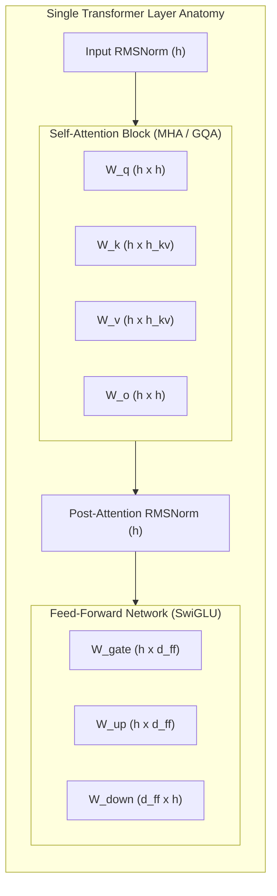
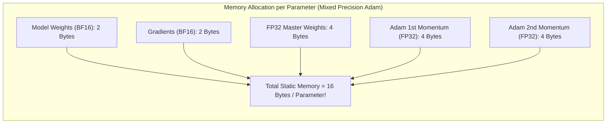

# 05. LLM Pre-Training Math, Memory Anatomy & FLOPs

> **References & Influential Literature:**
> - *Training Compute-Optimal Large Language Models (Chinchilla Paper)* — Jordan Hoffmann et al. (DeepMind, 2022)
> - *Reducing Activation Recomputation in Large Transformer Models* — Vijay Korthikanti et al. (NVIDIA Megatron-LM, 2022)
> - *ZeRO: Memory Optimizations Toward Training Trillion Parameter Models* — Samyam Rajbhandari et al. (Microsoft DeepSpeed, SC 2020)
> - *Scaling Laws for Neural Language Models* — Jared Kaplan et al. (OpenAI, 2020)

---

## 1. Transformer Architecture Parameter Derivation

To calculate memory and compute requirements, we must first mathematically derive the exact parameter count $N$ of a Decoder-Only Transformer (e.g., LLaMA, GPT-4).

```
Notation:
  h = Hidden Dimension (e.g., 4096 for 7B, 8192 for 70B)
  L = Number of Transformer Layers (e.g., 32 for 7B, 80 for 70B)
  V = Vocabulary Size (e.g., 32,000 or 128,256)
  a = Number of Attention Heads
  d_k = Dimension per head = h / a (typically 128)
```



### 1.1 Layer-by-Layer Parameter Counting
1. **Multi-Head Attention (MHA)**:
   - Queries projection $W_q$: $h \times h = h^2$
   - Keys projection $W_k$: $h \times h = h^2$
   - Values projection $W_v$: $h \times h = h^2$
   - Output projection $W_o$: $h \times h = h^2$
   - *Total Attention Parameters per Layer*: $4h^2$ *(In Grouped-Query Attention with ratio $k$, $W_k$ and $W_v$ scale down by $k$)*.
2. **SwiGLU Feed-Forward Network (FFN / MLP)**:
   - Modern LLMs (LLaMA, Mistral) utilize **SwiGLU** activation:
     $$\text{FFN}(x) = (\text{swish}(x W_{\text{gate}}) \odot x W_{\text{up}}) W_{\text{down}}$$
   - Intermediate hidden dimension $d_{\text{ff}} \approx \frac{8}{3} h$:
     - Gate projection $W_{\text{gate}}$: $h \times \frac{8}{3} h = \frac{8}{3} h^2$
     - Up projection $W_{\text{up}}$: $h \times \frac{8}{3} h = \frac{8}{3} h^2$
     - Down projection $W_{\text{down}}$: $\frac{8}{3} h \times h = \frac{8}{3} h^2$
   - *Total MLP Parameters per Layer*: $3 \times \frac{8}{3} h^2 = \mathbf{8h^2}$.
3. **Layer Normalization**:
   - 2 RMSNorm blocks per layer: $2 \times h = 2h$ (negligible).
4. **Embeddings**:
   - Token embedding table: $V \times h$.
   - Output unembedding projection (tied or untied): $V \times h$.

### 1.2 The General Rule of Thumb for Total Parameters
Summing across all $L$ layers:

$$N_{\text{layers}} = L \times (4h^2 + 8h^2) = 12 L h^2$$

$$\text{Total Parameters } N \approx 12 L h^2 + 2 V h$$

For a 70B parameter model ($h = 8192, L = 80, V = 128,256$):
$$N \approx 12 \times 80 \times 8192^2 + 2(128256 \times 8192) = 64.42\text{B} + 2.10\text{B} \approx \mathbf{66.5\text{ Billion Parameters}}$$

---

## 2. The Computational FLOPs Rule ($6N$ vs. $8N$)

How many floating-point operations (FLOPs) are required to process a single token during training?

```
For a linear layer multiplying Matrix X (1 x h) by Weight Matrix W (h x out):
  - Every weight element performs 1 multiplication and 1 addition.
  - Matrix Multiply FLOPs = 2 x (Input Dimension) x (Output Dimension)
```

### 2.1 Forward Pass ($2N$ FLOPs)
Since the forward pass computes matrix-vector products for all $N$ weights in the network:

$$\text{Forward FLOPs per Token} = 2N$$

### 2.2 Backward Pass ($4N$ FLOPs)
The backward pass must compute two distinct matrix multiplications for every linear layer:
1. **Gradients with respect to Inputs ($\frac{\partial L}{\partial X} = \frac{\partial L}{\partial Y} \cdot W^T$)**: Propagates error backwards through the layers ($2N$ FLOPs).
2. **Gradients with respect to Weights ($\frac{\partial L}{\partial W} = X^T \cdot \frac{\partial L}{\partial Y}$)**: Computes parameter updates ($2N$ FLOPs).

$$\text{Backward FLOPs per Token} = 2N + 2N = 4N$$

### 2.3 The Total Training Compute: $6N$ vs. $8N$
- **Standard Training (Without Activation Recomputation)**:
  $$\text{Compute per Token} = \text{Forward} (2N) + \text{Backward} (4N) = \mathbf{6N\text{ FLOPs}}$$
- **Training with Full Activation Checkpointing (Recomputation)**:
  To save GPU memory, activations are discarded during the forward pass and **recomputed from scratch** during the backward pass:
  $$\text{Compute per Token} = \text{Forward} (2N) + \text{Recomputed Forward} (2N) + \text{Backward} (4N) = \mathbf{8N\text{ FLOPs}}$$

### 2.4 Chinchilla Compute Budget Formula
To train a model of parameter count $N$ on a dataset of $D$ tokens:

$$\text{Total Training FLOPs } C = 6 \times N \times D \quad (\text{or } 8 \times N \times D)$$

For a **Llama-3 70B** trained on $15\text{ Trillion}$ tokens:
$$C = 8 \times (70 \times 10^9) \times (15 \times 10^{12}) = \mathbf{8.4 \times 10^{24}\text{ FLOPs}}$$

---

## 3. Model FLOPs Utilization (MFU) vs. Hardware FLOPs Utilization (HFU)

Raw theoretical GPU peak throughput (e.g., $1,979\text{ TFLOPS}$ on H100 FP8) is never achieved in practice due to memory bandwidth stalls, collective communications, and kernel launch latencies.

### 3.1 Mathematical Definitions
1. **Model FLOPs Utilization (MFU)**: The ratio of theoretical minimum compute ($6N$ per token) to the peak hardware capacity:
   $$\text{MFU} = \frac{\text{Observed Throughput (Tokens/sec)} \times 6N}{\text{Number of GPUs} \times \text{Peak Theoretical TFLOPS per GPU}}$$
2. **Hardware FLOPs Utilization (HFU)**: Measures actual physical operations executed, including activation recomputation overhead ($8N$):
   $$\text{HFU} = \frac{\text{Observed Throughput (Tokens/sec)} \times 8N}{\text{Number of GPUs} \times \text{Peak Theoretical TFLOPS per GPU}}$$

> [!TIP]
> In frontier LLM training at hyperscale ($10,000+\text{ GPUs}$), an **MFU between $48\%\text{ and }56\%$** represents world-class distributed cluster efficiency.

---

## 4. GPU Memory Anatomy: Static vs. Dynamic Allocation

GPU Out-of-Memory (OOM) crashes during pre-training are prevented by modeling memory into two distinct categories:

```
Total Memory = Static Footprint (Weights, Gradients, Optimizer) + Dynamic Footprint (Activations, KV Cache)
```



### 4.1 Static Memory Footprint ($16\text{ Bytes per Parameter}$)
Under standard 16-bit mixed-precision training with the Adam optimizer:
- **Model Weights**: $2\text{ bytes}$ (bfloat16 or float16)
- **Gradients**: $2\text{ bytes}$ (bfloat16 or float16)
- **Adam Optimizer States (FP32)**:
  - FP32 copy of master weights: $4\text{ bytes}$ (prevents underflow during weight updates)
  - FP32 First Moment vector $m_t$: $4\text{ bytes}$
  - FP32 Second Moment vector $v_t$: $4\text{ bytes}$
  - *Total Optimizer Memory*: $12\text{ bytes}$

$$\text{Total Static Memory} = 2N + 2N + 12N = \mathbf{16N\text{ Bytes}}$$

#### The 70B Parameter Reality Check:
$$\text{Static RAM Required} = 70 \times 10^9 \times 16\text{ bytes} = \mathbf{1,120\text{ Gigabytes!}}$$
An $80\text{ GB}$ H100 GPU cannot even hold the static states of a 70B model without distributed partitioning (**ZeRO / FSDP / Tensor Parallelism**)!

---

### 4.2 Dynamic Memory Footprint: Activations

**Activations** are intermediate tensor outputs produced during the forward pass and retained in GPU memory to compute gradients during the backward pass.

For sequence length $s$, micro-batch size $b$, hidden dimension $h$, number of attention heads $a$, and layers $L$:

$$\text{Activation Memory without FlashAttention} \approx b \cdot s \cdot L \cdot \left(34h + 5 \cdot a \cdot s\right) \text{ Bytes}$$

Notice the quadratic term: **$5 \cdot b \cdot s^2 \cdot a \cdot L$**!
At long context lengths ($s = 32,768$ or $128,000$), activation memory completely swamps static parameter memory, causing immediate OOM crashes without **FlashAttention** and **Context Parallelism**.
